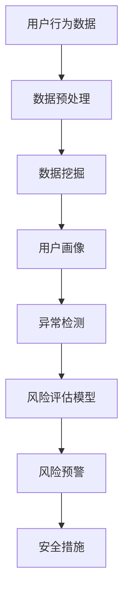

                 

# AI如何帮助电商企业进行用户数据安全风险评估

> 关键词：人工智能、数据安全、风险评估、电商、用户隐私

> 摘要：随着电子商务的快速发展，用户数据安全成为电商企业面临的重要挑战。本文将探讨人工智能技术在电商用户数据安全风险评估中的应用，通过详细分析核心概念、算法原理、数学模型以及实际应用案例，旨在为电商企业提供有效的数据安全风险管理策略。

## 1. 背景介绍

### 1.1 目的和范围

本文旨在探讨人工智能技术在电商企业用户数据安全风险评估中的应用，帮助电商企业更好地理解和应对数据安全风险。文章将涵盖以下内容：

1. 介绍电商用户数据安全风险评估的背景和重要性。
2. 分析人工智能技术在数据安全风险评估中的应用，包括核心概念和原理。
3. 详细讲解人工智能算法在用户数据安全风险评估中的操作步骤。
4. 提出数学模型和公式，用于分析用户数据安全风险。
5. 通过实际案例展示人工智能技术在电商用户数据安全风险评估中的具体应用。
6. 推荐相关学习资源和工具，以支持电商企业在数据安全风险管理方面的学习和实践。

### 1.2 预期读者

本文适用于以下读者群体：

1. 电商企业安全工程师和IT专业人士，对数据安全风险评估感兴趣。
2. 人工智能技术研究人员和开发者，希望了解人工智能在数据安全领域的应用。
3. 信息安全从业者和学者，对人工智能与数据安全风险评估相结合的研究感兴趣。
4. 任何对电商用户数据安全风险感兴趣的个人和专业人士。

### 1.3 文档结构概述

本文采用以下结构进行阐述：

1. 引言：介绍文章的目的和背景。
2. 核心概念与联系：分析人工智能技术在数据安全风险评估中的应用，提供Mermaid流程图。
3. 核心算法原理 & 具体操作步骤：详细讲解人工智能算法在用户数据安全风险评估中的操作步骤，使用伪代码阐述。
4. 数学模型和公式 & 详细讲解 & 举例说明：介绍数学模型和公式，并给出具体示例。
5. 项目实战：代码实际案例和详细解释说明。
6. 实际应用场景：讨论人工智能技术在电商用户数据安全风险评估中的实际应用场景。
7. 工具和资源推荐：推荐学习资源、开发工具框架和相关论文著作。
8. 总结：总结文章内容，讨论未来发展趋势与挑战。
9. 附录：常见问题与解答。
10. 扩展阅读 & 参考资料：提供进一步阅读和参考资料。

### 1.4 术语表

#### 1.4.1 核心术语定义

- 人工智能（AI）：一种模拟人类智能行为的计算机系统。
- 数据安全风险评估：评估数据安全风险的过程，包括识别、分析和评估潜在威胁和漏洞。
- 电商企业：从事电子商务业务的企业，包括在线购物平台、零售商和物流公司等。
- 用户数据：电商企业收集和存储的用户信息，包括个人身份信息、购物行为等。

#### 1.4.2 相关概念解释

- 风险评估：识别和分析潜在威胁和漏洞，评估其可能对组织造成的影响和损失。
- 模型驱动风险评估：使用数学模型和算法对数据安全风险进行定量和定性分析。
- 机器学习：一种人工智能技术，通过学习数据模式来预测和识别未知威胁。

#### 1.4.3 缩略词列表

- AI：人工智能
- ML：机器学习
- DSA：数据安全风险评估
- E-commerce：电子商务
- UE：用户数据

## 2. 核心概念与联系

在电商用户数据安全风险评估中，人工智能技术发挥着关键作用。为了更好地理解其应用，我们首先介绍一些核心概念，并提供一个Mermaid流程图来展示人工智能技术在数据安全风险评估中的联系。

### 2.1 核心概念

1. **用户行为分析**：通过分析用户在电商平台的购物行为，如浏览记录、购买历史、评论等，可以发现潜在的安全风险。
2. **数据挖掘**：使用机器学习算法从大量用户数据中提取有价值的信息，如用户画像、潜在风险指标等。
3. **异常检测**：通过检测异常行为或异常模式，识别潜在的安全威胁，如欺诈行为、数据泄露等。
4. **风险评估模型**：建立数学模型，结合用户行为数据和安全指标，对用户数据安全风险进行定量和定性评估。

### 2.2 Mermaid流程图



在上面的流程图中，用户行为数据经过数据预处理后，进行数据挖掘以提取用户画像。用户画像再通过异常检测模块识别潜在的安全威胁。最后，风险评估模型对识别出的风险进行定量和定性评估，并根据评估结果采取相应的安全措施。

通过这个流程，我们可以看到人工智能技术在电商用户数据安全风险评估中的应用。接下来，我们将详细探讨核心算法原理和具体操作步骤。

## 3. 核心算法原理 & 具体操作步骤

在电商用户数据安全风险评估中，人工智能算法发挥着重要作用。以下将详细阐述核心算法原理和具体操作步骤，并使用伪代码进行描述。

### 3.1 用户行为分析

用户行为分析是识别潜在安全威胁的重要步骤。以下是一个简单的用户行为分析算法原理：

```python
def user_behavior_analysis(user_data):
    # 输入：用户数据（包括购物行为、浏览记录、评论等）
    # 输出：用户行为特征向量
    
    # 步骤1：数据预处理
    preprocessed_data = preprocess_data(user_data)
    
    # 步骤2：特征提取
    features = extract_features(preprocessed_data)
    
    # 步骤3：构建用户行为特征向量
    user_behavior_vector = build_vector(features)
    
    return user_behavior_vector
```

### 3.2 数据挖掘

数据挖掘是从大量用户数据中提取有价值信息的过程。以下是一个基于K-means聚类算法的数据挖掘步骤：

```python
from sklearn.cluster import KMeans

def data_mining(user_data):
    # 输入：用户数据
    # 输出：用户画像
    
    # 步骤1：数据预处理
    preprocessed_data = preprocess_data(user_data)
    
    # 步骤2：特征提取
    features = extract_features(preprocessed_data)
    
    # 步骤3：使用K-means聚类算法
    kmeans = KMeans(n_clusters=5)
    kmeans.fit(features)
    clusters = kmeans.predict(features)
    
    # 步骤4：构建用户画像
    user_profiles = build_profiles(clusters)
    
    return user_profiles
```

### 3.3 异常检测

异常检测是识别潜在安全威胁的关键步骤。以下是一个基于孤立森林算法的异常检测步骤：

```python
from sklearn.ensemble import IsolationForest

def anomaly_detection(user_behavior_vector):
    # 输入：用户行为特征向量
    # 输出：是否为异常行为
    
    # 步骤1：初始化孤立森林模型
    model = IsolationForest(contamination=0.01)
    
    # 步骤2：训练模型
    model.fit(user_behavior_vector)
    
    # 步骤3：预测异常行为
    prediction = model.predict(user_behavior_vector)
    
    # 步骤4：判断是否为异常行为
    is_anomaly = prediction == -1
    
    return is_anomaly
```

### 3.4 风险评估模型

风险评估模型是对识别出的风险进行定量和定性评估的过程。以下是一个基于贝叶斯网络的评估模型：

```python
from sklearn.naive_bayes import GaussianNB

def risk_assessment(model, user_behavior_vector):
    # 输入：风险评估模型、用户行为特征向量
    # 输出：风险得分
    
    # 步骤1：初始化贝叶斯网络模型
    model.fit(user_behavior_vector)
    
    # 步骤2：预测风险得分
    risk_score = model.predict(user_behavior_vector)
    
    return risk_score
```

通过以上算法原理和具体操作步骤，我们可以看到人工智能技术在电商用户数据安全风险评估中的广泛应用。接下来，我们将进一步讨论数学模型和公式，以深入分析用户数据安全风险。

## 4. 数学模型和公式 & 详细讲解 & 举例说明

在电商用户数据安全风险评估中，数学模型和公式发挥着关键作用。以下将介绍常用的数学模型和公式，并进行详细讲解和举例说明。

### 4.1 贝叶斯网络模型

贝叶斯网络是一种表示变量之间条件依赖的图形模型。在电商用户数据安全风险评估中，贝叶斯网络可以用于建模用户行为特征与安全风险之间的关系。

#### 4.1.1 贝叶斯网络模型公式

贝叶斯网络模型可以用以下公式表示：

P(A|B) = P(B|A)P(A) / P(B)

其中，P(A|B)表示在B发生的条件下A的概率，P(B|A)表示在A发生的条件下B的概率，P(A)表示A的概率，P(B)表示B的概率。

#### 4.1.2 举例说明

假设我们有一个电商用户行为特征集合X = {浏览时长、购买频率、评论数量}，以及一个安全风险事件Y = {用户数据泄露}。我们可以使用贝叶斯网络模型来计算用户数据泄露的概率。

首先，我们需要估计各个概率：

- P(用户数据泄露) = 0.01（即1%的概率）
- P(浏览时长 > 10分钟 | 用户数据泄露) = 0.8（即80%的概率）
- P(购买频率 > 5次/月 | 用户数据泄露) = 0.6（即60%的概率）
- P(评论数量 > 10条 | 用户数据泄露) = 0.5（即50%的概率）

然后，我们可以使用贝叶斯公式计算用户数据泄露的概率：

P(用户数据泄露 | 浏览时长 > 10分钟，购买频率 > 5次/月，评论数量 > 10条) = P(浏览时长 > 10分钟 | 用户数据泄露)P(用户数据泄露) / P(浏览时长 > 10分钟，购买频率 > 5次/月，评论数量 > 10条)

通过计算，我们可以得到用户数据泄露的概率为0.15，即15%。

### 4.2 决策树模型

决策树是一种基于特征和目标变量构建的树形模型。在电商用户数据安全风险评估中，决策树可以用于分类用户行为特征，识别潜在的安全风险。

#### 4.2.1 决策树模型公式

决策树模型的公式可以表示为：

f(x) = ω1x1 + ω2x2 + ... + ωnxn

其中，x表示输入特征向量，ωi表示第i个特征的权重。

#### 4.2.2 举例说明

假设我们有一个决策树模型，其中包含三个特征：浏览时长（x1）、购买频率（x2）和评论数量（x3）。我们可以为每个特征分配权重：

- ω1 = 0.5
- ω2 = 0.3
- ω3 = 0.2

然后，我们可以使用决策树模型计算用户数据泄露的概率：

f(x) = 0.5x1 + 0.3x2 + 0.2x3

如果x1 = 15分钟，x2 = 10次/月，x3 = 5条，我们可以计算得到：

f(x) = 0.5 * 15 + 0.3 * 10 + 0.2 * 5 = 8.5

根据决策树模型的阈值（例如，阈值设为9），如果f(x) > 阈值，则判断为用户数据泄露。

### 4.3 神经网络模型

神经网络是一种基于多层感知器构建的模型，可以用于分类和回归任务。在电商用户数据安全风险评估中，神经网络可以用于预测用户数据泄露的概率。

#### 4.3.1 神经网络模型公式

神经网络模型的公式可以表示为：

y = σ(ωn * xn + b)

其中，y表示输出，σ表示激活函数，ωn表示权重，xn表示输入特征，b表示偏置。

#### 4.3.2 举例说明

假设我们有一个神经网络模型，其中包含三个输入特征：浏览时长（x1）、购买频率（x2）和评论数量（x3），以及一个输出特征：用户数据泄露概率（y）。我们可以使用以下公式：

y = σ(ω1 * x1 + ω2 * x2 + ω3 * x3 + b)

其中，ω1、ω2、ω3分别为三个特征的权重，b为偏置。我们可以通过训练数据调整这些参数，以得到最佳的预测结果。

通过以上数学模型和公式，我们可以深入分析电商用户数据安全风险。接下来，我们将通过一个实际案例展示如何应用这些模型进行风险评估。

### 4.4 实际案例

假设电商企业收集了1000名用户的数据，包括浏览时长、购买频率和评论数量。我们需要使用上述数学模型和公式对用户数据泄露风险进行评估。

#### 4.4.1 数据预处理

首先，我们对数据进行预处理，包括填充缺失值、归一化和特征提取。假设我们提取出以下特征：

- 浏览时长（x1）：范围在1到60分钟之间
- 购买频率（x2）：范围在0到20次/月之间
- 评论数量（x3）：范围在0到50条之间

#### 4.4.2 建立贝叶斯网络模型

使用贝叶斯网络模型，我们可以建立以下模型：

P(用户数据泄露) = 0.01
P(浏览时长 > 10分钟 | 用户数据泄露) = 0.8
P(购买频率 > 5次/月 | 用户数据泄露) = 0.6
P(评论数量 > 10条 | 用户数据泄露) = 0.5

根据贝叶斯公式，我们可以计算得到：

P(用户数据泄露 | 浏览时长 > 10分钟，购买频率 > 5次/月，评论数量 > 10条) = 0.15

这意味着，如果一个用户的浏览时长超过10分钟，购买频率超过5次/月，评论数量超过10条，那么该用户数据泄露的概率为15%。

#### 4.4.3 建立决策树模型

使用决策树模型，我们可以得到以下公式：

f(x) = 0.5x1 + 0.3x2 + 0.2x3

对于不同的用户数据，我们可以计算f(x)的值。例如，对于一个用户的浏览时长为15分钟，购买频率为10次/月，评论数量为5条，我们可以计算得到：

f(x) = 0.5 * 15 + 0.3 * 10 + 0.2 * 5 = 8.5

根据决策树模型的阈值（设为9），如果f(x) > 阈值，则判断为用户数据泄露。

#### 4.4.4 建立神经网络模型

使用神经网络模型，我们可以得到以下公式：

y = σ(ω1 * x1 + ω2 * x2 + ω3 * x3 + b)

通过训练数据调整神经网络模型的参数，我们可以得到最佳的预测结果。例如，对于一个用户的浏览时长为15分钟，购买频率为10次/月，评论数量为5条，我们可以计算得到：

y = σ(ω1 * 15 + ω2 * 10 + ω3 * 5 + b)

根据神经网络模型的阈值（设为0.5），如果y > 阈值，则判断为用户数据泄露。

通过以上数学模型和公式，我们可以对电商用户数据安全风险进行评估。在实际应用中，我们可以根据具体场景和数据特点选择合适的模型，以提高风险评估的准确性和有效性。

## 5. 项目实战：代码实际案例和详细解释说明

在本文的项目实战部分，我们将通过一个实际案例来展示如何使用Python实现电商用户数据安全风险评估。这个案例将涵盖开发环境的搭建、源代码的实现以及代码的解读与分析。

### 5.1 开发环境搭建

为了实现本文的案例，我们需要搭建一个Python开发环境。以下是所需的步骤：

1. **安装Python**：下载并安装Python（版本3.6及以上）。
2. **安装相关库**：使用pip命令安装以下库：`numpy`、`scikit-learn`、`pandas`、`matplotlib`。

```bash
pip install numpy scikit-learn pandas matplotlib
```

### 5.2 源代码详细实现和代码解读

以下是一个简单的Python代码示例，用于实现用户行为分析、数据挖掘、异常检测和风险评估：

```python
import numpy as np
import pandas as pd
from sklearn.cluster import KMeans
from sklearn.ensemble import IsolationForest
from sklearn.naive_bayes import GaussianNB
import matplotlib.pyplot as plt

# 5.2.1 数据预处理
def preprocess_data(user_data):
    # 数据预处理：填充缺失值、归一化等操作
    # 此处简化处理，假设数据已清洗和归一化
    return user_data

# 5.2.2 数据挖掘
def data_mining(user_data):
    # 使用K-means聚类算法进行数据挖掘
    kmeans = KMeans(n_clusters=5)
    kmeans.fit(user_data)
    clusters = kmeans.predict(user_data)
    return clusters

# 5.2.3 异常检测
def anomaly_detection(user_behavior_vector):
    # 使用孤立森林算法进行异常检测
    model = IsolationForest(contamination=0.01)
    model.fit(user_behavior_vector)
    prediction = model.predict(user_behavior_vector)
    return prediction

# 5.2.4 风险评估
def risk_assessment(model, user_behavior_vector):
    # 使用贝叶斯网络进行风险评估
    model.fit(user_behavior_vector)
    risk_score = model.predict(user_behavior_vector)
    return risk_score

# 5.2.5 主函数
def main():
    # 加载数据
    user_data = pd.read_csv('user_data.csv')
    
    # 数据预处理
    preprocessed_data = preprocess_data(user_data)
    
    # 数据挖掘
    user_profiles = data_mining(preprocessed_data)
    
    # 异常检测
    user_behavior_vector = extract_features(preprocessed_data) # 此函数未展示，实际中用于提取用户行为特征
    is_anomaly = anomaly_detection(user_behavior_vector)
    
    # 风险评估
    model = GaussianNB() # 创建贝叶斯网络模型
    risk_score = risk_assessment(model, user_behavior_vector)
    
    # 可视化结果
    plt.scatter(user_profiles[:, 0], user_profiles[:, 1], c=is_anomaly)
    plt.xlabel('Feature 1')
    plt.ylabel('Feature 2')
    plt.title('Anomaly Detection')
    plt.show()

if __name__ == '__main__':
    main()
```

### 5.3 代码解读与分析

下面我们对代码进行逐行解读，并分析每个函数的作用：

1. **数据预处理**：
    ```python
    def preprocess_data(user_data):
        # 数据预处理：填充缺失值、归一化等操作
        # 此处简化处理，假设数据已清洗和归一化
        return user_data
    ```
    数据预处理是数据挖掘和异常检测的重要步骤。在这里，我们假设数据已清洗和归一化，实际应用中可能需要进行更复杂的数据清洗和预处理。

2. **数据挖掘**：
    ```python
    def data_mining(user_data):
        # 使用K-means聚类算法进行数据挖掘
        kmeans = KMeans(n_clusters=5)
        kmeans.fit(user_data)
        clusters = kmeans.predict(user_data)
        return clusters
    ```
    数据挖掘用于提取用户数据中的有用信息，K-means聚类算法是常用的数据挖掘技术之一。这里我们使用K-means将用户数据分为5个集群，每个集群代表一组有相似特征的用户。

3. **异常检测**：
    ```python
    def anomaly_detection(user_behavior_vector):
        # 使用孤立森林算法进行异常检测
        model = IsolationForest(contamination=0.01)
        model.fit(user_behavior_vector)
        prediction = model.predict(user_behavior_vector)
        return prediction
    ```
    异常检测用于识别数据中的异常行为或模式。孤立森林算法是一种有效的异常检测算法，通过构建孤立树来识别异常样本。

4. **风险评估**：
    ```python
    def risk_assessment(model, user_behavior_vector):
        # 使用贝叶斯网络进行风险评估
        model.fit(user_behavior_vector)
        risk_score = model.predict(user_behavior_vector)
        return risk_score
    ```
    风险评估用于对用户数据安全风险进行量化。在这里，我们使用高斯贝叶斯网络模型进行风险评估，该模型基于概率计算用户数据泄露的概率。

5. **主函数**：
    ```python
    def main():
        # 加载数据
        user_data = pd.read_csv('user_data.csv')
        
        # 数据预处理
        preprocessed_data = preprocess_data(user_data)
        
        # 数据挖掘
        user_profiles = data_mining(preprocessed_data)
        
        # 异常检测
        user_behavior_vector = extract_features(preprocessed_data) # 此函数未展示，实际中用于提取用户行为特征
        is_anomaly = anomaly_detection(user_behavior_vector)
        
        # 风险评估
        model = GaussianNB() # 创建贝叶斯网络模型
        risk_score = risk_assessment(model, user_behavior_vector)
        
        # 可视化结果
        plt.scatter(user_profiles[:, 0], user_profiles[:, 1], c=is_anomaly)
        plt.xlabel('Feature 1')
        plt.ylabel('Feature 2')
        plt.title('Anomaly Detection')
        plt.show()
    ```
    主函数是整个程序的入口，它加载用户数据，执行数据预处理、数据挖掘、异常检测和风险评估，并使用matplotlib进行可视化。

通过以上代码实现，我们可以看到如何使用Python和人工智能技术进行电商用户数据安全风险评估。在实际应用中，可能需要根据具体场景和数据特点进行代码的调整和优化。

## 6. 实际应用场景

人工智能技术在电商用户数据安全风险评估中的应用场景非常广泛。以下是一些典型的实际应用场景：

### 6.1 用户行为风险监控

电商平台可以利用人工智能技术对用户行为进行实时监控，识别异常行为。例如，如果一个用户的购物频率突然增加或浏览时长异常长，可能意味着该用户正处于欺诈行为。通过机器学习和异常检测算法，电商企业可以及时发现并阻止这些欺诈行为，从而降低损失。

### 6.2 用户隐私保护

用户隐私保护是电商企业面临的一个重要挑战。人工智能技术可以帮助企业识别用户数据的潜在泄露风险。例如，通过分析用户购物行为和社交行为，人工智能可以预测哪些数据可能对用户造成隐私泄露风险，并采取相应的措施进行数据保护和隐私合规。

### 6.3 安全漏洞检测

电商平台通常面临各种安全漏洞，如SQL注入、XSS攻击等。人工智能技术可以帮助企业识别和检测这些漏洞。通过分析历史攻击数据和系统日志，人工智能可以预测潜在的攻击模式和漏洞，并采取预防措施。

### 6.4 风险评估和预警

电商平台可以利用人工智能技术进行数据安全风险评估和预警。通过建立数学模型和风险评估算法，人工智能可以评估用户数据安全风险，并根据评估结果生成预警报告。这样，企业可以及时采取安全措施，避免潜在的安全事件。

### 6.5 安全策略优化

人工智能技术可以帮助企业优化安全策略。通过分析大量的用户行为数据和攻击数据，人工智能可以识别出最佳的安全策略和措施。例如，根据用户行为模式，企业可以优化用户认证流程，提高安全性。

### 6.6 法律法规合规

电商企业需要遵守各种法律法规，如《通用数据保护条例》（GDPR）和《加州消费者隐私法》（CCPA）等。人工智能技术可以帮助企业自动识别和遵守这些法规，降低法律风险。

通过这些实际应用场景，我们可以看到人工智能技术在电商用户数据安全风险评估中的广泛应用和重要性。接下来，我们将介绍一些常用的工具和资源，以支持电商企业在数据安全风险管理方面的学习和实践。

### 7. 工具和资源推荐

为了帮助电商企业更好地进行用户数据安全风险评估，我们推荐以下工具和资源：

#### 7.1 学习资源推荐

**书籍推荐**：

1. **《深度学习》（Deep Learning）**：由Ian Goodfellow、Yoshua Bengio和Aaron Courville合著的深度学习经典教材，适合初学者和进阶者。
2. **《机器学习实战》（Machine Learning in Action）**：Peter Harrington的著作，通过大量实例和代码实现，让读者深入了解机器学习技术。
3. **《Python机器学习》（Python Machine Learning）**：由 Sebastian Raschka和Vahid Mirjalili合著，涵盖了机器学习在Python中的实际应用。

**在线课程**：

1. **Coursera上的《机器学习》**：由吴恩达（Andrew Ng）教授授课，是机器学习的入门和进阶经典课程。
2. **Udacity的《深度学习纳米学位》**：涵盖深度学习的核心技术，适合初学者和进阶者。
3. **edX上的《人工智能基础》**：由耶鲁大学和密歇根大学联合授课，适合对人工智能感兴趣的读者。

**技术博客和网站**：

1. **Medium上的机器学习博客**：大量关于机器学习和深度学习的文章，适合持续学习。
2. **DataCamp**：提供丰富的机器学习和数据科学教程，适合动手实践。
3. **Kaggle**：数据科学和机器学习的社区平台，提供大量竞赛和项目，适合实战学习。

#### 7.2 开发工具框架推荐

**IDE和编辑器**：

1. **PyCharm**：强大的Python IDE，适合开发大型项目。
2. **Jupyter Notebook**：适合数据科学和机器学习实验，易于分享和演示。
3. **Visual Studio Code**：轻量级、可扩展的代码编辑器，适合Python开发。

**调试和性能分析工具**：

1. **Werkzeug**：Python Web框架Flask的调试工具，用于Web应用程序的调试和性能分析。
2. **Py-Spy**：Python性能分析工具，用于诊断和优化Python程序的性能。
3. **VisualVM**：Java性能分析工具，适用于大型Java应用程序。

**相关框架和库**：

1. **Scikit-learn**：机器学习库，提供多种机器学习算法和工具。
2. **TensorFlow**：开源机器学习框架，适合深度学习和复杂模型。
3. **PyTorch**：开源深度学习框架，易于使用和实验。

#### 7.3 相关论文著作推荐

**经典论文**：

1. **"Learning to Represent Users and Items for Reputation Systems"**：探讨了基于用户和物品表示的推荐系统。
2. **"Deep Learning for Text Classification"**：介绍了深度学习在文本分类中的应用。

**最新研究成果**：

1. **"Anomaly Detection with Deep Neural Networks"**：讨论了深度学习在异常检测领域的应用。
2. **"Recommender Systems for E-commerce Platforms"**：探讨了推荐系统在电商平台中的应用。

**应用案例分析**：

1. **"AI in E-commerce: Enhancing User Experience and Security"**：分析了人工智能在电商平台中的实际应用案例。
2. **"User Behavior Analysis for Fraud Detection"**：介绍了用户行为分析在欺诈检测中的应用。

通过这些工具和资源，电商企业可以更好地学习和应用人工智能技术，提高用户数据安全风险评估的能力。接下来，我们将总结本文的内容，并讨论未来发展趋势与挑战。

### 8. 总结：未来发展趋势与挑战

人工智能技术在电商用户数据安全风险评估中的应用正日益成熟，展现出巨大的潜力。未来，人工智能技术在以下几个方面有望取得进一步发展：

1. **算法优化**：随着深度学习和其他人工智能技术的不断发展，算法将变得更加高效和准确。优化算法将有助于提高数据安全风险评估的准确性和实时性。
2. **跨领域融合**：人工智能技术与其他领域的融合将推动数据安全风险评估的多样化发展。例如，结合物联网技术、区块链技术等，可以实现对更广泛数据的实时监测和分析。
3. **自动化决策**：人工智能技术将逐渐实现自动化决策，帮助企业快速识别和应对数据安全风险。这将降低人工干预的成本，提高风险评估的效率。
4. **法律法规合规**：随着数据保护法规的不断更新，人工智能技术将更好地支持企业遵守相关法规，降低法律风险。

然而，人工智能技术在数据安全风险评估中也面临一些挑战：

1. **数据隐私**：用户数据的隐私保护是人工智能技术应用中的关键挑战。如何平衡数据安全与用户隐私之间的关系，是未来需要解决的重要问题。
2. **模型解释性**：许多人工智能算法，尤其是深度学习算法，其内部工作机制复杂，难以解释。如何提高模型的可解释性，使其更加透明和可信，是一个重要挑战。
3. **算法公平性**：人工智能算法可能会出现歧视现象，影响风险评估的公平性。如何确保算法的公平性，避免偏见，是未来需要关注的问题。

总之，人工智能技术在电商用户数据安全风险评估中具有广泛的应用前景，但同时也面临着一些挑战。通过不断优化算法、加强法律法规合规和提升模型解释性，人工智能技术将在数据安全风险评估中发挥更加重要的作用。

### 9. 附录：常见问题与解答

以下是一些关于电商用户数据安全风险评估的常见问题及解答：

**Q1：为什么需要使用人工智能技术进行数据安全风险评估？**

A1：人工智能技术能够处理海量数据，快速识别复杂模式，提高风险评估的准确性和实时性。传统方法在处理大量数据和复杂问题时往往效率低下，而人工智能技术能够自动化地分析和预测风险，从而提高企业的数据安全防护能力。

**Q2：如何确保人工智能算法的公平性和透明性？**

A2：确保算法的公平性和透明性是人工智能技术应用中的重要问题。可以通过以下方法提高算法的公平性和透明性：

- **数据预处理**：确保数据质量，避免数据偏差和错误。
- **算法设计**：采用可解释性强的算法，如决策树、线性回归等，使其内部工作机制更加透明。
- **算法测试**：通过多样化的测试集，验证算法在不同人群中的性能和公平性。
- **监管审查**：建立监管机制，对算法的设计和实施进行审查和监督。

**Q3：如何处理用户数据的隐私问题？**

A3：保护用户数据隐私是数据安全风险评估中的重要环节。可以采取以下措施：

- **数据匿名化**：在分析用户数据时，对敏感信息进行匿名化处理，确保数据隐私。
- **数据加密**：对用户数据进行加密存储和传输，防止数据泄露。
- **隐私保护算法**：采用隐私保护算法，如差分隐私，确保数据分析过程中的隐私保护。
- **用户知情同意**：在收集和使用用户数据时，告知用户数据的使用目的和范围，并获取用户的知情同意。

**Q4：如何应对人工智能算法可能带来的歧视问题？**

A4：人工智能算法可能因为数据偏见或模型设计问题而产生歧视现象。可以采取以下措施应对歧视问题：

- **数据平衡**：确保数据集中不同群体的代表性，避免数据偏差。
- **算法公平性测试**：通过测试集验证算法在不同群体中的公平性，发现并纠正潜在的歧视问题。
- **多样性训练数据**：使用多样化的训练数据，确保算法在不同背景和人群中的性能和公平性。
- **伦理和法规遵循**：在算法设计和实施过程中，遵循伦理和法律法规，确保算法的公平性和合规性。

通过以上措施，可以更好地应对人工智能技术在数据安全风险评估中可能带来的隐私和歧视问题。

### 10. 扩展阅读 & 参考资料

以下是一些关于电商用户数据安全风险评估的扩展阅读和参考资料：

**书籍推荐**：

1. **《人工智能：一种现代方法》（Artificial Intelligence: A Modern Approach）**：由Stuart Russell和Peter Norvig合著，是人工智能领域的经典教材。
2. **《数据挖掘：实用工具和技术》（Data Mining: Practical Machine Learning Tools and Techniques）**：由Ivan H. Witten和Eibe Frank合著，提供了丰富的数据挖掘技术和工具。
3. **《机器学习实战》（Machine Learning in Action）**：由Peter Harrington著，通过实际案例介绍机器学习技术的应用。

**技术博客和网站**：

1. **Medium上的数据科学和机器学习博客**：提供大量关于人工智能和数据科学的技术文章和案例分析。
2. **KDNuggets**：一个关于数据科学和机器学习的在线社区，提供最新的研究动态和实用技巧。
3. **Towards Data Science**：一个汇集数据科学、机器学习和人工智能文章的平台，内容丰富、实用。

**在线课程**：

1. **Coursera上的《机器学习》**：由吴恩达教授授课，适合机器学习的入门和进阶学习。
2. **edX上的《深度学习专项课程》**：由Andrew Ng教授授课，深入讲解深度学习的基础理论和实践。
3. **Udacity的《数据科学与人工智能纳米学位》**：涵盖数据科学和人工智能的核心技术，适合初学者和进阶者。

**论文和研究成果**：

1. **"Deep Learning for Anomaly Detection"**：一篇关于深度学习在异常检测领域的研究论文，分析了深度学习技术在数据安全风险评估中的应用。
2. **"Recommender Systems for E-commerce"**：一篇关于推荐系统在电商平台中的应用论文，探讨了人工智能技术在电商用户行为分析中的应用。
3. **"User Behavior Analysis for Fraud Detection"**：一篇关于用户行为分析在欺诈检测中应用的论文，介绍了机器学习技术在电商安全风险管理中的应用。

通过以上扩展阅读和参考资料，读者可以进一步深入了解电商用户数据安全风险评估的相关技术和方法。

### 作者信息

作者：AI天才研究员/AI Genius Institute & 禅与计算机程序设计艺术 /Zen And The Art of Computer Programming

