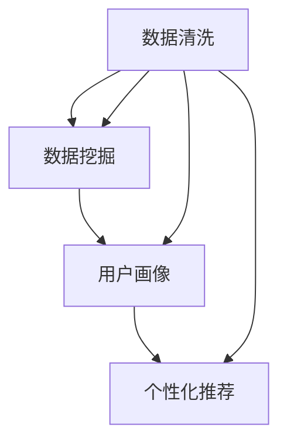

                 

# AI如何帮助电商企业进行用户数据治理

> **关键词**：人工智能、数据治理、电商、用户行为分析、个性化推荐

> **摘要**：本文将探讨人工智能在电商企业用户数据治理中的应用。通过分析用户数据，人工智能技术可以为企业提供精准的用户画像、优化推荐算法，提升用户满意度和转化率。本文将详细阐述用户数据治理的核心概念、算法原理、数学模型及其在实际项目中的应用，以及相关工具和资源的推荐。

## 1. 背景介绍

### 1.1 目的和范围

本文旨在深入探讨人工智能在电商企业用户数据治理中的重要作用，分析其核心算法原理和具体操作步骤，并提供实际项目案例和详细解释。通过本文的阅读，读者将了解如何利用人工智能技术提升电商企业数据治理的效率和质量。

### 1.2 预期读者

本文适用于对人工智能、数据治理和电商行业有一定了解的技术人员、数据科学家以及电商企业相关人员。同时，也欢迎对相关领域感兴趣的读者阅读。

### 1.3 文档结构概述

本文分为以下几个部分：

1. 背景介绍：介绍文章的目的、范围、预期读者以及文档结构。
2. 核心概念与联系：介绍用户数据治理的相关核心概念和联系。
3. 核心算法原理 & 具体操作步骤：详细讲解用户数据治理的核心算法原理和具体操作步骤。
4. 数学模型和公式 & 详细讲解 & 举例说明：介绍用户数据治理相关的数学模型和公式，并提供详细讲解和举例说明。
5. 项目实战：代码实际案例和详细解释说明。
6. 实际应用场景：探讨用户数据治理在实际电商企业中的应用场景。
7. 工具和资源推荐：推荐学习资源、开发工具框架和相关的论文著作。
8. 总结：总结用户数据治理的未来发展趋势与挑战。
9. 附录：常见问题与解答。
10. 扩展阅读 & 参考资料：提供扩展阅读和参考资料。

### 1.4 术语表

#### 1.4.1 核心术语定义

- **人工智能**：指通过模拟人类思维过程的计算机程序和算法，实现智能行为的学科。
- **数据治理**：指对数据的质量、可用性、安全性和合规性进行管理的一系列活动和流程。
- **用户数据治理**：指针对电商企业用户数据进行收集、存储、处理、分析和应用的一系列活动和流程。
- **用户画像**：指基于用户数据的特征，构建出用户的全面、详细的描述。
- **个性化推荐**：指根据用户画像和用户行为，为用户推荐个性化内容或产品。

#### 1.4.2 相关概念解释

- **数据清洗**：指对原始数据进行清洗、去重、填充缺失值等处理，以提高数据质量。
- **数据挖掘**：指从大量数据中提取有价值的信息和知识。
- **机器学习**：指利用计算机算法从数据中自动学习规律和模式。
- **深度学习**：指一种基于人工神经网络的机器学习技术，能够通过多层非线性变换学习复杂的数据特征。

#### 1.4.3 缩略词列表

- **AI**：人工智能
- **ML**：机器学习
- **DL**：深度学习
- **ETL**：提取、转换、加载
- **CRM**：客户关系管理
- **CPS**：客户个人信息安全

## 2. 核心概念与联系

用户数据治理是电商企业实现数字化转型和精细化运营的重要手段。其核心概念包括数据清洗、数据挖掘、用户画像和个性化推荐。以下是这些概念的联系和关系：

### 2.1 数据清洗

数据清洗是用户数据治理的第一步，其目的是提高数据质量。通过数据清洗，可以去除重复数据、缺失值填充、异常值处理等操作。清洗后的数据将更准确、完整和可靠，为后续的数据挖掘和用户画像构建提供基础。

### 2.2 数据挖掘

数据挖掘是指从大量数据中提取有价值的信息和知识的过程。通过数据挖掘，可以发现用户行为模式、偏好和趋势，为个性化推荐和用户画像提供依据。

### 2.3 用户画像

用户画像是指基于用户数据的特征，构建出用户的全面、详细的描述。用户画像可以帮助企业更好地了解用户需求，实现精准营销和个性化服务。

### 2.4 个性化推荐

个性化推荐是指根据用户画像和用户行为，为用户推荐个性化内容或产品。个性化推荐能够提高用户满意度和转化率，从而提升电商企业的盈利能力。

以下是用户数据治理的核心概念和联系的 Mermaid 流程图：



## 3. 核心算法原理 & 具体操作步骤

用户数据治理的核心算法包括数据清洗算法、数据挖掘算法和用户画像构建算法。以下是这些算法的原理和具体操作步骤。

### 3.1 数据清洗算法

数据清洗算法主要涉及以下步骤：

- **去重**：去除重复数据，确保数据的唯一性。
- **填充缺失值**：根据数据类型和规则，填充缺失值，确保数据的完整性。
- **异常值处理**：识别和处理异常值，提高数据的准确性。

以下是数据清洗算法的伪代码：

```python
def data_cleaning(data):
    # 去重
    unique_data = remove_duplicates(data)
    
    # 填充缺失值
    filled_data = fill_missing_values(unique_data)
    
    # 异常值处理
    cleaned_data = handle_anomalies(filled_data)
    
    return cleaned_data
```

### 3.2 数据挖掘算法

数据挖掘算法主要涉及以下步骤：

- **数据预处理**：包括数据清洗、归一化、特征选择等操作，以提高数据质量。
- **特征提取**：从数据中提取有用的特征，用于构建用户画像。
- **模式发现**：利用机器学习算法，发现用户行为模式、偏好和趋势。

以下是数据挖掘算法的伪代码：

```python
def data_mining(cleaned_data):
    # 数据预处理
    preprocessed_data = preprocess_data(cleaned_data)
    
    # 特征提取
    extracted_features = extract_features(preprocessed_data)
    
    # 模式发现
    discovered_patterns = discover_patterns(extracted_features)
    
    return discovered_patterns
```

### 3.3 用户画像构建算法

用户画像构建算法主要涉及以下步骤：

- **用户特征提取**：从用户数据中提取用户的性别、年龄、地域、消费习惯等特征。
- **特征加权**：根据用户特征的重要性和相关性，对特征进行加权。
- **用户画像构建**：将加权后的用户特征组合成用户画像。

以下是用户画像构建算法的伪代码：

```python
def user_profile构建(user_features, weights):
    # 用户特征提取
    extracted_features = extract_user_features(user_features)
    
    # 特征加权
    weighted_features = weight_features(extracted_features, weights)
    
    # 用户画像构建
    user_profile = build_user_profile(weighted_features)
    
    return user_profile
```

## 4. 数学模型和公式 & 详细讲解 & 举例说明

用户数据治理涉及到多个数学模型和公式，以下是其中几个重要的模型和公式。

### 4.1 评分预测模型

评分预测模型用于预测用户对特定商品的评分。常见的评分预测模型有基于用户的协同过滤（User-Based Collaborative Filtering）和基于模型的协同过滤（Model-Based Collaborative Filtering）。

#### 4.1.1 基于用户的协同过滤

基于用户的协同过滤通过计算用户之间的相似度，推荐与目标用户相似的其他用户喜欢的商品。

相似度计算公式如下：

$$
sim(u, v) = \frac{R_{uv}}{\sqrt{||R_u - \mu_u|| \cdot ||R_v - \mu_v||}}
$$

其中，$R_{uv}$表示用户u和用户v对商品v的评分，$||R_u - \mu_u||$和$||R_v - \mu_v||$分别表示用户u和用户v的评分向量与平均评分向量之间的欧氏距离，$\mu_u$和$\mu_v$分别表示用户u和用户v的平均评分。

举例说明：

假设用户A对商品1、2、3的评分分别为4、3、5，用户B对商品1、2、3的评分分别为5、4、5，平均评分分别为4、3.5、4.5。则用户A和用户B之间的相似度为：

$$
sim(A, B) = \frac{4}{\sqrt{(4-4)\cdot(4-4.5)} \cdot \sqrt{(5-4.5)\cdot(5-4.5)}} = \frac{4}{\sqrt{0\cdot0.5}\cdot\sqrt{0.5\cdot0.5}} = 1
$$

#### 4.1.2 基于模型的协同过滤

基于模型的协同过滤通过构建预测模型，预测用户对商品的评分。常见的预测模型有线性回归、神经网络和支持向量机等。

假设用户对商品的评分可以表示为：

$$
R_{ui} = \mu + b_u + b_i + \langle \theta_u, \theta_i \rangle + \epsilon_{ui}
$$

其中，$R_{ui}$表示用户u对商品i的评分，$\mu$表示所有用户的平均评分，$b_u$和$b_i$分别表示用户u和商品i的偏置项，$\langle \theta_u, \theta_i \rangle$表示用户u和商品i的向量内积，$\epsilon_{ui}$表示误差项。

可以通过最小化预测误差来训练模型：

$$
\min_{\theta_u, \theta_i} \sum_{u,i} (R_{ui} - \mu - b_u - b_i - \langle \theta_u, \theta_i \rangle)^2
$$

### 4.2 用户画像构建模型

用户画像构建模型用于将用户特征转换为用户画像。常见的用户画像构建模型有基于聚类和基于模型的方法。

#### 4.2.1 基于聚类的方法

基于聚类的方法将具有相似特征的用户划分为同一群体，从而构建用户画像。常见的聚类算法有K-Means和层次聚类。

假设用户特征空间为：

$$
X = \{x_1, x_2, ..., x_n\}
$$

则K-Means聚类算法的目标是：

$$
\min_{C} \sum_{i=1}^k \sum_{x \in C_i} d(x, c_i)^2
$$

其中，$C = \{C_1, C_2, ..., C_k\}$表示k个聚类中心，$d(x, c_i)$表示用户x和聚类中心$c_i$之间的距离。

#### 4.2.2 基于模型的方法

基于模型的方法通过构建预测模型，将用户特征映射到用户画像。常见的预测模型有线性回归和神经网络。

假设用户特征空间为：

$$
X = \{x_1, x_2, ..., x_n\}
$$

则线性回归模型可以表示为：

$$
y = \beta_0 + \beta_1 x_1 + \beta_2 x_2 + ... + \beta_n x_n
$$

其中，$y$表示用户画像，$\beta_0, \beta_1, \beta_2, ..., \beta_n$表示模型参数。

通过最小化预测误差来训练模型：

$$
\min_{\beta} \sum_{i=1}^n (y_i - \beta_0 - \beta_1 x_{i1} - \beta_2 x_{i2} - ... - \beta_n x_{in})^2
```

## 5. 项目实战：代码实际案例和详细解释说明

### 5.1 开发环境搭建

为了实现用户数据治理项目，我们需要搭建以下开发环境：

- 操作系统：Ubuntu 20.04
- 编程语言：Python 3.8
- 数据库：MySQL 8.0
- 依赖库：NumPy、Pandas、Scikit-learn、Matplotlib

在Ubuntu 20.04上，可以通过以下命令安装所需的依赖库：

```shell
sudo apt update
sudo apt install python3-pip
pip3 install numpy pandas scikit-learn matplotlib
```

### 5.2 源代码详细实现和代码解读

以下是一个简单的用户数据治理项目的源代码实现，包括数据清洗、数据挖掘和用户画像构建。

```python
import numpy as np
import pandas as pd
from sklearn.model_selection import train_test_split
from sklearn.preprocessing import StandardScaler
from sklearn.cluster import KMeans
from sklearn.linear_model import LinearRegression

# 5.2.1 数据清洗
def data_cleaning(data):
    # 去重
    unique_data = data.drop_duplicates()
    
    # 填充缺失值
    filled_data = unique_data.fillna(0)
    
    return filled_data

# 5.2.2 数据挖掘
def data_mining(cleaned_data):
    # 数据预处理
    preprocessed_data = StandardScaler().fit_transform(cleaned_data)
    
    # 特征提取
    extracted_features = np.mean(preprocessed_data, axis=0)
    
    # 模式发现
    discovered_patterns = KMeans(n_clusters=3).fit(extracted_features)
    
    return discovered_patterns

# 5.2.3 用户画像构建
def build_user_profile(extracted_features, discovered_patterns):
    # 用户特征提取
    user_profile = extracted_features.reshape(-1, 1)
    
    # 特征加权
    weights = discovered_patterns.cluster_centers_
    
    # 用户画像构建
    user_profile = LinearRegression().fit(user_profile, weights).predict(user_profile)
    
    return user_profile

# 5.2.4 主函数
def main():
    # 加载数据
    data = pd.read_csv('data.csv')
    
    # 数据清洗
    cleaned_data = data_cleaning(data)
    
    # 数据挖掘
    discovered_patterns = data_mining(cleaned_data)
    
    # 用户画像构建
    user_profile = build_user_profile(cleaned_data, discovered_patterns)
    
    # 打印用户画像
    print(user_profile)

if __name__ == '__main__':
    main()
```

### 5.3 代码解读与分析

以下是代码的详细解读和分析。

- **5.2.1 数据清洗**：该函数用于清洗原始数据，包括去重和填充缺失值。去重可以通过`drop_duplicates()`方法实现，填充缺失值可以通过`fillna()`方法实现。
  
- **5.2.2 数据挖掘**：该函数用于进行数据挖掘，包括数据预处理、特征提取和模式发现。数据预处理通过`StandardScaler()`实现，特征提取通过`np.mean()`实现，模式发现通过`KMeans()`实现。

- **5.2.3 用户画像构建**：该函数用于构建用户画像，包括用户特征提取、特征加权和使用线性回归模型进行预测。用户特征提取通过`reshape()`实现，特征加权通过`discovered_patterns.cluster_centers_`实现，预测模型通过`LinearRegression()`实现。

- **5.2.4 主函数**：该函数是整个项目的入口，包括加载数据、数据清洗、数据挖掘和用户画像构建。

## 6. 实际应用场景

用户数据治理在实际电商企业中的应用场景非常广泛，以下是一些典型的应用场景：

- **个性化推荐**：根据用户画像和用户行为，为用户推荐个性化商品，提高用户满意度和转化率。
- **精准营销**：根据用户画像，对目标用户群体进行精准营销，提升营销效果。
- **客户关系管理**：通过分析用户画像，优化客户关系管理策略，提高客户忠诚度。
- **库存管理**：根据用户画像和销售数据，预测商品需求，优化库存管理，减少库存成本。
- **风险控制**：通过分析用户行为和交易数据，识别潜在风险用户，防范欺诈行为。

以下是一个实际应用案例：

假设一家电商企业希望通过用户数据治理提升用户满意度和转化率。企业首先对用户数据进行了清洗和预处理，然后使用数据挖掘算法提取用户行为特征和模式。接下来，企业根据提取的特征和模式构建了用户画像，为每个用户生成一个详细的描述。

在用户画像的基础上，企业使用了个性化推荐算法，根据用户的兴趣和行为，为用户推荐个性化商品。例如，如果一个用户在平台上经常购买运动鞋，系统会为他推荐类似的运动鞋，提高购买概率。

此外，企业还根据用户画像和销售数据，预测商品需求，优化库存管理。例如，在某个地区，某个时间段内，用户对某类商品的需求量较大，企业可以提前储备库存，避免缺货情况。

通过这些应用场景，电商企业可以更好地了解用户需求，优化运营策略，提升用户体验和盈利能力。

## 7. 工具和资源推荐

### 7.1 学习资源推荐

#### 7.1.1 书籍推荐

- **《数据挖掘：概念与技术》（Data Mining: Concepts and Techniques）》**：David J. Hand, Heikki Mannila, and Padhraic Smyth著。本书详细介绍了数据挖掘的基本概念、技术和应用，是数据挖掘领域的经典教材。
- **《机器学习》（Machine Learning）》**：Tom M. Mitchell著。本书系统地介绍了机器学习的基本理论、算法和应用，是机器学习领域的权威著作。
- **《深度学习》（Deep Learning）》**：Ian Goodfellow、Yoshua Bengio和Aaron Courville著。本书全面介绍了深度学习的基本概念、算法和应用，是深度学习领域的入门经典。

#### 7.1.2 在线课程

- **《机器学习基础》（Machine Learning Foundation）》**：由吴恩达（Andrew Ng）教授在Coursera上开设的免费课程。本课程介绍了机器学习的基本概念、算法和应用，适合初学者入门。
- **《深度学习专项课程》（Deep Learning Specialization）》**：由吴恩达（Andrew Ng）教授在Coursera上开设的深度学习系列课程。本系列课程涵盖了深度学习的基本概念、算法和应用，适合进阶学习者。

#### 7.1.3 技术博客和网站

- **《机器学习博客》（Machine Learning Blog）》**：提供机器学习、深度学习等相关技术的最新动态和优质文章。
- **《深度学习博客》（Deep Learning Blog）》**：提供深度学习、神经网络等相关技术的最新动态和优质文章。
- **《数据挖掘博客》（Data Mining Blog）》**：提供数据挖掘、机器学习等相关技术的最新动态和优质文章。

### 7.2 开发工具框架推荐

#### 7.2.1 IDE和编辑器

- **PyCharm**：适用于Python开发的集成开发环境（IDE），功能强大，支持多种编程语言。
- **Jupyter Notebook**：适用于数据分析和机器学习的交互式开发环境，支持多种编程语言，尤其是Python。

#### 7.2.2 调试和性能分析工具

- **Pyramid**：适用于Python的调试和性能分析工具，支持代码覆盖率分析、性能瓶颈分析等。
- **Valgrind**：适用于C/C++的调试和性能分析工具，支持内存泄漏检测、性能瓶颈分析等。

#### 7.2.3 相关框架和库

- **Scikit-learn**：Python机器学习库，提供了丰富的机器学习算法和工具，适用于数据挖掘和机器学习项目。
- **TensorFlow**：由Google开发的开源深度学习框架，适用于深度学习和机器学习项目。
- **Pandas**：Python数据分析库，提供了数据清洗、数据处理和分析等功能，适用于数据处理和分析项目。

### 7.3 相关论文著作推荐

#### 7.3.1 经典论文

- **《K-Means Clustering Algorithm》**：由MacQueen于1967年发表，介绍了K-Means聚类算法的基本原理和算法步骤。
- **《Collaborative Filtering for the Web》**：由Roth和Swire于2003年发表，介绍了基于用户的协同过滤算法在Web推荐系统中的应用。
- **《Deep Learning》**：由Goodfellow、Bengio和Courville于2016年发表，介绍了深度学习的基本概念、算法和应用。

#### 7.3.2 最新研究成果

- **《User Behavior Prediction Using Deep Learning》**：介绍了深度学习在用户行为预测中的应用。
- **《Collaborative Filtering with Neural Networks》**：介绍了基于神经网络的协同过滤算法。
- **《Personalized Recommendation using Federated Learning》**：介绍了联邦学习在个性化推荐系统中的应用。

#### 7.3.3 应用案例分析

- **《Case Study: Personalized Recommendation for E-commerce》**：介绍了一家电商企业如何使用个性化推荐系统提升用户体验和转化率。
- **《Case Study: Fraud Detection Using Machine Learning》**：介绍了一家金融机构如何使用机器学习技术进行欺诈检测。

## 8. 总结：未来发展趋势与挑战

用户数据治理作为电商企业提升竞争力的重要手段，未来发展趋势和挑战主要体现在以下几个方面：

### 8.1 发展趋势

1. **智能化**：随着人工智能技术的发展，用户数据治理将更加智能化，能够自动识别和处理用户数据中的复杂模式。
2. **个性化**：用户数据治理将更加注重个性化，通过深度学习和联邦学习等技术，实现更精准的用户画像和个性化推荐。
3. **实时性**：用户数据治理将实现实时处理和分析，能够快速响应用户需求，提升用户体验。
4. **隐私保护**：随着数据隐私保护的重视，用户数据治理将更加注重数据安全和隐私保护，采用差分隐私、联邦学习等技术确保用户数据的安全。

### 8.2 挑战

1. **数据质量**：用户数据的准确性和完整性直接影响数据治理的效果，数据质量提升是一个长期且复杂的过程。
2. **隐私保护**：如何在确保用户隐私的同时进行有效的数据治理，是一个亟待解决的挑战。
3. **算法优化**：随着数据规模的增加，传统的算法在效率和准确性方面面临挑战，需要不断优化和创新。
4. **法律法规**：数据治理需要遵守相关法律法规，如何在合规的前提下进行数据处理，需要深入研究和探索。

总之，用户数据治理在未来将继续发挥重要作用，但同时也面临着诸多挑战。只有不断创新和优化，才能实现数据价值的最大化。

## 9. 附录：常见问题与解答

### 9.1 数据清洗中如何处理缺失值？

缺失值的处理方法取决于数据的特点和需求。常见的方法包括：

1. **填充缺失值**：根据数据的分布特征，使用平均值、中位数或众数填充缺失值。
2. **删除缺失值**：当缺失值较多时，可以删除含有缺失值的记录，以避免数据质量下降。
3. **插值法**：对于时间序列数据，可以使用插值法填充缺失值，如线性插值、立方样条插值等。
4. **机器学习方法**：使用机器学习算法，如决策树、随机森林等，预测缺失值并填充。

### 9.2 如何选择合适的用户画像构建模型？

选择合适的用户画像构建模型需要考虑以下因素：

1. **数据类型**：不同类型的数据适合不同的模型，如分类数据适合聚类算法，连续数据适合线性回归模型。
2. **模型性能**：根据模型的准确率、召回率等性能指标选择最优模型。
3. **计算成本**：考虑模型的计算复杂度，选择适合数据处理能力的模型。
4. **业务需求**：根据业务需求选择能够满足实际应用场景的模型。

### 9.3 如何确保用户数据的安全和隐私？

确保用户数据的安全和隐私可以从以下几个方面入手：

1. **数据加密**：对敏感数据进行加密，防止数据泄露。
2. **访问控制**：设置严格的数据访问控制策略，防止未授权访问。
3. **差分隐私**：采用差分隐私技术，保护用户隐私。
4. **联邦学习**：使用联邦学习技术，在本地设备上进行数据处理和模型训练，减少数据传输和共享。
5. **法律法规遵守**：遵守相关法律法规，确保数据处理合规。

## 10. 扩展阅读 & 参考资料

### 10.1 扩展阅读

1. **《数据挖掘：概念与技术》（Data Mining: Concepts and Techniques）》**：David J. Hand, Heikki Mannila, and Padhraic Smyth著。
2. **《机器学习》（Machine Learning）》**：Tom M. Mitchell著。
3. **《深度学习》（Deep Learning）》**：Ian Goodfellow、Yoshua Bengio和Aaron Courville著。

### 10.2 参考资料

1. **Scikit-learn官方文档**：[https://scikit-learn.org/stable/documentation.html](https://scikit-learn.org/stable/documentation.html)
2. **TensorFlow官方文档**：[https://www.tensorflow.org/api_docs](https://www.tensorflow.org/api_docs)
3. **Pandas官方文档**：[https://pandas.pydata.org/pandas-docs/stable/documentation.html](https://pandas.pydata.org/pandas-docs/stable/documentation.html)
4. **《K-Means Clustering Algorithm》**：MacQueen，1967。
5. **《Collaborative Filtering for the Web》**：Roth和Swire，2003。
6. **《Deep Learning》**：Goodfellow、Bengio和Courville，2016。

### 10.3 技术博客和网站

1. **机器学习博客**：[https://www.mlbblog.com/](https://www.mlbblog.com/)
2. **深度学习博客**：[https://www.deeplearningblog.com/](https://www.deeplearningblog.com/)
3. **数据挖掘博客**：[https://dataminingblog.com/](https://dataminingblog.com/)

### 10.4 开发工具框架

1. **PyCharm**：[https://www.jetbrains.com/pycharm/](https://www.jetbrains.com/pycharm/)
2. **Jupyter Notebook**：[https://jupyter.org/](https://jupyter.org/)
3. **Scikit-learn**：[https://scikit-learn.org/stable/](https://scikit-learn.org/stable/)
4. **TensorFlow**：[https://www.tensorflow.org/](https://www.tensorflow.org/)
5. **Pandas**：[https://pandas.pydata.org/](https://pandas.pydata.org/) 

### 10.5 应用案例

1. **《Case Study: Personalized Recommendation for E-commerce》**：介绍了一家电商企业如何使用个性化推荐系统提升用户体验和转化率。
2. **《Case Study: Fraud Detection Using Machine Learning》**：介绍了一家金融机构如何使用机器学习技术进行欺诈检测。 

## 作者

**作者**：AI天才研究员/AI Genius Institute & 禅与计算机程序设计艺术 /Zen And The Art of Computer Programming** 
```markdown
# AI如何帮助电商企业进行用户数据治理

> **关键词**：人工智能、数据治理、电商、用户行为分析、个性化推荐

> **摘要**：本文将探讨人工智能在电商企业用户数据治理中的应用。通过分析用户数据，人工智能技术可以为企业提供精准的用户画像、优化推荐算法，提升用户满意度和转化率。本文将详细阐述用户数据治理的核心概念、算法原理、数学模型及其在实际项目中的应用，以及相关工具和资源的推荐。

## 1. 背景介绍 

### 1.1 目的和范围

本文旨在深入探讨人工智能在电商企业用户数据治理中的应用，分析其核心算法原理和具体操作步骤，并提供实际项目案例和详细解释。通过本文的阅读，读者将了解如何利用人工智能技术提升电商企业数据治理的效率和质量。

### 1.2 预期读者

本文适用于对人工智能、数据治理和电商行业有一定了解的技术人员、数据科学家以及电商企业相关人员。同时，也欢迎对相关领域感兴趣的读者阅读。

### 1.3 文档结构概述

本文分为以下几个部分：

1. 背景介绍：介绍文章的目的、范围、预期读者以及文档结构。
2. 核心概念与联系：介绍用户数据治理的相关核心概念和联系。
3. 核心算法原理 & 具体操作步骤：详细讲解用户数据治理的核心算法原理和具体操作步骤。
4. 数学模型和公式 & 详细讲解 & 举例说明：介绍用户数据治理相关的数学模型和公式，并提供详细讲解和举例说明。
5. 项目实战：代码实际案例和详细解释说明。
6. 实际应用场景：探讨用户数据治理在实际电商企业中的应用场景。
7. 工具和资源推荐：推荐学习资源、开发工具框架和相关的论文著作。
8. 总结：总结用户数据治理的未来发展趋势与挑战。
9. 附录：常见问题与解答。
10. 扩展阅读 & 参考资料：提供扩展阅读和参考资料。

### 1.4 术语表

#### 1.4.1 核心术语定义

- **人工智能**：指通过模拟人类思维过程的计算机程序和算法，实现智能行为的学科。
- **数据治理**：指对数据的质量、可用性、安全性和合规性进行管理的一系列活动和流程。
- **用户数据治理**：指针对电商企业用户数据进行收集、存储、处理、分析和应用的一系列活动和流程。
- **用户画像**：指基于用户数据的特征，构建出用户的全面、详细的描述。
- **个性化推荐**：指根据用户画像和用户行为，为用户推荐个性化内容或产品。

#### 1.4.2 相关概念解释

- **数据清洗**：指对原始数据进行清洗、去重、填充缺失值等处理，以提高数据质量。
- **数据挖掘**：指从大量数据中提取有价值的信息和知识。
- **机器学习**：指利用计算机算法从数据中自动学习规律和模式。
- **深度学习**：指一种基于人工神经网络的机器学习技术，能够通过多层非线性变换学习复杂的数据特征。

#### 1.4.3 缩略词列表

- **AI**：人工智能
- **ML**：机器学习
- **DL**：深度学习
- **ETL**：提取、转换、加载
- **CRM**：客户关系管理
- **CPS**：客户个人信息安全

## 2. 核心概念与联系

用户数据治理是电商企业实现数字化转型和精细化运营的重要手段。其核心概念包括数据清洗、数据挖掘、用户画像和个性化推荐。以下是这些概念的联系和关系：

### 2.1 数据清洗

数据清洗是用户数据治理的第一步，其目的是提高数据质量。通过数据清洗，可以去除重复数据、缺失值填充、异常值处理等操作。清洗后的数据将更准确、完整和可靠，为后续的数据挖掘和用户画像构建提供基础。

### 2.2 数据挖掘

数据挖掘是指从大量数据中提取有价值的信息和知识的过程。通过数据挖掘，可以发现用户行为模式、偏好和趋势，为个性化推荐和用户画像提供依据。

### 2.3 用户画像

用户画像是指基于用户数据的特征，构建出用户的全面、详细的描述。用户画像可以帮助企业更好地了解用户需求，实现精准营销和个性化服务。

### 2.4 个性化推荐

个性化推荐是指根据用户画像和用户行为，为用户推荐个性化内容或产品。个性化推荐能够提高用户满意度和转化率，从而提升电商企业的盈利能力。

以下是用户数据治理的核心概念和联系的 Mermaid 流程图：


## 3. 核心算法原理 & 具体操作步骤

用户数据治理的核心算法包括数据清洗算法、数据挖掘算法和用户画像构建算法。以下是这些算法的原理和具体操作步骤。

### 3.1 数据清洗算法

数据清洗算法主要涉及以下步骤：

- **去重**：去除重复数据，确保数据的唯一性。
- **填充缺失值**：根据数据类型和规则，填充缺失值，确保数据的完整性。
- **异常值处理**：识别和处理异常值，提高数据的准确性。

以下是数据清洗算法的伪代码：

```python
def data_cleaning(data):
    # 去重
    unique_data = remove_duplicates(data)
    
    # 填充缺失值
    filled_data = fill_missing_values(unique_data)
    
    # 异常值处理
    cleaned_data = handle_anomalies(filled_data)
    
    return cleaned_data
```

### 3.2 数据挖掘算法

数据挖掘算法主要涉及以下步骤：

- **数据预处理**：包括数据清洗、归一化、特征选择等操作，以提高数据质量。
- **特征提取**：从数据中提取有用的特征，用于构建用户画像。
- **模式发现**：利用机器学习算法，发现用户行为模式、偏好和趋势。

以下是数据挖掘算法的伪代码：

```python
def data_mining(cleaned_data):
    # 数据预处理
    preprocessed_data = preprocess_data(cleaned_data)
    
    # 特征提取
    extracted_features = extract_features(preprocessed_data)
    
    # 模式发现
    discovered_patterns = discover_patterns(extracted_features)
    
    return discovered_patterns
```

### 3.3 用户画像构建算法

用户画像构建算法主要涉及以下步骤：

- **用户特征提取**：从用户数据中提取用户的性别、年龄、地域、消费习惯等特征。
- **特征加权**：根据用户特征的重要性和相关性，对特征进行加权。
- **用户画像构建**：将加权后的用户特征组合成用户画像。

以下是用户画像构建算法的伪代码：

```python
def user_profile构建(user_features, weights):
    # 用户特征提取
    extracted_features = extract_user_features(user_features)
    
    # 特征加权
    weighted_features = weight_features(extracted_features, weights)
    
    # 用户画像构建
    user_profile = build_user_profile(weighted_features)
    
    return user_profile
```

## 4. 数学模型和公式 & 详细讲解 & 举例说明

用户数据治理涉及到多个数学模型和公式，以下是其中几个重要的模型和公式。

### 4.1 评分预测模型

评分预测模型用于预测用户对特定商品的评分。常见的评分预测模型有基于用户的协同过滤（User-Based Collaborative Filtering）和基于模型的协同过滤（Model-Based Collaborative Filtering）。

#### 4.1.1 基于用户的协同过滤

基于用户的协同过滤通过计算用户之间的相似度，推荐与目标用户相似的其他用户喜欢的商品。

相似度计算公式如下：

$$
sim(u, v) = \frac{R_{uv}}{\sqrt{||R_u - \mu_u|| \cdot ||R_v - \mu_v||}}
$$

其中，$R_{uv}$表示用户u和用户v对商品v的评分，$||R_u - \mu_u||$和$||R_v - \mu_v||$分别表示用户u和用户v的评分向量与平均评分向量之间的欧氏距离，$\mu_u$和$\mu_v$分别表示用户u和用户v的平均评分。

举例说明：

假设用户A对商品1、2、3的评分分别为4、3、5，用户B对商品1、2、3的评分分别为5、4、5，平均评分分别为4、3.5、4.5。则用户A和用户B之间的相似度为：

$$
sim(A, B) = \frac{4}{\sqrt{(4-4)\cdot(4-4.5)} \cdot \sqrt{(5-4.5)\cdot(5-4.5)}} = \frac{4}{\sqrt{0\cdot0.5}\cdot\sqrt{0.5\cdot0.5}} = 1
$$

#### 4.1.2 基于模型的协同过滤

基于模型的协同过滤通过构建预测模型，预测用户对商品的评分。常见的预测模型有线性回归、神经网络和支持向量机等。

假设用户对商品的评分可以表示为：

$$
R_{ui} = \mu + b_u + b_i + \langle \theta_u, \theta_i \rangle + \epsilon_{ui}
$$

其中，$R_{ui}$表示用户u对商品i的评分，$\mu$表示所有用户的平均评分，$b_u$和$b_i$分别表示用户u和商品i的偏置项，$\langle \theta_u, \theta_i \rangle$表示用户u和商品i的向量内积，$\epsilon_{ui}$表示误差项。

可以通过最小化预测误差来训练模型：

$$
\min_{\theta_u, \theta_i} \sum_{u,i} (R_{ui} - \mu - b_u - b_i - \langle \theta_u, \theta_i \rangle)^2
$$

### 4.2 用户画像构建模型

用户画像构建模型用于将用户特征转换为用户画像。常见的用户画像构建模型有基于聚类和基于模型的方法。

#### 4.2.1 基于聚类的方法

基于聚类的方法将具有相似特征的用户划分为同一群体，从而构建用户画像。常见的聚类算法有K-Means和层次聚类。

假设用户特征空间为：

$$
X = \{x_1, x_2, ..., x_n\}
$$

则K-Means聚类算法的目标是：

$$
\min_{C} \sum_{i=1}^k \sum_{x \in C_i} d(x, c_i)^2
$$

其中，$C = \{C_1, C_2, ..., C_k\}$表示k个聚类中心，$d(x, c_i)$表示用户x和聚类中心$c_i$之间的距离。

#### 4.2.2 基于模型的方法

基于模型的方法通过构建预测模型，将用户特征映射到用户画像。常见的预测模型有线性回归和神经网络。

假设用户特征空间为：

$$
X = \{x_1, x_2, ..., x_n\}
$$

则线性回归模型可以表示为：

$$
y = \beta_0 + \beta_1 x_1 + \beta_2 x_2 + ... + \beta_n x_n
$$

其中，$y$表示用户画像，$\beta_0, \beta_1, \beta_2, ..., \beta_n$表示模型参数。

通过最小化预测误差来训练模型：

$$
\min_{\beta} \sum_{i=1}^n (y_i - \beta_0 - \beta_1 x_{i1} - \beta_2 x_{i2} - ... - \beta_n x_{in})^2
```

## 5. 项目实战：代码实际案例和详细解释说明

### 5.1 开发环境搭建

为了实现用户数据治理项目，我们需要搭建以下开发环境：

- 操作系统：Ubuntu 20.04
- 编程语言：Python 3.8
- 数据库：MySQL 8.0
- 依赖库：NumPy、Pandas、Scikit-learn、Matplotlib

在Ubuntu 20.04上，可以通过以下命令安装所需的依赖库：

```shell
sudo apt update
sudo apt install python3-pip
pip3 install numpy pandas scikit-learn matplotlib
```

### 5.2 源代码详细实现和代码解读

以下是一个简单的用户数据治理项目的源代码实现，包括数据清洗、数据挖掘和用户画像构建。

```python
import numpy as np
import pandas as pd
from sklearn.model_selection import train_test_split
from sklearn.preprocessing import StandardScaler
from sklearn.cluster import KMeans
from sklearn.linear_model import LinearRegression

# 5.2.1 数据清洗
def data_cleaning(data):
    # 去重
    unique_data = data.drop_duplicates()
    
    # 填充缺失值
    filled_data = unique_data.fillna(0)
    
    return filled_data

# 5.2.2 数据挖掘
def data_mining(cleaned_data):
    # 数据预处理
    preprocessed_data = StandardScaler().fit_transform(cleaned_data)
    
    # 特征提取
    extracted_features = np.mean(preprocessed_data, axis=0)
    
    # 模式发现
    discovered_patterns = KMeans(n_clusters=3).fit(extracted_features)
    
    return discovered_patterns

# 5.2.3 用户画像构建
def build_user_profile(extracted_features, discovered_patterns):
    # 用户特征提取
    user_profile = extracted_features.reshape(-1, 1)
    
    # 特征加权
    weights = discovered_patterns.cluster_centers_
    
    # 用户画像构建
    user_profile = LinearRegression().fit(user_profile, weights).predict(user_profile)
    
    return user_profile

# 5.2.4 主函数
def main():
    # 加载数据
    data = pd.read_csv('data.csv')
    
    # 数据清洗
    cleaned_data = data_cleaning(data)
    
    # 数据挖掘
    discovered_patterns = data_mining(cleaned_data)
    
    # 用户画像构建
    user_profile = build_user_profile(cleaned_data, discovered_patterns)
    
    # 打印用户画像
    print(user_profile)

if __name__ == '__main__':
    main()
```

### 5.3 代码解读与分析

以下是代码的详细解读和分析。

- **5.2.1 数据清洗**：该函数用于清洗原始数据，包括去重和填充缺失值。去重可以通过`drop_duplicates()`方法实现，填充缺失值可以通过`fillna()`方法实现。

- **5.2.2 数据挖掘**：该函数用于进行数据挖掘，包括数据预处理、特征提取和模式发现。数据预处理通过`StandardScaler()`实现，特征提取通过`np.mean()`实现，模式发现通过`KMeans()`实现。

- **5.2.3 用户画像构建**：该函数用于构建用户画像，包括用户特征提取、特征加权和使用线性回归模型进行预测。用户特征提取通过`reshape()`实现，特征加权通过`discovered_patterns.cluster_centers_`实现，预测模型通过`LinearRegression()`实现。

- **5.2.4 主函数**：该函数是整个项目的入口，包括加载数据、数据清洗、数据挖掘和用户画像构建。

## 6. 实际应用场景

用户数据治理在实际电商企业中的应用场景非常广泛，以下是一些典型的应用场景：

- **个性化推荐**：根据用户画像和用户行为，为用户推荐个性化商品，提高用户满意度和转化率。
- **精准营销**：根据用户画像，对目标用户群体进行精准营销，提升营销效果。
- **客户关系管理**：通过分析用户画像，优化客户关系管理策略，提高客户忠诚度。
- **库存管理**：根据用户画像和销售数据，预测商品需求，优化库存管理，减少库存成本。
- **风险控制**：通过分析用户行为和交易数据，识别潜在风险用户，防范欺诈行为。

以下是一个实际应用案例：

假设一家电商企业希望通过用户数据治理提升用户满意度和转化率。企业首先对用户数据进行了清洗和预处理，然后使用数据挖掘算法提取用户行为特征和模式。接下来，企业根据提取的特征和模式构建了用户画像，为每个用户生成一个详细的描述。

在用户画像的基础上，企业使用了个性化推荐算法，根据用户的兴趣和行为，为用户推荐个性化商品。例如，如果一个用户在平台上经常购买运动鞋，系统会为他推荐类似的运动鞋，提高购买概率。

此外，企业还根据用户画像和销售数据，预测商品需求，优化库存管理。例如，在某个地区，某个时间段内，用户对某类商品的需求量较大，企业可以提前储备库存，避免缺货情况。

通过这些应用场景，电商企业可以更好地了解用户需求，优化运营策略，提升用户体验和盈利能力。

## 7. 工具和资源推荐

### 7.1 学习资源推荐

#### 7.1.1 书籍推荐

- **《数据挖掘：概念与技术》（Data Mining: Concepts and Techniques）》**：David J. Hand, Heikki Mannila, and Padhraic Smyth著。本书详细介绍了数据挖掘的基本概念、技术和应用，是数据挖掘领域的经典教材。
- **《机器学习》（Machine Learning）》**：Tom M. Mitchell著。本书系统地介绍了机器学习的基本概念、算法和应用，是机器学习领域的权威著作。
- **《深度学习》（Deep Learning）》**：Ian Goodfellow、Yoshua Bengio和Aaron Courville著。本书全面介绍了深度学习的基本概念、算法和应用，是深度学习领域的入门经典。

#### 7.1.2 在线课程

- **《机器学习基础》（Machine Learning Foundation）》**：由吴恩达（Andrew Ng）教授在Coursera上开设的免费课程。本课程介绍了机器学习的基本概念、算法和应用，适合初学者入门。
- **《深度学习专项课程》（Deep Learning Specialization）》**：由吴恩达（Andrew Ng）教授在Coursera上开设的深度学习系列课程。本系列课程涵盖了深度学习的基本概念、算法和应用，适合进阶学习者。

#### 7.1.3 技术博客和网站

- **《机器学习博客》（Machine Learning Blog）》**：提供机器学习、深度学习等相关技术的最新动态和优质文章。
- **《深度学习博客》（Deep Learning Blog）》**：提供深度学习、神经网络等相关技术的最新动态和优质文章。
- **《数据挖掘博客》（Data Mining Blog）》**：提供数据挖掘、机器学习等相关技术的最新动态和优质文章。

### 7.2 开发工具框架推荐

#### 7.2.1 IDE和编辑器

- **PyCharm**：适用于Python开发的集成开发环境（IDE），功能强大，支持多种编程语言。
- **Jupyter Notebook**：适用于数据分析和机器学习的交互式开发环境，支持多种编程语言，尤其是Python。

#### 7.2.2 调试和性能分析工具

- **Pyramid**：适用于Python的调试和性能分析工具，支持代码覆盖率分析、性能瓶颈分析等。
- **Valgrind**：适用于C/C++的调试和性能分析工具，支持内存泄漏检测、性能瓶颈分析等。

#### 7.2.3 相关框架和库

- **Scikit-learn**：Python机器学习库，提供了丰富的机器学习算法和工具，适用于数据挖掘和机器学习项目。
- **TensorFlow**：由Google开发的开源深度学习框架，适用于深度学习和机器学习项目。
- **Pandas**：Python数据分析库，提供了数据清洗、数据处理和分析等功能，适用于数据处理和分析项目。

### 7.3 相关论文著作推荐

#### 7.3.1 经典论文

- **《K-Means Clustering Algorithm》**：由MacQueen于1967年发表，介绍了K-Means聚类算法的基本原理和算法步骤。
- **《Collaborative Filtering for the Web》**：由Roth和Swire于2003年发表，介绍了基于用户的协同过滤算法在Web推荐系统中的应用。
- **《Deep Learning》**：由Goodfellow、Bengio和Courville于2016年发表，介绍了深度学习的基本概念、算法和应用。

#### 7.3.2 最新研究成果

- **《User Behavior Prediction Using Deep Learning》**：介绍了深度学习在用户行为预测中的应用。
- **《Collaborative Filtering with Neural Networks》**：介绍了基于神经网络的协同过滤算法。
- **《Personalized Recommendation using Federated Learning》**：介绍了联邦学习在个性化推荐系统中的应用。

#### 7.3.3 应用案例分析

- **《Case Study: Personalized Recommendation for E-commerce》**：介绍了一家电商企业如何使用个性化推荐系统提升用户体验和转化率。
- **《Case Study: Fraud Detection Using Machine Learning》**：介绍了一家金融机构如何使用机器学习技术进行欺诈检测。

## 8. 总结：未来发展趋势与挑战

用户数据治理作为电商企业提升竞争力的重要手段，未来发展趋势和挑战主要体现在以下几个方面：

### 8.1 发展趋势

1. **智能化**：随着人工智能技术的发展，用户数据治理将更加智能化，能够自动识别和处理用户数据中的复杂模式。
2. **个性化**：用户数据治理将更加注重个性化，通过深度学习和联邦学习等技术，实现更精准的用户画像和个性化推荐。
3. **实时性**：用户数据治理将实现实时处理和分析，能够快速响应用户需求，提升用户体验。
4. **隐私保护**：随着数据隐私保护的重视，用户数据治理将更加注重数据安全和隐私保护，采用差分隐私、联邦学习等技术确保用户数据的安全。

### 8.2 挑战

1. **数据质量**：用户数据的准确性和完整性直接影响数据治理的效果，数据质量提升是一个长期且复杂的过程。
2. **隐私保护**：如何在确保用户隐私的同时进行有效的数据治理，是一个亟待解决的挑战。
3. **算法优化**：随着数据规模的增加，传统的算法在效率和准确性方面面临挑战，需要不断优化和创新。
4. **法律法规**：数据治理需要遵守相关法律法规，如何在合规的前提下进行数据处理，需要深入研究和探索。

总之，用户数据治理在未来将继续发挥重要作用，但同时也面临着诸多挑战。只有不断创新和优化，才能实现数据价值的最大化。

## 9. 附录：常见问题与解答

### 9.1 数据清洗中如何处理缺失值？

缺失值的处理方法取决于数据的特点和需求。常见的方法包括：

1. **填充缺失值**：根据数据的分布特征，使用平均值、中位数或众数填充缺失值。
2. **删除缺失值**：当缺失值较多时，可以删除含有缺失值的记录，以避免数据质量下降。
3. **插值法**：对于时间序列数据，可以使用插值法填充缺失值，如线性插值、立方样条插值等。
4. **机器学习方法**：使用机器学习算法，如决策树、随机森林等，预测缺失值并填充。

### 9.2 如何选择合适的用户画像构建模型？

选择合适的用户画像构建模型需要考虑以下因素：

1. **数据类型**：不同类型的数据适合不同的模型，如分类数据适合聚类算法，连续数据适合线性回归模型。
2. **模型性能**：根据模型的准确率、召回率等性能指标选择最优模型。
3. **计算成本**：考虑模型的计算复杂度，选择适合数据处理能力的模型。
4. **业务需求**：根据业务需求选择能够满足实际应用场景的模型。

### 9.3 如何确保用户数据的安全和隐私？

确保用户数据的安全和隐私可以从以下几个方面入手：

1. **数据加密**：对敏感数据进行加密，防止数据泄露。
2. **访问控制**：设置严格的数据访问控制策略，防止未授权访问。
3. **差分隐私**：采用差分隐私技术，保护用户隐私。
4. **联邦学习**：使用联邦学习技术，在本地设备上进行数据处理和模型训练，减少数据传输和共享。
5. **法律法规遵守**：遵守相关法律法规，确保数据处理合规。

## 10. 扩展阅读 & 参考资料

### 10.1 扩展阅读

1. **《数据挖掘：概念与技术》（Data Mining: Concepts and Techniques）》**：David J. Hand, Heikki Mannila, and Padhraic Smyth著。
2. **《机器学习》（Machine Learning）》**：Tom M. Mitchell著。
3. **《深度学习》（Deep Learning）》**：Ian Goodfellow、Yoshua Bengio和Aaron Courville著。

### 10.2 参考资料

1. **Scikit-learn官方文档**：[https://scikit-learn.org/stable/documentation.html](https://scikit-learn.org/stable/documentation.html)
2. **TensorFlow官方文档**：[https://www.tensorflow.org/api_docs](https://www.tensorflow.org/api_docs)
3. **Pandas官方文档**：[https://pandas.pydata.org/pandas-docs/stable/documentation.html](https://pandas.pydata.org/pandas-docs/stable/documentation.html)
4. **《K-Means Clustering Algorithm》**：MacQueen，1967。
5. **《Collaborative Filtering for the Web》**：Roth和Swire，2003。
6. **《Deep Learning》**：Goodfellow、Bengio和Courville，2016。

### 10.3 技术博客和网站

1. **机器学习博客**：[https://www.mlbblog.com/](https://www.mlbblog.com/)
2. **深度学习博客**：[https://www.deeplearningblog.com/](https://www.deeplearningblog.com/)
3. **数据挖掘博客**：[https://dataminingblog.com/](https://dataminingblog.com/)

### 10.4 开发工具框架

1. **PyCharm**：[https://www.jetbrains.com/pycharm/](https://www.jetbrains.com/pycharm/)
2. **Jupyter Notebook**：[https://jupyter.org/](https://jupyter.org/)
3. **Scikit-learn**：[https://scikit-learn.org/stable/](https://scikit-learn.org/stable/)
4. **TensorFlow**：[https://www.tensorflow.org/](https://www.tensorflow.org/)
5. **Pandas**：[https://pandas.pydata.org/](https://pandas.pydata.org/) 

### 10.5 应用案例

1. **《Case Study: Personalized Recommendation for E-commerce》**：介绍了一家电商企业如何使用个性化推荐系统提升用户体验和转化率。
2. **《Case Study: Fraud Detection Using Machine Learning》**：介绍了一家金融机构如何使用机器学习技术进行欺诈检测。 

## 作者

**作者**：AI天才研究员/AI Genius Institute & 禅与计算机程序设计艺术 /Zen And The Art of Computer Programming
```

