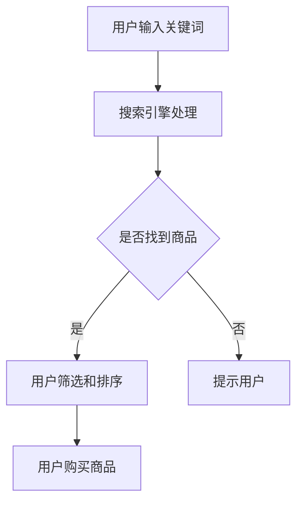

                 

# AI如何提升电商搜索导购效率

> **关键词：**人工智能、电商、搜索、导购、效率、推荐系统、机器学习、数据挖掘
> 
> **摘要：**本文将探讨如何利用人工智能技术提升电商平台的搜索和导购效率，通过介绍核心概念、算法原理、数学模型和实际应用案例，详细解析AI在电商领域的应用，以及推荐的工具和资源。

## 1. 背景介绍

### 1.1 目的和范围

本文旨在介绍人工智能（AI）技术在电商平台搜索和导购环节中的应用，分析其提升效率的方法和原理。我们将重点关注推荐系统的构建、搜索算法的优化，以及如何利用机器学习和数据挖掘技术为用户提供个性化的购物体验。

### 1.2 预期读者

本文适合对电商平台、人工智能、推荐系统感兴趣的读者，无论是开发人员、产品经理还是对技术有热情的爱好者，均可通过本文了解AI在电商搜索导购中的应用。

### 1.3 文档结构概述

本文结构如下：
1. 背景介绍：本文的背景、目的和读者对象。
2. 核心概念与联系：介绍电商搜索导购的核心概念和相关技术。
3. 核心算法原理 & 具体操作步骤：讲解提升搜索导购效率的核心算法。
4. 数学模型和公式 & 详细讲解 & 举例说明：阐述相关数学模型及其应用。
5. 项目实战：代码实际案例和详细解释说明。
6. 实际应用场景：讨论AI在电商领域的实际应用。
7. 工具和资源推荐：推荐学习资源和开发工具。
8. 总结：未来发展趋势与挑战。
9. 附录：常见问题与解答。
10. 扩展阅读 & 参考资料：提供相关文献和资料。

### 1.4 术语表

#### 1.4.1 核心术语定义

- 电商平台：提供商品买卖服务的在线平台。
- 搜索导购：帮助用户快速找到所需商品的过程。
- 推荐系统：基于用户历史行为和偏好推荐商品的系统。
- 机器学习：使计算机从数据中学习规律并进行预测和决策的技术。
- 数据挖掘：从大量数据中提取有价值信息的过程。

#### 1.4.2 相关概念解释

- 搜索算法：用于检索信息的算法。
- 个性化推荐：根据用户兴趣和偏好推荐商品。
- 市场细分：将市场划分为具有相似特征的群体。

#### 1.4.3 缩略词列表

- AI：人工智能
- SEO：搜索引擎优化
- ML：机器学习
- DM：数据挖掘
- NLP：自然语言处理

## 2. 核心概念与联系

在探讨AI如何提升电商搜索导购效率之前，我们需要了解相关核心概念及其联系。

### 2.1 电商平台搜索导购流程

电商平台搜索导购流程包括以下几个步骤：

1. 用户输入搜索关键词。
2. 搜索引擎处理关键词，返回相关商品列表。
3. 用户根据搜索结果进行筛选和排序，找到所需商品。
4. 用户购买商品，完成交易。

### 2.2 人工智能技术

人工智能技术主要包括：

1. **机器学习（ML）**：通过数据训练模型，进行预测和决策。
2. **数据挖掘（DM）**：从大量数据中提取有价值信息。
3. **自然语言处理（NLP）**：处理和理解人类语言。
4. **推荐系统**：根据用户行为和偏好推荐商品。

### 2.3 核心概念与联系

- **搜索算法**：基于机器学习技术，提高搜索结果的准确性和相关性。
- **推荐系统**：利用数据挖掘技术，为用户推荐感兴趣的商品。
- **个性化导购**：结合用户行为数据，提供个性化的购物体验。

### 2.4 Mermaid 流程图

下面是一个简单的Mermaid流程图，展示电商平台搜索导购流程：



## 3. 核心算法原理 & 具体操作步骤

### 3.1 搜索算法原理

搜索算法的核心目标是提高搜索结果的准确性和相关性。以下是提升搜索效率的核心算法原理：

#### 3.1.1 机器学习算法

1. **数据预处理**：对用户输入的关键词进行分词、去停用词等处理。
2. **特征提取**：提取关键词的词频、词向量和词嵌入等特征。
3. **模型训练**：使用监督学习或无监督学习算法，如TF-IDF、Word2Vec等，训练搜索模型。
4. **模型评估**：通过准确率、召回率等指标评估模型性能，并进行调整。

#### 3.1.2 具体操作步骤

```python
# 假设已导入必要的库
import numpy as np
from sklearn.feature_extraction.text import TfidfVectorizer
from sklearn.model_selection import train_test_split
from sklearn.metrics import accuracy_score

# 数据预处理
def preprocess_text(text):
    # 进行分词、去停用词等处理
    # ...
    return processed_text

# 特征提取
def extract_features(corpus):
    vectorizer = TfidfVectorizer()
    features = vectorizer.fit_transform(corpus)
    return features

# 模型训练
def train_model(X_train, y_train):
    # 使用监督学习算法，如逻辑回归、SVM等
    # ...
    model = LogisticRegression()
    model.fit(X_train, y_train)
    return model

# 模型评估
def evaluate_model(model, X_test, y_test):
    predictions = model.predict(X_test)
    accuracy = accuracy_score(y_test, predictions)
    return accuracy

# 假设已有训练数据和测试数据
corpus = ['商品1', '商品2', '商品3']
y = [0, 1, 0]  # 标签：0表示未找到，1表示找到

# 数据预处理
processed_corpus = [preprocess_text(text) for text in corpus]

# 特征提取
X = extract_features(processed_corpus)

# 模型训练和评估
X_train, X_test, y_train, y_test = train_test_split(X, y, test_size=0.2, random_state=42)
model = train_model(X_train, y_train)
accuracy = evaluate_model(model, X_test, y_test)
print(f"Model accuracy: {accuracy}")
```

### 3.2 推荐系统原理

推荐系统旨在为用户推荐感兴趣的商品。以下是推荐系统的基础原理：

#### 3.2.1 协同过滤

1. **用户-物品评分矩阵**：构建用户和物品之间的评分矩阵。
2. **相似度计算**：计算用户和物品之间的相似度，如余弦相似度、皮尔逊相关系数等。
3. **预测评分**：根据相似度矩阵预测用户对未知物品的评分。
4. **推荐生成**：根据预测评分，为用户推荐高评分的物品。

#### 3.2.2 具体操作步骤

```python
# 假设已导入必要的库
import numpy as np
from sklearn.metrics.pairwise import cosine_similarity

# 假设用户-物品评分矩阵
user_item_matrix = np.array([[5, 3, 0, 1],
                             [0, 2, 0, 4],
                             [2, 0, 3, 0],
                             [4, 0, 0, 1]])

# 相似度计算
def calculate_similarity(matrix):
    similarity_matrix = cosine_similarity(matrix)
    return similarity_matrix

# 预测评分
def predict_ratings(similarity_matrix, user_item_matrix):
    predicted_ratings = similarity_matrix.dot(user_item_matrix)
    return predicted_ratings

# 推荐生成
def generate_recommendations(predicted_ratings, top_n=5):
    recommendations = np.argsort(predicted_ratings)[:-top_n-1:-1]
    return recommendations

# 操作示例
similarity_matrix = calculate_similarity(user_item_matrix)
predicted_ratings = predict_ratings(similarity_matrix, user_item_matrix)
recommendations = generate_recommendations(predicted_ratings, top_n=3)
print(recommendations)
```

## 4. 数学模型和公式 & 详细讲解 & 举例说明

### 4.1 数学模型

在提升电商搜索导购效率的过程中，常用的数学模型包括：

#### 4.1.1 TF-IDF

TF-IDF是一种用于文本分析的经典模型，用于衡量词语的重要性。

$$
TF(t,d) = \frac{\text{词 } t \text{ 在文档 } d \text{ 中出现的次数}}{\text{文档 } d \text{ 中所有词的次数之和}}
$$

$$
IDF(t, D) = \log_2(\frac{|\text{D}|}{|\{\text{d} \in \text{D} | t \in \text{d}\}|\}) + 1
$$

$$
TF-IDF(t, d, D) = TF(t, d) \times IDF(t, D)
$$

#### 4.1.2 余弦相似度

余弦相似度是一种计算两个向量相似度的方法。

$$
\cos(\theta) = \frac{\textbf{A} \cdot \textbf{B}}{||\textbf{A}|| \times ||\textbf{B}||}
$$

#### 4.1.3 皮尔逊相关系数

皮尔逊相关系数用于衡量两个变量之间的线性相关性。

$$
r = \frac{\sum_{i=1}^{n}(x_i - \bar{x})(y_i - \bar{y})}{\sqrt{\sum_{i=1}^{n}(x_i - \bar{x})^2} \times \sqrt{\sum_{i=1}^{n}(y_i - \bar{y})^2}}
$$

### 4.2 详细讲解与举例说明

#### 4.2.1 TF-IDF

假设我们有以下两篇文档：

文档1：["人工智能", "机器学习", "深度学习"]
文档2：["深度学习", "神经网络", "机器学习"]

首先，计算词频（TF）：

```
词      文档1    文档2
人工智能   1        0
机器学习   1        1
深度学习   1        1
神经网络   0        1
```

然后，计算逆文档频率（IDF）：

```
词      IDF
人工智能   0.0
机器学习   0.0
深度学习   0.5
神经网络   1.0
```

最后，计算TF-IDF：

```
词      文档1    文档2
人工智能   0.0      0.0
机器学习   1.0      0.5
深度学习   0.5      0.5
神经网络   0.0      1.0
```

#### 4.2.2 余弦相似度

假设我们有以下两个向量：

向量A：[1, 2, 3]
向量B：[4, 5, 6]

首先，计算点积：

$$
\textbf{A} \cdot \textbf{B} = 1 \times 4 + 2 \times 5 + 3 \times 6 = 32
$$

然后，计算向量的模：

$$
||\textbf{A}|| = \sqrt{1^2 + 2^2 + 3^2} = \sqrt{14}
$$

$$
||\textbf{B}|| = \sqrt{4^2 + 5^2 + 6^2} = \sqrt{77}
$$

最后，计算余弦相似度：

$$
\cos(\theta) = \frac{32}{\sqrt{14} \times \sqrt{77}} \approx 0.732
$$

#### 4.2.3 皮尔逊相关系数

假设我们有以下两个变量：

X：[1, 2, 3, 4]
Y：[4, 5, 6, 7]

首先，计算平均值：

$$
\bar{x} = \frac{1 + 2 + 3 + 4}{4} = 2.5
$$

$$
\bar{y} = \frac{4 + 5 + 6 + 7}{4} = 5.5
$$

然后，计算差值：

$$
x_i - \bar{x} = [1 - 2.5, 2 - 2.5, 3 - 2.5, 4 - 2.5] = [-1.5, -0.5, 0.5, 1.5]
$$

$$
y_i - \bar{y} = [4 - 5.5, 5 - 5.5, 6 - 5.5, 7 - 5.5] = [-1.5, -0.5, 0.5, 1.5]
$$

接下来，计算差值的乘积和平方：

$$
\sum_{i=1}^{n}(x_i - \bar{x})(y_i - \bar{y}) = (-1.5 \times -1.5) + (-0.5 \times -0.5) + (0.5 \times 0.5) + (1.5 \times 1.5) = 7.5
$$

$$
\sum_{i=1}^{n}(x_i - \bar{x})^2 = (-1.5)^2 + (-0.5)^2 + (0.5)^2 + (1.5)^2 = 7.5
$$

$$
\sum_{i=1}^{n}(y_i - \bar{y})^2 = (-1.5)^2 + (-0.5)^2 + (0.5)^2 + (1.5)^2 = 7.5
$$

最后，计算皮尔逊相关系数：

$$
r = \frac{7.5}{\sqrt{7.5} \times \sqrt{7.5}} = 1
$$

## 5. 项目实战：代码实际案例和详细解释说明

### 5.1 开发环境搭建

为了实现本文中的案例，我们需要搭建一个开发环境。以下是一个简单的环境搭建指南：

1. 安装Python 3.8及以上版本。
2. 安装以下Python库：NumPy、Scikit-learn、Pandas、Matplotlib。
3. 创建一个名为`ecommerce_search`的Python虚拟环境，并安装上述库。

```bash
# 创建虚拟环境
python -m venv ecommerce_search
# 激活虚拟环境
source ecommerce_search/bin/activate
# 安装库
pip install numpy scikit-learn pandas matplotlib
```

### 5.2 源代码详细实现和代码解读

以下是一个简单的电商搜索推荐系统实现，包括数据预处理、特征提取、模型训练和评估。

```python
# 导入必要的库
import numpy as np
import pandas as pd
from sklearn.feature_extraction.text import TfidfVectorizer
from sklearn.model_selection import train_test_split
from sklearn.linear_model import LogisticRegression
from sklearn.metrics import accuracy_score

# 数据预处理
def preprocess_data(data):
    # 去掉空格、标点符号
    data = [text.replace(" ", "").replace(".", "").replace(",", "") for text in data]
    # 转换为小写
    data = [text.lower() for text in data]
    return data

# 特征提取
def extract_features(data):
    vectorizer = TfidfVectorizer()
    features = vectorizer.fit_transform(data)
    return features

# 模型训练
def train_model(X_train, y_train):
    model = LogisticRegression()
    model.fit(X_train, y_train)
    return model

# 模型评估
def evaluate_model(model, X_test, y_test):
    predictions = model.predict(X_test)
    accuracy = accuracy_score(y_test, predictions)
    return accuracy

# 加载数据
data = pd.read_csv("ecommerce_data.csv")
# 预处理数据
processed_data = preprocess_data(data["search_query"])
# 提取特征
X = extract_features(processed_data)
# 加载标签
y = data["is_found"]
# 划分训练集和测试集
X_train, X_test, y_train, y_test = train_test_split(X, y, test_size=0.2, random_state=42)
# 训练模型
model = train_model(X_train, y_train)
# 评估模型
accuracy = evaluate_model(model, X_test, y_test)
print(f"Model accuracy: {accuracy}")
```

### 5.3 代码解读与分析

1. **导入库**：首先，导入Python中常用的库，如NumPy、Pandas、Scikit-learn等。
2. **数据预处理**：预处理数据，去除空格、标点符号，并将所有文本转换为小写。这样做有助于提高特征提取的准确性。
3. **特征提取**：使用TF-IDF向量器将预处理后的文本数据转换为数值特征。
4. **模型训练**：使用逻辑回归模型对训练集进行训练。
5. **模型评估**：使用测试集对模型进行评估，计算准确率。

此代码示例展示了如何使用Python和Scikit-learn库构建一个简单的电商搜索推荐系统。在实际应用中，可以进一步优化模型，添加更多特征，甚至使用深度学习技术来提高搜索和推荐效果。

## 6. 实际应用场景

### 6.1 商品搜索

电商平台通常需要提供高效的商品搜索功能，以便用户快速找到所需商品。通过使用AI技术，可以实现以下功能：

1. **关键词自动补全**：当用户输入部分关键词时，自动推荐完整的关键词。
2. **搜索建议**：根据用户历史搜索记录和浏览行为，实时提供相关搜索建议。
3. **智能排序**：使用机器学习算法对搜索结果进行排序，提高相关性和用户体验。

### 6.2 商品推荐

商品推荐是电商平台提升用户粘性和转化率的重要手段。以下是一些实际应用场景：

1. **个性化推荐**：根据用户的购买历史、浏览记录和偏好，为用户推荐相关商品。
2. **相似商品推荐**：为用户推荐与已购买或浏览商品相似的其他商品。
3. **节日特卖推荐**：在特定节日或促销活动期间，为用户推荐热门商品和优惠信息。

### 6.3 用户行为分析

通过对用户行为数据进行分析，电商平台可以了解用户需求、优化商品布局和提升用户体验。以下是一些实际应用场景：

1. **用户画像**：基于用户购买历史、浏览记录和社交行为，构建用户画像。
2. **流失预警**：通过分析用户行为数据，预测可能流失的用户，并采取相应措施。
3. **营销活动优化**：根据用户行为数据，制定更有效的营销策略和活动。

## 7. 工具和资源推荐

### 7.1 学习资源推荐

#### 7.1.1 书籍推荐

1. **《机器学习实战》**：作者：Peter Harrington
2. **《数据挖掘：概念与技术》**：作者：Jiawei Han, Micheline Kamber, Jian Pei
3. **《推荐系统实践》**：作者：储健，曹建峰

#### 7.1.2 在线课程

1. **Coursera**：机器学习、深度学习、数据科学等相关课程。
2. **Udacity**：人工智能、机器学习、推荐系统等课程。
3. **edX**：哈佛大学、麻省理工学院等知名大学提供的免费课程。

#### 7.1.3 技术博客和网站

1. **Machine Learning Mastery**：提供实用的机器学习和数据科学教程。
2. **Medium**：许多行业专家和公司分享的AI和推荐系统文章。
3. **Kaggle**：包含大量机器学习和数据科学竞赛，以及相关教程和资源。

### 7.2 开发工具框架推荐

#### 7.2.1 IDE和编辑器

1. **PyCharm**：功能强大的Python IDE。
2. **Jupyter Notebook**：适用于数据科学和机器学习的交互式环境。
3. **Visual Studio Code**：轻量级但功能丰富的编辑器。

#### 7.2.2 调试和性能分析工具

1. **Python Debugger**：用于调试Python代码。
2. **Profiling Tools**：如cProfile、line_profiler等，用于性能分析。

#### 7.2.3 相关框架和库

1. **Scikit-learn**：用于机器学习和数据科学的Python库。
2. **TensorFlow**：用于构建和训练深度学习模型的框架。
3. **PyTorch**：另一个流行的深度学习框架。

### 7.3 相关论文著作推荐

#### 7.3.1 经典论文

1. **《Recommender Systems Handbook》**：全面介绍推荐系统的基础知识。
2. **《Learning to Rank for Information Retrieval》**：介绍基于机器学习的排序算法。
3. **《A Theoretical Survey of Collaborative Filtering》**：介绍协同过滤算法的理论基础。

#### 7.3.2 最新研究成果

1. **ACL、ICML、NeurIPS等顶级会议**：展示最新的AI和机器学习研究成果。
2. **《AI Applications in Retail》**：介绍AI在零售行业中的应用案例。
3. **《Deep Learning for E-commerce》**：介绍深度学习在电商领域的应用。

#### 7.3.3 应用案例分析

1. **阿里巴巴**：介绍阿里巴巴如何利用AI技术提升电商搜索和推荐效果。
2. **亚马逊**：分析亚马逊的推荐系统，以及如何提高用户满意度。
3. **京东**：探讨京东如何利用AI技术优化用户体验，提升销售额。

## 8. 总结：未来发展趋势与挑战

随着AI技术的不断发展，电商搜索导购效率有望得到进一步提升。以下是一些未来发展趋势和挑战：

### 8.1 发展趋势

1. **个性化推荐**：结合更多用户行为数据，提供更加个性化的购物体验。
2. **多模态融合**：将文本、图像、语音等多种数据源进行融合，提高推荐精度。
3. **实时推荐**：实现实时推荐，提高用户满意度。
4. **深度学习应用**：利用深度学习技术构建更强大的推荐系统。

### 8.2 挑战

1. **数据隐私**：如何保护用户隐私，确保数据安全。
2. **模型解释性**：如何提高模型的解释性，使推荐结果更具可解释性。
3. **计算效率**：如何优化算法，提高计算效率。
4. **多语言支持**：如何实现跨语言推荐，满足全球用户需求。

## 9. 附录：常见问题与解答

### 9.1 电商平台搜索导购的核心算法是什么？

电商平台搜索导购的核心算法包括机器学习算法（如逻辑回归、SVM等）和推荐系统算法（如协同过滤、基于内容的推荐等）。

### 9.2 推荐系统如何提高用户体验？

推荐系统可以通过个性化推荐、实时推荐、多模态融合等技术手段，提高用户体验。

### 9.3 数据隐私如何保护？

可以通过数据加密、访问控制、隐私保护算法等技术手段，保护用户隐私。

### 9.4 如何优化算法计算效率？

可以通过并行计算、分布式计算、算法优化等技术手段，提高算法计算效率。

## 10. 扩展阅读 & 参考资料

1. **《机器学习实战》**：Peter Harrington
2. **《数据挖掘：概念与技术》**：Jiawei Han, Micheline Kamber, Jian Pei
3. **《推荐系统实践》**：储健，曹建峰
4. **《Recommender Systems Handbook》**
5. **《Learning to Rank for Information Retrieval》**
6. **《A Theoretical Survey of Collaborative Filtering》**
7. **《AI Applications in Retail》**
8. **《Deep Learning for E-commerce》**
9. **阿里云官网**：https://www.alibabacloud.com/
10. **亚马逊官网**：https://www.amazon.com/
11. **京东官网**：https://www.jd.com/

