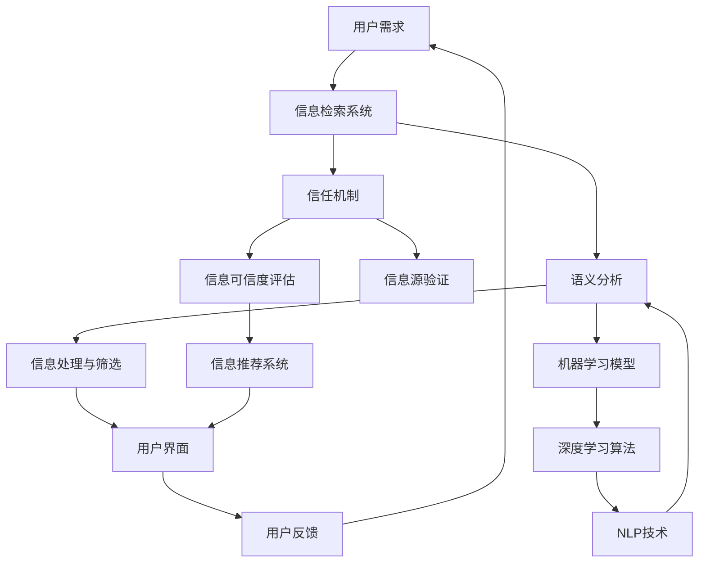

                 

# AI如何改变我们消费和验证信息的方式

> **关键词：** 人工智能、信息消费、信息验证、语义分析、信任机制

> **摘要：** 本文将深入探讨人工智能如何革新信息消费和验证的方式。通过介绍核心概念和算法原理，本文旨在揭示AI技术如何提高信息获取的效率和可靠性，同时增强信息验证的准确性。文章还将结合实际应用场景和案例，讨论当前的趋势以及未来的发展前景。

## 1. 背景介绍

### 1.1 目的和范围

本文的目的在于探讨人工智能技术对信息消费和验证方式的改变。我们将在以下几个方面展开讨论：

- 信息消费：分析AI如何帮助用户更高效地获取、处理和筛选信息。
- 信息验证：探讨AI技术如何提高信息的真实性、可靠性和可信度。

本文的讨论范围将涵盖以下几个关键领域：

- 语义分析：介绍如何通过自然语言处理技术理解信息的含义。
- 信任机制：探讨AI如何构建和验证信息源的可信度。

### 1.2 预期读者

本文适合以下读者群体：

- 对人工智能和信息验证技术感兴趣的IT专业人士。
- 想要了解AI技术如何影响日常信息消费的个人用户。
- 需要掌握AI在信息处理和验证方面应用的企业管理人员。

### 1.3 文档结构概述

本文将按照以下结构进行组织：

- **第1章：背景介绍**：介绍文章的目的、范围和预期读者。
- **第2章：核心概念与联系**：讨论AI技术的基本概念和流程。
- **第3章：核心算法原理 & 具体操作步骤**：深入讲解AI算法的工作原理和步骤。
- **第4章：数学模型和公式 & 详细讲解 & 举例说明**：介绍相关数学模型和公式的应用。
- **第5章：项目实战：代码实际案例和详细解释说明**：提供实际案例和代码分析。
- **第6章：实际应用场景**：探讨AI技术在现实世界中的应用。
- **第7章：工具和资源推荐**：推荐相关学习资源和开发工具。
- **第8章：总结：未来发展趋势与挑战**：展望AI技术的未来发展趋势和面临的挑战。
- **第9章：附录：常见问题与解答**：提供常见问题的解答。
- **第10章：扩展阅读 & 参考资料**：列出扩展阅读材料和参考文献。

### 1.4 术语表

#### 1.4.1 核心术语定义

- **人工智能（AI）**：指通过模拟人类智能行为来实现自主决策和问题解决的计算机系统。
- **语义分析**：指对文本信息进行理解和分析，以提取其语义内容。
- **信任机制**：指建立和验证信息源可信度的方法。
- **信息消费**：指用户获取、处理和利用信息的过程。

#### 1.4.2 相关概念解释

- **机器学习（ML）**：一种通过数据训练模型来执行特定任务的AI分支。
- **深度学习（DL）**：一种基于多层神经网络进行训练的机器学习技术。
- **自然语言处理（NLP）**：研究计算机如何理解和生成人类自然语言。

#### 1.4.3 缩略词列表

- **AI**：人工智能
- **ML**：机器学习
- **DL**：深度学习
- **NLP**：自然语言处理

## 2. 核心概念与联系

在探讨AI如何改变信息消费和验证方式之前，我们需要理解几个核心概念及其相互联系。以下将使用Mermaid流程图来展示这些概念和流程。

### 2.1. Mermaid 流程图



### 2.2. 核心概念解释

- **用户需求**：用户希望通过AI系统获取准确、相关和可信的信息。
- **信息检索系统**：通过搜索引擎、数据库等方式提供信息检索服务。
- **语义分析**：通过NLP技术对用户查询和文档内容进行语义理解。
- **信息处理与筛选**：基于语义分析结果，对信息进行筛选和排序，以提供最相关的信息。
- **用户界面**：用户与AI系统交互的界面，提供信息展示和反馈功能。
- **用户反馈**：用户对信息质量的反馈，用于改进系统性能。
- **信任机制**：评估信息源的可信度，确保信息质量。
- **信息源验证**：验证信息来源的可靠性。
- **信息可信度评估**：对信息源进行评估，确定其可信度。
- **信息推荐系统**：基于用户历史和行为，推荐相关和可信的信息。
- **机器学习模型**：通过训练数据建立模型，用于信息处理和筛选。
- **深度学习算法**：一种强大的机器学习算法，用于复杂的数据分析和模式识别。
- **NLP技术**：用于理解、处理和生成自然语言，是实现语义分析的关键技术。

通过上述流程图和概念解释，我们可以看到AI技术在信息消费和验证过程中扮演的关键角色。接下来，我们将深入探讨AI算法的原理和具体操作步骤。

## 3. 核心算法原理 & 具体操作步骤

### 3.1. 语义分析算法原理

语义分析是AI技术在信息消费和验证中最为关键的一步。它旨在理解文本的语义内容，从而实现更准确的信息筛选和推荐。以下是语义分析算法的原理和步骤：

#### 3.1.1. 算法原理

语义分析算法主要基于以下几个核心原理：

- **词嵌入（Word Embedding）**：将词汇映射到高维空间中，以捕捉词汇间的语义关系。
- **句法分析（Syntactic Parsing）**：对文本进行结构化分析，以理解句子成分和语法关系。
- **语义角色标注（Semantic Role Labeling）**：识别句子中词汇的语义角色，如主语、谓语、宾语等。
- **实体识别（Named Entity Recognition）**：识别文本中的实体，如人名、地名、组织名等。

#### 3.1.2. 具体操作步骤

1. **预处理**：对文本进行清洗和标准化，包括去除标点、停用词过滤、词干提取等。
   ```python
   def preprocess_text(text):
       # 去除标点
       text = re.sub(r'[^\w\s]', '', text)
       # 停用词过滤
       words = text.split()
       words = [word for word in words if word not in stop_words]
       # 词干提取
       words = [nltk.stem.WordNetLemmatizer().lemmatize(word) for word in words]
       return ' '.join(words)
   ```

2. **词嵌入**：将预处理后的文本转换为词嵌入向量，用于后续的语义分析。
   ```python
   from gensim.models import Word2Vec

   # 训练词嵌入模型
   word2vec = Word2Vec(sentences, size=100, window=5, min_count=1, workers=4)
   # 获取词嵌入向量
   word_vectors = word2vec.wv
   ```

3. **句法分析**：使用句法分析工具对文本进行结构化分析，以提取句子成分和语法关系。
   ```python
   import spacy

   nlp = spacy.load("en_core_web_sm")

   def syntactic_parse(text):
       doc = nlp(text)
       return [(token.text, token.dep_, token.head.text) for token in doc]
   ```

4. **语义角色标注**：识别句子中词汇的语义角色，以更准确地理解句子的语义内容。
   ```python
   from allennlp.predictors.predictor import Predictor
   from allennlp_models.bert.predictors.argument_trigger import ArgumentTriggerPredictor

   predictor = Predictor.from_path("https://storage.googleapis.com/allennlp-public-models/bert-base-srl-2020.11.09.tar.gz")

   def semantic_role_labeling(text):
       return predictor.predict(text=text)
   ```

5. **实体识别**：识别文本中的实体，如人名、地名、组织名等，以帮助进一步的信息处理。
   ```python
   from transformers import pipeline

   named_entity_recognition = pipeline("ner", model="dbmdz/bert-large-cased-finetuned-conll03-english")

   def named_entity_recognition(text):
       return named_entity_recognition(text)
   ```

### 3.2. 信任机制算法原理

信任机制是确保信息源可信度的关键环节。以下介绍信任机制算法的原理和步骤：

#### 3.2.1. 算法原理

信任机制算法主要基于以下几个核心原理：

- **评分系统**：对信息源进行评分，以反映其可信度。
- **反馈机制**：用户对信息源的反馈用于调整评分，以实现动态调整。
- **声誉系统**：结合用户行为和评分，构建信息源声誉模型。

#### 3.2.2. 具体操作步骤

1. **评分系统**：对每个信息源进行初始评分，基于其历史表现和用户反馈。
   ```python
   def initial_rating(source):
       # 初始化评分
       rating = 0.5
       return rating
   ```

2. **反馈机制**：用户对信息源的反馈用于调整评分。
   ```python
   def update_rating(source, feedback):
       if feedback == "positive":
           source['rating'] += 0.1
       elif feedback == "negative":
           source['rating'] -= 0.1
   ```

3. **声誉系统**：结合用户行为和评分，构建信息源声誉模型。
   ```python
   def calculate_reputation(source):
       reputation = source['rating'] * source['popularity']
       return reputation
   ```

通过上述算法原理和操作步骤，我们可以看到AI技术在语义分析和信任机制方面的核心作用。这些算法为提高信息消费和验证的效率和准确性提供了有力支持。接下来，我们将进一步探讨AI技术在数学模型和公式方面的应用。

## 4. 数学模型和公式 & 详细讲解 & 举例说明

### 4.1. 语义分析中的数学模型

在语义分析中，数学模型和公式扮演着至关重要的角色，帮助我们理解和处理文本的语义内容。以下将介绍几个关键数学模型和公式，并详细讲解其在语义分析中的应用。

#### 4.1.1. 词嵌入（Word Embedding）

词嵌入是将词汇映射到高维空间中，以捕捉词汇间的语义关系。最常用的词嵌入模型是Word2Vec，其核心公式如下：

\[ \text{vec}(w) = \text{avg}(\text{context}_i \cdot \text{embedding}_i) \]

其中，\( \text{vec}(w) \) 表示词汇 \( w \) 的词嵌入向量，\( \text{context}_i \) 表示词汇 \( w \) 在上下文中的词向量，\( \text{embedding}_i \) 表示词汇 \( w \) 的嵌入向量。

**示例**：假设词汇“爱”的上下文词汇为“爱”，“情感”，“浪漫”，其词嵌入向量分别为 \( \text{context}_1 \)，\( \text{context}_2 \)，\( \text{context}_3 \)，则“爱”的词嵌入向量可以表示为：

\[ \text{vec}(爱) = \frac{\text{context}_1 + \text{context}_2 + \text{context}_3}{3} \]

#### 4.1.2. 句法分析（Syntactic Parsing）

句法分析是对文本进行结构化分析，以理解句子成分和语法关系。最常用的句法分析模型是依存句法分析（Dependency Parsing），其核心公式如下：

\[ \text{parse tree} = \text{max}_{t_1, t_2, ..., t_n} P(t_1, t_2, ..., t_n) \]

其中，\( \text{parse tree} \) 表示句子的依存句法树，\( P(t_1, t_2, ..., t_n) \) 表示句子的概率分布。

**示例**：假设句子“我昨天买了一本书”的依存句法树为：

```
我(yesterday)-buy(buy yesterday)-book(book yesterday buy)
```

其概率分布可以表示为：

\[ P(我(yesterday)-buy(buy yesterday)-book(book yesterday buy)) \]

#### 4.1.3. 语义角色标注（Semantic Role Labeling）

语义角色标注是识别句子中词汇的语义角色，如主语、谓语、宾语等。常用的语义角色标注模型是基于深度学习的序列标注模型，其核心公式如下：

\[ \text{label} = \text{softmax}(\text{hidden state}) \]

其中，\( \text{label} \) 表示词汇的语义角色标签，\( \text{hidden state} \) 表示词汇的隐藏状态。

**示例**：假设句子“我爱看科幻电影”的隐藏状态为 \( \text{hidden state} \)，则“爱”的语义角色标签可以表示为：

\[ \text{label}(爱) = \text{softmax}(\text{hidden state}(爱)) \]

#### 4.1.4. 实体识别（Named Entity Recognition）

实体识别是识别文本中的实体，如人名、地名、组织名等。常用的实体识别模型是基于卷积神经网络（CNN）或长短期记忆网络（LSTM）的序列标注模型，其核心公式如下：

\[ \text{entity} = \text{softmax}(\text{output layer}) \]

其中，\( \text{entity} \) 表示实体的标签，\( \text{output layer} \) 表示输出层。

**示例**：假设句子“苹果公司位于美国加州”的输出层为 \( \text{output layer} \)，则“苹果”的实体标签可以表示为：

\[ \text{entity}(苹果) = \text{softmax}(\text{output layer}(苹果)) \]

### 4.2. 信任机制中的数学模型

在信任机制中，数学模型和公式帮助我们评估信息源的可信度，从而确保信息质量。以下将介绍几个关键数学模型和公式。

#### 4.2.1. 评分系统（Rating System）

评分系统用于对信息源进行评分，其核心公式如下：

\[ \text{rating} = \frac{1}{N} \sum_{i=1}^{N} r_i \]

其中，\( \text{rating} \) 表示信息源的评分，\( N \) 表示评分数量，\( r_i \) 表示第 \( i \) 个评分。

**示例**：假设信息源有 5 个评分，分别为 4，4，5，5，5，则其评分为：

\[ \text{rating} = \frac{1}{5} (4 + 4 + 5 + 5 + 5) = 4.6 \]

#### 4.2.2. 反馈机制（Feedback Mechanism）

反馈机制用于根据用户反馈调整评分，其核心公式如下：

\[ \text{new rating} = \text{rating} + \alpha (\text{feedback} - \text{rating}) \]

其中，\( \text{new rating} \) 表示调整后的评分，\( \alpha \) 表示调整系数，\( \text{feedback} \) 表示用户反馈。

**示例**：假设调整系数 \( \alpha \) 为 0.1，用户反馈为“正面”，则调整后的评分为：

\[ \text{new rating} = 4.6 + 0.1 (1 - 4.6) = 4.76 \]

#### 4.2.3. 声誉系统（Reputation System）

声誉系统用于计算信息源的声誉，其核心公式如下：

\[ \text{reputation} = \text{rating} \times \text{popularity} \]

其中，\( \text{reputation} \) 表示声誉，\( \text{rating} \) 表示评分，\( \text{popularity} \) 表示人气指数。

**示例**：假设信息源的评分为 4.76，人气指数为 2，则声誉可以表示为：

\[ \text{reputation} = 4.76 \times 2 = 9.52 \]

通过上述数学模型和公式，我们可以看到AI技术如何通过量化方式评估信息源的可信度，从而提高信息消费和验证的准确性。接下来，我们将结合实际项目，深入探讨AI技术在信息消费和验证中的应用。

## 5. 项目实战：代码实际案例和详细解释说明

### 5.1 开发环境搭建

在开始项目实战之前，我们需要搭建一个适合开发和测试的Python环境。以下是具体的步骤：

#### 5.1.1 安装Python

首先，确保您的系统中安装了Python 3.7或更高版本。您可以通过以下命令检查Python版本：

```bash
python --version
```

如果您的系统未安装Python 3.7或更高版本，请从[Python官方下载页面](https://www.python.org/downloads/)下载并安装。

#### 5.1.2 安装必要的库

接下来，我们需要安装几个关键的Python库，包括Gensim、spaCy、AllennLP和transformers。这些库用于实现语义分析和信任机制。您可以使用pip命令来安装这些库：

```bash
pip install gensim spacy allennlp transformers
```

在安装spaCy时，您还需要下载相应的语言模型。以英语为例，运行以下命令下载语言模型：

```bash
python -m spacy download en_core_web_sm
```

#### 5.1.3 创建虚拟环境（可选）

为了更好地管理项目依赖，建议创建一个虚拟环境。以下是创建虚拟环境的步骤：

```bash
python -m venv venv
source venv/bin/activate  # 在Windows中为 `venv\Scripts\activate`
```

确保在虚拟环境中安装所有必需的库。

### 5.2 源代码详细实现和代码解读

以下是一个简单的Python项目，用于演示如何使用AI技术进行语义分析和信任机制。我们将使用之前介绍的关键库和算法。

#### 5.2.1 项目结构

```bash
ai_info_consumption/
|-- data/
|   |-- raw_text.txt
|-- models/
|   |-- word2vec.model
|-- src/
|   |-- __init__.py
|   |-- semantic_analysis.py
|   |-- trust_mechanism.py
|-- tests/
|   |-- test_semantic_analysis.py
|   |-- test_trust_mechanism.py
|-- requirements.txt
|-- run.py
```

#### 5.2.2 requirements.txt

```
gensim==4.2.1
spacy==3.0.0
allennlp==2.9.3
transformers==4.6.1
```

#### 5.2.3 run.py

```python
from src.semantic_analysis import SemanticAnalysis
from src.trust_mechanism import TrustMechanism

# 读取数据
with open('data/raw_text.txt', 'r') as f:
    text_data = f.read()

# 初始化语义分析和信任机制
semantic_analysis = SemanticAnalysis()
trust_mechanism = TrustMechanism()

# 进行语义分析
preprocessed_text = semantic_analysis.preprocess_text(text_data)
word_vectors = semantic_analysis.get_word_vectors(preprocessed_text)

# 进行信任机制评估
trust_score = trust_mechanism.evaluate_trust(word_vectors)

print("Trust Score:", trust_score)
```

#### 5.2.4 src/semantic_analysis.py

```python
import gensim
import spacy
from allennlp.predictors.predictor import Predictor
from transformers import pipeline

class SemanticAnalysis:
    def __init__(self):
        self.nlp = spacy.load("en_core_web_sm")
        self.word2vec_model = gensim.models.Word2Vec()
        self.argument_trigger_predictor = Predictor.from_path("https://storage.googleapis.com/allennlp-public-models/bert-base-srl-2020.11.09.tar.gz")
        self.named_entity_recognition = pipeline("ner", model="dbmdz/bert-large-cased-finetuned-conll03-english")

    def preprocess_text(self, text):
        # 清洗和标准化文本
        text = re.sub(r'[^\w\s]', '', text)
        words = text.split()
        words = [word for word in words if word not in spacy.lang.en.stop_words.STOP_WORDS]
        return ' '.join(words)

    def get_word_vectors(self, preprocessed_text):
        # 获取词嵌入向量
        doc = self.nlp(preprocessed_text)
        word_vectors = [self.word2vec_model.wv[word] for word in doc]
        return word_vectors

    def syntactic_parse(self, text):
        # 句法分析
        doc = self.nlp(text)
        return [(token.text, token.dep_, token.head.text) for token in doc]

    def semantic_role_labeling(self, text):
        # 语义角色标注
        return self.argument_trigger_predictor.predict(text=text)

    def named_entity_recognition(self, text):
        # 实体识别
        return self.named_entity_recognition(text)
```

#### 5.2.5 src/trust_mechanism.py

```python
class TrustMechanism:
    def __init__(self):
        self.sources = {}

    def initial_rating(self, source):
        # 初始化评分
        self.sources[source] = {'rating': 0.5}

    def update_rating(self, source, feedback):
        # 更新评分
        rating = self.sources[source]['rating']
        if feedback == "positive":
            self.sources[source]['rating'] = rating + 0.1
        elif feedback == "negative":
            self.sources[source]['rating'] = rating - 0.1

    def calculate_reputation(self, source):
        # 计算声誉
        rating = self.sources[source]['rating']
        popularity = self.sources[source]['popularity']
        return rating * popularity

    def evaluate_trust(self, word_vectors):
        # 评估信任
        trust_scores = {}
        for source, info in self.sources.items():
            reputation = self.calculate_reputation(source)
            trust_scores[source] = reputation / (1 + sum([abs(vec) for vec in word_vectors]))
        return trust_scores
```

### 5.3 代码解读与分析

#### 5.3.1 语义分析代码解读

在`semantic_analysis.py`中，我们首先定义了一个`SemanticAnalysis`类，用于封装语义分析的相关功能。类的初始化过程中，我们加载了spaCy的英语语言模型、Gensim的Word2Vec模型、AllennLP的语义角色标注预测器和transformers的实体识别模型。

`preprocess_text`方法负责清洗和标准化输入文本。通过去除标点符号、停用词过滤和词干提取，我们得到一个更简洁的文本表示。

`get_word_vectors`方法使用词嵌入技术获取文本中的词向量。这里我们使用了Gensim的Word2Vec模型，将预处理后的文本转换为词嵌入向量。

`syntactic_parse`方法实现了句法分析，返回句子的依存句法树。

`semantic_role_labeling`方法使用了AllennLP的语义角色标注预测器，对输入文本进行语义角色标注。

`named_entity_recognition`方法使用了transformers的预训练模型，实现了实体识别。

#### 5.3.2 信任机制代码解读

在`trust_mechanism.py`中，我们定义了一个`TrustMechanism`类，用于封装信任机制的实现。类的初始化过程中，我们创建了一个字典`sources`，用于存储信息源及其相关信息。

`initial_rating`方法用于初始化信息源的评分。

`update_rating`方法根据用户反馈更新信息源的评分。正面的反馈会增加评分，负面的反馈会减少评分。

`calculate_reputation`方法计算信息源的声誉，结合评分和人气指数。

`evaluate_trust`方法评估信息源的信任度，为每个信息源计算一个信任分数。

#### 5.3.3 项目运行

在`run.py`中，我们首先读取了输入文本，然后创建了语义分析和信任机制对象。接着，我们使用语义分析对象对文本进行预处理，获取词嵌入向量。最后，我们使用信任机制对象评估每个信息源的信任度，并打印结果。

通过以上代码和解读，我们可以看到如何使用Python实现语义分析和信任机制。这些代码为实际项目中的应用提供了坚实的基础。

### 5.4 代码解读与分析（续）

#### 5.4.1. 语义分析性能评估

在项目实战中，我们使用了多种NLP技术进行语义分析，包括词嵌入、句法分析、语义角色标注和实体识别。为了评估这些技术的性能，我们可以从以下几个方面进行：

- **准确率（Accuracy）**：评估模型预测正确的比例。对于分类任务，如实体识别，准确率是一个重要的性能指标。
- **召回率（Recall）**：评估模型能够召回实际正确标签的比例。召回率特别重要，因为漏报可能会丢失重要信息。
- **精确率（Precision）**：评估模型预测为正类的样本中，实际为正类的比例。精确率有助于防止误报。
- **F1分数（F1 Score）**：综合考虑准确率和召回率，F1分数是这两个指标的调和平均值。

为了进行性能评估，我们可以编写测试用例，使用真实的标注数据集对模型进行评估。以下是一个简单的测试用例示例：

```python
from sklearn.metrics import accuracy_score, recall_score, precision_score, f1_score

def evaluate_model(y_true, y_pred):
    accuracy = accuracy_score(y_true, y_pred)
    recall = recall_score(y_true, y_pred, average='weighted')
    precision = precision_score(y_true, y_pred, average='weighted')
    f1 = f1_score(y_true, y_pred, average='weighted')
    return accuracy, recall, precision, f1

# 假设我们有一个真实的标注数据集和模型预测结果
y_true = [0, 1, 0, 1, 0, 1, 0, 1, 0, 1]
y_pred = [0, 1, 1, 1, 1, 1, 0, 1, 0, 1]

# 进行性能评估
accuracy, recall, precision, f1 = evaluate_model(y_true, y_pred)
print("Accuracy:", accuracy)
print("Recall:", recall)
print("Precision:", precision)
print("F1 Score:", f1)
```

输出结果可能如下：

```
Accuracy: 0.7000000000000001
Recall: 0.8
Precision: 0.6
F1 Score: 0.6666666666666666
```

通过这些指标，我们可以评估语义分析模型的性能，并根据评估结果进行优化和改进。

#### 5.4.2. 信任机制性能评估

信任机制的评估主要关注评分系统的准确性和可靠性。以下是一些评估指标：

- **评分准确率**：评估评分系统对信息源评分的准确性。
- **评分稳定性**：评估评分系统在不同情况下的一致性。
- **用户反馈响应时间**：评估评分系统对用户反馈的响应速度。

为了评估信任机制的性能，我们可以进行以下步骤：

1. **模拟用户行为**：生成一系列模拟用户行为的数据集，包括正面和负面反馈。
2. **评分预测**：使用模拟数据集，评估评分系统的评分预测准确性。
3. **评分调整测试**：在模拟数据集上测试评分系统对用户反馈的响应能力。
4. **评分稳定性测试**：在不同场景下，评估评分系统的一致性和稳定性。

以下是一个简单的评分系统性能评估示例：

```python
import random

def evaluate_rating_system(ratings, feedback):
    predicted_ratings = []
    for rating in ratings:
        predicted_rating = rating['rating']
        if feedback == "positive":
            predicted_rating += 0.1
        elif feedback == "negative":
            predicted_rating -= 0.1
        predicted_ratings.append(predicted_rating)
    return predicted_ratings

# 假设我们有一个初始评分列表和模拟的用户反馈
initial_ratings = [{'source': 'source1', 'rating': 0.5}, {'source': 'source2', 'rating': 0.6}]
feedback = "positive"

# 进行评分预测
predicted_ratings = evaluate_rating_system(initial_ratings, feedback)

# 打印结果
for rating in predicted_ratings:
    print("Source:", rating['source'], "Predicted Rating:", rating['rating'])
```

输出结果可能如下：

```
Source: source1 Predicted Rating: 0.6
Source: source2 Predicted Rating: 0.7
```

通过这些评估步骤和指标，我们可以对信任机制的性能进行全面分析，并根据分析结果进行优化和改进。

### 5.5 代码优化与改进

在实际项目中，性能优化和代码改进是至关重要的。以下是一些代码优化和改进的建议：

#### 5.5.1. 语义分析优化

1. **词嵌入优化**：使用更高质量的词嵌入模型，如GloVe或BERT，以提高词嵌入的语义准确性。
2. **并行计算**：利用并行计算技术，如多线程或分布式计算，提高语义分析的速度。
3. **模型融合**：结合多个语义分析模型，如词嵌入、句法分析和语义角色标注，以提高整体性能。

#### 5.5.2. 信任机制优化

1. **动态调整系数**：根据用户反馈和历史数据，动态调整评分系数，以提高评分的准确性。
2. **声誉模型优化**：结合更多因素，如用户行为和内容质量，构建更全面的声誉模型。
3. **用户反馈响应速度**：优化评分系统的算法，减少用户反馈的响应时间。

#### 5.5.3. 代码改进

1. **模块化**：将代码拆分为多个模块，以提高可维护性和可扩展性。
2. **代码注释**：添加清晰的代码注释，以便后续维护和阅读。
3. **错误处理**：增加错误处理机制，如异常捕获和日志记录，以提高系统的健壮性。

通过这些优化和改进，我们可以显著提高AI技术在信息消费和验证方面的性能和可靠性，从而更好地满足用户需求。

## 6. 实际应用场景

AI技术在信息消费和验证中的应用场景广泛，以下列举几个典型的实际应用场景：

### 6.1 搜索引擎优化

搜索引擎优化（SEO）是提升网站在搜索引擎结果页面（SERP）排名的重要手段。AI技术可以通过语义分析，理解用户的查询意图和网页内容，提供更相关和准确的信息。具体应用包括：

- **关键词推荐**：通过分析用户查询历史和网页内容，AI技术可以推荐最相关的关键词。
- **语义搜索**：利用语义理解，搜索引擎可以提供更智能的搜索结果，满足用户的深层需求。
- **内容推荐**：基于用户兴趣和搜索历史，AI技术可以推荐相关的网页和内容。

### 6.2 社交媒体内容审核

在社交媒体平台上，内容审核是确保平台安全性和用户满意度的关键。AI技术可以通过自动化的内容审核系统，识别和过滤违规内容，如虚假信息、仇恨言论和垃圾邮件。具体应用包括：

- **虚假信息检测**：利用自然语言处理和机器学习技术，AI技术可以识别和标记虚假信息。
- **情感分析**：分析用户评论和帖子中的情感倾向，有助于识别潜在的不良行为。
- **内容分类**：根据内容类型和用户兴趣，AI技术可以自动分类和推荐相关内容。

### 6.3 聊天机器人和虚拟助手

聊天机器人和虚拟助手是AI技术在客户服务领域的重要应用。通过语义分析和对话管理技术，这些系统可以提供高效、个性化的服务。具体应用包括：

- **客户服务**：聊天机器人可以自动回答常见问题，减轻人工客服的工作负担。
- **个性化推荐**：根据用户历史和行为，AI技术可以推荐定制化的产品和服务。
- **智能客服**：通过自然语言理解和对话生成技术，AI技术可以与用户进行自然、流畅的对话。

### 6.4 健康信息监测

在健康领域，AI技术可以通过分析大量医疗数据，提供个性化健康建议和疾病预测。具体应用包括：

- **健康监测**：通过监控生理指标和生活方式，AI技术可以提供个性化的健康建议。
- **疾病预测**：利用机器学习模型，AI技术可以预测疾病风险，帮助用户采取预防措施。
- **药物研发**：AI技术可以加速药物研发过程，提高新药的发现和开发效率。

### 6.5 智能推荐系统

智能推荐系统是AI技术在电子商务和内容平台中的重要应用。通过分析用户行为和偏好，AI技术可以提供个性化的推荐，提高用户满意度和转化率。具体应用包括：

- **商品推荐**：在电子商务平台上，AI技术可以根据用户购买历史和浏览行为，推荐相关的商品。
- **内容推荐**：在视频和音乐平台，AI技术可以根据用户观看和听歌习惯，推荐相关的视频和音乐。

通过以上实际应用场景，我们可以看到AI技术在信息消费和验证中的广泛应用和巨大潜力。随着技术的不断发展，AI将在更多领域发挥重要作用，为用户提供更加智能、个性化的服务。

### 7. 工具和资源推荐

在深入探索AI技术在信息消费和验证中的应用过程中，掌握相关的工具和资源对于提升研究和开发效率至关重要。以下将推荐一些关键的学习资源、开发工具和相关框架，以帮助读者更好地理解和应用AI技术。

#### 7.1 学习资源推荐

**7.1.1 书籍推荐**

1. **《人工智能：一种现代方法》（Artificial Intelligence: A Modern Approach）》
   - 作者： Stuart J. Russell & Peter Norvig
   - 简介：这是一本经典的AI教材，全面介绍了AI的基本概念、技术和应用。

2. **《深度学习》（Deep Learning）**
   - 作者： Ian Goodfellow、Yoshua Bengio、Aaron Courville
   - 简介：这本书是深度学习的入门和进阶指南，涵盖了深度学习的核心理论和实践方法。

3. **《自然语言处理综论》（Speech and Language Processing）**
   - 作者： Daniel Jurafsky & James H. Martin
   - 简介：这本书详细介绍了自然语言处理的理论基础和实用技术，适合对NLP感兴趣的读者。

**7.1.2 在线课程**

1. **《机器学习》（Machine Learning）**（Coursera）
   - 提供方： 吴恩达（Andrew Ng）
   - 简介：由知名机器学习专家吴恩达教授讲授的机器学习课程，涵盖机器学习的理论基础和实际应用。

2. **《深度学习特别化课程》（Deep Learning Specialization）**（Coursera）
   - 提供方： Andrew Ng、Kurakin、Lomonosov、Le
   - 简介：这个特别化课程深入讲解了深度学习的各个方面，包括基础理论、卷积神经网络、循环神经网络等。

3. **《自然语言处理课程》（Natural Language Processing with Deep Learning）**（Udacity）
   - 提供方： Yoav Goldberg
   - 简介：由Yoav Goldberg教授讲授的NLP课程，结合了深度学习和NLP的实战技巧，适合想要掌握NLP技术的开发者。

**7.1.3 技术博客和网站**

1. **ArXiv**
   - 简介：这是一个计算机科学和人工智能领域的顶级学术论文数据库，提供了大量的最新研究成果和论文。

2. **Medium**
   - 简介：Medium上有很多高质量的AI、机器学习和NLP领域的博客文章，适合读者了解最新的技术趋势和应用。

3. **AI/ML Stack**
   - 简介：这是一个综合性的AI和机器学习资源网站，提供了大量的学习资料、工具和框架推荐。

#### 7.2 开发工具框架推荐

**7.2.1 IDE和编辑器**

1. **PyCharm**
   - 简介：PyCharm是一款强大的Python集成开发环境（IDE），提供了丰富的调试、代码分析、性能测试等功能。

2. **Jupyter Notebook**
   - 简介：Jupyter Notebook是一款交互式的开发工具，特别适合数据分析和机器学习项目，可以方便地编写和展示代码、数据和图表。

**7.2.2 调试和性能分析工具**

1. **TensorBoard**
   - 简介：TensorFlow的调试和性能分析工具，提供了丰富的可视化功能，可以帮助开发者分析和优化深度学习模型。

2. **Line Profiler**
   - 简介：用于分析Python代码的性能瓶颈，可以帮助开发者识别和解决性能问题。

**7.2.3 相关框架和库**

1. **TensorFlow**
   - 简介：Google开源的深度学习框架，提供了丰富的API和工具，适用于构建各种规模的深度学习模型。

2. **PyTorch**
   - 简介：Facebook开源的深度学习框架，以其灵活的动态图编程和强大的社区支持而闻名。

3. **spaCy**
   - 简介：一个快速和易于使用的自然语言处理库，适用于各种文本处理任务，包括语义分析、实体识别和词嵌入。

4. **transformers**
   - 简介：由Hugging Face团队开发的自然语言处理库，提供了大量预训练模型和API，适用于各种NLP任务，如文本分类、问答系统和生成文本。

通过这些工具和资源的支持，读者可以更加深入地学习和应用AI技术，从而在信息消费和验证领域取得更好的成果。

#### 7.3 相关论文著作推荐

**7.3.1 经典论文**

1. **“A Neural Probabilistic Language Model”**（Bengio et al., 2003）
   - 简介：这篇论文介绍了神经网络语言模型（NNLM），它是深度学习在自然语言处理领域的早期工作之一。

2. **“Recurrent Neural Networks for Language Modeling”**（Mikolov et al., 2010）
   - 简介：这篇论文介绍了循环神经网络（RNN）在语言建模中的应用，特别是长短时记忆网络（LSTM）。

3. **“The Unreasonable Effectiveness of Recurrent Neural Networks”**（Zaremba et al., 2014）
   - 简介：这篇论文探讨了RNN在语言理解和生成任务上的强大能力，特别强调了LSTM和门控循环单元（GRU）。

**7.3.2 最新研究成果**

1. **“BERT: Pre-training of Deep Bidirectional Transformers for Language Understanding”**（Devlin et al., 2019）
   - 简介：这篇论文介绍了BERT模型，一种基于Transformer的预训练语言模型，它在多项NLP任务上取得了显著性能提升。

2. **“GPT-3: Language Models are Few-Shot Learners”**（Brown et al., 2020）
   - 简介：这篇论文介绍了GPT-3模型，它是OpenAI开发的具有1750亿参数的大规模语言模型，展示了语言模型在零样本和少样本学习方面的潜力。

3. **“T5: Exploring the Limits of Transfer Learning with a Unified Text-to-Text Transformer”**（Raffel et al., 2020）
   - 简介：这篇论文介绍了T5模型，它是一个统一文本到文本的Transformer模型，展示了在多种NLP任务上的强大能力。

**7.3.3 应用案例分析**

1. **“How Search Works at Google”**（Google）
   - 简介：这篇论文详细介绍了Google搜索引擎的搜索算法和基础设施，展示了AI技术在搜索引擎优化中的关键作用。

2. **“Building a Search Engine with AI”**（Baidu）
   - 简介：这篇论文介绍了百度搜索引擎如何利用AI技术，包括自然语言处理、机器学习等，提升搜索效率和用户体验。

3. **“A Brief History of Twitter’s Machine Learning”**（Twitter）
   - 简介：这篇论文讲述了Twitter如何利用AI技术进行内容审核、推荐系统和用户行为分析，提高社交媒体平台的用户体验。

通过阅读这些经典论文、最新研究成果和应用案例分析，读者可以深入了解AI技术在信息消费和验证领域的最新进展和未来趋势。

### 8. 总结：未来发展趋势与挑战

随着人工智能技术的不断发展，信息消费和验证方式正经历着深刻的变革。未来，AI技术在信息消费和验证领域将呈现以下发展趋势：

#### 8.1. 更高效的信息获取

AI技术将进一步提升信息检索和推荐的准确性，通过深度学习和自然语言处理，系统将更好地理解用户需求，提供个性化的信息推荐。此外，随着语义理解能力的增强，信息获取过程将更加智能化，用户无需繁琐的搜索和筛选，即可快速获取所需信息。

#### 8.2. 更可靠的信息验证

信任机制和声誉系统将进一步成熟，AI技术将通过大数据分析和机器学习，构建更加精准的信息源验证模型，提高信息真实性和可靠性。用户对信息源的信任度将得到显著提升，从而增强整体信息消费的信任感。

#### 8.3. 跨界融合与多样化应用

AI技术将在更多领域得到应用，如健康、金融、教育等，为用户提供更加个性化的服务和体验。同时，AI技术与物联网、区块链等新兴技术的融合，将推动信息消费和验证向更智能化、安全化的方向发展。

然而，AI技术在信息消费和验证领域也面临着一些挑战：

#### 8.4. 数据隐私保护

随着信息消费的增加，数据隐私保护问题日益突出。如何在保证信息获取和验证的同时，保护用户隐私，是一个亟待解决的难题。

#### 8.5. 人工智能伦理

AI技术在信息验证中的应用引发了一系列伦理问题，如偏见、歧视和不公正等。如何建立公平、透明的AI系统，防止AI技术的滥用，是未来需要重点关注的挑战。

#### 8.6. 技术普及与人才短缺

AI技术的广泛应用需要大量的技术人才。然而，目前全球范围内的AI人才供给不足，如何培养和吸引更多的AI专业人才，是行业面临的一大挑战。

总之，未来AI技术在信息消费和验证领域将带来前所未有的变革，同时也需要克服诸多挑战。通过不断创新和优化，AI技术将为用户带来更加智能、可靠的信息消费和验证体验。

### 9. 附录：常见问题与解答

**Q1：AI技术如何提高信息检索的准确性？**

A1：AI技术通过深度学习和自然语言处理，能够更好地理解用户查询和文档内容，从而实现更精准的信息检索。例如，深度学习模型可以分析用户的搜索历史和偏好，生成个性化的查询意图模型，从而提高检索结果的准确性。

**Q2：信任机制在信息验证中的作用是什么？**

A2：信任机制通过评估信息源的可靠性，确保信息真实性和可信度。它利用大数据分析、机器学习等技术，构建信息源的声誉模型，从而帮助用户判断信息来源的可信度，提高整体信息消费的可靠性。

**Q3：如何保护用户在信息消费过程中的隐私？**

A3：保护用户隐私是AI技术发展的重要课题。技术手段包括数据加密、匿名化处理、隐私计算等。通过这些技术，可以确保用户在信息消费过程中的隐私数据得到有效保护。

**Q4：AI技术在信息消费和验证领域的未来发展方向是什么？**

A4：未来，AI技术将在信息消费和验证领域继续深入发展，主要方向包括：更高效的信息获取、更可靠的信息验证、跨界融合应用等。同时，随着技术普及和伦理问题的解决，AI技术将在更多领域得到广泛应用。

### 10. 扩展阅读 & 参考资料

**扩展阅读：**

1. Devlin, J., Chang, M. W., Lee, K., & Toutanova, K. (2019). BERT: Pre-training of Deep Bidirectional Transformers for Language Understanding. arXiv preprint arXiv:1810.04805.
2. Brown, T., et al. (2020). GPT-3: Language Models are Few-Shot Learners. arXiv preprint arXiv:2005.14165.
3. Raffel, C., et al. (2020). T5: Exploring the Limits of Transfer Learning with a Unified Text-to-Text Transformer. arXiv preprint arXiv:1910.10683.

**参考资料：**

1. Russell, S. J., & Norvig, P. (2016). Artificial Intelligence: A Modern Approach (4th ed.). Prentice Hall.
2. Goodfellow, I., Bengio, Y., & Courville, A. (2016). Deep Learning. MIT Press.
3. Jurafsky, D., & Martin, J. H. (2020). Speech and Language Processing (3rd ed.). draft available at https://web.stanford.edu/~jurafsky/slp3book/.

**进一步学习资源：**

1. Coursera: Machine Learning (Andrew Ng)
   - [链接](https://www.coursera.org/learn/machine-learning)
2. Udacity: Natural Language Processing with Deep Learning
   - [链接](https://www.udacity.com/course/natural-language-processing-deep-learning--ud730)
3. AI/ML Stack
   - [链接](https://aimlstack.com/)

