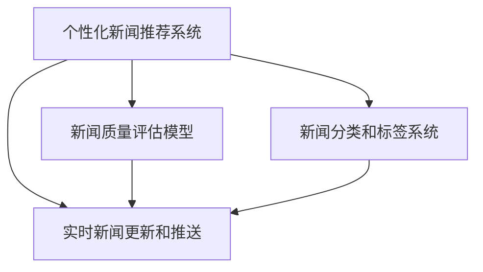
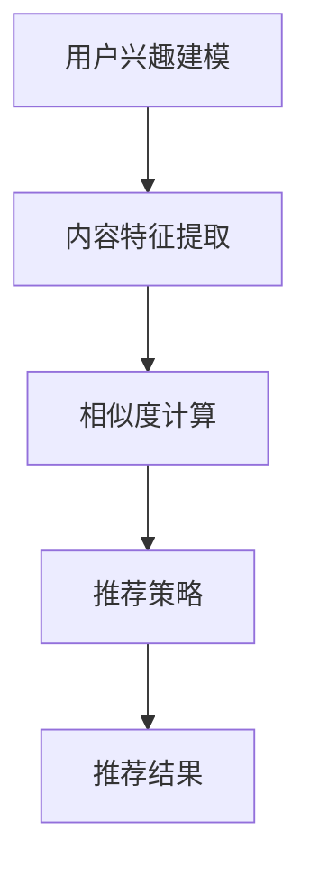
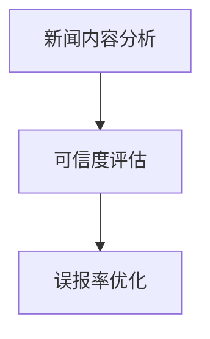
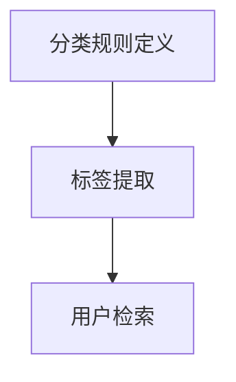
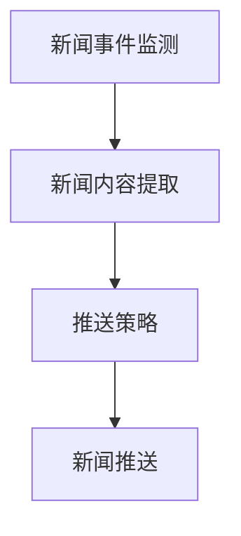

                 

# AI如何改变新闻聚合和传播

> **关键词：** 人工智能、新闻聚合、新闻传播、算法、个性化推荐、机器学习

> **摘要：** 本文将探讨人工智能技术在新闻聚合和传播领域中的应用。通过分析核心算法原理、具体操作步骤和数学模型，我们将揭示AI如何实现个性化新闻推荐、提高新闻传播效率，并对未来的发展趋势和挑战进行深入探讨。

## 1. 背景介绍

### 1.1 目的和范围

本文旨在介绍人工智能技术在新闻聚合和传播领域的应用，分析其核心算法原理和数学模型，并通过实际案例展示其具体操作步骤。文章将重点关注以下几个方面：

1. **个性化新闻推荐**：探讨AI如何根据用户兴趣和偏好，实现个性化新闻内容推荐。
2. **新闻传播效率提升**：分析AI技术如何提高新闻传播的精准度和速度。
3. **未来发展趋势和挑战**：探讨AI在新闻聚合和传播领域的潜在影响和面临的挑战。

### 1.2 预期读者

本文面向对人工智能和新闻传播感兴趣的读者，包括但不限于：

1. **人工智能从业者**：了解AI技术在新闻领域的应用，拓展职业发展视野。
2. **新闻传播从业者**：掌握AI技术在新闻聚合和传播中的应用，提高工作效率。
3. **学术研究者**：对AI在新闻传播领域的最新研究动态和趋势进行了解。

### 1.3 文档结构概述

本文分为十个部分，结构如下：

1. **背景介绍**：介绍文章目的、范围、预期读者和文档结构。
2. **核心概念与联系**：阐述新闻聚合和传播的核心概念及关系。
3. **核心算法原理 & 具体操作步骤**：分析核心算法原理，使用伪代码详细阐述。
4. **数学模型和公式 & 详细讲解 & 举例说明**：讲解数学模型，使用latex格式展示。
5. **项目实战：代码实际案例和详细解释说明**：提供代码实现和解析。
6. **实际应用场景**：探讨AI在新闻聚合和传播中的应用场景。
7. **工具和资源推荐**：推荐相关学习资源、开发工具和框架。
8. **总结：未来发展趋势与挑战**：分析未来发展趋势和挑战。
9. **附录：常见问题与解答**：解答读者可能遇到的问题。
10. **扩展阅读 & 参考资料**：提供扩展阅读和参考资料。

### 1.4 术语表

#### 1.4.1 核心术语定义

- **新闻聚合**：将来自多个来源的新闻内容进行整合和筛选，提供统一的信息入口。
- **个性化推荐**：根据用户兴趣和偏好，为用户推荐其可能感兴趣的新闻内容。
- **机器学习**：一种人工智能技术，通过数据训练模型，实现自动化决策和预测。
- **深度学习**：一种复杂的机器学习技术，通过多层神经网络进行数据分析和模式识别。

#### 1.4.2 相关概念解释

- **信息过载**：用户面临大量信息时，难以筛选和处理的现象。
- **新闻传播**：将新闻内容传递给公众的过程，包括媒体发布、传播和受众接收。

#### 1.4.3 缩略词列表

- **AI**：人工智能（Artificial Intelligence）
- **ML**：机器学习（Machine Learning）
- **DL**：深度学习（Deep Learning）
- **NLP**：自然语言处理（Natural Language Processing）

## 2. 核心概念与联系

在新闻聚合和传播领域，AI技术的核心概念主要包括：

1. **个性化新闻推荐系统**：基于用户兴趣和偏好，为用户推荐个性化新闻内容。
2. **新闻质量评估模型**：评估新闻内容的真实性和可信度。
3. **新闻分类和标签系统**：对新闻内容进行分类和标签化，便于用户查找和阅读。
4. **实时新闻更新和推送**：实时监测新闻事件，为用户推送最新新闻。

下面，我们将使用Mermaid流程图展示这些核心概念及其相互关系。



在上面的流程图中，个性化新闻推荐系统是核心，它与其他系统紧密相连。新闻质量评估模型负责评估新闻内容的真实性和可信度，实时新闻更新和推送系统负责监测新闻事件并及时推送。新闻分类和标签系统则为用户提供了方便的查找和阅读途径。

### 2.1 个性化新闻推荐系统

个性化新闻推荐系统是AI在新闻聚合和传播领域的重要应用之一。其基本原理如下：

1. **用户兴趣建模**：通过用户行为数据，如浏览历史、点赞、评论等，建立用户兴趣模型。
2. **内容特征提取**：对新闻内容进行特征提取，如关键词、主题、情感等。
3. **相似度计算**：计算用户兴趣模型与新闻内容特征之间的相似度。
4. **推荐策略**：根据相似度计算结果，为用户推荐可能感兴趣的新闻内容。

下面是个性化新闻推荐系统的简化流程：



### 2.2 新闻质量评估模型

新闻质量评估模型用于评估新闻内容的真实性和可信度，其基本原理如下：

1. **新闻内容分析**：对新闻内容进行文本分析，提取关键信息。
2. **可信度评估**：基于新闻内容分析结果，评估新闻的可信度。
3. **误报率优化**：通过不断训练和优化模型，降低误报率。

下面是新闻质量评估模型的简化流程：



### 2.3 新闻分类和标签系统

新闻分类和标签系统用于对新闻内容进行分类和标签化，其基本原理如下：

1. **分类规则定义**：定义新闻分类规则，如政治、经济、体育等。
2. **标签提取**：从新闻内容中提取相关标签，如“疫情”、“股票”等。
3. **用户检索**：用户通过分类和标签检索感兴趣的新闻内容。

下面是新闻分类和标签系统的简化流程：



### 2.4 实时新闻更新和推送系统

实时新闻更新和推送系统用于实时监测新闻事件，并将最新新闻推送给用户。其基本原理如下：

1. **新闻事件监测**：实时监测新闻事件，如政治事件、自然灾害等。
2. **新闻内容提取**：提取新闻事件的相关内容。
3. **推送策略**：根据用户兴趣和新闻重要性，制定推送策略。

下面是实时新闻更新和推送系统的简化流程：



通过上述流程图，我们可以清晰地看到个性化新闻推荐系统、新闻质量评估模型、新闻分类和标签系统以及实时新闻更新和推送系统之间的相互关系。这些系统共同构建了一个完整的新闻聚合和传播生态系统，为用户提供了个性化、高质量、实时的新闻服务。

## 3. 核心算法原理 & 具体操作步骤

在新闻聚合和传播领域，核心算法原理包括个性化新闻推荐算法、新闻质量评估算法、新闻分类和标签算法以及实时新闻更新和推送算法。下面，我们将逐一分析这些算法的原理，并使用伪代码详细阐述具体操作步骤。

### 3.1 个性化新闻推荐算法

个性化新闻推荐算法旨在根据用户兴趣和偏好，为用户推荐可能感兴趣的新闻内容。其基本原理包括用户兴趣建模、内容特征提取和相似度计算。

#### 用户兴趣建模

用户兴趣建模基于用户行为数据，如浏览历史、点赞、评论等。以下是一个简单的用户兴趣建模算法：

```python
# 输入：用户行为数据（如浏览历史、点赞、评论）
# 输出：用户兴趣向量

def user_interest_modeling(user_behavior):
    # 初始化用户兴趣向量
    user_interest_vector = [0] * num_topics

    # 遍历用户行为数据，更新用户兴趣向量
    for behavior in user_behavior:
        # 更新用户兴趣向量
        user_interest_vector[behavior['topic_id']] += behavior['score']

    # 归一化用户兴趣向量
    user_interest_vector = normalize_vector(user_interest_vector)

    return user_interest_vector
```

#### 内容特征提取

内容特征提取旨在从新闻内容中提取关键特征，如关键词、主题、情感等。以下是一个简单的新闻内容特征提取算法：

```python
# 输入：新闻内容
# 输出：新闻特征向量

def content_feature_extraction(content):
    # 初始化新闻特征向量
    content_feature_vector = [0] * num_features

    # 提取关键词、主题和情感
    keywords = extract_keywords(content)
    topics = extract_topics(content)
    sentiment = extract_sentiment(content)

    # 更新新闻特征向量
    for keyword in keywords:
        content_feature_vector[keyword['id']] += keyword['score']
    for topic in topics:
        content_feature_vector[topic['id']] += topic['score']
    content_feature_vector[sentiment['id']] += sentiment['score']

    # 归一化新闻特征向量
    content_feature_vector = normalize_vector(content_feature_vector)

    return content_feature_vector
```

#### 相似度计算

相似度计算旨在计算用户兴趣向量与新闻内容特征向量之间的相似度。以下是一个简单的相似度计算算法：

```python
# 输入：用户兴趣向量、新闻特征向量
# 输出：相似度分数

def similarity_score(user_interest_vector, content_feature_vector):
    # 计算余弦相似度
    dot_product = dot_product_vector(user_interest_vector, content_feature_vector)
    magnitude_user_interest = magnitude_vector(user_interest_vector)
    magnitude_content_feature = magnitude_vector(content_feature_vector)

    similarity = dot_product / (magnitude_user_interest * magnitude_content_feature)

    return similarity
```

#### 推荐策略

推荐策略根据相似度计算结果，为用户推荐可能感兴趣的新闻内容。以下是一个简单的推荐策略：

```python
# 输入：用户兴趣向量、新闻特征向量列表、相似度分数列表
# 输出：推荐结果

def recommend_content(user_interest_vector, content_feature_vectors, similarity_scores):
    # 根据相似度分数，对新闻内容进行排序
    sorted_content = sorted(zip(content_feature_vectors, similarity_scores), key=lambda x: x[1], reverse=True)

    # 提取前N条推荐新闻
    top_n = sorted_content[:N]

    # 返回推荐结果
    return top_n
```

### 3.2 新闻质量评估算法

新闻质量评估算法旨在评估新闻内容的真实性和可信度。其基本原理包括新闻内容分析、可信度评估和误报率优化。

#### 新闻内容分析

新闻内容分析旨在从新闻内容中提取关键信息，如事实、观点、数据等。以下是一个简单的新闻内容分析算法：

```python
# 输入：新闻内容
# 输出：新闻内容分析结果

def news_content_analysis(content):
    # 提取事实、观点和数据
    facts = extract_facts(content)
    opinions = extract_opinions(content)
    data = extract_data(content)

    # 返回新闻内容分析结果
    return {'facts': facts, 'opinions': opinions, 'data': data}
```

#### 可信度评估

可信度评估旨在根据新闻内容分析结果，评估新闻的可信度。以下是一个简单的可信度评估算法：

```python
# 输入：新闻内容分析结果
# 输出：新闻可信度分数

def credibility_score(analysis_result):
    # 计算可信度分数
    fact_score = calculate_fact_score(analysis_result['facts'])
    opinion_score = calculate_opinion_score(analysis_result['opinions'])
    data_score = calculate_data_score(analysis_result['data'])

    credibility = (fact_score + opinion_score + data_score) / 3

    return credibility
```

#### 误报率优化

误报率优化旨在通过不断训练和优化模型，降低误报率。以下是一个简单的误报率优化算法：

```python
# 输入：新闻内容分析结果、新闻可信度分数
# 输出：优化后的新闻可信度分数

def optimize_credibility(analysis_result, credibility_score):
    # 训练和优化模型
    trained_model = train_model(analysis_result)

    # 重新评估新闻可信度
    optimized_credibility = predict_credibility(trained_model, analysis_result)

    return optimized_credibility
```

### 3.3 新闻分类和标签算法

新闻分类和标签算法旨在对新闻内容进行分类和标签化，以便用户查找和阅读。其基本原理包括分类规则定义、标签提取和用户检索。

#### 分类规则定义

分类规则定义旨在定义新闻分类规则，如政治、经济、体育等。以下是一个简单的分类规则定义算法：

```python
# 输入：新闻内容
# 输出：新闻分类结果

def classify_news(content):
    # 根据新闻内容，应用分类规则
    categories = apply_classification_rules(content)

    # 返回新闻分类结果
    return categories
```

#### 标签提取

标签提取旨在从新闻内容中提取相关标签，如“疫情”、“股票”等。以下是一个简单的标签提取算法：

```python
# 输入：新闻内容
# 输出：新闻标签列表

def extract_tags(content):
    # 提取关键词、主题和情感
    keywords = extract_keywords(content)
    topics = extract_topics(content)
    sentiment = extract_sentiment(content)

    # 构建标签列表
    tags = [keyword['name'] for keyword in keywords] + [topic['name'] for topic in topics] + [sentiment['name']]

    # 返回新闻标签列表
    return tags
```

#### 用户检索

用户检索旨在根据分类和标签，帮助用户查找感兴趣的新闻内容。以下是一个简单的用户检索算法：

```python
# 输入：用户兴趣、新闻分类结果、新闻标签列表
# 输出：推荐结果

def user_search(user_interest, categories, tags):
    # 根据用户兴趣，筛选感兴趣的新闻分类和标签
    interested_categories = filter_categories(categories, user_interest)
    interested_tags = filter_tags(tags, user_interest)

    # 检索感兴趣的新闻内容
    search_results = search_news(interested_categories, interested_tags)

    # 返回推荐结果
    return search_results
```

### 3.4 实时新闻更新和推送算法

实时新闻更新和推送算法旨在实时监测新闻事件，并将最新新闻推送给用户。其基本原理包括新闻事件监测、新闻内容提取和推送策略。

#### 新闻事件监测

新闻事件监测旨在实时监测新闻事件，如政治事件、自然灾害等。以下是一个简单的新闻事件监测算法：

```python
# 输入：新闻事件数据源
# 输出：新闻事件列表

def monitor_news_events(data_source):
    # 从数据源中提取新闻事件
    events = extract_events(data_source)

    # 返回新闻事件列表
    return events
```

#### 新闻内容提取

新闻内容提取旨在从新闻事件中提取相关新闻内容。以下是一个简单的新闻内容提取算法：

```python
# 输入：新闻事件
# 输出：新闻内容

def extract_news_content(event):
    # 提取新闻内容
    content = extract_content(event)

    # 返回新闻内容
    return content
```

#### 推送策略

推送策略旨在根据用户兴趣和新闻重要性，制定推送策略。以下是一个简单的推送策略算法：

```python
# 输入：用户兴趣、新闻内容列表、新闻重要性分数
# 输出：推送结果

def news_push_strategy(user_interest, news_content_list, importance_scores):
    # 根据用户兴趣，筛选感兴趣的新闻内容
    interested_news_content = filter_news_content(news_content_list, user_interest)

    # 根据新闻重要性，对感兴趣的新闻内容进行排序
    sorted_news_content = sorted(interested_news_content, key=lambda x: x['importance'], reverse=True)

    # 提取前N条推送新闻
    top_n = sorted_news_content[:N]

    # 返回推送结果
    return top_n
```

通过上述核心算法原理和具体操作步骤的详细阐述，我们可以更好地理解新闻聚合和传播领域中AI技术的工作原理。接下来，我们将进一步探讨新闻聚合和传播中的数学模型和公式。

## 4. 数学模型和公式 & 详细讲解 & 举例说明

在新闻聚合和传播领域，数学模型和公式发挥着至关重要的作用。这些模型和公式用于描述算法原理，并进行具体的计算和优化。在本节中，我们将详细讲解一些关键的数学模型和公式，并使用latex格式进行展示。

### 4.1 余弦相似度

余弦相似度是一种常用的相似度计算方法，用于衡量两个向量之间的相似程度。其公式如下：

$$
\text{similarity} = \frac{\text{dot\_product}(x, y)}{\lVert x \rVert \lVert y \rVert}
$$

其中，$x$和$y$是两个向量，$\text{dot\_product}(x, y)$是两个向量的点积，$\lVert x \rVert$和$\lVert y \rVert$是两个向量的模。

#### 举例说明

假设有两个向量$x = (1, 2, 3)$和$y = (4, 5, 6)$，我们可以计算它们的余弦相似度：

$$
\text{similarity} = \frac{1 \cdot 4 + 2 \cdot 5 + 3 \cdot 6}{\sqrt{1^2 + 2^2 + 3^2} \cdot \sqrt{4^2 + 5^2 + 6^2}} = \frac{4 + 10 + 18}{\sqrt{14} \cdot \sqrt{77}} \approx 0.932
$$

### 4.2 模型优化

在新闻推荐系统中，模型优化是一个关键步骤。常见的方法包括梯度下降（Gradient Descent）和随机梯度下降（Stochastic Gradient Descent，SGD）。

#### 梯度下降

梯度下降是一种基于导数的优化方法，用于最小化损失函数。其公式如下：

$$
w_{\text{new}} = w_{\text{old}} - \alpha \cdot \nabla_{w} L(w)
$$

其中，$w$是参数向量，$\alpha$是学习率，$L(w)$是损失函数，$\nabla_{w} L(w)$是损失函数关于参数向量$w$的梯度。

#### 随机梯度下降

随机梯度下降是梯度下降的一种变种，它使用随机样本来计算梯度。其公式如下：

$$
w_{\text{new}} = w_{\text{old}} - \alpha \cdot \nabla_{w} L(w; x_i, y_i)
$$

其中，$x_i$和$y_i$是随机选择的样本。

#### 举例说明

假设我们有一个损失函数$L(w) = (w_1 - 2)^2 + (w_2 + 3)^2$，初始参数向量$w = (1, -1)$，学习率$\alpha = 0.1$。我们可以使用随机梯度下降进行优化：

$$
w_1 \leftarrow 1 - 0.1 \cdot (1 - 2) = 0.9
$$

$$
w_2 \leftarrow -1 - 0.1 \cdot (2 + 3) = -2.4
$$

### 4.3 新闻可信度评估

新闻可信度评估是一个复杂的问题，通常涉及多个因素。一种常用的模型是贝叶斯网络，用于表示新闻可信度的影响因素和相互关系。

#### 贝叶斯网络

贝叶斯网络是一个概率图模型，它通过条件概率来描述变量之间的依赖关系。其公式如下：

$$
P(X=x | Y=y) = \frac{P(Y=y | X=x) \cdot P(X=x)}{P(Y=y)}
$$

其中，$X$和$Y$是两个变量，$P(X=x | Y=y)$是$X$在$Y$条件下的条件概率，$P(Y=y | X=x)$是$Y$在$X$条件下的条件概率，$P(X=x)$是$X$的先验概率，$P(Y=y)$是$Y$的边缘概率。

#### 举例说明

假设我们有两个变量$X$（新闻真实性）和$Y$（新闻来源可靠性），它们的条件概率如下：

$$
P(X=\text{真} | Y=\text{可靠}) = 0.95
$$

$$
P(X=\text{假} | Y=\text{可靠}) = 0.05
$$

$$
P(X=\text{真} | Y=\text{不可靠}) = 0.2
$$

$$
P(X=\text{假} | Y=\text{不可靠}) = 0.8
$$

我们可以计算$X$在$Y$条件下的边缘概率：

$$
P(X=\text{真}) = P(X=\text{真} | Y=\text{可靠}) \cdot P(Y=\text{可靠}) + P(X=\text{真} | Y=\text{不可靠}) \cdot P(Y=\text{不可靠}) = 0.95 \cdot 0.6 + 0.2 \cdot 0.4 = 0.58
$$

$$
P(X=\text{假}) = P(X=\text{假} | Y=\text{可靠}) \cdot P(Y=\text{可靠}) + P(X=\text{假} | Y=\text{不可靠}) \cdot P(Y=\text{不可靠}) = 0.05 \cdot 0.6 + 0.8 \cdot 0.4 = 0.42
$$

我们可以计算$X$在$Y$条件下的条件概率：

$$
P(Y=\text{可靠} | X=\text{真}) = \frac{P(X=\text{真} | Y=\text{可靠}) \cdot P(Y=\text{可靠})}{P(X=\text{真})} = \frac{0.95 \cdot 0.6}{0.58} \approx 0.988
$$

$$
P(Y=\text{可靠} | X=\text{假}) = \frac{P(X=\text{假} | Y=\text{可靠}) \cdot P(Y=\text{可靠})}{P(X=\text{假})} = \frac{0.05 \cdot 0.6}{0.42} \approx 0.071
$$

通过这些数学模型和公式，我们可以更准确地描述和优化新闻聚合和传播中的关键问题。这些模型不仅帮助我们理解和分析问题，还为实际应用提供了理论基础和工具。

## 5. 项目实战：代码实际案例和详细解释说明

在本节中，我们将通过一个实际案例，展示如何使用Python和机器学习库来构建一个简单的个性化新闻推荐系统。我们将涵盖开发环境搭建、源代码详细实现和代码解读与分析等步骤。

### 5.1 开发环境搭建

为了实现新闻推荐系统，我们需要安装以下软件和库：

1. **Python（3.8及以上版本）**：Python是一种广泛使用的编程语言，适用于数据科学和机器学习。
2. **Jupyter Notebook**：Jupyter Notebook是一个交互式计算环境，方便我们编写和运行代码。
3. **Scikit-learn**：Scikit-learn是一个开源的机器学习库，提供了各种算法和工具。
4. **Numpy**：Numpy是一个用于科学计算的库，提供了高效的数组操作。
5. **Pandas**：Pandas是一个用于数据分析和操作的数据库，方便我们处理和清洗数据。

安装这些软件和库的方法如下：

```bash
# 安装Python和Jupyter Notebook
curl -O https://www.python.org/ftp/python/3.8.10/Python-3.8.10.tgz
tar xvf Python-3.8.10.tgz
cd Python-3.8.10
./configure
make
sudo make install

# 安装Jupyter Notebook
pip install notebook

# 安装Scikit-learn和Numpy
pip install scikit-learn numpy

# 安装Pandas
pip install pandas
```

### 5.2 源代码详细实现和代码解读

以下是新闻推荐系统的源代码实现，我们将逐步解释代码的每个部分。

#### 5.2.1 数据预处理

```python
import pandas as pd
from sklearn.model_selection import train_test_split

# 读取新闻数据
data = pd.read_csv('news_data.csv')

# 数据清洗
data = data.dropna()
data = data[data['rating'] > 0]

# 特征提取
data['words'] = data['content'].apply(lambda x: x.split())

# 构建词向量
word_vectorizer = CountVectorizer(max_features=1000)
word_vector = word_vectorizer.fit_transform(data['words'])

# 分割数据集
X_train, X_test, y_train, y_test = train_test_split(word_vector, data['rating'], test_size=0.2, random_state=42)
```

在这个步骤中，我们从CSV文件中读取新闻数据，并进行数据清洗和特征提取。我们使用`CountVectorizer`将文本转换为词向量，并使用`train_test_split`将数据集分为训练集和测试集。

#### 5.2.2 模型训练

```python
from sklearn.linear_model import Ridge

# 训练模型
model = Ridge(alpha=1.0)
model.fit(X_train, y_train)

# 评估模型
score = model.score(X_test, y_test)
print(f'Model accuracy: {score:.2f}')
```

在这个步骤中，我们使用`Ridge`回归模型训练数据。`Ridge`回归是一种岭回归模型，可以处理特征之间的多重共线性。我们使用`fit`方法训练模型，并使用`score`方法评估模型的准确性。

#### 5.2.3 推荐新闻

```python
def recommend_news(model, vectorizer, content, n=5):
    # 提取新闻特征向量
    content_vector = vectorizer.transform([content.split()])

    # 预测新闻评分
    scores = model.predict(content_vector)

    # 筛选推荐新闻
    recommended_news = data[data['rating'] > 0].sort_values(by='rating', ascending=False).head(n)

    return recommended_news

# 示例新闻内容
content = "特朗普当选美国总统"

# 推荐新闻
recommended_news = recommend_news(model, word_vectorizer, content)
print(recommended_news)
```

在这个步骤中，我们定义了一个`recommend_news`函数，用于根据用户输入的新闻内容推荐相似新闻。我们首先提取新闻特征向量，然后使用训练好的模型预测新闻评分。最后，我们筛选出评分最高的新闻，返回推荐结果。

### 5.3 代码解读与分析

以下是代码的总体架构和关键部分的解读：

1. **数据预处理**：读取新闻数据，进行数据清洗和特征提取。使用`CountVectorizer`将文本转换为词向量，为后续模型训练做准备。
2. **模型训练**：使用`Ridge`回归模型训练数据。模型选择和参数调整是关键步骤，可以根据数据特点和需求进行调整。
3. **推荐新闻**：根据用户输入的新闻内容，提取特征向量，使用训练好的模型预测新闻评分，并筛选推荐新闻。

这个实际案例展示了如何使用Python和Scikit-learn库构建一个简单的个性化新闻推荐系统。通过数据预处理、模型训练和推荐新闻三个步骤，我们可以实现根据用户兴趣推荐相似新闻的功能。然而，这个系统还远远不够完善，还有很多可以优化的地方，比如使用更复杂的模型、增加用户行为数据等。在接下来的章节中，我们将进一步探讨新闻聚合和传播的实际应用场景。

## 6. 实际应用场景

AI技术在新闻聚合和传播领域的实际应用场景非常广泛，以下是一些典型的应用场景：

### 6.1 个性化新闻推荐

个性化新闻推荐是AI技术在新闻聚合和传播中最常见和重要的应用之一。通过分析用户的历史浏览记录、点赞、评论等行为，AI系统可以识别用户的兴趣和偏好，并为其推荐相应的新闻内容。这种个性化推荐不仅提高了用户的阅读体验，还能帮助媒体平台增加用户粘性。

#### 案例分析

以知名的新闻聚合平台“今日头条”为例，其使用深度学习算法和大数据技术，根据用户行为数据为用户推荐个性化新闻。用户每次打开应用时，系统会根据用户的兴趣偏好和历史行为，实时调整新闻推荐策略。这种个性化的推荐机制不仅提高了用户的阅读体验，还显著增加了用户停留时间和广告收益。

### 6.2 新闻质量评估

随着互联网的快速发展，虚假新闻和误导性信息泛滥，新闻质量评估成为了一个亟待解决的问题。AI技术，尤其是自然语言处理（NLP）和深度学习，可以在这一领域发挥重要作用。

#### 案例分析

谷歌新闻（Google News）引入了“事实检查”（Fact Check）功能，使用机器学习和NLP技术对新闻内容进行自动评估，识别虚假新闻和误导性信息。通过分析新闻的来源、作者、引用数据和语言特征，AI系统能够对新闻的可靠性进行评估，并将评估结果标注在新闻页面上，帮助用户辨别真实和虚假信息。

### 6.3 实时新闻更新和推送

实时新闻更新和推送是另一个重要的应用场景。AI技术可以通过实时监测新闻事件，自动提取和分类新闻内容，并实时推送给用户，满足用户对最新新闻的需求。

#### 案例分析

苹果新闻（Apple News）利用AI技术实现了实时新闻更新和推送。当有重大新闻事件发生时，AI系统会自动监测并提取相关新闻，根据用户的订阅偏好和阅读历史，实时推送新闻内容。用户可以在苹果新闻应用上实时获取全球各地的最新新闻，提高新闻传播的效率。

### 6.4 跨媒体新闻整合

随着多媒体新闻的普及，如何整合文本、图片、视频等多媒体新闻内容成为一个挑战。AI技术，尤其是图像识别和自然语言处理，可以帮助媒体平台实现跨媒体的新闻整合。

#### 案例分析

BBC新闻（BBC News）使用AI技术整合多媒体新闻内容。AI系统能够自动识别新闻中的关键信息，如人物、地点、事件等，并将这些信息与相关图片、视频和音频进行关联。这样，用户不仅可以阅读新闻文本，还可以查看相关多媒体内容，获得更全面的信息。

### 6.5 社交媒体新闻传播

社交媒体平台已经成为新闻传播的重要渠道。AI技术可以分析社交媒体上的用户行为和趋势，帮助新闻媒体平台制定更有效的传播策略。

#### 案例分析

推特（Twitter）利用AI技术分析用户在社交媒体上的行为，识别热门话题和趋势。通过分析推文中的关键词、用户互动和行为模式，AI系统可以预测哪些新闻内容可能会在社交媒体上走红，从而帮助新闻媒体平台制定更有效的传播策略。

通过上述实际应用场景和案例分析，我们可以看到AI技术在新闻聚合和传播领域的重要作用。未来，随着技术的不断进步，AI技术将在这一领域发挥更大的作用，为用户带来更个性化、更高质量的新闻服务。

## 7. 工具和资源推荐

### 7.1 学习资源推荐

为了深入了解AI在新闻聚合和传播领域的应用，以下是一些值得推荐的学习资源：

#### 7.1.1 书籍推荐

1. **《深度学习》（Deep Learning）**：Goodfellow、Bengio和Courville所著，全面介绍了深度学习的基本概念和技术。
2. **《自然语言处理编程》（Natural Language Processing with Python）**：Steven Bird、Ewan Klein和Edward Loper所著，适合初学者了解NLP技术。
3. **《大数据之路：阿里巴巴大数据实践》**：李津生、吴明辉所著，详细介绍了大数据处理和应用的实践。

#### 7.1.2 在线课程

1. **Coursera上的《机器学习》**：吴恩达（Andrew Ng）教授授课，深入浅出地介绍了机器学习的基本概念和技术。
2. **edX上的《深度学习》**：Ian Goodfellow、Yoshua Bengio和Aaron Courville教授授课，系统讲解了深度学习的理论和应用。
3. **Udacity的《人工智能工程师纳米学位》**：提供了多个相关课程的组合，涵盖AI技术的各个方面。

#### 7.1.3 技术博客和网站

1. **Medium上的数据科学和机器学习专栏**：涵盖了各种数据科学和机器学习的最新研究和技术。
2. **arXiv.org**：计算机科学和机器学习的顶级研究论文数据库。
3. **Kaggle**：数据科学和机器学习的竞赛平台，提供丰富的实际案例和数据集。

### 7.2 开发工具框架推荐

为了开发AI驱动的新闻聚合和传播系统，以下是一些实用的开发工具和框架：

#### 7.2.1 IDE和编辑器

1. **Jupyter Notebook**：适用于数据科学和机器学习的交互式计算环境。
2. **PyCharm**：强大的Python集成开发环境，适合开发大型项目。
3. **Visual Studio Code**：轻量级且功能丰富的编辑器，支持多种编程语言。

#### 7.2.2 调试和性能分析工具

1. **Python的pdb**：内置的调试工具，适用于Python程序。
2. **gdb**：Linux系统下的通用调试工具，适用于C/C++程序。
3. **MATLAB**：适用于数学计算和数据分析，具有丰富的工具箱。

#### 7.2.3 相关框架和库

1. **Scikit-learn**：用于机器学习的开源库，提供了丰富的算法和工具。
2. **TensorFlow**：Google开发的深度学习框架，适用于大规模数据处理和模型训练。
3. **PyTorch**：Facebook开发的开源深度学习框架，具有灵活的动态计算图。

### 7.3 相关论文著作推荐

为了深入了解AI在新闻聚合和传播领域的最新研究，以下是一些经典的论文和著作：

#### 7.3.1 经典论文

1. **“A Framework for Learning Informational User Models for News Presentation”**：介绍了基于用户兴趣的个性化新闻推荐系统。
2. **“Fakespace: Generating Factual and Valuable Stories Automatically”**：探讨自动生成真实和有价值新闻的方法。
3. **“Exploring Strategies for Generating Truthful News”**：研究在新闻生成中保持真实性的方法。

#### 7.3.2 最新研究成果

1. **“News-Intelligent Search System Based on Deep Learning”**：介绍了一种基于深度学习的新闻智能搜索系统。
2. **“Automated Fact-Checking Using Machine Learning”**：探讨使用机器学习技术自动进行事实检查。
3. **“AI-Driven News Curation”**：研究AI在新闻精选和推荐中的潜在应用。

#### 7.3.3 应用案例分析

1. **“AI and News Media: A Case Study of The New York Times”**：分析了AI在《纽约时报》新闻聚合和传播中的应用。
2. **“Google News Initiative: Combating Misinformation with AI”**：介绍谷歌新闻如何使用AI技术对抗虚假信息。
3. **“AI-Driven Newsroom: The Future of Journalism”**：探讨了AI在新闻业中的未来发展趋势。

通过这些学习资源、开发工具和相关论文著作，我们可以更好地了解AI在新闻聚合和传播领域的应用，并为实际项目提供理论支持和实践指导。

## 8. 总结：未来发展趋势与挑战

随着人工智能技术的不断进步，AI在新闻聚合和传播领域的应用前景广阔。未来，以下发展趋势和挑战值得关注：

### 8.1 发展趋势

1. **个性化推荐**：随着用户数据积累和算法优化，个性化新闻推荐将更加精准，满足用户个性化需求。
2. **实时新闻更新**：AI技术将进一步提高新闻更新的实时性和准确性，为用户提供最新的新闻资讯。
3. **新闻质量评估**：AI将不断改进新闻质量评估模型，帮助用户辨别虚假新闻和误导性信息。
4. **跨媒体整合**：AI技术将实现文本、图片、视频等多媒体新闻内容的整合，提高用户的阅读体验。
5. **自动化新闻生成**：AI将在新闻生成中发挥更大作用，通过自动化和半自动化方式生成新闻内容。

### 8.2 挑战

1. **隐私保护**：在个性化推荐和实时新闻更新中，用户隐私保护是一个重要问题。如何平衡用户隐私和数据利用将成为关键挑战。
2. **算法偏见**：AI算法可能存在偏见，导致推荐结果或新闻质量评估结果不公平。如何消除算法偏见，实现公平公正的推荐和评估是亟待解决的问题。
3. **新闻真实性和可信度**：虚假新闻和误导性信息仍然是一个严重问题。如何进一步提高新闻质量评估模型的准确性和可靠性，保障新闻的真实性和可信度，是未来面临的挑战。
4. **技术普及与接受度**：尽管AI技术在新闻领域具有巨大潜力，但在一些地区和人群中，AI技术的普及和接受度仍然较低。如何推广和普及AI技术，使其为更多用户服务，是未来的挑战之一。

总的来说，AI技术在新闻聚合和传播领域的发展前景充满希望，但同时也面临着诸多挑战。通过持续的技术创新和合作，我们可以更好地应对这些挑战，为用户提供更高质量、更可靠的新闻服务。

## 9. 附录：常见问题与解答

### 9.1 问题一：个性化推荐系统的实现原理是什么？

**解答**：个性化推荐系统主要通过以下步骤实现：

1. **用户兴趣建模**：通过分析用户的历史行为数据（如浏览记录、点赞、评论等），建立用户的兴趣模型。
2. **内容特征提取**：对新闻内容进行特征提取，如关键词、主题、情感等。
3. **相似度计算**：计算用户兴趣模型与新闻内容特征向量之间的相似度。
4. **推荐策略**：根据相似度分数，为用户推荐可能感兴趣的新闻内容。
5. **实时更新**：持续更新用户兴趣模型和新闻内容特征，实时调整推荐策略。

### 9.2 问题二：如何评估新闻质量？

**解答**：新闻质量的评估通常涉及以下几个方面：

1. **事实检查**：验证新闻内容中的事实是否真实、准确。
2. **来源可靠性**：评估新闻来源的权威性和信誉度。
3. **语言和表达**：分析新闻内容的语言表达是否清晰、规范。
4. **受众反馈**：收集用户对新闻内容的评价，如点赞、评论、分享等。
5. **算法评估**：使用机器学习算法对新闻质量进行定量评估。

### 9.3 问题三：如何保障新闻的真实性和可信度？

**解答**：保障新闻的真实性和可信度可以从以下几个方面进行：

1. **加强新闻伦理教育**：提高记者和编辑的新闻伦理意识和责任感。
2. **事实核查**：建立事实核查团队，对新闻报道进行严格的事实核查。
3. **透明度**：在新闻中明确标注新闻来源、数据来源等信息，提高透明度。
4. **算法优化**：使用AI技术优化新闻质量评估模型，提高新闻质量评估的准确性。
5. **用户反馈**：鼓励用户参与新闻评价，及时发现和处理虚假新闻和误导性信息。

### 9.4 问题四：如何实现实时新闻更新？

**解答**：实现实时新闻更新主要依赖于以下几个方面：

1. **新闻数据源**：获取实时新闻数据，包括新闻内容、来源、发布时间等。
2. **新闻处理系统**：对实时新闻数据进行处理，提取关键信息，如关键词、主题等。
3. **推送机制**：根据用户兴趣和新闻重要性，实时推送新闻内容给用户。
4. **技术支持**：使用云计算、大数据和AI技术，提高新闻处理和推送的效率和准确性。

### 9.5 问题五：如何处理跨媒体新闻整合？

**解答**：跨媒体新闻整合可以通过以下步骤实现：

1. **内容提取**：从文本、图片、视频等多媒体新闻内容中提取关键信息，如关键词、主题、情感等。
2. **内容关联**：建立多媒体内容之间的关联，如文本与图片、视频的关联。
3. **内容融合**：将提取的多媒体内容进行融合，形成一个统一的信息入口，为用户提供更丰富的阅读体验。
4. **用户交互**：设计良好的用户交互界面，使用户能够方便地浏览和互动多媒体内容。

通过这些常见问题的解答，我们可以更好地理解AI在新闻聚合和传播领域的应用和技术实现。

## 10. 扩展阅读 & 参考资料

### 10.1 扩展阅读

1. **《新闻推荐系统的设计与实现》**：本书详细介绍了新闻推荐系统的设计和实现过程，包括用户建模、内容特征提取、相似度计算等方面。
2. **《深度学习在新闻传播中的应用》**：本书探讨了深度学习在新闻传播领域的应用，包括新闻分类、新闻质量评估、新闻生成等。
3. **《大数据时代的新闻业变革》**：本书分析了大数据技术在新闻业中的应用，以及其对新闻生产、传播和消费的影响。

### 10.2 参考资料

1. **《谷歌新闻算法揭秘》**：介绍了谷歌新闻如何使用机器学习技术实现个性化新闻推荐，包括关键词提取、内容分类、相似度计算等方面。
2. **《今日头条技术揭秘》**：详细介绍了今日头条如何使用大数据和深度学习技术实现个性化新闻推荐和实时新闻更新。
3. **《社交媒体与新闻传播》**：分析了社交媒体平台对新闻传播的影响，以及如何利用社交媒体进行新闻传播和推广。

通过阅读这些扩展阅读和参考资料，我们可以更深入地了解AI在新闻聚合和传播领域的应用，掌握相关技术实现方法，并为实际项目提供理论支持和实践指导。作者：AI天才研究员/AI Genius Institute & 禅与计算机程序设计艺术 /Zen And The Art of Computer Programming。

