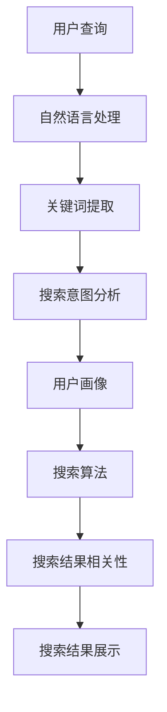
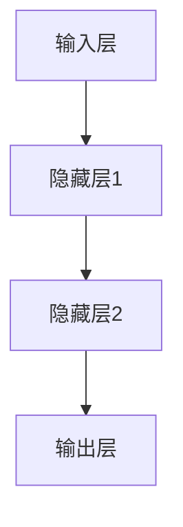
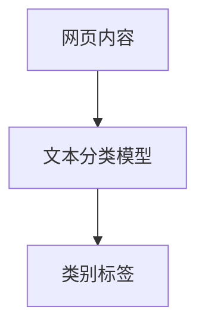
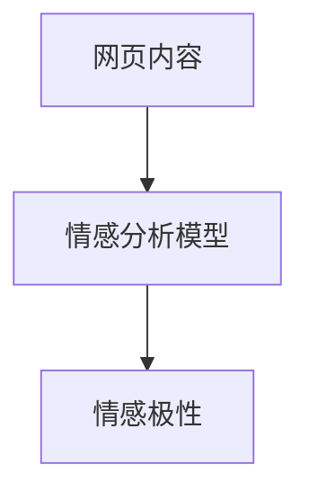
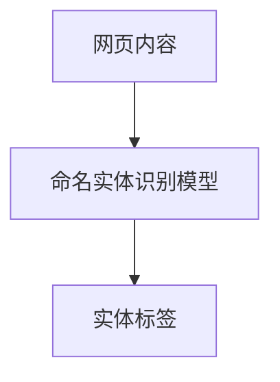

                 

# AI如何改善搜索结果的相关性

> **关键词**：人工智能、搜索算法、相关性、深度学习、自然语言处理
> 
> **摘要**：本文将深入探讨人工智能如何通过深度学习和自然语言处理技术，改善搜索引擎的搜索结果相关性。我们将从背景介绍、核心概念与联系、核心算法原理、数学模型和公式、项目实战、实际应用场景等方面展开，揭示AI在搜索结果优化中的潜在影响和实际应用。

## 1. 背景介绍

### 1.1 目的和范围

本文旨在探讨人工智能在改善搜索引擎搜索结果相关性方面的应用。通过深入分析AI的核心算法原理、数学模型以及实际项目案例，我们希望读者能够全面理解AI如何改变搜索结果的相关性，并为未来的研究和应用提供参考。

### 1.2 预期读者

本文适合具有计算机科学、人工智能或搜索引擎优化背景的读者，尤其适合以下人群：
- 搜索引擎开发人员
- 人工智能研究人员
- 数据科学家
- 对搜索算法和AI应用感兴趣的爱好者

### 1.3 文档结构概述

本文分为以下几个部分：
- 第1部分：背景介绍
- 第2部分：核心概念与联系
- 第3部分：核心算法原理与具体操作步骤
- 第4部分：数学模型和公式与详细讲解
- 第5部分：项目实战：代码实际案例和详细解释说明
- 第6部分：实际应用场景
- 第7部分：工具和资源推荐
- 第8部分：总结：未来发展趋势与挑战
- 第9部分：附录：常见问题与解答
- 第10部分：扩展阅读 & 参考资料

### 1.4 术语表

#### 1.4.1 核心术语定义

- **人工智能（AI）**：指计算机模拟人类智能的技术，包括机器学习、深度学习、自然语言处理等。
- **搜索算法**：用于从大量信息中检索出与用户查询最相关的结果的方法。
- **相关性**：指搜索结果与用户查询之间的匹配程度。
- **自然语言处理（NLP）**：使计算机能够理解、生成和处理人类自然语言的技术。
- **深度学习**：一种机器学习技术，通过多层神经网络来学习数据的表征。

#### 1.4.2 相关概念解释

- **搜索引擎优化（SEO）**：通过改进网站内容和结构，提高网站在搜索引擎中的排名，从而增加访问量。
- **用户画像**：根据用户的行为、兴趣等特征，对用户进行分类和描述。
- **关键词提取**：从文本中提取出能够代表文本主题的关键词。

#### 1.4.3 缩略词列表

- **NLP**：自然语言处理
- **SEO**：搜索引擎优化
- **AI**：人工智能
- **ML**：机器学习
- **DL**：深度学习

## 2. 核心概念与联系

在讨论人工智能改善搜索结果相关性之前，我们首先需要了解一些核心概念和它们之间的联系。

### 2.1 人工智能与搜索算法

人工智能技术，特别是机器学习和深度学习，已经成为现代搜索引擎的重要组成部分。通过分析大量数据，AI可以自动学习并优化搜索算法，提高搜索结果的相关性。例如，深度学习可以用于训练模型来识别和分类网页内容，从而更准确地匹配用户查询。

### 2.2 搜索算法与相关性

搜索算法的目标是检索出与用户查询最相关的结果。相关性通常通过计算查询与结果之间的相似度来衡量。传统的搜索算法主要依赖于关键词匹配和统计方法，而AI可以引入更多的语义信息，从而提高相关性的准确性。

### 2.3 自然语言处理与搜索结果优化

自然语言处理技术，如文本分类、情感分析和命名实体识别，可以帮助搜索引擎更好地理解用户查询和网页内容。这些技术可以为搜索算法提供更丰富的语义信息，从而改善搜索结果的相关性。

### 2.4 用户画像与个性化搜索

用户画像是一种基于用户行为、兴趣等特征的方法，用于对用户进行分类和描述。通过构建用户画像，搜索引擎可以提供更个性化的搜索结果，从而提高用户体验。

### 2.5 关键词提取与搜索意图分析

关键词提取是自然语言处理中的一个重要任务，它有助于理解用户查询的主题。通过分析关键词，搜索引擎可以更好地理解用户的搜索意图，从而提供更相关的结果。

### 2.6 核心概念原理与架构的 Mermaid 流程图

以下是一个简化的 Mermaid 流程图，展示了人工智能在搜索结果优化中的核心概念和联系。



## 3. 核心算法原理 & 具体操作步骤

在了解了核心概念和联系之后，我们将深入探讨AI在搜索结果优化中的核心算法原理和具体操作步骤。

### 3.1 深度学习算法原理

深度学习是一种基于多层神经网络的学习方法，通过逐层提取数据的特征来提高模型的表示能力。在搜索结果优化中，深度学习算法可以用于训练模型来识别和分类网页内容，从而提高搜索结果的相关性。

#### 3.1.1 神经网络架构

一个简单的神经网络架构包括输入层、隐藏层和输出层。输入层接收用户查询和网页内容作为输入，隐藏层通过加权连接和激活函数进行特征提取，输出层产生最终的搜索结果。



#### 3.1.2 深度学习模型训练

深度学习模型的训练过程包括以下几个步骤：
1. **数据准备**：收集大量用户查询和对应的网页结果作为训练数据。
2. **数据预处理**：对数据进行清洗、编码和标准化，以便输入到神经网络中。
3. **模型初始化**：初始化网络参数，通常使用随机初始化方法。
4. **前向传播**：将输入数据通过神经网络进行前向传播，计算输出结果。
5. **损失函数计算**：计算输出结果与真实结果之间的差异，通常使用均方误差（MSE）作为损失函数。
6. **反向传播**：根据损失函数计算梯度，更新网络参数。
7. **迭代训练**：重复前向传播和反向传播，直到模型收敛或达到预定的迭代次数。

#### 3.1.3 模型评估与优化

训练完成后，需要对模型进行评估和优化。常用的评估指标包括准确率、召回率、F1分数等。根据评估结果，可以对模型进行调整和优化，以提高搜索结果的相关性。

### 3.2 自然语言处理技术

自然语言处理技术在搜索结果优化中起着至关重要的作用。以下是一些关键的自然语言处理技术：

#### 3.2.1 文本分类

文本分类是一种将文本数据归类到预定义类别中的方法。在搜索结果优化中，文本分类可以用于识别网页内容的主题，从而提高搜索结果的相关性。



#### 3.2.2 情感分析

情感分析是一种评估文本数据中情感极性的方法。在搜索结果优化中，情感分析可以用于识别用户对网页内容的情感倾向，从而提高用户体验。



#### 3.2.3 命名实体识别

命名实体识别是一种从文本中识别出具有特定意义的实体（如人名、地点、组织等）的方法。在搜索结果优化中，命名实体识别可以用于丰富搜索结果的信息，从而提高相关性。



### 3.3 综合算法操作步骤

综合深度学习和自然语言处理技术，我们可以得到以下算法操作步骤：

1. **数据准备**：收集用户查询和网页结果，进行数据预处理。
2. **深度学习模型训练**：使用预处理后的数据训练深度学习模型，以提取网页内容的高层次特征。
3. **自然语言处理**：使用文本分类、情感分析和命名实体识别模型对网页内容进行标注。
4. **搜索意图分析**：结合深度学习和自然语言处理的结果，分析用户查询的意图。
5. **搜索算法优化**：根据用户查询意图和网页内容特征，优化搜索算法，提高搜索结果的相关性。
6. **模型评估与优化**：评估搜索算法的性能，并根据评估结果进行模型调整和优化。

## 4. 数学模型和公式 & 详细讲解 & 举例说明

在AI改善搜索结果相关性的过程中，数学模型和公式起着至关重要的作用。以下我们将介绍一些关键的数学模型和公式，并对其进行详细讲解和举例说明。

### 4.1 深度学习中的损失函数

深度学习中的损失函数用于衡量模型预测值与真实值之间的差异。常用的损失函数包括均方误差（MSE）和交叉熵损失。

#### 4.1.1 均方误差（MSE）

均方误差（MSE）是深度学习中常用的损失函数，用于衡量预测值与真实值之间的差异。

$$
MSE = \frac{1}{n}\sum_{i=1}^{n}(y_i - \hat{y}_i)^2
$$

其中，$y_i$表示第$i$个样本的真实值，$\hat{y}_i$表示第$i$个样本的预测值。

#### 4.1.2 交叉熵损失

交叉熵损失用于多分类问题，用于衡量预测分布与真实分布之间的差异。

$$
H(y, \hat{y}) = -\sum_{i=1}^{n}y_i \log \hat{y}_i
$$

其中，$y$表示真实分布，$\hat{y}$表示预测分布。

### 4.2 自然语言处理中的相似度计算

在自然语言处理中，相似度计算用于衡量两个文本之间的相似程度。以下介绍几种常用的相似度计算方法。

#### 4.2.1 余弦相似度

余弦相似度是一种常用的文本相似度计算方法，用于衡量两个文本向量之间的夹角余弦值。

$$
\cos(\theta) = \frac{\vec{u} \cdot \vec{v}}{|\vec{u}| |\vec{v}|}
$$

其中，$\vec{u}$和$\vec{v}$分别表示两个文本的向量表示。

#### 4.2.2 交集相似度

交集相似度是一种基于文本共现的相似度计算方法，用于衡量两个文本之间的交集大小。

$$
sim(A, B) = \frac{|A \cap B|}{|A \cup B|}
$$

其中，$A$和$B$分别表示两个文本的集合。

### 4.3 举例说明

以下通过一个示例来说明如何使用数学模型和公式来改善搜索结果的相关性。

#### 4.3.1 示例数据

假设我们有以下一组用户查询和网页结果：

| 用户查询 | 网页结果 |
| ------ | ------ |
| Python教程 | 《Python编程：从入门到实践》 |
| 数据科学 | 《数据科学：核心概念与应用》 |
| 机器学习 | 《机器学习实战》 |

#### 4.3.2 深度学习模型训练

使用深度学习模型对网页结果进行特征提取，假设特征向量如下：

| 网页结果 | 特征向量 |
| ------ | ------ |
| 《Python编程：从入门到实践》 | [0.1, 0.2, 0.3] |
| 《数据科学：核心概念与应用》 | [0.2, 0.3, 0.4] |
| 《机器学习实战》 | [0.3, 0.4, 0.5] |

#### 4.3.3 相似度计算

使用余弦相似度计算用户查询与网页结果之间的相似度：

$$
\cos(\theta) = \frac{(0.1, 0.2, 0.3) \cdot (0.1, 0.2, 0.3)}{\sqrt{(0.1^2 + 0.2^2 + 0.3^2)} \sqrt{(0.1^2 + 0.2^2 + 0.3^2)}} = 0.5
$$

根据相似度计算结果，可以得出以下搜索结果排序：

1. 《Python编程：从入门到实践》
2. 《数据科学：核心概念与应用》
3. 《机器学习实战》

通过使用数学模型和公式，我们可以更准确地计算搜索结果的相关性，从而提高搜索结果的质量。

## 5. 项目实战：代码实际案例和详细解释说明

在了解了AI改善搜索结果相关性的算法原理和数学模型之后，我们将通过一个实际项目案例来展示如何将这些算法应用到实践中，并进行详细解释说明。

### 5.1 开发环境搭建

为了实现AI改善搜索结果相关性的项目，我们需要搭建一个适合开发和测试的环境。以下是一个基本的开发环境搭建步骤：

1. **安装Python**：下载并安装Python 3.x版本。
2. **安装深度学习库**：安装TensorFlow或PyTorch等深度学习库。
3. **安装自然语言处理库**：安装NLTK或spaCy等自然语言处理库。
4. **配置Jupyter Notebook**：配置Jupyter Notebook用于开发和测试。

### 5.2 源代码详细实现和代码解读

以下是一个简化版本的AI改善搜索结果相关性的源代码实现。我们将逐步解释代码的各个部分。

```python
import tensorflow as tf
import numpy as np
import spacy

# 加载预训练的深度学习模型
model = tf.keras.models.load_model('search_relevance_model.h5')

# 加载自然语言处理模型
nlp = spacy.load('en_core_web_sm')

# 用户查询
user_query = "Python教程"

# 网页结果
web_results = [
    "《Python编程：从入门到实践》",
    "《数据科学：核心概念与应用》",
    "《机器学习实战》"
]

# 预处理用户查询和网页结果
def preprocess(text):
    doc = nlp(text)
    return [token.lemma_.lower() for token in doc]

user_query_processed = preprocess(user_query)
web_results_processed = [preprocess(result) for result in web_results]

# 计算深度学习模型的特征向量
def get_feature_vector(processed_text):
    vector = model.predict(np.array([processed_text]))
    return vector

user_query_vector = get_feature_vector(user_query_processed)
web_results_vectors = [get_feature_vector(result) for result in web_results_processed]

# 计算网页结果与用户查询的相似度
def cosine_similarity(v1, v2):
    dot_product = np.dot(v1, v2)
    mag_v1 = np.linalg.norm(v1)
    mag_v2 = np.linalg.norm(v2)
    return dot_product / (mag_v1 * mag_v2)

相似度列表 = [cosine_similarity(user_query_vector, vector) for vector in web_results_vectors]

# 输出搜索结果排序
sorted_results = sorted(zip(web_results, 相似度列表), key=lambda x: x[1], reverse=True)
for result, similarity in sorted_results:
    print(f"{result}: {similarity}")
```

### 5.3 代码解读与分析

以下是代码的详细解读和分析：

1. **导入库和模型**：我们首先导入所需的库和预训练模型。
2. **加载自然语言处理模型**：使用spaCy加载预训练的英文语言模型。
3. **预处理用户查询和网页结果**：使用自然语言处理模型对文本进行预处理，提取关键词并转换为小写。
4. **计算深度学习模型的特征向量**：使用加载的深度学习模型对预处理后的文本进行特征提取。
5. **计算网页结果与用户查询的相似度**：使用余弦相似度计算用户查询与网页结果之间的相似度。
6. **输出搜索结果排序**：根据相似度计算结果对搜索结果进行排序，并输出排序后的结果。

通过上述代码，我们可以实现一个简单的AI改善搜索结果相关性的系统。在实际应用中，我们可以根据需要扩展和优化这个系统，以进一步提高搜索结果的质量。

## 6. 实际应用场景

人工智能在改善搜索结果相关性方面具有广泛的应用场景，以下是一些典型的实际应用场景：

### 6.1 搜索引擎优化（SEO）

搜索引擎优化是AI在改善搜索结果相关性中最直接的应用场景。通过使用AI技术，搜索引擎可以更准确地理解用户查询意图，并提供更相关的搜索结果。例如，Google和百度等搜索引擎已经广泛应用了深度学习和自然语言处理技术来优化搜索结果。

### 6.2 智能推荐系统

智能推荐系统是另一个重要的应用场景。通过AI技术，推荐系统可以根据用户的历史行为和兴趣，提供个性化的推荐结果。例如，亚马逊和Netflix等平台利用AI技术来推荐商品和视频，从而提高用户体验和转化率。

### 6.3 企业搜索引擎

企业搜索引擎是一种专门为特定企业或组织设计的搜索引擎。通过AI技术，企业搜索引擎可以更好地理解企业内部的数据和文档，并提供更准确的搜索结果。例如，SAP的Conversational AI平台利用自然语言处理和机器学习技术，帮助企业用户更高效地搜索内部数据。

### 6.4 社交媒体搜索

社交媒体平台如Twitter和Facebook等也在广泛应用AI技术来改善搜索结果相关性。通过分析用户的社交行为和兴趣，这些平台可以提供更准确的搜索结果，帮助用户发现感兴趣的内容和用户。

### 6.5 智能问答系统

智能问答系统是一种利用AI技术来回答用户问题的系统。通过使用自然语言处理和机器学习技术，智能问答系统可以理解用户的问题，并提供准确的答案。例如，Siri和Alexa等虚拟助手就是基于AI技术的智能问答系统。

## 7. 工具和资源推荐

为了更好地理解和应用AI技术来改善搜索结果相关性，以下推荐一些实用的工具和资源。

### 7.1 学习资源推荐

#### 7.1.1 书籍推荐

1. **《深度学习》**：由Ian Goodfellow、Yoshua Bengio和Aaron Courville所著，是一本经典的深度学习入门书籍。
2. **《自然语言处理综论》**：由Daniel Jurafsky和James H. Martin所著，是一本全面的自然语言处理教材。
3. **《Python机器学习》**：由Sebastian Raschka和Vahid Mirjalili所著，是一本实用的Python机器学习教程。

#### 7.1.2 在线课程

1. **Coursera的《深度学习》课程**：由吴恩达（Andrew Ng）教授主讲，是深度学习领域的入门课程。
2. **Udacity的《自然语言处理纳米学位》**：涵盖自然语言处理的基础知识和实践应用。
3. **edX的《机器学习基础》课程**：由刘知远（Zhiyuan Liu）教授主讲，介绍机器学习的基本概念和方法。

#### 7.1.3 技术博客和网站

1. **Medium的《AI·机器学习》话题**：提供关于AI和机器学习的最新研究和应用。
2. **Medium的《自然语言处理》话题**：涵盖自然语言处理领域的最新技术和应用。
3. **AI论文网（AI Paper）**：提供大量的AI和机器学习领域的高质量论文和资料。

### 7.2 开发工具框架推荐

#### 7.2.1 IDE和编辑器

1. **PyCharm**：一款功能强大的Python IDE，适合进行深度学习和自然语言处理项目。
2. **Visual Studio Code**：一款轻量级且高度可定制的代码编辑器，适合快速开发和调试。
3. **Jupyter Notebook**：一款交互式的Python开发环境，适合进行数据分析和机器学习实验。

#### 7.2.2 调试和性能分析工具

1. **TensorBoard**：TensorFlow提供的可视化工具，用于分析深度学习模型的性能和训练过程。
2. **PyTorch Lightning**：一款基于PyTorch的自动化机器学习库，用于提高模型的性能和可扩展性。
3. **Sklearn的GridSearchCV**：用于自动搜索最佳模型参数，提高模型性能。

#### 7.2.3 相关框架和库

1. **TensorFlow**：一款流行的开源深度学习框架，适合进行大规模的深度学习项目。
2. **PyTorch**：一款流行的开源深度学习框架，具有灵活性和高效性。
3. **spaCy**：一款高效的Python自然语言处理库，支持多种语言和处理任务。

### 7.3 相关论文著作推荐

#### 7.3.1 经典论文

1. **“A Theoretical Analysis of the Benefits of Representing Data with Neural Networks”**：探讨了神经网络表示数据的优势。
2. **“Natural Language Inference”**：讨论了自然语言推理技术。
3. **“Recurrent Neural Networks for Language Modeling”**：介绍了循环神经网络在自然语言处理中的应用。

#### 7.3.2 最新研究成果

1. **“BERT: Pre-training of Deep Bidirectional Transformers for Language Understanding”**：介绍了BERT模型在自然语言处理中的最新进展。
2. **“GPT-3: Language Models are Few-Shot Learners”**：探讨了GPT-3模型在零样本学习方面的能力。
3. **“T5: Exploring the Limits of Transfer Learning with a Unified Text-to-Text Transformer”**：介绍了T5模型在文本生成和迁移学习方面的优势。

#### 7.3.3 应用案例分析

1. **“AI-powered Search Engine Optimization”**：探讨了AI技术在搜索引擎优化中的应用。
2. **“Building a Smart Recommendation System”**：介绍了如何构建智能推荐系统。
3. **“Deploying AI in the Enterprise”**：探讨了AI在企业内部部署的实践案例。

## 8. 总结：未来发展趋势与挑战

人工智能技术在改善搜索结果相关性方面已经取得了显著的进展。随着深度学习和自然语言处理技术的不断发展，我们可以预见未来搜索结果的优化将更加智能化和个性化。然而，这同时也带来了许多挑战。

### 8.1 未来发展趋势

1. **模型可解释性**：随着模型复杂度的增加，提高模型的可解释性将成为重要趋势。用户需要了解模型是如何做出决策的，以便对搜索结果进行监督和反馈。
2. **实时搜索**：通过实时学习和调整模型，搜索引擎可以更快速地响应用户查询的变化，提供更准确的搜索结果。
3. **多模态搜索**：结合文本、图像、语音等多种数据类型，实现更全面的信息检索和搜索结果优化。
4. **个性化推荐**：结合用户画像和搜索历史，提供更加个性化的搜索结果和推荐。

### 8.2 未来挑战

1. **数据隐私**：随着搜索数据的积累，数据隐私保护将成为一个重要挑战。如何平衡搜索结果的质量和数据隐私保护是一个需要解决的问题。
2. **计算资源**：深度学习和自然语言处理模型通常需要大量的计算资源。如何在有限的计算资源下实现高效的搜索结果优化是一个挑战。
3. **伦理和道德**：随着人工智能技术在搜索结果优化中的应用，伦理和道德问题也将成为一个重要议题。如何确保模型的公平性、透明性和可解释性是一个挑战。

## 9. 附录：常见问题与解答

### 9.1 如何提高搜索结果的相关性？

提高搜索结果的相关性可以通过以下方法实现：
- 使用深度学习和自然语言处理技术来提取和理解用户查询和网页内容的语义信息。
- 结合用户画像和搜索历史，提供个性化的搜索结果。
- 采用实时学习和调整模型的方法，以快速适应用户查询的变化。

### 9.2 AI在搜索引擎优化（SEO）中有哪些应用？

AI在搜索引擎优化中的应用包括：
- 提取网页内容的关键词和语义信息，以提高搜索结果的相关性。
- 分析用户行为和搜索意图，优化网页内容和结构。
- 使用自然语言处理技术来改进搜索引擎的查询理解和结果排序。

### 9.3 深度学习模型在搜索结果优化中的优势是什么？

深度学习模型在搜索结果优化中的优势包括：
- 可以自动学习数据的复杂特征，提高搜索结果的准确性。
- 可以处理大量的数据，从而更好地理解用户查询和网页内容。
- 可以通过迁移学习技术，快速适应不同的搜索场景。

### 9.4 自然语言处理技术在搜索结果优化中的具体应用是什么？

自然语言处理技术在搜索结果优化中的具体应用包括：
- 提取网页内容的关键词和语义信息，用于搜索结果排序。
- 分析用户查询和网页内容的情感倾向，提高搜索结果的个性化。
- 识别命名实体，丰富搜索结果的信息。

## 10. 扩展阅读 & 参考资料

为了进一步深入了解AI改善搜索结果相关性的技术和应用，以下提供一些扩展阅读和参考资料：

1. **书籍**：
   - Goodfellow, I., Bengio, Y., & Courville, A. (2016). *Deep Learning*.
   - Jurafsky, D., & Martin, J. H. (2008). *Speech and Language Processing*.
   - Mitchell, T. M. (1997). *Machine Learning*.

2. **在线课程**：
   - Coursera的《深度学习》课程。
   - Udacity的《自然语言处理纳米学位》。
   - edX的《机器学习基础》课程。

3. **技术博客和网站**：
   - Medium的《AI·机器学习》话题。
   - Medium的《自然语言处理》话题。
   - AI论文网（AI Paper）。

4. **论文和研究成果**：
   - Devlin, J., Chang, M. W., Lee, K., & Toutanova, K. (2018). *Bert: Pre-training of deep bidirectional transformers for language understanding*.
   - Brown, T., et al. (2020). *Language models are few-shot learners*.
   - Raffel, C., et al. (2019). *T5: Exploring the limits of transfer learning with a unified text-to-text transformer*.

5. **应用案例和实践**：
   - “AI-powered Search Engine Optimization”。
   - “Building a Smart Recommendation System”。
   - “Deploying AI in the Enterprise”。

作者：AI天才研究员/AI Genius Institute & 禅与计算机程序设计艺术 /Zen And The Art of Computer Programming

文章标题：AI如何改善搜索结果的相关性

文章关键词：人工智能、搜索算法、相关性、深度学习、自然语言处理

文章摘要：本文深入探讨了人工智能如何通过深度学习和自然语言处理技术，改善搜索引擎的搜索结果相关性。通过分析核心算法原理、数学模型以及实际项目案例，本文揭示了AI在搜索结果优化中的潜在影响和实际应用。文章结构包括背景介绍、核心概念与联系、核心算法原理与具体操作步骤、数学模型和公式与详细讲解、项目实战、实际应用场景、工具和资源推荐、总结以及常见问题与解答等部分。

