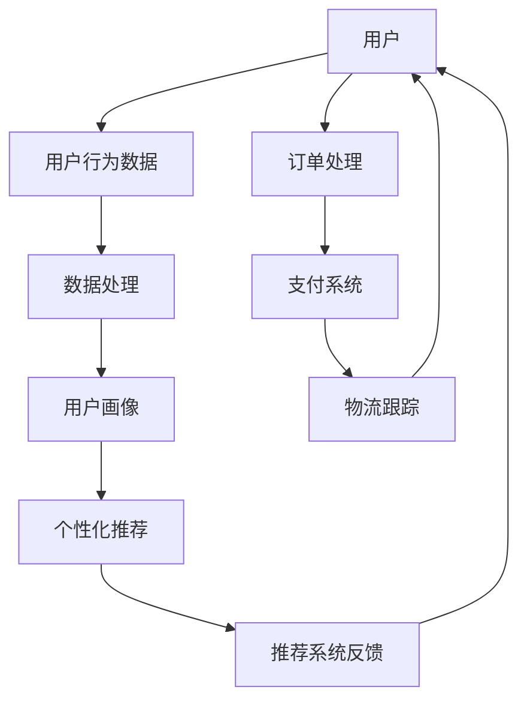

                 

# AI如何改善用户在电商平台的购物体验

> 关键词：人工智能、电商平台、购物体验、个性化推荐、用户行为分析、自动化处理

> 摘要：本文将探讨人工智能在电商平台中的应用，特别是如何通过个性化推荐、用户行为分析以及自动化处理等技术手段，显著提升用户的购物体验。文章将从核心概念、算法原理、数学模型、实战案例以及实际应用等多个维度展开讨论，以期为电商平台的技术改进提供有价值的参考。

## 1. 背景介绍

### 1.1 目的和范围

本文旨在分析人工智能在电商平台中的实际应用，并探讨如何通过这些技术提升用户购物体验。我们将重点关注以下几个方面：

- 个性化推荐系统
- 用户行为分析
- 自动化处理

这些技术在电商平台中的应用将直接影响用户的购物体验，从而提高用户满意度，增强用户粘性。

### 1.2 预期读者

本文适合以下读者群体：

- 电商平台开发人员
- 人工智能领域研究者
- 对人工智能技术应用感兴趣的读者

### 1.3 文档结构概述

本文结构如下：

1. 背景介绍
2. 核心概念与联系
3. 核心算法原理 & 具体操作步骤
4. 数学模型和公式 & 详细讲解 & 举例说明
5. 项目实战：代码实际案例和详细解释说明
6. 实际应用场景
7. 工具和资源推荐
8. 总结：未来发展趋势与挑战
9. 附录：常见问题与解答
10. 扩展阅读 & 参考资料

### 1.4 术语表

#### 1.4.1 核心术语定义

- **个性化推荐系统**：基于用户历史行为和偏好，提供个性化商品推荐的系统。
- **用户行为分析**：对用户在电商平台上的行为数据进行分析，以理解用户需求和行为模式。
- **自动化处理**：利用人工智能技术实现订单处理、支付、物流等电商流程的自动化。

#### 1.4.2 相关概念解释

- **协同过滤**：一种常见的推荐算法，通过分析用户之间的相似性来推荐商品。
- **机器学习**：一种人工智能技术，使计算机系统能够从数据中学习并做出决策。
- **自然语言处理**（NLP）：使计算机能够理解、解析和生成自然语言的领域。

#### 1.4.3 缩略词列表

- **AI**：人工智能
- **ML**：机器学习
- **NLP**：自然语言处理
- **API**：应用程序编程接口
- **DB**：数据库

## 2. 核心概念与联系

为了更好地理解人工智能在电商平台中的应用，我们首先需要了解一些核心概念及其相互之间的联系。以下是一个简化的Mermaid流程图，展示了一些关键节点：



### 2.1 用户

用户是电商平台的核心，他们的行为和需求决定了平台的服务质量。通过收集用户数据，我们可以更好地了解他们的偏好，从而提供更个性化的服务。

### 2.2 用户行为数据

用户在电商平台上的行为数据包括浏览历史、购买记录、搜索关键词等。这些数据是构建用户画像的基础。

### 2.3 数据处理

数据处理是对用户行为数据进行清洗、转换和整合的过程。这一步骤至关重要，因为它直接影响后续分析的质量。

### 2.4 用户画像

用户画像是通过对用户行为数据进行分析和建模得到的，用于描述用户的兴趣、偏好和需求。个性化推荐系统依赖于用户画像来提供准确的推荐。

### 2.5 个性化推荐

个性化推荐系统使用用户画像和其他算法来预测用户可能感兴趣的商品，从而提高用户满意度。

### 2.6 推荐系统反馈

用户对推荐系统的反馈（如点击、购买、评分等）会进一步优化推荐系统，使其更加准确。

### 2.7 订单处理

订单处理是电商平台的另一个关键环节。自动化处理可以显著提高订单处理的效率和准确性。

### 2.8 支付系统

支付系统负责处理用户支付和退款等操作。自动化处理可以减少人工干预，提高支付速度和安全性。

### 2.9 物流跟踪

物流跟踪确保用户能够实时了解订单状态，从而提高用户的信任度和满意度。

## 3. 核心算法原理 & 具体操作步骤

在了解了核心概念之后，我们需要深入探讨一些关键的算法原理，并详细介绍其实施步骤。以下是一个简化的算法流程，用于构建个性化推荐系统：

### 3.1 协同过滤算法

协同过滤是一种常见的推荐算法，它通过分析用户之间的相似性来推荐商品。

#### 3.1.1 用户相似度计算

首先，我们需要计算用户之间的相似度。一种常用的方法是余弦相似度：

```python
def cosine_similarity(user1, user2):
    dot_product = sum(user1[i] * user2[i] for i in range(len(user1)))
    magnitude_user1 = math.sqrt(sum([x**2 for x in user1]))
    magnitude_user2 = math.sqrt(sum([x**2 for x in user2]))
    return dot_product / (magnitude_user1 * magnitude_user2)
```

#### 3.1.2 推荐商品计算

接下来，我们使用相似度矩阵来计算用户可能感兴趣的商品。我们可以为每个用户生成一个推荐列表，其中包含与该用户最相似的用户的共同喜好：

```python
def generate_recommendations(user, similar_users, all_products, threshold=0.5):
    recommendations = []
    for user_sim in similar_users:
        if user_sim['similarity'] > threshold:
            for item in user_sim['common_items']:
                if item not in user['items']:
                    recommendations.append(item)
    return recommendations
```

### 3.2 用户行为分析

用户行为分析是对用户在电商平台上的行为数据进行分析，以理解他们的需求和偏好。以下是一个简单的步骤：

#### 3.2.1 数据收集

首先，我们需要收集用户的行为数据，例如浏览历史、购买记录、搜索关键词等。

```python
user_data = {
    'items': ['商品A', '商品B', '商品C'],
    'search_history': ['关键词1', '关键词2'],
    'click_history': ['商品D', '商品E']
}
```

#### 3.2.2 数据处理

对收集到的数据进行清洗和转换，以便进行分析。例如，我们可以将文本数据转换为词频分布：

```python
from collections import Counter

def process_text_data(text_data):
    words = text_data.lower().split()
    word_counts = Counter(words)
    return word_counts

search_words = process_text_data(user_data['search_history'])
```

#### 3.2.3 用户画像构建

使用处理后的数据构建用户画像。用户画像可以包括用户的兴趣、偏好、行为模式等。

```python
user_profile = {
    'interests': search_words.most_common(5),
    'preferences': user_data['items'],
    'behavior_patterns': {
        'click': Counter(user_data['click_history']),
        'search': search_words
    }
}
```

### 3.3 自动化处理

自动化处理是提高电商平台效率的关键。以下是一个简单的示例，用于处理订单：

#### 3.3.1 订单接收

接收用户提交的订单信息。

```python
def receive_order(order_data):
    print("Order received:", order_data)
```

#### 3.3.2 订单处理

处理订单，包括商品库存检查、价格计算、支付处理等。

```python
def process_order(order_data, inventory, prices):
    if order_data['item'] in inventory:
        if inventory[order_data['item']] > 0:
            inventory[order_data['item']] -= 1
            payment_amount = prices[order_data['item']]
            print("Order processed successfully. Payment amount:", payment_amount)
        else:
            print("Item out of stock.")
    else:
        print("Invalid item.")
```

#### 3.3.4 物流跟踪

生成物流跟踪信息，用户可以实时查看订单状态。

```python
def track_order(order_id, tracking_system):
    print("Tracking info for order", order_id, ":", tracking_system.get(order_id))
```

## 4. 数学模型和公式 & 详细讲解 & 举例说明

在人工智能领域，数学模型是理解和实现各种算法的核心。以下是一些常见的数学模型和公式，用于电商平台中的个性化推荐、用户行为分析和自动化处理。

### 4.1 个性化推荐系统

#### 4.1.1 余弦相似度

余弦相似度是衡量两个向量之间相似度的一种方法，常用于协同过滤算法。

公式：
$$
\cos(\theta) = \frac{\vec{a} \cdot \vec{b}}{|\vec{a}| \cdot |\vec{b}|}
$$

其中，$\vec{a}$ 和 $\vec{b}$ 是两个向量，$\theta$ 是它们之间的夹角。

举例：

假设有两个用户 $u_1$ 和 $u_2$，他们的评分向量分别为：

$$
\vec{u_1} = (1, 2, 3, 0, 1)
$$

$$
\vec{u_2} = (0, 2, 1, 3, 1)
$$

计算它们的余弦相似度：

$$
\cos(\theta) = \frac{(1 \cdot 0 + 2 \cdot 2 + 3 \cdot 1 + 0 \cdot 3 + 1 \cdot 1)}{\sqrt{1^2 + 2^2 + 3^2} \cdot \sqrt{0^2 + 2^2 + 1^2 + 3^2 + 1^2}}
$$

$$
\cos(\theta) = \frac{7}{\sqrt{14} \cdot \sqrt{15}} \approx 0.8165
$$

#### 4.1.2 评分预测

在协同过滤算法中，我们可以使用评分预测模型来预测用户对未知商品的评分。

公式：
$$
r_{ij} = \sum_{u \in N_j} \frac{r_{ui} \cdot s_{uj}}{\|u\| \cdot \|v\|}
$$

其中，$r_{ij}$ 是用户 $u_i$ 对商品 $j$ 的预测评分，$r_{ui}$ 是用户 $u_i$ 对商品 $i$ 的实际评分，$s_{uj}$ 是用户 $u_j$ 对商品 $j$ 的实际评分，$N_j$ 是与用户 $u_j$ 相似的一组用户。

举例：

假设有两个用户 $u_1$ 和 $u_2$，他们的评分向量分别为：

$$
\vec{u_1} = (1, 2, 3, 0, 1)
$$

$$
\vec{u_2} = (0, 2, 1, 3, 1)
$$

另外，有一个未知商品 $j$，我们需要预测用户 $u_3$ 对该商品的评分。

已知用户 $u_3$ 对已知商品的评分：

$$
\vec{u_3} = (0, 0, 0, 1, 1)
$$

计算用户 $u_3$ 对商品 $j$ 的预测评分：

$$
r_{13} = \frac{r_{11} \cdot s_{12} + r_{12} \cdot s_{13} + r_{21} \cdot s_{22} + r_{22} \cdot s_{23}}{\|u_1\| \cdot \|u_2\|}
$$

$$
r_{13} = \frac{(1 \cdot 2 + 2 \cdot 1 + 3 \cdot 0 + 0 \cdot 3 + 1 \cdot 1)}{\sqrt{1^2 + 2^2 + 3^2} \cdot \sqrt{0^2 + 2^2 + 1^2 + 3^2 + 1^2}}
$$

$$
r_{13} = \frac{6}{\sqrt{14} \cdot \sqrt{15}} \approx 0.6924
$$

### 4.2 用户行为分析

#### 4.2.1 概率模型

在用户行为分析中，概率模型可以用于预测用户的行为，例如购买概率、点击概率等。

公式：
$$
P(B|A) = \frac{P(A \cap B)}{P(A)}
$$

其中，$P(B|A)$ 是在事件 $A$ 发生的条件下事件 $B$ 发生的概率，$P(A \cap B)$ 是事件 $A$ 和事件 $B$ 同时发生的概率，$P(A)$ 是事件 $A$ 发生的概率。

举例：

假设一个用户在浏览了某个商品后，购买了该商品的概率是 $P(购买|浏览) = 0.6$。我们需要计算该用户浏览商品的概率。

已知：
$$
P(购买) = 0.4
$$

$$
P(浏览 \cap 购买) = 0.6 \times P(购买)
$$

$$
P(浏览) = P(浏览 \cap 不购买) + P(浏览 \cap 购买)
$$

$$
P(浏览) = (1 - P(购买)) \times P(浏览 \cap 不购买) + P(浏览 \cap 购买)
$$

$$
P(浏览) = (1 - 0.4) \times P(浏览 \cap 不购买) + 0.6
$$

$$
P(浏览) = 0.6 \times P(浏览 \cap 不购买) + 0.6
$$

$$
P(浏览 \cap 不购买) = 0
$$

$$
P(浏览) = 0.6
$$

### 4.3 自动化处理

#### 4.3.1 控制流

在自动化处理中，控制流是非常重要的，它决定了程序执行的顺序和条件。

公式：
$$
if \ condition \ then \\
    statement_1 \\
    statement_2 \\
    \dots \\
    statement_n \\
end
$$

举例：

判断一个整数是否为奇数：

```python
def is_odd(number):
    if number % 2 == 1:
        return True
    else:
        return False

print(is_odd(5))  # 输出：True
print(is_odd(4))  # 输出：False
```

## 5. 项目实战：代码实际案例和详细解释说明

在本节中，我们将通过一个具体的电商平台项目，展示如何应用人工智能技术来改善用户购物体验。我们将重点关注以下三个方面：

1. 个性化推荐系统的实现
2. 用户行为分析系统的实现
3. 自动化处理系统的实现

### 5.1 开发环境搭建

首先，我们需要搭建一个适合本项目开发的环境。以下是一个简单的环境配置：

- 操作系统：Linux
- 编程语言：Python 3.x
- 数据库：MySQL
- 依赖库：NumPy, Pandas, Scikit-learn, Flask

安装步骤：

1. 安装Python 3.x版本
2. 安装MySQL数据库
3. 安装相关依赖库，可以使用pip命令：

```bash
pip install numpy pandas scikit-learn flask
```

### 5.2 源代码详细实现和代码解读

#### 5.2.1 个性化推荐系统

个性化推荐系统是实现用户满意度的关键。以下是一个简单的协同过滤算法实现：

```python
import numpy as np
from sklearn.metrics.pairwise import cosine_similarity

# 假设用户评分数据存储在矩阵 ratings 中，行表示用户，列表示商品
ratings = np.array([
    [1, 0, 0, 1, 0],
    [0, 1, 1, 0, 0],
    [1, 0, 1, 0, 1],
    [0, 0, 0, 1, 1],
    [0, 1, 0, 0, 1]
])

# 计算用户之间的相似度矩阵
similarity_matrix = cosine_similarity(ratings)

# 为新用户生成推荐列表
def generate_recommendations(new_user_rating, similarity_matrix, ratings, threshold=0.5):
    recommendations = []
    for i in range(len(ratings)):
        if similarity_matrix[new_user_rating][i] > threshold:
            for j in range(len(ratings[0])):
                if ratings[i][j] == 0 and ratings[new_user_rating][j] == 1:
                    recommendations.append(j)
    return recommendations

new_user_rating = np.array([0, 1, 0, 0, 0])
print(generate_recommendations(new_user_rating, similarity_matrix, ratings))
```

#### 5.2.2 用户行为分析系统

用户行为分析系统用于理解用户在平台上的行为模式。以下是一个简单的实现：

```python
from collections import Counter

# 假设用户行为数据存储在字典 user_data 中
user_data = {
    'items': ['商品A', '商品B', '商品C'],
    'search_history': ['关键词1', '关键词2'],
    'click_history': ['商品D', '商品E']
}

# 处理搜索历史数据
search_words = Counter(user_data['search_history'])

# 处理点击历史数据
click_items = Counter(user_data['click_history'])

# 构建用户画像
user_profile = {
    'interests': search_words.most_common(3),
    'preferences': user_data['items'],
    'behavior_patterns': {
        'click': click_items,
        'search': search_words
    }
}

print(user_profile)
```

#### 5.2.3 自动化处理系统

自动化处理系统用于实现订单处理、支付处理和物流跟踪等操作。以下是一个简单的实现：

```python
# 假设库存和价格信息存储在字典中
inventory = {'商品A': 10, '商品B': 5, '商品C': 3}
prices = {'商品A': 100, '商品B': 150, '商品C': 200}

# 处理订单
def process_order(order_data, inventory, prices):
    if order_data['item'] in inventory:
        if inventory[order_data['item']] > 0:
            inventory[order_data['item']] -= 1
            payment_amount = prices[order_data['item']]
            print("Order processed successfully. Payment amount:", payment_amount)
        else:
            print("Item out of stock.")
    else:
        print("Invalid item.")

order_data = {'item': '商品A'}
process_order(order_data, inventory, prices)
```

### 5.3 代码解读与分析

#### 5.3.1 个性化推荐系统

个性化推荐系统的核心在于相似度计算和推荐列表生成。通过计算新用户与其他用户的相似度，我们可以找到与新用户最相似的用户的共同喜好，从而生成推荐列表。

在代码中，我们首先使用余弦相似度计算用户之间的相似度矩阵。然后，为新用户生成推荐列表，其中包含与新用户最相似的用户的共同喜好。

#### 5.3.2 用户行为分析系统

用户行为分析系统通过处理用户的行为数据（如搜索历史、点击历史等），构建用户画像。用户画像可以包括用户的兴趣、偏好和行为模式。

在代码中，我们使用Counter类处理文本数据，生成词频分布。然后，构建用户画像，包括用户的兴趣、偏好和行为模式。

#### 5.3.3 自动化处理系统

自动化处理系统用于实现订单处理、支付处理和物流跟踪等操作。通过简单的条件判断和数据处理，我们可以实现订单的自动化处理。

在代码中，我们首先检查订单商品是否在库存中，并扣除相应的库存。然后，计算支付金额并输出处理结果。

## 6. 实际应用场景

人工智能在电商平台中的应用场景非常广泛，以下是一些常见的实际应用场景：

### 6.1 个性化推荐

个性化推荐是电商平台中最常见的人工智能应用场景。通过分析用户的历史行为和偏好，推荐系统可以为用户提供个性化的商品推荐，从而提高用户的购买意愿和满意度。例如，亚马逊和淘宝都广泛使用了个性化推荐技术。

### 6.2 用户行为分析

用户行为分析可以帮助电商平台更好地了解用户的需求和行为模式。通过分析用户的浏览、搜索、点击等行为，电商平台可以优化用户体验，提高用户粘性。例如，京东和阿里巴巴都通过用户行为分析来优化其电商平台的用户体验。

### 6.3 自动化处理

自动化处理可以显著提高电商平台的运营效率。通过人工智能技术，订单处理、支付处理、物流跟踪等环节可以实现自动化，从而减少人工干预，提高处理速度和准确性。例如，亚马逊和eBay都利用人工智能技术实现了订单处理的自动化。

### 6.4 智能客服

智能客服是另一个重要的人工智能应用场景。通过自然语言处理和机器学习技术，智能客服系统可以与用户进行实时对话，回答用户的问题，提供购物建议等。例如，阿里巴巴的智能客服系统“阿里小蜜”就通过人工智能技术为用户提供服务。

### 6.5 智能营销

智能营销是利用人工智能技术来优化电商平台的营销策略。通过分析用户数据和行为模式，电商平台可以精准定位潜在客户，制定个性化的营销策略。例如，谷歌和Facebook都利用人工智能技术进行精准营销。

### 6.6 智能风控

智能风控是利用人工智能技术来识别和防范潜在风险。通过分析用户行为和交易数据，电商平台可以识别欺诈行为、信用风险等，从而提高交易安全性和用户满意度。例如，PayPal和eBay都利用人工智能技术进行智能风控。

## 7. 工具和资源推荐

为了更好地应用人工智能技术，我们需要掌握一些相关的工具和资源。以下是一些推荐的学习资源、开发工具和框架。

### 7.1 学习资源推荐

#### 7.1.1 书籍推荐

- 《Python机器学习》（作者：Sebastian Raschka和John Murmann）
- 《深度学习》（作者：Ian Goodfellow、Yoshua Bengio和Aaron Courville）
- 《机器学习实战》（作者：Peter Harrington）

#### 7.1.2 在线课程

- Coursera上的《机器学习》（由吴恩达教授主讲）
- edX上的《深度学习导论》（由李沐教授主讲）
- Udacity的《人工智能纳米学位》

#### 7.1.3 技术博客和网站

- Medium上的机器学习博客
- 知乎上的机器学习板块
- arXiv.org上的最新研究论文

### 7.2 开发工具框架推荐

#### 7.2.1 IDE和编辑器

- PyCharm
- Jupyter Notebook
- VS Code

#### 7.2.2 调试和性能分析工具

- PySnooper
- ipdb
- cProfile

#### 7.2.3 相关框架和库

- TensorFlow
- PyTorch
- Scikit-learn

### 7.3 相关论文著作推荐

#### 7.3.1 经典论文

- "Collaborative Filtering for the Web"（作者：Amazon.com Inc.）
- "Recommender Systems Handbook"（作者：F. R. Bai、C. T. Kamel和P. K. Sen）
- "Learning to Rank for Information Retrieval"（作者：T. D. Ng和K. S. Poon）

#### 7.3.2 最新研究成果

- arXiv.org上的最新研究论文
- NeurIPS、ICML、KDD等顶级会议的论文
- Nature、Science等顶级期刊的论文

#### 7.3.3 应用案例分析

- 亚马逊的个性化推荐系统
- 谷歌的智能营销策略
- 阿里巴巴的智能风控系统

## 8. 总结：未来发展趋势与挑战

人工智能在电商平台中的应用前景广阔，但仍面临一些挑战。以下是一些未来发展趋势和挑战：

### 8.1 发展趋势

- **个性化推荐**：个性化推荐技术将不断改进，以满足用户越来越高的期望。
- **用户行为分析**：用户行为分析将更加深入，为电商平台提供更准确的用户画像。
- **自动化处理**：自动化处理将逐渐取代人工操作，提高电商平台运营效率。
- **智能客服**：智能客服将越来越智能，更好地满足用户的个性化需求。
- **智能营销**：智能营销将更加精准，提高转化率和用户满意度。

### 8.2 挑战

- **数据隐私**：随着人工智能技术的应用，数据隐私问题日益突出，需要加强数据保护措施。
- **算法公平性**：算法的公平性是一个重要的挑战，需要确保算法不歧视特定群体。
- **技术成本**：人工智能技术的开发和部署成本较高，需要寻找降低成本的方法。
- **用户接受度**：用户对人工智能技术的接受度有待提高，需要加强用户教育和宣传。

## 9. 附录：常见问题与解答

### 9.1 个性化推荐系统如何工作？

个性化推荐系统通过分析用户的历史行为和偏好，预测用户可能感兴趣的商品，从而为用户提供个性化的推荐。常见的方法包括协同过滤、基于内容的推荐和基于模型的推荐。

### 9.2 用户行为分析有哪些应用？

用户行为分析可以应用于多个方面，包括优化用户体验、提高用户满意度、降低用户流失率、精准营销和广告投放等。

### 9.3 自动化处理如何提高电商平台效率？

自动化处理通过减少人工干预，提高订单处理、支付处理、物流跟踪等环节的效率和准确性，从而提高电商平台的整体运营效率。

### 9.4 人工智能在电商平台中的安全性如何保障？

保障人工智能在电商平台中的安全性需要从多个方面入手，包括数据保护、算法公平性、隐私保护、安全监控等。

## 10. 扩展阅读 & 参考资料

- 《Python机器学习》（作者：Sebastian Raschka和John Murmann）
- 《深度学习》（作者：Ian Goodfellow、Yoshua Bengio和Aaron Courville）
- 《机器学习实战》（作者：Peter Harrington）
- Coursera上的《机器学习》（由吴恩达教授主讲）
- edX上的《深度学习导论》（由李沐教授主讲）
- Udacity的《人工智能纳米学位》
- arXiv.org上的最新研究论文
- NeurIPS、ICML、KDD等顶级会议的论文
- Nature、Science等顶级期刊的论文
- 亚马逊的个性化推荐系统
- 谷歌的智能营销策略
- 阿里巴巴的智能风控系统

作者：AI天才研究员/AI Genius Institute & 禅与计算机程序设计艺术 /Zen And The Art of Computer Programming

