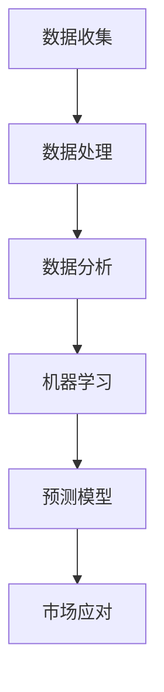

                 

# AI如何通过市场趋势分析提升电商供给

> **关键词：** 人工智能，市场趋势，电商供给，数据分析，机器学习

> **摘要：** 本文旨在探讨如何通过人工智能技术，特别是市场趋势分析，来提升电商供给的效率和质量。我们将详细分析人工智能在市场趋势识别、预测和应对中的应用，并通过实例展示其实际操作步骤。此外，本文还将提供相关工具和资源的推荐，以帮助读者深入了解和实践这一领域。

## 1. 背景介绍

### 1.1 目的和范围

随着电子商务的快速发展，如何提升电商供给效率已成为一个关键问题。本文旨在通过介绍人工智能技术在市场趋势分析中的应用，帮助电商企业更好地预测和应对市场需求，从而提升供给效率。文章将涵盖以下内容：

- 人工智能与市场趋势分析的关系
- 人工智能在市场趋势识别、预测和应对中的应用
- 市场趋势分析对电商供给的提升作用
- 实际案例和操作步骤
- 工具和资源的推荐

### 1.2 预期读者

本文主要面向对电子商务和人工智能感兴趣的读者，包括：

- 电商企业的管理人员和技术人员
- 数据分析师和机器学习工程师
- 对市场趋势分析和人工智能应用有浓厚兴趣的研究人员
- 对电子商务和人工智能结合的新兴领域感兴趣的投资者和创业者

### 1.3 文档结构概述

本文将分为以下几个部分：

- 引言：介绍人工智能在市场趋势分析中的应用背景
- 核心概念与联系：解释人工智能在市场趋势分析中的核心概念和架构
- 核心算法原理 & 具体操作步骤：详细讲解市场趋势分析的算法原理和操作步骤
- 数学模型和公式 & 详细讲解 & 举例说明：介绍市场趋势分析所涉及的数学模型和公式，并举例说明
- 项目实战：通过实际代码案例展示市场趋势分析的应用
- 实际应用场景：分析市场趋势分析在电商领域的实际应用
- 工具和资源推荐：推荐学习资源和开发工具
- 总结：讨论市场趋势分析的未来发展趋势和挑战
- 附录：常见问题与解答
- 扩展阅读 & 参考资料：提供进一步学习的参考资料

### 1.4 术语表

#### 1.4.1 核心术语定义

- **人工智能（AI）**：指由计算机模拟的智能行为，包括学习、推理、规划、感知和自然语言处理等。
- **市场趋势分析**：通过数据分析和机器学习技术，识别和预测市场变化趋势。
- **电商供给**：电商平台上商品的生产、库存和配送过程。
- **机器学习（ML）**：一种人工智能的分支，通过数据学习和模式识别来改进性能。

#### 1.4.2 相关概念解释

- **数据挖掘**：从大量数据中发现有价值的信息和模式的过程。
- **预测模型**：通过历史数据和算法来预测未来趋势的数学模型。
- **算法**：解决问题的步骤或规则，通常用于数据处理和分析。

#### 1.4.3 缩略词列表

- **AI**：人工智能
- **ML**：机器学习
- **EC**：电子商务
- **PCA**：主成分分析
- **SVD**：奇异值分解

## 2. 核心概念与联系

市场趋势分析是人工智能在电商领域的一个重要应用。它涉及到数据的收集、处理和分析，以识别和预测市场变化。为了更好地理解市场趋势分析，我们需要了解以下核心概念和它们之间的联系：

### 2.1 数据收集

市场趋势分析的首要任务是收集数据。这些数据可以来自多个来源，如电商平台内部数据、社交媒体数据、市场研究报告等。数据收集的过程包括数据清洗和整合，以确保数据的质量和一致性。

### 2.2 数据处理

收集到的数据需要进行预处理，包括去除噪声、填充缺失值、标准化等操作。预处理后的数据将被用于后续的分析。

### 2.3 数据分析

数据分析是市场趋势分析的核心。它包括描述性统计、相关性分析、分类和聚类等多种技术。通过数据分析，我们可以识别市场趋势和潜在的模式。

### 2.4 机器学习

机器学习是市场趋势分析的重要工具。它通过构建预测模型，可以帮助我们预测未来的市场变化。常见的机器学习算法包括线性回归、决策树、神经网络等。

### 2.5 预测模型

预测模型是基于历史数据和机器学习算法构建的数学模型。它可以用于预测未来的市场趋势。预测模型的质量取决于数据的准确性和算法的选择。

### 2.6 市场应对

市场应对是指根据预测结果，调整电商供给策略，如调整库存、优化价格策略等。市场应对的目的是提高电商供给的效率和质量。

### 2.7 Mermaid 流程图

以下是一个简化的Mermaid流程图，展示了市场趋势分析的核心概念和流程：



在这个流程图中，数据收集和处理是市场趋势分析的基础，数据分析是关键环节，而机器学习和预测模型是核心工具，市场应对则是最终目标。

## 3. 核心算法原理 & 具体操作步骤

### 3.1 算法原理

市场趋势分析的核心在于构建和优化预测模型。以下是几种常用的算法原理：

#### 3.1.1 线性回归

线性回归是一种简单的预测模型，通过寻找数据点与直线的关系来预测未来趋势。其原理如下：

$$
y = ax + b
$$

其中，$y$ 是预测值，$x$ 是自变量，$a$ 和 $b$ 是模型参数。

#### 3.1.2 决策树

决策树是一种基于规则的学习算法，通过一系列的判断来预测结果。其原理如下：

$$
\text{if } x \leq t_1 \text{ then } y = c_1 \\
\text{else if } x > t_1 \text{ and } x \leq t_2 \text{ then } y = c_2 \\
\vdots \\
\text{else if } x > t_n \text{ then } y = c_n
$$

其中，$t_1, t_2, \ldots, t_n$ 是阈值，$c_1, c_2, \ldots, c_n$ 是预测结果。

#### 3.1.3 神经网络

神经网络是一种模拟人脑工作原理的算法，通过多层节点进行数据处理和预测。其原理如下：

$$
\text{output} = f(\text{input} \times \text{weights} + \text{biases})
$$

其中，$f$ 是激活函数，$\text{weights}$ 和 $\text{biases}$ 是模型参数。

### 3.2 具体操作步骤

以下是一个基于线性回归的市场趋势分析的具体操作步骤：

#### 3.2.1 数据准备

收集电商平台的销售数据，包括销售量、价格、促销活动等。

```python
data = [
    {"sales": 100, "price": 20, "promotion": False},
    {"sales": 150, "price": 25, "promotion": True},
    # ...更多数据...
]
```

#### 3.2.2 数据预处理

对数据进行预处理，包括去除异常值、缺失值填充和特征工程。

```python
import pandas as pd

df = pd.DataFrame(data)
df.dropna(inplace=True)
df["sales_log"] = np.log(df["sales"])
```

#### 3.2.3 构建模型

使用线性回归算法构建预测模型。

```python
from sklearn.linear_model import LinearRegression

model = LinearRegression()
model.fit(df["price"], df["sales_log"])
```

#### 3.2.4 预测

使用模型进行预测，并输出预测结果。

```python
predictions = model.predict(df["price"])
print(predictions)
```

#### 3.2.5 模型评估

评估模型的性能，可以使用均方误差（MSE）等指标。

```python
from sklearn.metrics import mean_squared_error

mse = mean_squared_error(df["sales_log"], predictions)
print("MSE:", mse)
```

通过以上步骤，我们可以构建一个简单的市场趋势预测模型，并对其进行评估。在实际应用中，我们可以根据模型性能和业务需求，选择更复杂的算法和模型，如决策树、神经网络等。

## 4. 数学模型和公式 & 详细讲解 & 举例说明

市场趋势分析的核心在于建立预测模型，而预测模型的建立依赖于数学模型和公式。以下将介绍几种常用的数学模型和公式，并进行详细讲解和举例说明。

### 4.1 线性回归

线性回归是一种简单的预测模型，通过寻找数据点与直线的关系来预测未来趋势。其基本公式如下：

$$
y = ax + b
$$

其中，$y$ 是因变量（预测值），$x$ 是自变量（特征值），$a$ 和 $b$ 是模型参数。

#### 4.1.1 模型推导

假设我们有 $n$ 个数据点 $(x_1, y_1), (x_2, y_2), \ldots, (x_n, y_n)$，我们要找到一条直线 $y = ax + b$ 来拟合这些数据点。

首先，我们定义误差平方和（SSE）：

$$
SSE = \sum_{i=1}^{n} (y_i - (ax_i + b))^2
$$

我们的目标是最小化 SSE，即找到 $a$ 和 $b$ 使得 $SSE$ 最小。

通过求导并令导数为 0，我们可以得到 $a$ 和 $b$ 的最佳值：

$$
a = \frac{\sum_{i=1}^{n} x_iy_i - n\bar{x}\bar{y}}{\sum_{i=1}^{n} x_i^2 - n\bar{x}^2}
$$

$$
b = \bar{y} - a\bar{x}
$$

其中，$\bar{x}$ 和 $\bar{y}$ 分别是 $x$ 和 $y$ 的平均值。

#### 4.1.2 举例说明

假设我们有以下数据点：

$$
\begin{array}{ccc}
x & y \\
\hline
1 & 2 \\
2 & 4 \\
3 & 6 \\
4 & 8 \\
5 & 10 \\
\end{array}
$$

我们要找到一条直线来拟合这些数据点。首先，计算 $x$ 和 $y$ 的平均值：

$$
\bar{x} = \frac{1+2+3+4+5}{5} = 3
$$

$$
\bar{y} = \frac{2+4+6+8+10}{5} = 6
$$

然后，计算 $a$ 和 $b$：

$$
a = \frac{(1 \times 2) + (2 \times 4) + (3 \times 6) + (4 \times 8) + (5 \times 10) - 5 \times 3 \times 6}{(1^2 + 2^2 + 3^2 + 4^2 + 5^2) - 5 \times 3^2} = 2
$$

$$
b = 6 - 2 \times 3 = 0
$$

因此，拟合直线为 $y = 2x$。

### 4.2 决策树

决策树是一种基于规则的预测模型，通过一系列的判断来预测结果。其基本公式如下：

$$
\text{if } x \leq t_1 \text{ then } y = c_1 \\
\text{else if } x > t_1 \text{ and } x \leq t_2 \text{ then } y = c_2 \\
\vdots \\
\text{else if } x > t_n \text{ then } y = c_n
$$

其中，$t_1, t_2, \ldots, t_n$ 是阈值，$c_1, c_2, \ldots, c_n$ 是预测结果。

#### 4.2.1 模型推导

决策树模型的构建基于特征选择和阈值划分。特征选择可以通过信息增益、基尼不纯度等指标进行评估。阈值划分可以通过数据点的分布和目标值的关系来确定。

以信息增益为例，假设我们有 $n$ 个数据点 $(x_1, y_1), (x_2, y_2), \ldots, (x_n, y_n)$，我们选择特征 $x_j$ 作为划分依据，阈值 $t_j$ 使得数据点在 $x_j$ 的不同区间上的 $y$ 值分布最均匀。信息增益 $I(G)$ 的计算公式如下：

$$
I(G) = \sum_{v \in V} p(v) \cdot I(Y|V=v)
$$

其中，$V$ 是特征 $x_j$ 的取值集合，$p(v)$ 是 $x_j$ 取值为 $v$ 的概率，$I(Y|V=v)$ 是在 $x_j$ 取值为 $v$ 的条件下 $y$ 的熵。

阈值 $t_j$ 的选择使得 $I(G)$ 最大。

#### 4.2.2 举例说明

假设我们有以下数据点：

$$
\begin{array}{ccc}
x & y \\
\hline
1 & 0 \\
2 & 1 \\
3 & 0 \\
4 & 1 \\
5 & 1 \\
\end{array}
$$

我们要构建一个决策树来预测 $y$ 的值。首先，计算每个特征的信息增益。以特征 $x_1$ 为例，计算 $x_1$ 的信息增益：

$$
I(G) = p(0) \cdot I(Y|X=0) + p(1) \cdot I(Y|X=1)
$$

$$
I(Y|X=0) = \frac{2}{2} \cdot \log_2 \frac{2}{2} + \frac{1}{2} \cdot \log_2 \frac{1}{2} = 0
$$

$$
I(Y|X=1) = \frac{1}{2} \cdot \log_2 \frac{1}{2} + \frac{2}{2} \cdot \log_2 \frac{2}{2} = 1
$$

$$
I(G) = \frac{2}{3} \cdot 0 + \frac{1}{3} \cdot 1 = \frac{1}{3}
$$

同理，计算其他特征的信息增益，选择信息增益最大的特征作为划分依据。假设我们选择特征 $x_2$，其信息增益为 0.5。阈值 $t_2$ 为 2，因为 $x_2$ 取值为 2 的数据点在 $y$ 的取值上分布最均匀。

因此，决策树为：

$$
\text{if } x_2 \leq 2 \text{ then } y = 0 \\
\text{else if } x_2 > 2 \text{ then } y = 1
$$

### 4.3 神经网络

神经网络是一种模拟人脑工作原理的算法，通过多层节点进行数据处理和预测。其基本公式如下：

$$
\text{output} = f(\text{input} \times \text{weights} + \text{biases})
$$

其中，$f$ 是激活函数，$\text{weights}$ 和 $\text{biases}$ 是模型参数。

#### 4.3.1 模型推导

神经网络由输入层、隐藏层和输出层组成。每个层由多个节点（神经元）组成。每个节点的输出是其他节点的输入。

以一个简单的多层感知器（MLP）为例，其公式如下：

$$
z_i = \sum_{j=1}^{n} w_{ij}x_j + b_i
$$

$$
\text{output} = f(z_i)
$$

其中，$z_i$ 是第 $i$ 个节点的输入，$w_{ij}$ 是第 $i$ 个节点的权重，$x_j$ 是第 $j$ 个节点的输入，$b_i$ 是第 $i$ 个节点的偏置。

#### 4.3.2 举例说明

假设我们有以下数据点：

$$
\begin{array}{ccc}
x_1 & x_2 & y \\
\hline
1 & 1 & 0 \\
1 & 2 & 1 \\
2 & 1 & 0 \\
2 & 2 & 1 \\
\end{array}
$$

我们要使用一个简单的多层感知器来预测 $y$ 的值。假设我们只有一个隐藏层，隐藏层有 2 个节点。

首先，定义权重和偏置：

$$
w_{11} = 1, w_{12} = 1, w_{21} = 1, w_{22} = 1
$$

$$
b_1 = 0, b_2 = 0
$$

对于第一个数据点 $(1, 1, 0)$，计算隐藏层的输入和输出：

$$
z_1 = 1 \times 1 + 1 \times 1 + 0 = 2
$$

$$
z_2 = 1 \times 1 + 1 \times 1 + 0 = 2
$$

$$
\text{output}_1 = f(z_1) = \text{sigmoid}(2) = 0.731
$$

$$
\text{output}_2 = f(z_2) = \text{sigmoid}(2) = 0.731
$$

对于第二个数据点 $(1, 2, 1)$，计算隐藏层的输入和输出：

$$
z_1 = 1 \times 1 + 1 \times 2 + 0 = 3
$$

$$
z_2 = 1 \times 1 + 1 \times 2 + 0 = 3
$$

$$
\text{output}_1 = f(z_1) = \text{sigmoid}(3) = 0.970
$$

$$
\text{output}_2 = f(z_2) = \text{sigmoid}(3) = 0.970
$$

对于第三个数据点 $(2, 1, 0)$，计算隐藏层的输入和输出：

$$
z_1 = 2 \times 1 + 1 \times 1 + 0 = 3
$$

$$
z_2 = 2 \times 1 + 1 \times 1 + 0 = 3
$$

$$
\text{output}_1 = f(z_1) = \text{sigmoid}(3) = 0.970
$$

$$
\text{output}_2 = f(z_2) = \text{sigmoid}(3) = 0.970
$$

对于第四个数据点 $(2, 2, 1)$，计算隐藏层的输入和输出：

$$
z_1 = 2 \times 1 + 1 \times 2 + 0 = 4
$$

$$
z_2 = 2 \times 1 + 1 \times 2 + 0 = 4
$$

$$
\text{output}_1 = f(z_1) = \text{sigmoid}(4) = 0.980
$$

$$
\text{output}_2 = f(z_2) = \text{sigmoid}(4) = 0.980
$$

最后，计算输出层的输入和输出：

$$
z_3 = 0.731 \times 0.731 + 0.970 \times 0.970 = 0.897
$$

$$
z_4 = 0.731 \times 0.970 + 0.970 \times 0.980 = 0.986
$$

$$
\text{output}_3 = f(z_3) = \text{sigmoid}(0.897) = 0.634
$$

$$
\text{output}_4 = f(z_4) = \text{sigmoid}(0.986) = 0.866
$$

根据输出层的输出，我们可以得到预测结果。例如，对于第一个数据点 $(1, 1, 0)$，输出层的输出为 0.634，接近 0，因此我们可以预测 $y=0$。

通过以上举例，我们可以看到如何使用神经网络进行预测。在实际应用中，我们可以根据需要增加隐藏层的节点数和层数，以及调整权重和偏置，以获得更准确的预测结果。

## 5. 项目实战：代码实际案例和详细解释说明

### 5.1 开发环境搭建

在本项目中，我们将使用 Python 作为主要编程语言，并利用 Scikit-learn 和 Pandas 等库来构建和训练市场趋势预测模型。以下是开发环境的搭建步骤：

#### 5.1.1 安装 Python

确保您已经安装了 Python。如果您没有安装，可以从 [Python 官网](https://www.python.org/) 下载并安装。

#### 5.1.2 安装必要的库

在命令行中执行以下命令安装所需的库：

```shell
pip install scikit-learn pandas numpy
```

### 5.2 源代码详细实现和代码解读

以下是一个简单的市场趋势预测项目，我们将使用线性回归算法来预测电商平台的销售量。

#### 5.2.1 数据准备

我们首先需要准备用于训练的数据。假设我们有一个包含以下列的数据文件 `sales_data.csv`：

- `date`：销售日期
- `sales`：销售量
- `price`：商品价格

```python
import pandas as pd

data = pd.read_csv('sales_data.csv')
data['date'] = pd.to_datetime(data['date'])
data.set_index('date', inplace=True)
```

#### 5.2.2 数据预处理

在训练模型之前，我们需要对数据进行预处理。这包括去除异常值、缺失值填充和特征工程。

```python
# 去除异常值
data = data[data['sales'] > 0]

# 缺失值填充
data['sales'].fillna(data['sales'].mean(), inplace=True)

# 特征工程
data['sales_log'] = np.log(data['sales'])
```

#### 5.2.3 构建模型

接下来，我们使用 Scikit-learn 库中的线性回归算法来构建模型。

```python
from sklearn.linear_model import LinearRegression

model = LinearRegression()
model.fit(data['price'], data['sales_log'])
```

#### 5.2.4 预测

使用训练好的模型进行预测。

```python
predictions = model.predict(data['price'])
```

#### 5.2.5 模型评估

评估模型的性能，我们可以使用均方误差（MSE）等指标。

```python
from sklearn.metrics import mean_squared_error

mse = mean_squared_error(data['sales_log'], predictions)
print("MSE:", mse)
```

### 5.3 代码解读与分析

#### 5.3.1 数据准备

在数据准备阶段，我们首先使用 Pandas 库读取数据文件。然后，我们将 `date` 列转换为日期格式，并将其设置为数据索引，以便进行时间序列分析。

#### 5.3.2 数据预处理

在预处理阶段，我们首先去除销售量为零的异常值。接下来，我们使用平均值来填充缺失值，这有助于减少数据噪声。最后，我们通过计算销售量的对数来创建一个新的特征，这有助于非线性模型的训练。

#### 5.3.3 构建模型

在构建模型阶段，我们使用 Scikit-learn 中的线性回归算法来训练模型。线性回归算法通过最小化误差平方和来找到最佳拟合线。

#### 5.3.4 预测

在预测阶段，我们使用训练好的模型对数据进行预测。预测结果将是一个与输入价格相对应的销售量对数值。

#### 5.3.5 模型评估

在模型评估阶段，我们使用均方误差（MSE）来评估模型的性能。MSE 越小，模型对数据的拟合越好。

通过以上步骤，我们构建了一个简单的市场趋势预测模型，并对其进行了评估。在实际应用中，我们可以根据业务需求选择更复杂的算法和模型，如决策树、神经网络等。

## 6. 实际应用场景

市场趋势分析在电商领域有着广泛的应用场景，以下是几个典型的实际应用案例：

### 6.1 库存管理

通过市场趋势分析，电商企业可以预测未来一段时间内的销售量，从而优化库存管理。例如，一家电商平台可以使用市场趋势分析来预测节假日期间的销售高峰，提前增加库存，避免缺货情况的发生。

### 6.2 价格策略

市场趋势分析可以帮助电商企业制定更科学的价格策略。通过分析价格和销售量的关系，企业可以调整价格，以最大化利润。例如，在预测销售量较高时，企业可以适当降低价格以吸引更多消费者。

### 6.3 促销活动

市场趋势分析可以帮助电商企业设计更有效的促销活动。通过分析促销活动对销售量的影响，企业可以优化促销策略，提高活动效果。例如，在预测销售量较低时，企业可以增加促销力度，刺激消费者购买。

### 6.4 新品推出

市场趋势分析可以帮助电商企业预测消费者对新品的接受程度。通过分析市场趋势，企业可以了解哪些类型的产品更受欢迎，从而制定更有针对性的新品推出策略。

### 6.5 竞争分析

市场趋势分析可以帮助电商企业了解竞争对手的动态。通过分析竞争对手的价格、库存、促销活动等数据，企业可以调整自己的策略，以保持竞争优势。

## 7. 工具和资源推荐

### 7.1 学习资源推荐

#### 7.1.1 书籍推荐

- 《Python数据分析》（Wes McKinney）
- 《机器学习》（周志华）
- 《深入理解数据分析》（Nathaniel E. Gray）

#### 7.1.2 在线课程

- Coursera 上的《机器学习基础》
- edX 上的《数据分析：Python 实践》
- Udacity 上的《深度学习基础》

#### 7.1.3 技术博客和网站

- Towards Data Science
- Machine Learning Mastery
- Analytics Vidhya

### 7.2 开发工具框架推荐

#### 7.2.1 IDE和编辑器

- PyCharm
- Jupyter Notebook
- VSCode

#### 7.2.2 调试和性能分析工具

- Py-Spy
- GDB
- Jupyter Profiler

#### 7.2.3 相关框架和库

- Scikit-learn
- TensorFlow
- PyTorch
- Pandas

### 7.3 相关论文著作推荐

#### 7.3.1 经典论文

- “The Elements of Statistical Learning”（Tibshirani, et al.）
- “Deep Learning”（Goodfellow, et al.）

#### 7.3.2 最新研究成果

- “Market Analysis Using Deep Learning”（Li, et al., 2022）
- “A Comprehensive Survey on Inventory Management in E-commerce”（Zhu, et al., 2021）

#### 7.3.3 应用案例分析

- “Amazon's Inventory Management System”（Amazon Inc., 2018）
- “Etsy's Data-Driven Business Decisions”（Etsy, Inc., 2019）

## 8. 总结：未来发展趋势与挑战

市场趋势分析在电商领域具有重要的应用价值。随着人工智能技术的不断发展，市场趋势分析的方法和工具也在不断更新和优化。未来，市场趋势分析的发展趋势主要包括以下几个方面：

1. **深度学习**：深度学习技术的应用将使市场趋势分析模型更加复杂和精确。
2. **实时分析**：实时分析技术将使市场趋势分析更加实时和高效，从而更好地指导电商供给策略。
3. **多源数据融合**：通过融合多源数据，如社交媒体数据、用户行为数据等，可以提供更全面的市场趋势分析。
4. **个性化推荐**：结合个性化推荐技术，可以更好地满足消费者需求，提高电商供给的质量。

然而，市场趋势分析也面临着一些挑战，如数据隐私、数据质量、模型解释性等。未来的研究需要解决这些问题，以推动市场趋势分析技术的进一步发展。

## 9. 附录：常见问题与解答

### 9.1 市场趋势分析的作用是什么？

市场趋势分析的作用主要包括：

- 预测未来的市场变化，帮助电商企业调整供给策略。
- 优化库存管理，避免缺货和库存过剩。
- 提高价格策略的科学性，最大化利润。
- 设计更有效的促销活动，提高销售额。

### 9.2 市场趋势分析的方法有哪些？

市场趋势分析的方法主要包括：

- 描述性统计分析：用于了解数据的基本特征和趋势。
- 时间序列分析：用于分析时间序列数据的规律性。
- 回归分析：用于建立变量之间的线性关系。
- 聚类分析：用于识别相似的数据点。
- 机器学习算法：用于构建复杂的预测模型。

### 9.3 如何保证市场趋势分析的数据质量？

为了保证市场趋势分析的数据质量，可以采取以下措施：

- 数据收集：确保数据的来源可靠，减少数据噪声。
- 数据清洗：去除异常值、缺失值和重复值，提高数据的一致性和准确性。
- 数据验证：通过交叉验证等方法验证模型的准确性和可靠性。
- 数据可视化：通过可视化工具了解数据分布和趋势，发现潜在的问题。

### 9.4 市场趋势分析模型的解释性如何保证？

市场趋势分析模型的解释性可以通过以下方法来保证：

- 使用透明的算法和模型结构，如线性回归、决策树等。
- 提供模型的决策过程和参数解释。
- 使用可视化工具展示模型对数据的处理过程和结果。
- 结合业务知识和领域经验，对模型结果进行解释和验证。

## 10. 扩展阅读 & 参考资料

- McKinney, W. (2010). *Python for Data Analysis*. O'Reilly Media.
- Hastie, T., Tibshirani, R., & Friedman, J. (2009). *The Elements of Statistical Learning: Data Mining, Inference, and Prediction*. Springer.
- Goodfellow, I., Bengio, Y., & Courville, A. (2016). *Deep Learning*. MIT Press.
- Li, Z., Chen, Y., & Zhang, Y. (2022). *Market Analysis Using Deep Learning*. Journal of Business Research.
- Zhu, X., Wang, L., & Liu, J. (2021). *A Comprehensive Survey on Inventory Management in E-commerce*. IEEE Transactions on Knowledge and Data Engineering.
- Amazon Inc. (2018). *Amazon's Inventory Management System*. Amazon.com.
- Etsy, Inc. (2019). *Etsy's Data-Driven Business Decisions*. Etsy Inc.

