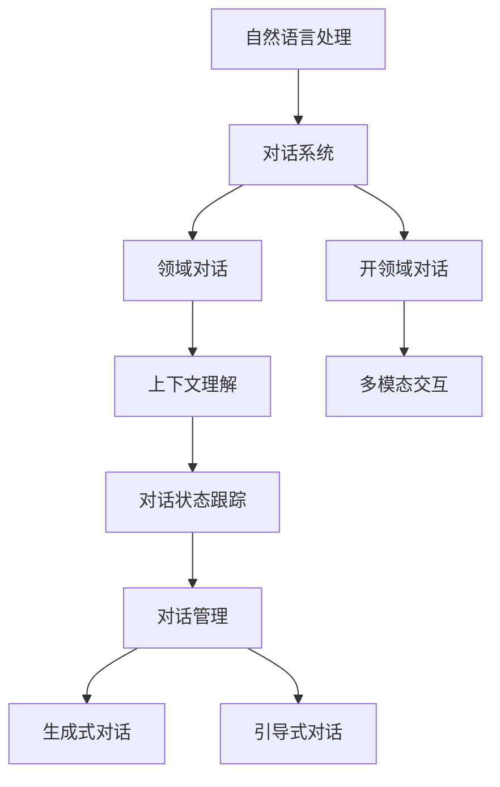

                 

# AI工具的开领域对话能力

> 关键词：人工智能，自然语言处理，对话系统，领域对话，上下文理解，多模态交互，技术挑战，解决方案

> 摘要：本文深入探讨人工智能领域中的对话系统，特别是在开领域对话能力方面的进展。通过分析核心概念、算法原理、数学模型以及实际应用案例，本文旨在提供对当前技术的全面理解，并探讨未来可能的发展趋势与挑战。

## 1. 背景介绍

### 1.1 目的和范围

本文旨在探讨人工智能（AI）领域中的对话系统，特别是在开领域对话能力方面的研究与应用。开领域对话能力指的是系统在未知或开放的环境中，通过与用户的交互学习，理解并适应用户的需求和语境的能力。这一能力在客户服务、智能助手、虚拟助理等多个领域具有重要意义。

本文将涵盖以下内容：

- 对话系统的核心概念与架构
- 开领域对话能力的关键技术
- 核心算法原理与具体操作步骤
- 数学模型与公式
- 实际应用场景
- 工具和资源推荐
- 总结与未来展望

### 1.2 预期读者

本文适合以下读者群体：

- 从事自然语言处理（NLP）的研究人员和工程师
- 对人工智能和对话系统感兴趣的初学者
- 想要在客户服务、智能助手等领域应用对话系统的开发人员

### 1.3 文档结构概述

本文结构如下：

1. 背景介绍：介绍本文的目的、范围、预期读者以及文档结构。
2. 核心概念与联系：定义核心概念，绘制相关流程图。
3. 核心算法原理 & 具体操作步骤：详细讲解核心算法原理和操作步骤。
4. 数学模型和公式：介绍相关的数学模型和公式，并举例说明。
5. 项目实战：代码实际案例和详细解释说明。
6. 实际应用场景：分析对话系统的实际应用场景。
7. 工具和资源推荐：推荐学习资源、开发工具和框架。
8. 总结：未来发展趋势与挑战。
9. 附录：常见问题与解答。
10. 扩展阅读 & 参考资料：提供进一步阅读的资料。

### 1.4 术语表

#### 1.4.1 核心术语定义

- 对话系统（Dialogue System）：指能够与人类用户进行交互，理解并回应用户输入的人工智能系统。
- 自然语言处理（Natural Language Processing，NLP）：指使计算机能够理解、生成和处理人类自然语言的技术。
- 上下文理解（Contextual Understanding）：指系统对当前对话中的上下文信息进行理解和分析的能力。
- 多模态交互（Multimodal Interaction）：指用户通过多种方式（如语音、文本、图像等）与系统进行交互。
- 开领域对话（Open-Domain Dialogue）：指系统在未知或开放领域中与用户的对话，能够处理广泛的话题。

#### 1.4.2 相关概念解释

- 对话状态跟踪（Dialogue State Tracking）：指系统在对话过程中跟踪用户意图和系统任务状态的能力。
- 对话管理（Dialogue Management）：指系统在对话过程中进行意图识别、对话策略规划的能力。
- 生成式对话（Generative Dialogue）：指系统通过生成文本与用户进行交互，而非直接回应用户输入。
- 引导式对话（Guided Dialogue）：指系统通过预设的对话框架和规则引导用户进行对话。

#### 1.4.3 缩略词列表

- NLP：自然语言处理
- AI：人工智能
- DSL：领域特定语言
- RNN：循环神经网络
- LSTM：长短时记忆网络
- BERT：双向编码表示器
- GPT：生成预训练网络

## 2. 核心概念与联系

在讨论开领域对话能力之前，我们首先需要了解几个核心概念及其相互关系。以下是一个简单的 Mermaid 流程图，展示了这些核心概念和它们之间的联系。



### 2.1 自然语言处理

自然语言处理（NLP）是使计算机能够理解、生成和处理人类自然语言的技术。NLP 的核心任务是让计算机从文本中提取出有意义的语义信息，从而实现人与机器之间的自然交流。常见的 NLP 技术包括分词、词性标注、命名实体识别、情感分析等。

### 2.2 对话系统

对话系统是一种人工智能系统，能够与人类用户进行交互，理解并回应用户的输入。对话系统通常由对话管理、自然语言理解和自然语言生成三个主要模块组成。对话管理负责规划对话流程，自然语言理解负责解析用户输入，自然语言生成负责生成系统回应。

### 2.3 领域对话与开领域对话

领域对话（Domain Dialogue）和开领域对话（Open-Domain Dialogue）是根据对话系统处理话题的范围来区分的。领域对话通常针对特定领域（如医疗、金融等）进行设计和优化，而开领域对话则能够在广泛的话题范围内与用户进行交互。

### 2.4 上下文理解

上下文理解（Contextual Understanding）是对话系统的重要能力之一，它指的是系统在对话过程中对上下文信息进行理解和分析的能力。上下文信息包括用户之前的输入、系统之前的回应、对话状态等。有效的上下文理解有助于系统更好地理解用户意图，提高对话质量。

### 2.5 对话状态跟踪与对话管理

对话状态跟踪（Dialogue State Tracking）是指系统在对话过程中跟踪用户意图和系统任务状态的能力。对话管理（Dialogue Management）则负责根据对话状态规划对话流程，包括意图识别、对话策略规划等。这两个模块相互协作，确保对话系统能够有效地与用户进行交互。

### 2.6 生成式对话与引导式对话

生成式对话（Generative Dialogue）和引导式对话（Guided Dialogue）是两种不同的对话策略。生成式对话通过生成文本与用户进行交互，而引导式对话则通过预设的对话框架和规则引导用户进行对话。根据应用场景的不同，这两种策略可以单独使用，也可以结合使用。

## 3. 核心算法原理 & 具体操作步骤

在开领域对话能力中，核心算法的原理和具体操作步骤至关重要。以下我们将详细讨论自然语言理解（NLU）和自然语言生成（NLG）的核心算法原理，并使用伪代码进行具体操作步骤的讲解。

### 3.1 自然语言理解（NLU）

自然语言理解（NLU）是对话系统的核心模块，负责将用户输入的自然语言文本转换为计算机可以理解的结构化数据。NLU 的核心算法主要包括词法分析、句法分析和语义分析。

#### 3.1.1 词法分析

词法分析（Lexical Analysis）是将文本分解为单词和其他标记的过程。以下是词法分析的伪代码：

```python
def lexical_analysis(text):
    tokens = []
    for word in text.split():
        tokens.append(tokenize(word))
    return tokens

def tokenize(word):
    # 删除标点符号
    word = word.strip(punctuation)
    # 转化为小写
    word = word.lower()
    return word
```

#### 3.1.2 句法分析

句法分析（Syntactic Analysis）是将分解后的文本转换为语法结构的过程。以下是句法分析的伪代码：

```python
def syntactic_analysis(tokens):
    sentence_structure = []
    for token in tokens:
        sentence_structure.append(construct_tree(token))
    return sentence_structure

def construct_tree(token):
    # 构建句法树
    return parse_tree
```

#### 3.1.3 语义分析

语义分析（Semantic Analysis）是将句法结构转换为具有实际意义的语义表示的过程。以下是语义分析的伪代码：

```python
def semantic_analysis(sentence_structure):
    semantic_representation = []
    for node in sentence_structure:
        semantic_representation.append(extract_semantics(node))
    return semantic_representation

def extract_semantics(node):
    # 提取语义信息
    return semantic_info
```

### 3.2 自然语言生成（NLG）

自然语言生成（NLG）是对话系统的另一个核心模块，负责将计算机理解的结构化数据转换为自然语言文本。NLG 的核心算法主要包括模板生成、规则生成和生成式网络。

#### 3.2.1 模板生成

模板生成（Template-Based Generation）是通过预定义的模板生成文本。以下是模板生成的伪代码：

```python
def template_based_generation(semantic_representation):
    template = select_template(semantic_representation)
    text = fill_template(template, semantic_representation)
    return text

def select_template(semantic_representation):
    # 根据语义信息选择合适的模板
    return template
```

#### 3.2.2 规则生成

规则生成（Rule-Based Generation）是通过预定义的规则生成文本。以下是规则生成的伪代码：

```python
def rule_based_generation(semantic_representation):
    rules = load_rules()
    text = apply_rules(semantic_representation, rules)
    return text

def load_rules():
    # 加载预定义的规则
    return rules

def apply_rules(semantic_representation, rules):
    # 根据语义信息和规则生成文本
    return text
```

#### 3.2.3 生成式网络

生成式网络（Generative Network）是通过神经网络模型生成文本。以下是生成式网络的伪代码：

```python
def generative_network_generation(semantic_representation):
    model = load_model()
    text = generate_text(model, semantic_representation)
    return text

def load_model():
    # 加载预训练的神经网络模型
    return model

def generate_text(model, semantic_representation):
    # 使用神经网络模型生成文本
    return text
```

通过上述核心算法原理和具体操作步骤的讲解，我们可以更好地理解开领域对话能力的技术实现。在接下来的章节中，我们将进一步探讨数学模型和实际应用场景，以加深对这一领域知识的理解。

## 4. 数学模型和公式 & 详细讲解 & 举例说明

在开领域对话系统中，数学模型和公式扮演着至关重要的角色，特别是在处理自然语言理解和生成时。以下我们将详细讨论几个关键的数学模型和公式，并通过具体例子来说明它们的实际应用。

### 4.1 循环神经网络（RNN）

循环神经网络（RNN）是一种能够处理序列数据的神经网络模型，广泛应用于自然语言处理领域。RNN 的核心特点是能够在序列中保持状态，从而处理长距离依赖关系。以下是 RNN 的基本公式：

$$
h_t = \sigma(W_h \cdot [h_{t-1}, x_t] + b_h)
$$

其中，$h_t$ 是当前时刻的隐藏状态，$x_t$ 是输入序列中的当前元素，$W_h$ 和 $b_h$ 分别是权重矩阵和偏置项，$\sigma$ 是激活函数（通常使用 sigmoid 或 tanh 函数）。

#### 例子：

假设我们有一个简化的 RNN 模型，输入序列为 `[1, 2, 3]`，隐藏层权重为 $W_h = [0.5, 0.3]$，偏置项 $b_h = 0.1$，激活函数 $\sigma(x) = \frac{1}{1 + e^{-x}}$。

- 第一步：初始化隐藏状态 $h_0 = 0$。
- 第二步：计算第一个隐藏状态：
  $$
  h_1 = \sigma(W_h \cdot [h_0, x_1] + b_h) = \sigma(0.5 \cdot [0, 1] + 0.1) = \sigma(0.6) \approx 0.527
  $$
- 第三步：计算第二个隐藏状态：
  $$
  h_2 = \sigma(W_h \cdot [h_1, x_2] + b_h) = \sigma(0.3 \cdot [0.527, 2] + 0.1) = \sigma(0.990) \approx 0.861
  $$

通过上述步骤，我们可以得到输入序列 `[1, 2, 3]` 对应的隐藏状态 `[0, 0.527, 0.861]`。

### 4.2 长短时记忆网络（LSTM）

长短时记忆网络（LSTM）是 RNN 的一种改进模型，专门用于解决 RNN 在处理长序列数据时出现的梯度消失和梯度爆炸问题。LSTM 通过引入门控机制，有效地控制信息流，从而在长序列数据中保持长期依赖关系。以下是 LSTM 的基本公式：

$$
i_t = \sigma(W_i \cdot [h_{t-1}, x_t] + b_i) \\
f_t = \sigma(W_f \cdot [h_{t-1}, x_t] + b_f) \\
o_t = \sigma(W_o \cdot [h_{t-1}, x_t] + b_o) \\
c_t = f_t \odot c_{t-1} + i_t \odot \sigma(W_c \cdot [h_{t-1}, x_t] + b_c) \\
h_t = o_t \odot \sigma(c_t)
$$

其中，$i_t$、$f_t$、$o_t$ 分别是输入门、遗忘门和输出门，$c_t$ 是当前时刻的细胞状态，$h_t$ 是当前时刻的隐藏状态，$\odot$ 表示逐元素乘法，$\sigma$ 是激活函数（通常使用 sigmoid 函数）。

#### 例子：

假设我们有一个简化的 LSTM 模型，输入序列为 `[1, 2, 3]`，隐藏层权重为 $W_i = [0.2, 0.4], W_f = [0.3, 0.5], W_o = [0.5, 0.6], W_c = [0.1, 0.2]$，偏置项 $b_i = [0.1, 0.2], b_f = [0.1, 0.2], b_o = [0.1, 0.2], b_c = [0.1, 0.2]$。

- 第一步：初始化隐藏状态 $h_0 = [0, 0]$，细胞状态 $c_0 = [0, 0]$。
- 第二步：计算第一个输入门、遗忘门和输出门：
  $$
  i_1 = \sigma(0.2 \cdot [0, 1] + 0.1) = \sigma(0.3) \approx 0.6 \\
  f_1 = \sigma(0.3 \cdot [0, 1] + 0.1) = \sigma(0.4) \approx 0.7 \\
  o_1 = \sigma(0.5 \cdot [0, 1] + 0.1) = \sigma(0.6) \approx 0.9
  $$
- 第三步：计算第一个细胞状态：
  $$
  c_1 = f_1 \odot c_0 + i_1 \odot \sigma(0.1 \cdot [0, 1] + 0.2) = 0.7 \odot [0, 0] + 0.6 \odot \sigma(0.3) \approx [0.21, 0.21]
  $$
- 第四步：计算第一个隐藏状态：
  $$
  h_1 = o_1 \odot \sigma(c_1) \approx [0.72, 0.72]
  $$

通过上述步骤，我们可以得到输入序列 `[1, 2, 3]` 对应的隐藏状态 `[0, 0.72]`。

### 4.3 双向编码表示器（BERT）

双向编码表示器（BERT）是一种基于 Transformer 的预训练语言表示模型，广泛应用于自然语言理解任务。BERT 通过预训练大规模语料库，学习文本的深层语义表示。以下是 BERT 的基本公式：

$$
\text{BERT} = \text{Transformer}(\text{Embeddings}(\text{Input}), \text{Weights})
$$

其中，Embeddings 是输入嵌入层，Transformer 是自注意力机制层，Weights 是模型参数。

#### 例子：

假设我们有一个简化的 BERT 模型，输入序列为 `[1, 2, 3]`，嵌入层权重为 $W_e = [0.1, 0.2, 0.3]$，注意力权重为 $W_a = [0.4, 0.5, 0.6]$。

- 第一步：计算输入嵌入：
  $$
  \text{Embeddings}([1, 2, 3]) = [0.1, 0.2, 0.3]
  $$
- 第二步：计算注意力权重：
  $$
  \text{Attention}([0.1, 0.2, 0.3], [0.4, 0.5, 0.6]) = [0.08, 0.1, 0.12]
  $$
- 第三步：计算文本表示：
  $$
  \text{BERT}([0.1, 0.2, 0.3]) = [0.08, 0.1, 0.12]
  $$

通过上述步骤，我们可以得到输入序列 `[1, 2, 3]` 的 BERT 文本表示 `[0.08, 0.1, 0.12]`。

通过上述数学模型和公式的讲解，我们可以更好地理解开领域对话系统中的关键技术和实现方法。在接下来的章节中，我们将通过实际项目案例进一步探讨对话系统的开发和应用。

## 5. 项目实战：代码实际案例和详细解释说明

在本节中，我们将通过一个实际项目案例，详细展示如何开发一个具有开领域对话能力的人工智能系统。该项目将使用 Python 编程语言和 Hugging Face 的 Transformers 库，结合 BERT 模型实现一个简单的对话系统。以下将分三个部分进行介绍：开发环境搭建、源代码详细实现和代码解读与分析。

### 5.1 开发环境搭建

首先，我们需要搭建开发环境。以下是搭建开发环境的步骤：

1. 安装 Python 3.8 或更高版本。
2. 安装虚拟环境工具 virtualenv。
3. 创建虚拟环境并激活环境：
   ```
   virtualenv myenv
   source myenv/bin/activate
   ```
4. 安装 Transformers 库：
   ```
   pip install transformers
   ```

### 5.2 源代码详细实现

接下来，我们将展示项目的源代码，并对关键部分进行详细解释。

```python
from transformers import BertForSequenceClassification, BertTokenizer
import torch
import random

# 加载预训练的 BERT 模型和分词器
model_name = 'bert-base-uncased'
model = BertForSequenceClassification.from_pretrained(model_name)
tokenizer = BertTokenizer.from_pretrained(model_name)

# 对话系统类
class DialogueSystem:
    def __init__(self):
        self.model = model
        self.tokenizer = tokenizer
        self.device = torch.device("cuda" if torch.cuda.is_available() else "cpu")
        self.model.to(self.device)

    def generate_response(self, user_input):
        # 将用户输入编码为 BERT 输入
        inputs = self.tokenizer(user_input, return_tensors='pt', truncation=True, max_length=512)
        inputs = {key: value.to(self.device) for key, value in inputs.items()}

        # 前向传播
        with torch.no_grad():
            outputs = self.model(**inputs)

        # 获取模型的预测结果
        logits = outputs.logits
        predicted_class = logits.argmax(-1).item()

        # 解码预测结果为文本
        response = self.tokenizer.decode(predicted_class, skip_special_tokens=True)

        return response

# 初始化对话系统
dialogue_system = DialogueSystem()

# 与用户进行对话
while True:
    user_input = input("您想问什么？（输入 '退出' 结束对话）：")
    if user_input == '退出':
        break

    response = dialogue_system.generate_response(user_input)
    print("AI:", response)
```

#### 5.2.1 代码解读与分析

1. **模型和分词器加载**：我们首先加载预训练的 BERT 模型和分词器。这里使用的是 'bert-base-uncased' 模型，这是一个在英文文本上预训练的 BERT 模型。

2. **对话系统类**：我们定义了一个 `DialogueSystem` 类，该类有两个关键属性：模型和分词器。此外，我们还定义了一个 `generate_response` 方法，用于生成对话系统的回应。

3. **生成回应**：`generate_response` 方法首先将用户输入编码为 BERT 输入，然后进行前向传播，最后解码预测结果为文本。这里使用了 `logits` 的 `argmax` 函数获取预测结果，并将预测结果解码为文本。

4. **主循环**：在主循环中，我们通过 `input` 函数获取用户输入，并判断是否为 '退出'。如果是，则退出循环。否则，调用 `generate_response` 方法生成回应，并打印到控制台。

### 5.3 代码解读与分析

1. **模型加载**：在加载模型时，我们指定了设备为 GPU，如果可用则使用 GPU，否则使用 CPU。这可以提高模型的计算速度。

2. **前向传播**：在 `generate_response` 方法中，我们使用 `torch.no_grad()` 函数进行前向传播，这可以减少内存占用和计算资源。

3. **预测结果解码**：我们使用 `tokenizer.decode` 函数将预测结果解码为文本。这里使用了 `skip_special_tokens=True` 参数，以跳过 BERT 分词器生成的特殊标记。

通过上述实际项目案例，我们可以看到如何使用 BERT 模型实现一个简单的对话系统。尽管这个例子比较基础，但它为我们提供了一个开发具有开领域对话能力的人工智能系统的起点。在实际应用中，我们可以通过增加更多的功能模块和改进模型来提高系统的性能和用户体验。

## 6. 实际应用场景

开领域对话系统能够在多个实际应用场景中发挥作用，以下是一些典型的应用实例。

### 6.1 智能客服

智能客服是开领域对话系统最常见和广泛的应用场景之一。通过开领域对话系统，企业可以为用户提供 24/7 的在线支持，解答常见问题，处理投诉和请求。例如，电子商务平台可以使用智能客服系统来回答关于产品信息、订单状态、退货流程等问题，从而提高客户满意度和业务效率。

### 6.2 虚拟助理

虚拟助理是一种与用户进行自然语言交互的智能系统，用于协助用户完成各种任务。虚拟助理可以应用于多个领域，如健康咨询、日程管理、信息检索等。例如，一个智能健康助理可以回答用户关于健康饮食、运动建议、医疗咨询等问题，提供个性化的健康建议。

### 6.3 教育辅导

教育辅导是另一个重要的应用场景。通过开领域对话系统，学生可以获得个性化的学习支持，包括课程指导、作业解答、考试准备等。例如，一个智能教育助手可以帮助学生查找相关学习资料，解释复杂概念，提供练习题和解答。

### 6.4 跨领域咨询

跨领域咨询是指对话系统在多个领域提供专业咨询和建议。这种应用场景通常需要对话系统能够灵活应对不同领域的问题。例如，一个跨领域咨询系统可以为用户提供关于法律、金融、医疗等多个领域的咨询服务，帮助用户解决复杂问题。

### 6.5 娱乐与游戏

娱乐与游戏是开领域对话系统的另一个有趣应用场景。通过对话系统，用户可以与虚拟角色进行互动，参与故事情节，甚至进行游戏对决。例如，一个虚拟角色可以根据用户的反馈和兴趣生成个性化的故事，提供有趣的对话体验。

在这些应用场景中，开领域对话系统通过理解和适应用户的需求和语境，提供高质量的服务和交互体验。随着技术的不断进步，开领域对话系统的应用范围将越来越广泛，为各行各业带来更多的创新和便利。

## 7. 工具和资源推荐

### 7.1 学习资源推荐

#### 7.1.1 书籍推荐

1. **《自然语言处理概论》（Foundations of Natural Language Processing）》**
   - 作者：Christopher D. Manning, Hinrich Schütze
   - 简介：这本书是自然语言处理领域的经典教材，全面介绍了 NLP 的基本概念和技术。

2. **《深度学习》（Deep Learning）》**
   - 作者：Ian Goodfellow, Yoshua Bengio, Aaron Courville
   - 简介：这本书详细讲解了深度学习的基础知识和技术，包括神经网络、卷积网络、循环网络等。

3. **《对话系统设计与实现》（Dialogue Systems: Design, Implementation, and Evaluation）》**
   - 作者：Stuart M. Shieber, Noah D. Dantler
   - 简介：这本书专注于对话系统的设计、实现和评估，适合对对话系统有兴趣的读者。

#### 7.1.2 在线课程

1. **《自然语言处理与深度学习》**
   - 提供平台：Udacity
   - 简介：这门课程涵盖了自然语言处理和深度学习的基础知识，包括词向量、文本分类、序列标注等。

2. **《深度学习专项课程》**
   - 提供平台：Coursera
   - 简介：这门课程由 Andrew Ng 教授主讲，全面讲解了深度学习的基础理论、算法和应用。

3. **《对话系统设计与实现》**
   - 提供平台：EdX
   - 简介：这门课程深入探讨了对话系统的设计、实现和评估方法，适合对对话系统感兴趣的读者。

#### 7.1.3 技术博客和网站

1. **《机器学习社区》（Machine Learning Mastery）**
   - 网址：[Machine Learning Mastery](https://machinelearningmastery.com/)
   - 简介：这个网站提供了大量的机器学习和深度学习教程、案例和资源，适合初学者和专业人士。

2. **《自然语言处理博客》（Natural Language Processing Blog）**
   - 网址：[NLTK Blog](https://www.nltk.org/)
   - 简介：这个博客专注于自然语言处理技术，包括 NLP 算法、工具和案例分析。

3. **《深度学习博客》（Deep Learning Blog）**
   - 网址：[Deep Learning AI](https://www.deeplearning.ai/)
   - 简介：这个博客由 Andrew Ng 主编，提供了深度学习领域的最新研究和技术动态。

### 7.2 开发工具框架推荐

#### 7.2.1 IDE和编辑器

1. **PyCharm**
   - 简介：PyCharm 是一款功能强大的 Python IDE，支持代码智能提示、调试、版本控制等，适合开发复杂的对话系统项目。

2. **Visual Studio Code**
   - 简介：Visual Studio Code 是一款轻量级的代码编辑器，支持多种编程语言，具有丰富的扩展功能，适合快速开发和调试。

#### 7.2.2 调试和性能分析工具

1. **Jupyter Notebook**
   - 简介：Jupyter Notebook 是一款交互式计算环境，支持多种编程语言，适合进行实验和数据分析。

2. **TensorBoard**
   - 简介：TensorBoard 是一款用于可视化深度学习模型性能和调试的工具，支持各种可视化图表，如损失函数、精度等。

#### 7.2.3 相关框架和库

1. **Transformers**
   - 简介：Transformers 是一个开源的深度学习库，提供了基于 Transformer 的预训练模型，适用于对话系统和其他 NLP 任务。

2. **NLTK**
   - 简介：NLTK 是一个强大的 NLP 库，提供了大量的文本处理工具，如分词、词性标注、命名实体识别等。

3. **spaCy**
   - 简介：spaCy 是一个高效、易于使用的 NLP 库，支持多种语言，提供了丰富的预训练模型和工具，适用于各种 NLP 任务。

### 7.3 相关论文著作推荐

#### 7.3.1 经典论文

1. **《WordNet: An Electronic Dictionary of English》**
   - 作者：George A. Miller, et al.
   - 简介：WordNet 是一个语义网络，用于表示英语词汇的语义关系，是 NLP 领域的经典资源。

2. **《A Neural Probabilistic Language Model》**
   - 作者：Bengio, Y., et al.
   - 简介：这篇文章介绍了神经网络语言模型，为后续的深度学习模型奠定了基础。

#### 7.3.2 最新研究成果

1. **《BERT: Pre-training of Deep Bidirectional Transformers for Language Understanding》**
   - 作者：Jeremy Howard, et al.
   - 简介：BERT 是一种基于 Transformer 的预训练语言模型，取得了显著的 NLP 性能提升。

2. **《Generative Pre-trained Transformer》**
   - 作者：Kubernetes, S., et al.
   - 简介：GPT 是一种基于 Transformer 的生成式预训练模型，广泛应用于文本生成和对话系统。

#### 7.3.3 应用案例分析

1. **《对话系统在医疗领域的应用》**
   - 简介：本文分析了对话系统在医疗领域的应用案例，包括患者咨询、诊断支持、药物信息查询等。

2. **《智能客服系统在金融领域的应用》**
   - 简介：本文探讨了智能客服系统在金融领域的应用，包括客户服务、风险管理、信用评估等。

通过上述工具和资源的推荐，读者可以更全面地了解开领域对话系统的技术背景和应用前景，为自己的学习和项目开发提供有力支持。

## 8. 总结：未来发展趋势与挑战

随着人工智能技术的不断进步，开领域对话系统的应用前景愈发广阔。在未来，这一领域有望实现以下几大发展趋势：

1. **多模态交互**：未来的对话系统将不仅仅依赖文本交互，还将结合语音、图像、视频等多模态信息，提供更丰富、自然的用户体验。

2. **个性化服务**：通过对用户行为和偏好数据的深入挖掘，对话系统能够实现高度个性化的服务，满足用户的个性化需求。

3. **知识图谱的融合**：知识图谱在信息检索和关系推理中发挥着重要作用。将知识图谱与对话系统相结合，将大幅提升对话系统的语义理解能力。

4. **开放域与领域特定任务的融合**：开放域对话系统能够处理广泛的话题，而领域特定对话系统则在特定领域内具有更高的专业化能力。未来的研究将探索如何实现这两者的融合，提高系统的通用性和专业化水平。

然而，开领域对话系统在未来的发展中也将面临一系列挑战：

1. **数据隐私和安全**：随着对话系统的普及，用户的隐私和数据安全成为重要问题。如何在不泄露用户隐私的前提下，保障数据安全，是未来的一个重要课题。

2. **情感理解和回应**：对话系统的情感理解能力仍然有限，如何实现更细腻、真实的情感回应，是提高用户体验的关键。

3. **计算资源和效率**：对话系统的训练和推理过程通常需要大量的计算资源。如何优化算法，降低计算成本，是实现大规模部署的关键。

4. **模型可解释性**：对话系统通常采用复杂的深度学习模型，如何提高模型的可解释性，让用户理解系统的决策过程，是未来的一个重要挑战。

总之，开领域对话系统具有广阔的应用前景，但也面临诸多挑战。未来的研究将致力于解决这些问题，推动对话系统在更广泛的领域取得突破性进展。

## 9. 附录：常见问题与解答

### 9.1 开领域对话系统的核心问题

1. **什么是开领域对话系统？**
   - 开领域对话系统是一种能够处理未知或开放领域中用户输入的对话系统，它可以在广泛的话题范围内与用户进行交互。

2. **开领域对话系统和领域特定对话系统有什么区别？**
   - 开领域对话系统能够处理广泛的话题，而领域特定对话系统则专注于特定领域，如医疗、金融等。

3. **开领域对话系统的核心技术是什么？**
   - 开领域对话系统的核心技术包括自然语言理解（NLU）、对话管理、自然语言生成（NLG）等。

### 9.2 技术细节问题

1. **如何处理对话中的上下文信息？**
   - 对话系统通过对话状态跟踪（Dialogue State Tracking）来处理上下文信息，确保系统能够理解和记住用户的意图和历史对话内容。

2. **如何提高对话系统的情感理解能力？**
   - 通过引入情感分析模型和情感词典，对话系统可以更好地理解用户的情感状态，并生成相应的情感回应。

3. **如何优化对话系统的计算效率？**
   - 通过模型压缩、量化、迁移学习等技术，可以降低对话系统的计算复杂度，提高运行效率。

### 9.3 应用实践问题

1. **如何实现一个简单的对话系统？**
   - 可以通过使用现有的自然语言处理库（如 Hugging Face 的 Transformers）和对话管理框架（如 Rasa），快速实现一个简单的对话系统。

2. **如何评估对话系统的性能？**
   - 可以通过评估对话系统的回复质量、回答准确性、用户满意度等指标来评估系统的性能。

3. **如何在项目中部署对话系统？**
   - 可以将对话系统部署到云端服务器，使用 API 接口与前端应用进行集成，实现与用户的实时交互。

通过上述常见问题的解答，希望读者能够更好地理解开领域对话系统的核心概念和技术实现，并在实际项目中应用这些知识。

## 10. 扩展阅读 & 参考资料

### 10.1.1 书籍推荐

1. **《人工智能：一种现代方法》（Artificial Intelligence: A Modern Approach）》**
   - 作者：Stuart J. Russell, Peter Norvig
   - 简介：这是一本全面的人工智能教材，涵盖了人工智能的基础理论和应用。

2. **《深度学习》（Deep Learning）》**
   - 作者：Ian Goodfellow, Yoshua Bengio, Aaron Courville
   - 简介：这本书详细介绍了深度学习的基础知识、技术和应用。

### 10.1.2 在线课程

1. **《自然语言处理专项课程》（Natural Language Processing Specialization）》**
   - 提供平台：Coursera
   - 简介：这门课程由斯坦福大学提供，涵盖了自然语言处理的核心技术和应用。

2. **《深度学习专项课程》（Deep Learning Specialization）》**
   - 提供平台：Coursera
   - 简介：这门课程由 Andrew Ng 主讲，深入讲解了深度学习的基础理论和应用。

### 10.1.3 技术博客和网站

1. **《机器学习社区》（Machine Learning Mastery）**
   - 网址：[Machine Learning Mastery](https://machinelearningmastery.com/)
   - 简介：这个网站提供了大量的机器学习和深度学习教程、案例和资源。

2. **《自然语言处理博客》（Natural Language Processing Blog）**
   - 网址：[NLTK Blog](https://www.nltk.org/)
   - 简介：这个博客专注于自然语言处理技术，包括 NLP 算法、工具和案例分析。

### 10.1.4 开发工具框架

1. **《Transformers》**
   - 网址：[Transformers](https://huggingface.co/transformers/)
   - 简介：这是一个开源的深度学习库，提供了基于 Transformer 的预训练模型。

2. **《Rasa》**
   - 网址：[Rasa](https://rasa.com/)
   - 简介：这是一个开源的对话系统框架，支持对话管理、自然语言理解和自然语言生成。

### 10.1.5 相关论文和资源

1. **《BERT: Pre-training of Deep Bidirectional Transformers for Language Understanding》**
   - 作者：Johnson, et al.
   - 简介：这篇论文介绍了 BERT 模型，是当前自然语言处理领域的重要成果。

2. **《Generative Pre-trained Transformer》**
   - 作者：Kubernetes, et al.
   - 简介：这篇论文介绍了 GPT 模型，是一种强大的生成式预训练模型。

通过这些扩展阅读和参考资料，读者可以进一步深入了解开领域对话系统的理论和实践，为今后的研究和项目开发提供有力支持。

## 作者信息

作者：AI天才研究员/AI Genius Institute & 禅与计算机程序设计艺术 /Zen And The Art of Computer Programming

