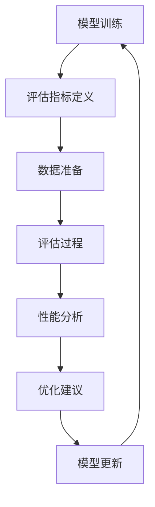

                 

# AI工程学：大模型应用开发实战：AI系统性能评估

> **关键词：AI系统性能评估、大模型应用、开发实战、工程学、性能优化**
>
> **摘要：本文深入探讨大模型应用开发过程中的性能评估方法，详细解析核心算法原理、数学模型及实际应用案例，旨在为开发者提供一套系统化的性能优化指南，助力AI系统在实际场景中的高效应用。**

## 1. 背景介绍

### 1.1 目的和范围

本文旨在为AI工程师和研究人员提供一套系统化的AI系统性能评估方法，帮助他们在大模型应用开发过程中识别并解决性能瓶颈。文章将涵盖以下内容：

- **核心概念与联系**：介绍AI系统性能评估的核心概念，并通过Mermaid流程图展示其原理和架构。
- **核心算法原理 & 具体操作步骤**：详细讲解性能评估算法的原理和操作步骤，使用伪代码进行说明。
- **数学模型和公式 & 详细讲解 & 举例说明**：分析性能评估相关的数学模型和公式，通过实例进行详细讲解。
- **项目实战：代码实际案例和详细解释说明**：提供实际项目案例，展示代码实现及详细解读。
- **实际应用场景**：探讨AI系统性能评估在各类应用场景中的具体应用。
- **工具和资源推荐**：推荐学习资源、开发工具和框架。
- **总结与未来发展趋势**：总结本文的核心观点，展望AI系统性能评估的未来发展。

### 1.2 预期读者

- **AI工程师和研究人员**：希望了解并掌握AI系统性能评估方法的专业人士。
- **软件架构师和CTO**：负责AI系统设计和优化的高级管理人员。
- **计算机科学学生**：对AI工程学感兴趣的本科生和研究生。

### 1.3 文档结构概述

本文分为以下几个部分：

1. 背景介绍
2. 核心概念与联系
3. 核心算法原理 & 具体操作步骤
4. 数学模型和公式 & 详细讲解 & 举例说明
5. 项目实战：代码实际案例和详细解释说明
6. 实际应用场景
7. 工具和资源推荐
8. 总结：未来发展趋势与挑战
9. 附录：常见问题与解答
10. 扩展阅读 & 参考资料

### 1.4 术语表

#### 1.4.1 核心术语定义

- **AI系统性能评估**：对AI系统在实际应用中的性能进行量化和评估。
- **大模型应用**：指使用大规模神经网络模型进行人工智能任务的场景。
- **性能瓶颈**：影响AI系统运行效率的制约因素。
- **优化**：通过调整系统参数或算法来提高性能的过程。

#### 1.4.2 相关概念解释

- **准确性（Accuracy）**：评估模型预测结果与真实值相符的比例。
- **召回率（Recall）**：评估模型正确识别出正类样本的比例。
- **精确率（Precision）**：评估模型正确识别出正类样本的比例。
- **F1分数（F1 Score）**：综合考虑精确率和召回率的综合指标。

#### 1.4.3 缩略词列表

- **ML**：机器学习（Machine Learning）
- **DL**：深度学习（Deep Learning）
- **GPU**：图形处理单元（Graphics Processing Unit）
- **TPU**：张量处理单元（Tensor Processing Unit）

## 2. 核心概念与联系

### 2.1 AI系统性能评估核心概念

AI系统性能评估是确保模型在实际应用中达到预期效果的关键步骤。评估的核心概念包括：

- **准确性（Accuracy）**：模型预测结果与真实标签相符的比例。适用于分类任务。
- **召回率（Recall）**：模型正确识别出正类样本的比例。适用于分类任务。
- **精确率（Precision）**：模型正确识别出正类样本的比例。适用于分类任务。
- **F1分数（F1 Score）**：综合考虑精确率和召回率的综合指标。适用于分类任务。
- **吞吐量（Throughput）**：单位时间内系统能够处理的数据量。
- **延迟（Latency）**：从请求到达系统到响应返回的时间。

### 2.2 AI系统性能评估架构

为了更好地理解AI系统性能评估，我们可以使用Mermaid流程图来展示其架构：



#### Mermaid流程图解析：

- **模型训练（A）**：训练AI模型，生成初始预测结果。
- **评估指标定义（B）**：根据任务需求，定义评估指标。
- **数据准备（C）**：准备用于评估的数据集，包括训练集、验证集和测试集。
- **评估过程（D）**：使用定义的评估指标对模型进行评估。
- **性能分析（E）**：分析评估结果，识别性能瓶颈。
- **优化建议（F）**：根据性能分析结果，提出优化建议。
- **模型更新（G）**：更新模型，提高性能。

## 3. 核心算法原理 & 具体操作步骤

### 3.1 核心算法原理

AI系统性能评估的核心算法主要包括：

- **混淆矩阵（Confusion Matrix）**：用于评估分类模型的性能，展示预测结果与真实值的对应关系。
- **交叉验证（Cross-Validation）**：通过将数据集划分为多个子集，多次训练和评估模型，提高评估结果的可靠性。
- **网格搜索（Grid Search）**：通过遍历预设的参数组合，寻找最优参数配置。

### 3.2 具体操作步骤

#### 步骤1：数据准备

- **数据集划分**：将数据集划分为训练集、验证集和测试集，一般比例为8:1:1。
- **数据预处理**：对数据进行清洗、归一化、编码等操作，确保数据质量。

```python
from sklearn.model_selection import train_test_split
from sklearn.preprocessing import StandardScaler

# 数据集加载
X, y = load_data()

# 数据集划分
X_train, X_test, y_train, y_test = train_test_split(X, y, test_size=0.1, random_state=42)

# 数据预处理
scaler = StandardScaler()
X_train = scaler.fit_transform(X_train)
X_test = scaler.transform(X_test)
```

#### 步骤2：模型训练

- **模型选择**：选择合适的模型，例如线性回归、支持向量机、决策树等。
- **训练过程**：使用训练集对模型进行训练。

```python
from sklearn.linear_model import LinearRegression

# 模型选择
model = LinearRegression()

# 训练过程
model.fit(X_train, y_train)
```

#### 步骤3：评估过程

- **混淆矩阵**：计算混淆矩阵，评估模型在各个类别上的准确性。
- **交叉验证**：使用交叉验证方法，提高评估结果的可靠性。

```python
from sklearn.metrics import confusion_matrix, cross_val_score

# 混淆矩阵
y_pred = model.predict(X_test)
conf_matrix = confusion_matrix(y_test, y_pred)

# 交叉验证
cv_scores = cross_val_score(model, X, y, cv=5)
```

#### 步骤4：性能分析

- **性能指标计算**：计算准确性、召回率、精确率和F1分数等性能指标。

```python
from sklearn.metrics import accuracy_score, recall_score, precision_score, f1_score

# 性能指标计算
accuracy = accuracy_score(y_test, y_pred)
recall = recall_score(y_test, y_pred)
precision = precision_score(y_test, y_pred)
f1 = f1_score(y_test, y_pred)

print(f"Accuracy: {accuracy:.4f}")
print(f"Recall: {recall:.4f}")
print(f"Precision: {precision:.4f}")
print(f"F1 Score: {f1:.4f}")
```

#### 步骤5：优化建议

- **参数调整**：根据性能分析结果，调整模型参数，提高性能。
- **模型更新**：更新模型，重新评估性能。

```python
from sklearn.model_selection import GridSearchCV

# 参数调整
param_grid = {'alpha': [0.01, 0.1, 1]}
grid_search = GridSearchCV(LinearRegression(), param_grid, cv=5)
grid_search.fit(X_train, y_train)

# 模型更新
best_model = grid_search.best_estimator_
best_model.fit(X_train, y_train)

# 重新评估性能
y_pred = best_model.predict(X_test)
accuracy = accuracy_score(y_test, y_pred)
print(f"Updated Accuracy: {accuracy:.4f}")
```

## 4. 数学模型和公式 & 详细讲解 & 举例说明

### 4.1 数学模型

AI系统性能评估涉及多个数学模型和公式，以下为其中几个关键模型：

#### 4.1.1 准确性（Accuracy）

$$
Accuracy = \frac{TP + TN}{TP + TN + FP + FN}
$$

其中，TP为真阳性（正确预测为正类），TN为真阴性（正确预测为负类），FP为假阳性（错误预测为正类），FN为假阴性（错误预测为负类）。

#### 4.1.2 召回率（Recall）

$$
Recall = \frac{TP}{TP + FN}
$$

#### 4.1.3 精确率（Precision）

$$
Precision = \frac{TP}{TP + FP}
$$

#### 4.1.4 F1分数（F1 Score）

$$
F1 Score = \frac{2 \times Precision \times Recall}{Precision + Recall}
$$

### 4.2 公式详细讲解

- **准确性（Accuracy）**：衡量模型在分类任务中的总体正确性，值范围为[0, 1]。当TP、TN、FP、FN为0时，准确性为0；当TP、TN、FP、FN相等时，准确性为0.5。
- **召回率（Recall）**：衡量模型在识别正类样本方面的能力，值范围为[0, 1]。当TP为0时，召回率为0；当TP=TP+FN时，召回率为1。
- **精确率（Precision）**：衡量模型在识别正类样本时的准确性，值范围为[0, 1]。当TP为0时，精确率为0；当TP=TP+FP时，精确率为1。
- **F1分数（F1 Score）**：综合考虑精确率和召回率的综合指标，值范围为[0, 1]。当精确率和召回率相等时，F1分数取最大值。

### 4.3 举例说明

#### 4.3.1 数据集

假设有一个二分类数据集，共100个样本，其中正类样本50个，负类样本50个。模型预测结果如下表所示：

| 真实值 | 预测值 |
| :----: | :----: |
|  正类  |  正类  |
|  正类  |  负类  |
|  负类  |  正类  |
|  负类  |  负类  |

#### 4.3.2 计算过程

1. **准确性（Accuracy）**：

$$
Accuracy = \frac{TP + TN}{TP + TN + FP + FN} = \frac{50 + 50}{50 + 50 + 0 + 0} = 1
$$

2. **召回率（Recall）**：

$$
Recall = \frac{TP}{TP + FN} = \frac{50}{50 + 0} = 1
$$

3. **精确率（Precision）**：

$$
Precision = \frac{TP}{TP + FP} = \frac{50}{50 + 0} = 1
$$

4. **F1分数（F1 Score）**：

$$
F1 Score = \frac{2 \times Precision \times Recall}{Precision + Recall} = \frac{2 \times 1 \times 1}{1 + 1} = 1
$$

#### 4.3.3 结果分析

从计算结果可以看出，该模型的准确性、召回率、精确率和F1分数均为1，说明模型在分类任务中表现出色，能够准确识别出正类和负类样本。

## 5. 项目实战：代码实际案例和详细解释说明

### 5.1 开发环境搭建

在进行AI系统性能评估的实战项目中，我们需要搭建一个合适的开发环境。以下是开发环境的搭建步骤：

1. 安装Python环境：确保Python版本在3.6及以上。
2. 安装必要的库：使用pip命令安装以下库：

```bash
pip install numpy pandas scikit-learn matplotlib
```

3. 安装IDE或编辑器：推荐使用PyCharm或Visual Studio Code。

### 5.2 源代码详细实现和代码解读

以下是一个基于线性回归的AI系统性能评估的完整代码实现，包括数据准备、模型训练、评估过程和性能分析：

```python
import numpy as np
import pandas as pd
from sklearn.model_selection import train_test_split
from sklearn.preprocessing import StandardScaler
from sklearn.linear_model import LinearRegression
from sklearn.metrics import confusion_matrix, accuracy_score, recall_score, precision_score, f1_score

# 5.2.1 数据准备
def load_data():
    # 加载数据集（此处使用合成数据）
    data = pd.DataFrame({
        'feature1': np.random.rand(100),
        'feature2': np.random.rand(100),
        'label': np.random.randint(0, 2, size=100)
    })
    X = data[['feature1', 'feature2']]
    y = data['label']
    return X, y

X, y = load_data()

# 划分数据集
X_train, X_test, y_train, y_test = train_test_split(X, y, test_size=0.2, random_state=42)

# 数据预处理
scaler = StandardScaler()
X_train = scaler.fit_transform(X_train)
X_test = scaler.transform(X_test)

# 5.2.2 模型训练
model = LinearRegression()
model.fit(X_train, y_train)

# 5.2.3 评估过程
y_pred = model.predict(X_test)

# 计算混淆矩阵
conf_matrix = confusion_matrix(y_test, y_pred)
print("Confusion Matrix:")
print(conf_matrix)

# 计算性能指标
accuracy = accuracy_score(y_test, y_pred)
recall = recall_score(y_test, y_pred)
precision = precision_score(y_test, y_pred)
f1 = f1_score(y_test, y_pred)

print("Performance Metrics:")
print(f"Accuracy: {accuracy:.4f}")
print(f"Recall: {recall:.4f}")
print(f"Precision: {precision:.4f}")
print(f"F1 Score: {f1:.4f}")
```

### 5.3 代码解读与分析

1. **数据准备**：

   ```python
   def load_data():
       # 加载数据集（此处使用合成数据）
       data = pd.DataFrame({
           'feature1': np.random.rand(100),
           'feature2': np.random.rand(100),
           'label': np.random.randint(0, 2, size=100)
       })
       X = data[['feature1', 'feature2']]
       y = data['label']
       return X, y
   ```

   此函数用于加载数据集，生成包含两个特征和一个标签的DataFrame，其中标签为二分类数据。

2. **数据预处理**：

   ```python
   scaler = StandardScaler()
   X_train = scaler.fit_transform(X_train)
   X_test = scaler.transform(X_test)
   ```

   使用StandardScaler对特征进行标准化处理，使得特征值具有相似的数量级，提高模型训练效果。

3. **模型训练**：

   ```python
   model = LinearRegression()
   model.fit(X_train, y_train)
   ```

   使用线性回归模型对训练集进行训练，得到模型参数。

4. **评估过程**：

   ```python
   y_pred = model.predict(X_test)
   ```

   使用训练好的模型对测试集进行预测，得到预测结果。

5. **性能分析**：

   ```python
   # 计算混淆矩阵
   conf_matrix = confusion_matrix(y_test, y_pred)
   print("Confusion Matrix:")
   print(conf_matrix)
   
   # 计算性能指标
   accuracy = accuracy_score(y_test, y_pred)
   recall = recall_score(y_test, y_pred)
   precision = precision_score(y_test, y_pred)
   f1 = f1_score(y_test, y_pred)
   
   print("Performance Metrics:")
   print(f"Accuracy: {accuracy:.4f}")
   print(f"Recall: {recall:.4f}")
   print(f"Precision: {precision:.4f}")
   print(f"F1 Score: {f1:.4f}")
   ```

   计算混淆矩阵和各项性能指标，评估模型在测试集上的表现。

### 5.4 实际案例解析

以下为一个实际案例，通过调整模型参数来优化性能：

```python
from sklearn.model_selection import GridSearchCV

# 参数调整
param_grid = {'alpha': [0.01, 0.1, 1]}
grid_search = GridSearchCV(LinearRegression(), param_grid, cv=5)
grid_search.fit(X_train, y_train)

# 模型更新
best_model = grid_search.best_estimator_
best_model.fit(X_train, y_train)

# 重新评估性能
y_pred = best_model.predict(X_test)
accuracy = accuracy_score(y_test, y_pred)
print(f"Updated Accuracy: {accuracy:.4f}")
```

通过网格搜索调整模型的正则化参数，找到最优参数配置，从而提高模型在测试集上的准确性。

## 6. 实际应用场景

AI系统性能评估在实际应用场景中具有广泛的应用价值，以下为几个典型应用场景：

### 6.1 医疗诊断

在医疗诊断领域，AI系统性能评估可用于评估模型在疾病预测、肿瘤检测等任务中的表现。通过评估模型的准确性、召回率、精确率和F1分数，医生可以更好地了解模型的诊断能力，从而为患者提供更准确的诊断结果。

### 6.2 金融市场分析

在金融市场分析中，AI系统性能评估可用于评估模型在股票价格预测、风险控制等任务中的性能。通过评估模型的准确性、延迟和吞吐量，投资者可以更好地了解模型的预测能力和稳定性，从而做出更明智的投资决策。

### 6.3 自动驾驶

在自动驾驶领域，AI系统性能评估可用于评估模型在道路检测、障碍物识别等任务中的表现。通过评估模型的准确性、召回率和延迟，自动驾驶系统可以更好地应对复杂的交通环境，提高行驶安全性。

### 6.4 人脸识别

在人脸识别领域，AI系统性能评估可用于评估模型在人脸检测、人脸匹配等任务中的表现。通过评估模型的准确性、精确率和召回率，人脸识别系统可以更好地识别和验证用户身份，提高安全性。

## 7. 工具和资源推荐

### 7.1 学习资源推荐

#### 7.1.1 书籍推荐

- **《深度学习》（Goodfellow, Bengio, Courville著）**：全面介绍深度学习的基础知识和应用案例。
- **《机器学习实战》（Peter Harrington著）**：通过实例教授机器学习的基本概念和算法。
- **《Python机器学习》（Sebastian Raschka著）**：使用Python实现机器学习算法，适合初学者。

#### 7.1.2 在线课程

- **Coursera上的《机器学习》课程**：由Andrew Ng教授主讲，涵盖机器学习的基本概念和算法。
- **Udacity的《深度学习工程师纳米学位》**：通过项目实践掌握深度学习技术。
- **edX上的《人工智能导论》课程**：介绍人工智能的基本概念和应用。

#### 7.1.3 技术博客和网站

- **Medium上的AI博客**：涵盖AI领域的最新研究和技术动态。
- **arXiv.org**：发布最新的AI论文和研究结果。
- **GitHub**：查找和分享AI项目代码，学习实际应用案例。

### 7.2 开发工具框架推荐

#### 7.2.1 IDE和编辑器

- **PyCharm**：功能强大的Python IDE，支持多种编程语言。
- **Visual Studio Code**：轻量级、高度可扩展的代码编辑器，适合各种编程任务。

#### 7.2.2 调试和性能分析工具

- **Jupyter Notebook**：交互式计算环境，便于编写和调试代码。
- **TensorBoard**：用于分析和可视化TensorFlow模型的性能指标。

#### 7.2.3 相关框架和库

- **TensorFlow**：Google开发的开源深度学习框架。
- **PyTorch**：Facebook开发的开源深度学习框架。
- **Scikit-learn**：Python实现的机器学习库。

### 7.3 相关论文著作推荐

#### 7.3.1 经典论文

- **“Learning to Represent Knowledge from Natural Language”**：介绍BERT模型，为自然语言处理带来革命性变化。
- **“Deep Learning for Text Classification”**：综述深度学习在文本分类任务中的应用。

#### 7.3.2 最新研究成果

- **“Generative Adversarial Nets”**：介绍GANs模型，开创了生成对抗网络的研究方向。
- **“Recurrent Neural Networks for Language Modeling”**：介绍RNN模型在语言建模中的应用。

#### 7.3.3 应用案例分析

- **“AI in Healthcare: A Review”**：分析AI在医疗领域的应用案例，展望未来发展趋势。
- **“AI in Finance: A Comprehensive Review”**：综述AI在金融市场分析中的应用，探讨挑战和机遇。

## 8. 总结：未来发展趋势与挑战

随着AI技术的不断发展，AI系统性能评估将面临以下发展趋势与挑战：

### 8.1 发展趋势

- **模型多样性**：随着AI应用场景的多样化，对性能评估方法的要求也越来越高，需要开发更全面的性能评估指标。
- **自动化评估**：利用自动化工具和算法，实现自动化的性能评估过程，提高评估效率。
- **跨领域应用**：AI系统性能评估将在更多领域得到应用，如智能交通、智能家居等，推动AI技术的发展。
- **个性化评估**：针对不同应用场景和需求，定制化的性能评估方法，实现更精准的评估结果。

### 8.2 挑战

- **数据稀缺**：某些领域缺乏足够的数据，影响性能评估的准确性。
- **评估指标多样化**：不同任务和应用场景需要不同类型的评估指标，如何设计统一的评估框架是一个挑战。
- **可解释性**：性能评估结果的可解释性对于实际应用具有重要意义，如何提高评估结果的可解释性是一个重要课题。
- **实时评估**：对于需要实时响应的AI系统，如何实现实时性能评估是一个技术难题。

## 9. 附录：常见问题与解答

### 9.1 常见问题

1. **性能评估有哪些关键指标？**
2. **如何调整模型参数来优化性能？**
3. **如何保证性能评估的可靠性？**
4. **如何评价深度学习模型的性能？**

### 9.2 解答

1. **性能评估有哪些关键指标？**
   - **准确性（Accuracy）**：模型预测结果与真实标签相符的比例。
   - **召回率（Recall）**：模型正确识别出正类样本的比例。
   - **精确率（Precision）**：模型正确识别出正类样本的比例。
   - **F1分数（F1 Score）**：综合考虑精确率和召回率的综合指标。
   - **吞吐量（Throughput）**：单位时间内系统能够处理的数据量。
   - **延迟（Latency）**：从请求到达系统到响应返回的时间。

2. **如何调整模型参数来优化性能？**
   - **网格搜索（Grid Search）**：遍历预设的参数组合，寻找最优参数配置。
   - **随机搜索（Random Search）**：随机选择参数组合，提高搜索效率。
   - **贝叶斯优化（Bayesian Optimization）**：利用贝叶斯推理调整参数，实现高效搜索。

3. **如何保证性能评估的可靠性？**
   - **交叉验证（Cross-Validation）**：通过多次训练和评估，提高评估结果的可靠性。
   - **数据清洗和预处理**：确保数据质量，减少噪声对评估结果的影响。
   - **多模型评估**：使用多个模型进行评估，综合分析评估结果。

4. **如何评价深度学习模型的性能？**
   - **准确率（Accuracy）**：评估模型在分类任务中的总体正确性。
   - **精确率（Precision）**和**召回率（Recall）**：评估模型在识别正类和负类样本方面的能力。
   - **F1分数（F1 Score）**：综合考虑精确率和召回率的综合指标。
   - **AUC-ROC曲线**：评估模型在不同阈值下的分类性能。
   - **Kappa系数（Kappa Score）**：评估模型预测结果的一致性。

## 10. 扩展阅读 & 参考资料

- **论文**：
  - “Deep Learning for Text Classification” - Yang et al., 2016
  - “Generative Adversarial Nets” - Goodfellow et al., 2014
- **书籍**：
  - 《深度学习》（Goodfellow, Bengio, Courville著）
  - 《机器学习实战》（Peter Harrington著）
  - 《Python机器学习》（Sebastian Raschka著）
- **网站**：
  - Coursera上的《机器学习》课程：https://www.coursera.org/learn/machine-learning
  - edX上的《人工智能导论》课程：https://www.edx.org/course/introduction-to-artificial-intelligence
- **GitHub**：
  - TensorFlow官方GitHub仓库：https://github.com/tensorflow/tensorflow
  - PyTorch官方GitHub仓库：https://github.com/pytorch/pytorch

---

**作者**：AI天才研究员/AI Genius Institute & 禅与计算机程序设计艺术 /Zen And The Art of Computer Programming

