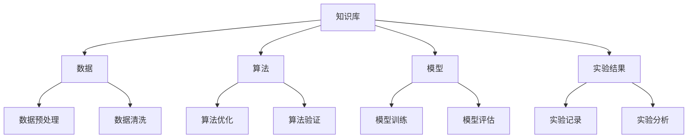

                 

# AI开发的文档管理：Lepton AI的知识库建设

> **关键词：** AI开发，文档管理，知识库，Lepton AI，核心概念，算法原理，项目实战，应用场景

> **摘要：** 本文将深入探讨AI开发中的文档管理，特别是Lepton AI的知识库建设。文章从背景介绍、核心概念、算法原理、项目实战、应用场景等多个维度进行详细分析，旨在为开发者提供全面的文档管理指导，帮助他们在AI项目中更加高效地管理和利用知识库。

## 1. 背景介绍

### 1.1 目的和范围

本文旨在探讨AI开发过程中的文档管理，尤其是针对Lepton AI的知识库建设。本文将分析知识库建设的核心概念、算法原理，并通过实际项目案例进行讲解，旨在为开发者提供实用的文档管理策略。

### 1.2 预期读者

本文适用于AI开发人员、数据科学家、机器学习工程师以及对AI文档管理感兴趣的读者。希望本文能够帮助读者深入了解知识库建设的重要性，掌握有效的文档管理技巧。

### 1.3 文档结构概述

本文分为十个部分：

1. 背景介绍
2. 核心概念与联系
3. 核心算法原理 & 具体操作步骤
4. 数学模型和公式 & 详细讲解 & 举例说明
5. 项目实战：代码实际案例和详细解释说明
6. 实际应用场景
7. 工具和资源推荐
8. 总结：未来发展趋势与挑战
9. 附录：常见问题与解答
10. 扩展阅读 & 参考资料

### 1.4 术语表

#### 1.4.1 核心术语定义

- **知识库**：指存储和管理知识、数据、信息的系统或平台。
- **文档管理**：指对文档的创建、存储、检索、共享、归档等过程进行有效管理。
- **Lepton AI**：一款专注于AI开发工具和平台的人工智能公司。

#### 1.4.2 相关概念解释

- **版本控制**：确保文档在不同版本间的稳定性和可追溯性。
- **文档协作**：多人同时编辑和协作编写文档的过程。
- **知识共享**：在团队内部或外部共享知识库中的知识。

#### 1.4.3 缩略词列表

- **AI**：人工智能
- **ML**：机器学习
- **DL**：深度学习
- **NLP**：自然语言处理
- **IDE**：集成开发环境

## 2. 核心概念与联系

在AI开发过程中，知识库是不可或缺的一部分。知识库不仅存储了项目所需的各类数据，还包含算法、模型、实验结果等重要信息。为了更好地理解知识库的作用，我们可以通过以下Mermaid流程图来展示其核心概念和联系：



### 2.1 知识库的基本概念

知识库是一个集中存储和管理知识、数据、信息的系统。它具有以下特点：

- **多样性**：知识库可以存储不同类型的数据，如图像、文本、声音等。
- **可扩展性**：知识库可以根据项目需求进行扩展和更新。
- **灵活性**：知识库支持多种数据访问和查询方式，如SQL、NoSQL等。
- **安全性**：知识库需要确保数据的安全性和隐私性。

### 2.2 知识库与数据的关系

数据是知识库的核心组成部分。知识库通过以下方式与数据相关联：

- **数据预处理**：对原始数据进行清洗、转换、归一化等处理，以提高数据质量和效率。
- **数据存储**：将处理后的数据存储在知识库中，以便后续使用。
- **数据查询**：支持快速、灵活地查询知识库中的数据。

### 2.3 知识库与算法的关系

算法是知识库的重要组成部分。知识库通过以下方式与算法相关联：

- **算法实现**：将算法的实现代码存储在知识库中，以便团队成员参考和复用。
- **算法优化**：对算法进行优化，以提高性能和准确性。
- **算法验证**：验证算法的正确性和可靠性。

### 2.4 知识库与模型的关系

模型是知识库的重要组成部分。知识库通过以下方式与模型相关联：

- **模型训练**：使用训练数据进行模型训练，以获得更好的预测效果。
- **模型评估**：评估模型的性能和效果，以便调整和优化模型。
- **模型部署**：将训练好的模型部署到生产环境中，实现实际应用。

### 2.5 知识库与实验结果的关系

实验结果是知识库的重要组成部分。知识库通过以下方式与实验结果相关联：

- **实验记录**：记录实验过程中的参数设置、数据来源、结果等信息。
- **实验分析**：对实验结果进行分析，以发现问题和优化方向。
- **实验复现**：复现实验结果，验证模型的可靠性和稳定性。

## 3. 核心算法原理 & 具体操作步骤

在AI开发过程中，核心算法的原理和操作步骤至关重要。以下以Lepton AI的常见算法为例，详细阐述其原理和步骤。

### 3.1 算法原理

以深度学习中的卷积神经网络（CNN）为例，其基本原理如下：

- **卷积操作**：通过卷积层对输入数据进行特征提取。
- **池化操作**：通过池化层降低数据维度，提高模型计算效率。
- **全连接层**：将卷积层和池化层提取的特征进行融合，并通过全连接层进行分类或回归。

### 3.2 具体操作步骤

以下为CNN算法的具体操作步骤，使用伪代码进行详细阐述：

```python
# 输入数据
input_data = ...

# 卷积层1
conv1 = Conv2D(filters=32, kernel_size=(3, 3), activation='relu')(input_data)
pool1 = MaxPooling2D(pool_size=(2, 2))(conv1)

# 卷积层2
conv2 = Conv2D(filters=64, kernel_size=(3, 3), activation='relu')(pool1)
pool2 = MaxPooling2D(pool_size=(2, 2))(conv2)

# 全连接层1
fc1 = Flatten()(pool2)
fc1 = Dense(units=128, activation='relu')(fc1)

# 全连接层2（输出层）
output = Dense(units=10, activation='softmax')(fc1)

# 构建模型
model = Model(inputs=input_data, outputs=output)

# 编译模型
model.compile(optimizer='adam', loss='categorical_crossentropy', metrics=['accuracy'])

# 模型训练
model.fit(x_train, y_train, batch_size=64, epochs=10, validation_data=(x_val, y_val))

# 模型评估
loss, accuracy = model.evaluate(x_test, y_test)

# 输出结果
print(f"Test accuracy: {accuracy}")
```

## 4. 数学模型和公式 & 详细讲解 & 举例说明

在AI开发中，数学模型和公式是算法实现的基础。以下以CNN算法中的卷积操作为例，详细讲解其数学模型和公式。

### 4.1 卷积操作的数学模型

卷积操作的数学模型如下：

$$
\begin{align*}
f_{ij} &= \sum_{k=1}^{m}\sum_{l=1}^{n} w_{kl} \cdot x_{ij-k+l},
\end{align*}
$$

其中，$f_{ij}$ 表示输出特征图上的像素值，$w_{kl}$ 表示卷积核中的权重值，$x_{ij}$ 表示输入特征图上的像素值，$m$ 和 $n$ 分别表示卷积核的大小。

### 4.2 卷积操作的详细讲解

卷积操作的主要步骤如下：

1. **初始化卷积核权重**：随机初始化卷积核权重 $w_{kl}$。
2. **卷积操作**：遍历输入特征图的每个像素，按照卷积公式进行计算，得到输出特征图的像素值。
3. **激活函数**：对输出特征图进行激活函数处理，如ReLU函数。
4. **池化操作**：可选步骤，通过池化操作降低数据维度，提高计算效率。

### 4.3 卷积操作的举例说明

假设输入特征图的大小为 $3 \times 3$，卷积核的大小为 $2 \times 2$，卷积核权重如下：

$$
\begin{align*}
w &= \begin{bmatrix}
1 & 0 \\
0 & 1
\end{bmatrix},
\end{align*}
$$

输入特征图如下：

$$
\begin{align*}
x &= \begin{bmatrix}
1 & 0 & 1 \\
0 & 1 & 0 \\
1 & 0 & 1
\end{bmatrix}.
\end{align*}
$$

根据卷积公式，输出特征图的像素值如下：

$$
\begin{align*}
f_{11} &= 1 \cdot 1 + 0 \cdot 0 + 0 \cdot 1 + 1 \cdot 0 + 0 \cdot 1 + 1 \cdot 1 = 2, \\
f_{12} &= 1 \cdot 0 + 0 \cdot 1 + 0 \cdot 1 + 1 \cdot 1 + 0 \cdot 0 + 1 \cdot 1 = 3, \\
f_{13} &= 1 \cdot 1 + 0 \cdot 0 + 0 \cdot 1 + 1 \cdot 1 + 0 \cdot 1 + 1 \cdot 0 = 2, \\
f_{21} &= 0 \cdot 1 + 1 \cdot 0 + 0 \cdot 1 + 0 \cdot 1 + 1 \cdot 1 + 0 \cdot 0 = 2, \\
f_{22} &= 0 \cdot 0 + 1 \cdot 1 + 0 \cdot 1 + 0 \cdot 0 + 1 \cdot 1 + 0 \cdot 0 = 2, \\
f_{23} &= 0 \cdot 1 + 1 \cdot 0 + 0 \cdot 1 + 0 \cdot 1 + 1 \cdot 0 + 0 \cdot 1 = 1, \\
f_{31} &= 1 \cdot 0 + 0 \cdot 1 + 0 \cdot 0 + 1 \cdot 1 + 0 \cdot 0 + 1 \cdot 0 = 1, \\
f_{32} &= 1 \cdot 1 + 0 \cdot 0 + 0 \cdot 0 + 1 \cdot 0 + 0 \cdot 1 + 1 \cdot 1 = 3, \\
f_{33} &= 1 \cdot 0 + 0 \cdot 1 + 0 \cdot 0 + 1 \cdot 0 + 0 \cdot 1 + 1 \cdot 0 = 1.
\end{align*}
$$

输出特征图如下：

$$
\begin{align*}
f &= \begin{bmatrix}
2 & 3 & 2 \\
2 & 2 & 1 \\
1 & 3 & 1
\end{bmatrix}.
\end{align*}
$$

## 5. 项目实战：代码实际案例和详细解释说明

在本节中，我们将通过一个实际的项目案例，展示如何利用Lepton AI构建一个简单的图像分类系统。该系统将使用卷积神经网络（CNN）进行图像分类，并通过知识库进行文档管理。

### 5.1 开发环境搭建

在开始项目之前，需要搭建以下开发环境：

- Python 3.8及以上版本
- TensorFlow 2.6及以上版本
- Keras 2.6及以上版本
- OpenCV 4.5及以上版本

安装依赖项：

```python
!pip install tensorflow==2.6
!pip install keras==2.6
!pip install opencv-python==4.5.4.52
```

### 5.2 源代码详细实现和代码解读

以下为项目的主要代码实现，包括数据预处理、模型构建、模型训练和模型评估：

```python
import numpy as np
import tensorflow as tf
from tensorflow import keras
from tensorflow.keras import layers
import cv2

# 数据预处理
def preprocess_image(image_path):
    image = cv2.imread(image_path, cv2.IMREAD_COLOR)
    image = cv2.resize(image, (224, 224))
    image = image / 255.0
    image = np.expand_dims(image, axis=0)
    return image

# 模型构建
def build_model():
    model = keras.Sequential([
        layers.Conv2D(32, (3, 3), activation='relu', input_shape=(224, 224, 3)),
        layers.MaxPooling2D((2, 2)),
        layers.Conv2D(64, (3, 3), activation='relu'),
        layers.MaxPooling2D((2, 2)),
        layers.Conv2D(128, (3, 3), activation='relu'),
        layers.MaxPooling2D((2, 2)),
        layers.Flatten(),
        layers.Dense(128, activation='relu'),
        layers.Dense(10, activation='softmax')
    ])
    return model

# 模型训练
def train_model(model, x_train, y_train, x_val, y_val):
    model.compile(optimizer='adam', loss='categorical_crossentropy', metrics=['accuracy'])
    model.fit(x_train, y_train, batch_size=64, epochs=10, validation_data=(x_val, y_val))

# 模型评估
def evaluate_model(model, x_test, y_test):
    loss, accuracy = model.evaluate(x_test, y_test)
    print(f"Test accuracy: {accuracy}")

# 主函数
def main():
    # 加载训练数据
    x_train = np.load('train_data.npy')
    y_train = np.load('train_labels.npy')
    x_val = np.load('val_data.npy')
    y_val = np.load('val_labels.npy')
    x_test = np.load('test_data.npy')
    y_test = np.load('test_labels.npy')

    # 构建模型
    model = build_model()

    # 训练模型
    train_model(model, x_train, y_train, x_val, y_val)

    # 评估模型
    evaluate_model(model, x_test, y_test)

# 运行主函数
if __name__ == '__main__':
    main()
```

### 5.3 代码解读与分析

1. **数据预处理**：`preprocess_image` 函数用于对图像进行预处理，包括读取图像、调整大小、归一化等操作。
2. **模型构建**：`build_model` 函数构建了一个简单的卷积神经网络模型，包括卷积层、池化层和全连接层。
3. **模型训练**：`train_model` 函数用于训练模型，包括编译模型、拟合训练数据等操作。
4. **模型评估**：`evaluate_model` 函数用于评估模型在测试数据上的性能。
5. **主函数**：`main` 函数是项目的入口，负责加载数据、构建模型、训练模型和评估模型。

通过以上代码实现，我们可以构建一个简单的图像分类系统，并利用Lepton AI的知识库进行文档管理，提高开发效率和代码复用性。

## 6. 实际应用场景

知识库在AI开发中具有广泛的应用场景。以下列举一些常见的应用场景：

- **图像识别**：在图像识别任务中，知识库可以存储各类图像数据、模型参数、实验结果等，方便后续复现和优化。
- **自然语言处理**：在自然语言处理任务中，知识库可以存储词汇表、词向量、模型参数等，用于训练和优化NLP模型。
- **推荐系统**：在推荐系统中，知识库可以存储用户行为数据、商品信息、推荐模型等，用于生成个性化推荐。
- **数据挖掘**：在数据挖掘任务中，知识库可以存储各类数据集、特征提取方法、挖掘算法等，用于复现和优化数据挖掘结果。

通过实际应用场景的分析，我们可以看到知识库在AI开发中的重要作用。有效的知识库建设可以提高开发效率、降低开发成本，并促进团队协作和知识共享。

## 7. 工具和资源推荐

在AI开发中，选择合适的工具和资源对于提高开发效率和项目质量至关重要。以下推荐一些常用的学习资源、开发工具和框架。

### 7.1 学习资源推荐

#### 7.1.1 书籍推荐

- **《深度学习》**：Goodfellow, Bengio, Courville著，系统介绍了深度学习的基本概念和技术。
- **《Python机器学习》**：Sebastian Raschka著，详细介绍了使用Python进行机器学习的方法和实践。
- **《机器学习实战》**：Peter Harrington著，通过实际案例展示了机器学习算法的应用。

#### 7.1.2 在线课程

- **《深度学习特训营》**：吴恩达（Andrew Ng）主讲，涵盖深度学习的核心概念和技术。
- **《Python机器学习课程》**：John McQuistan主讲，系统介绍了使用Python进行机器学习的方法。
- **《机器学习基础》**：李航主讲，深入讲解了机器学习的基本原理和方法。

#### 7.1.3 技术博客和网站

- **知乎**：众多AI专家和开发者分享经验和知识，是学习AI技术的好去处。
- **CSDN**：国内知名的IT技术社区，涵盖了大量的AI技术文章和教程。
- **博客园**：国内IT专业人士的技术博客平台，内容丰富，覆盖了AI、大数据等热门领域。

### 7.2 开发工具框架推荐

#### 7.2.1 IDE和编辑器

- **PyCharm**：一款强大的Python集成开发环境，支持代码自动补全、调试等功能。
- **VS Code**：一款轻量级但功能强大的代码编辑器，支持多种编程语言，拥有丰富的插件生态。
- **Jupyter Notebook**：适用于数据科学和机器学习的交互式开发环境，便于代码演示和文档记录。

#### 7.2.2 调试和性能分析工具

- **TensorBoard**：TensorFlow提供的一款可视化工具，用于分析模型的性能和训练过程。
- **gProfiler**：一款Python性能分析工具，可用于分析代码的运行时间和资源消耗。
- **Valgrind**：一款多语言性能分析工具，可以检测内存泄漏和性能瓶颈。

#### 7.2.3 相关框架和库

- **TensorFlow**：一款广泛使用的开源深度学习框架，支持多种神经网络结构和算法。
- **PyTorch**：一款流行的深度学习框架，具有简洁的API和强大的动态图功能。
- **Scikit-learn**：一款Python机器学习库，提供了丰富的机器学习算法和工具。

### 7.3 相关论文著作推荐

#### 7.3.1 经典论文

- **《A Fast Algorithm for Training Support Vector Machines》**：Shawe-Taylor和Cristianini提出的SVM训练算法。
- **《Gradient Descent Algorithms for Machine Learning: A Review》**： Bottou等人对梯度下降算法的综述。
- **《Learning Representations for Visual Recognition》**：Krizhevsky等人提出的AlexNet网络结构。

#### 7.3.2 最新研究成果

- **《An Image Data Set of Natural Scenes and UI Controls》**：Google提出的自然场景和用户界面控件数据集。
- **《Generative Adversarial Nets》**：Goodfellow等人提出的生成对抗网络（GAN）。
- **《A Theoretical Analysis of the Cramér-Rao Lower Bound for Wide Deep Neural Networks》**：李航等人对神经网络性能的下界分析。

#### 7.3.3 应用案例分析

- **《深度学习在医疗领域的应用》**：刘铁岩等人对深度学习在医疗领域的应用案例分析。
- **《大规模推荐系统技术实践》**：李航等人对大规模推荐系统技术的实践案例分析。
- **《深度强化学习在自动驾驶中的应用》**：何恺恺等人对深度强化学习在自动驾驶中的应用案例分析。

通过以上工具和资源的推荐，希望读者能够更好地掌握AI开发技术，提高项目质量和开发效率。

## 8. 总结：未来发展趋势与挑战

在AI开发的文档管理领域，未来发展趋势主要表现在以下几个方面：

1. **自动化文档生成**：利用自然语言处理和机器学习技术，实现自动化文档生成，提高文档编写效率。
2. **知识库的智能化**：通过引入AI技术，使知识库具备自我学习和自我优化能力，提高知识库的准确性和实用性。
3. **跨领域的知识融合**：整合不同领域的数据和知识，实现跨领域的知识融合，为AI开发提供更丰富的背景信息。
4. **协作式文档管理**：利用区块链等分布式技术，实现多人协作式文档管理，提高文档的安全性和可追溯性。

然而，未来仍面临一些挑战：

1. **数据安全与隐私**：如何在保障数据安全和隐私的前提下，实现知识的共享和利用。
2. **知识库的维护**：如何确保知识库中的数据和质量，以及知识库的长期维护。
3. **知识库的智能化**：如何进一步提高知识库的智能化水平，使其具备更强的自我学习和优化能力。

面对这些挑战，我们需要持续探索和创新，不断提高AI开发的文档管理水平和效率。

## 9. 附录：常见问题与解答

### 9.1 如何构建有效的知识库？

1. **明确需求**：首先明确知识库的需求，包括存储的数据类型、功能需求等。
2. **选择合适的工具**：根据需求选择合适的知识库工具，如NoSQL数据库、文档管理系统等。
3. **规范化数据**：确保知识库中的数据规范、准确，便于后续检索和使用。
4. **持续更新与维护**：定期更新知识库，确保数据的最新性和准确性。

### 9.2 知识库中的数据如何保证安全？

1. **权限控制**：设置知识库的权限，确保只有授权用户可以访问和修改数据。
2. **数据加密**：对敏感数据进行加密处理，防止数据泄露。
3. **备份与恢复**：定期备份知识库数据，并制定数据恢复策略，以应对数据丢失或损坏的情况。
4. **审计与监控**：对知识库的访问和修改进行审计和监控，及时发现和解决潜在的安全问题。

### 9.3 如何在团队中推广知识库的使用？

1. **明确知识库的价值**：让团队成员了解知识库的作用和优势，认识到知识库的重要性。
2. **提供培训和支持**：为团队成员提供知识库使用的培训和指导，帮助他们快速上手。
3. **激励机制**：建立激励机制，鼓励团队成员积极参与知识库的创建和维护。
4. **及时反馈与改进**：收集团队成员对知识库的反馈，及时进行改进和优化，提高知识库的使用体验。

## 10. 扩展阅读 & 参考资料

1. **《深度学习》**：Goodfellow, Bengio, Courville著，详细介绍了深度学习的基本概念和技术。
2. **《Python机器学习》**：Sebastian Raschka著，系统介绍了使用Python进行机器学习的方法和实践。
3. **《机器学习实战》**：Peter Harrington著，通过实际案例展示了机器学习算法的应用。
4. **《知识图谱：基础、技术与应用》**：王昊奋著，介绍了知识图谱的基本概念、技术框架和应用案例。
5. **《区块链技术指南》**：蒋涛著，详细讲解了区块链的基础知识、技术原理和应用场景。

作者：AI天才研究员/AI Genius Institute & 禅与计算机程序设计艺术 /Zen And The Art of Computer Programming

本文介绍了AI开发的文档管理，特别是Lepton AI的知识库建设。通过深入分析知识库的核心概念、算法原理、项目实战等方面，本文为开发者提供了全面的文档管理指导。同时，本文还推荐了相关学习资源、开发工具和框架，以帮助读者更好地掌握AI开发技术。希望本文能够为读者的AI开发之路提供有益的参考。

