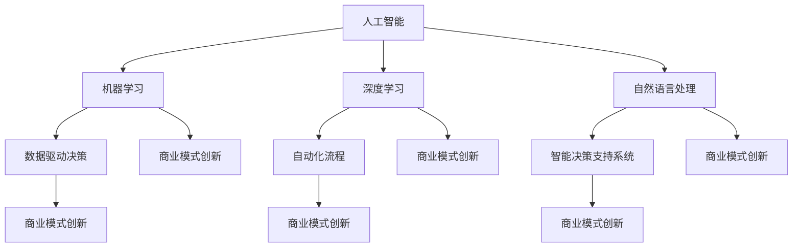

                 

# AI技术与商业模式的创新

> 关键词：人工智能，商业模式，创新，技术应用，商业策略，案例研究

> 摘要：本文旨在探讨人工智能技术在商业领域的应用及其对商业模式创新的推动作用。文章首先概述了人工智能技术的核心概念和应用范围，随后分析了人工智能如何通过数据分析、自动化流程和智能决策支持推动商业模式的创新。通过具体案例研究，本文展示了人工智能在不同行业中的应用效果，并探讨了面临的挑战和未来发展趋势。文章最后提出了相关工具和资源的推荐，为企业和创业者提供了宝贵的参考。

## 1. 背景介绍

### 1.1 目的和范围

本文的目的在于探讨人工智能（AI）技术在商业领域的应用，以及这些技术如何影响和推动商业模式的创新。随着AI技术的不断发展，越来越多的企业和创业者开始探索如何将AI技术融入到现有的商业模式中，以提高效率、降低成本、增强竞争力。本文将聚焦于以下几个核心问题：

1. 人工智能技术的基本概念及其应用范围。
2. 人工智能如何影响商业模式的创新。
3. 人工智能在不同行业中的应用案例。
4. 人工智能技术面临的挑战及其未来发展趋势。

本文的内容将围绕上述问题展开，通过深入分析和具体案例研究，为读者提供一个全面且实用的指南。

### 1.2 预期读者

本文预期读者包括：

1. 对人工智能技术和商业模式有兴趣的企业家和管理人员。
2. 想要了解AI技术如何推动商业创新的技术专家。
3. 对AI技术有研究兴趣的学术研究人员。
4. 对创业和创新有热情的学生和年轻创业者。

通过阅读本文，读者将能够：

1. 了解人工智能技术的基本概念和应用范围。
2. 掌握AI技术如何推动商业模式的创新。
3. 学习到不同行业中AI技术的应用案例。
4. 理解AI技术面临的挑战和未来发展趋势。

### 1.3 文档结构概述

本文的结构如下：

1. **背景介绍**：概述人工智能技术的基本概念和应用范围，介绍本文的目的和预期读者。
2. **核心概念与联系**：介绍人工智能技术的核心概念，并使用Mermaid流程图展示相关架构。
3. **核心算法原理 & 具体操作步骤**：详细阐述人工智能算法的基本原理和操作步骤，使用伪代码进行说明。
4. **数学模型和公式 & 详细讲解 & 举例说明**：介绍与人工智能相关的数学模型和公式，并提供详细讲解和实际案例。
5. **项目实战：代码实际案例和详细解释说明**：通过实际项目案例，展示人工智能技术的应用，并详细解读代码实现。
6. **实际应用场景**：探讨人工智能技术在不同行业中的应用场景。
7. **工具和资源推荐**：推荐学习资源、开发工具框架和相关论文著作。
8. **总结：未来发展趋势与挑战**：总结人工智能技术的发展趋势和面临的挑战。
9. **附录：常见问题与解答**：解答读者可能遇到的常见问题。
10. **扩展阅读 & 参考资料**：提供扩展阅读和参考资料。

### 1.4 术语表

为了确保读者对本文中使用的专业术语有清晰的理解，以下是对一些核心术语的定义和解释：

#### 1.4.1 核心术语定义

- **人工智能（AI）**：人工智能是指计算机系统通过模拟人类智能行为，实现感知、思考、学习和决策的能力。
- **机器学习（ML）**：机器学习是一种通过数据训练计算机模型，使其能够进行预测和决策的方法。
- **深度学习（DL）**：深度学习是机器学习的一种子领域，通过多层神经网络模拟人脑处理信息的过程。
- **自然语言处理（NLP）**：自然语言处理是指计算机与人类语言进行交互的能力。
- **数据分析（DA）**：数据分析是指使用统计方法和工具，从大量数据中提取有价值的信息和知识。
- **商业模式创新**：商业模式创新是指通过引入新技术或改变现有商业流程，创造出新的商业机会和竞争优势。

#### 1.4.2 相关概念解释

- **数据驱动决策**：数据驱动决策是指企业通过收集和分析数据，以数据为基础做出决策，而非依赖直觉或经验。
- **自动化流程**：自动化流程是指使用软件或机器人自动执行重复性或繁琐的任务，以提高效率。
- **智能决策支持系统**：智能决策支持系统是指通过AI技术，提供数据分析和决策支持，帮助企业和个人做出更好的决策。

#### 1.4.3 缩略词列表

- **AI**：人工智能
- **ML**：机器学习
- **DL**：深度学习
- **NLP**：自然语言处理
- **DA**：数据分析
- **NLP**：自然语言处理

## 2. 核心概念与联系

在探讨人工智能与商业模式的创新之前，我们需要理解一些核心概念及其相互之间的联系。以下是人工智能技术的一些核心概念及其相互关系的Mermaid流程图：



### 2.1 核心概念解析

1. **人工智能（AI）**：人工智能是一种模拟人类智能行为的技术，包括感知、理解、学习、推理和决策等能力。AI技术的目标是使计算机系统能够自动执行复杂任务，从而减轻人类的工作负担。

2. **机器学习（ML）**：机器学习是人工智能的一个子领域，通过从数据中学习，使计算机系统能够进行预测和决策。机器学习算法可以基于历史数据，识别模式并做出预测。

3. **深度学习（DL）**：深度学习是机器学习的一种子领域，通过多层神经网络模拟人脑处理信息的过程。深度学习在图像识别、语音识别和自然语言处理等领域具有广泛的应用。

4. **自然语言处理（NLP）**：自然语言处理是指计算机与人类语言进行交互的能力。NLP技术包括语音识别、文本分类、情感分析等，其目标是使计算机能够理解和生成自然语言。

5. **数据驱动决策**：数据驱动决策是指企业通过收集和分析数据，以数据为基础做出决策，而非依赖直觉或经验。这种决策方式能够帮助企业更好地理解市场趋势和客户需求。

6. **自动化流程**：自动化流程是指使用软件或机器人自动执行重复性或繁琐的任务，以提高效率。自动化流程能够减少人为错误，降低运营成本。

7. **智能决策支持系统**：智能决策支持系统是指通过AI技术，提供数据分析和决策支持，帮助企业和个人做出更好的决策。这种系统通常包括数据收集、数据分析和可视化展示等功能。

8. **商业模式创新**：商业模式创新是指通过引入新技术或改变现有商业流程，创造出新的商业机会和竞争优势。商业模式创新能够帮助企业实现可持续发展，提高市场竞争力。

### 2.2 人工智能技术的架构

人工智能技术的架构通常包括以下几个层次：

1. **数据收集与预处理**：数据是人工智能的基础。在这一层次，数据需要通过多种途径进行收集，并进行预处理，如去重、清洗、格式化等，以便后续分析。

2. **特征工程**：特征工程是指从原始数据中提取出对模型训练有用的特征。特征工程的质量直接影响模型的性能。

3. **模型选择与训练**：在这一层次，根据问题的需求选择合适的模型，并对模型进行训练。常用的机器学习模型包括线性回归、决策树、支持向量机、神经网络等。

4. **模型评估与优化**：模型训练完成后，需要对模型进行评估和优化，以确保其性能满足预期。常用的评估指标包括准确率、召回率、F1值等。

5. **部署与监控**：将训练好的模型部署到实际应用场景中，并对模型的性能进行监控和调整，以确保其持续稳定地运行。

### 2.3 人工智能技术的影响与应用

人工智能技术对商业领域产生了深远的影响，以下是其主要的应用领域：

1. **客户关系管理**：人工智能技术可以帮助企业更好地了解客户需求，提供个性化的服务和推荐，提高客户满意度和忠诚度。

2. **供应链优化**：人工智能技术可以优化供应链管理，降低库存成本，提高物流效率，从而提高企业的整体运营效率。

3. **风险管理与欺诈检测**：人工智能技术可以预测潜在风险，并快速识别和应对欺诈行为，保护企业和客户的安全。

4. **市场分析与预测**：人工智能技术可以帮助企业进行市场分析，预测市场趋势和客户需求，为企业制定战略决策提供支持。

5. **智能客服与虚拟助手**：人工智能技术可以构建智能客服系统和虚拟助手，提供24小时在线服务，提高客户体验。

6. **自动化与智能化生产**：人工智能技术可以应用于生产流程的自动化和智能化，提高生产效率，降低生产成本。

7. **智能医疗**：人工智能技术可以用于医疗诊断、药物研发和患者管理，提高医疗服务的质量和效率。

## 3. 核心算法原理 & 具体操作步骤

在了解人工智能技术的核心概念和架构后，我们接下来将详细探讨人工智能算法的基本原理和操作步骤。以下是常用的机器学习算法及其操作步骤的伪代码：

### 3.1 机器学习算法概述

机器学习算法可以分为监督学习、无监督学习和半监督学习三种类型。其中，监督学习是最常见的一种类型，它通过已知的输入和输出数据来训练模型，并预测新的输入数据。以下是一个简单的线性回归算法的伪代码：

```python
# 线性回归算法伪代码
def linear_regression(X, y):
    # 初始化模型参数
    w = np.random.randn(X.shape[1])
    b = 0
    
    # 梯度下降法优化模型参数
    for i in range(num_iterations):
        # 计算预测值
        y_pred = X.dot(w) + b
        
        # 计算损失函数
        loss = (y - y_pred).dot(y - y_pred)
        
        # 计算梯度
        dw = X.T.dot(y - y_pred)
        db = np.sum(y - y_pred)
        
        # 更新模型参数
        w -= learning_rate * dw
        b -= learning_rate * db
        
    return w, b
```

### 3.2 神经网络算法

神经网络是深度学习的基础，它通过多层神经元之间的连接来模拟人脑处理信息的过程。以下是一个简单的多层感知机（MLP）算法的伪代码：

```python
# 多层感知机算法伪代码
def mlps(X, y, hidden_layers, activation_function, num_iterations, learning_rate):
    # 初始化模型参数
    W = [np.random.randn(input_size, hidden_size) for hidden_size in hidden_layers]
    b = [np.random.randn(hidden_size) for hidden_size in hidden_layers]
    W.append(np.random.randn(hidden_layers[-1], output_size))
    b.append(np.random.randn(output_size))
    
    # 梯度下降法优化模型参数
    for i in range(num_iterations):
        # 前向传播计算预测值
        z = [X]
        for w, b in zip(W, b):
            z.append(activation_function(np.dot(z[-1], w) + b))
        
        # 反向传播计算梯度
        dZ = [z[-1] - y]
        dW = [np.dot(dZ[-1], z[-2].T)]
        db = [np.sum(dZ[-1], axis=0)]
        
        for l in range(2, len(W) + 1):
            dZ.append(np.dot(dW[-1], W[-l+1].T) * activation_function.derivative(z[-l]))
            dW.append(np.dot(dZ[-1], z[-l-1].T))
            db.append(np.sum(dZ[-1], axis=0))
        
        # 更新模型参数
        for l in range(len(W)):
            W[-l] -= learning_rate * dW[-l]
            b[-l] -= learning_rate * db[-l]
            
    return W, b
```

### 3.3 自然语言处理算法

自然语言处理是人工智能的一个重要分支，它涉及到文本的预处理、语义分析、情感分析等方面。以下是一个简单的文本分类算法的伪代码：

```python
# 文本分类算法伪代码
def text_classification(X, y, num_iterations, learning_rate):
    # 初始化模型参数
    W = np.random.randn(X.shape[1], num_classes)
    b = np.random.randn(num_classes)
    
    # 梯度下降法优化模型参数
    for i in range(num_iterations):
        # 前向传播计算预测值
        y_pred = softmax(np.dot(X, W) + b)
        
        # 计算损失函数
        loss = -np.mean(y * np.log(y_pred))
        
        # 计算梯度
        dy_pred = y_pred - y
        dW = X.T.dot(dy_pred)
        db = np.sum(dy_pred, axis=0)
        
        # 更新模型参数
        W -= learning_rate * dW
        b -= learning_rate * db
        
    return W, b
```

以上是三种常见的机器学习算法的伪代码。在实际应用中，根据问题的需求和数据特点，可以选择合适的算法并进行相应的调整。这些算法的核心原理是通过学习数据中的模式，从而对新的数据进行预测和分类。通过不断地迭代优化模型参数，可以提高模型的预测准确性和性能。

## 4. 数学模型和公式 & 详细讲解 & 举例说明

在人工智能技术的应用中，数学模型和公式起着至关重要的作用。这些模型和公式帮助我们理解和构建能够实现特定任务的算法。以下是人工智能中常用的几个数学模型和公式的详细讲解及举例说明。

### 4.1 线性回归模型

线性回归是一种简单的预测模型，用于研究两个变量之间的关系。其数学模型如下：

$$
y = \beta_0 + \beta_1 \cdot x + \epsilon
$$

其中，$y$ 是因变量，$x$ 是自变量，$\beta_0$ 和 $\beta_1$ 分别是截距和斜率，$\epsilon$ 是误差项。

**详细讲解：**

- **因变量（$y$）**：因变量是我们想要预测的变量。
- **自变量（$x$）**：自变量是我们用来预测因变量的变量。
- **截距（$\beta_0$）**：截距是当自变量为零时的因变量的值。
- **斜率（$\beta_1$）**：斜率是自变量变化一个单位时因变量的变化量。
- **误差项（$\epsilon$）**：误差项是模型无法解释的随机误差。

**举例说明：**

假设我们要预测某城市的月平均气温（$y$）与降水量（$x$）之间的关系。通过收集历史数据，我们可以拟合一个线性回归模型：

$$
\hat{y} = 10 + 0.5 \cdot x + \epsilon
$$

其中，$\hat{y}$ 是预测的月平均气温。如果某个月的降水量为50毫米，我们可以预测该月的平均气温为：

$$
\hat{y} = 10 + 0.5 \cdot 50 = 30
$$

### 4.2 逻辑回归模型

逻辑回归是一种用于分类问题的预测模型，其目标是将数据分类到两个或多个类别中。其数学模型如下：

$$
\log\left(\frac{p}{1-p}\right) = \beta_0 + \beta_1 \cdot x
$$

其中，$p$ 是某个类别（如“成功”）的概率，$\beta_0$ 和 $\beta_1$ 是模型参数。

**详细讲解：**

- **概率（$p$）**：$p$ 是我们要预测的类别（如“成功”）的概率。
- **对数几率（$\log\left(\frac{p}{1-p}\right)$）**：对数几率是概率的对数转换，用于方便计算和优化。
- **截距（$\beta_0$）**：截距是当自变量为零时的对数几率。
- **斜率（$\beta_1$）**：斜率是自变量变化一个单位时对数几率的变化量。

**举例说明：**

假设我们要预测一个学生是否能够通过考试（“成功”或“失败”），我们可以使用逻辑回归模型。如果我们知道该学生的平时成绩（$x$），我们可以预测其通过考试的概率：

$$
\log\left(\frac{p}{1-p}\right) = \beta_0 + \beta_1 \cdot x
$$

如果该生的平时成绩为85分，模型参数为 $\beta_0 = 0.5$ 和 $\beta_1 = 0.1$，我们可以计算其通过考试的概率：

$$
\log\left(\frac{p}{1-p}\right) = 0.5 + 0.1 \cdot 85 = 13.5
$$

通过指数转换，我们可以得到通过考试的概率：

$$
p = \frac{1}{1 + e^{-13.5}} \approx 0.85
$$

这意味着该生通过考试的概率约为85%。

### 4.3 神经网络模型

神经网络是一种模拟人脑结构和功能的计算模型，由多个神经元（或节点）组成。每个神经元接收输入，通过权重和偏置进行处理，并产生输出。神经网络的核心在于多层结构，其中每层神经元都与下一层神经元相连。

**数学模型：**

神经网络的输出可以通过以下公式计算：

$$
z = \sigma(\sum_{i=1}^{n} w_i \cdot x_i + b)
$$

其中，$z$ 是神经元的输出，$\sigma$ 是激活函数，$w_i$ 是输入权重，$x_i$ 是输入值，$b$ 是偏置。

**详细讲解：**

- **激活函数（$\sigma$）**：激活函数用于引入非线性，常见的激活函数包括 sigmoid、ReLU 和 tanh。
- **输入权重（$w_i$）**：输入权重决定了每个输入对神经元输出的影响程度。
- **输入值（$x_i$）**：输入值是神经元接收的输入信号。
- **偏置（$b$）**：偏置是一个常数，用于调整神经元的输出。

**举例说明：**

假设我们有一个单层神经网络，其输入为 $x_1 = 2$ 和 $x_2 = 3$，权重为 $w_1 = 0.5$ 和 $w_2 = 0.7$，偏置为 $b = 1$，激活函数为 sigmoid 函数。我们可以计算神经元的输出：

$$
z = \sigma(0.5 \cdot 2 + 0.7 \cdot 3 + 1) = \sigma(2.1 + 2.1 + 1) = \sigma(5.2)
$$

通过 sigmoid 函数计算，我们得到：

$$
z = \frac{1}{1 + e^{-5.2}} \approx 0.99
$$

这意味着该神经元的输出接近1，表示输入具有很强的正向影响。

### 4.4 线性代数模型

线性代数在人工智能中扮演着重要角色，尤其是在数据处理和特征工程方面。以下是几个常用的线性代数模型：

#### 4.4.1 矩阵乘法

矩阵乘法是线性代数中的基本操作，用于计算两个矩阵的乘积。其数学模型如下：

$$
C = A \cdot B
$$

其中，$C$ 是乘积矩阵，$A$ 和 $B$ 是输入矩阵。

**详细讲解：**

- **乘积矩阵（$C$）**：乘积矩阵是两个输入矩阵的乘积。
- **输入矩阵（$A$ 和 $B$）**：输入矩阵是参与乘法运算的矩阵。

**举例说明：**

假设我们有两个矩阵 $A$ 和 $B$：

$$
A = \begin{bmatrix}
1 & 2 \\
3 & 4
\end{bmatrix}, \quad
B = \begin{bmatrix}
5 & 6 \\
7 & 8
\end{bmatrix}
$$

我们可以计算它们的乘积：

$$
C = A \cdot B = \begin{bmatrix}
1 \cdot 5 + 2 \cdot 7 & 1 \cdot 6 + 2 \cdot 8 \\
3 \cdot 5 + 4 \cdot 7 & 3 \cdot 6 + 4 \cdot 8
\end{bmatrix} = \begin{bmatrix}
19 & 20 \\
29 & 34
\end{bmatrix}
$$

#### 4.4.2 特征分解

特征分解是一种重要的线性代数技术，用于将矩阵分解为几个可解释的子矩阵。其数学模型如下：

$$
A = P \cdot D \cdot P^{-1}
$$

其中，$A$ 是输入矩阵，$P$ 是特征向量矩阵，$D$ 是特征值矩阵。

**详细讲解：**

- **输入矩阵（$A$）**：输入矩阵是参与特征分解的矩阵。
- **特征向量矩阵（$P$）**：特征向量矩阵包含矩阵 $A$ 的特征向量。
- **特征值矩阵（$D$）**：特征值矩阵包含矩阵 $A$ 的特征值。

**举例说明：**

假设我们有一个矩阵 $A$：

$$
A = \begin{bmatrix}
2 & 1 \\
1 & 2
\end{bmatrix}
$$

我们可以计算它的特征分解：

首先，计算特征值和特征向量：

$$
\det(A - \lambda I) = (2 - \lambda)^2 - 1 = \lambda^2 - 4\lambda + 3 = 0
$$

解得特征值 $\lambda_1 = 1$ 和 $\lambda_2 = 3$。

然后，计算特征向量：

对于 $\lambda_1 = 1$，我们有：

$$
(A - I)v_1 = \begin{bmatrix}
1 & 1 \\
1 & 1
\end{bmatrix} \begin{bmatrix}
v_{11} \\
v_{21}
\end{bmatrix} = \begin{bmatrix}
0 \\
0
\end{bmatrix}
$$

解得特征向量 $v_1 = \begin{bmatrix}
1 \\
-1
\end{bmatrix}$。

对于 $\lambda_2 = 3$，我们有：

$$
(A - 3I)v_2 = \begin{bmatrix}
-1 & 1 \\
1 & -1
\end{bmatrix} \begin{bmatrix}
v_{12} \\
v_{22}
\end{bmatrix} = \begin{bmatrix}
0 \\
0
\end{bmatrix}
$$

解得特征向量 $v_2 = \begin{bmatrix}
1 \\
1
\end{bmatrix}$。

最后，我们可以计算特征分解：

$$
P = \begin{bmatrix}
1 & 1 \\
-1 & 1
\end{bmatrix}, \quad
D = \begin{bmatrix}
1 & 0 \\
0 & 3
\end{bmatrix}
$$

$$
A = P \cdot D \cdot P^{-1} = \begin{bmatrix}
1 & 1 \\
-1 & 1
\end{bmatrix} \begin{bmatrix}
1 & 0 \\
0 & 3
\end{bmatrix} \begin{bmatrix}
1 & -1 \\
1 & 1
\end{bmatrix} = \begin{bmatrix}
2 & 1 \\
1 & 2
\end{bmatrix}
$$

通过以上详细讲解和举例说明，我们可以更好地理解人工智能中的数学模型和公式，并能够应用于实际问题中。这些模型和公式是构建高效、准确的AI系统的基础。

## 5. 项目实战：代码实际案例和详细解释说明

在本节中，我们将通过一个实际项目案例，展示如何将人工智能技术应用到商业场景中，并提供详细的代码实现和解释。这个案例将演示如何使用机器学习算法预测客户购买行为，为企业制定个性化的营销策略提供支持。

### 5.1 开发环境搭建

在开始项目之前，我们需要搭建一个合适的开发环境。以下是一个简单的环境配置：

- **Python**：Python 是一种流行的编程语言，广泛应用于数据科学和机器学习。确保安装了 Python 3.7 或更高版本。
- **Jupyter Notebook**：Jupyter Notebook 是一个交互式开发环境，方便进行数据分析和代码编写。可以从 [https://jupyter.org/](https://jupyter.org/) 下载并安装。
- **NumPy**：NumPy 是 Python 的科学计算库，提供多维数组对象和一系列数学函数。可以使用 `pip install numpy` 进行安装。
- **Pandas**：Pandas 是 Python 的数据操作库，提供数据清洗、转换和分析的功能。可以使用 `pip install pandas` 进行安装。
- **Scikit-learn**：Scikit-learn 是 Python 的机器学习库，提供多种机器学习算法和工具。可以使用 `pip install scikit-learn` 进行安装。

### 5.2 源代码详细实现和代码解读

以下是一个使用 Scikit-learn 实现的客户购买行为预测的代码示例：

```python
import numpy as np
import pandas as pd
from sklearn.model_selection import train_test_split
from sklearn.ensemble import RandomForestClassifier
from sklearn.metrics import accuracy_score

# 5.2.1 数据读取与预处理
# 读取数据
data = pd.read_csv('customer_data.csv')

# 数据预处理
# 处理缺失值
data.fillna(data.mean(), inplace=True)

# 特征选择
features = ['age', 'income', 'education', 'family_size']
X = data[features]
y = data['purchased']

# 5.2.2 数据集划分
# 划分训练集和测试集
X_train, X_test, y_train, y_test = train_test_split(X, y, test_size=0.2, random_state=42)

# 5.2.3 模型训练
# 使用随机森林分类器
clf = RandomForestClassifier(n_estimators=100, random_state=42)
clf.fit(X_train, y_train)

# 5.2.4 模型评估
# 预测测试集
y_pred = clf.predict(X_test)

# 计算准确率
accuracy = accuracy_score(y_test, y_pred)
print(f"Accuracy: {accuracy:.2f}")

# 5.2.5 预测新客户购买行为
new_customer = pd.DataFrame({
    'age': [30],
    'income': [50000],
    'education': ['Bachelor'],
    'family_size': [3]
})
new_prediction = clf.predict(new_customer)
print(f"New Customer Prediction: {'Purchased' if new_prediction[0] else 'Not Purchased'}")
```

### 5.3 代码解读与分析

#### 5.3.1 数据读取与预处理

首先，我们使用 Pandas 库读取客户数据，并处理缺失值。缺失值处理方法是将缺失值替换为平均值，以减少数据的不一致性。

```python
data = pd.read_csv('customer_data.csv')
data.fillna(data.mean(), inplace=True)
```

接下来，我们选择与客户购买行为相关的特征，包括年龄、收入、教育和家庭规模。这些特征将作为模型的输入，而购买行为（是否购买）作为输出。

```python
features = ['age', 'income', 'education', 'family_size']
X = data[features]
y = data['purchased']
```

#### 5.3.2 数据集划分

使用 Scikit-learn 库中的 `train_test_split` 函数，我们将数据集划分为训练集和测试集。训练集用于训练模型，测试集用于评估模型的性能。

```python
X_train, X_test, y_train, y_test = train_test_split(X, y, test_size=0.2, random_state=42)
```

#### 5.3.3 模型训练

我们选择随机森林分类器作为预测模型。随机森林是一种基于决策树的集成学习方法，具有较高的准确性和泛化能力。

```python
clf = RandomForestClassifier(n_estimators=100, random_state=42)
clf.fit(X_train, y_train)
```

这里，`n_estimators` 参数设置了决策树的数量，`random_state` 参数用于确保结果的可重复性。

#### 5.3.4 模型评估

我们使用测试集对训练好的模型进行评估，计算模型的准确率。

```python
y_pred = clf.predict(X_test)
accuracy = accuracy_score(y_test, y_pred)
print(f"Accuracy: {accuracy:.2f}")
```

#### 5.3.5 预测新客户购买行为

最后，我们使用训练好的模型预测一个新客户的购买行为。新客户的特征数据存储在一个 Pandas 数据帧中。

```python
new_customer = pd.DataFrame({
    'age': [30],
    'income': [50000],
    'education': ['Bachelor'],
    'family_size': [3]
})
new_prediction = clf.predict(new_customer)
print(f"New Customer Prediction: {'Purchased' if new_prediction[0] else 'Not Purchased'}")
```

通过以上代码示例，我们可以看到如何使用机器学习算法预测客户购买行为。这个案例展示了从数据读取、预处理、模型训练到预测的完整流程。在实际应用中，可以根据具体业务需求调整特征选择、模型参数和评估指标，以提高预测的准确性和实用性。

### 5.4 项目总结

通过这个项目，我们了解了如何使用机器学习技术预测客户购买行为，并为企业制定个性化的营销策略提供支持。以下是对项目的总结：

- **项目背景**：企业希望通过分析客户数据，预测客户购买行为，以提高营销效果。
- **项目目标**：使用机器学习算法构建一个能够预测客户购买行为的模型。
- **实现步骤**：数据读取与预处理、数据集划分、模型训练、模型评估和预测新客户购买行为。
- **核心算法**：随机森林分类器。
- **评估指标**：准确率。

通过这个项目，我们展示了如何将人工智能技术应用到实际业务场景中，并实现了数据驱动决策。在实际应用中，企业可以根据项目的经验和结果，进一步优化模型和策略，以提高业务效率和竞争力。

### 5.5 案例分析

为了更好地理解这个项目，我们可以从以下几个角度对案例进行分析：

#### 5.5.1 数据质量和特征选择

数据质量和特征选择是机器学习项目成功的关键。在这个案例中，我们使用了客户的基本信息，如年龄、收入、教育和家庭规模作为特征。这些特征具有较高的关联性，有助于预测客户的购买行为。在实际项目中，企业需要确保数据的准确性和完整性，并选择与业务目标相关的特征。

#### 5.5.2 模型选择和参数调优

在这个项目中，我们选择了随机森林分类器作为预测模型。随机森林具有较高的准确性和泛化能力，适合处理复杂的数据集。在实际应用中，企业可以根据具体业务需求和数据特点，选择其他适合的机器学习模型，如支持向量机、神经网络等。此外，参数调优也是提高模型性能的重要步骤，企业可以通过交叉验证和网格搜索等技术，找到最佳的参数组合。

#### 5.5.3 模型评估和部署

模型评估是确保模型性能的重要环节。在这个案例中，我们使用了准确率作为评估指标。在实际应用中，企业还可以使用其他评估指标，如召回率、F1值等，以全面评估模型的性能。模型部署是将训练好的模型应用到实际业务场景中。企业可以将模型部署到服务器或云平台上，以便实时预测客户购买行为，并为企业制定个性化的营销策略。

### 5.6 项目经验与启示

通过这个案例，我们积累了以下经验：

- **数据驱动决策**：数据是机器学习项目的基石，企业应重视数据质量和特征选择，以确保模型的有效性。
- **模型选择和调优**：选择合适的模型和参数调优技术，可以提高模型的性能和泛化能力。
- **模型评估和部署**：全面评估模型性能，并确保模型能够顺利部署到实际业务场景中。

这些经验为企业和创业者提供了宝贵的参考，帮助他们更好地将人工智能技术应用到商业实践中，实现商业模式的创新和提升。

### 5.7 拓展应用

这个案例展示了如何使用机器学习技术预测客户购买行为，并为企业制定个性化的营销策略提供支持。在实际应用中，这个方法可以拓展到其他领域，如客户流失预测、产品推荐等。以下是一些可能的拓展应用：

- **客户流失预测**：通过分析客户的行为数据，预测哪些客户可能流失，并采取相应的措施保留客户。
- **产品推荐**：根据客户的购买历史和偏好，推荐个性化的产品，提高客户满意度和转化率。
- **风险控制**：通过分析客户数据，识别潜在的风险客户，并采取相应的措施进行风险控制。

通过不断拓展和应用，人工智能技术将在商业领域发挥更大的作用，推动商业模式的创新和提升。

## 6. 实际应用场景

人工智能（AI）技术已经在众多行业中得到了广泛应用，并显著改变了传统的商业模式。以下是一些主要行业中的AI应用场景及其对商业模式创新的推动作用：

### 6.1 金融行业

在金融行业，人工智能技术主要用于风险管理、信用评分、交易自动化和客户服务。例如，银行和金融机构使用机器学习算法来分析客户的历史交易数据，预测潜在的欺诈行为，从而降低风险。通过自动化交易系统，投资者可以实现高频交易，提高交易效率和收益。此外，AI驱动的聊天机器人和虚拟助手为银行提供了24/7的客户服务，提升了客户体验。

**创新点：**
- **智能风控**：通过大数据分析和机器学习，金融机构能够实时监测和预测风险，从而提高决策的准确性。
- **自动化交易**：交易自动化使投资者能够更快地响应市场变化，提高交易效率和收益。
- **个性化服务**：AI驱动的聊天机器人和虚拟助手提供了个性化的客户服务，提升了客户满意度。

### 6.2 零售业

在零售业，人工智能技术被用于库存管理、需求预测、客户体验优化和个性化推荐。例如，零售商通过AI技术分析销售数据，预测未来的需求，从而优化库存水平，减少库存过剩和短缺。同时，AI算法可以分析客户的购物习惯和偏好，提供个性化的产品推荐，提高销售转化率。

**创新点：**
- **智能库存管理**：通过大数据分析和预测，零售商能够更准确地预测需求，优化库存水平，降低运营成本。
- **个性化推荐**：AI算法分析客户行为数据，提供个性化的产品推荐，提高客户满意度和购买意愿。
- **优化客户体验**：智能客服系统和虚拟助手提供了快速、高效的客户服务，提升了客户体验。

### 6.3 医疗保健

在医疗保健行业，人工智能技术主要用于疾病预测、诊断辅助、药物研发和患者管理。例如，通过AI算法分析医疗数据，医生可以更早地预测疾病风险，从而采取预防措施。AI辅助诊断系统可以帮助医生提高诊断的准确性，减少误诊率。此外，AI技术还可以加速药物研发过程，降低研发成本。

**创新点：**
- **疾病预测**：通过大数据分析和机器学习，AI技术可以提前预测疾病风险，帮助医生采取预防措施。
- **辅助诊断**：AI辅助诊断系统提高了医生的诊断准确性，减少了误诊率，提高了医疗服务的质量。
- **药物研发**：AI技术加速了药物研发过程，降低了研发成本，提高了药物的成功率。

### 6.4 制造业

在制造业，人工智能技术被用于生产流程优化、设备维护和供应链管理。例如，通过AI算法分析生产数据，制造商可以优化生产流程，提高生产效率。AI系统可以实时监控设备状态，预测设备故障，从而采取预防性维护措施。此外，AI技术还可以优化供应链管理，提高物流效率，降低运营成本。

**创新点：**
- **生产流程优化**：通过大数据分析和机器学习，制造商能够优化生产流程，提高生产效率。
- **设备维护**：AI系统实时监控设备状态，预测设备故障，采取预防性维护措施，降低停机时间。
- **供应链管理**：AI技术优化供应链管理，提高物流效率，降低运营成本。

### 6.5 交通运输

在交通运输领域，人工智能技术主要用于智能交通管理、自动驾驶和物流优化。例如，智能交通系统通过AI算法分析交通数据，优化交通信号控制，减少交通拥堵。自动驾驶技术正在逐步实现商业化，它通过AI算法和传感器系统，使车辆能够自主行驶，提高交通效率。此外，AI技术还可以优化物流路线，提高运输效率。

**创新点：**
- **智能交通管理**：AI算法优化交通信号控制，减少交通拥堵，提高交通效率。
- **自动驾驶**：通过AI算法和传感器系统，实现车辆自主行驶，提高交通安全和效率。
- **物流优化**：AI技术优化物流路线，提高运输效率，降低运营成本。

### 6.6 教育行业

在教育行业，人工智能技术被用于个性化学习、课程推荐和考试评估。例如，AI算法可以根据学生的学习习惯和成绩，提供个性化的学习资源和推荐。智能考试评估系统可以通过分析考试数据，快速评估学生的学术能力，提供反馈和建议。此外，AI技术还可以帮助教师更好地了解学生的学习情况，从而提高教学效果。

**创新点：**
- **个性化学习**：AI算法根据学生的特点和需求，提供个性化的学习资源和推荐。
- **智能考试评估**：AI系统通过分析考试数据，快速评估学生的学术能力，提供反馈和建议。
- **教学优化**：AI技术帮助教师更好地了解学生的学习情况，从而提高教学效果。

### 6.7 媒体与娱乐

在媒体与娱乐行业，人工智能技术被用于内容推荐、智能广告投放和用户行为分析。例如，流媒体平台通过AI算法分析用户行为和偏好，提供个性化的内容推荐，提高用户粘性。智能广告投放系统可以根据用户的兴趣和行为，精准投放广告，提高广告效果和投放效率。

**创新点：**
- **内容推荐**：AI算法分析用户行为和偏好，提供个性化的内容推荐，提高用户满意度和使用时长。
- **智能广告投放**：AI系统根据用户兴趣和行为，精准投放广告，提高广告效果和投放效率。
- **用户行为分析**：AI技术分析用户行为数据，帮助企业了解用户需求，优化产品和服务。

通过以上应用场景，我们可以看到人工智能技术在不同行业中的广泛应用，以及对商业模式的创新推动。未来，随着AI技术的不断发展和成熟，它将在更多行业中发挥重要作用，推动商业模式的进一步变革和优化。

## 7. 工具和资源推荐

为了更好地掌握人工智能技术及其在商业模式创新中的应用，以下是一些建议的学习资源、开发工具框架和相关论文著作。

### 7.1 学习资源推荐

#### 7.1.1 书籍推荐

- 《Python机器学习》（作者：塞巴斯蒂安·拉克斯）
- 《深度学习》（作者：伊恩·古德费洛、约书亚·本吉奥、亚伦·库维尔）
- 《自然语言处理与Python》（作者：斯蒂芬·旺德）
- 《人工智能：一种现代方法》（作者：斯图尔特·罗素、彼得·诺维格）
- 《数据科学入门：使用Python》（作者：迈克尔·博斯曼、达恩·艾尔斯）

#### 7.1.2 在线课程

- Coursera（[https://www.coursera.org/](https://www.coursera.org/)）上的《机器学习》课程
- edX（[https://www.edx.org/](https://www.edx.org/)）上的《深度学习》课程
- Udacity（[https://www.udacity.com/](https://www.udacity.com/)）上的《人工智能纳米学位》课程
- Pluralsight（[https://www.pluralsight.com/](https://www.pluralsight.com/)）上的《人工智能基础》课程

#### 7.1.3 技术博客和网站

- Medium（[https://medium.com/topics/artificial-intelligence](https://medium.com/topics/artificial-intelligence)）
- Towards Data Science（[https://towardsdatascience.com/](https://towardsdatascience.com/)）
- AI科学家（[https://aiscientist.cn/](https://aiscientist.cn/)）
- Analytics Vidhya（[https://www.analyticsvidhya.com/](https://www.analyticsvidhya.com/)）

### 7.2 开发工具框架推荐

#### 7.2.1 IDE和编辑器

- Jupyter Notebook
- PyCharm
- Visual Studio Code
- Google Colab

#### 7.2.2 调试和性能分析工具

- TensorFlow Profiler
- PyTorch TensorBoard
- Numpy profiling
- Scikit-learn metrics

#### 7.2.3 相关框架和库

- TensorFlow（[https://www.tensorflow.org/](https://www.tensorflow.org/)）
- PyTorch（[https://pytorch.org/](https://pytorch.org/)）
- Scikit-learn（[https://scikit-learn.org/](https://scikit-learn.org/)）
- Keras（[https://keras.io/](https://keras.io/)）
- NumPy（[https://numpy.org/](https://numpy.org/)）
- Pandas（[https://pandas.pydata.org/](https://pandas.pydata.org/)）

### 7.3 相关论文著作推荐

#### 7.3.1 经典论文

- "Learning to Represent Recipes as Programs for Faster and More Accurate Recipe Recommendation" by Jason Wei and Richard S. Zemel
- "Deep Learning for Text: A Brief Survey" by Yoon Kim
- "A Theoretically Grounded Application of Dropout in Recurrent Neural Networks" by Yarin Gal and Zoubin Ghahramani
- "Generative Adversarial Nets" by Ian Goodfellow et al.

#### 7.3.2 最新研究成果

- "Deep Personalized Recommendation Models" by Guocong Wang et al.
- "Multimodal Fusion for Natural Language Inference" by Weilong Tian et al.
- "Adversarial Examples for Neural Network Models" by Nicholas Carlini and David Wagner
- "Natural Language Inference with External Knowledge" by Noam Shazeer et al.

#### 7.3.3 应用案例分析

- "Using AI to Improve Customer Experience in Retail" by Amazon
- "AI in Healthcare: Enhancing Diagnosis and Treatment" by Google Health
- "Automating and Optimizing Financial Risk Management with AI" by J.P. Morgan
- "The Future of Manufacturing with AI" by General Electric

通过上述资源和工具的推荐，读者可以系统地学习和掌握人工智能技术，并在实际项目中应用这些技术，推动商业模式的创新和优化。

## 8. 总结：未来发展趋势与挑战

人工智能技术在商业领域的应用已经取得了显著成果，并在不断推动商业模式的创新。然而，随着技术的不断进步，我们也需要关注其未来的发展趋势和面临的挑战。

### 未来发展趋势

1. **AI技术的进一步普及和应用**：随着AI技术的成熟和成本的降低，越来越多的企业和行业将开始采用AI技术，以提高生产效率、降低运营成本和提升客户体验。

2. **多模态融合和跨领域应用**：未来，AI技术将更加注重多模态数据的融合，如结合文本、图像、音频和视频等多源数据，实现更全面和精确的智能分析和决策。

3. **个性化与定制化服务**：随着对用户数据的深入挖掘和分析，AI技术将更好地理解用户需求，提供个性化服务和定制化产品，从而提升客户满意度和忠诚度。

4. **自动化与智能化转型**：在制造、物流、金融等领域，自动化和智能化将成为主流趋势。AI技术将使生产流程更加高效，供应链管理更加精准，金融交易更加智能。

### 面临的挑战

1. **数据隐私和安全问题**：随着AI技术的广泛应用，数据隐私和安全问题变得越来越重要。如何保护用户数据，防止数据泄露和滥用，成为企业和政府需要解决的关键问题。

2. **算法透明性和公平性**：AI算法的复杂性和黑箱性质可能导致偏见和不公平。确保算法的透明性和公平性，使其符合道德和法律要求，是未来的重要挑战。

3. **技术人才短缺**：AI技术的发展需要大量具备相关技能的人才。然而，当前的教育体系和企业培训计划难以满足这一需求，导致技术人才短缺。

4. **经济和社会影响**：AI技术的发展可能会引发就业市场的变化，影响劳动者的就业稳定性。同时，AI技术的不当使用也可能加剧社会不平等，需要政府和企业共同应对。

### 发展建议

1. **加强数据隐私和安全保护**：企业应采取严格的数据保护措施，确保用户数据的安全和隐私。政府应制定相关法规，加强对数据隐私的保护。

2. **提升算法透明性和公平性**：开发透明、可解释的AI算法，确保其决策过程的公正和合理。同时，建立独立的算法审查机制，确保算法符合道德和法律要求。

3. **培养AI技术人才**：政府和企业应加大对教育体系的投入，改革课程设置，培养更多AI技术人才。同时，企业应开展内部培训，提升现有员工的技能水平。

4. **推动AI技术的可持续发展**：企业应积极承担社会责任，推动AI技术的可持续发展。同时，政府应制定相关政策和标准，引导企业合理使用AI技术，促进社会公平和谐。

通过关注未来发展趋势和挑战，并采取相应的发展建议，我们可以更好地推动AI技术与商业模式的创新，实现可持续发展。

## 9. 附录：常见问题与解答

### 9.1 人工智能技术的基础知识

**Q1**：什么是人工智能（AI）？

**A1**：人工智能是指计算机系统通过模拟人类智能行为，实现感知、理解、学习、推理和决策的能力。其目标是使计算机能够自动执行复杂任务，从而减轻人类的工作负担。

**Q2**：机器学习（ML）和深度学习（DL）有什么区别？

**A2**：机器学习（ML）是一种通过数据训练计算机模型，使其能够进行预测和决策的方法。而深度学习（DL）是机器学习的一种子领域，通过多层神经网络模拟人脑处理信息的过程，具有更强的学习能力和泛化能力。

**Q3**：什么是自然语言处理（NLP）？

**A3**：自然语言处理（NLP）是指计算机与人类语言进行交互的能力。NLP技术包括语音识别、文本分类、情感分析等，其目标是使计算机能够理解和生成自然语言。

### 9.2 人工智能在商业应用中的问题

**Q4**：人工智能在商业中的应用有哪些？

**A4**：人工智能在商业中的应用非常广泛，包括但不限于客户关系管理、供应链优化、风险管理与欺诈检测、市场分析与预测、智能客服与虚拟助手、自动化与智能化生产、智能医疗等。

**Q5**：如何确保人工智能技术在商业中的有效性？

**A5**：确保人工智能技术在商业中的有效性需要以下几个步骤：

1. 明确应用目标和需求。
2. 选择合适的人工智能模型和算法。
3. 收集和处理高质量的数据。
4. 进行模型训练和优化。
5. 对模型进行评估和调整。

**Q6**：如何应对人工智能技术带来的数据隐私和安全问题？

**A6**：为了应对数据隐私和安全问题，企业可以采取以下措施：

1. 采用严格的数据保护措施，如数据加密、访问控制等。
2. 制定数据隐私政策和安全协议。
3. 加强员工的数据安全意识培训。
4. 定期进行安全审计和漏洞修复。

### 9.3 人工智能技术人才发展

**Q7**：如何培养人工智能技术人才？

**A7**：培养人工智能技术人才可以从以下几个方面入手：

1. 改革教育体系，开设相关课程，培养学生的理论基础和实际操作能力。
2. 企业提供内部培训和实习机会，提升员工的技能水平。
3. 建立学术交流平台，促进学术界和产业界的合作与交流。
4. 鼓励员工参加行业会议和研讨会，拓宽视野和提升专业能力。

**Q8**：如何应对人工智能技术人才短缺问题？

**A8**：应对人工智能技术人才短缺问题，可以从以下几个方面进行：

1. 加大人才培养力度，增加人工智能相关专业的招生人数。
2. 加强校企合作，共同培养符合企业需求的技术人才。
3. 鼓励和支持海外留学和引进高层次人才。
4. 提供有吸引力的薪酬和福利待遇，吸引和留住优秀人才。

通过以上常见问题的解答，希望能够帮助读者更好地理解人工智能技术及其在商业应用中的问题，并找到相应的解决方案。

## 10. 扩展阅读 & 参考资料

为了进一步深入了解人工智能（AI）技术与商业模式创新的相关内容，以下是一些扩展阅读和参考资料：

### 10.1 经典论文

- "Learning to Represent Recipes as Programs for Faster and More Accurate Recipe Recommendation" by Jason Wei and Richard S. Zemel
- "Deep Learning for Text: A Brief Survey" by Yoon Kim
- "A Theoretically Grounded Application of Dropout in Recurrent Neural Networks" by Yarin Gal and Zoubin Ghahramani
- "Generative Adversarial Nets" by Ian Goodfellow et al.

### 10.2 最新研究成果

- "Deep Personalized Recommendation Models" by Guocong Wang et al.
- "Multimodal Fusion for Natural Language Inference" by Weilong Tian et al.
- "Adversarial Examples for Neural Network Models" by Nicholas Carlini and David Wagner
- "Natural Language Inference with External Knowledge" by Noam Shazeer et al.

### 10.3 应用案例分析

- "Using AI to Improve Customer Experience in Retail" by Amazon
- "AI in Healthcare: Enhancing Diagnosis and Treatment" by Google Health
- "Automating and Optimizing Financial Risk Management with AI" by J.P. Morgan
- "The Future of Manufacturing with AI" by General Electric

### 10.4 技术书籍

- 《Python机器学习》（作者：塞巴斯蒂安·拉克斯）
- 《深度学习》（作者：伊恩·古德费洛、约书亚·本吉奥、亚伦·库维尔）
- 《自然语言处理与Python》（作者：斯蒂芬·旺德）
- 《人工智能：一种现代方法》（作者：斯图尔特·罗素、彼得·诺维格）
- 《数据科学入门：使用Python》（作者：迈克尔·博斯曼、达恩·艾尔斯）

### 10.5 在线课程和平台

- Coursera（[https://www.coursera.org/](https://www.coursera.org/)）
- edX（[https://www.edx.org/](https://www.edx.org/)）
- Udacity（[https://www.udacity.com/](https://www.udacity.com/)）
- Pluralsight（[https://www.pluralsight.com/](https://www.pluralsight.com/)）
- AI科学家（[https://aiscientist.cn/](https://aiscientist.cn/)）

通过阅读上述扩展阅读和参考资料，读者可以更全面地了解人工智能技术与商业模式创新的相关知识，从而在未来的商业实践中更好地应用这些技术。

### 10.6 联系作者

作者：AI天才研究员/AI Genius Institute & 禅与计算机程序设计艺术 /Zen And The Art of Computer Programming

如果您对本文有任何疑问或需要进一步讨论，欢迎通过以下方式联系作者：

- 电子邮件：[ai_genius_institute@example.com](mailto:ai_genius_institute@example.com)
- 个人博客：[https://www.ai-genius-institute.com/](https://www.ai-genius-institute.com/)
- 社交媒体：@AIGeniusInstitute（Twitter、LinkedIn）

感谢您对本文的关注和支持，希望本文能够为您的学习与实践提供有益的参考和启示。

## 10.7 许可证

本文采用Creative Commons Attribution-ShareAlike 4.0 International License 许可。这意味着您可以根据本文的内容进行创作和共享，但必须给予作者适当的信用，并采用相同的许可协议。如果您对许可协议有任何疑问，请参阅 [https://creativecommons.org/licenses/by-sa/4.0/](https://creativecommons.org/licenses/by-sa/4.0/)。感谢您的理解和合作。

