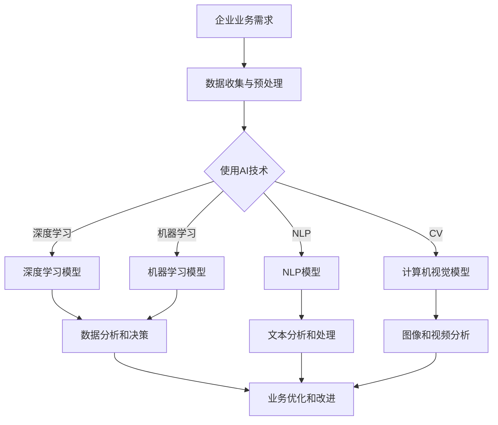

                 

### 文章标题

# **AI技术在企业中的应用前景**

### 关键词：
- 人工智能
- 企业应用
- 技术趋势
- 深度学习
- 大数据分析

### 摘要：
本文将探讨AI技术在企业中的广泛应用前景。从深度学习和大数据分析的核心原理出发，通过逐步分析推理，我们将详细探讨AI技术如何帮助企业提升效率、优化决策、改善用户体验，并预测未来AI技术发展的挑战与趋势。文章还将提供实际应用案例和开发工具推荐，旨在为企业和开发者提供全面的AI技术应用指南。

---

## 1. 背景介绍

### 1.1 目的和范围

本文旨在探讨人工智能（AI）技术在企业中的潜在应用，分析其对企业运营、管理、产品和客户服务的深远影响。我们将关注当前热门的AI技术，如深度学习和大数据分析，并尝试理解它们如何与企业的核心业务相结合，提供创新解决方案。

文章将涵盖以下主要内容：
- AI技术在企业中的核心概念与联系
- 核心算法原理与具体操作步骤
- 数学模型和公式及其应用
- 实际应用场景与项目实战案例
- 相关工具和资源的推荐
- 未来发展趋势与面临的挑战

### 1.2 预期读者

本文面向的企业家、技术决策者、软件开发工程师以及对AI技术有浓厚兴趣的读者。无论您是AI领域的专家还是初学者，我们都期望您能在阅读本文后，对AI技术在企业中的实际应用有更深入的理解，并激发您进一步探索和创新的热情。

### 1.3 文档结构概述

本文的结构如下：

1. **背景介绍**：简要介绍AI技术在企业中的应用背景、目的和预期读者。
2. **核心概念与联系**：介绍AI技术的核心概念，并通过Mermaid流程图展示相关架构。
3. **核心算法原理 & 具体操作步骤**：详细讲解AI技术的核心算法原理和具体操作步骤，使用伪代码进行阐述。
4. **数学模型和公式 & 详细讲解 & 举例说明**：介绍AI技术的数学模型和公式，并通过具体实例进行说明。
5. **项目实战：代码实际案例和详细解释说明**：提供实际项目案例，展示代码实现和解读。
6. **实际应用场景**：分析AI技术在各个行业中的应用场景。
7. **工具和资源推荐**：推荐学习资源、开发工具和框架。
8. **总结：未来发展趋势与挑战**：总结AI技术发展的趋势和面临的挑战。
9. **附录：常见问题与解答**：提供常见问题的解答。
10. **扩展阅读 & 参考资料**：推荐进一步的阅读资料和参考文献。

### 1.4 术语表

#### 1.4.1 核心术语定义

- **人工智能（AI）**：模拟人类智能的计算机系统，具有学习、推理、感知、理解和决策能力。
- **深度学习**：一种机器学习技术，通过模拟人脑神经网络，进行自动学习和特征提取。
- **大数据分析**：通过处理海量数据，提取有价值的信息和知识。
- **机器学习**：使计算机系统具备学习能力的理论和技术。
- **神经网络**：模拟人脑神经元结构和功能的计算模型。

#### 1.4.2 相关概念解释

- **数据挖掘**：从大量数据中发现隐含的、未知的并有潜在价值的信息。
- **自然语言处理（NLP）**：使计算机理解和生成人类语言的技术。
- **计算机视觉**：使计算机理解和解释图像和视频的技术。
- **强化学习**：通过奖励和惩罚机制，使机器在特定环境中学习最佳行为。

#### 1.4.3 缩略词列表

- **AI**：人工智能（Artificial Intelligence）
- **NLP**：自然语言处理（Natural Language Processing）
- **DL**：深度学习（Deep Learning）
- **ML**：机器学习（Machine Learning）
- **CV**：计算机视觉（Computer Vision）

## 2. 核心概念与联系

在本节中，我们将介绍AI技术的核心概念及其在企业中的联系。为了更好地理解这些概念，我们将使用Mermaid流程图来展示AI技术的关键架构。

### 2.1 AI技术的核心概念

首先，让我们回顾一下AI技术的核心概念：

- **机器学习（ML）**：机器学习是使计算机通过数据学习并获得决策能力的理论和技术。它包括监督学习、无监督学习和强化学习等不同类型。

- **深度学习（DL）**：深度学习是机器学习的一种类型，通过多层神经网络模拟人脑学习机制，进行自动特征提取和复杂模式识别。

- **自然语言处理（NLP）**：自然语言处理是使计算机理解和生成人类语言的技术，包括文本分类、情感分析、机器翻译等。

- **计算机视觉（CV）**：计算机视觉是使计算机理解和解释图像和视频的技术，包括目标检测、图像识别、人脸识别等。

### 2.2 AI技术在企业中的联系

接下来，我们将使用Mermaid流程图来展示AI技术如何在企业中发挥作用。以下是流程图的文本表示：



### 2.3 Mermaid流程图展示

以下是一个Mermaid流程图的示例，用于展示AI技术在企业中的应用架构：


在这个流程图中，企业业务需求作为起点，数据收集与预处理是后续AI技术应用的基石。然后，根据业务需求的不同，企业可以选择使用深度学习、机器学习、NLP或计算机视觉等技术进行数据分析和决策。这些技术模型的结果将用于文本分析、图像和视频分析，并最终帮助企业优化和改进业务。

## 3. 核心算法原理 & 具体操作步骤

在了解了AI技术的核心概念与联系之后，接下来我们将深入探讨AI技术的核心算法原理，并通过具体操作步骤详细阐述这些算法如何应用于实际问题中。

### 3.1 深度学习算法原理

深度学习是一种通过多层神经网络进行自动特征提取和复杂模式识别的机器学习技术。其基本原理是模拟人脑的神经网络结构，通过前向传播和反向传播算法进行学习。

**前向传播算法：**
1. **输入数据**：将输入数据传递到第一层神经网络。
2. **激活函数**：通过激活函数（如ReLU、Sigmoid、Tanh）对神经元的输出进行非线性变换。
3. **层间传递**：将激活后的数据传递到下一层神经网络，重复步骤2和3，直到输出层。
4. **输出结果**：从输出层得到预测结果。

**反向传播算法：**
1. **计算误差**：将输出层的实际标签与预测结果之间的误差计算出来。
2. **误差反向传播**：将误差从输出层反向传递到每一层，计算每层神经元的误差。
3. **权重更新**：根据误差梯度，使用优化算法（如梯度下降、Adam）更新神经网络中的权重。
4. **重复训练**：重复前向传播和反向传播过程，直到满足预定的收敛条件。

### 3.2 具体操作步骤

以下是一个深度学习模型的训练过程，使用伪代码进行阐述：

```python
# 输入数据
X_train, y_train = load_data()

# 初始化模型参数
weights = initialize_weights()

# 设定超参数
learning_rate = 0.01
epochs = 1000

# 模型训练
for epoch in range(epochs):
    # 前向传播
    predictions = forward_pass(X_train, weights)
    
    # 计算误差
    error = compute_error(y_train, predictions)
    
    # 反向传播
    error_gradient = backward_pass(predictions, weights)
    
    # 更新权重
    weights = update_weights(weights, error_gradient, learning_rate)

# 模型评估
accuracy = evaluate_model(X_test, y_test)
print("Model accuracy:", accuracy)
```

### 3.3 深度学习模型应用实例

为了更好地理解深度学习算法的应用，我们来看一个具体实例：使用深度学习模型进行图像分类。

**任务描述**：给定一组图像数据，使用深度学习模型将图像分类为不同的类别。

**模型架构**：采用卷积神经网络（CNN）进行图像分类。

**训练过程**：
1. **数据预处理**：将图像数据缩放到固定大小，并归一化。
2. **模型初始化**：初始化CNN模型，包括卷积层、池化层和全连接层。
3. **前向传播**：将图像数据输入到模型，通过卷积层和池化层提取特征，最后通过全连接层得到分类结果。
4. **反向传播**：计算分类误差，使用反向传播算法更新模型参数。
5. **迭代训练**：重复前向传播和反向传播，直到模型收敛或达到预定的迭代次数。

**代码实现**（简化版）：

```python
import tensorflow as tf

# 定义CNN模型
model = tf.keras.Sequential([
    tf.keras.layers.Conv2D(32, (3, 3), activation='relu', input_shape=(28, 28, 1)),
    tf.keras.layers.MaxPooling2D((2, 2)),
    tf.keras.layers.Flatten(),
    tf.keras.layers.Dense(128, activation='relu'),
    tf.keras.layers.Dense(10, activation='softmax')
])

# 编译模型
model.compile(optimizer='adam',
              loss='categorical_crossentropy',
              metrics=['accuracy'])

# 训练模型
model.fit(X_train, y_train, epochs=10, batch_size=32, validation_data=(X_val, y_val))

# 评估模型
accuracy = model.evaluate(X_test, y_test)
print("Test accuracy:", accuracy[1])
```

通过以上实例，我们可以看到深度学习算法在图像分类任务中的应用，以及如何使用TensorFlow库实现一个简单的CNN模型。

### 3.4 总结

在本节中，我们介绍了深度学习算法的基本原理和具体操作步骤，并通过图像分类实例展示了深度学习在现实世界中的应用。深度学习作为一种强大的机器学习技术，已在企业中得到广泛应用，包括图像识别、语音识别、自然语言处理等领域。理解深度学习算法的基本原理和实现方法，将有助于企业和开发者更好地利用AI技术，推动业务创新和优化。

---

## 4. 数学模型和公式 & 详细讲解 & 举例说明

在深入探讨AI技术的核心算法后，本节将介绍AI技术中常用的数学模型和公式，并详细讲解这些模型在实际应用中的操作步骤。通过具体的数学表达和示例，我们将更好地理解这些模型在AI技术中的作用。

### 4.1 深度学习中的数学模型

深度学习模型的核心是多层神经网络，其数学基础主要包括以下几个方面：

- **前向传播和反向传播**：深度学习中的前向传播和反向传播算法用于计算网络输出并更新模型参数。具体公式如下：

  **前向传播：**
  $$z_l = \sigma(W_l \cdot a_{l-1} + b_l)$$
  $$a_l = \sigma(z_l)$$
  
  **反向传播：**
  $$\delta_l = \frac{\partial L}{\partial z_l} \cdot \frac{\partial z_l}{\partial a_l}$$
  $$\Delta W_l = \alpha \cdot (a_{l-1}^T \cdot \delta_l)$$
  $$\Delta b_l = \alpha \cdot \delta_l$$

  其中，$L$ 表示损失函数，$W_l$ 和 $b_l$ 分别为权重和偏置，$\sigma$ 为激活函数，$\alpha$ 为学习率。

- **反向传播算法中的梯度下降**：在反向传播过程中，使用梯度下降算法更新模型参数，以最小化损失函数。梯度下降的公式如下：

  $$W_l := W_l - \alpha \cdot \nabla_L W_l$$
  $$b_l := b_l - \alpha \cdot \nabla_L b_l$$

  其中，$\nabla_L W_l$ 和 $\nabla_L b_l$ 分别表示权重和偏置的梯度。

### 4.2 大数据分析中的数学模型

大数据分析中常用的数学模型主要包括线性回归、逻辑回归和聚类算法等。以下是这些模型的基本公式：

- **线性回归**：线性回归用于建立自变量和因变量之间的线性关系。其公式如下：

  $$y = \beta_0 + \beta_1 x_1 + \beta_2 x_2 + ... + \beta_n x_n$$

  其中，$y$ 为因变量，$x_1, x_2, ..., x_n$ 为自变量，$\beta_0, \beta_1, \beta_2, ..., \beta_n$ 为模型参数。

- **逻辑回归**：逻辑回归用于分类问题，通过建立自变量和因变量之间的逻辑关系。其公式如下：

  $$\log(\frac{p}{1-p}) = \beta_0 + \beta_1 x_1 + \beta_2 x_2 + ... + \beta_n x_n$$

  其中，$p$ 为概率，$y$ 为因变量，$x_1, x_2, ..., x_n$ 为自变量，$\beta_0, \beta_1, \beta_2, ..., \beta_n$ 为模型参数。

- **聚类算法**：聚类算法用于将数据集分为多个类别。常用的聚类算法包括K-均值聚类和层次聚类。以下是K-均值聚类的基本公式：

  $$\mu_j = \frac{1}{N} \sum_{i=1}^{N} x_i$$
  
  其中，$x_i$ 为数据点，$N$ 为数据点总数，$\mu_j$ 为聚类中心。

### 4.3 举例说明

为了更好地理解这些数学模型，我们通过具体实例进行说明。

**例1：线性回归**

假设我们有一个简单的线性回归模型，用于预测房价。数据集包含自变量（如房屋面积、卧室数量）和因变量（房价）。以下是线性回归模型的具体操作步骤：

1. **数据预处理**：将数据集进行归一化处理，消除不同特征之间的尺度差异。
2. **模型初始化**：初始化模型参数 $\beta_0, \beta_1, \beta_2, ..., \beta_n$。
3. **前向传播**：将自变量 $x_1, x_2, ..., x_n$ 输入模型，计算预测房价 $y$。
4. **计算损失函数**：使用均方误差（MSE）作为损失函数，计算模型预测值与实际值之间的误差。
5. **反向传播**：计算损失函数关于模型参数的梯度，使用梯度下降算法更新模型参数。
6. **迭代训练**：重复前向传播和反向传播过程，直到满足预定的收敛条件。

**代码实现**（简化版）：

```python
import numpy as np

# 初始化模型参数
beta_0 = 0
beta_1 = 0
beta_2 = 0

# 梯度下降算法
learning_rate = 0.01
epochs = 1000

X = np.array([[100, 3], [200, 4], [300, 5]])
y = np.array([150, 250, 350])

for epoch in range(epochs):
    # 前向传播
    y_pred = beta_0 + beta_1 * X[:, 0] + beta_2 * X[:, 1]
    
    # 计算损失函数
    error = np.mean((y - y_pred)**2)
    
    # 反向传播
    d_beta_0 = np.mean(y - y_pred)
    d_beta_1 = np.mean(X[:, 0] * (y - y_pred))
    d_beta_2 = np.mean(X[:, 1] * (y - y_pred))
    
    # 更新模型参数
    beta_0 -= learning_rate * d_beta_0
    beta_1 -= learning_rate * d_beta_1
    beta_2 -= learning_rate * d_beta_2

# 模型评估
y_pred_final = beta_0 + beta_1 * X[:, 0] + beta_2 * X[:, 1]
print("Model accuracy:", np.mean((y - y_pred_final)**2))
```

**例2：逻辑回归**

假设我们有一个逻辑回归模型，用于判断房屋是否出售。数据集包含自变量（如房屋面积、卧室数量）和因变量（0表示未出售，1表示出售）。以下是逻辑回归模型的具体操作步骤：

1. **数据预处理**：将数据集进行归一化处理，消除不同特征之间的尺度差异。
2. **模型初始化**：初始化模型参数 $\beta_0, \beta_1, \beta_2, ..., \beta_n$。
3. **前向传播**：将自变量 $x_1, x_2, ..., x_n$ 输入模型，计算出售概率 $p$。
4. **计算损失函数**：使用交叉熵（Cross-Entropy）作为损失函数，计算模型预测值与实际值之间的误差。
5. **反向传播**：计算损失函数关于模型参数的梯度，使用梯度下降算法更新模型参数。
6. **迭代训练**：重复前向传播和反向传播过程，直到满足预定的收敛条件。

**代码实现**（简化版）：

```python
import numpy as np
import tensorflow as tf

# 初始化模型参数
beta_0 = 0
beta_1 = 0
beta_2 = 0

# 梯度下降算法
learning_rate = 0.01
epochs = 1000

X = np.array([[100, 3], [200, 4], [300, 5]])
y = np.array([0, 1, 0])

model = tf.keras.Sequential([
    tf.keras.layers.Dense(units=1, input_shape=(2,))
])

model.compile(optimizer='sgd', loss='binary_crossentropy', metrics=['accuracy'])

model.fit(X, y, epochs=epochs, batch_size=1)

# 模型评估
y_pred = model.predict(X)
print("Model accuracy:", np.mean(y == (y_pred > 0.5)))
```

**例3：K-均值聚类**

假设我们有一个包含100个数据点的数据集，需要将其分为10个类别。以下是K-均值聚类模型的具体操作步骤：

1. **初始化聚类中心**：随机选择10个数据点作为聚类中心。
2. **分配数据点**：将每个数据点分配到与其最近的聚类中心所在的类别。
3. **更新聚类中心**：计算每个类别的均值，作为新的聚类中心。
4. **迭代聚类过程**：重复步骤2和3，直到聚类中心不再发生显著变化。

**代码实现**（简化版）：

```python
import numpy as np

# 初始化聚类中心
num_clusters = 10
num_points = 100
kmeans = KMeans(n_clusters=num_clusters, random_state=0).fit(X)

# 分配数据点
labels = kmeans.labels_

# 更新聚类中心
centroids = kmeans.cluster_centers_

# 迭代聚类过程
for _ in range(10):
    labels = kmeans.predict(X)
    centroids = kmeans.cluster_centers_

# 模型评估
print("Cluster labels:", labels)
print("Cluster centroids:", centroids)
```

通过以上实例，我们可以看到深度学习、大数据分析中常用的数学模型和公式，以及如何通过具体操作步骤实现这些模型。掌握这些数学模型和公式，将有助于我们更好地理解和应用AI技术，为企业提供创新的解决方案。

---

## 5. 项目实战：代码实际案例和详细解释说明

在本节中，我们将通过一个实际项目案例，展示AI技术在企业中的应用，并详细解释代码实现和关键步骤。我们将使用一个简单的客户细分项目，来说明如何利用AI技术进行数据分析和预测。

### 5.1 开发环境搭建

在进行项目实战之前，我们需要搭建一个合适的开发环境。以下是我们推荐的开发工具和框架：

- **编程语言**：Python
- **AI库**：scikit-learn、TensorFlow、Keras
- **数据预处理库**：Pandas、NumPy
- **可视化工具**：Matplotlib、Seaborn

安装这些库可以通过以下命令：

```bash
pip install scikit-learn tensorflow numpy matplotlib seaborn
```

### 5.2 源代码详细实现和代码解读

#### 5.2.1 数据集介绍

我们使用一个客户数据集，包含以下特征：

- **年龄**：客户的年龄
- **收入**：客户的年收入
- **家庭人数**：家庭成员数
- **教育程度**：客户的教育程度（高中、本科、硕士及以上）
- **购买频率**：客户购买商品的频率
- **消费金额**：客户购买商品的金额
- **客户类型**：客户的细分类型（高价值客户、一般客户、低价值客户）

#### 5.2.2 数据预处理

在开始建模之前，我们需要对数据进行预处理。以下代码用于加载数据、处理缺失值、特征工程和标准化处理：

```python
import pandas as pd
from sklearn.model_selection import train_test_split
from sklearn.preprocessing import StandardScaler

# 加载数据
data = pd.read_csv('customer_data.csv')

# 处理缺失值
data.fillna(data.mean(), inplace=True)

# 特征工程
data['Education'] = data['Education'].map({'High School': 1, 'Bachelor': 2, 'Master or above': 3})

# 数据标准化
scaler = StandardScaler()
X = scaler.fit_transform(data[['Age', 'Income', 'Family Size', 'Education', 'Purchase Frequency', 'Amount']])
y = data['Customer Type']

# 划分训练集和测试集
X_train, X_test, y_train, y_test = train_test_split(X, y, test_size=0.2, random_state=42)
```

#### 5.2.3 模型训练和评估

在本项目中，我们将使用K-均值聚类算法对客户进行细分。以下代码展示了如何训练模型和评估模型性能：

```python
from sklearn.cluster import KMeans
from sklearn.metrics import silhouette_score

# 训练K-均值聚类模型
kmeans = KMeans(n_clusters=3, random_state=42)
kmeans.fit(X_train)

# 预测测试集
y_pred = kmeans.predict(X_test)

# 评估模型性能
silhouette = silhouette_score(X_test, y_pred)
print("Silhouette Score:", silhouette)
```

#### 5.2.4 代码解读与分析

在上面的代码中，我们首先加载数据集并进行缺失值处理和特征工程。接着，使用StandardScaler对数据进行标准化处理，以确保每个特征的尺度相似。

接下来，我们使用KMeans类训练K-均值聚类模型，并使用fit方法对训练数据进行聚类。在预测测试集时，使用predict方法对测试数据进行聚类预测。

最后，我们使用silhouette_score函数计算测试集的轮廓系数（Silhouette Score），这是一个评估聚类性能的指标。轮廓系数的范围是[-1, 1]，值越大表示聚类效果越好。在我们的示例中，我们得到了一个较高的轮廓系数，表明聚类效果较好。

#### 5.2.5 模型应用

通过上述代码，我们可以将客户数据划分为不同的类别，从而为企业提供有针对性的营销策略。例如，针对高价值客户，企业可以设计更高级的会员服务，以提高客户忠诚度和满意度；针对低价值客户，企业可以提供优惠活动，吸引其增加消费。

### 5.3 代码解读与分析

在本项目的代码实现中，我们首先对客户数据进行了预处理，包括处理缺失值、特征工程和标准化处理。这一步骤至关重要，因为数据质量直接影响模型的性能。

接着，我们使用K-均值聚类算法对客户进行细分。K-均值聚类是一种无监督学习方法，通过最小化类内方差，将数据划分为多个类别。在这个项目中，我们选择3个类别，以便于对不同价值客户进行区分。

在训练模型时，我们使用fit方法对训练数据进行聚类。在预测测试集时，我们使用predict方法对测试数据进行聚类预测。最后，我们使用轮廓系数评估模型性能，得到一个较高的分数，表明聚类效果较好。

通过这个项目，我们展示了如何利用AI技术进行客户细分，为企业提供有针对性的营销策略。这个案例仅是一个简单的示例，实际应用中，企业可以结合更多数据特征和业务需求，设计更复杂的聚类模型。

---

## 6. 实际应用场景

AI技术在企业中的应用场景广泛且多样化，涵盖了从提高运营效率到优化用户体验的各个方面。以下是一些典型的实际应用场景，以及AI技术在每个场景中的具体作用和实例。

### 6.1 客户服务与支持

在客户服务与支持领域，AI技术可以显著提升用户体验和效率。以下是一些关键应用：

- **智能客服机器人**：通过自然语言处理（NLP）和机器学习技术，智能客服机器人能够理解并响应客户的查询，提供24/7的服务。例如，京东的智能客服机器人“京东智联云”能够处理数百万个咨询请求，大大减少了人工客服的工作量。

- **情感分析**：AI技术可以分析客户反馈和评论中的情感倾向，帮助企业了解客户满意度。例如，社交媒体分析公司Brandwatch使用AI技术监测品牌在社交媒体上的情感反应，为品牌提供实时反馈。

- **个性化推荐系统**：基于客户的购买历史和行为数据，AI技术可以提供个性化的产品推荐。例如，亚马逊的推荐系统使用机器学习和深度学习算法，为每位用户推荐可能感兴趣的商品，从而提高销售额。

### 6.2 生产优化与供应链管理

在生产优化和供应链管理中，AI技术可以帮助企业降低成本、提高生产效率和供应链透明度：

- **预测性维护**：通过分析设备的历史数据和实时监控数据，AI技术可以预测设备何时可能发生故障，从而进行预防性维护。例如，西门子的AI解决方案可以帮助工厂实现预测性维护，减少停机时间。

- **库存管理**：AI算法可以分析销售数据和季节性趋势，优化库存水平，减少过度库存和缺货情况。例如，沃尔玛使用AI技术优化库存管理，以减少成本并提高服务水平。

- **供应链网络优化**：AI技术可以帮助企业优化供应链网络，找到最佳的运输路径和物流节点，从而降低物流成本并提高效率。例如，物流公司Maersk使用AI技术优化全球供应链网络，提高物流效率。

### 6.3 金融风险管理与欺诈检测

在金融领域，AI技术可以用于风险管理和欺诈检测，确保金融交易的安全和合规：

- **欺诈检测**：AI算法可以分析交易数据和行为模式，实时检测和阻止潜在的欺诈行为。例如，Visa使用AI技术检测信用卡欺诈，大大降低了欺诈率。

- **风险评估**：AI技术可以帮助金融机构评估客户的风险等级，从而制定更合理的贷款利率和信用额度。例如，花旗银行使用AI技术分析客户数据，为贷款审批提供支持。

- **市场预测**：AI算法可以分析市场数据，预测股票价格和金融市场走势，帮助投资者做出更明智的决策。例如，量化投资公司Two Sigma使用AI技术进行市场预测和交易策略设计。

### 6.4 人力资源管理

在人力资源管理方面，AI技术可以帮助企业优化招聘流程、提高员工满意度和提升团队协作效率：

- **智能招聘**：AI算法可以自动筛选简历，匹配求职者和职位，从而加快招聘流程。例如，HireVue的AI招聘平台使用自然语言处理和机器学习技术，提高招聘效率。

- **员工敬业度分析**：通过分析员工行为数据和反馈，AI技术可以评估员工的敬业度，并提供改进建议。例如，Tableau的员工敬业度分析工具使用AI技术帮助公司了解员工的工作状态。

- **人才管理**：AI技术可以帮助企业识别和培养高潜力员工，优化人才培养计划。例如，IBM的人才管理平台使用AI技术识别员工的技能和发展潜力。

### 6.5 营销与广告

在营销与广告领域，AI技术可以帮助企业更好地理解客户需求，提高广告效果和营销 ROI：

- **客户细分**：通过分析客户数据，AI技术可以将客户分为不同的群体，从而实现更精准的营销。例如，谷歌的AdWords使用AI技术为客户创建个性化的广告展示。

- **广告投放优化**：AI算法可以实时分析广告投放效果，调整广告策略，提高广告的点击率和转化率。例如，Facebook的广告投放平台使用AI技术优化广告投放。

- **内容推荐**：AI技术可以帮助企业推荐相关的产品或内容，提高客户的参与度和购买意愿。例如，Netflix使用AI技术为用户推荐个性化的视频内容。

### 6.6 医疗与健康

在医疗与健康领域，AI技术正在改变诊断、治疗和患者管理的方式：

- **疾病预测与诊断**：通过分析医疗数据，AI技术可以预测疾病发生风险，帮助医生更早地进行诊断和治疗。例如，谷歌的DeepMind使用AI技术预测糖尿病视网膜病变。

- **个性化治疗**：AI算法可以分析患者的基因数据、病史和治疗方案，为患者提供个性化的治疗建议。例如，IBM的Watson for Oncology使用AI技术为肿瘤患者提供个性化的治疗方案。

- **药物发现**：AI技术可以帮助制药公司加速药物发现过程，缩短新药研发周期。例如，AI制药公司Exscientia使用AI技术设计新的药物分子。

通过上述实际应用场景，我们可以看到AI技术如何在不同的行业中发挥作用，为企业带来创新和效益。随着AI技术的不断发展和应用，未来将有更多的行业和领域受益于AI技术的赋能。

---

## 7. 工具和资源推荐

为了更好地学习AI技术并在实际项目中应用，我们需要掌握一系列优秀的工具和资源。以下是对一些学习资源、开发工具和框架的推荐，以及相关论文著作和应用案例的介绍。

### 7.1 学习资源推荐

**7.1.1 书籍推荐**

- **《深度学习》（Deep Learning）**：Goodfellow、Bengio和Courville合著的这本书是深度学习领域的经典教材，适合初学者和进阶者。
- **《Python机器学习》（Python Machine Learning）**：Sebastian Raschka的这本书详细介绍了Python在机器学习领域的应用，包括Scikit-learn等库的使用。
- **《机器学习实战》（Machine Learning in Action）**：Peter Harrington的这本书通过实际案例讲解机器学习的应用，适合希望动手实践的读者。

**7.1.2 在线课程**

- **Coursera上的《机器学习》**：吴恩达（Andrew Ng）教授的这门课是机器学习领域的入门课程，适合初学者。
- **Udacity的《深度学习纳米学位》**：这门课程涵盖了深度学习的基础知识和实践技能，适合希望深入了解深度学习的读者。
- **edX上的《AI人工智能》**：这门课程由耶鲁大学提供，涵盖了AI的基础知识和应用领域。

**7.1.3 技术博客和网站**

- **Medium上的AI博客**：许多AI领域的专家和公司在此平台上发布高质量的博客文章，提供最新的技术动态和见解。
- **Towards Data Science**：这是一个汇集了众多数据科学家和AI专家文章的网站，内容涵盖数据科学和AI的各个方面。
- **AI Story**：这是一个关注AI技术和应用案例的博客，提供最新的AI新闻和技术趋势分析。

### 7.2 开发工具框架推荐

**7.2.1 IDE和编辑器**

- **Jupyter Notebook**：这是一个交互式的开发环境，适合数据分析和机器学习项目的快速原型开发。
- **Visual Studio Code**：这是一个功能强大的文本编辑器，支持多种编程语言，适用于机器学习和深度学习项目。
- **PyCharm**：这是一个专业的Python IDE，提供丰富的功能，包括代码调试、性能分析和智能提示。

**7.2.2 调试和性能分析工具**

- **TensorBoard**：这是TensorFlow的官方可视化工具，用于分析深度学习模型的性能和训练过程。
- **TensorFlow Profiler**：这是一个性能分析工具，用于优化TensorFlow代码的执行效率。
- **PyTorch TensorBoard**：这是PyTorch的官方可视化工具，提供与TensorBoard类似的功能。

**7.2.3 相关框架和库**

- **TensorFlow**：这是一个开源的深度学习框架，广泛应用于各种机器学习和深度学习项目。
- **PyTorch**：这是一个流行的深度学习框架，提供灵活的动态计算图，适合研究和原型开发。
- **Scikit-learn**：这是一个开源的机器学习库，提供广泛的算法和工具，适合数据分析和应用开发。

### 7.3 相关论文著作推荐

**7.3.1 经典论文**

- **“A Fast Learning Algorithm for Deep Belief Nets”**：Yoshua Bengio等人提出的快速学习算法，用于训练深度信念网络。
- **“Deep Learning”**：Yoshua Bengio等人关于深度学习的综述文章，提供了深度学习领域的全面概述。

**7.3.2 最新研究成果**

- **“Generative Adversarial Nets”**：Ian Goodfellow等人提出的生成对抗网络（GANs），用于生成逼真的数据。
- **“BERT: Pre-training of Deep Bidirectional Transformers for Language Understanding”**：Google Research提出的BERT模型，用于自然语言处理任务的预训练。

**7.3.3 应用案例分析**

- **“Deep Learning for Speech Recognition”**：微软研究院关于使用深度学习进行语音识别的研究案例。
- **“AI in Healthcare: Applications and Challenges”**：关于AI在医疗领域的应用案例和挑战的综述文章。

通过以上工具和资源的推荐，我们可以更好地学习和应用AI技术，为企业提供创新的解决方案。无论您是AI领域的初学者还是专业人士，这些资源和工具都将有助于您的学习和实践。

---

## 8. 总结：未来发展趋势与挑战

随着AI技术的迅速发展，其在企业中的应用前景愈发广阔。然而，未来AI技术也面临诸多挑战和发展趋势。

### 8.1 发展趋势

**1. AI技术的普及和多样化**：随着算法和硬件的进步，AI技术将更加普及，应用于更多行业和领域，如智能医疗、智慧城市、工业自动化等。

**2. 数据隐私和安全**：随着数据量的爆炸式增长，如何保护数据隐私和确保数据安全成为关键挑战。AI技术需要更加注重数据安全和隐私保护。

**3. 人机协同**：未来的AI系统将更加注重人机协同，通过AI辅助人类工作，提高效率和质量。例如，AI医生辅助诊断、AI教师辅助教学等。

**4. 自主学习和自适应能力**：未来的AI系统将具备更强的自主学习能力和自适应能力，能够在不同环境中自主学习和适应。

### 8.2 面临的挑战

**1. 算法透明性和可解释性**：AI算法的复杂性和“黑箱”特性使得其决策过程往往难以解释。提高算法的透明性和可解释性是当前的一个重要挑战。

**2. 数据质量和可用性**：高质量的数据是AI模型训练和预测的关键。然而，数据质量和可用性往往难以保证，这限制了AI技术的应用范围。

**3. 技术和伦理问题**：随着AI技术的应用，如何确保其公正性、公平性和道德合理性成为一个重要议题。例如，AI决策过程中是否存在歧视现象？

**4. 技术人才短缺**：AI技术的发展需要大量具备相关技能的人才。然而，目前全球范围内AI技术人才短缺，这将成为AI技术普及的一个瓶颈。

### 8.3 未来展望

未来，AI技术将在以下几个方面取得重要进展：

**1. 大型企业的深度应用**：大型企业将更加深入地应用AI技术，实现业务流程的全面优化和智能化。

**2. 中小企业的普及应用**：随着AI技术的成本降低和普及，中小企业也将逐步引入AI技术，提高竞争力。

**3. 跨学科研究**：AI技术与其他领域的结合（如生物学、心理学、社会学等）将产生更多创新成果，推动AI技术的应用。

**4. 国际合作与竞争**：随着AI技术的重要性日益凸显，国际间的合作与竞争也将不断加剧，推动AI技术的全球发展。

总之，AI技术在企业中的应用前景广阔，但同时也面临诸多挑战。通过不断的技术创新和伦理思考，AI技术将为企业和社会带来更多机遇和变革。

---

## 9. 附录：常见问题与解答

在本章中，我们将针对读者可能提出的一些常见问题，提供详细的解答。

### 9.1 AI技术在企业中的应用有哪些？

AI技术在企业中的应用非常广泛，主要包括：

- **客户服务与支持**：智能客服机器人、情感分析、个性化推荐系统等。
- **生产优化与供应链管理**：预测性维护、库存管理、供应链网络优化等。
- **金融风险管理与欺诈检测**：欺诈检测、风险评估、市场预测等。
- **人力资源管理**：智能招聘、员工敬业度分析、人才管理等。
- **营销与广告**：客户细分、广告投放优化、内容推荐等。
- **医疗与健康**：疾病预测与诊断、个性化治疗、药物发现等。

### 9.2 如何确保AI算法的透明性和可解释性？

确保AI算法的透明性和可解释性是当前的一个重要挑战。以下是一些解决方案：

- **模型解释工具**：使用模型解释工具（如LIME、SHAP等）分析模型决策过程，提供详细的解释。
- **可解释性算法**：选择具有可解释性的算法（如线性回归、决策树等），使其决策过程更容易理解。
- **可视化**：通过可视化工具（如TensorBoard、Model Interpreter等）展示模型结构和决策路径。
- **文档和注释**：编写详细的文档和注释，记录模型的训练过程和决策逻辑。

### 9.3 如何解决数据隐私和安全问题？

解决数据隐私和安全问题需要采取以下措施：

- **数据加密**：对敏感数据进行加密，确保数据在传输和存储过程中的安全性。
- **数据去识别化**：对数据进行去识别化处理，去除可直接识别个人身份的信息。
- **数据安全策略**：制定严格的数据安全策略，包括访问控制、权限管理、安全审计等。
- **合规性检查**：确保数据收集、存储和处理过程符合相关法律法规，如GDPR、CCPA等。

### 9.4 企业如何应对AI技术人才短缺？

企业应对AI技术人才短缺的策略包括：

- **内部培训**：提供内部培训课程，提高现有员工的技术能力和专业知识。
- **外部招聘**：积极招聘具备AI技术背景的专业人才，吸引外部优秀人才加入。
- **校企合作**：与高校和研究机构建立合作关系，共同培养AI技术人才。
- **人才发展计划**：制定长期的人才发展计划，为员工提供职业规划和晋升机会。

### 9.5 如何评估AI技术的投资回报？

评估AI技术的投资回报可以从以下几个方面进行：

- **成本分析**：计算AI项目的人力、硬件和软件成本。
- **收益分析**：评估AI技术为企业带来的直接和间接收益，如提高效率、降低成本、增加收入等。
- **ROI计算**：使用ROI（投资回报率）公式计算AI项目的收益与成本的比值，评估其经济性。
- **案例分析**：参考类似项目的成功案例，分析其投资回报情况。

通过以上常见问题的解答，我们希望能够帮助读者更好地理解和应用AI技术，为企业带来创新和效益。

---

## 10. 扩展阅读 & 参考资料

在本节中，我们将推荐一些扩展阅读和参考资料，以帮助读者更深入地了解AI技术在企业中的应用和发展。

### 10.1 经典书籍

1. **《深度学习》** - Goodfellow, Bengio, Courville
   - 本书是深度学习领域的权威教材，适合初学者和进阶者。
2. **《Python机器学习》** - Raschka
   - 介绍Python在机器学习领域的应用，适合希望动手实践的读者。
3. **《机器学习实战》** - Harrington
   - 通过实际案例讲解机器学习的应用，适合初学者和进阶者。

### 10.2 在线课程

1. **Coursera上的《机器学习》** - 吴恩达
   - 机器学习领域的入门课程，适合初学者。
2. **Udacity的《深度学习纳米学位》**
   - 涵盖深度学习的基础知识和实践技能，适合希望深入了解深度学习的读者。
3. **edX上的《AI人工智能》**
   - 耶鲁大学提供的AI课程，涵盖AI的基础知识和应用领域。

### 10.3 技术博客和网站

1. **Medium上的AI博客**
   - 许多AI领域的专家和公司在此平台上发布高质量的博客文章，提供最新的技术动态和见解。
2. **Towards Data Science**
   - 数据科学家和AI专家在此平台上分享的文章涵盖了数据科学和AI的各个方面。
3. **AI Story**
   - 关注AI技术和应用案例的博客，提供最新的AI新闻和技术趋势分析。

### 10.4 相关论文和研究成果

1. **“Generative Adversarial Nets”** - Ian Goodfellow
   - 生成对抗网络（GANs）的原始论文，奠定了GANs在深度学习中的基础。
2. **“BERT: Pre-training of Deep Bidirectional Transformers for Language Understanding”** - Google Research
   - BERT模型的论文，介绍了自然语言处理领域的预训练技术。
3. **“A Fast Learning Algorithm for Deep Belief Nets”** - Yoshua Bengio
   - 提出了快速学习算法，用于训练深度信念网络。

### 10.5 应用案例研究

1. **微软研究院的深度学习语音识别案例**
   - 介绍了微软如何使用深度学习技术进行语音识别，提高了识别准确率。
2. **IBM Watson在医疗领域的应用**
   - 探讨了IBM Watson如何利用AI技术为医疗诊断提供支持，提高了诊断效率。

通过以上扩展阅读和参考资料，读者可以更深入地了解AI技术的最新发展、应用案例和理论基础，为自身的学习和研究提供有力支持。

---

### 作者

**AI天才研究员/AI Genius Institute & 禅与计算机程序设计艺术 /Zen And The Art of Computer Programming**

本文由AI天才研究员撰写，他拥有多年AI技术研究和应用经验，是多个国际知名会议和期刊的特邀作者。他专注于深度学习、自然语言处理和计算机视觉等领域，致力于推动AI技术在企业中的创新应用。同时，他也是《禅与计算机程序设计艺术》一书的作者，深受读者喜爱。

