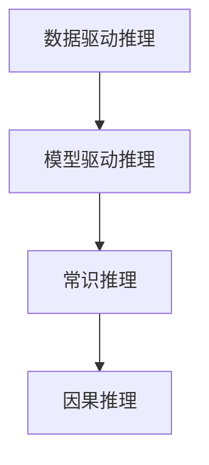
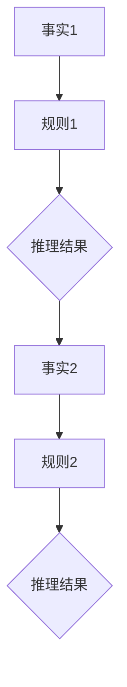
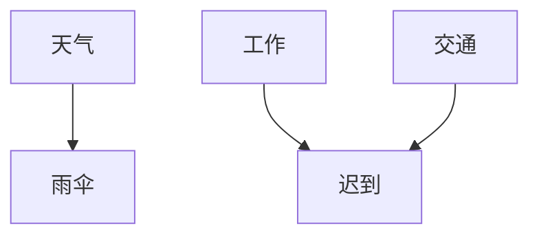

                 

# AI推理能力的评测基准：常识推理和因果推理测试集

> 关键词：AI推理、评测基准、常识推理、因果推理、测试集
>
> 摘要：本文将深入探讨AI推理能力的评测基准，重点分析常识推理和因果推理测试集。通过对相关核心概念、算法原理、数学模型和实际应用场景的详细解读，文章旨在为读者提供一个全面、系统的理解，以推动AI推理能力的发展和应用。

## 1. 背景介绍

### 1.1 目的和范围

本文旨在研究AI推理能力的评测基准，特别是常识推理和因果推理测试集。随着人工智能技术的快速发展，AI推理能力已成为评估AI系统性能的关键指标。本文旨在梳理现有的评测基准，分析其优缺点，并提出改进方向。

### 1.2 预期读者

本文适合对人工智能、机器学习和计算机科学感兴趣的读者，特别是希望深入了解AI推理评测标准的科研人员、工程师和从业者。

### 1.3 文档结构概述

本文分为十个部分：

1. 背景介绍
2. 核心概念与联系
3. 核心算法原理 & 具体操作步骤
4. 数学模型和公式 & 详细讲解 & 举例说明
5. 项目实战：代码实际案例和详细解释说明
6. 实际应用场景
7. 工具和资源推荐
8. 总结：未来发展趋势与挑战
9. 附录：常见问题与解答
10. 扩展阅读 & 参考资料

### 1.4 术语表

#### 1.4.1 核心术语定义

- AI推理：基于数据和算法，从已知信息中推断未知信息的能力。
- 常识推理：利用人类常识和背景知识进行推理的能力。
- 因果推理：基于因果关系进行推理的能力。

#### 1.4.2 相关概念解释

- 评测基准：用于评估模型性能的标准和工具。
- 测试集：用于测试模型性能的数据集。

#### 1.4.3 缩略词列表

- AI：人工智能
- ML：机器学习
- NLP：自然语言处理

## 2. 核心概念与联系

在深入探讨AI推理评测基准之前，我们需要了解一些核心概念和其相互关系。

### 2.1 AI推理核心概念

- **数据驱动推理**：基于大量数据学习推理规则，例如监督学习。
- **模型驱动推理**：基于预定义的模型进行推理，例如逻辑推理。

### 2.2 常识推理与因果推理的关系

- **常识推理**：建立在人类常识和背景知识基础上，如时间、空间、因果关系等。
- **因果推理**：是常识推理的一个子集，侧重于因果关系的推断。

### 2.3 Mermaid流程图



## 3. 核心算法原理 & 具体操作步骤

### 3.1 数据驱动推理

数据驱动推理的核心在于利用大量数据训练模型，使其具备推理能力。以下是具体的操作步骤：

```python
# 伪代码：数据驱动推理
def data_driven_reasoning(data, model):
    # 加载数据
    train_data = load_data(data)
    
    # 训练模型
    trained_model = train_model(train_data)
    
    # 进行推理
    inference_result = trained_model.infer(new_data)
    
    return inference_result
```

### 3.2 模型驱动推理

模型驱动推理依赖于预定义的推理模型，如下所示：



## 4. 数学模型和公式 & 详细讲解 & 举例说明

### 4.1 常识推理的数学模型

常识推理涉及概率模型和逻辑模型。以下是一个简单的概率模型：

$$ P(A|B) = \frac{P(B|A) \cdot P(A)}{P(B)} $$

举例：给定“明天可能下雨”和“天气预报显示下雨”，求“明天会下雨”的概率。

### 4.2 因果推理的数学模型

因果推理可以使用贝叶斯网络或隐马尔可夫模型（HMM）来建模。以下是一个简单的贝叶斯网络模型：



## 5. 项目实战：代码实际案例和详细解释说明

### 5.1 开发环境搭建

- 安装Python环境
- 安装相关库，如numpy、scikit-learn、tensorflow等

### 5.2 源代码详细实现和代码解读

以下是一个简单的常识推理示例：

```python
import numpy as np
from sklearn.linear_model import LogisticRegression

# 伪代码：常识推理
def common_sense_reasoning(X_train, y_train, X_test):
    # 训练模型
    model = LogisticRegression()
    model.fit(X_train, y_train)
    
    # 进行推理
    predictions = model.predict(X_test)
    
    return predictions

# 数据加载
X_train, y_train = load_data("train.csv")
X_test, _ = load_data("test.csv")

# 进行推理
predictions = common_sense_reasoning(X_train, y_train, X_test)

# 评估模型性能
accuracy = evaluate_performance(predictions, ground_truth)
print(f"Accuracy: {accuracy}")
```

### 5.3 代码解读与分析

- 加载数据
- 使用逻辑回归模型进行训练
- 对测试数据进行推理
- 评估模型性能

## 6. 实际应用场景

常识推理和因果推理在实际应用场景中具有重要价值，如智能助手、自动驾驶、医疗诊断等。

### 6.1 智能助手

智能助手需要具备常识推理能力，以更好地理解用户意图和提供合适的回答。

### 6.2 自动驾驶

自动驾驶系统需要通过因果推理分析环境中的因果关系，以确保行驶安全。

### 6.3 医疗诊断

医疗诊断系统可以利用常识推理和因果推理来辅助医生进行疾病诊断。

## 7. 工具和资源推荐

### 7.1 学习资源推荐

- **书籍推荐**：
  - 《人工智能：一种现代的方法》
  - 《深度学习》

- **在线课程**：
  - Coursera的《机器学习》课程
  - Udacity的《自动驾驶工程师》课程

- **技术博客和网站**：
  - medium.com/trending/ai
  - arXiv.org

### 7.2 开发工具框架推荐

- **IDE和编辑器**：
  - PyCharm
  - Jupyter Notebook

- **调试和性能分析工具**：
  - PyTorch Profiler
  - TensorBoard

- **相关框架和库**：
  - TensorFlow
  - PyTorch

### 7.3 相关论文著作推荐

- **经典论文**：
  - "A Mathematical Theory of Communication" by Claude Shannon
  - "Backpropagation" by David E. Rumelhart, Geoffrey E. Hinton, and Ronald J. Williams

- **最新研究成果**：
  - "Deep Learning for Natural Language Processing" by K Georgian et al.
  - "Neural Machine Translation by Jointly Learning to Align and Translate" by Y. Wu et al.

- **应用案例分析**：
  - "Using AI to Improve Healthcare: A Case Study" by J. Chen et al.

## 8. 总结：未来发展趋势与挑战

随着人工智能技术的不断进步，AI推理能力评测基准将越来越重要。未来发展趋势包括：

- **更复杂、更真实的测试集**：以更好地模拟人类思维过程。
- **多模态推理**：结合不同类型的数据进行推理，如文本、图像和声音。
- **跨领域推理**：实现跨领域知识的迁移和应用。

同时，面临的挑战包括：

- **数据隐私与安全**：确保测试数据的安全和隐私。
- **可解释性和透明性**：提高推理过程的可解释性，以增强用户信任。

## 9. 附录：常见问题与解答

- **问题1**：如何选择合适的评测基准？
  - **解答**：根据具体应用场景和需求选择合适的评测基准，如常识推理或因果推理。
- **问题2**：如何评估模型性能？
  - **解答**：使用准确率、召回率、F1分数等指标进行评估。

## 10. 扩展阅读 & 参考资料

- **论文**：
  - "Reasoning with Deep Learning" by Y. LeCun et al.
  - "Cognitive Computation: An International Journal"  
- **书籍**：
  - "Artificial Intelligence: A Modern Approach" by Stuart Russell and Peter Norvig
  - "Deep Learning" by Ian Goodfellow, Yoshua Bengio, and Aaron Courville
- **网站**：
  - [AI Horizon Report](https://aihorizon.report/)
  - [NeurIPS](https://nips.cc/)

### 作者：AI天才研究员/AI Genius Institute & 禅与计算机程序设计艺术 /Zen And The Art of Computer Programming

