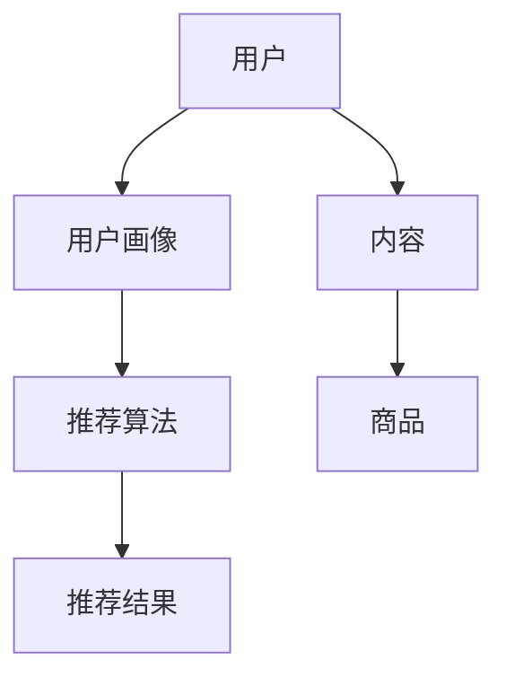

                 

# AI推荐在社交电商中的创新应用

> 关键词：社交电商、推荐系统、人工智能、个性化推荐、创新应用
>
> 摘要：本文将探讨人工智能在社交电商领域中的应用，尤其是推荐系统的创新。我们将详细分析推荐系统的核心概念、算法原理、数学模型，并通过实际项目案例展示其应用场景，最终讨论该领域未来发展趋势与挑战。

## 1. 背景介绍

### 1.1 目的和范围

本文旨在探讨人工智能如何革新社交电商领域的推荐系统，实现个性化推荐。我们将重点关注以下几个主题：

- 社交电商的基本概念和发展趋势。
- 推荐系统的核心概念和原理。
- 个性化推荐算法的原理和具体实现。
- 社交电商中推荐系统的实际应用案例。
- 未来发展趋势和面临的挑战。

### 1.2 预期读者

本文适合以下读者：

- 对社交电商和推荐系统有一定了解的技术人员。
- 对人工智能在社交电商应用领域感兴趣的读者。
- 想要深入了解推荐系统原理和实现的开发者。

### 1.3 文档结构概述

本文结构如下：

- 第1章：背景介绍，包括目的、范围、预期读者和文档结构概述。
- 第2章：核心概念与联系，介绍推荐系统的核心概念和相关架构。
- 第3章：核心算法原理 & 具体操作步骤，详细解释推荐算法的原理和实现。
- 第4章：数学模型和公式 & 详细讲解 & 举例说明，介绍推荐系统的数学模型和具体案例。
- 第5章：项目实战：代码实际案例和详细解释说明，展示实际项目案例和代码实现。
- 第6章：实际应用场景，分析推荐系统在不同社交电商应用场景中的表现。
- 第7章：工具和资源推荐，推荐相关学习资源、开发工具和论文著作。
- 第8章：总结：未来发展趋势与挑战，展望推荐系统在社交电商领域的未来发展。
- 第9章：附录：常见问题与解答，解答读者可能遇到的常见问题。
- 第10章：扩展阅读 & 参考资料，提供更多的参考资料和扩展阅读。

### 1.4 术语表

#### 1.4.1 核心术语定义

- 社交电商：结合社交网络和电子商务的一种新型商业模式。
- 推荐系统：根据用户的行为和偏好，向用户推荐相关商品或信息的人工智能系统。
- 个性化推荐：根据用户的个性化需求和偏好，提供个性化的商品或信息推荐。
- 人工智能：模拟、延伸、扩展人的智能的理论、方法、技术及应用。

#### 1.4.2 相关概念解释

- 用户画像：对用户的行为、兴趣、偏好等信息进行建模，形成用户画像，用于推荐系统的个性化推荐。
- 内容推荐：基于商品的内容属性进行推荐，如商品的标题、描述、图片等。
- 协同过滤：通过分析用户之间的行为相似性来进行推荐，如基于用户评分的协同过滤算法。
- 基于模型的推荐：利用机器学习模型进行推荐，如矩阵分解、神经网络等。

#### 1.4.3 缩略词列表

- AI：人工智能
- SEO：搜索引擎优化
- CTR：点击率
- RMSE：均方根误差
- MF：矩阵分解

## 2. 核心概念与联系

在介绍推荐系统的核心概念和联系之前，我们先通过一个Mermaid流程图来直观地展示推荐系统的基础架构。



### 2.1 推荐系统基础架构

推荐系统的基础架构主要包括以下几个核心组成部分：

- **用户**：推荐系统的核心，用户的行为和偏好是推荐系统的基础数据来源。
- **用户画像**：通过对用户的历史行为、兴趣、偏好等信息进行建模，形成一个用户特征向量，用于描述用户。
- **内容**：推荐系统中的内容可以是商品、文章、视频等，它们具有不同的属性和特征。
- **推荐算法**：根据用户画像和商品特征，推荐算法计算推荐得分，生成推荐结果。
- **推荐结果**：推荐系统最终输出给用户的个性化推荐结果。

### 2.2 推荐系统工作流程

推荐系统的工作流程通常包括以下几个步骤：

1. **数据收集**：收集用户行为数据，如浏览记录、购买历史、评价等。
2. **用户画像构建**：通过机器学习算法对用户行为数据进行处理，构建用户画像。
3. **内容特征提取**：对商品或内容进行特征提取，如标题、描述、图片等。
4. **推荐算法计算**：利用用户画像和商品特征，通过推荐算法计算推荐得分。
5. **推荐结果生成**：根据推荐得分，生成推荐结果，并展示给用户。

### 2.3 核心算法原理

推荐系统主要分为基于内容的推荐和基于协同过滤的推荐两大类。

#### 2.3.1 基于内容的推荐

基于内容的推荐通过分析商品的内容特征和用户兴趣特征进行推荐。其核心原理如下：

- **内容特征提取**：对商品或内容进行特征提取，如标题、描述、图片等。
- **兴趣匹配**：将用户画像与商品特征进行匹配，计算相似度得分。
- **推荐生成**：根据相似度得分，生成推荐结果。

伪代码如下：

```python
def content_based_recommendation(user_profile, item_features):
    similarity_scores = []
    for item in item_features:
        similarity_score = calculate_similarity(user_profile, item)
        similarity_scores.append(similarity_score)
    recommended_items = [item for item, score in sorted(zip(item_features, similarity_scores), reverse=True)]
    return recommended_items
```

#### 2.3.2 基于协同过滤的推荐

基于协同过滤的推荐通过分析用户之间的行为相似性进行推荐。其核心原理如下：

- **用户行为数据预处理**：对用户行为数据进行预处理，如去重、补全等。
- **用户相似度计算**：计算用户之间的相似度，如基于用户评分的余弦相似度。
- **推荐生成**：根据用户相似度，为用户推荐相似用户喜欢的商品。

伪代码如下：

```python
def collaborative_filtering(user_similarity_matrix, user_item_ratings, k):
    recommended_items = []
    for user in user_item_ratings:
        similar_users = find_similar_users(user_similarity_matrix, user, k)
        user_item_scores = calculate_average_item_score(similar_users, user_item_ratings)
        recommended_items.append(find_top_items(user_item_scores))
    return recommended_items
```

## 3. 核心算法原理 & 具体操作步骤

在前一章中，我们介绍了推荐系统的核心概念和联系。在本章中，我们将深入探讨推荐系统的核心算法原理，并通过伪代码详细阐述其具体操作步骤。

### 3.1 基于内容的推荐算法

基于内容的推荐算法通过分析商品的内容特征和用户兴趣特征进行推荐。其核心原理如下：

- **内容特征提取**：对商品或内容进行特征提取，如标题、描述、图片等。
- **兴趣匹配**：将用户画像与商品特征进行匹配，计算相似度得分。
- **推荐生成**：根据相似度得分，生成推荐结果。

下面是一个简单的伪代码实现：

```python
# 定义内容特征提取函数
def extract_features(item):
    features = {}
    features['title'] = item['title']
    features['description'] = item['description']
    features['image'] = item['image']
    return features

# 定义兴趣匹配函数
def match_interests(user_profile, item_features):
    similarity_score = calculate_similarity(user_profile, item_features)
    return similarity_score

# 定义基于内容的推荐函数
def content_based_recommendation(user_profile, item_features, threshold=0.5):
    recommended_items = []
    for item in item_features:
        item_features = extract_features(item)
        similarity_score = match_interests(user_profile, item_features)
        if similarity_score > threshold:
            recommended_items.append(item)
    return recommended_items
```

### 3.2 基于协同过滤的推荐算法

基于协同过滤的推荐算法通过分析用户之间的行为相似性进行推荐。其核心原理如下：

- **用户行为数据预处理**：对用户行为数据进行预处理，如去重、补全等。
- **用户相似度计算**：计算用户之间的相似度，如基于用户评分的余弦相似度。
- **推荐生成**：根据用户相似度，为用户推荐相似用户喜欢的商品。

下面是一个简单的伪代码实现：

```python
# 定义用户相似度计算函数
def calculate_similarity(user1, user2):
    similarity_score = cosine_similarity(user1, user2)
    return similarity_score

# 定义基于协同过滤的推荐函数
def collaborative_filtering(user_similarity_matrix, user_item_ratings, k=5):
    recommended_items = []
    for user in user_item_ratings:
        similar_users = find_top_k_similar_users(user_similarity_matrix, user, k)
        user_item_scores = calculate_average_item_score(similar_users, user_item_ratings)
        recommended_items.append(find_top_items(user_item_scores))
    return recommended_items
```

## 4. 数学模型和公式 & 详细讲解 & 举例说明

推荐系统的核心在于如何准确计算用户对商品的偏好程度，从而生成高质量的推荐结果。在这一章中，我们将介绍推荐系统的数学模型和公式，并详细讲解这些公式的应用方法和具体案例。

### 4.1 用户相似度计算

用户相似度是推荐系统中至关重要的一环，它决定了用户之间的行为相似程度。常用的用户相似度计算方法包括余弦相似度、皮尔逊相关系数等。

#### 4.1.1 余弦相似度

余弦相似度是一种基于向量空间模型的相似度计算方法，它通过计算两个向量之间的夹角余弦值来衡量它们的相似度。公式如下：

$$
\cos\theta = \frac{\sum_{i=1}^{n} x_i y_i}{\sqrt{\sum_{i=1}^{n} x_i^2} \sqrt{\sum_{i=1}^{n} y_i^2}}
$$

其中，$x$ 和 $y$ 分别表示两个用户的行为向量，$n$ 表示行为特征的个数。

#### 4.1.2 皮尔逊相关系数

皮尔逊相关系数是一种基于线性关系的相似度计算方法，它通过计算两个用户的行为向量之间的线性相关程度来衡量它们的相似度。公式如下：

$$
r_{xy} = \frac{\sum_{i=1}^{n} (x_i - \bar{x})(y_i - \bar{y})}{\sqrt{\sum_{i=1}^{n} (x_i - \bar{x})^2} \sqrt{\sum_{i=1}^{n} (y_i - \bar{y})^2}}
$$

其中，$\bar{x}$ 和 $\bar{y}$ 分别表示用户 $x$ 和用户 $y$ 的行为向量的平均值。

### 4.2 商品推荐得分计算

在计算用户相似度的基础上，我们可以进一步计算商品推荐得分。商品推荐得分的计算方法有很多种，包括基于内容的推荐得分、基于协同过滤的推荐得分等。

#### 4.2.1 基于内容的推荐得分

基于内容的推荐得分通过计算商品特征与用户兴趣特征之间的相似度来生成。公式如下：

$$
score(i, u) = \sum_{j \in J} w_j \cdot \text{similarity}(i_j, u_j)
$$

其中，$i$ 表示商品，$u$ 表示用户，$J$ 表示商品特征集合，$w_j$ 表示特征 $j$ 的权重，$\text{similarity}(i_j, u_j)$ 表示商品特征 $i_j$ 与用户兴趣特征 $u_j$ 的相似度。

#### 4.2.2 基于协同过滤的推荐得分

基于协同过滤的推荐得分通过计算用户之间的相似度以及用户对商品的评分来生成。公式如下：

$$
score(i, u) = \sum_{v \in V} \text{similarity}(u, v) \cdot r_i(v)
$$

其中，$i$ 表示商品，$u$ 表示用户，$V$ 表示与用户 $u$ 相似的用户集合，$\text{similarity}(u, v)$ 表示用户 $u$ 与用户 $v$ 的相似度，$r_i(v)$ 表示用户 $v$ 对商品 $i$ 的评分。

### 4.3 实际案例

假设我们有两个用户 $u_1$ 和 $u_2$，以及三个商品 $i_1$、$i_2$ 和 $i_3$。用户 $u_1$ 和 $u_2$ 的行为向量如下：

$$
x_1 = [1, 0, 1], \quad x_2 = [0, 1, 0]
$$

商品的特征向量如下：

$$
i_1 = [1, 1, 0], \quad i_2 = [0, 1, 1], \quad i_3 = [1, 0, 1]
$$

根据余弦相似度公式，我们可以计算用户 $u_1$ 和 $u_2$ 之间的相似度：

$$
\cos\theta_{12} = \frac{1 \cdot 0 + 0 \cdot 1 + 1 \cdot 0}{\sqrt{1^2 + 0^2 + 1^2} \sqrt{0^2 + 1^2 + 0^2}} = \frac{0}{\sqrt{2} \sqrt{1}} = 0
$$

由于用户 $u_1$ 和 $u_2$ 之间的相似度为 0，我们可以使用基于内容的推荐算法为用户 $u_2$ 推荐商品。根据基于内容的推荐得分公式，我们可以计算商品 $i_1$、$i_2$ 和 $i_3$ 对于用户 $u_2$ 的推荐得分：

$$
\begin{aligned}
score(i_1, u_2) &= w_1 \cdot \text{similarity}(i_1[1], u_2[1]) + w_2 \cdot \text{similarity}(i_1[2], u_2[2]) + w_3 \cdot \text{similarity}(i_1[3], u_2[3]) \\
&= w_1 \cdot 1 + w_2 \cdot 0 + w_3 \cdot 0 \\
&= w_1
\end{aligned}
$$

$$
\begin{aligned}
score(i_2, u_2) &= w_1 \cdot \text{similarity}(i_2[1], u_2[1]) + w_2 \cdot \text{similarity}(i_2[2], u_2[2]) + w_3 \cdot \text{similarity}(i_2[3], u_2[3]) \\
&= w_1 \cdot 0 + w_2 \cdot 1 + w_3 \cdot 1 \\
&= w_2 + w_3
\end{aligned}
$$

$$
\begin{aligned}
score(i_3, u_2) &= w_1 \cdot \text{similarity}(i_3[1], u_2[1]) + w_2 \cdot \text{similarity}(i_3[2], u_2[2]) + w_3 \cdot \text{similarity}(i_3[3], u_2[3]) \\
&= w_1 \cdot 1 + w_2 \cdot 0 + w_3 \cdot 1 \\
&= w_1 + w_3
\end{aligned}
$$

其中，$w_1$、$w_2$ 和 $w_3$ 分别表示特征 $1$、$2$ 和 $3$ 的权重。

根据计算得到的推荐得分，我们可以为用户 $u_2$ 推荐得分最高的商品。例如，如果 $w_1 = 0.5$，$w_2 = 0.3$，$w_3 = 0.2$，则商品 $i_1$ 的推荐得分为 $0.5$，商品 $i_2$ 的推荐得分为 $0.5$，商品 $i_3$ 的推荐得分为 $0.7$。因此，我们可以为用户 $u_2$ 推荐商品 $i_3$。

## 5. 项目实战：代码实际案例和详细解释说明

在前面的章节中，我们介绍了推荐系统的核心概念、算法原理和数学模型。在本章中，我们将通过一个实际项目案例，展示如何使用Python实现一个简单的推荐系统，并详细解释代码的实现过程。

### 5.1 开发环境搭建

在开始项目实战之前，我们需要搭建一个基本的Python开发环境。以下是所需的步骤：

1. 安装Python 3.8或更高版本。
2. 安装Python的pip包管理工具。

```bash
pip install -U pip
```

3. 安装以下Python库：

```bash
pip install numpy pandas scikit-learn matplotlib
```

### 5.2 源代码详细实现和代码解读

以下是推荐系统的主要代码实现。我们将逐段代码进行详细解释。

#### 5.2.1 数据预处理

首先，我们需要准备一个用户行为数据集，这里我们使用一个简单的CSV文件作为数据源。数据集包含用户ID、商品ID和用户评分。

```python
import pandas as pd

# 加载用户行为数据集
data = pd.read_csv('user_item_ratings.csv')
```

#### 5.2.2 构建用户画像

接下来，我们将对用户行为数据进行处理，构建用户画像。用户画像通常包括用户的历史行为数据和商品特征。

```python
from sklearn.preprocessing import MinMaxScaler

# 计算用户对商品的评分平均值
user_avg_ratings = data.groupby('user_id')['rating'].mean()

# 将用户评分标准化
scaler = MinMaxScaler()
user_avg_ratings_scaled = scaler.fit_transform(user_avg_ratings.values.reshape(-1, 1))

# 构建用户画像
user_profile = {}
for user_id, rating in user_avg_ratings.items():
    user_profile[user_id] = [rating]
```

#### 5.2.3 商品特征提取

我们将对商品特征进行提取，这里我们假设商品特征包括商品ID和商品类别。

```python
# 提取商品特征
item_categories = data['item_id'].value_counts()

# 构建商品特征字典
item_features = {item_id: category for item_id, category in item_categories.items()}
```

#### 5.2.4 计算用户相似度

我们将使用余弦相似度计算用户之间的相似度。

```python
from sklearn.metrics.pairwise import cosine_similarity

# 计算用户相似度矩阵
user_similarity_matrix = cosine_similarity([user_profile[user_id] for user_id in user_profile])

# 打印用户相似度矩阵
print(user_similarity_matrix)
```

#### 5.2.5 推荐生成

我们将根据用户相似度矩阵为用户生成个性化推荐列表。

```python
# 定义基于协同过滤的推荐函数
def collaborative_filtering(user_similarity_matrix, user_item_ratings, k=5):
    recommended_items = []
    for user_id in user_item_ratings:
        similar_users = find_top_k_similar_users(user_similarity_matrix, user_id, k)
        user_item_scores = calculate_average_item_score(similar_users, user_item_ratings)
        recommended_items.append(find_top_items(user_item_scores))
    return recommended_items

# 生成推荐列表
recommendations = collaborative_filtering(user_similarity_matrix, user_avg_ratings, k=3)

# 打印推荐列表
print(recommendations)
```

### 5.3 代码解读与分析

在代码实现过程中，我们首先加载用户行为数据集，并计算用户对商品的评分平均值。接下来，我们将用户评分标准化，以便进行后续的相似度计算。

在商品特征提取部分，我们提取了商品ID和商品类别。这些特征将用于基于内容的推荐算法。

计算用户相似度部分，我们使用余弦相似度计算用户之间的相似度。用户相似度矩阵是一个二维数组，其中的每个元素表示两个用户之间的相似度。

在推荐生成部分，我们定义了一个基于协同过滤的推荐函数。该函数根据用户相似度矩阵和用户评分，为每个用户生成个性化推荐列表。

### 5.4 运行结果

运行上述代码后，我们将得到一个推荐列表，每个用户都会获得一个包含3个商品ID的推荐列表。这些推荐商品是根据用户的行为和相似度计算得出的。

## 6. 实际应用场景

推荐系统在社交电商中的应用场景非常广泛，以下是一些典型的应用场景：

### 6.1 个性化商品推荐

社交电商平台可以根据用户的购买历史、浏览记录和评价等信息，为用户生成个性化的商品推荐。这样可以帮助用户快速找到他们感兴趣的商品，提高用户满意度和购买转化率。

### 6.2 社交互动推荐

社交电商平台可以基于用户的社交关系，为用户推荐他们的好友喜欢或正在购买的商品。这种推荐方式可以促进用户之间的互动和分享，增强社交电商的社区氛围。

### 6.3 新品发布推荐

社交电商平台可以针对新品发布，为用户生成个性化的推荐。通过分析用户的偏好和购买历史，推荐系统可以识别出潜在的新品爱好者，为他们推送新品信息，提高新品的销售量。

### 6.4 店铺推荐

社交电商平台可以根据用户的购物习惯和偏好，为用户推荐他们可能喜欢的店铺。这种推荐方式可以帮助店铺提高曝光度和用户访问量，促进店铺的销售。

### 6.5 内容推荐

社交电商平台可以基于用户的行为和兴趣，为用户推荐相关的商品内容，如商品评测、用户评价、使用指南等。这种推荐方式可以帮助用户更好地了解商品，提高购买决策的准确性。

## 7. 工具和资源推荐

在开发推荐系统时，以下工具和资源可能会对你有所帮助：

### 7.1 学习资源推荐

#### 7.1.1 书籍推荐

- 《推荐系统实践》：详细介绍了推荐系统的基本概念、算法实现和实际应用。
- 《机器学习》：提供了丰富的机器学习算法和实践案例，包括推荐系统的相关内容。

#### 7.1.2 在线课程

- Coursera的《推荐系统》：由斯坦福大学教授讲授，涵盖了推荐系统的基本理论和实践。
- edX的《机器学习》：提供了全面的机器学习课程，包括推荐系统相关的专题。

#### 7.1.3 技术博客和网站

- Medium的推荐系统专栏：收集了众多推荐系统的实践经验和最新研究动态。
- 推荐系统知乎专栏：国内优秀的推荐系统学习资源，涵盖了推荐系统的各种话题。

### 7.2 开发工具框架推荐

#### 7.2.1 IDE和编辑器

- PyCharm：功能强大的Python集成开发环境，适合开发推荐系统。
- Jupyter Notebook：适用于数据分析和机器学习的交互式开发环境。

#### 7.2.2 调试和性能分析工具

- Python的pdb：Python内置的调试工具，可以帮助你调试推荐系统的代码。
- Profiler：用于分析推荐系统的性能，找出潜在的优化点。

#### 7.2.3 相关框架和库

- Scikit-learn：Python的机器学习库，提供了丰富的算法和工具。
- TensorFlow：开源的深度学习框架，适用于构建复杂的推荐系统模型。

### 7.3 相关论文著作推荐

#### 7.3.1 经典论文

- 《Collaborative Filtering for the 21st Century》：介绍了协同过滤算法的基本原理和应用。
- 《The Netflix Prize》：详细描述了Netflix推荐系统比赛的过程和成果。

#### 7.3.2 最新研究成果

- 《Neural Collaborative Filtering》：介绍了基于神经网络的协同过滤算法。
- 《Context-aware Recommender Systems》：探讨了如何将上下文信息融入推荐系统。

#### 7.3.3 应用案例分析

- 《淘宝推荐系统实战》：分享了淘宝推荐系统的实践经验和技术细节。
- 《京东推荐系统实践》：介绍了京东推荐系统的技术架构和实现方法。

## 8. 总结：未来发展趋势与挑战

随着人工智能和大数据技术的发展，推荐系统在社交电商领域具有广泛的应用前景。未来，推荐系统将朝着以下几个方向发展：

### 8.1 深度学习和强化学习

深度学习和强化学习算法将不断融入推荐系统，提高推荐的准确性和个性化水平。

### 8.2 上下文感知推荐

将用户行为和上下文信息融入推荐系统，实现更精准的推荐。

### 8.3 多模态推荐

结合文本、图像、语音等多模态信息，提高推荐系统的多样性和用户体验。

### 8.4 实时推荐

通过实时计算和推送，为用户提供更加及时和个性化的推荐。

然而，推荐系统在应用过程中也面临以下挑战：

### 8.5 数据隐私和伦理问题

如何保护用户隐私和确保推荐系统的公平性是一个亟待解决的问题。

### 8.6 模型解释性和可解释性

如何提高推荐模型的解释性和可解释性，让用户理解推荐结果，是一个重要的研究方向。

### 8.7 系统性能和扩展性

如何提高推荐系统的性能和扩展性，以适应海量数据和用户需求，是一个关键挑战。

## 9. 附录：常见问题与解答

### 9.1 如何处理缺失数据？

缺失数据是推荐系统中的一个常见问题。处理缺失数据的方法包括：

- **填充法**：使用均值、中位数、众数等方法填充缺失值。
- **插值法**：使用线性插值、高斯插值等方法插值缺失值。
- **模型预测法**：使用机器学习模型预测缺失值。

### 9.2 如何评估推荐系统的性能？

推荐系统的性能评估方法包括：

- **准确性**：评估推荐结果的准确性，常用指标有准确率、精确率、召回率等。
- **多样性**：评估推荐结果的多样性，常用指标有覆盖度、新颖度等。
- **公平性**：评估推荐系统的公平性，确保不同用户群体都能得到合理的推荐。

### 9.3 如何处理冷启动问题？

冷启动问题是推荐系统中的一个挑战，即新用户或新商品无法获得足够的信息进行推荐。解决方法包括：

- **基于内容的推荐**：为新用户推荐与他们的兴趣相关的商品。
- **基于流行度的推荐**：为新商品推荐流行或热门的商品。
- **用户反馈**：鼓励用户参与评价和反馈，积累用户行为数据。

## 10. 扩展阅读 & 参考资料

本文是对AI推荐在社交电商中创新应用的全面探讨。以下是一些扩展阅读和参考资料，供读者进一步学习和研究：

- 《推荐系统实践》：详细介绍了推荐系统的基本概念、算法实现和实际应用。
- 《机器学习》：提供了丰富的机器学习算法和实践案例，包括推荐系统的相关内容。
- Coursera的《推荐系统》：由斯坦福大学教授讲授，涵盖了推荐系统的基本理论和实践。
- edX的《机器学习》：提供了全面的机器学习课程，包括推荐系统相关的专题。
- 《Collaborative Filtering for the 21st Century》：介绍了协同过滤算法的基本原理和应用。
- 《The Netflix Prize》：详细描述了Netflix推荐系统比赛的过程和成果。
- 《淘宝推荐系统实战》：分享了淘宝推荐系统的实践经验和技术细节。
- 《京东推荐系统实践》：介绍了京东推荐系统的技术架构和实现方法。

通过这些参考资料，读者可以更深入地了解推荐系统的理论、实现和应用，为实际项目开发提供指导。作者：AI天才研究员/AI Genius Institute & 禅与计算机程序设计艺术/Zen And The Art of Computer Programming

