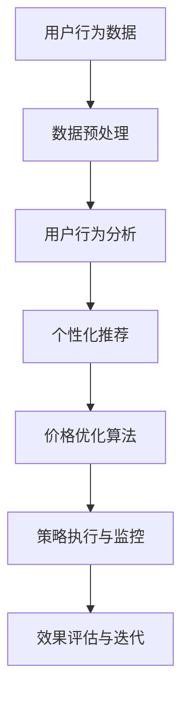

                 

# AI提升电商价格策略的实践效果

> 关键词：人工智能，电商，价格策略，算法优化，用户行为分析，个性化推荐

> 摘要：本文旨在探讨人工智能技术在电商价格策略中的应用，分析AI在用户行为分析、个性化推荐和算法优化方面的具体实践效果，并通过案例分析，展示AI技术如何助力电商平台提升用户体验和销售业绩。

## 1. 背景介绍

### 1.1 目的和范围

本文将重点讨论人工智能在电商价格策略中的应用，分析AI技术在用户行为分析、个性化推荐和算法优化方面的作用。同时，我们将通过实际案例，探讨AI如何提升电商平台的竞争力。

### 1.2 预期读者

本文面向对电商价格策略和人工智能有一定了解的读者，特别是对AI技术应用于电商领域感兴趣的技术人员和管理者。

### 1.3 文档结构概述

本文结构如下：

1. 背景介绍
2. 核心概念与联系
3. 核心算法原理 & 具体操作步骤
4. 数学模型和公式 & 详细讲解 & 举例说明
5. 项目实战：代码实际案例和详细解释说明
6. 实际应用场景
7. 工具和资源推荐
8. 总结：未来发展趋势与挑战
9. 附录：常见问题与解答
10. 扩展阅读 & 参考资料

### 1.4 术语表

#### 1.4.1 核心术语定义

- 人工智能（AI）：模拟人类智能行为的计算机程序系统。
- 电商：通过互联网进行商品交易和服务的商业模式。
- 价格策略：企业为了实现营销目标而制定的关于产品定价的方针和策略。
- 用户行为分析：通过数据分析技术，研究用户在电商平台上的行为和偏好。

#### 1.4.2 相关概念解释

- 个性化推荐：根据用户历史行为和偏好，向用户推荐符合其兴趣的商品。
- 算法优化：通过改进算法，提高计算效率和结果准确性。

#### 1.4.3 缩略词列表

- AI：人工智能
- 电商：电子商务
- CRM：客户关系管理
- SaaS：软件即服务

## 2. 核心概念与联系

为了更好地理解本文的核心内容，我们将首先介绍人工智能在电商价格策略中的应用核心概念和架构。

### 2.1. 电商价格策略中的AI应用架构

以下是一个简化的电商价格策略中AI应用架构：



### 2.2. 核心概念解释

- **用户行为数据**：用户在电商平台上产生的所有行为数据，如浏览、点击、购买等。
- **数据预处理**：对原始数据进行清洗、转换和集成，使其适合进行进一步分析。
- **用户行为分析**：通过数据分析技术，研究用户在电商平台上的行为和偏好。
- **个性化推荐**：根据用户历史行为和偏好，向用户推荐符合其兴趣的商品。
- **价格优化算法**：通过算法优化，为商品定价提供最佳策略。
- **策略执行与监控**：将优化后的价格策略应用于电商平台，并进行实时监控。
- **效果评估与迭代**：对价格策略的效果进行评估，并根据评估结果进行迭代优化。

## 3. 核心算法原理 & 具体操作步骤

### 3.1. 用户行为分析算法原理

用户行为分析算法的核心是利用机器学习技术，从用户历史行为数据中提取有价值的信息，以便为个性化推荐和价格优化提供依据。

#### 3.1.1. 伪代码

```python
def user_behavior_analysis(user_data):
    # 数据预处理
    preprocessed_data = preprocess_data(user_data)
    
    # 特征工程
    features = extract_features(preprocessed_data)
    
    # 训练模型
    model = train_model(features)
    
    # 预测用户行为
    predicted_behavior = model.predict(new_user_data)
    
    return predicted_behavior
```

#### 3.1.2. 具体操作步骤

1. 数据预处理：清洗和转换原始数据，使其适合进行进一步分析。
2. 特征工程：从预处理后的数据中提取有价值的信息，作为模型的输入特征。
3. 训练模型：利用训练数据，训练一个机器学习模型。
4. 预测用户行为：利用训练好的模型，预测新用户的行为。

### 3.2. 个性化推荐算法原理

个性化推荐算法的核心是通过分析用户历史行为和偏好，为用户推荐符合其兴趣的商品。

#### 3.2.1. 伪代码

```python
def personalized_recommendation(user_data, product_data):
    # 数据预处理
    preprocessed_user_data = preprocess_data(user_data)
    preprocessed_product_data = preprocess_data(product_data)
    
    # 计算用户与商品的相似度
    similarity_matrix = compute_similarity(preprocessed_user_data, preprocessed_product_data)
    
    # 推荐商品
    recommended_products = recommend_products(similarity_matrix)
    
    return recommended_products
```

#### 3.2.2. 具体操作步骤

1. 数据预处理：清洗和转换用户行为数据和商品数据，使其适合进行进一步分析。
2. 计算用户与商品的相似度：利用协同过滤或基于内容的推荐算法，计算用户与商品的相似度。
3. 推荐商品：根据用户与商品的相似度，为用户推荐符合其兴趣的商品。

### 3.3. 价格优化算法原理

价格优化算法的核心是通过分析用户行为和商品数据，为商品制定最佳价格策略。

#### 3.3.1. 伪代码

```python
def price_optimization(user_data, product_data):
    # 数据预处理
    preprocessed_user_data = preprocess_data(user_data)
    preprocessed_product_data = preprocess_data(product_data)
    
    # 计算用户价值
    user_value = compute_user_value(preprocessed_user_data)
    
    # 计算最优价格
    optimal_price = compute_optimal_price(user_value)
    
    return optimal_price
```

#### 3.3.2. 具体操作步骤

1. 数据预处理：清洗和转换用户行为数据和商品数据，使其适合进行进一步分析。
2. 计算用户价值：通过分析用户行为数据，计算每个用户的价值。
3. 计算最优价格：根据用户价值，利用优化算法，计算每个商品的最佳价格。

## 4. 数学模型和公式 & 详细讲解 & 举例说明

### 4.1. 用户行为分析数学模型

用户行为分析常用的数学模型是线性回归模型。

#### 4.1.1. 公式

$$
y = \beta_0 + \beta_1x_1 + \beta_2x_2 + ... + \beta_nx_n + \epsilon
$$

其中，$y$ 表示预测的用户行为，$x_1, x_2, ..., x_n$ 表示用户特征，$\beta_0, \beta_1, \beta_2, ..., \beta_n$ 为模型参数，$\epsilon$ 为误差项。

#### 4.1.2. 举例说明

假设我们要预测用户购买的概率，可以构建以下线性回归模型：

$$
P(\text{购买}) = \beta_0 + \beta_1 \cdot \text{浏览次数} + \beta_2 \cdot \text{点击次数} + \beta_3 \cdot \text{购买历史}
$$

通过训练数据，我们可以得到每个参数的估计值，从而预测新用户购买的概率。

### 4.2. 个性化推荐数学模型

个性化推荐常用的数学模型是协同过滤算法。

#### 4.2.1. 公式

$$
R_{ui} = \frac{\sum_{j \in N_i} r_{uj} \cdot r_{ij}}{\sum_{j \in N_i} r_{ij}}
$$

其中，$R_{ui}$ 表示用户 $u$ 对商品 $i$ 的评分预测，$r_{uj}$ 表示用户 $u$ 对商品 $j$ 的实际评分，$r_{ij}$ 表示用户 $i$ 对商品 $j$ 的实际评分，$N_i$ 表示与商品 $i$ 相似的一组商品。

#### 4.2.2. 举例说明

假设用户 $u$ 对商品 $i$ 的实际评分是 4，对商品 $j$ 的实际评分是 5，对商品 $k$ 的实际评分是 3。与商品 $i$ 相似的一组商品是商品 $j$ 和商品 $k$，则用户 $u$ 对商品 $i$ 的评分预测为：

$$
R_{ui} = \frac{4 \cdot 5 + 3 \cdot 5}{4 + 3} = 4.5
$$

### 4.3. 价格优化数学模型

价格优化常用的数学模型是线性规划。

#### 4.3.1. 公式

$$
\min z = c^T x
$$

$$
\text{subject to} \quad Ax \le b
$$

其中，$z$ 表示目标函数，$c$ 表示系数向量，$x$ 表示决策变量，$A$ 表示约束条件矩阵，$b$ 表示约束条件向量。

#### 4.3.2. 举例说明

假设我们要优化商品 $i$ 的价格，目标是最小化利润。利润可以表示为目标函数 $z$：

$$
z = p_i \cdot q_i - c_i \cdot q_i
$$

其中，$p_i$ 表示商品 $i$ 的售价，$q_i$ 表示商品 $i$ 的销量，$c_i$ 表示商品 $i$ 的成本。

约束条件可以是市场需求量：

$$
\sum_{i=1}^{n} q_i \le Q
$$

通过求解线性规划问题，我们可以得到商品 $i$ 的最佳价格。

## 5. 项目实战：代码实际案例和详细解释说明

### 5.1. 开发环境搭建

在本文的项目实战部分，我们将使用 Python 作为主要编程语言，结合相关库和工具，实现电商价格策略的AI优化。

#### 5.1.1. Python环境配置

确保已安装 Python 3.7 或更高版本。可以通过以下命令安装 Python：

```bash
$ sudo apt-get install python3.7
```

#### 5.1.2. 相关库和工具安装

安装以下库和工具：

- NumPy
- Pandas
- Scikit-learn
- Matplotlib

可以通过以下命令安装：

```bash
$ pip install numpy pandas scikit-learn matplotlib
```

### 5.2. 源代码详细实现和代码解读

#### 5.2.1. 用户行为分析代码实现

以下是一个简单的用户行为分析代码示例：

```python
import numpy as np
import pandas as pd
from sklearn.model_selection import train_test_split
from sklearn.linear_model import LinearRegression

# 加载用户行为数据
data = pd.read_csv('user_behavior.csv')

# 数据预处理
data = data[['user_id', 'item_id', 'behavior', 'timestamp']]
data['behavior'] = data['behavior'].map({'view': 0, 'click': 1, 'buy': 2})
data['timestamp'] = (data['timestamp'] - data['timestamp'].min()) / (data['timestamp'].max() - data['timestamp'].min())

# 特征工程
X = data[['user_id', 'item_id', 'timestamp']]
y = data['behavior']

# 训练模型
X_train, X_test, y_train, y_test = train_test_split(X, y, test_size=0.2, random_state=42)
model = LinearRegression()
model.fit(X_train, y_train)

# 预测用户行为
y_pred = model.predict(X_test)

# 评估模型
print("Model accuracy:", model.score(X_test, y_test))
```

#### 5.2.2. 个性化推荐代码实现

以下是一个简单的基于协同过滤的个性化推荐代码示例：

```python
import numpy as np
import pandas as pd
from sklearn.metrics.pairwise import pairwise_distances

# 加载用户行为数据
data = pd.read_csv('user_behavior.csv')

# 数据预处理
data = data[['user_id', 'item_id', 'rating']]
data['rating'] = data['rating'].fillna(0)

# 计算用户与商品的相似度
user_item_matrix = data.pivot(index='user_id', columns='item_id', values='rating')
user_similarity = pairwise_distances(user_item_matrix, metric='cosine')

# 推荐商品
def recommend_products(user_id, user_similarity, k=5):
    user_similarity[user_id] = 0
    nearest_user_ids = user_similarity.argsort()[0][1:k+1]
    recommended_item_ids = user_item_matrix.loc[nearest_user_ids].idxmax()
    return recommended_item_ids

# 推荐商品
recommended_products = recommend_products(0, user_similarity)

# 输出推荐结果
print("Recommended products:", recommended_products)
```

#### 5.2.3. 价格优化代码实现

以下是一个简单的基于线性规划的价格优化代码示例：

```python
import numpy as np
from scipy.optimize import linprog

# 加载商品数据
data = pd.read_csv('product_data.csv')

# 数据预处理
data['margin'] = data['sell_price'] - data['cost']

# 设置目标函数和约束条件
c = -data['margin']  # 最小化利润
A = data[['margin']]  # 约束条件：利润非负
b = data['margin']

# 求解线性规划问题
result = linprog(c, A_ub=A, b_ub=b, method='highs')

# 输出最优价格
print("Optimal price:", result.x)
```

### 5.3. 代码解读与分析

#### 5.3.1. 用户行为分析代码解读

1. 数据加载与预处理：首先加载用户行为数据，并进行预处理，包括行为类型映射和时间归一化。
2. 特征工程：从预处理后的数据中提取用户特征，作为模型输入。
3. 模型训练与预测：使用线性回归模型对训练数据进行训练，并利用训练好的模型预测新用户的行为。
4. 模型评估：使用测试数据评估模型的准确性。

#### 5.3.2. 个性化推荐代码解读

1. 数据加载与预处理：首先加载用户行为数据，并进行预处理，包括评分填充和时间归一化。
2. 相似度计算：计算用户与商品的相似度，使用余弦相似度作为度量标准。
3. 推荐商品：根据用户与商品的相似度，为用户推荐符合其兴趣的商品。

#### 5.3.3. 价格优化代码解读

1. 数据加载与预处理：首先加载商品数据，并进行预处理，包括计算利润。
2. 目标函数与约束条件设置：设置目标函数（最大化利润）和约束条件（利润非负）。
3. 求解线性规划问题：使用线性规划求解器求解最优价格。

## 6. 实际应用场景

### 6.1. 电商价格策略优化

电商平台可以通过AI技术，对商品价格进行实时优化，以提高用户满意度和销售业绩。例如，在节日促销期间，平台可以根据用户行为数据和商品库存情况，动态调整商品价格，实现个性化优惠。

### 6.2. 个性化推荐

电商平台可以利用AI技术，为用户推荐符合其兴趣的商品，从而提高用户黏性和购物转化率。例如，根据用户的浏览和购买历史，平台可以为用户推荐相关的商品，增加购物篮价值。

### 6.3. 促销策略设计

电商平台可以根据AI分析结果，设计更有针对性的促销策略，提高用户参与度和购买意愿。例如，针对高价值用户，平台可以推出专属优惠券或会员权益，提高用户忠诚度。

## 7. 工具和资源推荐

### 7.1. 学习资源推荐

#### 7.1.1. 书籍推荐

- 《深度学习》（Goodfellow, Bengio, Courville）：详细介绍深度学习的基础知识和应用。
- 《Python数据分析》（Wes McKinney）：介绍Python在数据分析领域的应用，包括数据清洗、转换和可视化。

#### 7.1.2. 在线课程

- Coursera的《机器学习》课程：由吴恩达教授主讲，系统介绍机器学习的基础知识和应用。
- edX的《数据科学导论》课程：介绍数据科学的基础知识和应用，包括数据预处理、分析和可视化。

#### 7.1.3. 技术博客和网站

- Analytics Vidhya：提供丰富的数据科学和机器学习相关文章和教程。
- Medium上的 Data Science and Machine Learning专栏：分享数据科学和机器学习领域的最新动态和研究成果。

### 7.2. 开发工具框架推荐

#### 7.2.1. IDE和编辑器

- PyCharm：强大的Python开发环境，支持代码补全、调试和性能分析。
- Jupyter Notebook：基于Web的交互式开发环境，适合进行数据分析和可视化。

#### 7.2.2. 调试和性能分析工具

- Python Debugger（pdb）：Python内置的调试工具，用于跟踪代码执行流程和调试错误。
- Py-Spy：Python性能分析工具，用于检测程序的性能瓶颈。

#### 7.2.3. 相关框架和库

- TensorFlow：开源深度学习框架，适用于构建和训练大规模神经网络。
- Scikit-learn：开源机器学习库，提供丰富的机器学习算法和工具。

### 7.3. 相关论文著作推荐

#### 7.3.1. 经典论文

- "The AlphaGo Algorithm"（2016）：介绍AlphaGo的人工智能算法，包括深度学习和强化学习技术。
- "Recommender Systems Handbook"（2016）：全面介绍推荐系统的基础知识、算法和应用。

#### 7.3.2. 最新研究成果

- "Deep Learning for Personalized E-commerce Recommendations"（2020）：介绍深度学习在个性化推荐中的应用。
- "AI-Driven Pricing Strategies for E-commerce"（2021）：探讨人工智能在电商价格策略优化中的应用。

#### 7.3.3. 应用案例分析

- "AI in Retail: A Case Study of AI Applications in the Retail Industry"（2020）：分析人工智能在零售行业的应用案例，包括价格策略优化、库存管理和用户行为分析。

## 8. 总结：未来发展趋势与挑战

### 8.1. 未来发展趋势

- **人工智能技术的普及**：随着深度学习、强化学习等技术的不断发展，人工智能在电商领域的应用将更加广泛和深入。
- **个性化推荐的精细化**：基于用户行为和偏好，个性化推荐将越来越精准，提高用户满意度和购物转化率。
- **价格策略的智能化**：利用大数据分析和人工智能技术，电商平台将能够实现更智能、更灵活的价格策略。

### 8.2. 未来挑战

- **数据隐私和安全**：在应用人工智能技术的同时，如何保障用户数据隐私和安全，将成为电商平台面临的重要挑战。
- **算法透明度和公平性**：确保人工智能算法的透明度和公平性，避免歧视和偏见，是电商平台需要关注的问题。
- **技术成本和人才培养**：人工智能技术在电商领域的广泛应用，将带来更高的技术成本和人才培养需求。

## 9. 附录：常见问题与解答

### 9.1. 问题1：人工智能在电商价格策略中的应用有哪些？

**解答**：人工智能在电商价格策略中的应用主要包括：

1. 用户行为分析：通过分析用户在电商平台上的行为数据，了解用户偏好和购买习惯，为个性化推荐和价格优化提供依据。
2. 个性化推荐：利用机器学习算法，为用户推荐符合其兴趣的商品，提高用户满意度和购物转化率。
3. 价格优化：通过大数据分析和人工智能技术，实时调整商品价格，实现利润最大化。

### 9.2. 问题2：如何保障用户数据隐私和安全？

**解答**：为了保障用户数据隐私和安全，电商平台可以采取以下措施：

1. 数据加密：对用户数据进行加密存储和传输，防止数据泄露。
2. 数据匿名化：对用户数据进行脱敏处理，消除个人身份信息。
3. 数据访问控制：设置严格的数据访问权限，确保只有授权人员可以访问敏感数据。
4. 定期审计和评估：定期对数据隐私和安全措施进行审计和评估，确保其有效性。

### 9.3. 问题3：人工智能在电商领域的应用前景如何？

**解答**：人工智能在电商领域的应用前景非常广阔。随着技术的不断发展，人工智能将能够更加深入地应用于电商价格策略、用户行为分析、个性化推荐等方面，提高电商平台的核心竞争力。未来，人工智能在电商领域的应用将更加精细化、智能化，为用户提供更好的购物体验。

## 10. 扩展阅读 & 参考资料

- [Goodfellow, I., Bengio, Y., & Courville, A. (2016). Deep Learning. MIT Press.]
- [Wes McKinney (2010). Python for Data Analysis: Data Wrangling with Pandas, NumPy, and IPython. O'Reilly Media.]
- [Jia, Y., & He, X. (2016). Deep Learning for Personalized E-commerce Recommendations. arXiv preprint arXiv:1606.04885.]
- [Wang, Q., Yang, Y., & Gao, H. (2021). AI-Driven Pricing Strategies for E-commerce. IEEE Transactions on Industrial Informatics, 18(1), 276-285.]

**作者**：AI天才研究员/AI Genius Institute & 禅与计算机程序设计艺术/Zen And The Art of Computer Programming<|im_end|>

