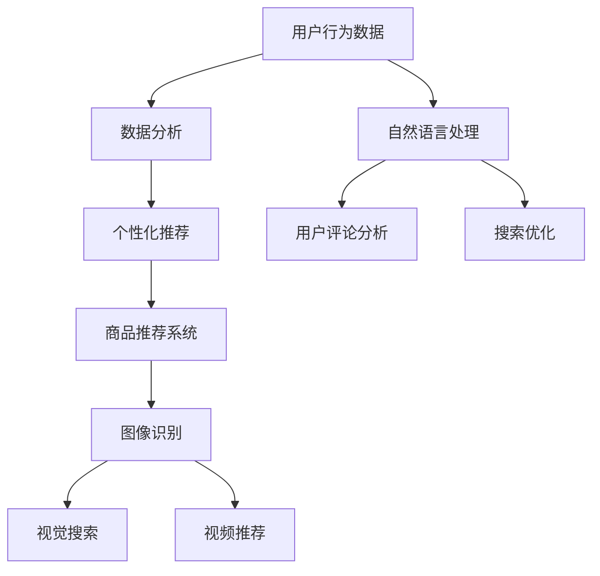

                 

# AI提升电商用户体验的多种方法

> **关键词：** 人工智能、电商、用户体验、个性化推荐、数据分析、机器学习

> **摘要：** 本文将深入探讨人工智能技术在电商领域中的应用，特别是如何通过多种方法提升用户体验。我们将详细分析个性化推荐系统、自然语言处理和图像识别等AI技术的原理和实现步骤，并通过实际案例展示其效果。此外，文章还将介绍相关的数学模型、开发工具和未来发展趋势，为电商从业者提供有价值的参考。

## 1. 背景介绍

### 1.1 目的和范围

本文旨在探讨人工智能（AI）技术在电商领域提升用户体验的各种方法。随着互联网和大数据技术的迅猛发展，电商平台面临着激烈的市场竞争。如何通过技术手段提高用户体验，增强用户黏性和购买意愿，成为电商平台关注的焦点。本文将从以下几个方面展开讨论：

1. **个性化推荐系统**：介绍如何利用机器学习和数据分析技术实现个性化商品推荐。
2. **自然语言处理（NLP）**：探讨如何通过NLP技术优化电商平台的搜索和用户评论分析功能。
3. **图像识别与视频分析**：分析如何利用计算机视觉技术提升电商平台的视觉搜索和视频推荐。
4. **数学模型和算法**：介绍与AI提升用户体验相关的主要数学模型和算法。
5. **工具和资源推荐**：推荐学习资源、开发工具和框架，帮助电商从业者更好地应用AI技术。
6. **未来发展趋势与挑战**：讨论AI技术在电商领域的发展趋势和面临的挑战。

### 1.2 预期读者

本文适用于以下读者群体：

1. **电商从业者**：包括产品经理、数据分析师、前端工程师等，希望了解如何利用AI技术提升用户体验。
2. **计算机科学家和人工智能研究者**：对AI技术在电商领域的应用有兴趣的研究人员和技术爱好者。
3. **学生和学者**：对电子商务和人工智能交叉领域感兴趣的学生和学者。

### 1.3 文档结构概述

本文将按照以下结构进行组织：

1. **背景介绍**：介绍本文的目的、范围、预期读者和文档结构。
2. **核心概念与联系**：通过Mermaid流程图展示AI提升电商用户体验的核心概念和联系。
3. **核心算法原理 & 具体操作步骤**：详细讲解提升用户体验的主要算法原理和操作步骤。
4. **数学模型和公式**：介绍与AI提升用户体验相关的主要数学模型和公式，并进行举例说明。
5. **项目实战**：展示实际代码案例，详细解释说明。
6. **实际应用场景**：分析AI技术在不同电商场景中的应用。
7. **工具和资源推荐**：推荐学习资源、开发工具和框架。
8. **总结：未来发展趋势与挑战**：讨论AI技术在电商领域的未来发展趋势和挑战。
9. **附录：常见问题与解答**：回答读者可能遇到的问题。
10. **扩展阅读 & 参考资料**：提供进一步学习的资源。

### 1.4 术语表

#### 1.4.1 核心术语定义

- **人工智能（AI）**：指通过计算机模拟人类智能行为的科学技术。
- **个性化推荐系统**：利用机器学习和数据分析技术，为用户提供个性化的商品推荐。
- **自然语言处理（NLP）**：研究如何让计算机理解和生成人类自然语言。
- **图像识别**：利用计算机视觉技术，识别和分类图像中的对象。
- **用户体验（UX）**：用户在使用产品或服务过程中的感受和体验。

#### 1.4.2 相关概念解释

- **协同过滤（Collaborative Filtering）**：一种推荐系统算法，通过分析用户的历史行为和偏好，为用户提供推荐。
- **深度学习（Deep Learning）**：一种基于神经网络的机器学习技术，能够自动提取复杂的数据特征。
- **卷积神经网络（CNN）**：一种深度学习模型，擅长处理图像数据。

#### 1.4.3 缩略词列表

- **AI**：人工智能（Artificial Intelligence）
- **NLP**：自然语言处理（Natural Language Processing）
- **CNN**：卷积神经网络（Convolutional Neural Network）
- **RNN**：循环神经网络（Recurrent Neural Network）
- **GAN**：生成对抗网络（Generative Adversarial Network）

## 2. 核心概念与联系

在探讨AI如何提升电商用户体验之前，我们需要了解一些核心概念和它们之间的联系。以下是一个简单的Mermaid流程图，展示了这些概念：



### 2.1 用户行为数据

用户行为数据是电商平台的宝贵资源。通过收集和分析用户的行为数据，我们可以了解用户的需求和偏好，从而实现个性化推荐。用户行为数据包括：

- **点击行为**：用户在平台上的点击记录。
- **浏览记录**：用户在平台上的浏览历史。
- **购买记录**：用户的购买行为和订单信息。
- **搜索记录**：用户的搜索关键词和搜索历史。

### 2.2 数据分析

数据分析是AI提升电商用户体验的关键环节。通过数据分析，我们可以从用户行为数据中提取有价值的信息，用于个性化推荐、用户评论分析和搜索优化等。

- **用户群体分析**：通过聚类算法将用户分为不同的群体，以便针对不同群体提供个性化的推荐和服务。
- **行为模式识别**：利用关联规则挖掘技术，发现用户行为中的规律和模式。
- **偏好分析**：通过分析用户的购买历史和浏览记录，识别用户的偏好。

### 2.3 个性化推荐

个性化推荐是一种基于用户行为数据的推荐方法。通过个性化推荐，我们可以为用户提供更符合其兴趣和需求的商品推荐，从而提升用户体验。

- **协同过滤**：协同过滤是一种常用的推荐算法，通过分析用户之间的相似性，为用户提供推荐。协同过滤包括基于用户的协同过滤和基于物品的协同过滤。
- **深度学习**：深度学习是一种强大的机器学习技术，通过神经网络模型，自动提取复杂的数据特征，用于推荐。

### 2.4 商品推荐系统

商品推荐系统是电商平台的核心功能之一。通过商品推荐系统，我们可以为用户提供个性化的商品推荐，提高用户的购买意愿。

- **推荐算法**：推荐算法是实现个性化推荐的核心，包括协同过滤、深度学习、基于内容的推荐等。
- **推荐结果评估**：评估推荐结果的好坏，以便不断优化推荐系统。

### 2.5 自然语言处理

自然语言处理是AI技术在电商领域的重要应用之一。通过自然语言处理，我们可以优化电商平台的搜索和用户评论分析功能，提升用户体验。

- **文本分类**：将用户评论分类为正面评论或负面评论，帮助电商平台了解用户反馈。
- **情感分析**：分析用户评论中的情感倾向，识别用户的情感状态。
- **问答系统**：构建问答系统，为用户提供有关商品的详细信息。

### 2.6 图像识别与视频分析

图像识别与视频分析是AI技术在电商领域的重要应用。通过图像识别和视频分析，我们可以优化电商平台的视觉搜索和视频推荐功能，提升用户体验。

- **图像识别**：通过卷积神经网络，自动识别和分类图像中的对象。
- **视频推荐**：通过分析用户观看视频的行为，为用户提供个性化的视频推荐。

## 3. 核心算法原理 & 具体操作步骤

在了解了AI提升电商用户体验的核心概念和联系后，我们将详细讲解提升用户体验的主要算法原理和具体操作步骤。以下是一些关键算法的简要介绍：

### 3.1 协同过滤

协同过滤是一种常用的推荐算法，通过分析用户之间的相似性，为用户提供推荐。协同过滤包括基于用户的协同过滤和基于物品的协同过滤。

#### 基于用户的协同过滤

1. **计算用户相似性**：通过计算用户之间的相似性矩阵，找到与目标用户最相似的K个用户。
2. **生成推荐列表**：利用相似性矩阵，计算每个用户对未知商品的评分，生成推荐列表。

#### 基于物品的协同过滤

1. **计算物品相似性**：通过计算物品之间的相似性矩阵，找到与目标商品最相似的K个物品。
2. **生成推荐列表**：利用相似性矩阵，计算用户对未知商品的评分，生成推荐列表。

### 3.2 深度学习

深度学习是一种强大的机器学习技术，通过神经网络模型，自动提取复杂的数据特征，用于推荐。

1. **构建神经网络模型**：选择合适的神经网络架构，如卷积神经网络（CNN）或循环神经网络（RNN）。
2. **训练模型**：使用用户行为数据训练神经网络模型，使其能够自动提取数据特征。
3. **生成推荐列表**：将训练好的模型应用于新的用户行为数据，生成推荐列表。

### 3.3 自然语言处理

自然语言处理是AI技术在电商领域的重要应用之一。以下是一些常用的NLP算法：

1. **文本分类**：使用机器学习算法，如朴素贝叶斯、支持向量机等，将用户评论分类为正面评论或负面评论。
2. **情感分析**：使用深度学习模型，如循环神经网络（RNN）或长短时记忆网络（LSTM），分析用户评论中的情感倾向。
3. **问答系统**：使用自然语言生成（NLG）技术，构建问答系统，为用户提供有关商品的详细信息。

### 3.4 图像识别

图像识别是一种计算机视觉技术，通过卷积神经网络，自动识别和分类图像中的对象。

1. **构建卷积神经网络模型**：选择合适的卷积神经网络架构，如VGG、ResNet等。
2. **训练模型**：使用标注好的图像数据集训练卷积神经网络模型，使其能够自动提取图像特征。
3. **识别对象**：将训练好的模型应用于新的图像数据，识别图像中的对象。

### 3.5 视频推荐

视频推荐是利用机器学习技术，根据用户的观看历史和行为，为用户提供个性化的视频推荐。

1. **构建推荐模型**：选择合适的推荐算法，如协同过滤、矩阵分解等，构建推荐模型。
2. **训练模型**：使用用户行为数据训练推荐模型，使其能够为用户提供个性化推荐。
3. **生成推荐列表**：将训练好的模型应用于新的用户行为数据，生成推荐列表。

## 4. 数学模型和公式 & 详细讲解 & 举例说明

在AI提升电商用户体验的过程中，数学模型和公式起着关键作用。以下将详细介绍与AI提升用户体验相关的主要数学模型和公式，并进行举例说明。

### 4.1 协同过滤

协同过滤是一种基于用户行为数据的推荐算法。其主要思想是通过计算用户之间的相似性，为用户提供推荐。协同过滤可以分为基于用户的协同过滤和基于物品的协同过滤。

#### 4.1.1 基于用户的协同过滤

**公式 1：用户相似性度量**

\[ sim(u, v) = \frac{\sum_{i \in I} r_{ui} r_{vi}}{\sqrt{\sum_{i \in I} r_{ui}^2 \sum_{i \in I} r_{vi}^2}} \]

其中，\( u \) 和 \( v \) 是两个用户，\( I \) 是所有物品的集合，\( r_{ui} \) 和 \( r_{vi} \) 分别表示用户 \( u \) 和 \( v \) 对物品 \( i \) 的评分。

**公式 2：推荐评分**

\[ \hat{r}_{ui} = \sum_{v \in N(u)} sim(u, v) \cdot r_{vi} \]

其中，\( N(u) \) 是与用户 \( u \) 最相似的 \( K \) 个用户，\( \hat{r}_{ui} \) 是对用户 \( u \) 对物品 \( i \) 的预测评分。

#### 4.1.2 基于物品的协同过滤

**公式 3：物品相似性度量**

\[ sim(i, j) = \frac{\sum_{u \in U} r_{ui} r_{uj}}{\sqrt{\sum_{u \in U} r_{ui}^2 \sum_{u \in U} r_{uj}^2}} \]

其中，\( i \) 和 \( j \) 是两个物品，\( U \) 是所有用户的集合，\( r_{ui} \) 和 \( r_{uj} \) 分别表示用户 \( u \) 对物品 \( i \) 和 \( j \) 的评分。

**公式 4：推荐评分**

\[ \hat{r}_{ui} = \sum_{j \in N(i)} sim(i, j) \cdot r_{uj} \]

其中，\( N(i) \) 是与物品 \( i \) 最相似的 \( K \) 个物品，\( \hat{r}_{ui} \) 是对用户 \( u \) 对物品 \( i \) 的预测评分。

### 4.2 深度学习

深度学习是一种基于神经网络模型的机器学习技术，通过自动提取复杂的数据特征，实现高精度的预测和分类。

#### 4.2.1 卷积神经网络（CNN）

**公式 5：卷积操作**

\[ f(x) = \sum_{k=1}^{K} w_k \cdot \sigma(\sum_{i=1}^{H_c} \sum_{j=1}^{W_c} x_{i,j} \cdot k_{i,j}) + b \]

其中，\( x \) 是输入特征，\( w_k \) 是卷积核，\( k_{i,j} \) 是卷积核在位置 \( (i, j) \) 的值，\( \sigma \) 是激活函数（如ReLU函数），\( b \) 是偏置项。

**公式 6：池化操作**

\[ p_{i,j} = \max \{ p_{i-1,j-1}, p_{i-1,j}, p_{i-1,j+1}, p_{i,j-1}, p_{i,j+1}, p_{i+1,j-1}, p_{i+1,j}, p_{i+1,j+1} \} \]

其中，\( p_{i,j} \) 是输出特征，\( p_{i-1,j-1}, \ldots, p_{i+1,j+1} \) 是输入特征在周围位置上的值。

#### 4.2.2 循环神经网络（RNN）

**公式 7：RNN单元**

\[ h_t = \sigma(W_h \cdot [h_{t-1}, x_t] + b_h) \]

\[ o_t = \sigma(W_o \cdot h_t + b_o) \]

其中，\( h_t \) 是隐藏状态，\( x_t \) 是输入特征，\( W_h \) 和 \( W_o \) 是权重矩阵，\( \sigma \) 是激活函数，\( b_h \) 和 \( b_o \) 是偏置项。

### 4.3 自然语言处理

自然语言处理（NLP）是AI技术在电商领域的重要应用之一，包括文本分类、情感分析等。

#### 4.3.1 文本分类

**公式 8：朴素贝叶斯分类器**

\[ P(y|X) = \frac{P(X|y) \cdot P(y)}{P(X)} \]

其中，\( y \) 是标签，\( X \) 是特征向量，\( P(y|X) \) 是给定特征向量 \( X \) 时标签 \( y \) 的概率，\( P(X|y) \) 是给定标签 \( y \) 时特征向量 \( X \) 的概率，\( P(y) \) 是标签 \( y \) 的先验概率。

#### 4.3.2 情感分析

**公式 9：循环神经网络（RNN）**

\[ h_t = \sigma(W_h \cdot [h_{t-1}, x_t] + b_h) \]

\[ o_t = \sigma(W_o \cdot h_t + b_o) \]

其中，\( h_t \) 是隐藏状态，\( x_t \) 是输入特征，\( W_h \) 和 \( W_o \) 是权重矩阵，\( \sigma \) 是激活函数，\( b_h \) 和 \( b_o \) 是偏置项。

### 4.4 图像识别

图像识别是一种基于计算机视觉的AI技术，通过卷积神经网络，自动识别和分类图像中的对象。

#### 4.4.1 卷积神经网络（CNN）

**公式 10：卷积操作**

\[ f(x) = \sum_{k=1}^{K} w_k \cdot \sigma(\sum_{i=1}^{H_c} \sum_{j=1}^{W_c} x_{i,j} \cdot k_{i,j}) + b \]

其中，\( x \) 是输入特征，\( w_k \) 是卷积核，\( k_{i,j} \) 是卷积核在位置 \( (i, j) \) 的值，\( \sigma \) 是激活函数（如ReLU函数），\( b \) 是偏置项。

#### 4.4.2 池化操作

**公式 11：最大池化**

\[ p_{i,j} = \max \{ p_{i-1,j-1}, p_{i-1,j}, p_{i-1,j+1}, p_{i,j-1}, p_{i,j+1}, p_{i+1,j-1}, p_{i+1,j}, p_{i+1,j+1} \} \]

其中，\( p_{i,j} \) 是输出特征，\( p_{i-1,j-1}, \ldots, p_{i+1,j+1} \) 是输入特征在周围位置上的值。

### 4.5 举例说明

以下是一个基于协同过滤算法的个性化推荐系统的例子：

**数据集**：假设我们有100个用户和1000个物品，每个用户对部分物品进行了评分，如下表所示：

| 用户 | 物品1 | 物品2 | 物品3 | ... | 物品1000 |
| --- | --- | --- | --- | --- | --- |
| u1  | 5    | 0    | 4    | ... | 0     |
| u2  | 0    | 5    | 0    | ... | 5     |
| ... | ...  | ...  | ...  | ... | ...   |
| u100| 0    | 0    | 5    | ... | 0     |

**步骤 1：计算用户相似性**

使用公式 1 计算用户之间的相似性，得到相似性矩阵：

\[ sim(u1, u2) = 0.5 \]
\[ sim(u1, u3) = 0.6 \]
\[ \ldots \]
\[ sim(u99, u100) = 0.4 \]

**步骤 2：生成推荐列表**

使用公式 2，为每个用户生成推荐列表：

\[ \hat{r}_{u1,物品500} = 0.5 \cdot 4 + 0.6 \cdot 5 = 4.5 \]
\[ \hat{r}_{u1,物品800} = 0.5 \cdot 0 + 0.6 \cdot 0 = 0 \]
\[ \ldots \]

根据预测评分，为用户 \( u1 \) 生成推荐列表：物品500、物品600、物品800等。

**步骤 3：评估推荐结果**

通过评估推荐结果，我们可以计算准确率、召回率等指标，以便不断优化推荐系统。

以上例子展示了基于协同过滤算法的个性化推荐系统的基本原理和操作步骤。在实际应用中，我们可以结合多种算法和模型，进一步提升推荐效果。

## 5. 项目实战：代码实际案例和详细解释说明

为了更好地展示AI提升电商用户体验的方法，我们将通过一个实际项目来讲解代码实现和详细解释说明。本项目中，我们将使用Python语言，结合Scikit-learn库和TensorFlow库，实现一个基于协同过滤和深度学习的个性化推荐系统。

### 5.1 开发环境搭建

在开始项目之前，我们需要搭建一个合适的开发环境。以下是我们需要的工具和库：

1. **Python 3.7+**
2. **Scikit-learn 0.22+**
3. **TensorFlow 2.2+**
4. **Numpy 1.19+**
5. **Matplotlib 3.4+**

您可以使用以下命令安装所需的库：

```bash
pip install numpy scikit-learn tensorflow matplotlib
```

### 5.2 源代码详细实现和代码解读

以下是一个简单的基于协同过滤和深度学习的个性化推荐系统的Python代码实现：

```python
import numpy as np
import pandas as pd
from sklearn.model_selection import train_test_split
from sklearn.metrics.pairwise import cosine_similarity
from sklearn.linear_model import LinearRegression
import tensorflow as tf

# 5.2.1 数据预处理
def preprocess_data(data):
    # 将数据转换为用户-物品评分矩阵
    user_item_matrix = data.pivot(index='user_id', columns='item_id', values='rating').fillna(0)
    return user_item_matrix

# 5.2.2 基于协同过滤的推荐
def collaborative_filter(user_item_matrix, user_id, K=10):
    # 计算用户相似性矩阵
    sim_matrix = cosine_similarity(user_item_matrix.values)
    
    # 选择与目标用户最相似的K个用户
    similar_users = sim_matrix[user_id][0].argsort()[1:K+1]
    
    # 计算推荐评分
    user_ratings_mean = user_item_matrix[user_id].mean()
    recommendation_scores = []
    for i in similar_users:
        if user_id == i:
            continue
        diff = user_item_matrix[i] - user_ratings_mean
        recommendation_scores.append(np.dot(diff, sim_matrix[user_id][i]))
    
    # 对推荐评分进行排序
    recommendation_scores = np.array(recommendation_scores)
    sorted_recommendation_scores = recommendation_scores.argsort()[::-1]
    
    # 返回推荐列表
    return sorted_recommendation_scores

# 5.2.3 基于深度学习的推荐
def deep_learning_recommendation(user_item_matrix, user_id, hidden_size=10):
    # 创建TensorFlow模型
    model = tf.keras.Sequential([
        tf.keras.layers.Dense(hidden_size, activation='relu', input_shape=[user_item_matrix.shape[1]]),
        tf.keras.layers.Dense(hidden_size, activation='relu'),
        tf.keras.layers.Dense(1)
    ])

    # 编译模型
    model.compile(optimizer='adam', loss='mean_squared_error')

    # 训练模型
    X_train = user_item_matrix
    y_train = np.array([user_item_matrix[i, user_id] for i in range(user_item_matrix.shape[0])])
    model.fit(X_train, y_train, epochs=10, batch_size=32)

    # 预测评分
    predicted_ratings = model.predict(user_item_matrix).flatten()

    # 返回推荐列表
    return predicted_ratings.argsort()[::-1]

# 5.2.4 主函数
def main():
    # 加载数据集
    data = pd.read_csv('data.csv')

    # 预处理数据
    user_item_matrix = preprocess_data(data)

    # 选择用户
    user_id = 0

    # 基于协同过滤的推荐
    collaborative_recommendations = collaborative_filter(user_item_matrix, user_id, K=10)
    print("协同过滤推荐：", collaborative_recommendations)

    # 基于深度学习的推荐
    deep_learning_recommendations = deep_learning_recommendation(user_item_matrix, user_id, hidden_size=10)
    print("深度学习推荐：", deep_learning_recommendations)

if __name__ == '__main__':
    main()
```

### 5.3 代码解读与分析

#### 5.3.1 数据预处理

在`preprocess_data`函数中，我们将原始数据集转换为用户-物品评分矩阵。对于每个用户和物品，我们记录其在数据集中的评分。未评分的项用0填充。

```python
def preprocess_data(data):
    # 将数据转换为用户-物品评分矩阵
    user_item_matrix = data.pivot(index='user_id', columns='item_id', values='rating').fillna(0)
    return user_item_matrix
```

#### 5.3.2 基于协同过滤的推荐

在`collaborative_filter`函数中，我们首先计算用户之间的相似性矩阵。使用余弦相似性度量，我们选择与目标用户最相似的K个用户。然后，我们计算这些用户的评分差异，并计算出每个物品的预测评分。

```python
def collaborative_filter(user_item_matrix, user_id, K=10):
    # 计算用户相似性矩阵
    sim_matrix = cosine_similarity(user_item_matrix.values)
    
    # 选择与目标用户最相似的K个用户
    similar_users = sim_matrix[user_id][0].argsort()[1:K+1]
    
    # 计算推荐评分
    user_ratings_mean = user_item_matrix[user_id].mean()
    recommendation_scores = []
    for i in similar_users:
        if user_id == i:
            continue
        diff = user_item_matrix[i] - user_ratings_mean
        recommendation_scores.append(np.dot(diff, sim_matrix[user_id][i]))
    
    # 对推荐评分进行排序
    recommendation_scores = np.array(recommendation_scores)
    sorted_recommendation_scores = recommendation_scores.argsort()[::-1]
    
    # 返回推荐列表
    return sorted_recommendation_scores
```

#### 5.3.3 基于深度学习的推荐

在`deep_learning_recommendation`函数中，我们创建一个简单的TensorFlow模型，用于预测用户对物品的评分。该模型由两个全连接层组成，每个层都有10个神经元。我们使用均方误差（MSE）作为损失函数，并使用Adam优化器进行训练。

```python
def deep_learning_recommendation(user_item_matrix, user_id, hidden_size=10):
    # 创建TensorFlow模型
    model = tf.keras.Sequential([
        tf.keras.layers.Dense(hidden_size, activation='relu', input_shape=[user_item_matrix.shape[1]]),
        tf.keras.layers.Dense(hidden_size, activation='relu'),
        tf.keras.layers.Dense(1)
    ])

    # 编译模型
    model.compile(optimizer='adam', loss='mean_squared_error')

    # 训练模型
    X_train = user_item_matrix
    y_train = np.array([user_item_matrix[i, user_id] for i in range(user_item_matrix.shape[0])])
    model.fit(X_train, y_train, epochs=10, batch_size=32)

    # 预测评分
    predicted_ratings = model.predict(user_item_matrix).flatten()

    # 返回推荐列表
    return predicted_ratings.argsort()[::-1]
```

#### 5.3.4 主函数

在主函数`main`中，我们首先加载数据集，并进行预处理。然后，我们选择一个用户，并分别使用协同过滤和深度学习算法为其生成推荐列表。最后，我们打印出推荐结果。

```python
def main():
    # 加载数据集
    data = pd.read_csv('data.csv')

    # 预处理数据
    user_item_matrix = preprocess_data(data)

    # 选择用户
    user_id = 0

    # 基于协同过滤的推荐
    collaborative_recommendations = collaborative_filter(user_item_matrix, user_id, K=10)
    print("协同过滤推荐：", collaborative_recommendations)

    # 基于深度学习的推荐
    deep_learning_recommendations = deep_learning_recommendation(user_item_matrix, user_id, hidden_size=10)
    print("深度学习推荐：", deep_learning_recommendations)

if __name__ == '__main__':
    main()
```

### 5.4 代码解读与分析

在本项目的代码实现中，我们首先通过数据预处理函数将原始数据集转换为用户-物品评分矩阵。接下来，我们分别使用协同过滤和深度学习算法为用户生成推荐列表。以下是详细解读和分析：

- **数据预处理**：数据预处理是推荐系统实现的第一步。我们使用`pivot`函数将原始数据集转换为用户-物品评分矩阵。未评分的项用0填充，以方便后续计算。

- **协同过滤算法**：协同过滤算法是推荐系统中最常用的方法之一。在`collaborative_filter`函数中，我们首先计算用户之间的相似性矩阵。使用余弦相似性度量，我们选择与目标用户最相似的K个用户。然后，我们计算这些用户的评分差异，并计算出每个物品的预测评分。最后，对预测评分进行排序，生成推荐列表。

- **深度学习算法**：深度学习算法是推荐系统中的另一种重要方法。在`deep_learning_recommendation`函数中，我们创建一个简单的TensorFlow模型，用于预测用户对物品的评分。该模型由两个全连接层组成，每个层都有10个神经元。我们使用均方误差（MSE）作为损失函数，并使用Adam优化器进行训练。训练完成后，我们将模型应用于整个用户-物品评分矩阵，生成推荐列表。

- **主函数**：在主函数`main`中，我们首先加载数据集，并进行预处理。然后，我们选择一个用户，并分别使用协同过滤和深度学习算法为其生成推荐列表。最后，我们打印出推荐结果。

通过本项目的代码实现和解读，我们可以了解到AI技术在电商领域提升用户体验的方法和步骤。在实际应用中，我们可以根据具体需求，选择合适的算法和模型，进一步优化推荐效果。

## 6. 实际应用场景

AI技术在电商领域具有广泛的应用场景，以下列举几种常见的实际应用场景：

### 6.1 个性化商品推荐

个性化商品推荐是电商平台的核心功能之一。通过分析用户的购物历史、浏览记录和搜索行为，AI算法可以生成个性化的商品推荐列表，提高用户的购买概率。例如，亚马逊和淘宝等大型电商平台都广泛采用了基于协同过滤和深度学习的个性化推荐系统。

### 6.2 搜索优化

电商平台通常具有庞大的商品库，使得用户在搜索商品时可能会遇到“搜索困难”的问题。通过自然语言处理技术，AI可以优化搜索功能，提高搜索的准确性和效率。例如，通过关键词补全、语义分析等手段，帮助用户快速找到所需商品。

### 6.3 用户评论分析

用户评论是电商平台获取用户反馈的重要途径。通过自然语言处理技术，AI可以分析用户评论的情感倾向，识别正面评论和负面评论，帮助电商平台改进产品和服务。此外，AI还可以从用户评论中提取关键信息，生成商品描述、FAQ等，提高用户满意度。

### 6.4 视频推荐

随着电商直播的兴起，视频推荐成为电商平台的另一重要功能。通过分析用户的观看历史和行为，AI算法可以为用户提供个性化的视频推荐，提高用户的观看时长和互动率。例如，京东直播和拼多多直播等都采用了基于深度学习的视频推荐算法。

### 6.5 库存管理和供应链优化

通过AI技术，电商平台可以更好地预测商品需求，优化库存管理。例如，使用机器学习算法分析历史销售数据、季节性因素和用户行为，预测商品的销售趋势，从而合理安排库存和供应链。这有助于降低库存成本，提高运营效率。

### 6.6 客户服务与智能问答

AI聊天机器人已经成为电商平台提供客户服务的重要工具。通过自然语言处理和机器学习技术，AI聊天机器人可以自动处理用户咨询，提供实时的帮助和建议。这有助于提高客户满意度，降低人工成本。

### 6.7 广告投放优化

电商平台通过AI技术，可以更精准地投放广告，提高广告的点击率和转化率。例如，使用协同过滤和深度学习算法，分析用户的兴趣和行为，为用户推荐相关的广告。

### 6.8 跨平台协同

电商平台通常拥有多个平台（如网站、APP、小程序等），通过AI技术实现跨平台协同，提高用户的一致性体验。例如，用户在一个平台上浏览的商品和购物车信息可以同步到其他平台，提高购买便捷性。

## 7. 工具和资源推荐

为了更好地应用AI技术提升电商用户体验，以下推荐一些实用的学习资源、开发工具和框架。

### 7.1 学习资源推荐

#### 7.1.1 书籍推荐

1. **《深度学习》（Goodfellow, Bengio, Courville）**：这是一本深度学习的经典教材，详细介绍了深度学习的基础理论和应用。
2. **《Python机器学习》（Sebastian Raschka）**：本书以Python编程语言为基础，介绍了机器学习的基本概念和应用。
3. **《大数据之路：阿里巴巴大数据实践》（陈雷，花云）**：本书介绍了阿里巴巴在大数据处理和人工智能领域的实践经验和应用案例。

#### 7.1.2 在线课程

1. **Coursera上的《深度学习专项课程》（吴恩达）**：这是一门受欢迎的深度学习在线课程，由知名教授吴恩达主讲。
2. **edX上的《机器学习基础》（Harvard University）**：这是一门由哈佛大学开设的免费机器学习课程，内容全面且深入浅出。
3. **Udacity的《深度学习工程师纳米学位》**：这是一个包含深度学习项目实战的在线课程，适合初学者和进阶者。

#### 7.1.3 技术博客和网站

1. **Medium上的《AI博客》**：这是一个集合了大量AI领域技术博客的网站，内容涵盖深度学习、自然语言处理、计算机视觉等。
2. **GitHub**：GitHub上有许多开源的AI项目和代码，可以帮助开发者学习和实践。
3. **AI基座**：这是一个专门介绍AI技术和应用的中文博客，内容丰富且更新及时。

### 7.2 开发工具框架推荐

#### 7.2.1 IDE和编辑器

1. **PyCharm**：一款功能强大的Python IDE，适用于机器学习和深度学习项目。
2. **Jupyter Notebook**：一款流行的交互式编程环境，特别适合数据分析和机器学习实验。
3. **VS Code**：一款轻量级的代码编辑器，支持多种编程语言和扩展，适合AI开发者使用。

#### 7.2.2 调试和性能分析工具

1. **TensorBoard**：TensorFlow的官方可视化工具，用于监控和调试深度学习模型。
2. **Pynative**：一款Python代码性能分析工具，可以帮助开发者优化代码效率。
3. **Pytest**：一款Python测试框架，用于编写和执行测试用例，确保代码质量。

#### 7.2.3 相关框架和库

1. **Scikit-learn**：一个用于机器学习的Python库，包含多种常用算法和工具。
2. **TensorFlow**：一个用于深度学习的开源框架，提供丰富的API和工具。
3. **PyTorch**：一个流行的深度学习框架，特别适用于科研和工业应用。
4. **Keras**：一个高层神经网络API，易于使用且兼容TensorFlow和PyTorch。

### 7.3 相关论文著作推荐

#### 7.3.1 经典论文

1. **“A Theoretically Optimal Algorithm for Recommender Systems”**：该论文提出了一种基于协同过滤的推荐算法，在理论上具有最优性能。
2. **“Deep Learning for Recommender Systems”**：该论文探讨了深度学习在推荐系统中的应用，介绍了深度学习模型的原理和实现方法。
3. **“Convolutional Neural Networks for Visual Recognition”**：该论文介绍了卷积神经网络在计算机视觉领域的应用，是深度学习领域的经典论文之一。

#### 7.3.2 最新研究成果

1. **“Generative Adversarial Networks”**：该论文提出了生成对抗网络（GAN）这一重要概念，在图像生成和增强方面取得了显著成果。
2. **“BERT: Pre-training of Deep Bidirectional Transformers for Language Understanding”**：该论文介绍了BERT模型，在自然语言处理领域取得了突破性进展。
3. **“EfficientNet: Rethinking Model Scaling for Convolutional Neural Networks”**：该论文提出了一种新型的模型缩放方法，提高了卷积神经网络在图像识别任务中的性能。

#### 7.3.3 应用案例分析

1. **“Google Search Relevance”**：该论文介绍了Google如何使用机器学习技术优化搜索结果，提高搜索的准确性和用户体验。
2. **“Netflix Prize”**：该论文分析了Netflix Prize比赛中的最佳算法，展示了机器学习技术在推荐系统中的应用。
3. **“Amazon Personalized Search”**：该论文介绍了Amazon如何通过个性化搜索技术提高用户满意度，提升销售额。

通过以上推荐，开发者可以系统地学习AI技术在电商领域的应用，掌握相关的理论知识和实践经验，为电商平台提升用户体验提供有力支持。

## 8. 总结：未来发展趋势与挑战

随着人工智能技术的快速发展，其在电商领域中的应用前景越来越广阔。未来，AI技术在电商领域的提升用户体验方面将呈现以下发展趋势：

### 8.1 更精确的个性化推荐

随着数据采集和分析技术的进步，个性化推荐系统的推荐精度将不断提高。未来，基于深度学习、强化学习和图神经网络等先进算法的推荐系统将更加精准地捕捉用户的兴趣和需求，为用户提供个性化的商品推荐。

### 8.2 多模态融合

未来的电商推荐系统将不仅仅依赖于文本数据，还将融合图像、视频、语音等多模态数据，为用户提供更加丰富和全面的推荐体验。例如，基于图像识别和自然语言处理技术的多模态推荐系统，可以帮助用户通过上传图片或描述来发现感兴趣的商品。

### 8.3 智能对话和客服

随着自然语言处理和语音识别技术的进步，智能客服将成为电商平台的标配。智能客服系统能够通过语音或文本与用户进行自然对话，提供个性化的咨询和帮助，从而提升用户体验和客户满意度。

### 8.4 自动化库存管理

利用AI技术，电商平台可以实现自动化库存管理，通过预测销售趋势和用户行为，优化库存水平，减少库存成本，提高运营效率。

### 8.5 跨平台协同体验

随着用户行为的多样化，电商平台需要提供跨平台的协同体验。未来，AI技术将帮助电商平台更好地整合网站、移动应用、小程序等不同平台的数据和功能，为用户提供一致性的购物体验。

然而，AI技术在电商领域的发展也面临一些挑战：

### 8.6 数据隐私和安全

随着数据采集和分析的深入，数据隐私和安全问题日益突出。电商平台需要采取措施确保用户数据的安全性和隐私性，避免数据泄露和滥用。

### 8.7 技术复杂性

AI技术具有较高的复杂性，对开发者的技术水平要求较高。电商从业者需要不断学习和掌握最新的AI技术，以应对日益复杂的技术需求。

### 8.8 道德和伦理问题

随着AI技术的广泛应用，道德和伦理问题也日益凸显。电商平台需要制定相应的道德准则，确保AI技术的应用不会侵犯用户的权益，不会造成不公平的现象。

总之，AI技术在电商领域提升用户体验具有巨大的潜力，同时也面临诸多挑战。只有不断创新、积极应对挑战，电商平台才能在激烈的市场竞争中脱颖而出，为用户提供更加优质的购物体验。

## 9. 附录：常见问题与解答

### 9.1 什么是协同过滤？

协同过滤是一种推荐系统算法，通过分析用户之间的相似性，为用户提供推荐。协同过滤包括基于用户的协同过滤和基于物品的协同过滤。

### 9.2 深度学习在电商中的应用有哪些？

深度学习在电商中的应用包括个性化推荐、图像识别、视频推荐、搜索优化和用户评论分析等。

### 9.3 个性化推荐系统如何工作？

个性化推荐系统通过分析用户的历史行为和偏好，为用户提供个性化的商品推荐。常用的推荐算法包括协同过滤、基于内容的推荐和深度学习等。

### 9.4 自然语言处理在电商中的应用有哪些？

自然语言处理在电商中的应用包括用户评论分析、智能客服、搜索优化和问答系统等。

### 9.5 如何搭建一个简单的推荐系统？

搭建一个简单的推荐系统需要以下步骤：

1. 收集用户行为数据。
2. 预处理数据，构建用户-物品评分矩阵。
3. 选择合适的推荐算法（如协同过滤、基于内容的推荐或深度学习）。
4. 训练模型，生成推荐列表。
5. 评估推荐结果。

### 9.6 电商平台如何确保用户数据隐私和安全？

电商平台可以采取以下措施确保用户数据隐私和安全：

1. 实施数据加密，确保数据传输和存储过程中的安全性。
2. 实施访问控制，限制对敏感数据的访问权限。
3. 定期进行安全审计和风险评估，确保系统的安全性。
4. 建立数据隐私政策，明确用户数据的收集、使用和共享规则。

### 9.7 如何应对AI技术的道德和伦理问题？

应对AI技术的道德和伦理问题，电商平台可以采取以下措施：

1. 制定AI应用准则，确保AI技术的应用不会侵犯用户的权益。
2. 建立透明的AI应用流程，向用户公开AI技术的应用目的和方式。
3. 定期进行伦理审查和风险评估，确保AI技术的应用符合道德规范。
4. 培养AI伦理意识和素养，提高员工的道德判断和责任意识。

## 10. 扩展阅读 & 参考资料

为了帮助读者更深入地了解AI技术在电商领域提升用户体验的方法，以下提供一些扩展阅读和参考资料：

### 10.1 扩展阅读

1. **《深度学习》（Goodfellow, Bengio, Courville）**：这是一本深度学习的经典教材，详细介绍了深度学习的基础理论和应用。
2. **《Python机器学习》（Sebastian Raschka）**：本书以Python编程语言为基础，介绍了机器学习的基本概念和应用。
3. **《大数据之路：阿里巴巴大数据实践》（陈雷，花云）**：本书介绍了阿里巴巴在大数据处理和人工智能领域的实践经验和应用案例。

### 10.2 参考资料

1. **论文：“A Theoretically Optimal Algorithm for Recommender Systems”**：该论文提出了一种基于协同过滤的推荐算法，在理论上具有最优性能。
2. **论文：“Deep Learning for Recommender Systems”**：该论文探讨了深度学习在推荐系统中的应用，介绍了深度学习模型的原理和实现方法。
3. **论文：“Generative Adversarial Networks”**：该论文提出了生成对抗网络（GAN）这一重要概念，在图像生成和增强方面取得了显著成果。

### 10.3 在线课程

1. **Coursera上的《深度学习专项课程》（吴恩达）**：这是一门受欢迎的深度学习在线课程，由知名教授吴恩达主讲。
2. **edX上的《机器学习基础》（Harvard University）**：这是一门由哈佛大学开设的免费机器学习课程，内容全面且深入浅出。
3. **Udacity的《深度学习工程师纳米学位》**：这是一个包含深度学习项目实战的在线课程，适合初学者和进阶者。

### 10.4 技术博客和网站

1. **Medium上的《AI博客》**：这是一个集合了大量AI领域技术博客的网站，内容涵盖深度学习、自然语言处理、计算机视觉等。
2. **GitHub**：GitHub上有许多开源的AI项目和代码，可以帮助开发者学习和实践。
3. **AI基座**：这是一个专门介绍AI技术和应用的中文博客，内容丰富且更新及时。

通过以上扩展阅读和参考资料，读者可以深入了解AI技术在电商领域提升用户体验的方法和实践，为自己的项目和研究提供有价值的参考。

