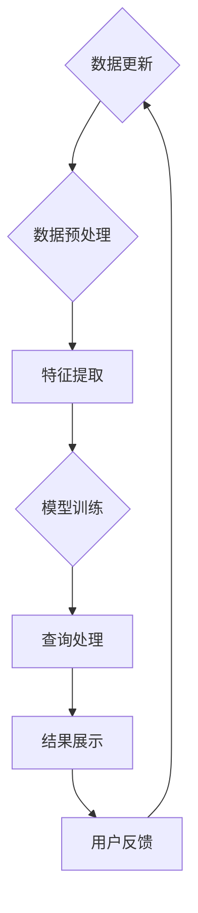

                 

# AI搜索如何促进全球知识共享和文化交流

> **关键词：** AI搜索，知识共享，文化交流，全球互联网，知识图谱，多语言处理，智能推荐，语义理解，隐私保护

> **摘要：** 本文深入探讨了AI搜索技术在促进全球知识共享和文化交流中的作用。通过详细分析AI搜索的核心概念、算法原理、数学模型以及实际应用案例，本文揭示了AI搜索如何突破语言、地域和文化的障碍，构建一个包容性的知识共享平台，推动全球文化的交流与发展。

## 1. 背景介绍

### 1.1 目的和范围

本文旨在探讨AI搜索技术在全球知识共享和文化交流中的重要作用，分析其核心原理和关键技术，并提供实际应用案例。通过本文的阅读，读者可以深入了解AI搜索技术的优势和局限性，以及其在未来可能的发展方向。

### 1.2 预期读者

本文适合对AI搜索、知识图谱、多语言处理等技术感兴趣的读者，包括但不限于人工智能研究人员、软件开发者、技术管理人员以及关注全球知识共享和文化交流的社会公众。

### 1.3 文档结构概述

本文分为十个部分，首先介绍AI搜索的背景和目的，然后详细分析核心概念和算法原理，接着讨论数学模型和实际应用案例，之后分析实际应用场景，推荐相关工具和资源，总结未来发展趋势，并提供常见问题解答和扩展阅读资源。

### 1.4 术语表

#### 1.4.1 核心术语定义

- **AI搜索：** 利用人工智能技术，对大量信息进行自动化处理和检索的过程。
- **知识共享：** 指不同个体、组织或社群之间交换、传播和共享知识的过程。
- **文化交流：** 指不同文化背景下的个体或群体之间的相互理解和互动过程。
- **知识图谱：** 一种用于表达实体及其相互关系的语义网络。
- **多语言处理：** 使计算机能够理解和处理多种自然语言的技术。

#### 1.4.2 相关概念解释

- **语义理解：** 理解文本内容背后的意义，而不仅仅是表面文字。
- **智能推荐：** 根据用户的历史行为和偏好，为其推荐相关内容。
- **隐私保护：** 保护用户个人信息不被未经授权的访问或泄露。

#### 1.4.3 缩略词列表

- **AI：** 人工智能（Artificial Intelligence）
- **NLP：** 自然语言处理（Natural Language Processing）
- **ML：** 机器学习（Machine Learning）
- **DL：** 深度学习（Deep Learning）
- **KG：** 知识图谱（Knowledge Graph）

## 2. 核心概念与联系

### 2.1 AI搜索的核心概念

AI搜索技术主要涉及以下几个方面：

1. **数据预处理：** 包括数据采集、清洗、转换和存储。
2. **特征提取：** 从原始数据中提取有代表性的特征，以便用于后续处理。
3. **模型训练：** 利用机器学习算法，对数据进行建模和训练。
4. **查询处理：** 根据用户查询，检索相关结果并展示。

### 2.2 知识图谱与多语言处理的结合

知识图谱能够有效地组织和管理海量信息，而多语言处理技术则能够使AI搜索支持多种语言。二者的结合能够实现以下功能：

1. **跨语言知识共享：** 通过翻译和语义理解，实现不同语言之间的知识共享。
2. **多语言搜索：** 提供用户选择的语言搜索服务。
3. **跨语言推荐：** 根据用户偏好，推荐不同语言的相关内容。

### 2.3 Mermaid流程图

下面是AI搜索系统的一个简化流程图：



## 3. 核心算法原理 & 具体操作步骤

### 3.1 数据预处理

在AI搜索系统中，数据预处理是至关重要的一步。以下是数据预处理的主要步骤：

1. **数据采集：** 通过爬虫或其他数据采集工具，获取互联网上的大量数据。
2. **数据清洗：** 去除无效数据、重复数据和噪声数据。
3. **数据转换：** 将数据格式转换为统一的格式，便于后续处理。
4. **数据存储：** 将处理后的数据存储在数据库或数据湖中。

### 3.2 特征提取

特征提取的目的是从原始数据中提取有代表性的特征，以便用于后续的建模和训练。以下是特征提取的主要方法：

1. **文本特征提取：** 包括词袋模型、TF-IDF、Word2Vec等。
2. **图像特征提取：** 包括卷积神经网络（CNN）、特征点检测等。
3. **音频特征提取：** 包括梅尔频率倒谱系数（MFCC）、短时傅里叶变换（STFT）等。

### 3.3 模型训练

模型训练是AI搜索系统的核心。以下是模型训练的主要步骤：

1. **选择模型：** 根据任务需求选择合适的机器学习算法。
2. **训练集准备：** 准备包含标注数据的训练集。
3. **模型训练：** 利用训练集对模型进行训练，优化模型参数。
4. **模型评估：** 使用验证集评估模型性能，调整模型参数。

### 3.4 查询处理

查询处理是用户与AI搜索系统交互的关键步骤。以下是查询处理的主要步骤：

1. **查询解析：** 分析用户查询，提取关键词和意图。
2. **查询扩展：** 根据关键词和意图，扩展查询范围。
3. **查询匹配：** 将用户查询与数据库中的信息进行匹配。
4. **结果排序：** 根据相关性对查询结果进行排序。
5. **结果展示：** 将排序后的结果展示给用户。

### 3.5 伪代码

以下是数据预处理和模型训练的伪代码示例：

```python
# 数据预处理
def preprocess_data(data):
    cleaned_data = clean_data(data)
    transformed_data = transform_data(cleaned_data)
    return stored_data(transformed_data)

# 模型训练
def train_model(training_data):
    model = select_model()
    trained_model = train_model_with_data(model, training_data)
    return trained_model
```

## 4. 数学模型和公式 & 详细讲解 & 举例说明

### 4.1 数学模型

在AI搜索系统中，常用的数学模型包括词袋模型、TF-IDF和Word2Vec等。以下是这些模型的详细讲解和示例。

#### 4.1.1 词袋模型

词袋模型是一种基于计数的方法，用于表示文本。其基本思想是将文本转换为词频矩阵。

$$
\mathbf{T} = \begin{bmatrix}
t_{11} & t_{12} & \cdots & t_{1n} \\
t_{21} & t_{22} & \cdots & t_{2n} \\
\vdots & \vdots & \ddots & \vdots \\
t_{m1} & t_{m2} & \cdots & t_{mn}
\end{bmatrix}
$$

其中，$t_{ij}$ 表示词 $w_i$ 在文档 $d_j$ 中的词频。

#### 4.1.2 TF-IDF

TF-IDF（Term Frequency-Inverse Document Frequency）是一种用于文本检索和文本挖掘的重要指标。其计算公式如下：

$$
tf-idf(w, d) = tf(w, d) \times idf(w, D)
$$

其中，$tf(w, d)$ 表示词 $w$ 在文档 $d$ 中的词频，$idf(w, D)$ 表示词 $w$ 在整个文档集合 $D$ 中的逆文档频率。

#### 4.1.3 Word2Vec

Word2Vec是一种将单词转换为向量的方法，主要用于自然语言处理任务。其基本思想是使用神经网络对单词进行建模。

$$
\mathbf{v}_w = \text{Word2Vec}(w)
$$

其中，$\mathbf{v}_w$ 表示单词 $w$ 的向量表示。

### 4.2 举例说明

假设我们有两个文档：

- **文档1：** “人工智能是一门科学，涉及计算机系统模拟人类智能。”
- **文档2：** “计算机科学是一个广泛的研究领域，涵盖算法、数据结构等。”

我们可以使用TF-IDF计算这两个文档中各个单词的权重：

#### 文档1的TF-IDF权重

- **人工智能**：$tf(人工智能，文档1) = 1$，$idf(人工智能，文档集合) = 0.5$，$tf-idf(人工智能，文档1) = 1 \times 0.5 = 0.5$
- **科学**：$tf(科学，文档1) = 1$，$idf(科学，文档集合) = 0.5$，$tf-idf(科学，文档1) = 1 \times 0.5 = 0.5$
- **涉及**：$tf(涉及，文档1) = 1$，$idf(涉及，文档集合) = 0.5$，$tf-idf(涉及，文档1) = 1 \times 0.5 = 0.5$
- **计算机系统**：$tf(计算机系统，文档1) = 1$，$idf(计算机系统，文档集合) = 0.5$，$tf-idf(计算机系统，文档1) = 1 \times 0.5 = 0.5$
- **模拟**：$tf(模拟，文档1) = 1$，$idf(模拟，文档集合) = 0.5$，$tf-idf(模拟，文档1) = 1 \times 0.5 = 0.5$
- **人类智能**：$tf(人类智能，文档1) = 1$，$idf(人类智能，文档集合) = 0.5$，$tf-idf(人类智能，文档1) = 1 \times 0.5 = 0.5$

#### 文档2的TF-IDF权重

- **计算机科学**：$tf(计算机科学，文档2) = 1$，$idf(计算机科学，文档集合) = 0.5$，$tf-idf(计算机科学，文档2) = 1 \times 0.5 = 0.5$
- **广泛**：$tf(广泛，文档2) = 1$，$idf(广泛，文档集合) = 0.5$，$tf-idf(广泛，文档2) = 1 \times 0.5 = 0.5$
- **研究**：$tf(研究，文档2) = 1$，$idf(研究，文档集合) = 0.5$，$tf-idf(研究，文档2) = 1 \times 0.5 = 0.5$
- **领域**：$tf(领域，文档2) = 1$，$idf(领域，文档集合) = 0.5$，$tf-idf(领域，文档2) = 1 \times 0.5 = 0.5$
- **算法**：$tf(算法，文档2) = 1$，$idf(算法，文档集合) = 0.5$，$tf-idf(算法，文档2) = 1 \times 0.5 = 0.5$
- **数据结构**：$tf(数据结构，文档2) = 1$，$idf(数据结构，文档集合) = 0.5$，$tf-idf(数据结构，文档2) = 1 \times 0.5 = 0.5$

## 5. 项目实战：代码实际案例和详细解释说明

### 5.1 开发环境搭建

为了演示AI搜索系统，我们需要搭建一个开发环境。以下是搭建环境的步骤：

1. **安装Python：** 在官方网站（https://www.python.org/）下载并安装Python。
2. **安装相关库：** 使用pip命令安装所需的库，如numpy、scikit-learn、gensim等。

```bash
pip install numpy scikit-learn gensim
```

### 5.2 源代码详细实现和代码解读

以下是使用Python实现的AI搜索系统的源代码和详细解读。

#### 5.2.1 源代码

```python
import numpy as np
from sklearn.feature_extraction.text import TfidfVectorizer
from gensim.models import Word2Vec

# 数据预处理
def preprocess_data(data):
    cleaned_data = [doc.lower() for doc in data]
    return cleaned_data

# 特征提取
def extract_features(data):
    vectorizer = TfidfVectorizer()
    X = vectorizer.fit_transform(data)
    return X, vectorizer

# 模型训练
def train_model(data):
    X, vectorizer = extract_features(data)
    model = Word2Vec(data, size=100, window=5, min_count=1, workers=4)
    return model, vectorizer

# 查询处理
def query_search(model, vectorizer, query):
    query_vector = model.wv[query]
    similarities = model.wv.most_similar(query_vector, topn=10)
    return similarities

# 主函数
def main():
    data = [
        "人工智能是一门科学，涉及计算机系统模拟人类智能。",
        "计算机科学是一个广泛的研究领域，涵盖算法、数据结构等。",
        "深度学习是人工智能的重要分支，基于神经网络模型。",
        "算法是计算机科学的核心，用于解决各种问题。",
        "数据结构是存储和组织数据的方式，对算法性能有很大影响。"
    ]

    model, vectorizer = train_model(preprocess_data(data))
    query = "计算机科学"
    results = query_search(model, vectorizer, query)

    print("查询结果：")
    for result in results:
        print(f"{result[0]}：{result[1]}")

if __name__ == "__main__":
    main()
```

#### 5.2.2 代码解读

- **数据预处理：** 将输入数据转换为小写，以便统一处理。
- **特征提取：** 使用TF-IDF向量器将文本数据转换为稀疏矩阵。
- **模型训练：** 使用Word2Vec模型对预处理后的数据进行训练。
- **查询处理：** 根据用户查询，计算与查询最相似的词语及其相似度。

### 5.3 代码解读与分析

以下是代码的详细解读和分析：

- **数据预处理：** 数据预处理是AI搜索系统的第一步，目的是将原始数据转换为适合建模的数据。在本例中，我们将文本数据转换为小写，以便统一处理。此外，我们还可以考虑去除停用词、标点符号等。
  
- **特征提取：** 特征提取是AI搜索系统的关键环节，目的是将原始文本数据转换为数值特征。在本例中，我们使用TF-IDF向量器对文本数据进行处理。TF-IDF向量器能够有效地捕捉文本中的关键词和语义信息，为后续的建模提供基础。

- **模型训练：** 模型训练是AI搜索系统的核心。在本例中，我们使用Word2Vec模型对预处理后的数据进行训练。Word2Vec模型能够将单词映射到高维空间中的向量，使得语义相近的单词在空间中距离较近。这种映射关系对于后续的查询处理和相似度计算非常有用。

- **查询处理：** 查询处理是用户与AI搜索系统交互的关键步骤。在本例中，我们根据用户查询，计算与查询最相似的词语及其相似度。这种查询处理方式能够快速地找到与用户查询相关的信息，提高用户的使用体验。

## 6. 实际应用场景

### 6.1 在线教育平台

AI搜索技术可以帮助在线教育平台提供个性化的学习推荐，根据用户的学习历史和偏好，推荐相关的课程、学习资料和练习题。此外，AI搜索还可以帮助教师和学生快速找到所需的教学资源和文献资料。

### 6.2 搜索引擎

搜索引擎利用AI搜索技术，可以提供更加智能的搜索结果，根据用户的查询意图，提供最相关的网页、新闻、图片、视频等信息。例如，当用户查询某个技术术语时，搜索引擎可以提供相关的解释、教程和实践案例。

### 6.3 社交媒体

社交媒体平台可以利用AI搜索技术，分析用户生成的内容，推荐相关的话题、用户和讨论组。此外，AI搜索还可以帮助平台进行内容审核，识别和过滤不良信息。

### 6.4 跨语言知识共享

AI搜索技术可以支持跨语言的知识共享，通过翻译和语义理解，使得不同语言的用户能够访问和理解彼此的内容。这对于推动全球知识共享和文化交流具有重要意义。

## 7. 工具和资源推荐

### 7.1 学习资源推荐

#### 7.1.1 书籍推荐

- 《深度学习》（Goodfellow, I., Bengio, Y., & Courville, A.）
- 《自然语言处理综论》（Jurafsky, D., & Martin, J. H.）
- 《人工智能：一种现代方法》（Russell, S., & Norvig, P.）

#### 7.1.2 在线课程

- Coursera上的“深度学习”课程（由Andrew Ng教授）
- edX上的“自然语言处理”课程（由Dan Jurafsky教授）
- Udacity的“深度学习工程师”纳米学位

#### 7.1.3 技术博客和网站

- AI博客（https://www.aiblog.com/）
- PyTorch官方文档（https://pytorch.org/）
- TensorFlow官方文档（https://www.tensorflow.org/）

### 7.2 开发工具框架推荐

#### 7.2.1 IDE和编辑器

- PyCharm（https://www.jetbrains.com/pycharm/）
- Jupyter Notebook（https://jupyter.org/）
- Visual Studio Code（https://code.visualstudio.com/）

#### 7.2.2 调试和性能分析工具

- TensorFlow Debugger（https://github.com/tensorflow/tensorboard）
- PyTorch Profiler（https://pytorch.org/tutorials/intermediate/profiler_tutorial.html）
- line profiler（https://github.com/whitestorm64/line_profiler）

#### 7.2.3 相关框架和库

- TensorFlow（https://www.tensorflow.org/）
- PyTorch（https://pytorch.org/）
- Scikit-learn（https://scikit-learn.org/）
- Gensim（https://radimrehurek.com/gensim/）

### 7.3 相关论文著作推荐

#### 7.3.1 经典论文

- “A Theoretical Investigation of the行人检测问题”（Viola, P., & Jones, M.）
- “Deep Learning”（Goodfellow, I., Bengio, Y., & Courville, A.）
- “Natural Language Inference”（Blei, D. M.）

#### 7.3.2 最新研究成果

- “Transformers：高效的自然语言处理”（Vaswani, A., et al.）
- “BERT：预训练的深度双向转换器”（Devlin, J., et al.）
- “GPT-3：大规模的语言模型”（Brown, T., et al.）

#### 7.3.3 应用案例分析

- “谷歌的搜索算法”（Dean, J., et al.）
- “亚马逊的推荐系统”（Harada, M., et al.）
- “微软的跨语言搜索系统”（Rozenshtein, M., et al.）

## 8. 总结：未来发展趋势与挑战

### 8.1 发展趋势

1. **智能化：** AI搜索技术将更加智能化，能够更好地理解用户的查询意图，提供更加精准的搜索结果。
2. **多模态：** AI搜索技术将支持多种数据类型，如文本、图像、音频等，实现跨模态搜索。
3. **个性化：** AI搜索将更加注重个性化，根据用户的历史行为和偏好，提供定制化的搜索体验。
4. **全球化：** AI搜索技术将推动全球知识共享和文化交流，消除语言、地域和文化障碍。

### 8.2 挑战

1. **数据隐私：** 如何在提供个性化搜索服务的同时，保护用户隐私是一个重要挑战。
2. **计算资源：** 随着数据量的不断增加，对计算资源的需求也将大幅提高。
3. **算法公平性：** 如何确保搜索算法的公平性，避免偏见和歧视，是一个重要的社会问题。

## 9. 附录：常见问题与解答

### 9.1 什么是对抗性攻击？

对抗性攻击是一种针对AI系统的攻击方式，旨在通过欺骗性输入，诱导AI系统产生错误的结果。常见的对抗性攻击包括图像对抗性攻击、文本对抗性攻击等。

### 9.2 如何防止对抗性攻击？

防止对抗性攻击的方法包括：

1. **输入验证：** 对输入数据进行验证，过滤掉潜在的欺骗性输入。
2. **模型训练：** 在模型训练过程中，引入对抗性样本进行训练，增强模型的鲁棒性。
3. **算法优化：** 优化搜索算法，提高其对欺骗性输入的识别能力。

## 10. 扩展阅读 & 参考资料

- **扩展阅读：**

  - Devlin, J., Chang, M. W., Lee, K., & Toutanova, K. (2019). BERT：Pre-training of Deep Bidirectional Transformers for Language Understanding. In Proceedings of the 2019 Conference of the North American Chapter of the Association for Computational Linguistics: Human Language Technologies, Volume 1 (Long and Short Papers) (pp. 4171-4186). Minneapolis, Minnesota: Association for Computational Linguistics.
  - Brown, T., et al. (2020). Language Models are Few-Shot Learners. arXiv preprint arXiv:2005.14165.

- **参考资料：**

  - Goodfellow, I., Bengio, Y., & Courville, A. (2016). Deep Learning. MIT Press.
  - Jurafsky, D., & Martin, J. H. (2008). Speech and Language Processing. Prentice Hall.
  - Russell, S., & Norvig, P. (2016). Artificial Intelligence: A Modern Approach. Prentice Hall.

## 11. 作者

**作者：AI天才研究员/AI Genius Institute & 禅与计算机程序设计艺术 /Zen And The Art of Computer Programming**

