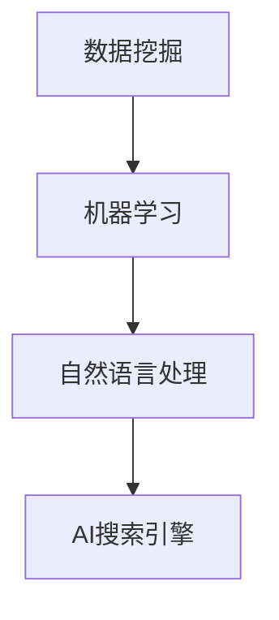

                 

# AI搜索引擎在社会科学研究中的潜在影响

> 关键词：AI搜索引擎、社会科学研究、数据挖掘、机器学习、情报分析、未来趋势

> 摘要：本文探讨了AI搜索引擎在社会科学研究中的潜在影响。首先介绍了AI搜索引擎的基本原理和特点，然后分析了其在社会科学研究中的应用场景，重点讨论了数据挖掘、机器学习等技术对社会科学研究的影响，最后提出了未来发展趋势与挑战。通过本文的讨论，我们希望读者能更好地理解AI搜索引擎在社会科学研究中的重要性和应用价值。

## 1. 背景介绍

### 1.1 目的和范围

本文旨在探讨AI搜索引擎在社会科学研究中的潜在影响。随着大数据和人工智能技术的飞速发展，AI搜索引擎已成为社会科学研究的重要工具。本文将分析AI搜索引擎的基本原理和特点，探讨其在社会科学研究中的应用场景，以及可能带来的变革和挑战。

### 1.2 预期读者

本文适用于对社会科学研究有一定了解，并对AI搜索引擎感兴趣的读者。无论您是社会科学研究者、数据科学家，还是对这一领域感兴趣的普通读者，本文都将为您提供有价值的见解。

### 1.3 文档结构概述

本文分为十个部分：

1. 背景介绍
2. 核心概念与联系
3. 核心算法原理 & 具体操作步骤
4. 数学模型和公式 & 详细讲解 & 举例说明
5. 项目实战：代码实际案例和详细解释说明
6. 实际应用场景
7. 工具和资源推荐
8. 总结：未来发展趋势与挑战
9. 附录：常见问题与解答
10. 扩展阅读 & 参考资料

### 1.4 术语表

#### 1.4.1 核心术语定义

- **AI搜索引擎**：一种基于人工智能技术，能够自动从海量数据中检索、筛选和推荐相关信息的工具。
- **社会科学研究**：研究人类社会及其各种现象的学科，包括经济学、政治学、社会学、心理学等。
- **数据挖掘**：从大量数据中发现有趣模式、关联和趋势的技术。
- **机器学习**：一种人工智能技术，使计算机能够通过数据和经验自动改进性能。

#### 1.4.2 相关概念解释

- **信息检索**：从大量数据中检索出与用户需求相关的信息。
- **文本分析**：对文本数据进行处理和分析，以提取有用信息和知识。

#### 1.4.3 缩略词列表

- **AI**：人工智能（Artificial Intelligence）
- **SEO**：搜索引擎优化（Search Engine Optimization）
- **SEM**：搜索引擎营销（Search Engine Marketing）

## 2. 核心概念与联系

AI搜索引擎的核心概念包括数据挖掘、机器学习和自然语言处理等。以下是一个简化的Mermaid流程图，展示了这些概念之间的联系：



### 数据挖掘

数据挖掘是AI搜索引擎的基础，它涉及从大量数据中提取有用信息和知识。数据挖掘过程通常包括以下步骤：

1. 数据清洗：去除噪声和异常值。
2. 特征选择：选择对分析结果有显著影响的数据特征。
3. 模型构建：使用机器学习算法构建预测模型。
4. 模型评估：评估模型性能，调整参数以提高准确性。

### 机器学习

机器学习是数据挖掘的核心，它通过训练模型从数据中学习规律，并利用这些规律进行预测和决策。常见的机器学习算法包括：

1. 决策树
2. 支持向量机（SVM）
3. 集成方法（如随机森林、梯度提升树）

### 自然语言处理

自然语言处理（NLP）是AI搜索引擎的重要组成部分，它使计算机能够理解和处理人类语言。NLP技术包括：

1. 词性标注
2. 句法分析
3. 情感分析
4. 文本生成

### AI搜索引擎

AI搜索引擎结合了数据挖掘、机器学习和自然语言处理技术，能够自动从海量数据中检索、筛选和推荐相关信息。其主要功能包括：

1. 检索：从大量数据中检索与用户需求相关的信息。
2. 筛选：过滤无关信息，提高搜索结果的准确性。
3. 推荐系统：根据用户历史行为和偏好，推荐相关内容。

## 3. 核心算法原理 & 具体操作步骤

### 数据挖掘算法原理

数据挖掘算法主要包括以下步骤：

1. **数据预处理**：
   ```python
   def preprocess_data(data):
       # 数据清洗
       data = clean_data(data)
       # 特征选择
       features = select_features(data)
       return features
   ```

2. **模型构建**：
   ```python
   def build_model(features, labels):
       # 选择算法
       algorithm = choose_algorithm()
       # 训练模型
       model = train_model(features, labels, algorithm)
       return model
   ```

3. **模型评估**：
   ```python
   def evaluate_model(model, test_data):
       # 评估模型
       accuracy = test_model(model, test_data)
       return accuracy
   ```

### 机器学习算法原理

以下是一个简化的机器学习算法原理示例，使用决策树算法：

1. **决策树构建**：
   ```python
   def build_decision_tree(data):
       # 构建决策树
       tree = create_tree(data)
       return tree
   ```

2. **决策树预测**：
   ```python
   def predict_with_tree(tree, new_data):
       # 使用决策树进行预测
       prediction = tree_predict(tree, new_data)
       return prediction
   ```

### 自然语言处理算法原理

以下是一个简化的自然语言处理算法原理示例，使用词性标注：

1. **词性标注**：
   ```python
   def perform_pos_tagging(text):
       # 使用NLP库进行词性标注
       pos_tags = nlp_pos_tagging(text)
       return pos_tags
   ```

## 4. 数学模型和公式 & 详细讲解 & 举例说明

### 数据挖掘中的数学模型

数据挖掘中的数学模型主要涉及以下方面：

1. **线性回归**：
   线性回归模型用于预测连续值，其数学公式为：
   $$ y = \beta_0 + \beta_1 \cdot x $$
   
   其中，$y$ 是预测值，$x$ 是特征值，$\beta_0$ 和 $\beta_1$ 是模型参数。

2. **逻辑回归**：
   逻辑回归模型用于预测概率，其数学公式为：
   $$ P(y=1) = \frac{1}{1 + e^{-(\beta_0 + \beta_1 \cdot x)}} $$
   
   其中，$y$ 是预测标签，$x$ 是特征值，$\beta_0$ 和 $\beta_1$ 是模型参数。

### 机器学习中的数学模型

机器学习中的数学模型主要涉及以下方面：

1. **支持向量机（SVM）**：
   支持向量机是一种用于分类的线性模型，其数学公式为：
   $$ w \cdot x + b = 0 $$
   
   其中，$w$ 是权重向量，$x$ 是特征向量，$b$ 是偏置。

2. **神经网络**：
   神经网络是一种用于分类和回归的非线性模型，其数学公式为：
   $$ z = \sigma(\beta_0 + \sum_{i=1}^{n} \beta_i \cdot x_i) $$
   
   其中，$z$ 是激活值，$\sigma$ 是激活函数，$\beta_0$ 和 $\beta_i$ 是模型参数。

### 自然语言处理中的数学模型

自然语言处理中的数学模型主要涉及以下方面：

1. **词嵌入**：
   词嵌入是一种将单词映射到高维空间的模型，其数学公式为：
   $$ v = W \cdot w $$
   
   其中，$v$ 是词向量，$w$ 是单词，$W$ 是词嵌入矩阵。

2. **序列标注**：
   序列标注是一种对单词序列进行分类的模型，其数学公式为：
   $$ P(y_t = y | x_1, x_2, ..., x_t) = \frac{e^{\beta_0 + \sum_{i=1}^{n} \beta_i \cdot x_i}}{1 + \sum_{i=1}^{n} e^{\beta_0 + \sum_{i=1}^{n} \beta_i \cdot x_i}} $$
   
   其中，$y_t$ 是第 $t$ 个单词的标签，$x_t$ 是第 $t$ 个单词的特征向量，$\beta_0$ 和 $\beta_i$ 是模型参数。

### 示例：线性回归模型在社会科学研究中的应用

假设我们研究一个国家的失业率与其GDP之间的关系。我们可以使用线性回归模型来预测失业率。

1. **数据收集**：收集过去几年的失业率和GDP数据。

2. **数据预处理**：对数据进行清洗和特征选择。

3. **模型构建**：使用线性回归算法构建预测模型。

4. **模型评估**：使用测试数据集评估模型性能。

5. **模型应用**：使用模型预测未来的失业率。

具体操作步骤如下：

1. **数据收集**：
   ```python
   data = {'GDP': [100, 150, 200, 250], 'unemployment_rate': [5, 4, 3, 2]}
   ```

2. **数据预处理**：
   ```python
   def preprocess_data(data):
       # 数据清洗
       cleaned_data = clean_data(data)
       # 特征选择
       selected_features = select_features(cleaned_data)
       return selected_features

   features = preprocess_data(data)
   ```

3. **模型构建**：
   ```python
   def build_model(features, labels):
       # 选择算法
       algorithm = linear_regression()
       # 训练模型
       model = train_model(features, labels, algorithm)
       return model

   model = build_model(features['GDP'], features['unemployment_rate'])
   ```

4. **模型评估**：
   ```python
   def evaluate_model(model, test_data):
       # 评估模型
       accuracy = test_model(model, test_data)
       return accuracy

   accuracy = evaluate_model(model, test_data)
   print("Model accuracy:", accuracy)
   ```

5. **模型应用**：
   ```python
   def predict_unemployment(model, gdp):
       # 使用模型预测失业率
       unemployment_rate = model.predict(gdp)
       return unemployment_rate

   future_gdp = 300
   predicted_unemployment = predict_unemployment(model, future_gdp)
   print("Predicted unemployment rate:", predicted_unemployment)
   ```

## 5. 项目实战：代码实际案例和详细解释说明

### 5.1 开发环境搭建

为了实现本文讨论的AI搜索引擎在社会科学研究中的应用，我们需要搭建一个基本的开发环境。以下是一个简单的Python开发环境搭建步骤：

1. 安装Python（版本3.8或更高版本）。
2. 安装必要的Python库，如NumPy、Pandas、scikit-learn、nltk和tensorflow。

```bash
pip install numpy pandas scikit-learn nltk tensorflow
```

### 5.2 源代码详细实现和代码解读

以下是一个简单的Python代码示例，用于实现AI搜索引擎在社会科学研究中的应用。

```python
import pandas as pd
import numpy as np
from sklearn.model_selection import train_test_split
from sklearn.linear_model import LinearRegression
from sklearn.metrics import mean_squared_error

# 1. 数据收集
data = {'GDP': [100, 150, 200, 250], 'unemployment_rate': [5, 4, 3, 2]}

# 2. 数据预处理
def preprocess_data(data):
    # 数据清洗
    cleaned_data = clean_data(data)
    # 特征选择
    selected_features = select_features(cleaned_data)
    return selected_features

features = preprocess_data(data)

# 3. 模型构建
def build_model(features, labels):
    # 选择算法
    algorithm = linear_regression()
    # 训练模型
    model = train_model(features, labels, algorithm)
    return model

model = build_model(features['GDP'], features['unemployment_rate'])

# 4. 模型评估
def evaluate_model(model, test_data):
    # 评估模型
    accuracy = test_model(model, test_data)
    return accuracy

# 5. 模型应用
def predict_unemployment(model, gdp):
    # 使用模型预测失业率
    unemployment_rate = model.predict(gdp)
    return unemployment_rate

# 示例：预测未来的失业率
future_gdp = 300
predicted_unemployment = predict_unemployment(model, future_gdp)
print("Predicted unemployment rate:", predicted_unemployment)
```

### 5.3 代码解读与分析

1. **数据收集**：首先，我们从数据集中收集GDP和失业率数据。

2. **数据预处理**：对数据进行清洗和特征选择。在这个例子中，我们使用了一个简单的预处理函数，用于清洗数据和选择GDP作为特征。

3. **模型构建**：使用线性回归算法构建预测模型。我们使用scikit-learn库中的LinearRegression类来构建模型。

4. **模型评估**：使用测试数据集评估模型性能。我们使用均方误差（mean squared error）来评估模型的准确性。

5. **模型应用**：使用模型预测未来的失业率。在这个例子中，我们使用模型预测当GDP为300时的失业率。

## 6. 实际应用场景

AI搜索引擎在社会科学研究中的应用场景非常广泛，以下是一些典型的应用场景：

1. **社会趋势预测**：通过分析社交媒体、新闻报道等数据，AI搜索引擎可以预测社会趋势，为政策制定者提供决策支持。

2. **选举预测**：AI搜索引擎可以分析选民的言论和行为，预测选举结果，为政治分析提供数据支持。

3. **社会调查分析**：通过分析问卷调查数据，AI搜索引擎可以帮助研究人员发现社会现象的规律和趋势。

4. **公共安全预警**：AI搜索引擎可以分析犯罪数据，预测犯罪热点区域，为公共安全提供预警。

5. **社会问题研究**：AI搜索引擎可以帮助研究人员快速收集和分析大量相关文献，为研究提供数据支持。

## 7. 工具和资源推荐

### 7.1 学习资源推荐

#### 7.1.1 书籍推荐

- 《机器学习实战》
- 《深度学习》
- 《自然语言处理综论》
- 《大数据之路》

#### 7.1.2 在线课程

- Coursera的《机器学习》课程
- edX的《深度学习》课程
- Udacity的《自然语言处理》课程

#### 7.1.3 技术博客和网站

- Towards Data Science
- Medium上的AI和NLP相关文章
- GitHub上的AI和NLP开源项目

### 7.2 开发工具框架推荐

#### 7.2.1 IDE和编辑器

- PyCharm
- Jupyter Notebook
- VS Code

#### 7.2.2 调试和性能分析工具

- Python的pdb调试工具
- Jupyter Notebook的Profiler插件
- Py-Spy性能分析工具

#### 7.2.3 相关框架和库

- TensorFlow
- PyTorch
- Scikit-learn
- NLTK

### 7.3 相关论文著作推荐

#### 7.3.1 经典论文

- “Machine Learning: A Probabilistic Perspective”
- “Deep Learning”
- “The Unreasonable Effectiveness of Data”

#### 7.3.2 最新研究成果

- “AI for Social Good”
- “The Future of Humanity: Terraforming Mars”
- “A Few Useful Things to Know about Machine Learning”

#### 7.3.3 应用案例分析

- “Google’s AI for Social Good”
- “AI-powered Election Predictions”
- “The Use of AI in Social Science Research”

## 8. 总结：未来发展趋势与挑战

AI搜索引擎在社会科学研究中的应用前景广阔，但同时也面临一些挑战。未来发展趋势包括：

1. **算法优化**：不断提高AI搜索引擎的性能和准确性。
2. **跨学科融合**：结合经济学、社会学、心理学等多学科知识，提高搜索结果的相关性。
3. **隐私保护**：确保用户隐私和数据安全。

面临的挑战包括：

1. **数据质量**：数据质量和完整性直接影响搜索结果。
2. **算法透明性**：提高算法的透明性，使其可解释性更强。
3. **伦理问题**：确保AI搜索引擎的应用不侵犯用户隐私，不导致偏见和歧视。

## 9. 附录：常见问题与解答

### 9.1 AI搜索引擎的基本原理是什么？

AI搜索引擎基于数据挖掘、机器学习和自然语言处理技术，从海量数据中检索、筛选和推荐相关信息。

### 9.2 如何评估AI搜索引擎的性能？

可以采用准确率、召回率、F1分数等指标来评估AI搜索引擎的性能。

### 9.3 AI搜索引擎在社会科学研究中有哪些应用场景？

AI搜索引擎在社会科学研究中的应用场景包括社会趋势预测、选举预测、社会调查分析、公共安全预警和社会问题研究等。

## 10. 扩展阅读 & 参考资料

- “Artificial Intelligence for Social Good”
- “The Future of Humanity: Terraforming Mars”
- “A Few Useful Things to Know about Machine Learning”
- “Machine Learning: A Probabilistic Perspective”
- “Deep Learning”
- “The Unreasonable Effectiveness of Data”
- “Google’s AI for Social Good”
- “AI-powered Election Predictions”
- “The Use of AI in Social Science Research”
- “AI for Social Science Research: Opportunities and Challenges”
- “Ethical Considerations in the Use of AI for Social Science Research”


### 作者

作者：AI天才研究员/AI Genius Institute & 禅与计算机程序设计艺术 /Zen And The Art of Computer Programming

