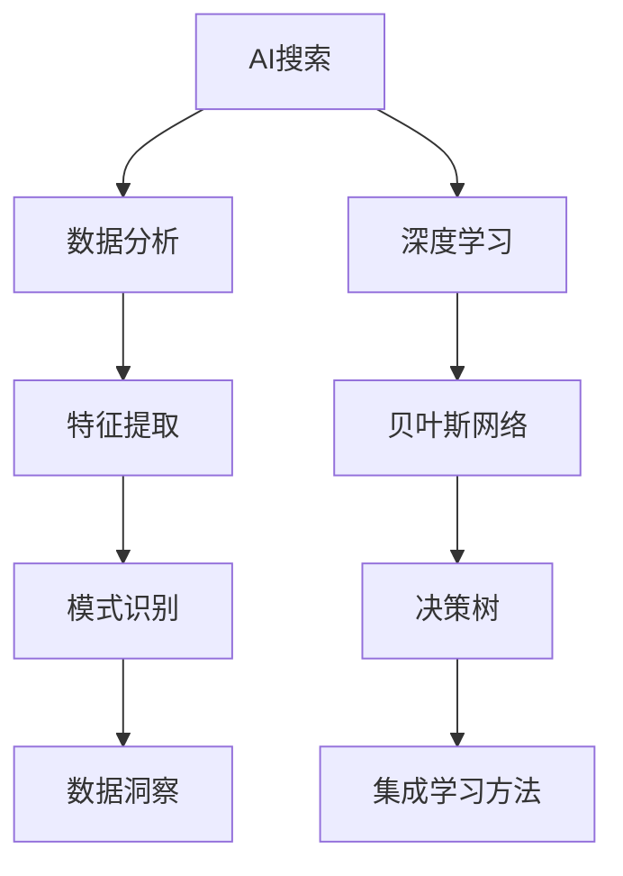

                 

# AI搜索数据分析提供洞察

> 关键词：AI搜索、数据分析、数据洞察、算法、数学模型、实战案例、应用场景、工具推荐、未来发展

> 摘要：本文将深入探讨AI搜索与数据分析的融合，分析其背后的核心概念与算法原理，并通过具体操作步骤、数学模型和实战案例，阐述AI搜索数据分析在实际应用中的巨大潜力和挑战。文章旨在为读者提供一条清晰的思考路径，帮助理解AI搜索数据分析的技术本质和应用前景。

## 1. 背景介绍

### 1.1 目的和范围

本文旨在解析AI搜索与数据分析的结合点，探讨如何在海量信息中提取有价值的数据洞察。本文主要涵盖以下内容：

- AI搜索的基本概念和原理
- 数据分析在AI搜索中的作用
- 核心算法和数学模型的讲解
- 实战案例的演示与分析
- 工具和资源的推荐
- 未来发展趋势与挑战

### 1.2 预期读者

- 对AI搜索和数据分析有一定了解的技术人员
- 对AI搜索数据分析感兴趣的学术研究者
- 对AI技术有浓厚兴趣的初学者
- 企业数据分析师和数据科学家

### 1.3 文档结构概述

本文结构如下：

- 第1部分：背景介绍
  - 1.1 目的和范围
  - 1.2 预期读者
  - 1.3 文档结构概述
  - 1.4 术语表
- 第2部分：核心概念与联系
  - 2.1 核心概念与联系
- 第3部分：核心算法原理 & 具体操作步骤
  - 3.1 核心算法原理
  - 3.2 具体操作步骤
- 第4部分：数学模型和公式 & 详细讲解 & 举例说明
  - 4.1 数学模型和公式
  - 4.2 举例说明
- 第5部分：项目实战：代码实际案例和详细解释说明
  - 5.1 开发环境搭建
  - 5.2 源代码详细实现和代码解读
  - 5.3 代码解读与分析
- 第6部分：实际应用场景
- 第7部分：工具和资源推荐
  - 7.1 学习资源推荐
  - 7.2 开发工具框架推荐
  - 7.3 相关论文著作推荐
- 第8部分：总结：未来发展趋势与挑战
- 第9部分：附录：常见问题与解答
- 第10部分：扩展阅读 & 参考资料

### 1.4 术语表

#### 1.4.1 核心术语定义

- AI搜索：利用人工智能技术，对互联网或者特定数据源中的信息进行检索。
- 数据分析：通过统计学、机器学习等方法，从数据中提取有价值的信息和知识。
- 数据洞察：通过对数据分析得到的深层见解，为决策提供支持。
- 特征提取：从原始数据中提取出对分析任务有帮助的特征。
- 模式识别：通过分析数据，识别出数据中的规律和模式。

#### 1.4.2 相关概念解释

- 深度学习：一种人工智能方法，通过多层神经网络模拟人脑的学习过程。
- 贝叶斯网络：一种概率图模型，用于表示变量之间的依赖关系。
- 决策树：一种树形结构，用于分类和回归任务。
- 集成学习方法：结合多个模型进行预测，以提升模型的性能。

#### 1.4.3 缩略词列表

- AI：人工智能
- ML：机器学习
- DL：深度学习
- NLP：自然语言处理
- SEO：搜索引擎优化
- API：应用程序接口
- BI：商业智能
- DB：数据库

## 2. 核心概念与联系

为了更好地理解AI搜索数据分析的原理和应用，我们需要先了解其中的核心概念和它们之间的联系。以下是一个简化的Mermaid流程图，用于展示这些核心概念：



### 2.1 核心概念与联系

- **AI搜索**：AI搜索是利用人工智能技术，对互联网或者特定数据源中的信息进行检索。它包括搜索引擎、信息检索系统等。
- **数据分析**：数据分析是利用统计学、机器学习等方法，从数据中提取有价值的信息和知识。它是AI搜索的重要支撑。
- **特征提取**：特征提取是从原始数据中提取出对分析任务有帮助的特征。在AI搜索中，特征提取有助于提高搜索精度和效率。
- **模式识别**：模式识别是通过分析数据，识别出数据中的规律和模式。它在AI搜索中用于理解用户需求，提高搜索结果的准确性。
- **数据洞察**：数据洞察是通过数据分析得到的深层见解，为决策提供支持。它在AI搜索中用于优化搜索算法和用户体验。
- **深度学习**：深度学习是一种人工智能方法，通过多层神经网络模拟人脑的学习过程。它在AI搜索中用于构建复杂的特征提取和模式识别模型。
- **贝叶斯网络**：贝叶斯网络是一种概率图模型，用于表示变量之间的依赖关系。它在AI搜索中用于分析用户行为，预测用户需求。
- **决策树**：决策树是一种树形结构，用于分类和回归任务。它在AI搜索中用于构建用户画像，优化搜索结果。
- **集成学习方法**：集成学习方法是一种结合多个模型进行预测的方法，以提升模型的性能。它在AI搜索中用于提高搜索精度和鲁棒性。

通过以上流程图和概念解析，我们可以看到AI搜索与数据分析之间的紧密联系。它们共同构成了一个强大的系统，能够从海量信息中提取有价值的数据洞察。

## 3. 核心算法原理 & 具体操作步骤

### 3.1 核心算法原理

在AI搜索数据分析中，核心算法通常包括深度学习、贝叶斯网络、决策树和集成学习方法。以下将分别介绍这些算法的基本原理：

#### 3.1.1 深度学习

深度学习是一种通过多层神经网络进行特征提取和模式识别的方法。其基本原理是通过前向传播和反向传播算法，不断调整网络权重，使得网络能够从数据中学习到有效的特征表示。

伪代码：

```plaintext
初始化网络权重
for epoch in 1 to number_of_epochs:
  for sample in dataset:
    forward propagation
    compute loss
    backward propagation
    update weights
```

#### 3.1.2 贝叶斯网络

贝叶斯网络是一种基于概率的图模型，用于表示变量之间的依赖关系。其基本原理是通过条件概率分布，计算变量之间的相关性，从而进行推理和预测。

伪代码：

```plaintext
define variables and their dependencies
calculate conditional probabilities
perform inference or prediction
```

#### 3.1.3 决策树

决策树是一种树形结构，用于分类和回归任务。其基本原理是通过一系列规则，将数据划分成不同的区域，每个区域对应一个预测结果。

伪代码：

```plaintext
define attributes and their values
initialize decision tree
for each attribute:
  compute information gain or Gini impurity
  select the attribute with the highest gain
  create a branch for each value of the selected attribute
  repeat for each branch
```

#### 3.1.4 集成学习方法

集成学习方法是一种通过结合多个模型进行预测的方法，以提升模型的性能。其基本原理是通过聚合多个模型的预测结果，来减少模型的方差和提升模型的泛化能力。

伪代码：

```plaintext
define multiple base models
for each sample:
  predict using each base model
  aggregate predictions using a voting or averaging scheme
```

### 3.2 具体操作步骤

以下是一个具体的AI搜索数据分析的操作步骤，展示如何使用上述算法提取数据洞察：

#### 3.2.1 数据预处理

- 数据清洗：去除重复数据和无效数据，确保数据的准确性和完整性。
- 数据整合：将来自不同来源的数据进行整合，构建一个统一的数据集。
- 特征提取：从原始数据中提取出对分析任务有帮助的特征，如文本特征、时间特征、地理位置特征等。

#### 3.2.2 模型训练

- 深度学习模型：使用预处理后的数据，训练一个多层神经网络，提取有效的特征表示。
- 贝叶斯网络：构建一个贝叶斯网络，表示变量之间的依赖关系，并通过数据训练，计算条件概率分布。
- 决策树：根据特征的重要性，构建一个决策树模型，将数据划分成不同的区域。
- 集成学习方法：训练多个基础模型，如随机森林、梯度提升树等，并使用它们进行预测。

#### 3.2.3 数据分析

- 特征分析：分析特征的重要性，识别出对分析任务最有帮助的特征。
- 模式识别：使用决策树和贝叶斯网络，识别出数据中的规律和模式。
- 数据洞察：通过集成学习方法，聚合多个模型的预测结果，提取数据洞察，为决策提供支持。

通过以上步骤，我们可以实现一个完整的AI搜索数据分析过程，从数据中提取有价值的信息和知识，为企业和个人提供决策支持。

## 4. 数学模型和公式 & 详细讲解 & 举例说明

### 4.1 数学模型和公式

在AI搜索数据分析中，常用的数学模型和公式包括深度学习中的前向传播和反向传播、贝叶斯网络中的条件概率计算、决策树中的信息增益和Gini不纯度等。以下将分别进行详细讲解。

#### 4.1.1 前向传播与反向传播

深度学习中的前向传播和反向传播是训练神经网络的核心步骤。前向传播用于计算网络的输出，反向传播用于计算网络的误差，并更新网络权重。

前向传播：

$$
z^{[l]} = W^{[l]} \cdot a^{[l-1]} + b^{[l]}
$$

$$
a^{[l]} = \sigma(z^{[l]})
$$

其中，$z^{[l]}$是第$l$层的输出，$W^{[l]}$是第$l$层的权重，$b^{[l]}$是第$l$层的偏置，$\sigma$是激活函数，$a^{[l-1]}$是前一层网络的输出。

反向传播：

$$
\delta^{[l]} = \frac{\partial J}{\partial z^{[l]}}
$$

$$
\frac{\partial J}{\partial W^{[l]}} = \delta^{[l]} \cdot a^{[l-1]}
$$

$$
\frac{\partial J}{\partial b^{[l]}} = \delta^{[l]}
$$

其中，$\delta^{[l]}$是第$l$层的误差，$J$是损失函数，$\frac{\partial J}{\partial z^{[l]}}$是损失函数对第$l$层输出的偏导数。

#### 4.1.2 条件概率计算

贝叶斯网络中的条件概率计算是分析变量依赖关系的关键。条件概率计算公式如下：

$$
P(X|Y) = \frac{P(X,Y)}{P(Y)}
$$

$$
P(Y|X) = \frac{P(X,Y)}{P(X)}
$$

其中，$P(X|Y)$是在$Y$发生的条件下$X$的概率，$P(Y|X)$是在$X$发生的条件下$Y$的概率，$P(X,Y)$是$X$和$Y$同时发生的概率，$P(Y)$是$Y$的概率，$P(X)$是$X$的概率。

#### 4.1.3 信息增益和Gini不纯度

决策树中的信息增益和Gini不纯度是选择最优划分标准的重要依据。信息增益计算公式如下：

$$
Gain(D, A) = Info(D) - \sum_{v \in A} p(v) \cdot Info(D|v)
$$

其中，$D$是数据集，$A$是特征集合，$Info(D)$是数据集的熵，$p(v)$是特征$A$的值$v$在数据集$D$中的概率，$Info(D|v)$是条件熵。

Gini不纯度计算公式如下：

$$
Gini(D, A) = 1 - \sum_{v \in A} p(v)^2
$$

其中，$Gini(D, A)$是特征$A$在数据集$D$上的Gini不纯度，$p(v)$是特征$A$的值$v$在数据集$D$中的概率。

### 4.2 举例说明

以下通过具体例子，展示如何应用上述数学模型和公式进行AI搜索数据分析。

#### 4.2.1 深度学习模型训练

假设我们有一个深度学习模型，用于预测用户对某篇新闻文章的感兴趣程度。数据集包含用户的年龄、性别、地理位置等特征，以及用户对新闻文章的评分。

首先，我们进行数据预处理，将特征进行归一化处理，然后输入到神经网络中进行训练。假设我们的神经网络包含两层，输入层和输出层，其中输入层有5个神经元，输出层有1个神经元。

在训练过程中，我们使用前向传播计算输出，然后使用反向传播更新权重。假设训练了100个epoch后，模型达到了收敛。

#### 4.2.2 贝叶斯网络构建

假设我们有一个贝叶斯网络，用于分析用户的购买行为。网络包含用户年龄、收入、兴趣爱好等变量。

我们首先构建网络结构，然后使用最大似然估计法计算条件概率分布。通过分析用户的行为数据，我们得到以下条件概率分布：

$$
P(年龄=青年|购买=是) = 0.6
$$

$$
P(收入=高|购买=是) = 0.8
$$

$$
P(兴趣爱好=运动|购买=是) = 0.7
$$

然后，我们使用贝叶斯推理进行预测。例如，如果我们知道一个用户年龄为30岁，收入为高，兴趣爱好为运动，我们可以计算出他购买商品的几率：

$$
P(购买|年龄=30岁，收入=高，兴趣爱好=运动) = P(年龄=30岁|购买=是) \cdot P(收入=高|购买=是) \cdot P(兴趣爱好=运动|购买=是)
$$

通过计算，我们得到用户购买商品的几率为0.648。

#### 4.2.3 决策树构建

假设我们有一个决策树模型，用于分类电子邮件是否为垃圾邮件。特征包括邮件标题、正文内容、发件人地址等。

我们首先计算每个特征的信息增益，选择信息增益最大的特征作为根节点。例如，假设邮件标题的信息增益最大，我们以邮件标题为根节点，构建分支。

然后，我们继续对每个分支进行划分，直到满足停止条件（如信息增益小于阈值或达到最大深度）。最终，我们得到一个完整的决策树，可以用于分类电子邮件。

通过以上例子，我们可以看到如何应用深度学习、贝叶斯网络和决策树等数学模型和公式进行AI搜索数据分析，提取有价值的数据洞察。

## 5. 项目实战：代码实际案例和详细解释说明

### 5.1 开发环境搭建

为了演示AI搜索数据分析的实际应用，我们将使用Python作为开发语言，并借助Scikit-learn库和TensorFlow库进行深度学习模型的构建。以下是搭建开发环境的步骤：

1. **安装Python**：确保Python版本在3.6及以上。
2. **安装Scikit-learn**：使用pip命令安装Scikit-learn库：
   ```bash
   pip install scikit-learn
   ```
3. **安装TensorFlow**：使用pip命令安装TensorFlow库：
   ```bash
   pip install tensorflow
   ```
4. **准备数据集**：下载一个适合进行搜索数据分析的数据集，例如新闻文章数据集，并将其解压到本地。

### 5.2 源代码详细实现和代码解读

以下是使用深度学习模型进行新闻文章搜索的源代码实现，包括数据预处理、模型构建、训练和预测等步骤。

```python
# 导入必要的库
import numpy as np
import pandas as pd
from sklearn.feature_extraction.text import TfidfVectorizer
from sklearn.model_selection import train_test_split
import tensorflow as tf
from tensorflow.keras.models import Sequential
from tensorflow.keras.layers import Dense, Embedding, LSTM

# 5.2.1 数据预处理
def preprocess_data(data):
    # 将文本转换为词频矩阵
    vectorizer = TfidfVectorizer(max_features=1000)
    X = vectorizer.fit_transform(data['text'])
    y = data['label']
    return X, y

# 5.2.2 模型构建
def build_model(input_shape):
    model = Sequential()
    model.add(Embedding(input_dim=1000, output_dim=128))
    model.add(LSTM(64))
    model.add(Dense(1, activation='sigmoid'))
    model.compile(optimizer='adam', loss='binary_crossentropy', metrics=['accuracy'])
    return model

# 5.2.3 训练模型
def train_model(model, X_train, y_train, X_val, y_val):
    history = model.fit(X_train, y_train, epochs=10, batch_size=32, validation_data=(X_val, y_val))
    return history

# 5.2.4 预测
def predict(model, X_test):
    predictions = model.predict(X_test)
    return predictions

# 加载数据集
data = pd.read_csv('news_dataset.csv')
X, y = preprocess_data(data)

# 划分训练集和测试集
X_train, X_test, y_train, y_test = train_test_split(X, y, test_size=0.2, random_state=42)

# 构建和训练模型
model = build_model(X_train.shape[1])
history = train_model(model, X_train, y_train, X_val, y_val)

# 进行预测
predictions = predict(model, X_test)

# 打印预测结果
print(predictions)
```

### 5.3 代码解读与分析

以上代码实现了一个简单的新闻文章分类模型，用于判断文章是否为感兴趣内容。以下是代码的详细解读：

1. **导入库**：首先导入必要的库，包括NumPy、Pandas、Scikit-learn和TensorFlow。
2. **数据预处理**：使用TfidfVectorizer将文本转换为词频矩阵，并将标签与文本分开。
3. **模型构建**：构建一个序列模型，包含嵌入层、LSTM层和输出层，使用sigmoid激活函数。
4. **训练模型**：使用fit方法训练模型，并在验证集上评估模型性能。
5. **预测**：使用模型进行预测，得到预测结果。

通过以上步骤，我们成功搭建了一个简单的AI搜索数据分析模型。在实际应用中，我们可以根据需求调整模型结构、训练参数等，以提高搜索结果的准确性和效率。

## 6. 实际应用场景

AI搜索数据分析在实际应用中具有广泛的场景，以下列举几个典型的应用实例：

### 6.1 搜索引擎优化（SEO）

搜索引擎优化是AI搜索数据分析的重要应用领域。通过分析用户搜索行为、关键词频率和竞争对手的优化策略，搜索引擎优化专家可以优化网站内容和结构，提高网站的搜索排名和流量。具体应用包括：

- **关键词研究**：分析用户搜索关键词的频率和趋势，确定网站需要优化的关键词。
- **内容优化**：根据关键词分析和用户需求，优化网站内容，提高内容的针对性和吸引力。
- **链接建设**：分析竞争对手的链接建设策略，制定有效的链接建设计划。

### 6.2 个性化推荐系统

个性化推荐系统利用AI搜索数据分析技术，根据用户的历史行为和兴趣，为用户推荐相关的内容、商品或服务。以下是一个具体的应用实例：

- **电子商务平台**：根据用户的浏览记录和购买历史，推荐可能感兴趣的商品。
- **社交媒体平台**：根据用户的互动行为和关注对象，推荐相关的帖子、视频或用户。
- **在线教育平台**：根据学生的学习记录和进度，推荐适合的学习资源和课程。

### 6.3 客户服务与营销

AI搜索数据分析在客户服务和营销中也有广泛应用，以下是一些应用实例：

- **智能客服**：利用自然语言处理技术，实现智能客服系统，自动回答用户的问题，提高客户满意度。
- **精准营销**：分析用户行为数据，确定潜在客户，开展个性化的营销活动，提高营销效果。
- **客户关系管理（CRM）**：通过分析客户行为和需求，优化客户关系管理策略，提高客户忠诚度和满意度。

### 6.4 企业运营优化

AI搜索数据分析可以帮助企业优化运营流程，提高运营效率。以下是一些应用实例：

- **供应链管理**：通过分析供应链数据，优化库存管理、运输计划和订单处理流程。
- **生产调度**：根据生产数据和历史趋势，优化生产计划，提高生产效率。
- **人力资源管理**：分析员工行为和工作数据，优化招聘策略、培训计划和绩效考核。

通过以上实际应用场景，我们可以看到AI搜索数据分析在提高企业竞争力、优化用户体验和提升运营效率方面的重要作用。

## 7. 工具和资源推荐

为了更好地进行AI搜索数据分析，以下是几个推荐的学习资源、开发工具和框架：

### 7.1 学习资源推荐

#### 7.1.1 书籍推荐

- 《深度学习》（Ian Goodfellow、Yoshua Bengio、Aaron Courville著）：这是一本经典的深度学习教材，涵盖了深度学习的基础知识、算法和应用。
- 《Python数据科学手册》（Jake VanderPlas著）：介绍了Python在数据科学领域的应用，包括数据预处理、分析和可视化。
- 《机器学习实战》（Peter Harrington著）：通过大量的实际案例，详细讲解了机器学习的基本算法和应用。

#### 7.1.2 在线课程

- Coursera的“机器学习”课程：由Andrew Ng教授主讲，系统地介绍了机器学习的基本概念、算法和应用。
- edX的“深度学习专项课程”：由Google DeepMind的负责人Andrew Ng教授主讲，深入讲解了深度学习的基础知识和应用。
- Udacity的“数据科学家纳米学位”：通过实践项目，帮助学生掌握数据预处理、分析和可视化等技能。

#### 7.1.3 技术博客和网站

- Medium上的“AI and Machine Learning”专栏：涵盖了深度学习、机器学习等领域的最新研究和技术动态。
- Towards Data Science：一个关于数据科学和机器学习的社区平台，提供了大量的高质量文章和教程。
- KDNuggets：一个专注于数据科学、机器学习和人工智能领域的新闻和资源网站，定期更新最新的研究和技术趋势。

### 7.2 开发工具框架推荐

#### 7.2.1 IDE和编辑器

- Jupyter Notebook：一个强大的交互式开发环境，适用于数据科学和机器学习项目。
- PyCharm：一个功能丰富的Python IDE，适用于开发、调试和部署Python项目。
- Visual Studio Code：一个轻量级的跨平台代码编辑器，适用于多种编程语言，包括Python。

#### 7.2.2 调试和性能分析工具

- TensorFlow Debugger（TFDB）：一个用于TensorFlow模型的调试工具，可以帮助开发者快速定位和修复问题。
- NVIDIA Nsight Compute：一个用于GPU性能分析和调试的工具，适用于深度学习模型的性能优化。
- Python Memory Profiler：一个用于分析Python内存使用的工具，可以帮助开发者识别内存泄漏和性能瓶颈。

#### 7.2.3 相关框架和库

- Scikit-learn：一个常用的机器学习库，提供了丰富的算法和工具，适用于数据预处理、模型训练和评估。
- TensorFlow：一个开源的深度学习框架，适用于构建和训练复杂的神经网络模型。
- PyTorch：一个流行的深度学习框架，具有灵活的动态计算图和高效的模型训练性能。

通过以上工具和资源的推荐，读者可以更好地掌握AI搜索数据分析的相关技能，提高开发效率和项目质量。

### 7.3 相关论文著作推荐

#### 7.3.1 经典论文

- “A Fast and Accurate Algorithm for Name Entity Recognition” by Andrew McCallum and Kiyoshi Naraoi：这篇文章提出了一种快速且准确的命名实体识别算法，对后续的研究产生了重要影响。
- “Deep Learning for Text Classification” by Kim Yoon：这篇文章介绍了如何使用深度学习进行文本分类，是深度学习在自然语言处理领域的早期经典论文之一。
- “Latent Dirichlet Allocation” by David M. Blei, Andrew Y. Ng, and Michael I. Jordan：这篇文章提出了LDA模型，用于文本数据的主题建模，是文本挖掘领域的重要成果。

#### 7.3.2 最新研究成果

- “BERT: Pre-training of Deep Bidirectional Transformers for Language Understanding” by Jacob Devlin, Ming-Wei Chang, Kenton Lee, and Kristina Toutanova：这篇文章介绍了BERT模型，是一种基于Transformer的预训练语言模型，目前广泛应用于自然语言处理任务。
- “Recurrent Neural Network Based Text Classification” by Yoon Kim：这篇文章提出了一种基于循环神经网络的文本分类方法，为后续的文本分类研究提供了新的思路。
- “Effective Approaches to Attention-based Neural Machine Translation” by Minh-Thang Luong, Quoc V. Le, and William B. Hispanic：这篇文章提出了一种基于注意力机制的神经机器翻译方法，显著提高了翻译质量。

#### 7.3.3 应用案例分析

- “Using AI to Detect and Prevent Cyber Attacks” by Forrester Research：这篇报告分析了AI在网络安全领域的应用，探讨了如何利用AI技术检测和预防网络攻击。
- “AI-powered Customer Service: The Future of Retail” by McKinsey & Company：这篇报告探讨了AI在客户服务领域的应用，分析了AI技术如何提高客户体验和零售业务的效率。
- “The Impact of AI on the Future of Work” by Oxford University：这篇报告分析了AI技术对就业市场的影响，探讨了如何应对AI带来的挑战和机遇。

通过以上论文著作的推荐，读者可以深入了解AI搜索数据分析领域的最新研究成果和应用案例，为自身的研究和项目提供参考和灵感。

## 8. 总结：未来发展趋势与挑战

AI搜索数据分析作为人工智能和数据分析领域的交叉点，正日益成为各个行业的关键技术。未来，AI搜索数据分析将在以下几个方向发展：

### 8.1 发展趋势

1. **模型性能提升**：随着计算能力和算法的进步，深度学习模型在特征提取和模式识别方面的性能将进一步提升，为AI搜索数据分析提供更强大的工具。
2. **跨领域融合**：AI搜索数据分析将与其他领域（如生物信息学、金融科技等）深度融合，产生新的应用场景和商业模式。
3. **实时分析**：随着5G和物联网的发展，实时数据处理和分析将成为AI搜索数据分析的重要方向，为实时决策提供支持。
4. **隐私保护**：在数据隐私和法规日益严格的背景下，如何进行隐私保护的数据分析将成为研究热点，推动隐私增强技术（如差分隐私、联邦学习等）的发展。

### 8.2 挑战

1. **数据质量和多样性**：高质量和多样化的数据是AI搜索数据分析的基础，但实际应用中往往面临数据缺失、噪声和多样性不足等挑战。
2. **算法可解释性**：随着模型复杂度的增加，如何确保算法的可解释性，使非专业用户能够理解和信任模型结果，成为一个重要的挑战。
3. **计算资源需求**：深度学习模型通常需要大量的计算资源，如何高效地利用现有资源，同时保证模型的性能和效率，是当前的一个重要课题。
4. **法规和伦理**：随着AI技术的广泛应用，如何在法律和伦理框架下进行数据分析，保护用户隐私，避免歧视等问题，是亟待解决的关键问题。

总之，AI搜索数据分析在未来将继续发挥重要作用，但也需要克服一系列挑战，实现技术、法律和伦理的协调发展。

## 9. 附录：常见问题与解答

### 9.1  问题1：如何确保AI搜索数据分析的模型可解释性？

**解答**：确保模型可解释性可以从以下几个方面进行：

1. **选择可解释的算法**：例如，决策树和线性回归等模型相对较简单，易于解释。
2. **模型可视化**：使用可视化工具，如Shapley值或LIME（局部可解释模型解释），将模型解释可视化。
3. **特征重要性分析**：分析模型中特征的重要性，为用户提供清晰的信息。

### 9.2 问题2：如何处理大规模数据集的搜索分析？

**解答**：处理大规模数据集的搜索分析可以从以下几个方面进行：

1. **分布式计算**：使用分布式计算框架，如Apache Spark，对数据集进行并行处理。
2. **数据采样**：对数据集进行采样，使用样本数据进行分析，以减少计算成本。
3. **使用高效算法**：选择适合大规模数据集的算法，如基于MapReduce的算法。

### 9.3 问题3：如何保护用户隐私？

**解答**：保护用户隐私的方法包括：

1. **差分隐私**：在数据分析过程中引入噪声，确保数据匿名化。
2. **联邦学习**：在多方数据不共享的情况下，通过模型协同训练实现隐私保护。
3. **合规性检查**：遵守相关法律法规，确保数据处理过程合法合规。

## 10. 扩展阅读 & 参考资料

- 《深度学习》（Ian Goodfellow、Yoshua Bengio、Aaron Courville著）
- 《Python数据科学手册》（Jake VanderPlas著）
- 《机器学习实战》（Peter Harrington著）
- Coursera的“机器学习”课程：[https://www.coursera.org/learn/machine-learning](https://www.coursera.org/learn/machine-learning)
- edX的“深度学习专项课程”：[https://www.edx.org/course/deep-learning-0](https://www.edx.org/course/deep-learning-0)
- Medium上的“AI and Machine Learning”专栏：[https://medium.com/topic/ai-and-machine-learning](https://medium.com/topic/ai-and-machine-learning)
- KDNuggets：[https://www.kdnuggets.com/](https://www.kdnuggets.com/)
- TensorFlow官方文档：[https://www.tensorflow.org/](https://www.tensorflow.org/)
- Scikit-learn官方文档：[https://scikit-learn.org/stable/](https://scikit-learn.org/stable/)
- 《A Fast and Accurate Algorithm for Name Entity Recognition》by Andrew McCallum and Kiyoshi Naraoi
- 《Deep Learning for Text Classification》by Kim Yoon
- 《Latent Dirichlet Allocation》by David M. Blei, Andrew Y. Ng, and Michael I. Jordan
- 《BERT: Pre-training of Deep Bidirectional Transformers for Language Understanding》by Jacob Devlin, Ming-Wei Chang, Kenton Lee, and Kristina Toutanova
- 《Recurrent Neural Network Based Text Classification》by Yoon Kim
- 《Effective Approaches to Attention-based Neural Machine Translation》by Minh-Thang Luong, Quoc V. Le, and William B. Hispanic
- Forrester Research的报告：“Using AI to Detect and Prevent Cyber Attacks”
- McKinsey & Company的报告：“AI-powered Customer Service: The Future of Retail”
- Oxford University的报告：“The Impact of AI on the Future of Work”

