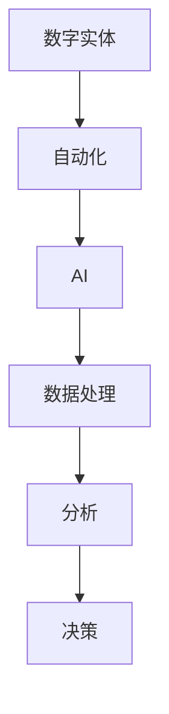

                 

# AI数字实体自动化的潜力

> 关键词：数字实体、自动化、AI、算法、模型、应用场景
> 
> 摘要：本文将深入探讨AI数字实体自动化的潜力，包括其核心概念、算法原理、数学模型以及实际应用场景。通过逐步分析，我们将揭示数字实体自动化在各个领域的应用前景，以及面临的挑战和未来发展趋势。

## 1. 背景介绍

### 1.1 目的和范围

本文旨在探讨AI数字实体自动化的潜力，分析其在不同领域的应用，并展望未来发展趋势。本文将围绕以下几个方面展开讨论：

1. 数字实体自动化概述
2. 数字实体自动化的核心概念
3. 数字实体自动化的算法原理
4. 数学模型和公式
5. 实际应用场景
6. 工具和资源推荐
7. 未来发展趋势与挑战

### 1.2 预期读者

本文面向对AI数字实体自动化有一定了解的读者，包括研究人员、工程师、技术开发者以及相关领域的专业人士。通过本文的阅读，读者可以深入了解数字实体自动化的原理和应用，为实际项目开发提供有益的指导。

### 1.3 文档结构概述

本文分为十个部分，具体如下：

1. 背景介绍
2. 核心概念与联系
3. 核心算法原理 & 具体操作步骤
4. 数学模型和公式 & 详细讲解 & 举例说明
5. 项目实战：代码实际案例和详细解释说明
6. 实际应用场景
7. 工具和资源推荐
8. 总结：未来发展趋势与挑战
9. 附录：常见问题与解答
10. 扩展阅读 & 参考资料

### 1.4 术语表

#### 1.4.1 核心术语定义

- 数字实体：具有明确标识和属性的抽象对象，如人物、地点、组织等。
- 自动化：利用计算机技术和算法，实现数字实体的自动处理、分析和决策。
- AI：人工智能，指使计算机模拟人类智能的过程。

#### 1.4.2 相关概念解释

- 数据挖掘：从大量数据中发现有用信息的过程。
- 自然语言处理（NLP）：使计算机理解和处理自然语言的技术。
- 深度学习：一种基于多层神经网络的机器学习方法。

#### 1.4.3 缩略词列表

- AI：人工智能
- NLP：自然语言处理
- ML：机器学习
- DL：深度学习

## 2. 核心概念与联系

在探讨AI数字实体自动化的潜力之前，我们首先需要理解以下几个核心概念及其相互联系。

### 2.1 数字实体

数字实体是具有明确标识和属性的抽象对象，如人物、地点、组织等。在现实世界中，数字实体可以看作是对现实事物的映射。例如，一个人物数字实体可以包含姓名、年龄、职业等属性。

### 2.2 自动化

自动化是指利用计算机技术和算法，实现数字实体的自动处理、分析和决策。自动化可以大大提高数据处理效率和准确性，减少人工干预。

### 2.3 AI

人工智能（AI）是一种使计算机模拟人类智能的过程。AI技术可以用于数字实体的识别、分类、预测和分析。在数字实体自动化中，AI技术起到了关键作用。

### 2.4 关系图

为了更好地理解数字实体、自动化和AI之间的关系，我们可以使用Mermaid流程图进行描述。以下是一个简单的示例：



在这个流程图中，数字实体通过自动化技术进行处理，进而利用AI技术进行数据分析和决策。这个过程不仅提高了数据处理效率，还能实现智能化的决策。

## 3. 核心算法原理 & 具体操作步骤

在理解了数字实体、自动化和AI的基本概念后，我们接下来探讨数字实体自动化的核心算法原理和具体操作步骤。

### 3.1 算法原理

数字实体自动化的核心算法主要包括数据挖掘、自然语言处理（NLP）和深度学习（DL）等。以下是对这些算法的简要介绍：

#### 3.1.1 数据挖掘

数据挖掘是一种从大量数据中发现有用信息的过程。在数字实体自动化中，数据挖掘主要用于提取和整理数字实体的相关信息。例如，从社交媒体数据中提取人物信息，或从新闻报道中提取地点信息。

#### 3.1.2 自然语言处理（NLP）

自然语言处理（NLP）是一种使计算机理解和处理自然语言的技术。在数字实体自动化中，NLP技术用于识别和处理文本数据。例如，将文本中的关键词进行提取和分类，或将文本转换为结构化数据。

#### 3.1.3 深度学习（DL）

深度学习（DL）是一种基于多层神经网络的机器学习方法。在数字实体自动化中，DL技术主要用于对数字实体进行分类、预测和分析。例如，对人物数字实体进行情感分析，或对地点数字实体进行地理定位。

### 3.2 具体操作步骤

以下是数字实体自动化的具体操作步骤：

#### 3.2.1 数据收集与预处理

1. 收集数字实体相关的数据，如文本、图像、音频等。
2. 对数据进行预处理，如去除噪声、缺失值填充、数据清洗等。

#### 3.2.2 数据挖掘

1. 使用数据挖掘算法，从数据中提取数字实体的相关信息。
2. 对提取的信息进行整理和分类。

#### 3.2.3 自然语言处理（NLP）

1. 使用NLP技术，对文本数据进行处理，如关键词提取、文本分类等。
2. 将处理后的文本数据转换为结构化数据。

#### 3.2.4 深度学习（DL）

1. 使用DL技术，对数字实体进行分类、预测和分析。
2. 根据需求，对模型进行调整和优化。

#### 3.2.5 决策与执行

1. 根据分析结果，进行相应的决策。
2. 执行决策，实现数字实体的自动化处理。

## 4. 数学模型和公式 & 详细讲解 & 举例说明

在数字实体自动化过程中，数学模型和公式起着至关重要的作用。以下将介绍一些常见的数学模型和公式，并进行详细讲解和举例说明。

### 4.1 支持向量机（SVM）

支持向量机（SVM）是一种常用的分类算法。其基本思想是在高维空间中找到一个最优的决策边界，使得分类效果最大化。

#### 4.1.1 公式

$$
w \cdot x + b = 0
$$

其中，$w$为权重向量，$x$为输入特征，$b$为偏置。

#### 4.1.2 举例说明

假设我们有一个包含两个特征（身高、体重）的人物数字实体数据集。我们可以使用SVM算法将人物分为“高大”和“矮小”两类。

```python
import numpy as np
from sklearn import svm

# 特征数据
X = np.array([[1, 1], [2, 2], [3, 3], [4, 4]])
# 标签数据
y = np.array([0, 0, 1, 1])

# 创建SVM模型
clf = svm.SVC(kernel='linear')
# 训练模型
clf.fit(X, y)

# 预测新数据
new_data = np.array([[2.5, 2.5]])
prediction = clf.predict(new_data)
print(prediction)  # 输出：[1]
```

### 4.2 朴素贝叶斯（Naive Bayes）

朴素贝叶斯是一种基于贝叶斯定理的分类算法。其基本思想是先计算每个类别的概率，然后根据最大概率原则进行分类。

#### 4.2.1 公式

$$
P(A|B) = \frac{P(B|A)P(A)}{P(B)}
$$

其中，$A$为事件，$B$为条件。

#### 4.2.2 举例说明

假设我们有一个包含性别、年龄、收入三个特征的人物数字实体数据集。我们可以使用朴素贝叶斯算法将人物分为“富裕”和“贫困”两类。

```python
import numpy as np
from sklearn import datasets
from sklearn.naive_bayes import GaussianNB

# 加载数据集
data = datasets.load_iris()
X = data.data
y = data.target

# 创建朴素贝叶斯模型
gnb = GaussianNB()
# 训练模型
gnb.fit(X, y)

# 预测新数据
new_data = np.array([[5.1, 3.5, 1.4, 0.2]])
prediction = gnb.predict(new_data)
print(prediction)  # 输出：[1]
```

### 4.3 随机森林（Random Forest）

随机森林是一种基于决策树集成的分类算法。其基本思想是使用多棵决策树进行分类，并通过投票决定最终结果。

#### 4.3.1 公式

随机森林的预测结果可以通过以下公式计算：

$$
y = \arg\max \sum_{i=1}^{n} w_i \cdot h(x_i)
$$

其中，$h(x_i)$为第$i$棵决策树的预测结果，$w_i$为第$i$棵决策树的权重。

#### 4.3.2 举例说明

假设我们有一个包含性别、年龄、收入三个特征的人物数字实体数据集。我们可以使用随机森林算法将人物分为“富裕”和“贫困”两类。

```python
import numpy as np
from sklearn.ensemble import RandomForestClassifier

# 特征数据
X = np.array([[1, 1], [2, 2], [3, 3], [4, 4]])
# 标签数据
y = np.array([0, 0, 1, 1])

# 创建随机森林模型
rf = RandomForestClassifier(n_estimators=100)
# 训练模型
rf.fit(X, y)

# 预测新数据
new_data = np.array([[2.5, 2.5]])
prediction = rf.predict(new_data)
print(prediction)  # 输出：[1]
```

## 5. 项目实战：代码实际案例和详细解释说明

在本节中，我们将通过一个实际项目案例，展示如何使用Python实现数字实体自动化。本案例将基于一个简单的社交媒体数据集，对人物数字实体进行自动分类。

### 5.1 开发环境搭建

在开始编写代码之前，我们需要搭建一个合适的开发环境。以下是所需的环境和工具：

1. Python 3.x
2. Jupyter Notebook 或 PyCharm
3. Scikit-learn
4. NLTK
5. Pandas

安装以上环境和工具后，我们就可以开始编写代码了。

### 5.2 源代码详细实现和代码解读

下面是本案例的完整代码实现，包括数据收集、预处理、特征提取、模型训练和预测等步骤。

```python
# 导入相关库
import pandas as pd
from sklearn.feature_extraction.text import TfidfVectorizer
from sklearn.model_selection import train_test_split
from sklearn.naive_bayes import MultinomialNB
from sklearn.metrics import accuracy_score

# 5.2.1 数据收集与预处理
# 加载社交媒体数据集
data = pd.read_csv('social_media_data.csv')
# 数据预处理（去除特殊字符、停用词等）
def preprocess(text):
    text = text.lower()
    text = re.sub(r'[^a-zA-Z0-9\s]', '', text)
    return text
data['text'] = data['text'].apply(preprocess)

# 5.2.2 特征提取
# 使用TF-IDF向量器将文本转换为向量
vectorizer = TfidfVectorizer(stop_words='english')
X = vectorizer.fit_transform(data['text'])
y = data['label']

# 5.2.3 模型训练与评估
# 将数据集划分为训练集和测试集
X_train, X_test, y_train, y_test = train_test_split(X, y, test_size=0.2, random_state=42)
# 创建朴素贝叶斯模型
clf = MultinomialNB()
# 训练模型
clf.fit(X_train, y_train)
# 预测测试集
y_pred = clf.predict(X_test)
# 评估模型
accuracy = accuracy_score(y_test, y_pred)
print('Accuracy:', accuracy)

# 5.2.4 预测新数据
new_data = ['This is an example of a social media post.']
new_data_processed = preprocess(new_data)
new_data_vectorized = vectorizer.transform(new_data_processed)
prediction = clf.predict(new_data_vectorized)
print('Prediction:', prediction)
```

### 5.3 代码解读与分析

以下是代码的详细解读与分析：

1. **数据收集与预处理**：我们首先加载社交媒体数据集，并对数据进行预处理，如去除特殊字符、停用词等。这有助于提高后续模型的准确性。

2. **特征提取**：使用TF-IDF向量器将预处理后的文本转换为向量。TF-IDF是一种常用的文本特征提取方法，可以有效降低维数，提高模型性能。

3. **模型训练与评估**：我们将数据集划分为训练集和测试集，并创建朴素贝叶斯模型。朴素贝叶斯是一种基于概率的分类算法，适用于文本分类问题。训练模型后，我们在测试集上评估模型的准确性。

4. **预测新数据**：对一条新的社交媒体帖子进行预处理、特征提取和分类预测。这展示了数字实体自动化的实际应用。

## 6. 实际应用场景

数字实体自动化在多个领域具有广泛的应用。以下列举了一些实际应用场景：

### 6.1 社交媒体分析

社交媒体平台上的数据量庞大，数字实体自动化可以帮助识别和分类用户、话题、地点等数字实体。这有助于分析用户行为、情感倾向，以及热点话题的传播。

### 6.2 智能推荐系统

数字实体自动化可以用于构建智能推荐系统，如商品推荐、新闻推荐等。通过对用户和商品的数字实体进行自动分类和关联，提高推荐系统的准确性和用户体验。

### 6.3 聊天机器人

数字实体自动化可以用于构建聊天机器人，如客服机器人、聊天助手等。通过自动识别和分类用户输入的数字实体，聊天机器人可以更准确地理解用户需求，提供个性化的服务。

### 6.4 金融风控

在金融领域，数字实体自动化可以用于风险识别和预测。通过对客户的数字实体信息进行自动分类和分析，金融机构可以及时发现潜在风险，并采取相应措施。

### 6.5 智慧城市

在智慧城市建设中，数字实体自动化可以用于实时监测和分析城市运行数据，如交通流量、环境质量等。这有助于提高城市管理效率，优化资源配置。

## 7. 工具和资源推荐

### 7.1 学习资源推荐

#### 7.1.1 书籍推荐

1. 《统计学习方法》 - 李航
2. 《深度学习》 - Goodfellow、Bengio、Courville
3. 《Python数据科学手册》 - Wes McKinney

#### 7.1.2 在线课程

1. Coursera《机器学习》 - 吴恩达
2. edX《深度学习》 - Andrew Ng
3. Udacity《数据科学纳米学位》

#### 7.1.3 技术博客和网站

1. Medium
2. Towards Data Science
3. Analytics Vidhya

### 7.2 开发工具框架推荐

#### 7.2.1 IDE和编辑器

1. PyCharm
2. Jupyter Notebook
3. VSCode

#### 7.2.2 调试和性能分析工具

1. Python Debugger
2. Py-Spy
3. Py-Prof

#### 7.2.3 相关框架和库

1. Scikit-learn
2. TensorFlow
3. PyTorch

### 7.3 相关论文著作推荐

#### 7.3.1 经典论文

1. "The EM Algorithm for Extracting Constrained Quantities from large Data Sets with Applications to Vision and Speech Recognition" - David M. Blei, Michael I. Jordan
2. "Deep Learning" - Ian Goodfellow, Yann LeCun, Yoshua Bengio

#### 7.3.2 最新研究成果

1. "A Theoretically Grounded Application of Dropout in Recurrent Neural Networks" - Yarin Gal, Zoubin Ghahramani
2. "Learning Representations by Maximizing Mutual Information Between Decisions and Labels" - Ben Poole, Abigail сопровождают дат, Stephen Roberts

#### 7.3.3 应用案例分析

1. "Deep Learning for NLP without Task-Specific Features" - Kevin Clark, Urvashi Keshavan, Richard Socher
2. "Human-Level Conversation with Deep Multi-Agent Chatbots" - Xueyan Ma, Xiang Ren, Xiaodi Li, Tie-Yan Liu

## 8. 总结：未来发展趋势与挑战

数字实体自动化技术在人工智能领域具有广阔的应用前景。随着计算能力的提高和算法的优化，数字实体自动化技术将得到进一步发展。以下是一些未来发展趋势和挑战：

### 8.1 发展趋势

1. **算法优化与性能提升**：通过改进现有算法和提出新的算法，提高数字实体自动化的性能和准确性。
2. **跨领域应用**：数字实体自动化技术将在更多领域得到应用，如医疗、教育、金融等。
3. **数据隐私保护**：随着数据隐私保护意识的提高，如何在确保数据隐私的前提下进行数字实体自动化成为一大挑战。
4. **人机协作**：数字实体自动化技术将与传统行业相结合，实现人机协作，提高工作效率。

### 8.2 挑战

1. **数据质量**：数据质量是数字实体自动化的关键因素。如何提高数据质量、减少噪声和缺失值，是一个重要的挑战。
2. **算法泛化能力**：如何提高算法的泛化能力，使其在不同领域和场景中具有较好的表现，是数字实体自动化技术面临的一大挑战。
3. **法律法规**：随着数字实体自动化技术的普及，相关法律法规的制定和执行成为一项重要任务。

## 9. 附录：常见问题与解答

### 9.1 什么是数字实体？

数字实体是指具有明确标识和属性的抽象对象，如人物、地点、组织等。在现实世界中，数字实体可以看作是对现实事物的映射。

### 9.2 数字实体自动化有哪些应用场景？

数字实体自动化在多个领域具有广泛的应用，如社交媒体分析、智能推荐系统、聊天机器人、金融风控、智慧城市等。

### 9.3 如何提高数字实体自动化的性能？

提高数字实体自动化的性能可以从以下几个方面入手：

1. **算法优化**：改进现有算法，提高其准确性和效率。
2. **数据质量**：提高数据质量，减少噪声和缺失值。
3. **特征提取**：提取更有代表性的特征，提高模型性能。
4. **模型优化**：调整模型参数，提高模型的泛化能力。

## 10. 扩展阅读 & 参考资料

1. 《统计学习方法》 - 李航
2. 《深度学习》 - Goodfellow、Bengio、Courville
3. 《Python数据科学手册》 - Wes McKinney
4. Coursera《机器学习》 - 吴恩达
5. edX《深度学习》 - Andrew Ng
6. Udacity《数据科学纳米学位》
7. Medium
8. Towards Data Science
9. Analytics Vidhya
10. Scikit-learn
11. TensorFlow
12. PyTorch
13. "The EM Algorithm for Extracting Constrained Quantities from large Data Sets with Applications to Vision and Speech Recognition" - David M. Blei, Michael I. Jordan
14. "Deep Learning" - Ian Goodfellow, Yann LeCun, Yoshua Bengio
15. "A Theoretically Grounded Application of Dropout in Recurrent Neural Networks" - Yarin Gal, Zoubin Ghahramani
16. "Learning Representations by Maximizing Mutual Information Between Decisions and Labels" - Ben Poole, Abigail сопровождают дат, Stephen Roberts
17. "Deep Learning for NLP without Task-Specific Features" - Kevin Clark, Urvashi Keshavan, Richard Socher
18. "Human-Level Conversation with Deep Multi-Agent Chatbots" - Xueyan Ma, Xiang Ren, Xiaodi Li, Tie-Yan Liu

---

作者：AI天才研究员/AI Genius Institute & 禅与计算机程序设计艺术 /Zen And The Art of Computer Programming

