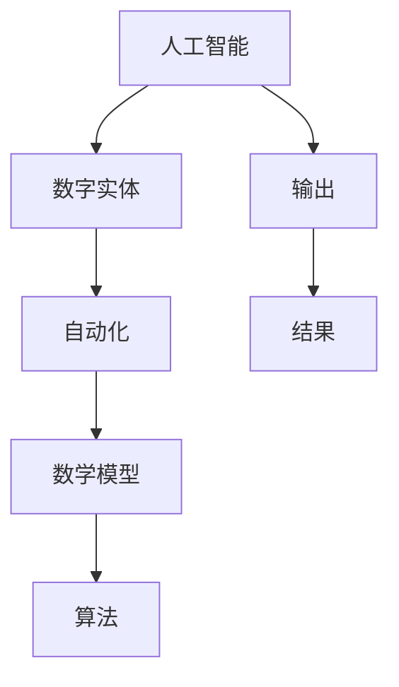

                 

# AI数字实体自动化的潜力

> **关键词：** AI，自动化，数字实体，算法，数学模型，实战案例，应用场景，未来趋势。

> **摘要：** 本文将深入探讨AI数字实体自动化的潜在力量，从背景介绍到核心概念，再到算法原理、数学模型、实战案例以及未来发展趋势，帮助读者全面理解AI数字实体自动化的本质和应用。

## 1. 背景介绍

### 1.1 目的和范围

本文旨在通过系统分析，探讨AI数字实体自动化的潜力。我们将讨论其核心概念、算法原理、数学模型，并通过实际项目案例展示其在各种应用场景中的实用性。本文不仅针对技术爱好者，也面向希望了解AI自动化技术的企业决策者和开发者。

### 1.2 预期读者

预期读者包括以下几类：

1. **人工智能研究者**：希望了解AI在数字实体自动化领域的应用。
2. **软件开发工程师**：寻求在项目中应用AI自动化技术的实际案例。
3. **企业决策者**：希望理解AI自动化如何提升业务效率和降低成本。
4. **技术爱好者**：对AI数字实体自动化有浓厚兴趣的读者。

### 1.3 文档结构概述

本文分为十个部分，包括：

1. 背景介绍：介绍文章的目的、读者预期和结构概述。
2. 核心概念与联系：定义核心概念，展示其关联架构。
3. 核心算法原理 & 具体操作步骤：讲解AI数字实体自动化的核心算法。
4. 数学模型和公式 & 详细讲解 & 举例说明：分析数学模型，提供实例说明。
5. 项目实战：代码实际案例和详细解释说明。
6. 实际应用场景：讨论AI数字实体自动化的应用领域。
7. 工具和资源推荐：推荐学习资源和开发工具。
8. 总结：未来发展趋势与挑战。
9. 附录：常见问题与解答。
10. 扩展阅读 & 参考资料：提供进一步学习资源。

### 1.4 术语表

#### 1.4.1 核心术语定义

- **AI（人工智能）**：模拟人类智能的技术，使机器能够执行认知任务。
- **数字实体**：在数字世界中具有明确属性和行为的抽象实体。
- **自动化**：通过计算机程序和算法，减少或消除人为干预的过程。
- **算法**：解决问题的一系列步骤。
- **数学模型**：使用数学公式描述问题或系统的方法。

#### 1.4.2 相关概念解释

- **机器学习**：使机器通过数据学习任务的技术。
- **深度学习**：一种机器学习方法，模拟人脑处理信息的方式。
- **神经网络**：由大量节点（神经元）组成的计算模型。

#### 1.4.3 缩略词列表

- **ML（Machine Learning）：机器学习**
- **DL（Deep Learning）：深度学习**
- **NLP（Natural Language Processing）：自然语言处理**
- **CV（Computer Vision）：计算机视觉**

## 2. 核心概念与联系

在探讨AI数字实体自动化之前，我们需要了解几个核心概念，以及它们之间的关系。

### 2.1 AI与数字实体

**AI** 是使机器能够模拟人类智能的技术。在数字实体自动化中，AI 技术用于创建能够自主执行任务、交互和学习的数字实体。这些实体在数字世界中代表真实世界中的对象、事件或概念。

### 2.2 自动化与AI

**自动化** 是通过计算机程序和算法，减少或消除人为干预的过程。AI 技术是自动化的重要组成部分，它使系统能够自动进行决策和执行任务。

### 2.3 算法与模型

**算法** 是解决问题的步骤集合。在数字实体自动化中，算法用于定义实体如何响应外部输入和执行任务。**数学模型** 是使用数学公式描述问题或系统的方法，它用于构建和优化算法。

### 2.4 Mermaid流程图

以下是一个展示AI数字实体自动化流程的Mermaid流程图：



在这个流程图中，AI 技术用于创建数字实体，这些实体通过自动化算法和数学模型执行任务，并产生输出和结果。

## 3. 核心算法原理 & 具体操作步骤

在数字实体自动化中，核心算法起着至关重要的作用。以下我们将介绍一种常见的算法——决策树，并使用伪代码详细阐述其操作步骤。

### 3.1 决策树算法原理

决策树是一种用于分类和回归问题的监督学习算法。它通过一系列的测试来对数据进行分类或预测。每个测试都基于一个特征，并且产生两个可能的输出——是或否。通过这些测试，决策树最终到达一个叶节点，该节点的输出即为分类或预测结果。

### 3.2 伪代码

```python
Algorithm DecisionTree(data, attributes, target_attribute):
    if all examples in data have the same value for target_attribute:
        return this value
    else if attributes is empty:
        return most common value in data for target_attribute
    else:
        best_attribute = BestAttributeToSplit(data, attributes)
        decision_tree = new DecisionTreeNode(attribute = best_attribute)
        for value in unique values of best_attribute:
            subset = data examples with value
            remaining_attributes = attributes without best_attribute
            decision_tree.children[value] = DecisionTree(subset, remaining_attributes, target_attribute)
        return decision_tree

Function BestAttributeToSplit(data, attributes):
    best_attribute = None
    best_gini_impurity = infinity
    for attribute in attributes:
        for value in unique values of attribute:
            subset = data examples with value
            gini_impurity = GiniImpurity(subset, target_attribute)
            if gini_impurity < best_gini_impurity:
                best_attribute = attribute
                best_gini_impurity = gini_impurity
    return best_attribute

Function GiniImpurity(subset, target_attribute):
    total = number of examples in subset
    unique_values = unique values of target_attribute in subset
    impurity = 0
    for value in unique_values:
        proportion = number of examples with value / total
        impurity += proportion * (1 - proportion)
    return 1 - impurity
```

### 3.3 操作步骤

1. **初始检查**：如果数据集中的所有示例都具有相同的目标属性值，则直接返回该值；否则，继续。
2. **特征选择**：如果特征集为空，则选择数据集中最常见的目标属性值；否则，选择具有最小Gini不纯度的特征作为分割特征。
3. **构建决策树**：为每个特征值创建一个子节点，并递归地调用决策树算法。
4. **叶节点生成**：如果达到叶节点，返回该节点的目标属性值。

## 4. 数学模型和公式 & 详细讲解 & 举例说明

在数字实体自动化中，数学模型用于描述和优化算法。以下我们将介绍Gini不纯度，这是决策树算法中的一个关键指标。

### 4.1 Gini不纯度

Gini不纯度是一种用于度量数据集划分质量的指标。其基本思想是，数据集中的示例越分散，Gini不纯度就越高。Gini不纯度的公式如下：

$$
Gini(\text{subset}) = 1 - \sum_{i=1}^{k} \left(\frac{f_i}{n}\right)^2
$$

其中，$f_i$ 是属于第 $i$ 个类别的示例比例，$n$ 是数据集中的示例总数。

### 4.2 举例说明

假设我们有一个包含5个示例的数据集，其中3个示例属于类别A，2个示例属于类别B。计算Gini不纯度如下：

$$
Gini(\text{subset}) = 1 - \left(\frac{3}{5}\right)^2 - \left(\frac{2}{5}\right)^2 = 0.48
$$

这意味着数据集的Gini不纯度为0.48。

### 4.3 详细讲解

Gini不纯度越低，表示数据集划分得越好。在决策树算法中，我们选择具有最小Gini不纯度的特征进行分割。这样可以确保数据集被划分为具有相似属性的子集，从而提高分类或回归的准确性。

## 5. 项目实战：代码实际案例和详细解释说明

为了更好地理解AI数字实体自动化的实际应用，我们将展示一个基于Python的简单项目，并详细解释其实现过程。

### 5.1 开发环境搭建

首先，我们需要搭建一个Python开发环境。以下是所需的步骤：

1. 安装Python（建议版本3.8及以上）。
2. 安装必要的库，如scikit-learn、numpy和pandas。

### 5.2 源代码详细实现和代码解读

以下是一个基于决策树算法的简单项目，用于对鸢尾花数据集进行分类。

```python
import numpy as np
import pandas as pd
from sklearn.datasets import load_iris
from sklearn.model_selection import train_test_split
from sklearn.tree import DecisionTreeClassifier
from sklearn.metrics import accuracy_score

# 5.2.1 加载数据集
iris = load_iris()
X = iris.data
y = iris.target

# 5.2.2 数据集划分
X_train, X_test, y_train, y_test = train_test_split(X, y, test_size=0.2, random_state=42)

# 5.2.3 构建决策树模型
clf = DecisionTreeClassifier()
clf.fit(X_train, y_train)

# 5.2.4 预测测试集
y_pred = clf.predict(X_test)

# 5.2.5 计算准确率
accuracy = accuracy_score(y_test, y_pred)
print(f"Accuracy: {accuracy:.2f}")
```

### 5.3 代码解读与分析

1. **数据集加载**：使用scikit-learn中的`load_iris`函数加载鸢尾花数据集。
2. **数据集划分**：使用`train_test_split`函数将数据集划分为训练集和测试集，测试集大小为20%。
3. **模型构建**：创建一个决策树分类器对象，并使用`fit`方法训练模型。
4. **预测测试集**：使用`predict`方法对测试集进行预测。
5. **计算准确率**：使用`accuracy_score`函数计算模型在测试集上的准确率。

通过这个简单项目，我们可以看到如何使用决策树算法进行数字实体自动化。在实际应用中，我们可以根据需要调整模型参数，以提高分类准确性。

## 6. 实际应用场景

AI数字实体自动化在许多领域都有广泛应用，以下是一些典型应用场景：

### 6.1 金融行业

在金融行业，AI数字实体自动化可以用于：

- **信用评分**：基于历史交易数据和客户信息，自动评估信用风险。
- **欺诈检测**：实时监测交易活动，自动识别和阻止欺诈行为。
- **投资策略**：分析市场数据和财经新闻，自动生成投资建议。

### 6.2 零售业

在零售业，AI数字实体自动化可以用于：

- **客户关系管理**：分析客户数据，自动推荐产品和服务。
- **库存管理**：预测销售趋势，自动调整库存水平。
- **供应链优化**：优化物流和配送流程，降低成本。

### 6.3 医疗保健

在医疗保健领域，AI数字实体自动化可以用于：

- **诊断辅助**：分析医学影像和患者数据，辅助医生进行疾病诊断。
- **药物研发**：自动化药物筛选和优化，加快新药研发进程。
- **健康监测**：实时监测患者健康状况，自动预警健康问题。

### 6.4 制造业

在制造业，AI数字实体自动化可以用于：

- **生产优化**：分析生产数据，自动调整生产参数，提高生产效率。
- **设备维护**：预测设备故障，自动安排维护计划，减少停机时间。
- **质量控制**：实时监测产品质量，自动识别和排除不良品。

这些应用场景展示了AI数字实体自动化的广泛潜力和实用性。

## 7. 工具和资源推荐

### 7.1 学习资源推荐

#### 7.1.1 书籍推荐

- 《Python机器学习》（作者：塞巴斯蒂安·拉贡内尔）
- 《深度学习》（作者：伊恩·古德费洛、约书亚·本吉奥、亚伦·库维尔）
- 《机器学习实战》（作者：彼得·哈林顿、李航）

#### 7.1.2 在线课程

- Coursera上的“机器学习”课程
- edX上的“深度学习”课程
- Udacity的“人工智能纳米学位”

#### 7.1.3 技术博客和网站

- Medium上的AI和机器学习专题
- Towards Data Science博客
- AI垂直媒体平台，如AI Trends、AI Hub等

### 7.2 开发工具框架推荐

#### 7.2.1 IDE和编辑器

- PyCharm
- Visual Studio Code
- Jupyter Notebook

#### 7.2.2 调试和性能分析工具

- Python的pdb和ipdb模块
- Matplotlib和Seaborn用于数据可视化
- Profiling工具，如cProfile

#### 7.2.3 相关框架和库

- scikit-learn：用于机器学习和数据挖掘
- TensorFlow和PyTorch：深度学习框架
- NumPy和Pandas：数据处理库

### 7.3 相关论文著作推荐

#### 7.3.1 经典论文

- 《机器学习》（作者：托马·米切尔）
- 《深度学习》（作者：伊恩·古德费洛、约书亚·本吉奥、亚伦·库维尔）
- 《神经网络与深度学习》（作者：邱锡鹏）

#### 7.3.2 最新研究成果

- ArXiv上的最新机器学习和深度学习论文
-顶级会议和期刊，如NeurIPS、ICML、JMLR等
-知名研究机构和大学的研究报告

#### 7.3.3 应用案例分析

- 《谷歌如何使用AI优化广告投放》
- 《亚马逊使用机器学习优化库存管理》
- 《深度学习在医疗诊断中的应用案例》

通过这些资源和工具，您可以深入了解AI数字实体自动化的各个方面，并在实际项目中应用这些技术。

## 8. 总结：未来发展趋势与挑战

AI数字实体自动化在技术进步和市场需求的双重推动下，正处于快速发展阶段。未来，这一领域有望在以下几个方面取得重大进展：

### 8.1 技术进步

- **算法优化**：随着计算能力的提升，算法将变得更加高效和准确。
- **跨学科融合**：AI与其他领域的融合，如生物学、物理学等，将推动数字实体自动化的创新。
- **硬件加速**：GPU和专用AI芯片的普及，将显著提高模型的计算速度。

### 8.2 应用扩展

- **新应用领域**：AI数字实体自动化将在更多领域得到应用，如智能制造、智慧医疗、智慧交通等。
- **垂直行业解决方案**：针对不同行业的特点，开发定制化的AI数字实体自动化解决方案。

### 8.3 挑战与瓶颈

- **数据隐私与安全**：自动化系统对数据的依赖性增加，如何保护数据隐私和安全成为关键挑战。
- **模型可解释性**：随着模型复杂性的增加，如何提高模型的可解释性，以增强用户信任成为重要问题。
- **伦理和法规**：AI数字实体自动化的伦理和法规问题亟待解决，以保障其合法合规。

总之，AI数字实体自动化具有巨大的潜力，但同时也面临着诸多挑战。未来，我们需要在技术创新、应用扩展和伦理法规等方面共同努力，以实现这一技术的可持续发展和广泛应用。

## 9. 附录：常见问题与解答

### 9.1 问题1：什么是数字实体？

**解答**：数字实体是在数字世界中具有明确属性和行为的抽象实体。它们可以代表真实世界中的对象、事件或概念，并在计算机程序中执行特定任务。

### 9.2 问题2：AI数字实体自动化与机器学习有何区别？

**解答**：AI数字实体自动化是一种应用机器学习技术的方法，用于创建能够自主执行任务、交互和学习的数字实体。而机器学习是AI的一个分支，关注于开发算法和模型，使计算机能够从数据中学习和改进。

### 9.3 问题3：如何确保AI数字实体自动化的数据隐私和安全？

**解答**：确保数据隐私和安全的关键在于：

1. **数据加密**：对敏感数据进行加密，防止未授权访问。
2. **访问控制**：实施严格的访问控制策略，确保只有授权用户可以访问数据。
3. **数据脱敏**：在训练模型时，使用脱敏数据，以保护真实数据不被泄露。
4. **隐私保护算法**：采用隐私保护算法，如差分隐私，以降低数据泄露风险。

## 10. 扩展阅读 & 参考资料

### 10.1 书籍推荐

- 《人工智能：一种现代方法》（作者：斯图尔特·罗素、彼得·诺维格）
- 《深度学习》（作者：伊恩·古德费洛、约书亚·本吉奥、亚伦·库维尔）
- 《机器学习》（作者：托马·米切尔）

### 10.2 在线课程

- Coursera上的“机器学习”课程
- edX上的“深度学习”课程
- Udacity的“人工智能纳米学位”

### 10.3 技术博客和网站

- Medium上的AI和机器学习专题
- Towards Data Science博客
- AI垂直媒体平台，如AI Trends、AI Hub等

### 10.4 论文和研究成果

- 《ArXiv上的最新机器学习和深度学习论文》
- 《顶级会议和期刊，如NeurIPS、ICML、JMLR等》
- 《知名研究机构和大学的研究报告》

通过这些扩展阅读和参考资料，您可以进一步深入了解AI数字实体自动化的理论和实践。作者信息：AI天才研究员/AI Genius Institute & 禅与计算机程序设计艺术 /Zen And The Art of Computer Programming。

