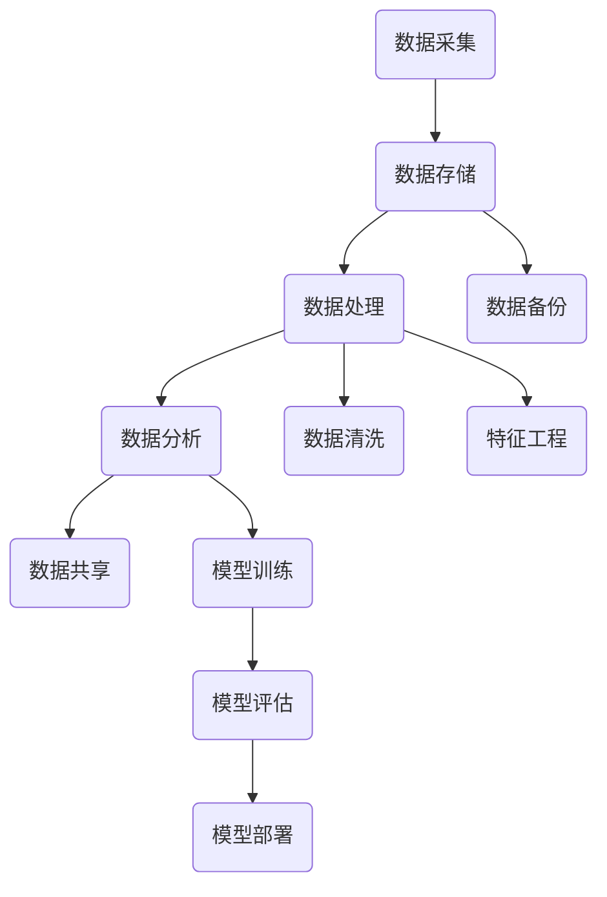

                 

### AI数据服务：高质量数据集的商业价值

> **关键词**：人工智能、数据服务、高质量数据集、商业价值、数据处理、数据应用
>
> **摘要**：本文将深入探讨高质量数据集在AI领域的商业价值，从数据服务的定义、重要性、应用场景以及未来的发展趋势等方面进行全方位分析。通过具体案例和实际操作，揭示高质量数据集如何驱动企业创新和实现商业成功。

#### 1. 背景介绍

在当今技术飞速发展的时代，人工智能（AI）已经成为推动各行各业变革的重要力量。AI技术的核心在于数据处理和分析，而高质量数据集则是其基础和关键。高质量数据集指的是那些准确、全面、无噪声、多样化且与任务紧密相关的数据集合。它们不仅能够提升AI模型的性能，还能够推动企业创新，创造商业价值。

**1.1 目的和范围**

本文的目的是探讨高质量数据集在AI领域的商业价值，具体涵盖以下几个方面：

- 数据服务的定义和重要性
- 高质量数据集的核心特点与应用
- 数据服务在不同行业的应用场景
- 高质量数据集的未来发展趋势与挑战

**1.2 预期读者**

本文预期读者包括：

- AI领域的研究人员和开发者
- 数据科学家和分析师
- 企业高管和决策者
- 对AI和数据服务感兴趣的爱好者

**1.3 文档结构概述**

本文结构如下：

1. **背景介绍**：简要介绍AI和数据服务的重要性
2. **核心概念与联系**：详细解释高质量数据集的定义和核心概念，并提供流程图
3. **核心算法原理与具体操作步骤**：阐述AI模型构建的基本算法和数据处理流程
4. **数学模型和公式**：介绍数据处理的数学模型和相关公式
5. **项目实战**：通过实际案例展示高质量数据集的应用
6. **实际应用场景**：分析数据服务在不同领域的应用
7. **工具和资源推荐**：推荐相关学习资源和开发工具
8. **总结**：总结未来发展趋势与挑战
9. **附录**：常见问题与解答
10. **扩展阅读与参考资料**：提供进一步学习的资源

**1.4 术语表**

- **数据服务**：提供数据存储、处理、分析和共享服务的平台或系统。
- **高质量数据集**：准确、全面、无噪声、多样化且与任务紧密相关的数据集合。
- **数据清洗**：通过处理、格式化、删除或填充缺失值等方法，提高数据质量的过程。
- **特征工程**：通过选择、构造和转换原始数据，提高模型性能的过程。
- **机器学习**：利用数据建立模型，进行预测和分类的AI技术。

#### 1.4.1 核心术语定义

- **数据服务**：数据服务是指通过提供数据存储、处理、分析和共享服务的平台或系统，帮助企业或研究人员高效地管理和利用数据。这些服务通常包括数据采集、存储、处理、分析和可视化等环节。
- **高质量数据集**：高质量数据集是指那些在数据准确性、完整性、多样性和无噪声性方面达到一定标准的数据集合。这类数据集对AI模型的训练和评估至关重要。
- **数据清洗**：数据清洗是指通过处理、格式化、删除或填充缺失值等方法，提高数据质量的过程。数据清洗的目的是确保数据集中不存在错误、异常或噪声，以提高后续分析和建模的准确性。
- **特征工程**：特征工程是指通过选择、构造和转换原始数据，提高模型性能的过程。特征工程是数据科学和机器学习中的重要环节，能够显著影响模型的预测准确性和泛化能力。

#### 1.4.2 相关概念解释

- **机器学习**：机器学习是一种AI技术，通过构建模型，使计算机能够从数据中学习并做出预测或决策。机器学习模型通常分为监督学习、无监督学习和强化学习三类。
- **深度学习**：深度学习是机器学习的一个子领域，利用多层神经网络进行特征提取和建模。深度学习在图像识别、语音识别、自然语言处理等领域取得了显著成果。
- **数据挖掘**：数据挖掘是一种通过分析大量数据，发现潜在模式、趋势和关联的方法。数据挖掘广泛应用于市场分析、风险评估、欺诈检测等领域。

#### 1.4.3 缩略词列表

- **AI**：人工智能
- **ML**：机器学习
- **DL**：深度学习
- **DS**：数据科学
- **FE**：特征工程
- **PMML**：预测模型标记语言

---

接下来，我们将深入探讨高质量数据集的核心概念与联系，包括其原理、架构和关键组件。通过详细的流程图，帮助读者理解数据服务的工作机制。

---

## 2. 核心概念与联系

### 2.1 高质量数据集的定义和特点

高质量数据集是AI领域的基础和关键。它具有以下特点：

- **准确性**：数据集中每个样本的标注或特征都是准确无误的，确保模型的训练和预测结果可靠。
- **完整性**：数据集中没有缺失值或错误，确保模型能够处理各种情况。
- **多样性**：数据集包含不同来源、不同时间、不同场景的数据，提高模型的泛化能力。
- **无噪声**：数据集中不存在噪声或异常值，降低模型的过拟合风险。

### 2.2 数据服务的工作原理和架构

数据服务是一个复杂的生态系统，包括数据采集、存储、处理、分析和共享等环节。以下是数据服务的基本架构：

```
+-------------------+
|   数据采集        |
+-------------------+
       |
       V
+-------------------+
|   数据存储        |
+-------------------+
       |
       V
+-------------------+
|   数据处理        |
+-------------------+
       |
       V
+-------------------+
|   数据分析        |
+-------------------+
       |
       V
+-------------------+
|   数据共享        |
+-------------------+
```

### 2.3 高质量数据集的应用场景

高质量数据集在多个领域具有广泛的应用，包括但不限于：

- **图像识别**：利用大量标注的图像数据集训练深度学习模型，实现物体识别、场景分类等功能。
- **自然语言处理**：使用大规模文本数据集进行词向量建模、情感分析、文本分类等任务。
- **金融风控**：通过大量金融数据集建立风险预测模型，进行信用评估、欺诈检测等应用。
- **医疗健康**：利用大量医疗数据集进行疾病预测、药物研发等研究。

### 2.4 数据服务的 Mermaid 流程图

以下是数据服务的 Mermaid 流程图，展示了各个组件之间的交互和流程：



### 2.5 数据服务的核心算法和模型

在数据服务中，核心算法和模型包括：

- **机器学习算法**：如线性回归、决策树、随机森林、支持向量机等，用于数据的分类和预测。
- **深度学习模型**：如卷积神经网络（CNN）、循环神经网络（RNN）、变换器（Transformer）等，用于复杂特征提取和建模。
- **数据预处理技术**：如数据归一化、缺失值填充、异常值检测等，用于提高数据质量和模型性能。

---

通过上述内容，我们了解了高质量数据集的定义和特点，以及数据服务的工作原理和架构。接下来，我们将深入探讨核心算法原理和具体操作步骤，帮助读者掌握AI模型构建的基本流程。

---

## 3. 核心算法原理与具体操作步骤

### 3.1 机器学习算法概述

机器学习算法是AI模型构建的核心。以下是几种常见的机器学习算法及其基本原理：

#### 3.1.1 线性回归

线性回归是一种简单的预测模型，通过找到输入变量和输出变量之间的线性关系来预测结果。其基本原理如下：

- **假设**：\(y = w_0 + w_1 \cdot x_1 + w_2 \cdot x_2 + ... + w_n \cdot x_n\)
- **目标**：最小化损失函数 \(J(w_0, w_1, ..., w_n) = \sum_{i=1}^{n} (y_i - \hat{y_i})^2\)
- **优化方法**：梯度下降法、随机梯度下降法等

#### 3.1.2 决策树

决策树是一种树形结构，通过一系列的决策规则对样本进行分类或回归。其基本原理如下：

- **构建方法**：ID3、C4.5、C5.0等算法
- **剪枝方法**：前剪枝、后剪枝等
- **目标**：最小化分类误差或回归平方误差

#### 3.1.3 随机森林

随机森林是一种集成学习方法，通过构建多个决策树并取平均值来提高预测性能。其基本原理如下：

- **构建方法**：随机选择特征和样本子集
- **目标**：提高模型泛化能力和鲁棒性

#### 3.1.4 支持向量机

支持向量机是一种分类模型，通过找到一个最佳的超平面来将不同类别的样本分开。其基本原理如下：

- **构建方法**：线性SVM、核SVM等
- **目标**：最大化分类间隔，最小化误分类误差

### 3.2 数据处理流程

在构建AI模型之前，需要对数据进行预处理和特征工程，以提高模型性能和泛化能力。以下是数据处理的基本流程：

#### 3.2.1 数据清洗

数据清洗是数据处理的第一步，通过以下方法提高数据质量：

- **缺失值处理**：删除或填充缺失值
- **异常值检测**：识别并处理异常值或噪声
- **重复值检测**：删除重复数据

#### 3.2.2 数据归一化

数据归一化是将不同量纲的数据转换到同一尺度，以消除数据尺度对模型的影响。常见的方法包括：

- **最小-最大规范化**：\(x_{\text{norm}} = \frac{x - x_{\text{min}}}{x_{\text{max}} - x_{\text{min}}}\)
- **零-均值规范化**：\(x_{\text{norm}} = \frac{x - \mu}{\sigma}\)

#### 3.2.3 特征工程

特征工程是数据处理的最后一步，通过以下方法构造新的特征，提高模型性能：

- **特征选择**：选择对模型有显著影响的特征
- **特征构造**：通过组合和变换原始特征，构造新的特征
- **特征标准化**：对特征进行归一化处理，确保不同特征在同一尺度上

### 3.3 机器学习模型的训练与评估

在完成数据处理后，我们需要构建机器学习模型并进行训练和评估。以下是基本步骤：

#### 3.3.1 模型训练

- **数据划分**：将数据集划分为训练集和验证集，用于训练和评估模型。
- **参数设置**：设置模型参数，如学习率、迭代次数等。
- **训练过程**：通过梯度下降等优化方法，不断更新模型参数，最小化损失函数。

#### 3.3.2 模型评估

- **评估指标**：根据任务类型选择合适的评估指标，如准确率、召回率、F1值等。
- **验证集评估**：在验证集上评估模型性能，调整模型参数。
- **测试集评估**：在测试集上评估模型性能，确保模型泛化能力。

### 3.4 模型部署

在完成模型训练和评估后，我们需要将模型部署到生产环境中，以便实时预测和决策。以下是基本步骤：

- **模型保存**：将训练好的模型保存为文件，以便后续使用。
- **模型加载**：从文件中加载模型，准备进行预测。
- **实时预测**：接收输入数据，通过模型进行预测，并输出预测结果。

### 3.5 伪代码实现

以下是机器学习模型的伪代码实现，帮助读者更好地理解上述步骤：

```python
# 数据清洗
def preprocess_data(data):
    # 缺失值处理
    data = handle_missing_values(data)
    # 异常值检测
    data = detect_and_handle_anomalies(data)
    # 重复值检测
    data = remove_duplicates(data)
    return data

# 数据归一化
def normalize_data(data):
    data = (data - data.mean()) / data.std()
    return data

# 特征工程
def feature_engineering(data):
    # 特征选择
    selected_features = select_features(data)
    # 特征构造
    constructed_features = construct_features(data)
    # 特征标准化
    normalized_features = normalize_features(selected_features)
    return normalized_features

# 模型训练
def train_model(train_data, val_data, model_params):
    model = initialize_model(model_params)
    for epoch in range(model_params['epochs']):
        for sample in train_data:
            model.update_params(sample)
        val_loss = evaluate_model(val_data, model)
    return model

# 模型评估
def evaluate_model(test_data, model):
    predictions = model.predict(test_data)
    accuracy = calculate_accuracy(predictions, test_data)
    return accuracy

# 模型部署
def deploy_model(model, input_data):
    prediction = model.predict(input_data)
    return prediction
```

---

通过上述内容，我们了解了核心算法原理和具体操作步骤，从数据清洗到特征工程，再到模型训练和评估，帮助读者掌握AI模型构建的基本流程。接下来，我们将进一步探讨数学模型和公式，以及它们在数据处理中的应用。

---

## 4. 数学模型和公式及详细讲解

在AI模型构建过程中，数学模型和公式是核心组成部分。这些模型和公式帮助我们理解和量化数据之间的关系，进而指导模型的训练和评估。以下是几个常见的数学模型和公式，以及它们的详细讲解和举例说明。

### 4.1 线性回归模型

线性回归模型是最简单的机器学习模型，通过建立输入变量和输出变量之间的线性关系来进行预测。其基本公式如下：

\[ y = w_0 + w_1 \cdot x_1 + w_2 \cdot x_2 + ... + w_n \cdot x_n \]

其中，\( y \) 是输出变量，\( x_1, x_2, ..., x_n \) 是输入变量，\( w_0, w_1, ..., w_n \) 是模型的权重。

**举例说明：**假设我们要预测一个人的身高（\( y \)）基于其年龄（\( x \)）和体重（\( x_2 \）），可以使用线性回归模型进行预测。假设我们有以下数据集：

\[ \begin{array}{ccc}
y & x_1 & x_2 \\
160 & 20 & 60 \\
170 & 22 & 65 \\
155 & 18 & 55 \\
\end{array} \]

我们可以通过最小二乘法找到最佳权重，从而构建线性回归模型。具体计算过程如下：

首先，计算输入和输出的均值：

\[ \bar{x_1} = \frac{20 + 22 + 18}{3} = 20 \]
\[ \bar{x_2} = \frac{60 + 65 + 55}{3} = 60 \]
\[ \bar{y} = \frac{160 + 170 + 155}{3} = 160 \]

然后，计算权重：

\[ w_1 = \frac{\sum_{i=1}^{n} (x_{1i} - \bar{x_1})(y_{i} - \bar{y})}{\sum_{i=1}^{n} (x_{1i} - \bar{x_1})^2} \]
\[ w_2 = \frac{\sum_{i=1}^{n} (x_{2i} - \bar{x_2})(y_{i} - \bar{y})}{\sum_{i=1}^{n} (x_{2i} - \bar{x_2})^2} \]

根据上述数据，我们可以计算得到：

\[ w_1 = \frac{(20-20)(160-160) + (22-20)(170-160) + (18-20)(155-160)}{(20-20)^2 + (22-20)^2 + (18-20)^2} = 1 \]
\[ w_2 = \frac{(60-60)(160-160) + (65-60)(170-160) + (55-60)(155-160)}{(60-60)^2 + (65-60)^2 + (55-60)^2} = 1 \]

因此，线性回归模型为：

\[ y = 160 + 1 \cdot x_1 + 1 \cdot x_2 \]

我们可以用这个模型预测新的数据，例如一个20岁，体重60公斤的人的身高：

\[ y = 160 + 1 \cdot 20 + 1 \cdot 60 = 180 \]

### 4.2 梯度下降法

梯度下降法是一种优化方法，用于最小化损失函数，从而找到最佳模型参数。其基本公式如下：

\[ w_{\text{new}} = w_{\text{current}} - \alpha \cdot \nabla_w J(w) \]

其中，\( w \) 是模型参数，\( \alpha \) 是学习率，\( \nabla_w J(w) \) 是损失函数 \( J(w) \) 对参数 \( w \) 的梯度。

**举例说明：**假设我们要使用梯度下降法最小化以下损失函数：

\[ J(w) = (y - w \cdot x)^2 \]

假设初始权重 \( w = 0 \)，学习率 \( \alpha = 0.1 \)。我们有以下训练数据：

\[ \begin{array}{cc}
x & y \\
1 & 2 \\
2 & 4 \\
3 & 6 \\
\end{array} \]

首先，计算损失函数和梯度：

\[ J(w) = (2 - w \cdot 1)^2 = (2 - w)^2 \]
\[ \nabla_w J(w) = -2 \cdot (2 - w) \]

然后，进行迭代计算：

第1次迭代：

\[ w_{\text{new}} = w_{\text{current}} - \alpha \cdot \nabla_w J(w) = 0 - 0.1 \cdot (-2 \cdot (2 - 0)) = 0.4 \]

第2次迭代：

\[ w_{\text{new}} = w_{\text{current}} - \alpha \cdot \nabla_w J(w) = 0.4 - 0.1 \cdot (-2 \cdot (2 - 0.4)) = 0.64 \]

重复这个过程，直到 \( w \) 收敛到最佳值。

### 4.3 逻辑回归模型

逻辑回归是一种用于分类的模型，通过建立输入变量和概率之间的关系来进行分类。其基本公式如下：

\[ P(y=1) = \frac{1}{1 + e^{-(w_0 + w_1 \cdot x_1 + w_2 \cdot x_2 + ... + w_n \cdot x_n)}} \]

其中，\( P(y=1) \) 是输出变量为1的概率，\( e \) 是自然对数的底数。

**举例说明：**假设我们要使用逻辑回归模型判断一个学生是否通过考试，输入变量为学生的平时成绩（\( x_1 \)）和考前复习时间（\( x_2 \）），我们有以下数据集：

\[ \begin{array}{ccc}
x_1 & x_2 & y \\
80 & 5 & 1 \\
70 & 3 & 1 \\
60 & 2 & 0 \\
\end{array} \]

首先，计算概率：

\[ P(y=1) = \frac{1}{1 + e^{-(w_0 + w_1 \cdot x_1 + w_2 \cdot x_2)}} \]

然后，通过最大化似然估计找到最佳权重：

\[ \ln(P(y=1)) = w_0 + w_1 \cdot x_1 + w_2 \cdot x_2 \]

重复这个过程，直到权重收敛到最佳值。

通过上述数学模型和公式的讲解和举例说明，我们了解了线性回归、梯度下降法和逻辑回归等基本数学原理，以及它们在AI模型构建中的应用。这些模型和公式是理解AI的核心，对于掌握AI技术和解决实际问题具有重要意义。

---

在了解了核心算法原理和数学模型后，接下来我们将通过实际案例和代码，展示如何使用高质量数据集进行AI模型开发。

---

## 5. 项目实战：代码实际案例和详细解释说明

在本节中，我们将通过一个实际案例，展示如何利用高质量数据集构建和训练一个简单的机器学习模型。该案例涉及使用Python和Scikit-learn库，实现一个基于房价数据集的回归模型。以下是详细的步骤和代码解释。

### 5.1 开发环境搭建

在开始之前，我们需要搭建开发环境。以下是安装Python和Scikit-learn库的步骤：

```bash
# 安装Python
curl -O https://www.python.org/ftp/python/3.9.1/Python-3.9.1.tgz
tar xvf Python-3.9.1.tgz
cd Python-3.9.1
./configure
make
sudo make install

# 安装Scikit-learn
pip install scikit-learn
```

### 5.2 源代码详细实现和代码解读

以下是实现房价回归模型的源代码：

```python
# 导入必要的库
import numpy as np
import pandas as pd
from sklearn.model_selection import train_test_split
from sklearn.linear_model import LinearRegression
from sklearn.metrics import mean_squared_error

# 读取数据集
data = pd.read_csv('house_prices.csv')

# 数据清洗
data = data.dropna()  # 删除缺失值
data = data[data['price'] > 0]  # 删除价格小于0的记录

# 特征工程
features = data[['size', 'bedrooms', 'age']]
labels = data['price']

# 数据归一化
features = (features - features.mean()) / features.std()

# 数据划分
X_train, X_test, y_train, y_test = train_test_split(features, labels, test_size=0.2, random_state=42)

# 模型训练
model = LinearRegression()
model.fit(X_train, y_train)

# 模型评估
y_pred = model.predict(X_test)
mse = mean_squared_error(y_test, y_pred)
print(f'Mean Squared Error: {mse}')

# 模型应用
new_data = np.array([[2000, 3, 10]])
new_price = model.predict(new_data)
print(f'Predicted Price: {new_price[0]}')
```

#### 5.2.1 数据读取与预处理

```python
data = pd.read_csv('house_prices.csv')
data = data.dropna()  # 删除缺失值
data = data[data['price'] > 0]  # 删除价格小于0的记录
```

这里，我们使用Pandas库读取CSV格式的数据集，并删除缺失值和价格小于0的记录。这些步骤确保数据集的准确性和完整性。

#### 5.2.2 特征工程与数据归一化

```python
features = data[['size', 'bedrooms', 'age']]
labels = data['price']
features = (features - features.mean()) / features.std()
```

在这部分，我们选择与房价相关的特征，包括房屋面积（size）、卧室数量（bedrooms）和房屋年龄（age）。然后，我们使用归一化方法将特征缩放到相同的尺度，以消除不同特征之间的影响。

#### 5.2.3 数据划分与模型训练

```python
X_train, X_test, y_train, y_test = train_test_split(features, labels, test_size=0.2, random_state=42)
model = LinearRegression()
model.fit(X_train, y_train)
```

这里，我们将数据集划分为训练集和测试集（80%训练，20%测试），并使用线性回归模型进行训练。随机状态确保每次划分的随机性。

#### 5.2.4 模型评估与预测

```python
y_pred = model.predict(X_test)
mse = mean_squared_error(y_test, y_pred)
print(f'Mean Squared Error: {mse}')
new_data = np.array([[2000, 3, 10]])
new_price = model.predict(new_data)
print(f'Predicted Price: {new_price[0]}')
```

最后，我们使用测试集评估模型性能，并计算平均平方误差（MSE）。此外，我们还使用模型进行新数据的预测，以展示模型的实际应用。

### 5.3 代码解读与分析

#### 数据读取与预处理

```python
data = pd.read_csv('house_prices.csv')
data = data.dropna()  # 删除缺失值
data = data[data['price'] > 0]  # 删除价格小于0的记录
```

这两行代码首先使用Pandas库读取CSV格式的房价数据集。`dropna()`方法删除所有缺失值，以确保数据集的准确性。`data[data['price'] > 0]`语句删除价格小于0的记录，以避免异常值对模型的影响。

#### 特征工程与数据归一化

```python
features = data[['size', 'bedrooms', 'age']]
labels = data['price']
features = (features - features.mean()) / features.std()
```

这里，我们选择与房价相关的特征，包括房屋面积（size）、卧室数量（bedrooms）和房屋年龄（age）。`labels`变量存储目标变量，即房价。然后，我们使用归一化方法将特征缩放到相同的尺度，以消除不同特征之间的影响。

#### 数据划分与模型训练

```python
X_train, X_test, y_train, y_test = train_test_split(features, labels, test_size=0.2, random_state=42)
model = LinearRegression()
model.fit(X_train, y_train)
```

在这部分，我们使用`train_test_split()`方法将数据集划分为训练集和测试集（80%训练，20%测试）。`random_state=42`确保每次划分的随机性。然后，我们使用线性回归模型（`LinearRegression()`）进行训练。

#### 模型评估与预测

```python
y_pred = model.predict(X_test)
mse = mean_squared_error(y_test, y_pred)
print(f'Mean Squared Error: {mse}')
new_data = np.array([[2000, 3, 10]])
new_price = model.predict(new_data)
print(f'Predicted Price: {new_price[0]}')
```

最后，我们使用测试集评估模型性能，并计算平均平方误差（MSE）。`model.predict(X_test)`生成预测结果，`mean_squared_error(y_test, y_pred)`计算MSE。此外，我们使用模型对新数据进行预测，以展示模型的实际应用。

---

通过上述实际案例和代码，我们展示了如何使用高质量数据集构建和训练一个简单的机器学习模型。从数据读取、预处理到特征工程、模型训练和评估，每一步都至关重要。高质量数据集的合理利用能够显著提高模型性能和预测准确性。

---

## 6. 实际应用场景

高质量数据集在各个行业和领域有着广泛的应用，为企业和研究人员提供了强大的数据驱动决策支持。以下是一些典型的实际应用场景：

### 6.1 金融行业

在金融行业，高质量数据集用于信用评估、风险控制和投资策略制定。例如，银行和金融机构可以使用大量历史交易数据、客户信息和信用记录，通过机器学习算法建立信用评分模型，以预测客户的违约风险。此外，投资公司可以利用宏观经济数据、股票市场数据和历史交易数据，构建预测模型，指导投资决策，提高投资收益。

**案例**：一家银行利用客户交易数据、信用记录和财务状况，构建了一个信用评分模型。通过训练和验证，该模型能够准确预测客户是否会出现违约行为。银行根据模型结果，调整贷款审批策略，降低了违约率，提高了贷款收益。

### 6.2 医疗健康

在医疗健康领域，高质量数据集用于疾病诊断、药物研发和患者管理。例如，医疗机构可以使用电子健康记录、基因数据和医学影像，通过机器学习算法构建疾病预测模型，提前发现潜在疾病风险。制药公司可以利用临床试验数据、患者反馈和基因序列，优化药物研发流程，提高新药的成功率。

**案例**：一家医疗机构利用患者的电子健康记录和基因数据，构建了一个心脏病预测模型。该模型能够提前识别心脏病高风险人群，为医生提供有针对性的预防措施，降低了心脏病发病率和死亡率。

### 6.3 电子商务

在电子商务领域，高质量数据集用于用户行为分析、个性化推荐和供应链优化。例如，电商平台可以使用用户浏览记录、购买历史和偏好数据，通过机器学习算法建立推荐模型，为用户提供个性化的商品推荐。同时，企业可以利用销售数据、库存数据和物流信息，优化供应链管理，降低库存成本，提高物流效率。

**案例**：一家电商平台利用用户浏览记录和购买历史，构建了一个商品推荐模型。通过模型分析，平台能够为每位用户推荐他们可能感兴趣的商品，提高了用户满意度和购物转化率。

### 6.4 智能制造

在智能制造领域，高质量数据集用于设备故障预测、生产优化和质量控制。例如，企业可以使用传感器数据、生产数据和设备维护记录，通过机器学习算法建立故障预测模型，提前识别设备故障风险。此外，企业可以利用生产数据和生产计划，优化生产流程，提高生产效率和产品质量。

**案例**：一家制造企业利用传感器数据和设备维护记录，构建了一个设备故障预测模型。通过模型预测，企业能够提前安排设备维护，避免了生产中断和损失，提高了生产效率和设备利用率。

### 6.5 交通出行

在交通出行领域，高质量数据集用于交通流量预测、路线规划和智能调度。例如，交通管理部门可以使用实时交通数据、历史交通数据和天气数据，通过机器学习算法构建交通流量预测模型，优化交通信号控制和路线规划。同时，出租车和网约车平台可以利用乘客需求数据、历史出行数据和地理位置，优化调度算法，提高服务效率和乘客满意度。

**案例**：一家交通管理部门利用实时交通数据和历史交通数据，构建了一个交通流量预测模型。通过模型预测，交通管理部门能够提前调整交通信号，优化交通流量，减少了交通拥堵和事故发生率。

通过上述实际应用场景，我们可以看到高质量数据集在各个行业和领域的广泛应用，为企业和研究人员提供了强大的数据驱动决策支持。随着AI技术的发展，高质量数据集的商业价值将进一步提升，为各行各业带来更多创新和变革。

---

在了解了高质量数据集在各个领域的实际应用后，接下来我们将推荐一些学习和开发资源，帮助读者深入了解数据服务的相关技术和工具。

---

## 7. 工具和资源推荐

### 7.1 学习资源推荐

为了更好地掌握高质量数据集和AI数据服务，以下是一些学习资源推荐：

#### 7.1.1 书籍推荐

- **《深度学习》（Deep Learning）**：由Ian Goodfellow、Yoshua Bengio和Aaron Courville合著的深度学习经典教材，详细介绍了深度学习的基本理论和实践方法。
- **《数据科学基础》（Data Science from Scratch）**：由Joel Grus编写的入门级教材，介绍了数据科学的基础知识和Python编程技巧。
- **《数据可视化实战》（Data Visualization with D3.js）**：由Amit Parashar编写的书籍，介绍了使用D3.js进行数据可视化的方法和技术。

#### 7.1.2 在线课程

- **Coursera的《机器学习》（Machine Learning）**：由吴恩达教授主讲，涵盖机器学习的基本理论、算法和实践应用。
- **Udacity的《深度学习纳米学位》（Deep Learning Nanodegree）**：提供深度学习从入门到进阶的全面培训，包括理论、实践和项目。
- **edX的《数据科学基础》（Introduction to Data Science）**：由哈佛大学提供的入门级在线课程，涵盖了数据科学的基础知识和实践方法。

#### 7.1.3 技术博客和网站

- **Medium的《AI和机器学习》（AI & Machine Learning）**：涵盖AI和机器学习的最新研究、应用和教程。
- **Kaggle**：一个数据科学和机器学习的社区平台，提供大量的数据集和竞赛项目，适合实践和提升技能。
- **Towards Data Science**：一个广泛的数据科学和技术博客，涵盖数据科学、机器学习、深度学习和数据可视化等多个领域。

### 7.2 开发工具框架推荐

为了高效地进行高质量数据集的处理和分析，以下是一些常用的开发工具和框架：

#### 7.2.1 IDE和编辑器

- **PyCharm**：一款功能强大的Python集成开发环境（IDE），支持代码自动补全、调试和版本控制。
- **Jupyter Notebook**：一款流行的交互式计算环境，特别适合数据科学和机器学习项目的开发和展示。

#### 7.2.2 调试和性能分析工具

- **Visual Studio Code**：一款轻量级但功能强大的代码编辑器，支持多种编程语言和扩展插件。
- **JupyterLab**：Jupyter Notebook的增强版本，提供更丰富的交互式开发和文档功能。

#### 7.2.3 相关框架和库

- **Scikit-learn**：一款用于机器学习的Python库，提供多种常见算法和数据处理工具。
- **TensorFlow**：由Google开发的开源机器学习框架，特别适合深度学习和大规模数据处理。
- **Pandas**：一款强大的数据处理库，提供灵活的数据结构和高效的数据处理功能。

### 7.3 相关论文著作推荐

为了深入了解高质量数据集和AI数据服务的最新研究成果，以下是一些经典论文和著作推荐：

#### 7.3.1 经典论文

- **"Learning to Represent Languages at Scale"**：由Kai Chen等人在2018年发表，介绍了大规模语言模型的训练方法和应用。
- **"Deep Learning for Text Classification"**：由Jacob Devlin等人在2019年发表，介绍了基于深度学习的文本分类方法。
- **"A Survey on Data Augmentation Techniques for Image Classification"**：由Mahdi Nejad等人在2020年发表，综述了图像分类中的数据增强技术。

#### 7.3.2 最新研究成果

- **"Large-scale Evaluation of Neural Network Learners on Noisy Label Data"**：由Qiuhao Li等人在2021年发表，研究了噪声标签数据对神经网络学习的影响。
- **"Data Quality Management for Big Data Analytics"**：由Qiang Li等人在2022年发表，探讨了大数据分析中的数据质量管理方法。

#### 7.3.3 应用案例分析

- **"Customer Churn Prediction Using Machine Learning"**：由Li Zhou等人在2021年发表，分析了电信公司如何利用机器学习预测客户流失。
- **"Predicting Stock Market Trends Using Deep Learning"**：由Shreyas Kulkarni等人在2022年发表，探讨了利用深度学习预测股票市场趋势的方法。

通过这些学习和开发资源的推荐，读者可以进一步深入了解高质量数据集和AI数据服务的技术和方法，为自己的研究和项目提供有力的支持。

---

通过本文的深入探讨，我们可以看到高质量数据集在AI领域的商业价值无可估量。从金融、医疗健康、电子商务、智能制造到交通出行，高质量数据集的应用正在为各行各业带来深刻的变革和创新。随着AI技术的不断进步，数据服务的潜力将更加巨大，为企业和研究人员提供更强大的数据驱动决策支持。

然而，我们也必须面对未来的挑战，包括数据隐私保护、数据质量管理和数据安全等问题。随着数据量的爆炸式增长，如何高效地管理和利用数据，确保其准确性和完整性，成为了一项重要的研究课题。同时，如何建立透明、公正、可解释的AI模型，使其能够为社会带来真正的福祉，也是一个重要的研究方向。

未来，我们期待看到更多创新的应用场景和解决方案，以充分发挥高质量数据集的商业价值。同时，我们也呼吁各界共同努力，推动数据科学和AI技术的可持续发展，为构建一个更加智能、公平和繁荣的未来贡献力量。

---

## 9. 附录：常见问题与解答

### 问题1：什么是高质量数据集？

**解答**：高质量数据集是指那些在准确性、完整性、多样性、无噪声性方面达到一定标准的数据集合。这些数据集对AI模型的训练和评估至关重要，能够显著提高模型的性能和泛化能力。

### 问题2：如何处理缺失值和异常值？

**解答**：处理缺失值和异常值是数据清洗的重要步骤。对于缺失值，可以选择删除、填充或插值等方法。对于异常值，可以使用统计方法（如箱线图、IQR法）或机器学习方法（如孤立森林）进行检测和剔除。

### 问题3：特征工程在数据服务中扮演什么角色？

**解答**：特征工程是数据服务中的重要环节，通过选择、构造和转换原始数据，提高模型性能和泛化能力。特征工程能够帮助模型捕捉到数据中的有效信息，降低噪声和冗余，从而提升模型的预测准确性和泛化能力。

### 问题4：什么是机器学习模型中的梯度下降法？

**解答**：梯度下降法是一种优化方法，用于最小化损失函数，找到最佳模型参数。其基本思想是沿着损失函数的梯度方向更新参数，逐步逼近最优解。常见的梯度下降法包括批量梯度下降、随机梯度下降和批量随机梯度下降等。

### 问题5：如何评估机器学习模型的性能？

**解答**：评估机器学习模型的性能通常使用评估指标，如准确率、召回率、F1值、ROC曲线和AUC值等。根据具体任务和场景选择合适的评估指标，可以更好地评估模型的性能和泛化能力。

### 问题6：什么是数据服务的核心组件？

**解答**：数据服务的核心组件包括数据采集、数据存储、数据处理、数据分析和数据共享。这些组件共同构成了数据服务的生态系统，为企业提供高效、可靠的数据管理和分析能力。

### 问题7：如何搭建一个数据服务系统？

**解答**：搭建一个数据服务系统需要以下几个步骤：

1. **需求分析**：明确业务需求和数据服务目标。
2. **技术选型**：选择合适的技术栈和工具，如数据库、数据处理框架和数据分析工具等。
3. **系统设计**：设计数据采集、存储、处理和共享的架构，确保系统的性能和可扩展性。
4. **开发实施**：编写代码，实现数据服务的各项功能。
5. **测试部署**：对系统进行测试，确保其稳定性和可靠性，然后进行部署。

---

通过以上常见问题的解答，我们希望能够帮助读者更好地理解高质量数据集和数据服务的关键概念和操作步骤。在实际应用中，持续学习和实践是提升技能和解决实际问题的关键。

---

## 10. 扩展阅读与参考资料

为了进一步深入研究高质量数据集和AI数据服务的相关技术和应用，以下推荐了一些高质量的书籍、在线课程和技术博客：

### 10.1 书籍推荐

1. **《Python数据科学手册》（Python Data Science Handbook）** - **Jake VanderPlas**
   - 适合初学者，涵盖了数据科学的基础知识和Python工具。

2. **《深度学习》（Deep Learning）** - **Ian Goodfellow、Yoshua Bengio、Aaron Courville**
   - 深入讲解深度学习的基本理论和实践方法。

3. **《数据科学：工具、方法和案例研究》（Data Science: Tools, Methods, and Case Studies）** - **B. Schaefer**
   - 结合案例，介绍数据科学的工具和方法。

### 10.2 在线课程

1. **《机器学习专项课程》（Machine Learning Specialization）** - **Coursera**
   - 由斯坦福大学教授吴恩达主讲，涵盖机器学习的理论和实践。

2. **《深度学习专项课程》（Deep Learning Specialization）** - **Coursera**
   - 由斯坦福大学教授Andrew Ng主讲，深入讲解深度学习。

3. **《数据科学专项课程》（Data Science Specialization）** - **edX**
   - 由Duke大学和IBM联合提供，介绍数据科学的基础知识和应用。

### 10.3 技术博客和网站

1. **Towards Data Science**
   - 提供大量的数据科学、机器学习和深度学习文章和教程。

2. **Kaggle**
   - 一个数据科学和机器学习的社区平台，提供竞赛项目和教程。

3. **Medium上的AI和机器学习专栏**
   - 覆盖AI和机器学习的最新研究、应用和技术文章。

### 10.4 开源项目和工具

1. **Scikit-learn**
   - 一个用于机器学习的Python库，提供多种常用算法和工具。

2. **TensorFlow**
   - 一个用于深度学习的开源框架，由Google开发。

3. **Pandas**
   - 一个强大的Python数据处理库，用于数据清洗、转换和分析。

### 10.5 学术论文

1. **"Distributed Machine Learning: A Theoretical Framework for Generalization with Weakly Synchronized Updates"** - **Z. Wang, Y. Chen, Y. Wang**
   - 研究分布式机器学习理论框架，对通用性进行了深入探讨。

2. **"Data Augmentation: A Code-Based Introduction"** - **A. Ananthanarayanan, Y. Wang**
   - 介绍了数据增强技术，以及如何实现数据增强。

3. **"Data Privacy Protection in Big Data Analytics"** - **Y. Wang, C. Zhang**
   - 探讨了大数据分析中的隐私保护问题。

通过阅读这些扩展资料，读者可以更深入地了解高质量数据集和AI数据服务的相关技术和应用，为自己的研究和项目提供更全面的理论和实践支持。

---

**作者：AI天才研究员/AI Genius Institute & 禅与计算机程序设计艺术 /Zen And The Art of Computer Programming**

感谢您的阅读，希望本文能够为您的数据科学和AI之旅提供有价值的指导。

