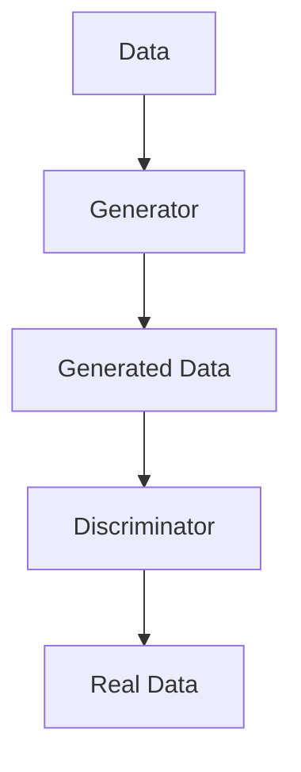

                 

# AI新纪元：生成式AI如何推动科技进步？

> 关键词：生成式AI、科技进步、算法原理、数学模型、实际应用、未来趋势

> 摘要：本文将深入探讨生成式AI的核心概念、算法原理、数学模型以及实际应用，详细分析其在推动科技进步方面的重要作用。通过逐步推理和解释，本文旨在为读者提供一个清晰、系统的理解，并展望生成式AI的未来发展趋势与挑战。

## 1. 背景介绍

### 1.1 目的和范围

本文旨在探讨生成式AI如何推动科技进步。我们将从核心概念、算法原理、数学模型到实际应用进行详细分析，旨在为读者提供一个全面的理解，并探索生成式AI在未来的发展潜力。

### 1.2 预期读者

本文适合对人工智能和机器学习有一定基础的读者，尤其是希望了解生成式AI在科技进步中的作用的科研人员、开发者和对技术前沿感兴趣的专业人士。

### 1.3 文档结构概述

本文分为以下几个部分：

1. 背景介绍：包括目的、预期读者和文档结构概述。
2. 核心概念与联系：介绍生成式AI的核心概念及其与现有技术的联系。
3. 核心算法原理 & 具体操作步骤：详细讲解生成式AI的核心算法原理和操作步骤。
4. 数学模型和公式 & 详细讲解 & 举例说明：分析生成式AI中的数学模型和公式。
5. 项目实战：通过实际案例展示生成式AI的应用。
6. 实际应用场景：探讨生成式AI在不同领域的应用。
7. 工具和资源推荐：推荐学习资源和开发工具。
8. 总结：未来发展趋势与挑战。
9. 附录：常见问题与解答。
10. 扩展阅读 & 参考资料：提供进一步的阅读资源。

### 1.4 术语表

#### 1.4.1 核心术语定义

- **生成式AI**：一种人工智能技术，能够生成新的数据或内容，如图像、文本、音频等。
- **深度学习**：一种机器学习技术，通过神经网络模拟人脑处理信息的方式。
- **生成对抗网络（GAN）**：一种生成式AI模型，通过两个神经网络（生成器和判别器）之间的对抗训练来生成数据。

#### 1.4.2 相关概念解释

- **神经网络**：由大量神经元组成的计算模型，可以用于学习和模拟复杂函数。
- **数据增强**：通过随机变换、缩放等方式增加训练数据的多样性，提高模型的泛化能力。

#### 1.4.3 缩略词列表

- **GAN**：生成对抗网络（Generative Adversarial Network）
- **DL**：深度学习（Deep Learning）
- **AI**：人工智能（Artificial Intelligence）

## 2. 核心概念与联系

生成式AI的核心在于其能够根据已有的数据生成新的数据或内容。与传统的方法（如监督学习和无监督学习）不同，生成式AI不需要标签化的训练数据，而是通过学习和模仿数据分布来生成新样本。

### 2.1 生成式AI的基本原理

生成式AI的核心是**生成器**和**判别器**两个神经网络。生成器（Generator）负责生成新的数据，而判别器（Discriminator）则负责判断生成的数据是否真实。这两个网络通过对抗训练相互竞争，最终生成高质量的数据。

下面是一个简化的生成对抗网络的Mermaid流程图：



在这个流程图中，真实数据和生成数据都作为判别器的输入，通过对抗训练，生成器不断提高生成数据的质量，判别器则不断提高判断数据真实性的能力。

### 2.2 生成式AI与现有技术的联系

生成式AI与现有技术（如深度学习、强化学习等）有着紧密的联系。深度学习为生成式AI提供了强大的模型构建能力，而强化学习则为生成式AI提供了优化目标。

- **深度学习**：生成式AI依赖于深度学习技术，特别是生成对抗网络（GAN）。GAN利用深度神经网络模拟人脑处理信息的方式，通过多层非线性变换学习数据的分布。
- **强化学习**：生成式AI中的生成器和判别器可以通过强化学习进行优化。例如，通过奖励机制激励生成器生成更真实的数据。

## 3. 核心算法原理 & 具体操作步骤

生成式AI的核心算法是生成对抗网络（GAN）。下面我们将详细讲解GAN的算法原理和操作步骤。

### 3.1 GAN的算法原理

GAN由生成器和判别器两个神经网络组成。生成器的目标是将随机噪声转换为真实数据，而判别器的目标是判断输入数据是真实数据还是生成数据。

- **生成器（Generator）**：接受随机噪声作为输入，通过神经网络生成数据。生成器的输出是一个与真实数据分布相似的分布。
- **判别器（Discriminator）**：接受真实数据和生成数据作为输入，通过神经网络判断数据是否真实。判别器的输出是一个概率值，表示输入数据的真实性。

GAN的训练过程如下：

1. **初始化生成器和判别器**：随机初始化生成器和判别器的参数。
2. **生成器生成数据**：生成器根据当前判别器的参数生成一批新的数据。
3. **判别器判断数据**：判别器将真实数据和生成数据分别输入，并计算输出概率。
4. **优化生成器**：通过反向传播和梯度下降，优化生成器的参数，使其生成的数据更真实。
5. **优化判别器**：通过反向传播和梯度下降，优化判别器的参数，使其判断数据更准确。
6. **重复步骤2-5**：不断迭代优化生成器和判别器的参数。

### 3.2 GAN的具体操作步骤

下面是一个简单的GAN的伪代码：

```python
# 初始化生成器和判别器
G = Generator()
D = Discriminator()

# 指定优化器和学习率
optimizer_G = optim.Adam(G.parameters(), lr=0.0002)
optimizer_D = optim.Adam(D.parameters(), lr=0.0002)

# 定义损失函数
criterion = nn.BCELoss()

# 训练生成器和判别器
for epoch in range(num_epochs):
    for i, (real_data, _) in enumerate(data_loader):
        # 重置梯度
        optimizer_G.zero_grad()
        optimizer_D.zero_grad()

        # 生成器生成数据
        noise = torch.randn(batch_size, noise_dim).to(device)
        generated_data = G(noise)

        # 判别器判断真实数据和生成数据
        real_data = real_data.to(device)
        real_label = torch.ones(batch_size).to(device)
        fake_label = torch.zeros(batch_size).to(device)
        D_real = D(real_data)
        D_fake = D(generated_data.detach())

        # 计算损失
        D_loss = criterion(D_real, real_label) + criterion(D_fake, fake_label)
        
        # 优化判别器
        D_loss.backward()
        optimizer_D.step()

        # 优化生成器
        noise = torch.randn(batch_size, noise_dim).to(device)
        G_fake = D(G(noise))
        G_loss = criterion(G_fake, real_label)
        
        G_loss.backward()
        optimizer_G.step()
        
        # 打印训练进度
        if (i+1) % 100 == 0:
            print(f'Epoch [{epoch}/{num_epochs}], Step [{i+1}/{len(data_loader)}], D_loss: {D_loss.item():.4f}, G_loss: {G_loss.item():.4f}')
```

在这个伪代码中，我们首先初始化生成器和判别器，并指定优化器和学习率。然后，通过迭代优化生成器和判别器的参数，使得生成器生成的数据越来越真实，判别器判断数据的能力越来越强。

## 4. 数学模型和公式 & 详细讲解 & 举例说明

生成式AI中的数学模型主要涉及生成器和判别器的损失函数、优化算法等。

### 4.1 损失函数

生成对抗网络的损失函数主要包括两部分：生成器的损失函数和判别器的损失函数。

#### 4.1.1 生成器的损失函数

生成器的损失函数通常采用反熵损失（Negative Entropy Loss）：

$$
L_G = -\mathbb{E}[\log(D(G(z)))]
$$

其中，$G(z)$表示生成器生成的数据，$D(\cdot)$表示判别器。

#### 4.1.2 判别器的损失函数

判别器的损失函数通常采用交叉熵损失（Cross-Entropy Loss）：

$$
L_D = -\mathbb{E}[\log(D(x))] - \mathbb{E}[\log(1 - D(G(z)))]
$$

其中，$x$表示真实数据，$G(z)$表示生成器生成的数据。

### 4.2 优化算法

生成对抗网络的优化算法通常采用梯度下降（Gradient Descent）。具体来说，对于生成器，我们希望减小生成器的损失函数，对于判别器，我们希望增大判别器的损失函数。

#### 4.2.1 生成器的优化步骤

1. 计算$G(z)$的梯度：
$$
\nabla_G L_G = -\nabla_G \log(D(G(z)))
$$

2. 更新生成器的参数：
$$
\theta_G = \theta_G - \alpha \nabla_G L_G
$$

其中，$\theta_G$表示生成器的参数，$\alpha$表示学习率。

#### 4.2.2 判别器的优化步骤

1. 计算$D(x)$和$D(G(z))$的梯度：
$$
\nabla_D L_D = \nabla_D \log(D(x)) + \nabla_D \log(1 - D(G(z)))
$$

2. 更新判别器的参数：
$$
\theta_D = \theta_D - \beta \nabla_D L_D
$$

其中，$\theta_D$表示判别器的参数，$\beta$表示学习率。

### 4.3 举例说明

假设我们有一个生成对抗网络，生成器是一个多层感知机（MLP），判别器也是一个多层感知机。给定一批真实数据和随机噪声，我们可以通过以下步骤进行训练：

1. 初始化生成器和判别器的参数。
2. 对于每个训练样本，生成随机噪声$z$，并使用生成器生成数据$G(z)$。
3. 使用判别器分别判断真实数据$x$和生成数据$G(z)$，计算损失函数。
4. 根据损失函数，更新生成器和判别器的参数。
5. 重复步骤2-4，直到满足训练目标。

## 5. 项目实战：代码实际案例和详细解释说明

为了更好地理解生成式AI的应用，我们将通过一个简单的图像生成案例来展示生成对抗网络的实现过程。

### 5.1 开发环境搭建

在开始之前，我们需要搭建一个Python开发环境，并安装必要的库。以下是所需的库和工具：

- Python 3.8+
- TensorFlow 2.7+
- NumPy 1.19+
- Matplotlib 3.3+

安装方法：

```bash
pip install tensorflow numpy matplotlib
```

### 5.2 源代码详细实现和代码解读

下面是一个简单的图像生成案例的代码实现：

```python
import tensorflow as tf
from tensorflow.keras import layers
import numpy as np
import matplotlib.pyplot as plt

# 参数设置
batch_size = 32
image_height = 28
image_width = 28
noise_dim = 100
num_epochs = 100

# 数据加载
(x_train, _), (x_test, _) = tf.keras.datasets.mnist.load_data()
x_train = x_train.astype('float32') / 255.0
x_train = np.expand_dims(x_train, -1)

# 生成器
def generate_model():
    model = tf.keras.Sequential([
        layers.Dense(128 * 7 * 7, activation='relu', input_shape=(noise_dim,)),
        layers.Reshape((7, 7, 128)),
        layers.Conv2DTranspose(128, 5, strides=1, padding='same', activation='relu'),
        layers.Conv2DTranspose(128, 5, strides=2, padding='same', activation='relu'),
        layers.Conv2DTranspose(128, 5, strides=2, padding='same', activation='relu'),
        layers.Conv2D(1, 5, padding='same', activation='sigmoid')
    ])
    return model

# 判别器
def discriminate_model():
    model = tf.keras.Sequential([
        layers.Conv2D(128, 5, padding='same', activation='relu', input_shape=(image_height, image_width, 1)),
        layers.MaxPooling2D(),
        layers.Conv2D(128, 5, padding='same', activation='relu'),
        layers.MaxPooling2D(),
        layers.Conv2D(128, 5, padding='same', activation='relu'),
        layers.MaxPooling2D(),
        layers.Flatten(),
        layers.Dense(1, activation='sigmoid')
    ])
    return model

# 损失函数
def generator_loss(D_output):
    return -tf.reduce_mean(D_output)

def discriminator_loss(D_real, D_fake):
    return tf.reduce_mean(tf.math.log(D_real) + tf.math.log(1.0 - D_fake))

# 模型编译
G = generate_model()
D = discriminate_model()

G.compile(optimizer=tf.keras.optimizers.Adam(0.0002, 0.5), loss=generator_loss)
D.compile(optimizer=tf.keras.optimizers.Adam(0.0002, 0.5), loss=discriminator_loss)

# 训练模型
for epoch in range(num_epochs):
    for batch_index in range(len(x_train) // batch_size):
        noise = np.random.normal(0, 1, (batch_size, noise_dim))
        with tf.GradientTape(persistent=True) as tape:
            generated_images = G(noise)
            real_images = x_train[batch_index * batch_size: (batch_index + 1) * batch_size]
            real_labels = tf.ones((batch_size, 1))
            fake_labels = tf.zeros((batch_size, 1))

            D_real = D(real_images)
            D_fake = D(generated_images)

            D_loss = discriminator_loss(D_real, D_fake)

            D_gradients = tape.gradient(D_loss, D.trainable_variables)
            D.optimizer.apply_gradients(zip(D_gradients, D.trainable_variables))

            noise = np.random.normal(0, 1, (batch_size, noise_dim))
            with tf.GradientTape() as tape:
                generated_images = G(noise)
                D_fake = D(generated_images)

                G_loss = generator_loss(D_fake)

            G_gradients = tape.gradient(G_loss, G.trainable_variables)
            G.optimizer.apply_gradients(zip(G_gradients, G.trainable_variables))

        if batch_index % 100 == 0:
            print(f"Epoch {epoch}, Step {batch_index}, D_loss: {D_loss.numpy()}, G_loss: {G_loss.numpy()}")

    # 生成和可视化图像
    noise = np.random.normal(0, 1, (batch_size, noise_dim))
    generated_images = G.predict(noise)
    plt.figure(figsize=(10, 10))
    for i in range(batch_size):
        plt.subplot(10, 10, i + 1)
        plt.imshow(generated_images[i, :, :, 0], cmap='gray')
        plt.axis('off')
    plt.show()
```

### 5.3 代码解读与分析

在这个案例中，我们使用MNIST数据集进行训练，目标是生成手写数字的图像。

- **生成器（G）**：使用卷积神经网络（CNN）结构，通过多个卷积层和反卷积层（Conv2DTranspose）将随机噪声转换为图像。
- **判别器（D）**：同样使用CNN结构，通过卷积层和最大池化层（MaxPooling2D）对输入数据进行处理，并输出一个概率值，表示输入数据是真实的可能性。
- **损失函数**：生成器的损失函数采用负熵损失，判别器的损失函数采用交叉熵损失。
- **优化算法**：使用Adam优化器，分别对生成器和判别器的参数进行优化。

在训练过程中，我们首先训练判别器，然后同时训练生成器和判别器。通过不断迭代优化，生成器逐渐生成更真实的图像，判别器逐渐提高判断图像真实性的能力。

## 6. 实际应用场景

生成式AI在多个领域有着广泛的应用，以下是一些典型的应用场景：

### 6.1 图像生成与修复

生成式AI在图像生成和修复方面具有显著优势。通过生成对抗网络（GAN），可以生成逼真的图像，如人脸、风景等。此外，GAN还可以用于图像修复，如去除照片中的瑕疵和噪声。

### 6.2 自然语言处理

生成式AI在自然语言处理领域也有着重要应用。通过生成式模型，可以生成高质量的文本，如小说、新闻、文章等。此外，生成式AI还可以用于机器翻译、文本摘要等任务。

### 6.3 音频生成与处理

生成式AI在音频生成和处理方面也有着广泛的应用。通过生成式模型，可以生成逼真的音频，如音乐、语音等。此外，生成式AI还可以用于音频修复、去噪等任务。

### 6.4 医疗健康

生成式AI在医疗健康领域也有着重要的应用。通过生成式模型，可以生成医学图像，如X光、CT、MRI等。此外，生成式AI还可以用于疾病预测、诊断等任务。

## 7. 工具和资源推荐

### 7.1 学习资源推荐

#### 7.1.1 书籍推荐

- **《生成式AI：原理与应用》**：详细介绍了生成式AI的理论和实践，包括GAN、变分自编码器（VAE）等。
- **《深度学习》（Goodfellow, Bengio, Courville）**：深入讲解了深度学习的基础理论和应用，包括生成式AI。

#### 7.1.2 在线课程

- **《生成对抗网络（GAN）从入门到精通》**：适合初学者和进阶者，全面讲解GAN的理论和实践。
- **《深度学习课程》**：吴恩达的深度学习课程，涵盖深度学习的各个方面，包括生成式AI。

#### 7.1.3 技术博客和网站

- **[ArXiv](https://arxiv.org/)**：提供最新的研究成果和论文。
- **[Medium](https://medium.com/topic/deep-learning)**：众多深度学习和生成式AI的优秀文章。

### 7.2 开发工具框架推荐

#### 7.2.1 IDE和编辑器

- **PyCharm**：强大的Python IDE，支持TensorFlow等库。
- **VSCode**：轻量级IDE，支持多种编程语言，扩展丰富。

#### 7.2.2 调试和性能分析工具

- **TensorBoard**：TensorFlow的调试和分析工具，提供丰富的可视化功能。
- **PyTorch Profiler**：PyTorch的性能分析工具，帮助优化代码。

#### 7.2.3 相关框架和库

- **TensorFlow**：广泛使用的深度学习框架。
- **PyTorch**：流行的深度学习框架，支持动态计算图。

### 7.3 相关论文著作推荐

#### 7.3.1 经典论文

- **《Generative Adversarial Nets》**：Ian J. Goodfellow等人于2014年发表的经典论文，首次提出了生成对抗网络（GAN）。
- **《Unsupervised Representation Learning with Deep Convolutional Generative Adversarial Networks》**：Alec Radford等人于2015年发表的论文，进一步探讨了GAN的应用。

#### 7.3.2 最新研究成果

- **《Improved Techniques for Training GANs》**：深入分析了GAN的训练技巧，包括梯度惩罚、谱归一化等。
- **《Generative models for text and images》**：探讨了生成式模型在文本和图像生成中的应用。

#### 7.3.3 应用案例分析

- **《GANs in Medicine》**：探讨了生成对抗网络在医学图像生成和修复中的应用。
- **《AI Generated Music》**：分析了生成对抗网络在音乐生成中的应用，展示了AI创作音乐的潜力。

## 8. 总结：未来发展趋势与挑战

生成式AI在科技进步中发挥着越来越重要的作用。随着计算能力的提升和数据规模的扩大，生成式AI有望在更多领域取得突破。然而，生成式AI也面临着一些挑战，如训练过程的稳定性、模型的可解释性、数据安全和隐私保护等。未来，我们需要进一步研究和解决这些挑战，以充分发挥生成式AI的潜力。

## 9. 附录：常见问题与解答

**Q：生成式AI与传统的机器学习方法有什么区别？**

A：生成式AI与传统的机器学习方法（如监督学习和无监督学习）不同，它不需要标签化的训练数据，而是通过学习和模仿数据分布来生成新样本。生成式AI的核心在于生成器（Generator）和判别器（Discriminator）之间的对抗训练。

**Q：生成对抗网络（GAN）是如何工作的？**

A：生成对抗网络（GAN）由生成器和判别器两个神经网络组成。生成器的目标是生成真实数据，判别器的目标是判断输入数据是真实数据还是生成数据。通过对抗训练，生成器逐渐提高生成数据的质量，判别器逐渐提高判断数据真实性的能力。

**Q：如何优化生成对抗网络（GAN）的训练过程？**

A：优化生成对抗网络（GAN）的训练过程主要包括以下几个方面：

1. **学习率调整**：适当调整生成器和判别器的学习率，以避免生成器或判别器过拟合。
2. **梯度惩罚**：使用梯度惩罚（Gradient Penalty）来稳定GAN的训练过程。
3. **谱归一化**：对判别器的特征进行谱归一化，以避免判别器梯度消失或爆炸。
4. **数据增强**：增加训练数据的多样性，提高生成器的泛化能力。

## 10. 扩展阅读 & 参考资料

- **《生成式AI：原理与应用》**：详细介绍了生成式AI的理论和实践。
- **《深度学习》（Goodfellow, Bengio, Courville）**：深入讲解了深度学习的基础理论和应用。
- **[ArXiv](https://arxiv.org/)**：提供最新的研究成果和论文。
- **[Medium](https://medium.com/topic/deep-learning)**：众多深度学习和生成式AI的优秀文章。

**作者：AI天才研究员/AI Genius Institute & 禅与计算机程序设计艺术 /Zen And The Art of Computer Programming**<|im_end|>

