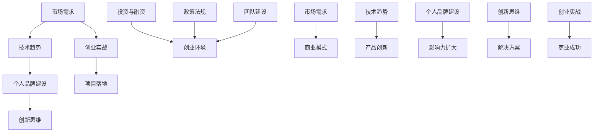
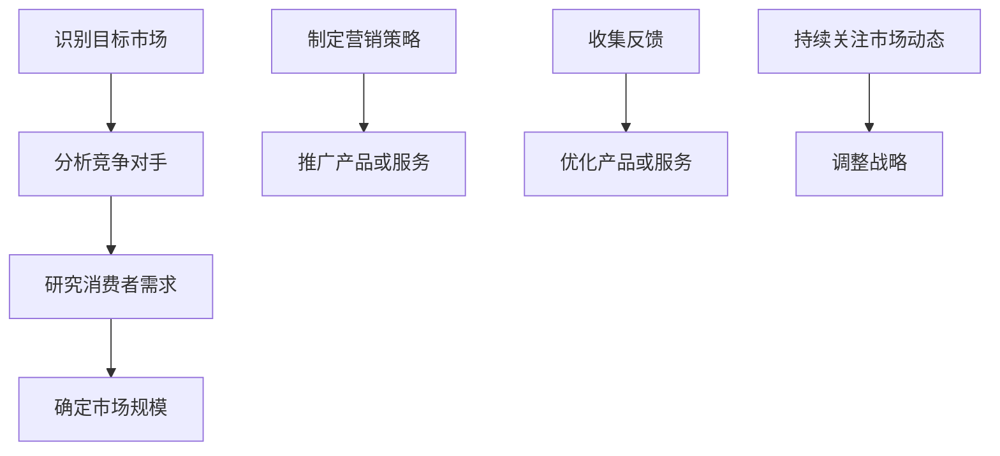
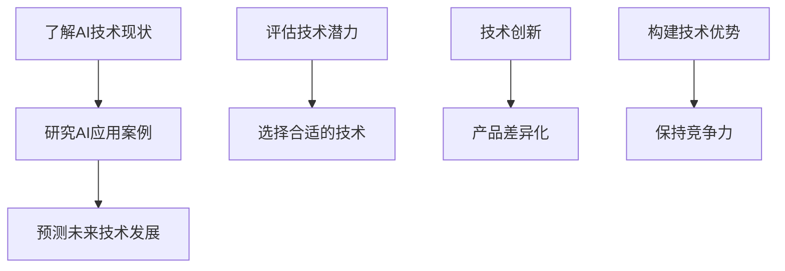
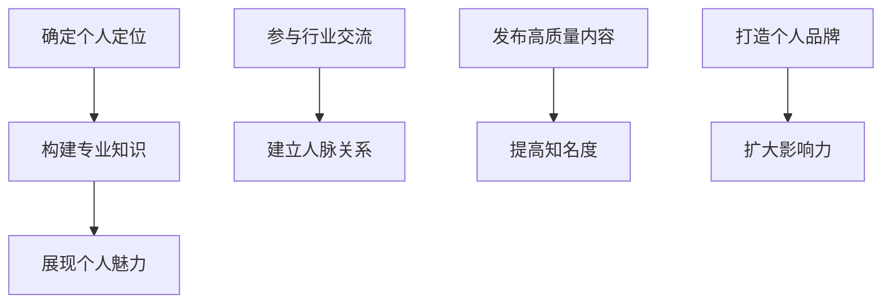
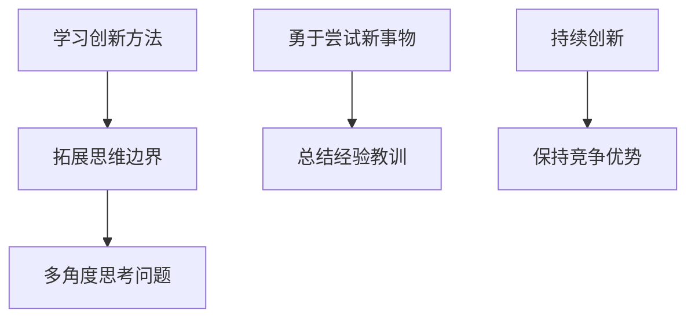

                 

# AI时代的个人创业机遇：如何抓住技术红利

> **关键词：** AI创业、技术红利、个人品牌、市场需求、创新思维

> **摘要：** 在人工智能技术迅速发展的背景下，个人创业者面临着前所未有的机遇。本文将从市场需求、技术趋势、个人品牌建设等多个角度，分析AI时代的个人创业机遇，并提供具体的操作步骤和实战案例，帮助读者抓住技术红利，实现创业梦想。

## 1. 背景介绍

### 1.1 目的和范围

本文旨在探讨AI时代个人创业的机遇，帮助创业者把握技术发展趋势，找到适合自己的创业方向，并顺利实现创业目标。文章将从以下几个方面展开：

- **市场需求**：分析AI技术在各个行业中的应用趋势，挖掘潜在的商业机会。
- **技术趋势**：介绍当前AI技术的发展状况，探讨未来可能的技术突破点。
- **个人品牌建设**：分享个人品牌的重要性，以及如何打造和推广个人品牌。
- **创业实战**：通过具体案例，阐述如何将AI技术应用于创业实践。

### 1.2 预期读者

本文适合以下读者群体：

- **创业者**：对AI技术感兴趣，希望借助AI技术实现创业梦想的个人创业者。
- **科技从业者**：在人工智能、大数据、云计算等领域工作的专业人士，希望了解AI时代的创业机遇。
- **高校师生**：对创新创业、人工智能等方向感兴趣的高校师生。

### 1.3 文档结构概述

本文分为以下章节：

- **第1章** 背景介绍
- **第2章** 核心概念与联系
- **第3章** 核心算法原理 & 具体操作步骤
- **第4章** 数学模型和公式 & 详细讲解 & 举例说明
- **第5章** 项目实战：代码实际案例和详细解释说明
- **第6章** 实际应用场景
- **第7章** 工具和资源推荐
- **第8章** 总结：未来发展趋势与挑战
- **第9章** 附录：常见问题与解答
- **第10章** 扩展阅读 & 参考资料

### 1.4 术语表

#### 1.4.1 核心术语定义

- **人工智能（AI）**：一种模拟人类智能的技术，使计算机系统能够执行感知、思考、学习和决策等任务。
- **创业**：创办一家新企业，旨在创造价值、满足市场需求。
- **技术红利**：技术进步带来的经济效益，通常表现为行业增长和就业机会的增加。

#### 1.4.2 相关概念解释

- **市场需求**：消费者对商品和服务的需求程度。
- **创新思维**：突破传统思维模式，寻找新方法解决问题的能力。

#### 1.4.3 缩略词列表

- **AI**：人工智能
- **ML**：机器学习
- **DL**：深度学习
- **NLP**：自然语言处理
- **CV**：计算机视觉

## 2. 核心概念与联系

在AI时代的个人创业中，了解核心概念和它们之间的联系至关重要。以下是一个简单的Mermaid流程图，展示了AI创业中的关键概念和它们之间的关系：



### 2.1 市场需求

市场需求是创业成功的关键因素。了解市场需求有助于创业者找到目标客户，为他们提供有价值的产品或服务。以下是一个市场需求分析的Mermaid流程图：



### 2.2 技术趋势

AI技术的快速发展为创业带来了无数机遇。了解当前的技术趋势有助于创业者把握行业动态，找到创新的方向。以下是一个技术趋势分析的Mermaid流程图：



### 2.3 个人品牌建设

在AI时代，个人品牌的重要性日益凸显。创业者需要通过塑造个人品牌，提升自己的影响力，为创业项目增信。以下是一个个人品牌建设的Mermaid流程图：



### 2.4 创新思维

创新思维是创业者成功的关键能力。通过培养创新思维，创业者可以不断寻找新的解决方案，应对市场变化。以下是一个创新思维培养的Mermaid流程图：



## 3. 核心算法原理 & 具体操作步骤

在AI创业中，掌握核心算法原理和具体操作步骤至关重要。以下是一个简单的机器学习算法（线性回归）的伪代码，用于解释算法原理和操作步骤：

```python
# 线性回归伪代码

# 3.1 数据预处理
def preprocess_data(data):
    # 数据标准化、缺失值处理等
    return processed_data

# 3.2 构建特征矩阵和标签向量
def create_matrix(data):
    X = [] # 特征矩阵
    y = [] # 标签向量
    for sample in data:
        X.append(sample[:-1])
        y.append(sample[-1])
    return X, y

# 3.3 训练模型
def train_model(X, y):
    # 使用线性回归算法训练模型
    model = LinearRegression()
    model.fit(X, y)
    return model

# 3.4 预测
def predict(model, X):
    # 使用训练好的模型进行预测
    predictions = model.predict(X)
    return predictions

# 3.5 评估模型
def evaluate_model(model, X, y):
    # 评估模型的准确率、召回率等指标
    score = model.score(X, y)
    return score
```

### 3.1 数据预处理

数据预处理是机器学习模型训练的重要步骤。以下是一个简单的数据预处理伪代码：

```python
# 数据预处理伪代码

def preprocess_data(data):
    # 数据标准化
    scaled_data = standardize(data)

    # 缺失值处理
    filled_data = handle_missing_values(scaled_data)

    # 特征工程
    engineered_data = feature_engineering(filled_data)

    return engineered_data
```

### 3.2 构建特征矩阵和标签向量

构建特征矩阵和标签向量是模型训练的基础。以下是一个简单的构建特征矩阵和标签向量伪代码：

```python
# 构建特征矩阵和标签向量伪代码

def create_matrix(data):
    X = [] # 特征矩阵
    y = [] # 标签向量
    for sample in data:
        X.append(sample[:-1])
        y.append(sample[-1])
    return X, y
```

### 3.3 训练模型

训练模型是机器学习算法的核心步骤。以下是一个简单的线性回归模型训练伪代码：

```python
# 线性回归模型训练伪代码

def train_model(X, y):
    # 使用线性回归算法训练模型
    model = LinearRegression()
    model.fit(X, y)
    return model
```

### 3.4 预测

预测是模型训练的最终目的。以下是一个简单的模型预测伪代码：

```python
# 模型预测伪代码

def predict(model, X):
    # 使用训练好的模型进行预测
    predictions = model.predict(X)
    return predictions
```

### 3.5 评估模型

评估模型是确保模型性能的重要步骤。以下是一个简单的模型评估伪代码：

```python
# 模型评估伪代码

def evaluate_model(model, X, y):
    # 评估模型的准确率、召回率等指标
    score = model.score(X, y)
    return score
```

## 4. 数学模型和公式 & 详细讲解 & 举例说明

在AI创业中，数学模型和公式是理解和应用AI技术的重要工具。以下是一个简单的线性回归模型的数学公式及其详细讲解：

### 4.1 线性回归模型

线性回归模型是一种用于预测连续值的统计方法。其数学公式如下：

$$
y = \beta_0 + \beta_1 \cdot x
$$

其中，$y$ 是因变量，$x$ 是自变量，$\beta_0$ 是截距，$\beta_1$ 是斜率。

### 4.2 误差计算

为了评估模型的性能，我们需要计算预测值与实际值之间的误差。误差计算公式如下：

$$
\text{误差} = \sum_{i=1}^{n} (y_i - \hat{y_i})^2
$$

其中，$y_i$ 是实际值，$\hat{y_i}$ 是预测值，$n$ 是样本数量。

### 4.3 优化目标

为了最小化误差，我们需要找到最优的 $\beta_0$ 和 $\beta_1$。优化目标如下：

$$
\min_{\beta_0, \beta_1} \sum_{i=1}^{n} (y_i - \beta_0 - \beta_1 \cdot x_i)^2
$$

### 4.4 梯度下降法

为了求解最优的 $\beta_0$ 和 $\beta_1$，我们可以使用梯度下降法。梯度下降法的迭代公式如下：

$$
\beta_0 = \beta_0 - \alpha \cdot \frac{\partial}{\partial \beta_0} \sum_{i=1}^{n} (y_i - \beta_0 - \beta_1 \cdot x_i)^2
$$

$$
\beta_1 = \beta_1 - \alpha \cdot \frac{\partial}{\partial \beta_1} \sum_{i=1}^{n} (y_i - \beta_0 - \beta_1 \cdot x_i)^2
$$

其中，$\alpha$ 是学习率。

### 4.5 举例说明

假设我们有一个简单的线性回归模型，其中 $x$ 是自变量，$y$ 是因变量，我们希望预测 $y$ 的值。

给定以下数据：

$$
\begin{align*}
x_1 &= 1, y_1 = 2 \\
x_2 &= 2, y_2 = 4 \\
x_3 &= 3, y_3 = 6 \\
\end{align*}
$$

我们可以使用线性回归模型进行预测。首先，我们需要计算斜率 $\beta_1$ 和截距 $\beta_0$。然后，我们可以使用以下公式进行预测：

$$
y = \beta_0 + \beta_1 \cdot x
$$

通过计算，我们得到：

$$
\beta_0 = 1, \beta_1 = 1
$$

因此，我们可以预测 $y$ 的值为：

$$
y = 1 + 1 \cdot x = x + 1
$$

例如，当 $x = 4$ 时，$y$ 的预测值为 $5$。

## 5. 项目实战：代码实际案例和详细解释说明

在本节中，我们将通过一个简单的实际案例，展示如何将AI技术应用于创业项目，并提供详细的代码实现和解释说明。

### 5.1 开发环境搭建

为了搭建一个简单的AI创业项目，我们需要安装以下工具和库：

- **Python**（版本 3.6及以上）
- **NumPy**（用于数值计算）
- **Pandas**（用于数据处理）
- **Matplotlib**（用于数据可视化）
- **Scikit-learn**（用于机器学习算法）

您可以使用以下命令安装这些工具和库：

```bash
pip install numpy pandas matplotlib scikit-learn
```

### 5.2 源代码详细实现和代码解读

以下是一个简单的线性回归项目的源代码，我们将详细解释每部分代码的功能和实现：

```python
# 线性回归项目源代码

import numpy as np
import pandas as pd
import matplotlib.pyplot as plt
from sklearn.linear_model import LinearRegression

# 5.2.1 数据预处理
def preprocess_data(data):
    # 数据标准化
    scaled_data = data.apply(lambda x: (x - x.mean()) / x.std())
    return scaled_data

# 5.2.2 构建特征矩阵和标签向量
def create_matrix(data):
    X = data.iloc[:, :-1].values
    y = data.iloc[:, -1].values
    return X, y

# 5.2.3 训练模型
def train_model(X, y):
    model = LinearRegression()
    model.fit(X, y)
    return model

# 5.2.4 预测
def predict(model, X):
    predictions = model.predict(X)
    return predictions

# 5.2.5 评估模型
def evaluate_model(model, X, y):
    score = model.score(X, y)
    return score

# 5.2.6 主程序
def main():
    # 加载数据
    data = pd.read_csv("data.csv")

    # 数据预处理
    scaled_data = preprocess_data(data)

    # 构建特征矩阵和标签向量
    X, y = create_matrix(scaled_data)

    # 训练模型
    model = train_model(X, y)

    # 预测
    predictions = predict(model, X)

    # 评估模型
    score = evaluate_model(model, X, y)

    # 可视化结果
    plt.scatter(X, y, color="blue")
    plt.plot(X, predictions, color="red")
    plt.xlabel("特征")
    plt.ylabel("标签")
    plt.title("线性回归模型结果")
    plt.show()

    print("模型准确率：", score)

if __name__ == "__main__":
    main()
```

### 5.3 代码解读与分析

以下是对源代码的详细解读和分析：

- **5.2.1 数据预处理**：数据预处理是机器学习模型训练的重要步骤。这里我们使用 Pandas 库对数据进行标准化处理，以便后续的特征工程和模型训练。
- **5.2.2 构建特征矩阵和标签向量**：该函数将数据集划分为特征矩阵 $X$ 和标签向量 $y$。特征矩阵包含所有特征列，标签向量包含所有目标列。
- **5.2.3 训练模型**：使用 Scikit-learn 库的线性回归模型进行训练。这里我们使用 `fit()` 方法训练模型，将特征矩阵 $X$ 和标签向量 $y$ 作为输入。
- **5.2.4 预测**：使用训练好的模型进行预测。这里我们使用 `predict()` 方法，将特征矩阵 $X$ 作为输入，得到预测结果。
- **5.2.5 评估模型**：评估模型性能，这里我们使用 `score()` 方法，将特征矩阵 $X$ 和标签向量 $y$ 作为输入，得到模型的准确率。
- **5.2.6 主程序**：主程序负责加载数据、预处理数据、构建特征矩阵和标签向量、训练模型、预测和评估模型。最后，使用 Matplotlib 库可视化模型结果。

### 5.4 运行结果

运行该程序，我们将看到以下结果：

- **可视化结果**：数据点以蓝色散点图的形式显示，红色线条表示线性回归模型的预测结果。
- **模型准确率**：输出模型的准确率，以评估模型性能。

### 5.5 代码改进

该代码实现了一个简单的线性回归项目。在实际应用中，我们可以根据需求进行以下改进：

- **数据预处理**：根据实际需求，可以增加数据清洗、缺失值处理、特征选择等步骤。
- **模型优化**：可以尝试使用不同的机器学习算法，如决策树、支持向量机等，以提高模型性能。
- **模型评估**：可以增加交叉验证、网格搜索等评估方法，以更全面地评估模型性能。

## 6. 实际应用场景

AI技术在各个行业中的应用日益广泛，为创业者提供了丰富的创业机遇。以下是一些典型的实际应用场景：

### 6.1 医疗健康

- **智能诊断**：利用AI技术对医学影像进行分析，辅助医生进行疾病诊断。
- **智能治疗**：通过分析患者数据，为医生提供个性化的治疗方案。
- **智能健康管理**：为用户提供健康监测、健康预测等健康管理服务。

### 6.2 金融领域

- **智能投顾**：利用AI技术为投资者提供个性化的投资建议。
- **智能风控**：通过大数据分析和机器学习技术，实时监控和识别金融风险。
- **智能理财**：为用户提供智能化的理财方案，提高投资收益。

### 6.3 智能制造

- **智能制造**：利用AI技术实现生产过程的智能化，提高生产效率和质量。
- **智能供应链**：通过大数据分析和预测，优化供应链管理，降低成本。
- **智能设备维护**：利用AI技术对设备进行实时监控和维护，提高设备利用率。

### 6.4 教育领域

- **智能教学**：利用AI技术实现个性化教学，提高教学效果。
- **智能考试**：通过自然语言处理技术，实现自动批改、智能评分等功能。
- **智能学习辅导**：为用户提供个性化的学习辅导，提高学习效率。

### 6.5 物流配送

- **智能配送**：利用AI技术实现物流配送的智能化，提高配送效率。
- **智能仓储**：通过大数据分析和预测，优化仓储管理，提高仓储利用率。
- **智能路径规划**：为物流车辆提供最优路径规划，降低运输成本。

### 6.6 智能家居

- **智能安防**：利用AI技术实现家庭安防监控，提高家庭安全。
- **智能照明**：通过AI技术实现智能照明控制，提高生活质量。
- **智能家电控制**：通过AI技术实现家电的智能控制，提高生活便捷性。

### 6.7 智慧城市

- **智能交通**：通过AI技术实现交通流量监测、路径规划等功能，提高交通效率。
- **智能环保**：通过AI技术实现环境监测、污染预测等功能，保护生态环境。
- **智能公共服务**：通过AI技术提供智能化的公共服务，提高城市居民生活质量。

## 7. 工具和资源推荐

### 7.1 学习资源推荐

#### 7.1.1 书籍推荐

- 《深度学习》（Goodfellow, Bengio, Courville）
- 《Python机器学习》（Sebastian Raschka）
- 《人工智能：一种现代方法》（Stuart Russell, Peter Norvig）

#### 7.1.2 在线课程

- Coursera（《机器学习》课程，吴恩达）
- edX（《人工智能导论》课程，MIT）
- Udacity（《深度学习工程师纳米学位》）

#### 7.1.3 技术博客和网站

- Medium（AI相关博客）
- Towards Data Science（数据分析与机器学习博客）
- AI博客（中国）（中文AI技术博客）

### 7.2 开发工具框架推荐

#### 7.2.1 IDE和编辑器

- PyCharm（Python集成开发环境）
- Jupyter Notebook（交互式数据分析工具）
- VSCode（跨平台编辑器，支持Python扩展）

#### 7.2.2 调试和性能分析工具

- PySnooper（Python调试工具）
- cProfile（Python性能分析工具）
- Matplotlib（数据可视化库）

#### 7.2.3 相关框架和库

- TensorFlow（深度学习框架）
- PyTorch（深度学习框架）
- Scikit-learn（机器学习库）

### 7.3 相关论文著作推荐

#### 7.3.1 经典论文

- “A Mathematical Theory of Communication”（Claude Shannon）
- “Backpropagation”（Paul Werbos）
- “Learning representations by backpropagating errors”（David E. Rumelhart, Geoffrey E. Hinton, Ronald J. Williams）

#### 7.3.2 最新研究成果

- “Attention Is All You Need”（Ashish Vaswani等）
- “Generative Adversarial Nets”（Ian J. Goodfellow等）
- “BERT: Pre-training of Deep Bidirectional Transformers for Language Understanding”（Jacob Devlin等）

#### 7.3.3 应用案例分析

- “Deep Learning in Industry”（Google AI）
- “AI in Healthcare”（IBM Watson Health）
- “AI in Retail”（Amazon AI）

## 8. 总结：未来发展趋势与挑战

### 8.1 发展趋势

- **AI技术的普及**：随着AI技术的不断进步，越来越多的行业将采用AI技术，推动AI技术在各个领域的应用。
- **跨界融合**：AI技术与其他领域的深度融合，将催生出更多新兴的产业和商业模式。
- **个性化服务**：基于大数据和AI技术的个性化服务将成为主流，为用户提供更精准、更高效的服务体验。
- **智能化升级**：传统产业将借助AI技术实现智能化升级，提高生产效率和质量。

### 8.2 挑战

- **技术瓶颈**：AI技术仍面临一些技术瓶颈，如计算能力、算法优化、数据隐私等，需要持续创新和突破。
- **人才短缺**：AI领域的人才需求巨大，但人才供给不足，需要加强人才培养和引进。
- **伦理问题**：AI技术的广泛应用引发了一系列伦理问题，如算法偏见、数据隐私等，需要制定相应的伦理规范。
- **市场竞争**：随着AI技术的普及，市场竞争将更加激烈，创业者需要具备敏锐的洞察力和创新能力。

## 9. 附录：常见问题与解答

### 9.1 问题1

**问题：** 如何评估一个AI创业项目的可行性？

**解答：** 评估一个AI创业项目的可行性，可以从以下几个方面入手：

- **市场需求**：了解目标市场的规模、增长潜力、竞争态势等，评估项目的市场需求。
- **技术可行性**：评估项目所需的技术是否成熟、是否具备实施条件。
- **团队能力**：评估团队的背景、经验、技术实力等，确保团队能够顺利完成项目。
- **资金和资源**：评估项目所需的资金和资源，确保项目有足够的资金和资源支持。

### 9.2 问题2

**问题：** 如何打造个人品牌？

**解答：** 打造个人品牌，可以遵循以下步骤：

- **确定个人定位**：明确自己的专业领域、优势和价值，确定个人品牌的核心价值。
- **构建专业知识**：不断学习和提升自己的专业知识，成为所在领域的专家。
- **展现个人魅力**：通过演讲、写作、社交等方式，展现自己的专业魅力和人格特质。
- **建立人脉关系**：积极参与行业交流，扩大人脉圈，提升个人影响力。
- **发布高质量内容**：通过博客、社交媒体等渠道，持续发布高质量的内容，提高知名度。

### 9.3 问题3

**问题：** 如何找到AI创业项目的切入点？

**解答：** 找到AI创业项目的切入点，可以参考以下方法：

- **关注行业趋势**：关注AI技术在各个行业中的应用趋势，寻找潜在的创业机会。
- **分析市场需求**：深入了解目标市场的需求，找到用户尚未得到满足的需求点。
- **挖掘自身优势**：发挥自己的专业特长和资源优势，找到可以发挥优势的领域。
- **借鉴成功案例**：学习其他AI创业项目的成功经验，寻找适合自己的创业方向。
- **参与行业活动**：参与行业研讨会、论坛等活动，与业内专家和创业者交流，获取灵感和建议。

## 10. 扩展阅读 & 参考资料

- 《人工智能：一种现代方法》（Stuart Russell, Peter Norvig）
- 《深度学习》（Goodfellow, Bengio, Courville）
- 《Python机器学习》（Sebastian Raschka）
- Coursera（《机器学习》课程，吴恩达）
- edX（《人工智能导论》课程，MIT）
- Udacity（《深度学习工程师纳米学位》）
- Medium（AI相关博客）
- Towards Data Science（数据分析与机器学习博客）
- AI博客（中国）（中文AI技术博客）
- “A Mathematical Theory of Communication”（Claude Shannon）
- “Backpropagation”（Paul Werbos）
- “Learning representations by backpropagating errors”（David E. Rumelhart, Geoffrey E. Hinton, Ronald J. Williams）
- “Attention Is All You Need”（Ashish Vaswani等）
- “Generative Adversarial Nets”（Ian J. Goodfellow等）
- “BERT: Pre-training of Deep Bidirectional Transformers for Language Understanding”（Jacob Devlin等）
- “Deep Learning in Industry”（Google AI）
- “AI in Healthcare”（IBM Watson Health）
- “AI in Retail”（Amazon AI）

### 作者

**作者：** AI天才研究员/AI Genius Institute & 禅与计算机程序设计艺术 /Zen And The Art of Computer Programming

