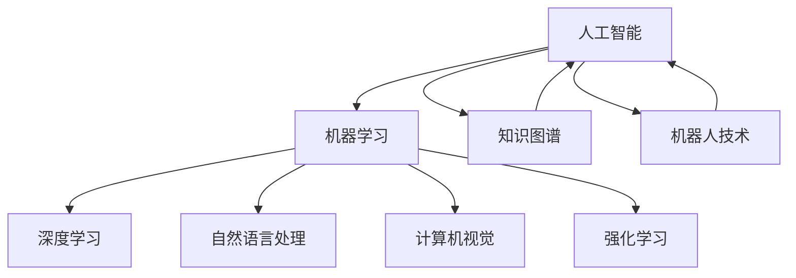

                 

# AI时代的个人技能培养方向

> 关键词：人工智能、个人技能、培养方向、技术趋势、职业发展

> 摘要：随着人工智能技术的飞速发展，个人技能的培养方向也发生了重大变化。本文将深入探讨AI时代下个人技能培养的必要性、核心方向和具体策略，帮助读者在人工智能浪潮中找到适合自己的发展路径，提升职业竞争力。

## 1. 背景介绍

### 1.1 目的和范围

本文旨在为在AI时代寻求职业发展的个人提供指导，分析当前AI技术发展的趋势，明确个人技能培养的重要性和方向，并提供实用的培养策略。

### 1.2 预期读者

本文适合以下读者：

- 有志于在人工智能领域发展的人员；
- 想要提升自身技术能力和职业竞争力的在职人员；
- 对AI技术有浓厚兴趣的初学者。

### 1.3 文档结构概述

本文分为十个部分：

1. 背景介绍：阐述文章目的和预期读者。
2. 核心概念与联系：介绍人工智能的基本概念和核心联系。
3. 核心算法原理 & 具体操作步骤：讲解人工智能的核心算法原理和操作步骤。
4. 数学模型和公式 & 详细讲解 & 举例说明：阐述人工智能中的数学模型和公式，并提供实际案例。
5. 项目实战：提供代码实际案例和详细解释说明。
6. 实际应用场景：讨论人工智能技术的应用场景。
7. 工具和资源推荐：推荐学习资源和开发工具。
8. 总结：未来发展趋势与挑战。
9. 附录：常见问题与解答。
10. 扩展阅读 & 参考资料：提供进一步阅读的资料。

### 1.4 术语表

#### 1.4.1 核心术语定义

- 人工智能（AI）：模拟、延伸和扩展人的智能的理论、方法、技术及应用。
- 深度学习（DL）：一种机器学习技术，通过多层神经网络模拟人脑学习过程。
- 自然语言处理（NLP）：使计算机能够理解、生成和处理人类自然语言的技术。
- 计算机视觉（CV）：使计算机能够像人类一样理解和解释视觉信息的技术。

#### 1.4.2 相关概念解释

- 数据集（Dataset）：用于训练和测试机器学习模型的原始数据集合。
- 模型（Model）：机器学习算法中用来描述数据特征的函数。
- 算法（Algorithm）：解决问题的一系列步骤。

#### 1.4.3 缩略词列表

- AI：人工智能
- DL：深度学习
- NLP：自然语言处理
- CV：计算机视觉

## 2. 核心概念与联系

在讨论个人技能培养之前，我们需要了解人工智能的基本概念和核心联系。以下是一个简单的Mermaid流程图，展示了人工智能的核心概念和它们之间的联系。



- 人工智能（AI）：是机器学习和深度学习的上位概念，包含了多种技术，如自然语言处理、计算机视觉、机器人技术等。
- 机器学习（ML）：是一种让计算机通过数据学习并做出决策的方法。
- 深度学习（DL）：是机器学习的一种，通过多层神经网络模拟人脑学习过程。
- 自然语言处理（NLP）：使计算机能够理解、生成和处理人类自然语言的技术。
- 计算机视觉（CV）：使计算机能够像人类一样理解和解释视觉信息的技术。
- 强化学习（RLS）：一种机器学习技术，通过试错和反馈来学习最优策略。
- 知识图谱（KG）：用于表示实体及其关系的数据结构。

## 3. 核心算法原理 & 具体操作步骤

### 3.1 深度学习算法原理

深度学习是一种通过多层神经网络模拟人脑学习过程的机器学习技术。以下是深度学习算法的基本原理和操作步骤。

#### 3.1.1 神经网络结构

神经网络由多个神经元（节点）组成，每个神经元接收来自前一层神经元的输入信号，通过加权求和后，再经过激活函数输出信号。

```plaintext
输入层：接收外部输入信号。
隐藏层：对输入信号进行处理，提取特征。
输出层：生成最终输出。
```

#### 3.1.2 激活函数

激活函数用于将神经元的线性组合转换为非线性输出。常见的激活函数包括：

- Sigmoid函数：将输入映射到（0，1）区间。
- ReLU函数：将输入大于0的值映射为自身，小于0的值映射为0。
- Tanh函数：将输入映射到（-1，1）区间。

#### 3.1.3 前向传播和反向传播

深度学习算法包括两个主要步骤：前向传播和反向传播。

- 前向传播：从输入层开始，逐层计算每个神经元的输出值。
- 反向传播：从输出层开始，反向计算每个神经元的误差，并更新权重和偏置。

### 3.2 深度学习算法操作步骤

以下是深度学习算法的具体操作步骤：

1. 准备数据集：收集、清洗和预处理数据，分为训练集、验证集和测试集。
2. 设计神经网络结构：确定输入层、隐藏层和输出层的神经元数量和激活函数。
3. 初始化参数：随机初始化权重和偏置。
4. 前向传播：计算每个神经元的输出值。
5. 计算损失函数：比较输出值和真实值，计算损失函数值。
6. 反向传播：计算每个神经元的误差，并更新权重和偏置。
7. 迭代训练：重复步骤4-6，直至满足训练条件（如损失函数值低于阈值或迭代次数达到预设值）。
8. 验证和测试：在验证集和测试集上评估模型性能。

## 4. 数学模型和公式 & 详细讲解 & 举例说明

### 4.1 损失函数

损失函数用于衡量模型预测值和真实值之间的差距。以下是几种常见的损失函数：

#### 4.1.1 均方误差（MSE）

均方误差（Mean Squared Error，MSE）是最常用的损失函数之一，计算公式如下：

$$
MSE = \frac{1}{n}\sum_{i=1}^{n}(y_i - \hat{y}_i)^2
$$

其中，$y_i$是真实值，$\hat{y}_i$是预测值，$n$是样本数量。

#### 4.1.2 交叉熵（Cross-Entropy）

交叉熵（Cross-Entropy Loss）常用于分类问题，计算公式如下：

$$
Cross-Entropy = -\sum_{i=1}^{n}y_i \log(\hat{y}_i)
$$

其中，$y_i$是真实值（0或1），$\hat{y}_i$是预测概率。

#### 4.1.3 对数损失（Log Loss）

对数损失（Log Loss）是交叉熵的特殊形式，计算公式如下：

$$
Log Loss = -\sum_{i=1}^{n}y_i \log(\hat{y}_i)
$$

其中，$y_i$是真实值（0或1），$\hat{y}_i$是预测概率。

### 4.2 激活函数

激活函数是将输入映射到输出的一种非线性变换。以下是几种常见的激活函数：

#### 4.2.1 Sigmoid函数

Sigmoid函数将输入映射到（0，1）区间，计算公式如下：

$$
\sigma(x) = \frac{1}{1 + e^{-x}}
$$

#### 4.2.2 ReLU函数

ReLU函数将输入大于0的值映射为自身，小于0的值映射为0，计算公式如下：

$$
ReLU(x) =
\begin{cases}
x & \text{if } x > 0 \\
0 & \text{if } x \leq 0
\end{cases}
$$

#### 4.2.3 Tanh函数

Tanh函数将输入映射到（-1，1）区间，计算公式如下：

$$
Tanh(x) = \frac{e^{x} - e^{-x}}{e^{x} + e^{-x}}
$$

### 4.3 举例说明

假设我们使用一个简单的神经网络对二分类问题进行预测，输入层有2个神经元，隐藏层有3个神经元，输出层有1个神经元。输入数据是一个二维向量$(x_1, x_2)$，真实标签为$y$。

1. 初始化参数：随机初始化权重和偏置。
2. 前向传播：计算隐藏层和输出层的神经元输出。
3. 计算损失函数：使用交叉熵损失函数计算损失值。
4. 反向传播：计算每个神经元的误差，并更新权重和偏置。
5. 迭代训练：重复步骤2-4，直至满足训练条件。

以下是伪代码示例：

```python
# 初始化参数
W1 = randn(2, 3)
b1 = randn(3)
W2 = randn(3, 1)
b2 = randn(1)

# 前向传播
z1 = X @ W1 + b1
a1 = sigmoid(z1)
z2 = a1 @ W2 + b2
a2 = sigmoid(z2)

# 计算损失函数
loss = cross_entropy(a2, y)

# 反向传播
dz2 = a2 - y
dW2 = a1.T @ dz2
db2 = dz2
da1 = dz2 @ W2.T
dz1 = da1 * sigmoid_derivative(z1)

# 更新参数
W2 += learning_rate * dW2
b2 += learning_rate * db2
W1 += learning_rate * (X.T @ dz1)
b1 += learning_rate * (dz1)
```

## 5. 项目实战：代码实际案例和详细解释说明

### 5.1 开发环境搭建

在开始项目实战之前，我们需要搭建一个合适的开发环境。以下是一个简单的Python开发环境搭建步骤：

1. 安装Python：从Python官网（https://www.python.org/downloads/）下载并安装Python。
2. 安装Jupyter Notebook：在命令行中执行以下命令：
   ```bash
   pip install notebook
   ```
3. 启动Jupyter Notebook：在命令行中执行以下命令：
   ```bash
   jupyter notebook
   ```

### 5.2 源代码详细实现和代码解读

以下是一个简单的深度学习项目，使用Python和TensorFlow实现了一个二分类模型。

```python
import tensorflow as tf
from tensorflow.keras import layers

# 定义模型
model = tf.keras.Sequential([
    layers.Dense(64, activation='relu', input_shape=(784,)),
    layers.Dense(64, activation='relu'),
    layers.Dense(10, activation='softmax')
])

# 编译模型
model.compile(optimizer='adam',
              loss='categorical_crossentropy',
              metrics=['accuracy'])

# 加载MNIST数据集
mnist = tf.keras.datasets.mnist
(x_train, y_train), (x_test, y_test) = mnist.load_data()
x_train, x_test = x_train / 255.0, x_test / 255.0
x_train = x_train.reshape((-1, 784))
x_test = x_test.reshape((-1, 784))

# 转换标签为one-hot编码
y_train = tf.keras.utils.to_categorical(y_train, 10)
y_test = tf.keras.utils.to_categorical(y_test, 10)

# 训练模型
model.fit(x_train, y_train, epochs=5, batch_size=32)

# 评估模型
model.evaluate(x_test, y_test)
```

#### 5.2.1 代码解读

- 第1行：导入TensorFlow库。
- 第2行：导入Keras中的层（layers）模块。
- 第3行：定义模型，包括输入层、两个隐藏层和一个输出层。
- 第4行：编译模型，指定优化器、损失函数和评价指标。
- 第5行：加载MNIST数据集，并对数据进行预处理。
- 第6行：将标签转换为one-hot编码。
- 第7行：训练模型，指定训练轮数和批量大小。
- 第8行：评估模型在测试集上的性能。

### 5.3 代码解读与分析

以下是对上述代码的进一步解读和分析：

- 模型结构：模型使用两个隐藏层，每个隐藏层有64个神经元，输出层有10个神经元，对应10个类别。
- 优化器：使用Adam优化器，这是一种自适应的学习率优化器。
- 损失函数：使用分类交叉熵损失函数，适用于多分类问题。
- 数据预处理：将输入数据缩放到0-1区间，并将标签转换为one-hot编码，便于模型处理。
- 训练过程：使用批量训练，每个批量包含32个样本，训练5个轮次。

## 6. 实际应用场景

人工智能技术在各个领域都有广泛的应用，以下是一些典型的应用场景：

- 医疗诊断：利用深度学习技术进行医学影像分析，辅助医生诊断疾病。
- 自动驾驶：通过计算机视觉和强化学习技术，实现无人驾驶汽车。
- 金融风控：利用机器学习技术分析客户行为，预测金融风险。
- 智能家居：通过自然语言处理和计算机视觉技术，实现智能语音交互和家居控制。

## 7. 工具和资源推荐

### 7.1 学习资源推荐

#### 7.1.1 书籍推荐

- 《深度学习》（Goodfellow, Bengio, Courville著）
- 《Python机器学习》（Sebastian Raschka著）
- 《自然语言处理实战》（Daniel Jurafsky，James H. Martin著）

#### 7.1.2 在线课程

- Coursera（《机器学习》课程）
- edX（《深度学习》课程）
- Udacity（《深度学习工程师纳米学位》）

#### 7.1.3 技术博客和网站

- Medium（有很多关于AI的优质文章）
-Towards Data Science（一个专注于数据科学和机器学习的博客）
- AI Scholar（一个关于人工智能的学术资源网站）

### 7.2 开发工具框架推荐

#### 7.2.1 IDE和编辑器

- Jupyter Notebook
- PyCharm
- VSCode

#### 7.2.2 调试和性能分析工具

- TensorBoard
- PyTorch Profiler
- Numba

#### 7.2.3 相关框架和库

- TensorFlow
- PyTorch
- Keras
- Scikit-learn

### 7.3 相关论文著作推荐

#### 7.3.1 经典论文

- “A Learning Algorithm for Continually Running Fully Recurrent Neural Networks”（Hopfield，1982）
- “Learning representations by minimizing contrastive loss”（Hadsell et al.，2006）

#### 7.3.2 最新研究成果

- “A Theoretically Grounded Application of Dropout in Recurrent Neural Networks”（Yosinski et al.，2015）
- “Attention Is All You Need”（Vaswani et al.，2017）

#### 7.3.3 应用案例分析

- “Google’s use of AI to improve search results”（Google，2016）
- “DeepMind’s AlphaGo wins the Go World Championship”（DeepMind，2016）

## 8. 总结：未来发展趋势与挑战

随着人工智能技术的不断进步，个人技能培养方向也在不断演变。未来，以下趋势和挑战值得关注：

- **趋势**：

  - 深度学习和强化学习将继续主导人工智能领域；
  - 自然语言处理和计算机视觉将取得更多突破；
  - 人工智能将在更多领域实现应用，如医疗、金融、自动驾驶等。

- **挑战**：

  - 数据隐私和安全问题；
  - 人工智能算法的可解释性；
  - 人工智能伦理和社会影响。

## 9. 附录：常见问题与解答

### 9.1 什么是对抗网络？

对抗网络（Generative Adversarial Network，GAN）是一种由生成器和判别器组成的深度学习模型。生成器试图生成与真实数据相似的数据，而判别器则试图区分真实数据和生成数据。两者相互对抗，共同提高生成质量。

### 9.2 什么是迁移学习？

迁移学习（Transfer Learning）是一种利用预训练模型来加速新任务训练的方法。通过在现有模型的基础上微调，可以节省训练时间和计算资源，提高模型性能。

### 9.3 人工智能技术会对人类就业产生影响吗？

是的，人工智能技术的发展将对某些岗位产生冲击，但同时也会创造新的就业机会。为了应对这种变化，个人需要不断提升自身技能，以适应新的职业需求。

## 10. 扩展阅读 & 参考资料

- [Goodfellow, I., Bengio, Y., & Courville, A. (2016). Deep Learning. MIT Press.]
- [Raschka, S. (2015). Python Machine Learning. Packt Publishing.]
- [Jurafsky, D., & Martin, J. H. (2019). Speech and Language Processing. Prentice Hall.]
- [TensorFlow官网](https://www.tensorflow.org/)
- [PyTorch官网](https://pytorch.org/)
- [Keras官网](https://keras.io/)
- [Scikit-learn官网](https://scikit-learn.org/)
- [AI Scholar](https://aischolar.org/)

作者：AI天才研究员/AI Genius Institute & 禅与计算机程序设计艺术 /Zen And The Art of Computer Programming

