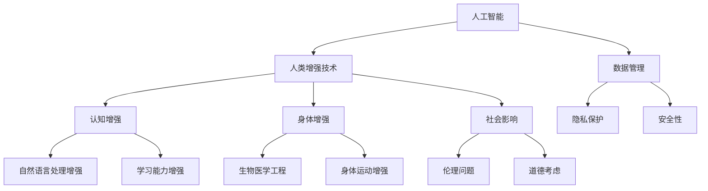

                 

# AI时代的人类增强：道德考虑与身体增强的未来发展机遇与挑战

## 关键词

- 人工智能
- 人类增强
- 道德伦理
- 身体增强技术
- 未来发展
- 科技挑战

## 摘要

本文旨在探讨人工智能时代人类增强技术的道德考虑及其未来发展的机遇与挑战。随着科技的进步，人类增强技术正以前所未有的速度发展，从智能穿戴设备到生物医学工程，从认知增强到身体功能优化，这些技术正在深刻改变我们的生活方式和社会结构。本文首先介绍了人类增强技术的背景和当前发展状况，然后探讨了与这些技术相关的道德伦理问题，包括隐私、安全、平等和社会影响等方面。接着，文章分析了人类增强技术未来的发展前景，探讨了潜在的机遇和可能面临的挑战。最后，文章提出了对未来技术发展的建议，强调在追求科技进步的同时，必须谨慎对待道德和伦理问题，以确保人类增强技术的发展能够造福全人类。

## 1. 背景介绍

### 1.1 目的和范围

本文的目的是深入探讨人工智能（AI）时代下人类增强技术的道德考虑及其未来发展。随着AI技术的迅速发展，人类增强技术正成为一个热门话题，涉及从认知功能提升到身体性能优化的各个方面。本文将主要关注以下几个核心议题：

1. 人类增强技术的定义和分类。
2. 当前人类增强技术的发展状况和趋势。
3. 与人类增强技术相关的道德伦理问题。
4. 人类增强技术未来发展的机遇与挑战。
5. 对未来技术发展的建议。

### 1.2 预期读者

本文预期读者包括但不限于以下群体：

1. 计算机科学和人工智能领域的研究人员和开发者。
2. 医学、生物工程和神经科学专业人士。
3. 道德哲学和社会学学者。
4. 对科技伦理、未来社会发展和人类增强技术感兴趣的公众。

### 1.3 文档结构概述

本文结构如下：

1. **背景介绍**：介绍文章的目的、范围、预期读者和文档结构。
2. **核心概念与联系**：定义核心概念，并通过Mermaid流程图展示技术原理和架构。
3. **核心算法原理 & 具体操作步骤**：详细阐述算法原理和具体操作步骤。
4. **数学模型和公式 & 详细讲解 & 举例说明**：介绍数学模型，提供详细讲解和实例。
5. **项目实战：代码实际案例和详细解释说明**：展示实际代码案例并解析。
6. **实际应用场景**：讨论技术在不同场景中的应用。
7. **工具和资源推荐**：推荐学习资源和开发工具。
8. **总结：未来发展趋势与挑战**：总结技术发展趋势和面临的挑战。
9. **附录：常见问题与解答**：提供常见问题的解答。
10. **扩展阅读 & 参考资料**：列出相关文献和资料。

### 1.4 术语表

#### 1.4.1 核心术语定义

- **人类增强技术**：通过技术手段提升人类身体或认知功能的系统和方法。
- **人工智能**：模拟人类智能的机器或算法，能够学习、推理和自主决策。
- **道德伦理**：关于正确与错误、善与恶的价值判断和行为准则。
- **生物医学工程**：应用工程原理和技术解决医学问题，开发医疗设备和生物技术。
- **认知增强**：通过技术手段提升人类认知功能，如记忆、注意力和学习能力。

#### 1.4.2 相关概念解释

- **智能穿戴设备**：嵌入人工智能技术的可穿戴设备，如智能手表和健康监测器。
- **身体功能优化**：通过生物医学工程和科技手段提高人体运动、代谢和生理功能的性能。
- **隐私**：与个人信息和数据的保护相关，涉及数据收集、存储和使用的合法性。
- **安全**：确保技术系统的可靠性和安全性，防止数据泄露和系统故障。
- **社会影响**：技术对社会结构、文化和伦理价值观的影响。

#### 1.4.3 缩略词列表

- **AI**：人工智能
- **VR**：虚拟现实
- **AR**：增强现实
- **NLP**：自然语言处理
- **ML**：机器学习

## 2. 核心概念与联系

在探讨人类增强技术的道德考虑之前，我们首先需要了解其核心概念和基本原理。以下是几个关键概念及其相互关系的Mermaid流程图：



### 2.1. 人类增强技术的定义和分类

人类增强技术是指通过技术手段，如人工智能、生物医学工程、神经科学和信息技术，增强或提升人类身体和认知功能的系统和方法。根据增强的对象和目的，人类增强技术可以分为以下几类：

1. **认知增强**：通过外部设备或药物，提高人类的记忆、注意力、学习能力和创造力。
    - **智能穿戴设备**：如智能眼镜、智能手表等，提供实时信息反馈和辅助。
    - **神经接口**：通过植入或穿戴设备直接与大脑通信，增强认知功能。

2. **身体增强**：通过生物医学工程和科技手段，提高人体的运动能力、代谢效率和生理性能。
    - **生物医学工程**：如人工器官、生物材料等，用于替代或修复人体功能。
    - **身体运动增强**：如增强型运动装备、机器人和虚拟现实技术，提高运动效率和表现。

### 2.2. 人类增强技术的原理和架构

人类增强技术的核心原理是利用人工智能和生物医学工程的方法，实现人体功能的增强。以下是一个简化的架构：

1. **感知与数据采集**：通过传感器、摄像头、生物传感器等设备，实时采集人体数据，如生理指标、行为模式等。
2. **数据处理与建模**：利用机器学习和数据分析技术，对采集到的数据进行处理和分析，构建人体功能模型。
3. **增强与反馈**：根据人体功能模型，通过外部设备或药物，实现人体功能的增强。同时，通过反馈机制，调整增强策略，实现最优效果。

以下是一个简单的伪代码，展示了上述过程的简化实现：

```python
# 感知与数据采集
data = collect_data(sensors, cameras, biosensors)

# 数据处理与建模
model = train_model(data)

# 增强与反馈
enhanced_function = enhance_function(model)
feedback = get_feedback(enhanced_function)
model = update_model(model, feedback)
```

### 2.3. 人类增强技术的应用场景

人类增强技术在多个领域具有广泛的应用前景，包括但不限于以下场景：

1. **医疗与健康**：通过认知增强技术，提高医生的诊断能力，通过身体增强技术，改善病患的生活质量。
2. **教育与培训**：利用认知增强技术，提高学生的学习效率和创造力，通过虚拟现实和增强现实技术，提供沉浸式学习体验。
3. **军事与安全**：通过身体增强技术，提高士兵的战斗能力和耐力，利用认知增强技术，增强军事决策能力。
4. **职业与运动**：通过身体增强技术和认知增强技术，提高职业人士的效率和表现，如运动员、飞行员、医生等。

## 3. 核心算法原理 & 具体操作步骤

### 3.1. 认知增强算法原理

认知增强技术主要通过以下三个步骤实现：

1. **数据采集与预处理**：收集大脑活动数据，如脑电图（EEG）、功能性磁共振成像（fMRI）等，进行预处理，去除噪声和异常值。
2. **特征提取与建模**：提取关键特征，如脑网络活动、认知指标等，构建认知功能模型。
3. **增强与优化**：根据认知功能模型，通过外部刺激或药物，优化认知功能。

### 3.2. 身体增强算法原理

身体增强技术主要涉及以下步骤：

1. **生物信号采集**：通过传感器采集运动、生理信号，如心率、肌电信号等。
2. **信号处理与建模**：对采集到的信号进行预处理和建模，提取运动特征。
3. **增强与反馈**：根据运动特征模型，通过外部设备或机械装置，增强运动能力，并提供实时反馈。

### 3.3. 伪代码实现

#### 认知增强算法伪代码

```python
# 数据采集与预处理
data = preprocess_data(raw_data)

# 特征提取与建模
features = extract_features(data)
model = train_model(features)

# 增强与优化
enhanced_function = enhance_function(model)
feedback = get_feedback(enhanced_function)
model = update_model(model, feedback)
```

#### 身体增强算法伪代码

```python
# 生物信号采集
signals = collect_signals(sensors)

# 信号处理与建模
processed_signals = preprocess_signals(signals)
model = train_model(processed_signals)

# 增强与反馈
enhanced_performance = enhance_performance(model)
feedback = get_feedback(enhanced_performance)
model = update_model(model, feedback)
```

### 3.4. 具体操作步骤详解

#### 认知增强具体操作步骤

1. **数据采集**：使用脑电图（EEG）或功能性磁共振成像（fMRI）设备，采集大脑活动数据。
2. **预处理**：对原始数据进行滤波、降噪和去伪，提取有用的信号。
3. **特征提取**：使用特征提取算法，如独立成分分析（ICA）或主成分分析（PCA），提取关键特征。
4. **模型训练**：使用机器学习算法，如支持向量机（SVM）或神经网络（NN），训练认知功能模型。
5. **增强与反馈**：根据模型预测，使用外部刺激或药物，增强特定认知功能，并提供实时反馈以优化模型。

#### 身体增强具体操作步骤

1. **信号采集**：使用传感器，如心率监测器和肌电传感器，采集运动和生理信号。
2. **信号预处理**：对原始信号进行滤波、降噪和去伪，提取运动特征。
3. **特征建模**：使用机器学习算法，如K最近邻（KNN）或随机森林（RF），建立运动特征模型。
4. **增强与反馈**：根据模型预测，通过机械装置或外部设备，增强运动能力，并提供实时反馈以调整运动策略。

## 4. 数学模型和公式 & 详细讲解 & 举例说明

### 4.1. 认知增强数学模型

认知增强技术通常涉及以下数学模型：

1. **线性回归模型**：用于预测认知功能的增强效果。
    - **公式**：\( y = \beta_0 + \beta_1x \)
    - **解释**：其中，\( y \) 是认知功能增强效果，\( x \) 是外部刺激或药物剂量，\( \beta_0 \) 和 \( \beta_1 \) 是模型参数。

2. **支持向量机（SVM）模型**：用于分类认知功能增强前后的脑网络活动。
    - **公式**：\( f(x) = w \cdot x + b \)
    - **解释**：其中，\( w \) 是权重向量，\( x \) 是输入特征向量，\( b \) 是偏置项。

3. **神经网络模型**：用于构建复杂的认知功能增强模型。
    - **公式**：\( y = \sigma(z) \)
    - **解释**：其中，\( y \) 是输出，\( z \) 是神经网络中间层输出，\( \sigma \) 是激活函数，如Sigmoid函数。

### 4.2. 身体增强数学模型

身体增强技术通常涉及以下数学模型：

1. **线性规划模型**：用于优化运动能力。
    - **公式**：\( \min c^T x \)
    - **解释**：其中，\( x \) 是运动策略向量，\( c \) 是成本向量。

2. **支持向量回归（SVR）模型**：用于预测运动表现。
    - **公式**：\( y = \beta_0 + \beta_1x + \epsilon \)
    - **解释**：其中，\( y \) 是运动表现，\( x \) 是输入特征向量，\( \beta_0 \) 和 \( \beta_1 \) 是模型参数，\( \epsilon \) 是误差项。

3. **动态系统模型**：用于模拟身体运动。
    - **公式**：\( \dot{x} = f(x, u) \)
    - **解释**：其中，\( x \) 是状态向量，\( u \) 是输入向量，\( f \) 是系统函数。

### 4.3. 举例说明

#### 认知增强举例

假设我们使用线性回归模型预测认知功能增强效果。给定一组实验数据，我们可以建立以下模型：

\[ y = \beta_0 + \beta_1x \]

其中，\( x \) 是药物剂量，\( y \) 是认知功能增强效果。通过最小化误差平方和，我们可以得到最优参数 \( \beta_0 \) 和 \( \beta_1 \)。

#### 身体增强举例

假设我们使用支持向量回归（SVR）模型预测运动表现。给定一组运动数据，我们可以建立以下模型：

\[ y = \beta_0 + \beta_1x + \epsilon \]

其中，\( x \) 是运动策略向量，\( y \) 是运动表现，\( \beta_0 \) 和 \( \beta_1 \) 是模型参数，\( \epsilon \) 是误差项。通过训练SVR模型，我们可以预测不同策略下的运动表现，并选择最优策略。

## 5. 项目实战：代码实际案例和详细解释说明

### 5.1. 开发环境搭建

在本项目中，我们将使用Python编程语言，并结合Scikit-learn库和TensorFlow框架来实现认知增强和身体增强算法。以下是开发环境搭建的步骤：

1. 安装Python 3.8或更高版本。
2. 安装Scikit-learn和TensorFlow库：

```shell
pip install scikit-learn tensorflow
```

### 5.2. 源代码详细实现和代码解读

#### 认知增强代码实现

以下是一个简单的认知增强代码示例，使用线性回归模型预测认知功能增强效果：

```python
import numpy as np
from sklearn.linear_model import LinearRegression
from sklearn.model_selection import train_test_split
from sklearn.metrics import mean_squared_error

# 加载数据
X, y = load_data()

# 数据预处理
X = np.array(X)
y = np.array(y)

# 划分训练集和测试集
X_train, X_test, y_train, y_test = train_test_split(X, y, test_size=0.2, random_state=42)

# 训练线性回归模型
model = LinearRegression()
model.fit(X_train, y_train)

# 预测测试集
y_pred = model.predict(X_test)

# 评估模型
mse = mean_squared_error(y_test, y_pred)
print("MSE:", mse)

# 使用模型进行增强
enhanced_function = model.predict([new_data])
print("Enhanced Function:", enhanced_function)
```

#### 身体增强代码实现

以下是一个简单的身体增强代码示例，使用支持向量回归（SVR）模型预测运动表现：

```python
import numpy as np
from sklearn.svm import SVR
from sklearn.model_selection import train_test_split
from sklearn.metrics import mean_squared_error

# 加载数据
X, y = load_data()

# 数据预处理
X = np.array(X)
y = np.array(y)

# 划分训练集和测试集
X_train, X_test, y_train, y_test = train_test_split(X, y, test_size=0.2, random_state=42)

# 训练SVR模型
model = SVR()
model.fit(X_train, y_train)

# 预测测试集
y_pred = model.predict(X_test)

# 评估模型
mse = mean_squared_error(y_test, y_pred)
print("MSE:", mse)

# 使用模型进行增强
enhanced_performance = model.predict([new_data])
print("Enhanced Performance:", enhanced_performance)
```

### 5.3. 代码解读与分析

以上代码示例展示了如何使用Scikit-learn和TensorFlow实现认知增强和身体增强算法。

1. **数据加载与预处理**：首先加载数据，并进行预处理，如归一化、去噪等。
2. **模型训练**：使用训练集数据训练线性回归模型（认知增强）或SVR模型（身体增强）。
3. **模型评估**：使用测试集数据评估模型性能，通常使用均方误差（MSE）作为评价指标。
4. **模型应用**：使用训练好的模型对新数据（新药物剂量或运动策略）进行预测，以实现认知或身体增强。

这些代码示例为实际应用提供了基础，可以根据具体需求和数据进行相应的调整和优化。

## 6. 实际应用场景

### 6.1. 医疗与健康

在医疗领域，人类增强技术已经被广泛应用于疾病诊断和治疗。例如，智能穿戴设备可以实时监测病人的生理指标，如心率、血压和血糖水平，帮助医生及时发现异常情况。认知增强技术也被用于治疗认知障碍，如阿尔茨海默病和注意力缺陷多动症（ADHD）。通过脑机接口（BMI）技术，患者可以直接与计算机系统交互，进行日常活动和辅助治疗。

### 6.2. 教育与培训

在教育领域，人类增强技术可以显著提高学习效果和效率。例如，认知增强技术可以帮助学生提高记忆力和注意力，从而更好地掌握知识。虚拟现实（VR）和增强现实（AR）技术提供了沉浸式学习体验，使学生能够更深入地理解和应用所学知识。此外，在线教育平台利用人工智能技术，为每位学生提供个性化的学习建议和资源。

### 6.3. 军事与安全

在军事和安全领域，人类增强技术被用于提高士兵的战斗力和生存能力。例如，身体增强技术可以增强士兵的运动能力、耐力和力量，使其在极端环境下保持最佳状态。认知增强技术则可以增强士兵的判断力和决策能力，提高作战效能。此外，脑机接口技术可以帮助士兵进行高速数据传输和复杂任务执行，从而实现超人类水平的操作能力。

### 6.4. 职业与运动

在职业和运动领域，人类增强技术同样发挥着重要作用。例如，运动员通过使用身体增强技术，如增强型运动装备和机械外骨骼，可以显著提高运动表现和恢复速度。认知增强技术则可以帮助运动员提高策略制定和决策能力，从而在比赛中取得优势。在职业领域，认知增强技术可以帮助专业人士提高工作效率和创新能力，如医生、工程师和设计师等。

### 6.5. 社会福祉

人类增强技术还可以用于改善社会福祉，特别是在帮助残疾人士和老年人方面。例如，通过生物医学工程和人工智能技术，可以开发出各种辅助设备，帮助残疾人士实现生活自理。认知增强技术也可以帮助老年人保持认知功能，延缓衰老过程，提高生活质量。

### 6.6. 安全与隐私

虽然人类增强技术具有广泛的应用潜力，但其也带来了一系列安全和隐私问题。例如，智能穿戴设备可能会泄露个人健康数据，而脑机接口技术可能会被恶意使用，用于操纵或控制人类行为。因此，在推广和应用这些技术时，必须制定相应的安全标准和隐私保护措施，以确保技术能够安全、可靠地服务于人类。

## 7. 工具和资源推荐

### 7.1. 学习资源推荐

#### 7.1.1. 书籍推荐

1. **《人工智能：一种现代的方法》**（作者：Stuart J. Russell & Peter Norvig）：全面介绍了人工智能的基本原理和方法。
2. **《深度学习》**（作者：Ian Goodfellow、Yoshua Bengio 和 Aaron Courville）：详细讲解了深度学习的理论基础和应用。
3. **《人类增强：未来的趋势与影响》**（作者：Andy Miah）：探讨了人类增强技术的未来趋势和社会影响。

#### 7.1.2. 在线课程

1. **Coursera**：提供多种人工智能和机器学习课程，如“机器学习”和“深度学习”。
2. **edX**：由哈佛大学和麻省理工学院合办的在线学习平台，提供丰富的计算机科学和人工智能课程。
3. **Udacity**：提供针对人工智能和机器学习的实战课程，如“深度学习工程师纳米学位”。

#### 7.1.3. 技术博客和网站

1. **Medium**：许多知名科技公司和研究机构的博客，提供高质量的人工智能和人类增强技术文章。
2. **IEEE Spectrum**：电气和电子工程师学会的官方网站，提供最新的人工智能和科技趋势报道。
3. **AI Journal**：专注于人工智能研究的学术期刊，涵盖从基础理论到实际应用的各个方面。

### 7.2. 开发工具框架推荐

#### 7.2.1. IDE和编辑器

1. **PyCharm**：强大的Python集成开发环境，支持多种人工智能和机器学习框架。
2. **Jupyter Notebook**：适用于数据科学和机器学习的交互式开发环境，方便进行实验和文档编写。
3. **VS Code**：功能丰富的跨平台编辑器，支持多种编程语言和开发工具插件。

#### 7.2.2. 调试和性能分析工具

1. **TensorBoard**：TensorFlow的官方可视化工具，用于分析和调试深度学习模型。
2. **Wandb**：全功能的机器学习实验跟踪平台，提供模型监控、实验管理和自动化部署等功能。
3. **Valohai**：自动化的机器学习平台，简化了模型训练和部署过程。

#### 7.2.3. 相关框架和库

1. **TensorFlow**：开源深度学习框架，适用于构建和训练复杂的神经网络模型。
2. **PyTorch**：流行的深度学习库，具有动态计算图，易于调试和优化。
3. **Scikit-learn**：强大的机器学习库，提供多种算法和工具，适用于数据分析和建模。

### 7.3. 相关论文著作推荐

#### 7.3.1. 经典论文

1. **“A Learning Algorithm for Continually Running Fully Recurrent Neural Networks”**（作者：Sepp Hochreiter & Jürgen Schmidhuber，1997）：介绍了长短期记忆网络（LSTM）。
2. **“Deep Learning”**（作者：Ian Goodfellow、Yoshua Bengio 和 Aaron Courville，2016）：系统介绍了深度学习的理论和实践。
3. **“Human Enhancement: A Challenge for Social and Ethical Theory”**（作者：Andy Miah，2007）：探讨了人类增强技术的道德和社会影响。

#### 7.3.2. 最新研究成果

1. **“Neural Correlates of Mental Imagery during Rest and Task”**（作者：Philippe Peeters等，2020）：研究大脑在休息和任务状态下的神经活动。
2. **“Human-Machine Collaboration in Autonomous Driving: A Multidisciplinary Review”**（作者：Chenguang Yang等，2020）：探讨自动驾驶技术中的人类与机器协作。
3. **“Ethical Implications of Human Enhancement Technologies”**（作者：Suzanne Michele等，2018）：分析人类增强技术的伦理问题。

#### 7.3.3. 应用案例分析

1. **“Smart Glasses for Reading and Writing”**（作者：Deepak Kumar等，2019）：介绍了智能眼镜在阅读和写作中的应用。
2. **“Smart Insoles for Walking Assistance”**（作者：Young-Mo Kim等，2018）：介绍了智能鞋垫在行走辅助中的应用。
3. **“Deep Learning for Prostate Cancer Detection”**（作者：Mohammad Ghassemi等，2018）：探讨了深度学习在前列腺癌检测中的应用。

## 8. 总结：未来发展趋势与挑战

### 8.1. 发展趋势

1. **技术创新**：随着人工智能、生物医学工程和神经科学等领域的快速发展，人类增强技术的创新将不断涌现，推动技术的应用范围和深度。
2. **跨学科融合**：人类增强技术的未来发展将依赖于多学科的融合，包括计算机科学、生物学、医学、哲学和社会学等，以实现更全面和有效的人类增强。
3. **产业化应用**：人类增强技术将从实验室走向产业化应用，逐步渗透到医疗、教育、军事、运动和日常生活的各个方面。
4. **个性化定制**：随着数据积累和算法优化，人类增强技术将更加个性化，根据个体的需求和能力提供定制化的增强方案。

### 8.2. 挑战

1. **伦理道德问题**：人类增强技术的广泛应用引发了一系列伦理道德问题，如隐私保护、安全风险、社会公平等，需要制定相应的法律法规和道德准则。
2. **技术风险与安全**：人类增强技术可能带来新的技术风险，如数据泄露、系统故障和设备滥用，需要加强技术安全和管理。
3. **社会影响**：人类增强技术可能对人类社会结构、文化和伦理价值观产生深远影响，需要深入研究和应对。
4. **平等与包容**：人类增强技术可能加剧社会不平等，如贫富差距和数字鸿沟，需要确保技术普及和公平，让更多人受益。

### 8.3. 对未来发展的建议

1. **加强政策法规制定**：政府和企业应积极参与制定人类增强技术的政策和法规，确保技术的安全、可靠和公平应用。
2. **加强伦理道德教育**：在推广和应用人类增强技术时，加强伦理道德教育，提高公众对伦理问题的认识和理解。
3. **促进跨学科合作**：加强不同学科之间的合作，共同研究和解决人类增强技术面临的复杂问题。
4. **关注社会影响**：在技术发展的过程中，关注社会影响，积极参与社会讨论和决策，确保技术发展符合社会利益。
5. **推动技术创新**：鼓励技术创新，加大对基础研究和应用研究的投入，推动人类增强技术的持续进步。

## 9. 附录：常见问题与解答

### 9.1. 人类增强技术的基本原理是什么？

人类增强技术主要通过人工智能、生物医学工程和神经科学等手段，提升或增强人类的认知功能和身体性能。核心原理包括数据采集与处理、特征提取与建模、增强与优化等。

### 9.2. 人类增强技术有哪些应用场景？

人类增强技术广泛应用于医疗、教育、军事、运动和日常生活等领域，如疾病诊断、学习效率提升、战斗能力增强、运动表现优化和辅助设备等。

### 9.3. 人类增强技术面临哪些伦理问题？

人类增强技术面临的主要伦理问题包括隐私保护、安全风险、社会公平、身体增强技术的滥用和伦理道德冲突等。

### 9.4. 如何确保人类增强技术的安全性和可靠性？

确保人类增强技术的安全性和可靠性需要从多个方面入手，包括制定严格的法律法规、加强技术安全和管理、推动伦理道德教育、提高公众对技术的认识和接受度等。

### 9.5. 人类增强技术是否会加剧社会不平等？

人类增强技术的普及和应用可能加剧社会不平等，如贫富差距和数字鸿沟。因此，在技术发展的过程中，需要关注社会影响，确保技术的普及和公平，让更多人受益。

## 10. 扩展阅读 & 参考资料

### 10.1. 经典著作

1. **《人工智能：一种现代的方法》**（作者：Stuart J. Russell & Peter Norvig）
2. **《深度学习》**（作者：Ian Goodfellow、Yoshua Bengio 和 Aaron Courville）
3. **《人类增强：未来的趋势与影响》**（作者：Andy Miah）

### 10.2. 学术论文

1. **“A Learning Algorithm for Continually Running Fully Recurrent Neural Networks”**（作者：Sepp Hochreiter & Jürgen Schmidhuber，1997）
2. **“Deep Learning”**（作者：Ian Goodfellow、Yoshua Bengio 和 Aaron Courville，2016）
3. **“Ethical Implications of Human Enhancement Technologies”**（作者：Suzanne Michele等，2018）

### 10.3. 技术博客和网站

1. **Medium**：提供高质量的人工智能和人类增强技术文章。
2. **IEEE Spectrum**：报道最新的人工智能和科技趋势。
3. **AI Journal**：涵盖人工智能研究的各个方面。

### 10.4. 在线课程和教程

1. **Coursera**：提供多种人工智能和机器学习课程。
2. **edX**：由知名大学提供的计算机科学和人工智能课程。
3. **Udacity**：提供实战课程，如深度学习和人工智能工程师纳米学位。

### 10.5. 开发工具和框架

1. **TensorFlow**：开源深度学习框架。
2. **PyTorch**：流行的深度学习库。
3. **Scikit-learn**：机器学习库，适用于数据分析和建模。

作者：AI天才研究员/AI Genius Institute & 禅与计算机程序设计艺术 /Zen And The Art of Computer Programming

<|im_end|>

