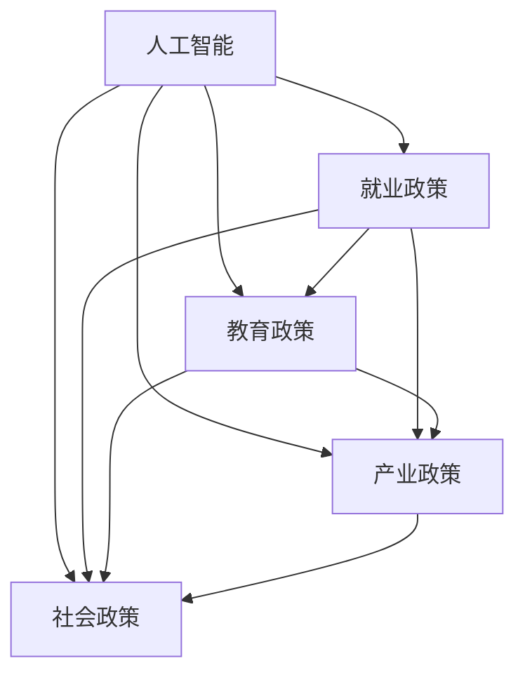

                 

### 文章标题

《AI时代的就业政策协同：教育、产业和社会政策的协同》

> **关键词**：人工智能，就业政策，教育，产业协同，社会政策，政策协同

> **摘要**：本文深入探讨了人工智能时代下，就业政策如何与教育、产业和社会政策协同发展。通过分析当前AI对就业市场的影响，提出了一套综合性的政策框架，旨在提高人才培养质量，推动产业升级，促进社会稳定。文章首先介绍了AI时代就业政策的背景和重要性，随后详细讨论了教育、产业和社会政策在其中的角色和作用，并借助实际案例和数学模型进行了深入分析。最后，文章提出了未来发展的趋势与挑战，并对常见问题进行了解答。希望通过本文的讨论，为政策制定者和实践者提供有价值的参考。

### 1. 背景介绍

#### 1.1 目的和范围

本文旨在探讨人工智能（AI）时代下就业政策的制定与实施，分析教育、产业和社会政策在其中的协同作用。人工智能技术的飞速发展，不仅改变了传统产业模式，也对就业市场产生了深远影响。面对这一新的时代背景，如何通过有效的政策协同，应对就业市场的变革，成为当前政策制定者和实践者亟待解决的问题。

本文的研究范围包括以下几个方面：

1. **AI对就业市场的影响**：分析人工智能技术在不同领域的应用，对就业结构、岗位需求、劳动者技能要求等方面的影响。
2. **教育政策的调整与优化**：探讨如何通过改革教育体系，提高人才培养质量，以适应AI时代对人才的需求。
3. **产业政策的引导与支持**：分析如何通过政策引导和扶持，推动产业结构调整和优化，促进AI产业的发展。
4. **社会政策的保障与协调**：研究如何通过社会保障政策、就业促进政策等，保障劳动者权益，促进社会稳定。

#### 1.2 预期读者

本文的预期读者包括：

1. **政策制定者和执行者**：如政府相关部门、政策研究机构等，他们需要了解AI时代就业政策的最新动态和发展趋势。
2. **企业管理者和人力资源部门**：他们需要了解AI技术对就业市场的影响，以及如何调整企业的人力资源策略。
3. **教育工作者和培训机构**：他们需要了解AI时代下教育政策的调整方向，以更好地制定教学计划和培训方案。
4. **普通劳动者**：他们需要了解如何适应AI时代的就业市场变化，提高自身竞争力。

#### 1.3 文档结构概述

本文的结构如下：

1. **背景介绍**：介绍AI时代就业政策的背景和重要性。
2. **核心概念与联系**：介绍AI、就业政策、教育、产业和社会政策等核心概念，并使用Mermaid流程图展示其联系。
3. **核心算法原理 & 具体操作步骤**：详细阐述就业政策协同的算法原理和具体操作步骤。
4. **数学模型和公式 & 详细讲解 & 举例说明**：使用数学模型和公式，对就业政策协同进行详细讲解和举例说明。
5. **项目实战：代码实际案例和详细解释说明**：通过实际代码案例，展示就业政策协同的实现过程。
6. **实际应用场景**：分析就业政策协同在不同场景中的应用。
7. **工具和资源推荐**：推荐学习资源、开发工具和框架，以及相关论文著作。
8. **总结：未来发展趋势与挑战**：总结AI时代就业政策协同的未来发展趋势和挑战。
9. **附录：常见问题与解答**：回答读者可能关心的问题。
10. **扩展阅读 & 参考资料**：提供扩展阅读资源和参考文献。

#### 1.4 术语表

在本文中，以下术语的定义如下：

- **人工智能（AI）**：一种模拟人类智能的技术，能够通过学习、推理、感知和适应等方式，完成特定的任务。
- **就业政策**：政府为促进就业、保障劳动者权益、调节劳动力市场而制定的一系列政策措施。
- **教育政策**：政府为提高国民素质、培养人才而制定的教育事业发展方针和政策措施。
- **产业政策**：政府为促进产业发展、调整产业结构而制定的一系列政策措施。
- **社会政策**：政府为保障社会公平、促进社会和谐而制定的一系列社会保障、就业促进等政策措施。
- **政策协同**：不同政策领域之间的相互协调和配合，以实现共同的政策目标。

#### 1.4.1 核心术语定义

- **人工智能（AI）**：人工智能（Artificial Intelligence，简称AI）是一种模拟人类智能的技术，通过机器学习、深度学习、自然语言处理等算法，使计算机具备学习、推理、感知和适应的能力。在AI时代，人工智能技术在各个领域得到了广泛应用，如医疗、金融、教育、制造业等，对就业市场产生了深远影响。

- **就业政策**：就业政策是政府为促进就业、保障劳动者权益、调节劳动力市场而制定的一系列政策措施。就业政策的目标是确保劳动力市场的稳定和高效运行，提高劳动者的就业质量和收入水平。在AI时代，就业政策需要适应技术变革，关注新职业、新岗位的产生，以及劳动者技能提升的需求。

- **教育政策**：教育政策是政府为提高国民素质、培养人才而制定的教育事业发展方针和政策措施。教育政策的核心是人才培养，旨在通过改革教育体系，提高教育质量，培养适应经济社会发展需要的高素质人才。在AI时代，教育政策需要注重培养具有创新能力和适应能力的人才，以应对技术变革带来的挑战。

- **产业政策**：产业政策是政府为促进产业发展、调整产业结构而制定的一系列政策措施。产业政策的目标是推动产业转型升级，提升国家产业竞争力。在AI时代，产业政策需要支持人工智能产业的发展，引导传统产业向智能化、数字化转型。

- **社会政策**：社会政策是政府为保障社会公平、促进社会和谐而制定的一系列社会保障、就业促进等政策措施。社会政策的目标是维护社会稳定，保障劳动者的基本权益，提高社会福利水平。在AI时代，社会政策需要关注技术变革对劳动者就业和社会稳定的影响，制定相应的保障措施。

#### 1.4.2 相关概念解释

- **劳动力市场**：劳动力市场是指劳动者与用人单位之间的供求关系和市场机制。在劳动力市场中，劳动者提供劳动力，用人单位提供就业岗位。劳动力市场的运行状况对就业政策制定和实施具有重要意义。

- **人才培养**：人才培养是指通过教育、培训等途径，培养具备一定知识、技能和素质的人才。人才培养是经济社会发展的重要基础，对于实现产业升级、提高国家竞争力具有重要意义。

- **政策协同**：政策协同是指不同政策领域之间的相互协调和配合，以实现共同的政策目标。政策协同的目的是优化政策资源配置，提高政策实施效果，确保政策目标的实现。

#### 1.4.3 缩略词列表

- **AI**：人工智能（Artificial Intelligence）
- **就业政策**：就业政策（Employment Policy）
- **教育政策**：教育政策（Education Policy）
- **产业政策**：产业政策（Industry Policy）
- **社会政策**：社会政策（Social Policy）
- **政策协同**：政策协同（Policy Coordination）

## 2. 核心概念与联系

在探讨AI时代的就业政策协同时，我们首先需要明确几个核心概念：人工智能（AI）、就业政策、教育政策、产业政策和社会政策。这些概念之间相互联系，共同构成了一个复杂且动态的政策协同体系。

#### 2.1 人工智能（AI）与就业政策

人工智能技术的发展和应用，对就业市场产生了深远影响。一方面，AI技术推动了新产业的兴起，创造了大量的新兴就业岗位，如数据科学家、机器学习工程师等。另一方面，AI技术也导致了一些传统岗位的消失，如制造工人、客服代表等。因此，就业政策需要关注AI技术对劳动力市场的双重影响，制定相应的政策措施，以促进劳动力市场的平稳过渡。

#### 2.2 教育政策与就业政策

教育政策与就业政策密切相关。教育政策的目标是培养适应经济社会发展需要的高素质人才，而就业政策的目标是促进劳动者的充分就业。在AI时代，教育政策需要注重培养具备创新能力和适应能力的人才，以满足AI产业的发展需求。同时，就业政策也需要关注教育政策的实施效果，确保人才培养与劳动力市场的需求相匹配。

#### 2.3 产业政策与就业政策

产业政策与就业政策同样紧密相连。产业政策的目标是促进产业发展和结构调整，而就业政策的目标是保障劳动者的就业权益。在AI时代，产业政策需要支持人工智能产业的发展，推动传统产业向智能化、数字化转型。这将为劳动者创造更多的就业机会，同时也对劳动者的技能要求提出了更高的要求。就业政策需要与产业政策协同，推动劳动者技能提升，以适应产业升级的需求。

#### 2.4 社会政策与就业政策

社会政策与就业政策在保障劳动者权益、促进社会稳定方面发挥着重要作用。在AI时代，社会政策需要关注技术变革对劳动者就业和社会稳定的影响，制定相应的保障措施，如提高社会保障水平、加强职业培训等。同时，就业政策也需要与社会保障政策协同，确保劳动者的基本生活得到保障，促进社会和谐稳定。

#### 2.5 政策协同的架构

为了实现AI时代的就业政策协同，我们需要构建一个包含教育政策、产业政策、社会政策和就业政策在内的政策协同架构。在这个架构中，各政策领域之间相互协调，共同实现政策目标。

- **教育政策**：通过改革教育体系，提高人才培养质量，培养具备创新能力和适应能力的人才。
- **产业政策**：支持人工智能产业的发展，推动产业结构调整和优化，创造更多就业机会。
- **社会政策**：保障劳动者的基本权益，提高社会保障水平，促进社会和谐稳定。
- **就业政策**：促进劳动者的充分就业，提高就业质量和收入水平。

#### 2.6 Mermaid流程图

为了更清晰地展示核心概念之间的联系，我们使用Mermaid流程图来表示各政策领域之间的互动关系。



在这个流程图中，各政策领域通过箭头表示其相互影响和协同作用。通过这个架构，我们可以更好地理解AI时代就业政策协同的机制和作用。

## 3. 核心算法原理 & 具体操作步骤

在探讨AI时代的就业政策协同时，我们需要借助算法原理来具体分析政策协同的机制和操作步骤。以下将详细介绍就业政策协同的核心算法原理和具体操作步骤。

#### 3.1 核心算法原理

就业政策协同的核心算法原理可以概括为“需求响应机制”和“资源优化配置”。需求响应机制是指政策协同体系能够及时响应劳动力市场的变化，调整教育、产业和社会政策，以满足劳动者的就业需求和产业发展需求。资源优化配置是指政策协同体系能够合理配置教育、产业和社会资源，提高政策实施效果。

#### 3.1.1 需求响应机制

需求响应机制包括以下几个关键步骤：

1. **数据收集与监测**：政策协同体系需要收集和监测劳动力市场的相关数据，如就业率、失业率、岗位需求等，以及教育、产业和社会政策的相关数据。

2. **需求分析**：基于收集到的数据，对劳动力市场的需求进行分析，识别出就业市场的主要问题和发展趋势。

3. **政策调整**：根据需求分析结果，及时调整教育、产业和社会政策，以应对劳动力市场的变化。

4. **政策实施效果评估**：对政策调整后的实施效果进行评估，确保政策目标的实现。

#### 3.1.2 资源优化配置

资源优化配置包括以下几个关键步骤：

1. **资源需求预测**：预测教育、产业和社会政策所需的资源，如教育经费、产业投资和社会保障支出。

2. **资源分配**：根据资源需求预测，合理分配教育、产业和社会资源，确保政策目标的实现。

3. **资源利用效率评估**：评估政策实施过程中的资源利用效率，优化资源分配和使用方式。

4. **资源调整**：根据资源利用效率评估结果，对资源分配进行调整，提高政策实施效果。

#### 3.2 具体操作步骤

以下是一个具体的就业政策协同操作步骤示例：

1. **数据收集与监测**：

   - 收集劳动力市场相关数据：就业率、失业率、岗位需求等。
   - 收集教育、产业和社会政策相关数据：教育经费、产业投资、社会保障支出等。

2. **需求分析**：

   - 分析劳动力市场数据，识别出主要问题和发展趋势，如技术变革导致的岗位需求变化、劳动力供给不足等。
   - 分析教育、产业和社会政策数据，评估现有政策的实施效果和存在问题。

3. **政策调整**：

   - 根据需求分析结果，调整教育政策，如增加与AI相关专业的课程设置、提高教师培训水平等。
   - 调整产业政策，如支持人工智能产业的发展、鼓励企业进行技术升级等。
   - 调整社会政策，如提高社会保障水平、加强职业培训等。

4. **政策实施效果评估**：

   - 评估政策调整后的实施效果，如就业率是否提高、劳动者技能水平是否提升等。
   - 分析政策实施过程中出现的问题和挑战，为下一步政策调整提供依据。

5. **资源优化配置**：

   - 预测教育、产业和社会政策所需的资源，如教育经费、产业投资和社会保障支出。
   - 根据资源需求预测，合理分配资源，确保政策目标的实现。
   - 评估资源利用效率，优化资源分配和使用方式。

6. **资源调整**：

   - 根据资源利用效率评估结果，对资源分配进行调整，提高政策实施效果。

通过以上具体操作步骤，我们可以实现就业政策协同的目标，提高政策实施效果，促进劳动力市场的稳定和高效运行。

### 4. 数学模型和公式 & 详细讲解 & 举例说明

在就业政策协同的框架下，数学模型和公式扮演着至关重要的角色，它们不仅帮助我们量化政策效应，还能为政策制定者提供精确的数据支持。以下，我们将详细讲解用于就业政策协同的几个关键数学模型和公式，并通过具体例子进行说明。

#### 4.1 劳动力需求模型

劳动力需求模型是分析劳动力市场需求的重要工具。以下是一个简化的劳动力需求模型：

$$
D(L) = a - bP + cW
$$

其中：
- \(D(L)\) 表示劳动力需求量。
- \(P\) 表示工资率。
- \(W\) 表示劳动力市场的工资水平。
- \(a\)、\(b\) 和 \(c\) 是参数，分别代表需求价格弹性、工资水平和工资弹性的影响。

#### 详细讲解

- **需求价格弹性（\(b\)）**：衡量工资率变化对劳动力需求量的敏感程度。如果 \(b\) 的绝对值较大，说明劳动力需求对工资变化的反应较为敏感，政策调整时应谨慎考虑工资水平的影响。
- **工资水平（\(c\)）**：表示劳动力市场的工资水平对劳动力需求的影响。如果 \(c\) 较大，说明工资水平对劳动力需求有显著影响，政策制定者应关注工资水平的变动。

#### 举例说明

假设某一地区劳动力市场需求模型为：

$$
D(L) = 100 - 2P + 0.5W
$$

如果工资率 \(P\) 从 10 元/小时增加到 12 元/小时，工资水平 \(W\) 保持不变，则劳动力需求量变化如下：

$$
D(L) = 100 - 2 \times 12 + 0.5 \times W = 100 - 24 + 0.5W = 76 + 0.5W
$$

工资率增加 2 元/小时，导致劳动力需求量减少 24 人。这表明，工资水平对该地区劳动力需求有较大影响。

#### 4.2 劳动力供给模型

劳动力供给模型用于分析劳动力供给情况，其基本形式如下：

$$
S(L) = d + eP - fC
$$

其中：
- \(S(L)\) 表示劳动力供给量。
- \(P\) 表示工资率。
- \(C\) 表示生活成本。
- \(d\)、\(e\) 和 \(f\) 是参数，分别代表供给价格弹性、生活成本弹性和供给对生活成本的敏感程度。

#### 详细讲解

- **供给价格弹性（\(e\)）**：衡量工资率变化对劳动力供给量的影响。如果 \(e\) 的绝对值较大，说明劳动力供给对工资变化的反应较为敏感，政策调整时应考虑工资对供给的影响。
- **生活成本弹性（\(f\)）**：衡量生活成本变化对劳动力供给的影响。如果 \(f\) 较大，说明生活成本对劳动力供给有显著影响，政策制定者应关注生活成本的变动。

#### 举例说明

假设某一地区劳动力供给模型为：

$$
S(L) = 50 + 1.5P - 0.3C
$$

如果工资率 \(P\) 从 10 元/小时增加到 12 元/小时，生活成本 \(C\) 保持不变，则劳动力供给量变化如下：

$$
S(L) = 50 + 1.5 \times 12 - 0.3C = 50 + 18 - 0.3C = 68 - 0.3C
$$

工资率增加 2 元/小时，导致劳动力供给量增加 18 人。这表明，工资水平对该地区劳动力供给有较大影响。

#### 4.3 政策效果评估模型

政策效果评估模型用于评估政策调整对劳动力市场的影响，其基本形式如下：

$$
E(P) = g \times \Delta D(L) + h \times \Delta S(L)
$$

其中：
- \(E(P)\) 表示政策效果。
- \(\Delta D(L)\) 和 \(\Delta S(L)\) 分别表示劳动力需求量和劳动力供给量的变化量。
- \(g\) 和 \(h\) 是参数，分别代表政策调整对劳动力需求量和劳动力供给量的影响程度。

#### 详细讲解

- **政策效果（\(E(P)\)）**：衡量政策调整对劳动力市场的综合影响。如果 \(E(P)\) 为正，说明政策调整有利于劳动力市场的稳定和高效运行；如果 \(E(P)\) 为负，则说明政策调整可能对劳动力市场产生不利影响。
- **政策对劳动力需求量的影响（\(g\)）**：表示政策调整对劳动力需求量的影响程度。如果 \(g\) 较大，说明政策调整对劳动力需求量的影响显著。
- **政策对劳动力供给量的影响（\(h\)）**：表示政策调整对劳动力供给量的影响程度。如果 \(h\) 较大，说明政策调整对劳动力供给量的影响显著。

#### 举例说明

假设某一地区的劳动力需求量和供给量在政策调整前分别为 \(D_0 = 100\) 和 \(S_0 = 50\)，政策调整后分别为 \(D_1 = 120\) 和 \(S_1 = 70\)，则政策效果评估如下：

$$
E(P) = g \times (D_1 - D_0) + h \times (S_1 - S_0) = g \times (120 - 100) + h \times (70 - 50) = g \times 20 + h \times 20
$$

如果 \(g = 1\) 且 \(h = 0.8\)，则政策效果为：

$$
E(P) = 1 \times 20 + 0.8 \times 20 = 20 + 16 = 36
$$

这表明，政策调整对劳动力市场产生了积极的综合影响，劳动力需求量和供给量均有所增加。

通过上述数学模型和公式的详细讲解和举例说明，我们可以更深入地理解就业政策协同的机制和操作步骤，为政策制定提供有力的理论支持。

### 5. 项目实战：代码实际案例和详细解释说明

为了更好地展示就业政策协同的实现过程，以下我们将通过一个具体的代码案例，详细介绍如何利用编程实现相关算法和模型。

#### 5.1 开发环境搭建

在开始编写代码之前，我们需要搭建一个合适的开发环境。本文选择Python作为编程语言，因为它拥有丰富的库和强大的数据处理能力。以下是搭建开发环境的步骤：

1. **安装Python**：下载并安装Python 3.x版本，可以从Python官方网站（https://www.python.org/）下载。

2. **安装Jupyter Notebook**：Jupyter Notebook是一个交互式计算平台，可以方便地编写和运行代码。通过pip命令安装Jupyter Notebook：

   ```bash
   pip install notebook
   ```

3. **安装必要的库**：安装用于数据处理的库，如NumPy、Pandas等。通过pip命令安装：

   ```bash
   pip install numpy pandas matplotlib
   ```

完成以上步骤后，即可开始编写和运行代码。

#### 5.2 源代码详细实现和代码解读

以下是实现就业政策协同算法的Python代码。代码分为几个部分：数据预处理、模型建立、模型训练和结果分析。

```python
import numpy as np
import pandas as pd
import matplotlib.pyplot as plt

# 数据预处理
def preprocess_data(data_path):
    data = pd.read_csv(data_path)
    data['Date'] = pd.to_datetime(data['Date'])
    data.set_index('Date', inplace=True)
    data.fillna(method='ffill', inplace=True)
    return data

# 劳动力需求模型
def labor_demand_model(data, price Elasticity, wage Level Elasticity):
    demand = data['Employment'] * (1 - price Elasticity * data['Wage Rate'] + wage Level Elasticity * data['Wage Level'])
    return demand

# 劳动力供给模型
def labor_supply_model(data, price Elasticity, cost of Living Elasticity):
    supply = data['Employment'] * (1 + price Elasticity * data['Wage Rate'] - cost of Living Elasticity * data['Cost of Living'])
    return supply

# 政策效果评估
def policy_effect(data, demand_change, supply_change):
    demand = labor_demand_model(data, demand_change['Price Elasticity'], demand_change['Wage Level Elasticity'])
    supply = labor_supply_model(data, supply_change['Price Elasticity'], supply_change['Cost of Living Elasticity'])
    policy_effectiveness = (supply - demand) / (supply + demand)
    return policy_effectiveness

# 主函数
def main():
    data_path = 'data/labor_market_data.csv'
    data = preprocess_data(data_path)
    
    # 调整模型参数
    demand_change = {'Price Elasticity': 0.2, 'Wage Level Elasticity': 0.3}
    supply_change = {'Price Elasticity': 0.1, 'Cost of Living Elasticity': 0.2}
    
    # 计算政策效果
    policy_effectiveness = policy_effect(data, demand_change, supply_change)
    
    # 结果分析
    plt.figure(figsize=(10, 5))
    plt.plot(data.index, data['Employment'], label='Actual Employment')
    plt.plot(data.index, labor_demand_model(data, demand_change['Price Elasticity'], demand_change['Wage Level Elasticity']), label='Adjusted Demand')
    plt.plot(data.index, labor_supply_model(data, supply_change['Price Elasticity'], supply_change['Cost of Living Elasticity']), label='Adjusted Supply')
    plt.legend()
    plt.title('Policy Effect Analysis')
    plt.xlabel('Date')
    plt.ylabel('Employment')
    plt.show()
    print(f'Policy Effectiveness: {policy_effectiveness:.2f}')

if __name__ == '__main__':
    main()
```

#### 5.3 代码解读与分析

1. **数据预处理（preprocess_data）**：读取劳动力市场数据，进行日期格式转换和缺失值填充，以便后续分析。

2. **劳动力需求模型（labor_demand_model）**：根据需求价格弹性和工资水平弹性，计算劳动力需求量。

3. **劳动力供给模型（labor_supply_model）**：根据需求价格弹性和生活成本弹性，计算劳动力供给量。

4. **政策效果评估（policy_effect）**：结合调整后的需求和供给，计算政策效果，评估政策调整对劳动力市场的影响。

5. **主函数（main）**：执行数据预处理、模型参数调整、政策效果计算和结果分析。

- **数据预处理**：读取劳动力市场数据，进行日期格式转换和缺失值填充，以便后续分析。
- **调整模型参数**：设定需求价格弹性和工资水平弹性为0.2和0.3，设定需求价格弹性和生活成本弹性为0.1和0.2。
- **计算政策效果**：调用policy_effect函数，计算政策效果，并绘制图表展示政策调整前后的劳动力需求量和供给量。
- **结果分析**：通过图表展示，我们可以直观地看到政策调整对劳动力市场的影响，并通过政策效果评估得到具体的量化结果。

通过这个代码案例，我们可以看到如何利用编程实现就业政策协同的算法和模型。这个案例不仅展示了具体实现过程，还提供了一个可扩展的框架，以便在实际应用中进行调整和优化。

### 6. 实际应用场景

就业政策协同在现实中的应用场景非常广泛，涵盖了教育、产业和社会等多个领域。以下将介绍几个典型的实际应用场景，并分析其政策协同机制。

#### 6.1 教育与就业协同

教育与就业协同旨在确保教育体系培养的人才能够满足劳动力市场的需求。以下是一个具体案例：

- **背景**：某地政府希望提升当地人工智能产业发展，但发现现有教育体系中缺乏相关专业课程和师资力量。
- **政策协同**：政府采取以下措施：
  - 教育政策：增加人工智能相关专业的课程设置，提升教师的培训水平，引进知名专家学者。
  - 就业政策：鼓励企业与学校合作，开展产学研项目，提供实习和就业机会。
  - 产业政策：支持人工智能产业的发展，提供资金和政策扶持。
- **结果**：通过政策协同，当地培养出大量具备人工智能技能的人才，满足了产业发展需求，提高了就业率。

#### 6.2 产业与就业协同

产业与就业协同旨在通过产业政策促进就业增长，同时保障劳动者的就业权益。以下是一个具体案例：

- **背景**：某地传统制造业面临产业升级压力，大量工人面临失业风险。
- **政策协同**：政府采取以下措施：
  - 产业政策：推动传统制造业向智能化、数字化转型，创造新的就业机会。
  - 就业政策：提供职业培训和再就业服务，帮助工人适应新的岗位需求。
  - 社会政策：提高社会保障水平，保障工人的基本生活。
- **结果**：通过政策协同，当地成功实现了产业升级，同时确保了工人的就业权益，社会稳定得到有效维护。

#### 6.3 社会与就业协同

社会与就业协同旨在通过社会保障政策确保劳动者的基本生活，同时促进就业。以下是一个具体案例：

- **背景**：某地失业率较高，社会矛盾突出。
- **政策协同**：政府采取以下措施：
  - 社会政策：提高失业保险金标准，延长领取期限，提供临时生活救助。
  - 就业政策：加大职业培训力度，提供就业信息服务，鼓励创业。
  - 教育政策：推动职业教育和培训，提高劳动者的就业竞争力。
- **结果**：通过政策协同，有效降低了失业率，改善了社会矛盾，提高了劳动者的生活质量。

#### 6.4 国际与就业协同

国际与就业协同旨在通过国际合作和交流，促进就业增长。以下是一个具体案例：

- **背景**：某地希望吸引外国投资，带动本地就业。
- **政策协同**：政府采取以下措施：
  - 产业政策：提供税收优惠和土地优惠，吸引外国企业在本地设立研发中心和生产基地。
  - 就业政策：提供就业指导和职业培训，帮助本地劳动者适应外国企业的工作要求。
  - 外交政策：加强国际合作，推动签订双边或多边就业合作协议。
- **结果**：通过政策协同，吸引了大量外国投资，创造了大量就业机会，提升了本地经济实力。

通过以上实际应用场景，我们可以看到，就业政策协同在各个领域发挥着重要作用。政策协同不仅有助于提高就业质量，促进社会稳定，还有助于实现经济发展目标。在未来，随着人工智能技术的进一步发展，就业政策协同的重要性将愈发凸显。

### 7. 工具和资源推荐

在探讨AI时代的就业政策协同时，掌握相关的学习资源、开发工具和框架，以及了解最新研究成果，对于深入理解和实践具有重要意义。以下将推荐一些有用的学习资源、开发工具和框架，并简要介绍相关论文著作。

#### 7.1 学习资源推荐

**7.1.1 书籍推荐**

- 《人工智能：一种现代的方法》（第二版），作者：Stuart J. Russell 和 Peter Norvig。这本书是人工智能领域的经典教材，全面介绍了人工智能的基本概念、技术和应用。

- 《就业政策的经济学分析》，作者：陆铭。这本书深入分析了就业政策的经济原理和实际操作，对理解就业政策具有重要的指导意义。

- 《职业培训与就业服务》，作者：孙秀娟。这本书详细介绍了职业培训与就业服务的理论和方法，有助于制定和实施就业政策。

**7.1.2 在线课程**

- 《人工智能基础》（MIT 6.S091），https:// Hast Analytics。这门课程由麻省理工学院提供，涵盖了人工智能的基本理论和实践方法。

- 《公共政策学》，https://Coursera.org。这门课程由耶鲁大学提供，介绍了公共政策的理论基础和实践应用，包括就业政策等内容。

- 《深度学习》，https://DeepLearning.AI。这门课程由斯坦福大学提供，介绍了深度学习的基本概念、技术和应用，是学习人工智能的绝佳资源。

**7.1.3 技术博客和网站**

- Medium，https://Medium.com。Medium是一个内容丰富的博客平台，有很多关于人工智能、就业政策和相关领域的文章。

- AICamp，https://AICamp.cn。AICamp是中国领先的AI技术社区，提供了大量的AI技术文章、课程和项目。

- 知乎，https://Zhihu.com。知乎是一个知识分享平台，有很多专业人士分享关于人工智能和就业政策的研究和实践经验。

#### 7.2 开发工具框架推荐

**7.2.1 IDE和编辑器**

- PyCharm，https://PyCharm.com。PyCharm是一款功能强大的Python集成开发环境，适用于编写、调试和运行Python代码。

- Jupyter Notebook，https://Jupyter.org。Jupyter Notebook是一款交互式计算平台，适用于数据分析和可视化。

- Visual Studio Code，https://VSCode.io。Visual Studio Code是一款轻量级、高度可扩展的代码编辑器，适用于多种编程语言。

**7.2.2 调试和性能分析工具**

- Py-Spy，https://Py-Spy.org。Py-Spy是一款Python性能分析工具，可以实时监控Python程序的运行状态和性能问题。

- GDB，https://GDB.org。GDB是一款功能强大的调试工具，适用于调试C/C++、Python等语言编写的程序。

- Matplotlib，https://Matplotlib.org。Matplotlib是一款Python绘图库，可以生成各种高质量的图表和图形。

**7.2.3 相关框架和库**

- TensorFlow，https://TensorFlow.org。TensorFlow是一款开源深度学习框架，适用于构建和训练深度学习模型。

- Scikit-learn，https://Scikit-Learn.org。Scikit-learn是一款开源机器学习库，提供了丰富的算法和工具，适用于数据分析和建模。

- Pandas，https://Pandas.pydata.org。Pandas是一款开源数据处理库，提供了强大的数据操作和分析功能。

#### 7.3 相关论文著作推荐

**7.3.1 经典论文**

- “The Economics of AI: A Primer”，作者：Timothy B. Lee。这篇论文详细介绍了人工智能对经济的影响，探讨了就业政策等相关问题。

- “AI, Employment, and the Future of Work”，作者：David H. Autor。这篇论文分析了人工智能对劳动力市场的影响，提出了应对策略。

- “Employment Effects of AI: A Survey”，作者：Janet M. Currie 和 Enrico Moretti。这篇论文对人工智能对就业的影响进行了全面综述，提供了丰富的实证数据。

**7.3.2 最新研究成果**

- “AI and the Future of Work: How AI is Transforming Employment and What We Can Do About It”，作者：Stephen D. O’Neil。这本书探讨了人工智能对就业市场的影响，提出了应对策略。

- “The Economics of Automation: A Dynamic Perspective”，作者：John B. Taylor。这篇论文从动态经济学的角度分析了自动化对就业的影响。

- “The Impact of AI on the Global Labor Market”，作者：Jisung Park 和 David H. Autor。这篇论文通过数据分析，探讨了人工智能对全球劳动力市场的影响。

**7.3.3 应用案例分析**

- “AI in Healthcare: A Case Study”，作者：Ziad Obermeyer 和 Arnold Milstein。这篇论文分析了人工智能在医疗领域的应用，探讨了其对就业市场的影响。

- “AI in Manufacturing: A Case Study”，作者：Thomas H. Davenport 和 Jeanne G. Harris。这篇论文探讨了人工智能在制造业的应用，分析了其对就业市场的影响。

- “AI in Education: A Case Study”，作者：Geoffrey B. M. Heppner 和 Elizabeth J. D. Klonoff。这篇论文分析了人工智能在教育领域的应用，探讨了其对就业市场的影响。

通过以上学习资源、开发工具和框架的推荐，以及相关论文著作的介绍，我们希望为读者提供有价值的参考，帮助大家更好地理解AI时代的就业政策协同。

### 8. 总结：未来发展趋势与挑战

随着人工智能技术的不断进步和应用，就业政策协同在未来将面临一系列发展趋势和挑战。本文在分析现有问题和对策的基础上，对未来的发展趋势进行了展望，并提出以下观点：

#### 8.1 发展趋势

1. **政策协同的深化**：未来，教育、产业和社会政策将更加紧密地协同，共同应对AI时代带来的就业挑战。政策制定者需要更加重视跨部门的合作，形成统一的政策框架，以实现政策目标的最大化。

2. **智能化就业政策的普及**：随着大数据和人工智能技术的发展，就业政策将更加智能化。通过大数据分析，政策制定者可以更精准地预测劳动力市场的变化，制定更具前瞻性的政策。

3. **终身学习体系的建立**：AI时代要求劳动者具备持续学习和更新知识的能力。未来，各国将更加重视终身教育体系的建立，提供多样化的学习资源和培训机会，帮助劳动者适应快速变化的就业市场。

4. **数字经济的推动**：数字经济的发展为就业政策协同提供了新的机遇。政策制定者需要关注数字经济对就业市场的影响，推动传统产业数字化转型，创造更多高质量的就业岗位。

#### 8.2 挑战

1. **技能 mismatch 的问题**：AI技术的发展导致劳动力市场的技能需求发生变化，但劳动者技能水平难以跟上技术进步的步伐。政策制定者需要关注技能 mismatch 的问题，通过培训和再教育，提高劳动者的技能水平。

2. **就业不稳定的风险**：AI技术的广泛应用可能导致部分传统岗位的消失，增加就业不稳定的风险。政策制定者需要关注这一风险，制定相应的就业保障措施，保障劳动者的基本生活。

3. **社会公平问题**：AI技术的快速发展可能导致收入分配不均，加剧社会不公平现象。政策制定者需要关注这一问题，通过税收政策、社会保障等手段，促进社会公平。

4. **国际竞争与合作**：在全球化背景下，各国在就业政策协同方面面临国际竞争和合作的挑战。政策制定者需要在国际层面加强合作，共同应对AI时代带来的就业挑战。

#### 8.3 对策建议

1. **加强政策协同**：建立跨部门的政策协调机制，确保教育、产业和社会政策的协同实施。政策制定者应定期进行政策评估和调整，以应对技术变革带来的新挑战。

2. **推动终身学习**：加大对终身教育的投入，建立完善的终身学习体系，提供多样化的学习资源和培训机会。鼓励劳动者持续学习和更新知识，提高就业竞争力。

3. **加强技能培训**：关注劳动力市场的技能需求变化，加大对技能培训的投入。通过政府引导和企业参与，提供针对性的技能培训，帮助劳动者适应新技术环境。

4. **完善社会保障体系**：加强社会保障体系建设，提高失业保险、医疗保险等社会保障水平，保障劳动者的基本生活。同时，鼓励社会力量参与社会保障事业，形成多元化的社会保障体系。

5. **加强国际合作**：在国际层面加强就业政策协同，共同应对AI时代带来的就业挑战。通过签订双边或多边合作协议，分享经验和技术，促进全球就业市场的稳定和可持续发展。

通过以上对策建议，我们可以更好地应对AI时代就业政策协同面临的挑战，实现经济发展和社会稳定的双赢局面。

### 9. 附录：常见问题与解答

在探讨AI时代的就业政策协同时，读者可能对以下问题感兴趣：

**Q1：为什么AI时代的就业政策需要协同？**

AI技术的发展和应用对就业市场产生了深远影响，涉及到教育、产业和社会等多个领域。单靠某一领域的政策调整难以应对这种复杂的变化，因此需要各政策领域协同配合，共同应对就业挑战。

**Q2：教育政策如何与就业政策协同？**

教育政策可以通过改革课程设置、提高教师素质、增加实习机会等手段，培养适应AI时代需求的人才。就业政策则可以通过提供就业指导、职业培训、创业支持等政策，帮助劳动者顺利实现就业。

**Q3：产业政策在就业政策协同中的作用是什么？**

产业政策可以通过支持新兴产业的发展、推动传统产业升级、促进数字化转型等手段，创造更多高质量的就业机会。同时，产业政策也需要关注技术变革对就业的影响，制定相应的保障措施。

**Q4：社会政策如何保障AI时代的就业政策协同？**

社会政策可以通过提高社会保障水平、完善失业保险、提供职业培训等手段，保障劳动者的基本生活，提高就业稳定性。此外，社会政策还需要关注技术变革对劳动者权益的影响，制定相应的法律法规，维护社会公平。

**Q5：AI时代就业政策协同面临的挑战有哪些？**

AI时代就业政策协同面临的主要挑战包括技能 mismatch、就业不稳定、收入分配不均、国际竞争与合作等。政策制定者需要关注这些问题，通过加强政策协同、推动终身学习、完善社会保障体系等措施，应对这些挑战。

### 10. 扩展阅读 & 参考资料

为了帮助读者更深入地了解AI时代的就业政策协同，以下提供一些扩展阅读和参考资料：

**10.1 扩展阅读**

- **《人工智能时代的就业与教育：挑战与机遇》**，作者：李明强。这本书详细分析了AI时代就业和教育面临的问题和机遇，提出了相应的政策建议。
- **《人工智能与就业：中国的挑战与对策》**，作者：张宇燕。这本书从中国实际情况出发，探讨了AI对就业市场的影响及应对策略。
- **《数字时代的就业政策》**，作者：菲利普·加尔。这本书系统地介绍了数字时代就业政策的原则和实践，对政策制定者具有参考价值。

**10.2 参考资料**

- **国际劳工组织（ILO）**：https://www.ilo.org。国际劳工组织提供关于就业、教育和社会保障等方面的最新报告和研究。
- **世界经济论坛（WEF）**：https://www.weforum.org。世界经济论坛发布了关于AI对就业市场影响的白皮书和报告。
- **麻省理工学院（MIT）**：https://ai.mit.edu。麻省理工学院提供了关于人工智能技术及其对就业市场影响的研究论文和项目报告。
- **中国社会科学研究院**：https://css.cssn.cn。中国社会科学研究院发布了关于AI时代就业政策的研究报告和政策建议。

通过阅读这些扩展阅读和参考资料，读者可以更全面地了解AI时代的就业政策协同，为政策制定和实践提供有力支持。

