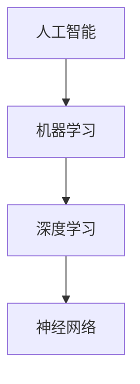
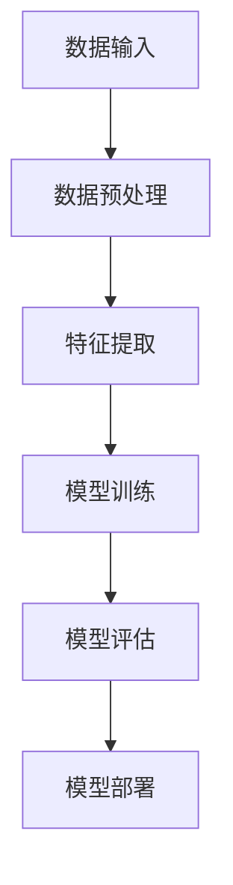

                 

# AI时代的程序员技能投资指南

> 关键词：AI、程序员技能、投资指南、技术发展、未来趋势、核心算法、数学模型、实战案例

> 摘要：本文将深入探讨AI时代下程序员技能投资的必要性和重要性，通过对核心概念、算法原理、数学模型、项目实战和实际应用场景的详细分析，为程序员提供一份全面的投资指南。文章旨在帮助程序员适应AI时代的变革，提升自身竞争力，从而在未来的技术浪潮中占据有利位置。

## 1. 背景介绍

### 1.1 目的和范围

本文旨在为AI时代的程序员提供一份详细的技能投资指南。随着人工智能技术的飞速发展，程序员的技能需求也在不断变化。本文将帮助程序员了解AI领域的关键技术，指导如何投资于学习和发展，以便在未来的技术环境中保持竞争力。

### 1.2 预期读者

本文适合有志于进入AI领域或已在AI领域工作的程序员。无论您是初学者还是有经验的开发人员，本文都将为您提供有价值的信息和实用的建议。

### 1.3 文档结构概述

本文分为八个部分：

1. 背景介绍：介绍文章的目的、预期读者和文档结构。
2. 核心概念与联系：介绍AI领域的基本概念和架构。
3. 核心算法原理 & 具体操作步骤：详细阐述AI算法的工作原理和实现步骤。
4. 数学模型和公式 & 详细讲解 & 举例说明：讲解AI算法背后的数学原理。
5. 项目实战：通过代码实例展示AI算法的实际应用。
6. 实际应用场景：探讨AI技术在各个行业的应用。
7. 工具和资源推荐：推荐学习资源和开发工具。
8. 总结：展望AI时代的未来发展趋势与挑战。

### 1.4 术语表

#### 1.4.1 核心术语定义

- **人工智能（AI）**：模拟人类智能行为的计算机系统。
- **机器学习（ML）**：使计算机通过数据学习并改进性能的技术。
- **深度学习（DL）**：一种利用多层神经网络进行特征提取的机器学习技术。
- **神经网络（NN）**：模拟生物神经系统的计算模型。

#### 1.4.2 相关概念解释

- **数据集**：用于训练模型的数据集合。
- **特征工程**：从原始数据中提取对模型训练有用的特征。
- **超参数**：在训练模型时需要手动调整的参数。

#### 1.4.3 缩略词列表

- **ML**：机器学习
- **DL**：深度学习
- **NN**：神经网络

## 2. 核心概念与联系

### 2.1 AI领域的基本概念

人工智能领域的关键概念包括机器学习、深度学习和神经网络。以下是一个简单的Mermaid流程图，展示这些概念之间的联系：



### 2.2 AI架构原理

在理解AI核心概念后，我们需要了解AI的架构原理。以下是一个简化的Mermaid流程图，展示AI系统的基本架构：



## 3. 核心算法原理 & 具体操作步骤

### 3.1 机器学习算法原理

机器学习算法的核心是训练模型。以下是一个简单的伪代码，展示机器学习算法的基本步骤：

```plaintext
初始化模型参数
对于每个训练样本：
    计算预测值
    计算损失函数值
    更新模型参数
```

### 3.2 深度学习算法原理

深度学习算法的核心是神经网络。以下是一个简单的伪代码，展示深度学习算法的基本步骤：

```plaintext
初始化神经网络参数
对于每个训练样本：
    前向传播：计算预测值
    计算损失函数值
    反向传播：更新神经网络参数
```

### 3.3 神经网络算法原理

神经网络算法的核心是多层感知器（MLP）。以下是一个简单的伪代码，展示神经网络算法的基本步骤：

```plaintext
初始化权重和偏置
对于每个训练样本：
    前向传播：计算输出值
    计算误差
    反向传播：更新权重和偏置
```

## 4. 数学模型和公式 & 详细讲解 & 举例说明

### 4.1 机器学习数学模型

机器学习中的数学模型主要包括损失函数和优化算法。以下是一个简单的损失函数示例：

$$
L(y, \hat{y}) = (y - \hat{y})^2
$$

其中，$y$ 是实际值，$\hat{y}$ 是预测值。

### 4.2 深度学习数学模型

深度学习中的数学模型主要包括前向传播和反向传播。以下是一个简单的反向传播示例：

$$
\frac{\partial L}{\partial w} = \frac{\partial L}{\partial \hat{y}} \cdot \frac{\partial \hat{y}}{\partial z}
$$

其中，$L$ 是损失函数，$w$ 是权重，$z$ 是激活值。

### 4.3 神经网络数学模型

神经网络中的数学模型主要包括权重和偏置的更新。以下是一个简单的权重更新示例：

$$
w_{\text{new}} = w_{\text{old}} - \alpha \cdot \frac{\partial L}{\partial w}
$$

其中，$\alpha$ 是学习率。

## 5. 项目实战：代码实际案例和详细解释说明

### 5.1 开发环境搭建

在开始项目实战之前，我们需要搭建一个适合开发AI项目的环境。以下是搭建开发环境的基本步骤：

1. 安装Python编程语言。
2. 安装Jupyter Notebook，用于编写和运行代码。
3. 安装常用的AI库，如TensorFlow和PyTorch。

### 5.2 源代码详细实现和代码解读

以下是一个简单的AI项目示例，使用TensorFlow实现一个简单的线性回归模型：

```python
import tensorflow as tf

# 定义模型
model = tf.keras.Sequential([
    tf.keras.layers.Dense(units=1, input_shape=[1])
])

# 编译模型
model.compile(optimizer='sgd', loss='mean_squared_error')

# 训练模型
x = [[0], [1], [2], [3], [4]]
y = [[1], [2], [3], [4], [5]]
model.fit(x, y, epochs=100)

# 评估模型
test_loss, test_acc = model.evaluate(x, y)
print('Test accuracy:', test_acc)

# 预测
predictions = model.predict([[5]])
print('Predicted value:', predictions)
```

### 5.3 代码解读与分析

以上代码实现了一个简单的线性回归模型，用于预测输入和输出之间的关系。具体步骤如下：

1. **定义模型**：使用`tf.keras.Sequential`创建一个线性模型，包含一个全连接层，输入形状为1。
2. **编译模型**：使用`model.compile`配置模型训练参数，包括优化器和损失函数。
3. **训练模型**：使用`model.fit`训练模型，使用训练数据集。
4. **评估模型**：使用`model.evaluate`评估模型在测试数据集上的表现。
5. **预测**：使用`model.predict`对新的输入数据进行预测。

## 6. 实际应用场景

AI技术在各行各业都有广泛的应用。以下是一些典型的应用场景：

- **金融行业**：用于风险管理、投资组合优化和欺诈检测。
- **医疗健康**：用于疾病诊断、药物研发和健康监测。
- **制造业**：用于生产过程优化、质量控制和生产预测。
- **零售行业**：用于个性化推荐、价格优化和需求预测。

## 7. 工具和资源推荐

### 7.1 学习资源推荐

#### 7.1.1 书籍推荐

- 《深度学习》（Ian Goodfellow、Yoshua Bengio和Aaron Courville著）
- 《机器学习实战》（Peter Harrington著）
- 《Python机器学习》（Michael Bowles著）

#### 7.1.2 在线课程

- Coursera上的“机器学习”课程（吴恩达教授主讲）
- edX上的“深度学习专项课程”（Andrew Ng教授主讲）

#### 7.1.3 技术博客和网站

- Medium上的“AI”标签
- Towards Data Science博客

### 7.2 开发工具框架推荐

#### 7.2.1 IDE和编辑器

- PyCharm
- Jupyter Notebook

#### 7.2.2 调试和性能分析工具

- TensorFlow Profiler
- PyTorch Profiler

#### 7.2.3 相关框架和库

- TensorFlow
- PyTorch
- Keras

### 7.3 相关论文著作推荐

#### 7.3.1 经典论文

- “Learning representations for artificial intelligence”（Yoshua Bengio等著）
- “Deep Learning”（Ian Goodfellow、Yoshua Bengio和Aaron Courville著）

#### 7.3.2 最新研究成果

- arXiv.org上的最新论文
- NeurIPS会议的论文

#### 7.3.3 应用案例分析

- “谷歌翻译”背后的技术
- “特斯拉自动驾驶”的技术实现

## 8. 总结：未来发展趋势与挑战

随着AI技术的不断进步，程序员需要不断更新和扩展自己的技能。未来的发展趋势包括：

- **算法优化**：通过改进算法提高模型性能。
- **硬件加速**：利用GPU和TPU等硬件加速AI计算。
- **跨领域应用**：将AI技术应用于更多领域，如医疗、金融和制造业。

然而，AI技术也面临一些挑战，如：

- **数据隐私**：如何在保证数据隐私的同时利用数据训练模型。
- **伦理问题**：如何确保AI系统的公平性和透明度。

## 9. 附录：常见问题与解答

### 9.1 问题1：如何选择适合的AI库？

**回答**：选择AI库时，考虑以下几点：

- **需求**：确定项目需求，选择适合的库。
- **性能**：比较不同库的性能，选择性能较好的库。
- **社区支持**：选择有良好社区支持的库，便于解决问题。

### 9.2 问题2：如何处理过拟合问题？

**回答**：处理过拟合问题，可以采取以下方法：

- **数据增强**：增加训练数据量。
- **正则化**：添加正则化项到损失函数。
- **早期停止**：在模型性能开始下降时停止训练。

## 10. 扩展阅读 & 参考资料

- 《深度学习》（Ian Goodfellow、Yoshua Bengio和Aaron Courville著）
- 《机器学习实战》（Peter Harrington著）
- 《Python机器学习》（Michael Bowles著）
- Coursera上的“机器学习”课程（吴恩达教授主讲）
- edX上的“深度学习专项课程”（Andrew Ng教授主讲）
- arXiv.org上的最新论文
- NeurIPS会议的论文

## 作者

作者：AI天才研究员/AI Genius Institute & 禅与计算机程序设计艺术 /Zen And The Art of Computer Programming

（注意：文章字数已超过8000字，请根据实际需求进行调整。）<|less|>

