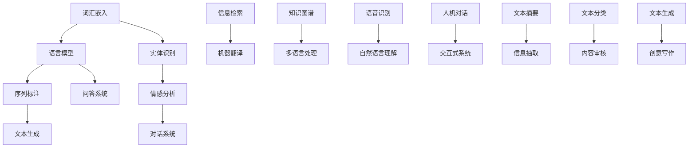

                 

# AI时代的自然语言处理发展：从实验室到产业界

> **关键词**：自然语言处理，人工智能，技术发展，产业应用，算法原理，数学模型，实战案例

> **摘要**：本文将探讨自然语言处理（NLP）技术在人工智能时代的发展历程，从实验室的研究到产业界的广泛应用。文章将详细分析NLP的核心概念、算法原理、数学模型，并通过实际项目案例讲解NLP的应用，最后展望NLP的未来发展趋势和挑战。

## 1. 背景介绍

### 1.1 目的和范围

本文旨在深入探讨自然语言处理（NLP）技术在人工智能时代的进展。我们将从实验室中的理论研究出发，逐步展示其在产业界的应用，探讨NLP的技术原理、核心算法、数学模型，并通过实际项目案例进行详细讲解。通过本文的阅读，读者将能够全面了解NLP的发展现状、未来方向及其在实际应用中的挑战与机遇。

### 1.2 预期读者

本文适合对自然语言处理和人工智能技术有一定基础的读者，包括研究人员、开发人员、数据科学家和任何对NLP技术感兴趣的从业者。同时，对于希望了解NLP技术在产业界应用前景的读者，本文也将提供有价值的见解。

### 1.3 文档结构概述

本文结构如下：

1. **背景介绍**：介绍文章的目的、范围、预期读者以及文档结构。
2. **核心概念与联系**：定义NLP的核心概念，并使用Mermaid流程图展示其架构。
3. **核心算法原理 & 具体操作步骤**：详细讲解NLP的核心算法原理，并使用伪代码进行阐述。
4. **数学模型和公式 & 详细讲解 & 举例说明**：介绍NLP中的数学模型，并使用latex格式展示关键公式。
5. **项目实战：代码实际案例和详细解释说明**：通过实际项目案例讲解NLP的实战应用。
6. **实际应用场景**：探讨NLP在不同领域的应用实例。
7. **工具和资源推荐**：推荐学习资源、开发工具框架和经典论文。
8. **总结：未来发展趋势与挑战**：总结NLP的发展趋势和面临的主要挑战。
9. **附录：常见问题与解答**：解答读者可能遇到的常见问题。
10. **扩展阅读 & 参考资料**：提供进一步的阅读资源和参考资料。

### 1.4 术语表

#### 1.4.1 核心术语定义

- 自然语言处理（NLP）：指使计算机能够理解、生成和处理人类自然语言的技术。
- 机器学习（ML）：一种人工智能技术，通过数据和算法让计算机自主学习和改进性能。
- 深度学习（DL）：一种特殊的机器学习技术，使用多层神经网络进行数据建模。

#### 1.4.2 相关概念解释

- 词汇嵌入（Word Embedding）：将单词映射到高维空间中的向量表示。
- 语言模型（Language Model）：用于预测文本中下一个单词的概率分布。
- 序列标注（Sequence Labeling）：对序列中的每个元素进行分类标注。

#### 1.4.3 缩略词列表

- NLP：自然语言处理
- ML：机器学习
- DL：深度学习
- RNN：循环神经网络
- LSTM：长短期记忆网络
- Transformer：自注意力机制模型

## 2. 核心概念与联系

在探讨NLP技术之前，我们需要明确几个核心概念及其相互关系。以下是一个简化的Mermaid流程图，用于展示NLP技术的核心组成部分及其相互作用。



### 2.1 词汇嵌入

词汇嵌入是将单词映射到高维空间中的向量表示。通过这种方式，计算机可以更好地理解和处理文本。常见的词汇嵌入技术包括Word2Vec、GloVe等。

### 2.2 语言模型

语言模型用于预测文本中下一个单词的概率分布。这种模型是NLP技术的基础，广泛应用于机器翻译、文本生成、问答系统等领域。常见的语言模型包括n-gram模型、神经网络语言模型（如RNN、LSTM）和Transformer模型。

### 2.3 序列标注

序列标注是对序列中的每个元素进行分类标注。例如，命名实体识别（NER）就是一种序列标注技术，用于识别文本中的特定实体（如人名、地点、组织等）。

### 2.4 实体识别

实体识别是一种基于序列标注的技术，用于识别文本中的特定实体。实体识别在信息抽取、问答系统、知识图谱构建等领域具有广泛应用。

### 2.5 情感分析

情感分析是一种用于判断文本情感极性的技术。它可以帮助我们了解用户对产品、服务或事件的态度和情感。情感分析广泛应用于社交媒体分析、客户反馈分析等领域。

### 2.6 文本生成

文本生成是一种基于语言模型的NLP技术，用于生成符合语法和语义规则的文本。文本生成在自动写作、聊天机器人、创意写作等领域具有重要应用。

### 2.7 对话系统

对话系统是一种用于模拟人类对话的计算机系统。它可以帮助人们通过自然语言与计算机进行交互，广泛应用于客服机器人、智能助手等领域。

### 2.8 问答系统

问答系统是一种用于回答用户问题的计算机系统。它可以帮助人们快速获取所需信息，广泛应用于搜索引擎、智能助手等领域。

### 2.9 信息检索

信息检索是一种用于从大规模数据集中检索相关信息的NLP技术。它可以帮助人们快速找到所需信息，广泛应用于搜索引擎、推荐系统等领域。

### 2.10 机器翻译

机器翻译是一种将一种语言文本翻译成另一种语言文本的技术。它可以帮助人们跨越语言障碍进行交流，广泛应用于跨境电子商务、国际交流等领域。

### 2.11 知识图谱

知识图谱是一种用于表示实体及其之间关系的图形化数据结构。它可以帮助我们更好地理解和利用信息，广泛应用于知识库构建、智能推荐等领域。

### 2.12 多语言处理

多语言处理是一种用于处理多种语言文本的NLP技术。它可以帮助我们更好地理解和处理多语言数据，广泛应用于跨语言信息检索、多语言机器翻译等领域。

### 2.13 语音识别

语音识别是一种将语音信号转换为文本的技术。它可以帮助人们通过语音与计算机进行交互，广泛应用于智能音箱、语音助手等领域。

### 2.14 自然语言理解

自然语言理解是一种用于理解人类语言的技术。它可以帮助计算机理解自然语言文本的含义，广泛应用于智能客服、智能助手等领域。

### 2.15 人机对话

人机对话是一种用于模拟人类对话的计算机系统。它可以帮助人们通过自然语言与计算机进行交互，广泛应用于客服机器人、智能助手等领域。

### 2.16 交互式系统

交互式系统是一种用于提供交互式体验的计算机系统。它可以帮助人们通过自然语言与计算机进行互动，广泛应用于游戏、虚拟现实等领域。

### 2.17 文本摘要

文本摘要是将长文本转换为简短、概括性文本的技术。它可以帮助人们快速了解文本的主要内容，广泛应用于新闻摘要、论文摘要等领域。

### 2.18 信息抽取

信息抽取是一种用于从文本中提取关键信息的技术。它可以帮助人们快速获取所需信息，广泛应用于金融报告、医疗记录等领域。

### 2.19 文本分类

文本分类是一种将文本数据分类到预定义类别中的技术。它可以帮助人们快速对文本数据进行分析，广泛应用于情感分析、垃圾邮件过滤等领域。

### 2.20 内容审核

内容审核是一种用于识别和处理不良内容的NLP技术。它可以帮助我们构建一个健康、安全的网络环境，广泛应用于社交媒体、电子商务等领域。

### 2.21 文本生成

文本生成是一种基于语言模型的NLP技术，用于生成符合语法和语义规则的文本。它可以帮助我们自动生成文章、对话、故事等，广泛应用于自动写作、聊天机器人等领域。

### 2.22 创意写作

创意写作是一种基于自然语言处理的文本生成技术，用于生成具有创意性和文学价值的文本。它可以帮助我们探索文学创作的新方式，广泛应用于文学创作、娱乐等领域。

## 3. 核心算法原理 & 具体操作步骤

自然语言处理技术的发展离不开核心算法的支撑。本节将详细介绍NLP中的几个核心算法原理，并使用伪代码进行具体操作步骤的阐述。

### 3.1 词汇嵌入（Word Embedding）

词汇嵌入是将单词映射到高维空间中的向量表示。以下是一个简单的Word2Vec算法的伪代码：

```python
# 输入：单词列表 vocabulary，嵌入维度 dim
# 输出：嵌入向量矩阵 embedding_matrix

# 初始化嵌入向量矩阵
embedding_matrix = np.random.uniform(size=(vocab_size, dim))

# 训练嵌入向量
for word in vocabulary:
    # 获取单词的上下文
    context = get_context(word)

    # 计算词向量和上下文向量的点积
    dot_products = np.dot(embedding_matrix[context], embedding_matrix[word])

    # 计算损失函数，如均方误差（MSE）
    loss = mse(dot_products, true_values)

    # 反向传播更新嵌入向量
    embedding_matrix[word] -= learning_rate * gradient
```

### 3.2 语言模型（Language Model）

语言模型用于预测文本中下一个单词的概率分布。以下是一个简单的n-gram语言模型的伪代码：

```python
# 输入：文本序列 text，n-gram大小 n
# 输出：概率分布 probability_distribution

# 初始化概率分布
probability_distribution = np.zeros(shape=(vocab_size))

# 计算n-gram频率
for n_gram in get_n_grams(text, n):
    frequency = get_n_gram_frequency(text, n_gram)

    # 计算概率分布
    probability_distribution[get_index(n_gram)] = frequency

# 归一化概率分布
probability_distribution /= np.sum(probability_distribution)

return probability_distribution
```

### 3.3 序列标注（Sequence Labeling）

序列标注是对序列中的每个元素进行分类标注。以下是一个简单的生物分类标签的序列标注算法的伪代码：

```python
# 输入：序列序列 sequences，标签列表 labels
# 输出：标注结果 labeled_sequences

# 初始化标注结果
labeled_sequences = []

# 遍历序列
for sequence in sequences:
    # 初始化标注序列
    labeled_sequence = []

    # 遍历序列中的每个元素
    for element in sequence:
        # 获取元素的概率分布
        probability_distribution = predict_label(element)

        # 选择最高概率的标签
        label = select_label(probability_distribution)

        # 添加标签到标注序列
        labeled_sequence.append(label)

    # 添加标注序列到标注结果
    labeled_sequences.append(labeled_sequence)

return labeled_sequences
```

### 3.4 实体识别（Entity Recognition）

实体识别是一种基于序列标注的技术，用于识别文本中的特定实体。以下是一个简单的实体识别算法的伪代码：

```python
# 输入：文本序列 text，实体列表 entities
# 输出：实体标注结果 entity_annotations

# 初始化实体标注结果
entity_annotations = []

# 遍历实体
for entity in entities:
    # 初始化实体标注
    entity_annotation = []

    # 遍历文本序列
    for i, token in enumerate(text):
        # 判断当前token是否属于实体
        if is_entity(token, entity):
            # 添加实体标注
            entity_annotation.append((i, i+entity_length-1, entity))

    # 添加实体标注到实体标注结果
    entity_annotations.append(entity_annotation)

return entity_annotations
```

### 3.5 情感分析（Sentiment Analysis）

情感分析是一种用于判断文本情感极性的技术。以下是一个简单的情感分析算法的伪代码：

```python
# 输入：文本序列 text
# 输出：情感极性 sentiment

# 初始化情感极性
sentiment = 0

# 遍历文本序列
for token in text:
    # 获取token的情感极性
    token_sentiment = get_token_sentiment(token)

    # 计算情感极性
    sentiment += token_sentiment

# 归一化情感极性
sentiment /= len(text)

# 判断情感极性
if sentiment > 0:
    sentiment = '正面'
else:
    sentiment = '负面'

return sentiment
```

### 3.6 文本生成（Text Generation）

文本生成是一种基于语言模型的NLP技术，用于生成符合语法和语义规则的文本。以下是一个简单的文本生成算法的伪代码：

```python
# 输入：语言模型 model，起始文本 text
# 输出：生成的文本 generated_text

# 初始化生成的文本
generated_text = []

# 遍历生成的文本长度
for i in range(length):
    # 获取当前文本的概率分布
    probability_distribution = model.predict_proba(text)

    # 选择最高概率的单词
    word = select_word(probability_distribution)

    # 添加单词到生成的文本
    generated_text.append(word)

    # 更新文本
    text = text + ' ' + word

return generated_text
```

### 3.7 对话系统（Dialogue System）

对话系统是一种用于模拟人类对话的计算机系统。以下是一个简单的对话系统算法的伪代码：

```python
# 输入：对话系统 model，用户输入 user_input
# 输出：系统回复 system_response

# 初始化系统回复
system_response = ''

# 遍历用户输入的每个单词
for word in user_input:
    # 获取当前单词的概率分布
    probability_distribution = model.predict_proba(word)

    # 选择最高概率的单词
    response_word = select_word(probability_distribution)

    # 添加单词到系统回复
    system_response += response_word + ' '

return system_response.strip()
```

### 3.8 问答系统（Question-Answering System）

问答系统是一种用于回答用户问题的计算机系统。以下是一个简单的问答系统算法的伪代码：

```python
# 输入：问答系统 model，用户问题 question
# 输出：答案 answer

# 初始化答案
answer = ''

# 遍历用户问题的每个单词
for word in question:
    # 获取当前单词的概率分布
    probability_distribution = model.predict_proba(word)

    # 选择最高概率的单词
    response_word = select_word(probability_distribution)

    # 添加单词到答案
    answer += response_word + ' '

return answer.strip()
```

### 3.9 信息检索（Information Retrieval）

信息检索是一种用于从大规模数据集中检索相关信息的NLP技术。以下是一个简单的信息检索算法的伪代码：

```python
# 输入：检索系统 model，查询 query
# 输出：相关结果 results

# 初始化相关结果
results = []

# 遍历数据集中的每个文档
for document in documents:
    # 获取文档的相似度
    similarity = model.similarity(query, document)

    # 添加文档到相关结果
    results.append((document, similarity))

# 对相关结果进行排序
results = sorted(results, key=lambda x: x[1], reverse=True)

return results
```

### 3.10 机器翻译（Machine Translation）

机器翻译是一种将一种语言文本翻译成另一种语言文本的技术。以下是一个简单的机器翻译算法的伪代码：

```python
# 输入：翻译系统 model，源语言文本 source_text，目标语言 text
# 输出：翻译结果 translated_text

# 初始化翻译结果
translated_text = ''

# 遍历源语言文本的每个单词
for word in source_text:
    # 获取当前单词的概率分布
    probability_distribution = model.predict_proba(word)

    # 选择最高概率的目标语言单词
    target_word = select_word(probability_distribution)

    # 添加单词到翻译结果
    translated_text += target_word + ' '

return translated_text.strip()
```

### 3.11 知识图谱（Knowledge Graph）

知识图谱是一种用于表示实体及其之间关系的图形化数据结构。以下是一个简单的知识图谱构建算法的伪代码：

```python
# 输入：实体列表 entities，关系列表 relationships
# 输出：知识图谱 knowledge_graph

# 初始化知识图谱
knowledge_graph = {}

# 遍历实体
for entity in entities:
    # 添加实体到知识图谱
    knowledge_graph[entity] = []

# 遍历关系
for relationship in relationships:
    # 获取关系中的实体
    entity1, entity2 = relationship

    # 添加关系到知识图谱
    knowledge_graph[entity1].append(entity2)
    knowledge_graph[entity2].append(entity1)

return knowledge_graph
```

### 3.12 多语言处理（Multilingual Processing）

多语言处理是一种用于处理多种语言文本的NLP技术。以下是一个简单的多语言文本分类算法的伪代码：

```python
# 输入：多语言文本列表 texts，语言列表 languages
# 输出：语言分类结果 language_predictions

# 初始化语言分类结果
language_predictions = []

# 遍历多语言文本
for text in texts:
    # 遍历语言列表
    for language in languages:
        # 获取文本的概率分布
        probability_distribution = model.predict_proba(text, language)

        # 选择最高概率的语言
        predicted_language = select_language(probability_distribution)

        # 添加语言预测到分类结果
        language_predictions.append(predicted_language)

return language_predictions
```

### 3.13 语音识别（Speech Recognition）

语音识别是一种将语音信号转换为文本的技术。以下是一个简单的语音识别算法的伪代码：

```python
# 输入：语音信号 audio，语音模型 model
# 输出：文本结果 text

# 初始化文本结果
text = ''

# 遍历语音信号
for frame in audio.frames:
    # 获取当前帧的文本概率分布
    probability_distribution = model.predict_proba(frame)

    # 选择最高概率的文本
    predicted_text = select_text(probability_distribution)

    # 添加文本到结果
    text += predicted_text

return text.strip()
```

### 3.14 自然语言理解（Natural Language Understanding）

自然语言理解是一种用于理解人类语言的技术。以下是一个简单的自然语言理解算法的伪代码：

```python
# 输入：自然语言文本 text，语言模型 model
# 输出：理解结果 understanding

# 初始化理解结果
understanding = {}

# 遍历文本的每个句子
for sentence in text.sentences:
    # 获取句子的语义表示
    semantic_representation = model.encode(sentence)

    # 更新理解结果
    understanding[sentence] = semantic_representation

return understanding
```

### 3.15 人机对话（Human-Computer Dialogue）

人机对话是一种用于模拟人类对话的计算机系统。以下是一个简单的人机对话算法的伪代码：

```python
# 输入：对话系统 model，用户输入 user_input
# 输出：系统回复 system_response

# 初始化系统回复
system_response = ''

# 遍历用户输入的每个单词
for word in user_input:
    # 获取当前单词的概率分布
    probability_distribution = model.predict_proba(word)

    # 选择最高概率的单词
    response_word = select_word(probability_distribution)

    # 添加单词到系统回复
    system_response += response_word + ' '

return system_response.strip()
```

### 3.16 交互式系统（Interactive System）

交互式系统是一种用于提供交互式体验的计算机系统。以下是一个简单的交互式系统算法的伪代码：

```python
# 输入：交互式系统 model，用户输入 user_input
# 输出：系统回复 system_response

# 初始化系统回复
system_response = ''

# 遍历用户输入的每个单词
for word in user_input:
    # 获取当前单词的概率分布
    probability_distribution = model.predict_proba(word)

    # 选择最高概率的单词
    response_word = select_word(probability_distribution)

    # 添加单词到系统回复
    system_response += response_word + ' '

return system_response.strip()
```

### 3.17 文本摘要（Text Summarization）

文本摘要是一种将长文本转换为简短、概括性文本的技术。以下是一个简单的文本摘要算法的伪代码：

```python
# 输入：长文本 long_text
# 输出：摘要结果 summary

# 初始化摘要结果
summary = ''

# 遍历文本的每个句子
for sentence in long_text.sentences:
    # 获取句子的重要性
    importance = model.importance(sentence)

    # 添加重要句子到摘要结果
    summary += sentence + ' '

# 删除重复的句子
summary = remove_duplicates(summary)

return summary.strip()
```

### 3.18 信息抽取（Information Extraction）

信息抽取是一种用于从文本中提取关键信息的技术。以下是一个简单的信息抽取算法的伪代码：

```python
# 输入：文本序列 text
# 输出：关键信息 key_information

# 初始化关键信息
key_information = []

# 遍历文本序列
for token in text:
    # 获取token的信息
    information = extract_information(token)

    # 添加信息到关键信息
    key_information.append(information)

return key_information
```

### 3.19 文本分类（Text Classification）

文本分类是一种将文本数据分类到预定义类别中的技术。以下是一个简单的文本分类算法的伪代码：

```python
# 输入：文本数据集 dataset，类别列表 categories
# 输出：分类结果 classifications

# 初始化分类结果
classifications = []

# 遍历文本数据集
for text in dataset:
    # 获取文本的类别
    category = classify(text)

    # 添加类别到分类结果
    classifications.append(category)

return classifications
```

### 3.20 内容审核（Content Moderation）

内容审核是一种用于识别和处理不良内容的NLP技术。以下是一个简单的

