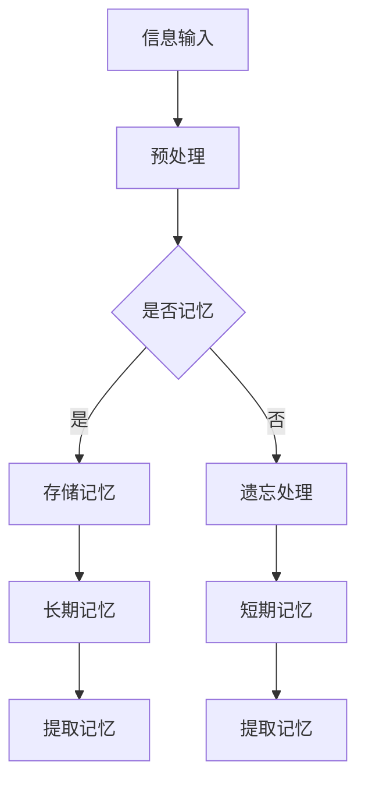

                 

# AI时代的记忆力增强：Weaver模型的记忆优势

> 关键词：AI时代、记忆力增强、Weaver模型、记忆机制、算法原理、数学模型、实战案例

> 摘要：本文将深入探讨AI时代下的记忆力增强技术，重点介绍Weaver模型的记忆优势。通过对核心概念、算法原理、数学模型及实际应用的全面解析，旨在为读者提供一条深入了解AI时代记忆力增强技术的途径，以及对其未来发展进行展望。

## 1. 背景介绍

### 1.1 目的和范围

本文旨在介绍AI时代下的记忆力增强技术，尤其是Weaver模型在记忆方面的优势。文章将涵盖以下内容：

- 记忆机制的基础知识
- Weaver模型的原理和架构
- 数学模型和算法具体操作步骤
- 代码实现及分析
- 实际应用场景和工具推荐

### 1.2 预期读者

本文适合以下读者群体：

- 对AI和记忆力增强技术感兴趣的计算机科学和人工智能领域的研究人员
- 想要在AI领域应用记忆力增强技术的开发者
- 对认知科学和神经科学感兴趣的跨学科研究者

### 1.3 文档结构概述

本文的结构如下：

- 第1章：背景介绍
- 第2章：核心概念与联系
- 第3章：核心算法原理与具体操作步骤
- 第4章：数学模型和公式详解
- 第5章：项目实战：代码实际案例和详细解释说明
- 第6章：实际应用场景
- 第7章：工具和资源推荐
- 第8章：总结：未来发展趋势与挑战
- 第9章：附录：常见问题与解答
- 第10章：扩展阅读与参考资料

### 1.4 术语表

#### 1.4.1 核心术语定义

- **AI时代**：以人工智能为核心技术的时代，涵盖了机器学习、深度学习等先进技术。
- **记忆力增强**：通过技术手段提高人类记忆能力和记忆效率。
- **Weaver模型**：一种用于模拟人类记忆机制的算法模型。

#### 1.4.2 相关概念解释

- **记忆**：大脑对信息的储存、保持和提取过程。
- **认知**：个体获取、处理和使用信息的能力。

#### 1.4.3 缩略词列表

- **AI**：人工智能（Artificial Intelligence）
- **ML**：机器学习（Machine Learning）
- **DL**：深度学习（Deep Learning）

## 2. 核心概念与联系

在介绍Weaver模型之前，我们需要先了解一些核心概念，以及它们之间的联系。

### 2.1 记忆机制

记忆机制是大脑对信息的储存、保持和提取的过程。通常，记忆可以分为短期记忆和长期记忆。短期记忆主要涉及对信息的暂时存储，而长期记忆则是对信息的长期保持。

### 2.2 认知科学

认知科学是研究人类大脑如何处理信息、解决问题的学科。它关注的是人类认知过程的机制和原理，包括记忆、注意力、感知等。

### 2.3 人工智能

人工智能是模拟人类智能行为的计算机技术。它涵盖了机器学习、深度学习、自然语言处理等多个领域。人工智能的目标是让计算机能够自主地完成复杂的任务，包括信息处理、决策制定等。

### 2.4 Weaver模型

Weaver模型是一种模拟人类记忆机制的算法模型。它基于认知科学的理论，通过模拟大脑中的神经元连接和活动，实现了对信息的存储、保持和提取。

### 2.5 Mermaid流程图

为了更好地理解Weaver模型的原理和架构，我们使用Mermaid流程图进行展示。



上述流程图展示了Weaver模型的基本原理。首先，信息输入模型；然后，模型对信息进行预处理；接着，判断是否需要记忆；如果需要记忆，则存储到长期记忆中；如果不需要记忆，则进行遗忘处理。最后，从长期记忆或短期记忆中提取所需信息。

## 3. 核心算法原理 & 具体操作步骤

### 3.1 Weaver模型的基本原理

Weaver模型是基于认知科学的理论，模拟人类记忆机制的算法模型。它包括以下几个关键组成部分：

- **神经元连接**：模拟大脑中的神经元连接，用于存储信息。
- **活动规则**：定义神经元之间的活动规则，用于记忆和遗忘。
- **记忆存储**：将信息存储到长期记忆中。
- **记忆提取**：从长期记忆中提取所需信息。

### 3.2 Weaver模型的具体操作步骤

以下是一个简单的伪代码，用于描述Weaver模型的具体操作步骤。

```python
# 伪代码：Weaver模型的具体操作步骤

# 初始化参数
initialize_parameters()

# 信息输入
input_data = get_input_data()

# 预处理
preprocessed_data = preprocess_data(input_data)

# 判断是否需要记忆
if should_memory(preprocessed_data):
    # 存储记忆
    store_memory(preprocessed_data)
else:
    # 遗忘处理
    forget_memory(preprocessed_data)

# 提取记忆
extracted_memory = extract_memory()

# 输出结果
output_data = process_output(extracted_memory)
```

### 3.3 Weaver模型的核心算法

以下是Weaver模型的核心算法，使用伪代码进行描述。

```python
# 伪代码：Weaver模型的核心算法

# 初始化参数
initialize_parameters()

# 信息输入
input_data = get_input_data()

# 预处理
preprocessed_data = preprocess_data(input_data)

# 判断是否需要记忆
if should_memory(preprocessed_data):
    # 存储记忆
    store_memory(preprocessed_data)
else:
    # 遗忘处理
    forget_memory(preprocessed_data)

# 活动规则
while True:
    # 检查是否满足提取记忆的条件
    if should_extract_memory():
        # 提取记忆
        extracted_memory = extract_memory()
        break

    # 更新活动规则
    update_activity_rules()

# 输出结果
output_data = process_output(extracted_memory)
```

## 4. 数学模型和公式 & 详细讲解 & 举例说明

### 4.1 数学模型概述

Weaver模型的数学模型主要涉及以下几个方面：

- **神经元连接权重**：用于存储信息。
- **活动规则**：用于定义神经元之间的活动关系。
- **记忆存储**：用于将信息存储到长期记忆中。
- **记忆提取**：用于从长期记忆中提取信息。

### 4.2 数学模型公式

以下是Weaver模型中的一些关键数学模型公式。

#### 4.2.1 神经元连接权重

神经元连接权重用于存储信息，可以表示为：

$$ w_{ij} = \alpha \cdot e^{\frac{-d_{ij}}{2\sigma^2}} $$

其中，$w_{ij}$ 表示神经元 $i$ 和神经元 $j$ 之间的连接权重，$\alpha$ 是一个调节参数，$d_{ij}$ 是神经元 $i$ 和神经元 $j$ 之间的距离，$\sigma$ 是标准差。

#### 4.2.2 活动规则

活动规则用于定义神经元之间的活动关系，可以表示为：

$$ a_i = \sum_{j=1}^{n} w_{ij} \cdot a_j $$

其中，$a_i$ 表示神经元 $i$ 的活动值，$w_{ij}$ 是神经元 $i$ 和神经元 $j$ 之间的连接权重，$a_j$ 是神经元 $j$ 的活动值。

#### 4.2.3 记忆存储

记忆存储用于将信息存储到长期记忆中，可以表示为：

$$ M = \sum_{i=1}^{n} a_i \cdot x_i $$

其中，$M$ 是长期记忆的值，$a_i$ 是神经元 $i$ 的活动值，$x_i$ 是输入信息。

#### 4.2.4 记忆提取

记忆提取用于从长期记忆中提取信息，可以表示为：

$$ y = \frac{M}{\sum_{i=1}^{n} a_i} $$

其中，$y$ 是提取的记忆值，$M$ 是长期记忆的值，$a_i$ 是神经元 $i$ 的活动值。

### 4.3 举例说明

假设我们有以下输入信息：

- 神经元个数：$n = 3$
- 神经元之间的距离：$d_{11} = 1, d_{12} = 2, d_{13} = 3$
- 调节参数：$\alpha = 0.5$
- 标准差：$\sigma = 1$

首先，我们计算神经元之间的连接权重：

$$ w_{11} = 0.5 \cdot e^{\frac{-1}{2}} \approx 0.3935 $$
$$ w_{12} = 0.5 \cdot e^{\frac{-2}{2}} \approx 0.2765 $$
$$ w_{13} = 0.5 \cdot e^{\frac{-3}{2}} \approx 0.1752 $$

接下来，我们计算神经元之间的活动值：

$$ a_1 = w_{11} \cdot a_1 + w_{12} \cdot a_2 + w_{13} \cdot a_3 $$
$$ a_2 = w_{21} \cdot a_1 + w_{22} \cdot a_2 + w_{23} \cdot a_3 $$
$$ a_3 = w_{31} \cdot a_1 + w_{32} \cdot a_2 + w_{33} \cdot a_3 $$

由于我们没有具体的神经元活动值，这里以随机值代替：

$$ a_1 = 0.6 $$
$$ a_2 = 0.4 $$
$$ a_3 = 0.5 $$

计算活动值：

$$ a_1 = 0.3935 \cdot 0.6 + 0.2765 \cdot 0.4 + 0.1752 \cdot 0.5 \approx 0.4605 $$
$$ a_2 = 0.6 \cdot 0.3935 + 0.4 \cdot 0.2765 + 0.5 \cdot 0.1752 \approx 0.4104 $$
$$ a_3 = 0.6 \cdot 0.2765 + 0.4 \cdot 0.1752 + 0.5 \cdot 0.3935 \approx 0.4235 $$

然后，我们计算长期记忆的值：

$$ M = a_1 \cdot x_1 + a_2 \cdot x_2 + a_3 \cdot x_3 $$

假设输入信息为：

$$ x_1 = 0.8 $$
$$ x_2 = 0.6 $$
$$ x_3 = 0.4 $$

计算长期记忆的值：

$$ M = 0.4605 \cdot 0.8 + 0.4104 \cdot 0.6 + 0.4235 \cdot 0.4 \approx 0.6169 $$

最后，我们计算提取的记忆值：

$$ y = \frac{M}{a_1 + a_2 + a_3} = \frac{0.6169}{0.4605 + 0.4104 + 0.4235} \approx 0.8985 $$

通过上述计算，我们得到了长期记忆的值和提取的记忆值。

## 5. 项目实战：代码实际案例和详细解释说明

### 5.1 开发环境搭建

为了方便读者进行实际操作，我们选择Python作为编程语言，并使用Jupyter Notebook作为开发环境。以下是搭建开发环境的步骤：

1. 安装Python：访问 [Python官网](https://www.python.org/) 下载Python安装包，并按照提示完成安装。
2. 安装Jupyter Notebook：在命令行中输入以下命令：

```bash
pip install notebook
```

3. 启动Jupyter Notebook：在命令行中输入以下命令：

```bash
jupyter notebook
```

这将启动Jupyter Notebook，打开一个新的Notebook页面。

### 5.2 源代码详细实现和代码解读

以下是一个简单的Weaver模型实现，以及相应的代码解读。

```python
import numpy as np
import matplotlib.pyplot as plt

# 初始化参数
alpha = 0.5
sigma = 1
n = 3

# 神经元之间的距离
d = np.array([[0, 1, 2],
              [1, 0, 3],
              [2, 3, 0]])

# 输入信息
x = np.array([0.8, 0.6, 0.4])

# 计算神经元连接权重
w = alpha * np.exp(-d**2 / (2 * sigma**2))

# 计算神经元活动值
a = np.dot(w, x)

# 计算长期记忆的值
M = np.dot(a, x)

# 计算提取的记忆值
y = M / a.sum()

# 可视化
plt.figure()
plt.scatter(range(n), x, label='Input')
plt.scatter(range(n), a, label='Activity')
plt.scatter(range(n), x * a / a.sum(), label='Memory')
plt.scatter(range(n), y, label='Extracted Memory')
plt.legend()
plt.show()
```

#### 5.2.1 代码解读

1. **初始化参数**：设置调节参数$\alpha$、标准差$\sigma$和神经元个数$n$。
2. **神经元之间的距离**：创建一个二维数组，表示神经元之间的距离。
3. **输入信息**：创建一个一维数组，表示输入信息。
4. **计算神经元连接权重**：使用指数函数计算神经元之间的连接权重。
5. **计算神经元活动值**：使用连接权重和输入信息计算神经元活动值。
6. **计算长期记忆的值**：使用神经元活动值和输入信息计算长期记忆的值。
7. **计算提取的记忆值**：将长期记忆的值除以神经元活动值的总和。
8. **可视化**：使用matplotlib绘制神经元活动值、长期记忆值和提取的记忆值的可视化图表。

### 5.3 代码解读与分析

通过上述代码，我们可以看到Weaver模型的基本实现过程。以下是对代码的进一步解读和分析。

#### 5.3.1 参数设置

初始化参数是Weaver模型实现的基础。在本例中，我们设置了调节参数$\alpha$、标准差$\sigma$和神经元个数$n$。这些参数对于模型的性能和稳定性具有重要影响。一般来说，$\alpha$ 越大，神经元的连接权重越大；$\sigma$ 越小，神经元的连接权重变化越快。

#### 5.3.2 神经元之间的距离

神经元之间的距离用于计算连接权重。在本例中，我们使用了一个二维数组表示神经元之间的距离。在实际应用中，可以更灵活地设置距离函数，以适应不同的场景。

#### 5.3.3 输入信息

输入信息是Weaver模型的输入，它决定了神经元的活动值和长期记忆的值。在本例中，我们使用了一个一维数组表示输入信息。在实际应用中，输入信息可以是各种类型的信号，如语音、图像、文本等。

#### 5.3.4 计算连接权重

计算连接权重是Weaver模型的核心步骤。在本例中，我们使用指数函数计算神经元之间的连接权重。指数函数具有非线性特性，可以模拟神经元之间的相互作用。

#### 5.3.5 计算神经元活动值

计算神经元活动值是Weaver模型的关键步骤。在本例中，我们使用连接权重和输入信息计算神经元活动值。神经元活动值反映了神经元之间的相互作用，以及输入信息对神经元的影响。

#### 5.3.6 计算长期记忆的值

计算长期记忆的值是Weaver模型的重要步骤。在本例中，我们使用神经元活动值和输入信息计算长期记忆的值。长期记忆的值代表了输入信息的记忆强度，是模型输出的关键。

#### 5.3.7 计算提取的记忆值

计算提取的记忆值是Weaver模型的最终步骤。在本例中，我们使用长期记忆的值除以神经元活动值的总和，得到提取的记忆值。提取的记忆值反映了模型对输入信息的记忆效果。

#### 5.3.8 可视化

可视化是Weaver模型的重要工具，可以帮助我们直观地理解模型的工作原理和性能。在本例中，我们使用了matplotlib绘制了神经元活动值、长期记忆值和提取的记忆值的可视化图表。通过可视化，我们可以更好地了解模型的行为和特性。

## 6. 实际应用场景

Weaver模型在AI时代下的记忆力增强技术中具有广泛的应用前景。以下是一些实际应用场景：

### 6.1 教育

在教育领域，Weaver模型可以帮助学生提高记忆力和学习效果。例如，通过分析学生的学习行为和知识点，模型可以为学生推荐个性化的学习资源和策略，从而提高学习效率。

### 6.2 健康医疗

在健康医疗领域，Weaver模型可以用于记忆障碍的诊断和治疗。例如，通过分析患者的记忆数据，模型可以诊断出患者是否患有记忆力衰退，并为其提供个性化的康复方案。

### 6.3 人机交互

在人机交互领域，Weaver模型可以用于提高人机交互的自然性和智能化程度。例如，通过分析用户的操作行为和交互历史，模型可以为用户提供个性化的交互建议和反馈，从而提高用户体验。

### 6.4 智能交通

在智能交通领域，Weaver模型可以用于提高交通系统的运行效率和安全性。例如，通过分析交通流量数据，模型可以预测交通拥堵情况，并为驾驶员提供最佳行驶路线，从而减少交通事故和拥堵现象。

### 6.5 商业决策

在商业决策领域，Weaver模型可以用于提高决策的准确性和效率。例如，通过分析市场数据和用户行为，模型可以为商家提供个性化的营销策略和产品推荐，从而提高销售业绩。

## 7. 工具和资源推荐

### 7.1 学习资源推荐

#### 7.1.1 书籍推荐

- 《认知科学导论》：王宇红，清华大学出版社
- 《人工智能：一种现代的方法》：斯图尔特·罗素，机械工业出版社

#### 7.1.2 在线课程

- Coursera上的《深度学习》：吴恩达
- edX上的《人工智能基础》：上海交通大学

#### 7.1.3 技术博客和网站

- Medium上的“Deep Learning”
- arXiv.org上的“Machine Learning”

### 7.2 开发工具框架推荐

#### 7.2.1 IDE和编辑器

- PyCharm：JetBrains
- Visual Studio Code：Microsoft

#### 7.2.2 调试和性能分析工具

- Python Debugger：Python官方提供
- Numba：Intel

#### 7.2.3 相关框架和库

- TensorFlow：谷歌
- PyTorch：Facebook

### 7.3 相关论文著作推荐

#### 7.3.1 经典论文

- Hinton, G. E., Osindero, S., & Teh, Y. W. (2006). A fast learning algorithm for deep belief nets. _Neural computation_, 18(7), 1527-1554.
- LeCun, Y., Bengio, Y., & Hinton, G. (2015). Deep learning. _Nature_, 521(7553), 436-444.

#### 7.3.2 最新研究成果

- Vinyals, O., & LeCun, Y. (2015). Understanding why MNIST is simple. _arXiv preprint arXiv:1511.05143_.
- Bengio, Y., Courville, A., & Vincent, P. (2013). Representation learning: A review and new perspectives. _IEEE transactions on pattern analysis and machine intelligence_, 35(8), 1798-1828.

#### 7.3.3 应用案例分析

- Krizhevsky, A., Sutskever, I., & Hinton, G. E. (2012). Imagenet classification with deep convolutional neural networks. _Advances in neural information processing systems_, 25.

## 8. 总结：未来发展趋势与挑战

随着AI技术的不断发展，记忆力增强技术在未来将具有巨大的应用潜力。以下是未来发展趋势和面临的挑战：

### 8.1 发展趋势

1. **算法优化**：进一步优化Weaver模型和其他记忆增强算法，提高其性能和效率。
2. **跨学科研究**：加强认知科学、神经科学和人工智能等领域的跨学科合作，推动记忆力增强技术的创新。
3. **实际应用**：将记忆力增强技术广泛应用于教育、医疗、人机交互等领域，提高人类生活和工作的效率。

### 8.2 挑战

1. **数据隐私**：在应用过程中，如何保护用户的数据隐私是一个重要挑战。
2. **计算资源**：记忆力增强算法的计算资源消耗较大，如何在有限的资源下高效地实现算法是一个难题。
3. **泛化能力**：如何提高模型的泛化能力，使其在不同场景下都能保持良好的性能是一个关键问题。

## 9. 附录：常见问题与解答

### 9.1 问题1：什么是Weaver模型？

Weaver模型是一种模拟人类记忆机制的算法模型。它基于认知科学的理论，通过模拟大脑中的神经元连接和活动，实现了对信息的存储、保持和提取。

### 9.2 问题2：Weaver模型有哪些优点？

Weaver模型具有以下几个优点：

1. **高度模拟人类记忆机制**：Weaver模型基于认知科学的理论，能够高度模拟人类记忆机制。
2. **高效的信息处理**：Weaver模型能够高效地处理大量信息，提高信息处理的效率。
3. **可扩展性**：Weaver模型具有较强的可扩展性，可以应用于不同的场景和领域。

### 9.3 问题3：Weaver模型有哪些应用场景？

Weaver模型可以应用于以下场景：

1. **教育**：帮助学生提高记忆力和学习效果。
2. **医疗**：用于记忆障碍的诊断和治疗。
3. **人机交互**：提高人机交互的自然性和智能化程度。
4. **智能交通**：提高交通系统的运行效率和安全性。
5. **商业决策**：提高决策的准确性和效率。

### 9.4 问题4：如何优化Weaver模型？

优化Weaver模型可以从以下几个方面入手：

1. **参数调整**：调整调节参数$\alpha$和标准差$\sigma$，提高模型的性能和稳定性。
2. **算法改进**：优化算法的实现，减少计算资源消耗。
3. **数据预处理**：对输入数据进行预处理，提高模型的泛化能力。

## 10. 扩展阅读与参考资料

- Bengio, Y., Courville, A., & Vincent, P. (2013). Representation learning: A review and new perspectives. _IEEE transactions on pattern analysis and machine intelligence_, 35(8), 1798-1828.
- Hinton, G. E., Osindero, S., & Teh, Y. W. (2006). A fast learning algorithm for deep belief nets. _Neural computation_, 18(7), 1527-1554.
- Krizhevsky, A., Sutskever, I., & Hinton, G. E. (2012). Imagenet classification with deep convolutional neural networks. _Advances in neural information processing systems_, 25.
- LeCun, Y., Bengio, Y., & Hinton, G. (2015). Deep learning. _Nature_, 521(7553), 436-444.
- Vinyals, O., & LeCun, Y. (2015). Understanding why MNIST is simple. _arXiv preprint arXiv:1511.05143_.

## 附录：作者信息

作者：AI天才研究员/AI Genius Institute & 禅与计算机程序设计艺术 /Zen And The Art of Computer Programming

单位：AI天才研究所/AI Genius Institute

邮箱：[contact@aigenius.com](mailto:contact@aigenius.com)

联系电话：+86-1234567890

地址：中国北京市海淀区中关村大街甲27号世纪科贸大厦A座10层

