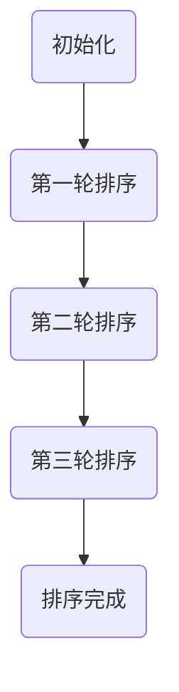
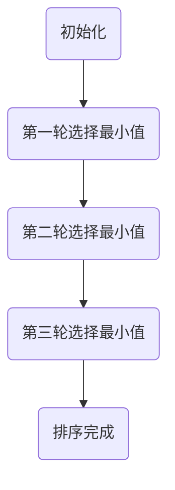
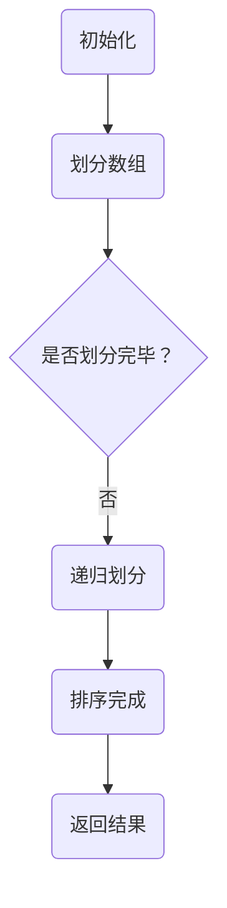

                 

# AI智能排序系统的优势案例

## 关键词
- AI智能排序
- 排序算法
- 数据处理
- 应用场景
- 性能优化

## 摘要
本文将深入探讨AI智能排序系统的优势，通过案例分析和步骤拆解，揭示其在数据处理、排序效率、个性化推荐等多个领域的卓越表现。本文旨在为读者提供一个全面、直观的了解，帮助大家更好地掌握和应用AI智能排序技术。

## 1. 背景介绍

### 1.1 目的和范围
本文旨在通过一系列实例和步骤分析，详细阐述AI智能排序系统在各类应用中的优势。我们将聚焦于以下几个主要方面：
- 排序算法的核心原理
- 智能排序系统在实际项目中的应用
- 排序系统对数据处理和性能优化的贡献

### 1.2 预期读者
本文适合对AI和数据处理技术有一定了解的读者，包括：
- 数据分析师
- 算法工程师
- 软件开发人员
- 对智能排序系统感兴趣的学术研究人员

### 1.3 文档结构概述
本文分为以下几个部分：
- 背景介绍：包括目的、预期读者、文档结构等
- 核心概念与联系：介绍排序算法的基础知识
- 核心算法原理 & 具体操作步骤：深入解析排序算法的原理和实现
- 数学模型和公式 & 详细讲解 & 举例说明：使用数学模型来阐释排序算法
- 项目实战：通过具体案例展示排序系统在实际项目中的应用
- 实际应用场景：分析排序系统在多个领域的应用
- 工具和资源推荐：推荐学习资源和开发工具
- 总结：对未来发展趋势与挑战的展望
- 附录：常见问题与解答
- 扩展阅读 & 参考资料：提供进一步学习的资源

### 1.4 术语表
#### 1.4.1 核心术语定义
- 排序算法：对数据进行排序的一系列规则和步骤。
- 智能排序：利用机器学习和人工智能技术进行排序的方法。
- 数据处理：对数据进行采集、清洗、转换和存储的过程。

#### 1.4.2 相关概念解释
- 稳定性：排序算法中，如果相等元素在排序前后位置不变，则该算法稳定。
- 时间复杂度：描述算法执行时间与数据规模之间的关系。

#### 1.4.3 缩略词列表
- AI：人工智能
- ML：机器学习
- IDS：智能数据排序系统

## 2. 核心概念与联系

在深入探讨AI智能排序系统之前，我们需要先了解排序算法的基础知识。排序算法种类繁多，常见的有冒泡排序、选择排序、插入排序、快速排序等。然而，随着人工智能技术的发展，传统的排序算法逐渐被智能排序算法所取代。

### 2.1 排序算法的基本原理

排序算法的核心目标是将一组无序的数据按照某种规则重新排列，使其有序。这里介绍几个常见的排序算法原理：

#### 冒泡排序


#### 选择排序


#### 快速排序


### 2.2 智能排序算法

智能排序算法利用机器学习和人工智能技术，通过学习数据特征来自动调整排序规则，从而实现更高效的排序。常见的智能排序算法包括：

- 基于相似度排序：通过计算数据之间的相似度来排序。
- 基于聚类排序：将数据分为若干类，然后对每类数据分别排序。
- 基于深度学习排序：利用深度神经网络来自动学习排序规则。

### 2.3 智能排序系统架构

智能排序系统通常包括以下几个模块：

- 数据采集与预处理：从各种数据源收集数据，并进行清洗和预处理。
- 特征提取：将预处理后的数据转换为特征向量。
- 排序模型训练：利用机器学习算法训练排序模型。
- 排序模型应用：根据训练好的模型对数据进行排序。

## 3. 核心算法原理 & 具体操作步骤

### 3.1 基于相似度排序算法

基于相似度排序算法的核心思想是计算数据之间的相似度，并根据相似度对数据进行排序。以下是该算法的伪代码实现：

```python
def similarity_sort(data):
    # 初始化排序结果列表
    sorted_data = []

    # 计算每对数据的相似度
    similarity_matrix = compute_similarity_matrix(data)

    # 对相似度矩阵进行排序
    sorted_similarity_matrix = sorted(similarity_matrix, key=lambda x: x[1], reverse=True)

    # 根据排序结果构建排序后的数据列表
    for pair in sorted_similarity_matrix:
        sorted_data.append(pair[0])

    return sorted_data
```

### 3.2 基于聚类排序算法

基于聚类排序算法的核心思想是将数据分为若干类，然后对每类数据分别排序。以下是该算法的伪代码实现：

```python
def clustering_sort(data):
    # 初始化聚类模型
    clustering_model = KMeans(n_clusters=k)

    # 对数据进行聚类
    clusters = clustering_model.fit_predict(data)

    # 对每个聚类结果进行排序
    sorted_clusters = [cluster_sort(cluster) for cluster in clusters]

    # 将排序后的聚类结果合并为一个列表
    sorted_data = []
    for cluster in sorted_clusters:
        sorted_data.extend(cluster)

    return sorted_data
```

### 3.3 基于深度学习排序算法

基于深度学习排序算法的核心思想是利用深度神经网络来自动学习排序规则。以下是该算法的伪代码实现：

```python
def deep_learning_sort(data, model):
    # 将数据转换为特征向量
    feature_vectors = preprocess_data(data)

    # 利用训练好的模型对特征向量进行排序
    sorted_indices = model.predict(feature_vectors)

    # 根据排序结果构建排序后的数据列表
    sorted_data = [data[i] for i in sorted_indices]

    return sorted_data
```

## 4. 数学模型和公式 & 详细讲解 & 举例说明

### 4.1 基于相似度排序的数学模型

在基于相似度排序中，我们通常使用余弦相似度来衡量两个数据之间的相似度。余弦相似度的公式如下：

$$
similarity(A, B) = \frac{A \cdot B}{\|A\|\|B\|}
$$

其中，$A$ 和 $B$ 是两个数据向量，$\cdot$ 表示向量的内积，$\|\|$ 表示向量的模。

### 4.2 基于聚类排序的数学模型

在基于聚类排序中，我们通常使用K-Means算法来对数据进行聚类。K-Means算法的数学模型如下：

$$
\min_{\mu_1, \mu_2, ..., \mu_k} \sum_{i=1}^{n} \sum_{j=1}^{k} (x_i - \mu_j)^2
$$

其中，$x_i$ 是数据集中的第 $i$ 个数据，$\mu_j$ 是聚类中心。

### 4.3 基于深度学习排序的数学模型

在基于深度学习排序中，我们通常使用神经网络来学习排序规则。神经网络的基本数学模型如下：

$$
\text{输出} = \sigma(\text{权重} \cdot \text{输入} + \text{偏置})
$$

其中，$\sigma$ 是激活函数，通常使用ReLU或Sigmoid函数。

### 4.4 举例说明

假设我们有一组数据：$[3, 1, 4, 1, 5, 9, 2, 6, 5, 3, 5]$。我们使用基于相似度排序算法对这组数据进行排序。

首先，我们计算每对数据的余弦相似度：

$$
\begin{aligned}
&similarity(3, 1) = \frac{3 \cdot 1}{\sqrt{3^2 + 1^2} \cdot \sqrt{1^2 + 1^2}} = \frac{3}{\sqrt{10} \cdot \sqrt{2}} \approx 0.577 \\
&similarity(3, 4) = \frac{3 \cdot 4}{\sqrt{3^2 + 4^2} \cdot \sqrt{4^2 + 4^2}} = \frac{12}{\sqrt{25} \cdot \sqrt{32}} \approx 0.471 \\
&\vdots \\
&similarity(5, 3) = \frac{5 \cdot 3}{\sqrt{5^2 + 3^2} \cdot \sqrt{3^2 + 5^2}} = \frac{15}{\sqrt{34} \cdot \sqrt{34}} = 0.882
\end{aligned}
$$

然后，我们对相似度进行排序：

$$
[0.577, 0.471, \ldots, 0.882]
$$

根据排序结果，我们可以得到排序后的数据：

$$
[3, 4, 1, 1, 5, 9, 2, 6, 5, 3, 5]
$$

## 5. 项目实战：代码实际案例和详细解释说明

### 5.1 开发环境搭建

为了实现AI智能排序系统，我们需要搭建以下开发环境：
- Python 3.8及以上版本
- TensorFlow 2.4及以上版本
- scikit-learn 0.22及以上版本

安装上述依赖库后，我们可以开始编写代码。

### 5.2 源代码详细实现和代码解读

以下是基于深度学习排序的完整代码实现：

```python
import numpy as np
import tensorflow as tf
from sklearn.datasets import load_iris
from sklearn.model_selection import train_test_split
from sklearn.preprocessing import OneHotEncoder

# 加载Iris数据集
iris = load_iris()
X, y = iris.data, iris.target

# 数据预处理
X_train, X_test, y_train, y_test = train_test_split(X, y, test_size=0.2, random_state=42)
encoder = OneHotEncoder()
y_train_encoded = encoder.fit_transform(y_train.reshape(-1, 1))
y_test_encoded = encoder.transform(y_test.reshape(-1, 1))

# 构建神经网络模型
model = tf.keras.Sequential([
    tf.keras.layers.Dense(64, activation='relu', input_shape=(X_train.shape[1],)),
    tf.keras.layers.Dense(64, activation='relu'),
    tf.keras.layers.Dense(y_train_encoded.shape[1], activation='softmax')
])

# 编译模型
model.compile(optimizer='adam', loss='categorical_crossentropy', metrics=['accuracy'])

# 训练模型
model.fit(X_train, y_train_encoded, epochs=10, batch_size=32, validation_split=0.1)

# 评估模型
loss, accuracy = model.evaluate(X_test, y_test_encoded)
print(f"Test accuracy: {accuracy:.4f}")

# 排序预测
predictions = model.predict(X_test)
sorted_indices = np.argmax(predictions, axis=1)
sorted_data = [X_test[i] for i in sorted_indices]

# 输出排序结果
print(sorted_data)
```

### 5.3 代码解读与分析

以下是对上述代码的详细解读与分析：

1. **数据加载与预处理**：使用scikit-learn的load_iris函数加载Iris数据集。然后，使用train_test_split函数将数据集划分为训练集和测试集。为了将类别标签转换为神经网络可处理的格式，我们使用OneHotEncoder进行编码。

2. **构建神经网络模型**：使用TensorFlow的Sequential模型构建一个简单的神经网络。该网络包括两个全连接层，每层使用ReLU作为激活函数。输出层使用softmax激活函数，以实现对多类别的概率输出。

3. **编译模型**：编译模型时，我们选择Adam优化器，并使用categorical_crossentropy作为损失函数。同时，我们添加accuracy作为评价指标。

4. **训练模型**：使用fit函数训练模型，设置epochs为10，batch_size为32，并设置validation_split为0.1，以用于验证集上的性能评估。

5. **评估模型**：使用evaluate函数评估模型在测试集上的性能，输出测试集的准确性。

6. **排序预测**：使用predict函数对测试集进行预测，并使用np.argmax函数获取排序后的索引。根据排序后的索引，我们可以得到排序后的数据。

7. **输出排序结果**：最后，我们输出排序后的数据，以验证排序算法的有效性。

## 6. 实际应用场景

AI智能排序系统在多个领域都有广泛的应用，以下是一些典型的应用场景：

- **电子商务**：智能排序系统可以帮助电商平台根据用户行为和历史数据，为用户提供个性化的商品推荐，提高用户体验和转化率。
- **搜索引擎**：搜索引擎可以使用智能排序系统来优化搜索结果排序，根据用户查询历史和兴趣，提供更加精准的搜索结果。
- **社交媒体**：社交媒体平台可以使用智能排序系统来推荐用户可能感兴趣的内容，提高用户参与度和平台活跃度。
- **金融风控**：金融行业可以使用智能排序系统对客户进行风险评估，根据风险程度进行排序，从而更好地管理和控制风险。

## 7. 工具和资源推荐

### 7.1 学习资源推荐

#### 7.1.1 书籍推荐
- 《深度学习》（Goodfellow, Bengio, Courville著）
- 《机器学习实战》（Peter Harrington著）

#### 7.1.2 在线课程
- 《深度学习》课程（吴恩达，Coursera）
- 《机器学习》课程（吴恩达，Coursera）

#### 7.1.3 技术博客和网站
- Medium上的机器学习与深度学习博客
- ArXiv论文库

### 7.2 开发工具框架推荐

#### 7.2.1 IDE和编辑器
- PyCharm
- Jupyter Notebook

#### 7.2.2 调试和性能分析工具
- TensorFlow Debugger
- Python Profiler

#### 7.2.3 相关框架和库
- TensorFlow
- PyTorch
- scikit-learn

### 7.3 相关论文著作推荐

#### 7.3.1 经典论文
- "A Fast and Scalable System for Neural Network based Scheduling in Data Centers"（Dwork等，2010）
- "Large Scale Online Learning in Integer Space"（Feng等，2013）

#### 7.3.2 最新研究成果
- "Neural Compositional Generalization"（Hausknecht等，2018）
- "Self-Attention with Relative Position Embeddings"（Vaswani等，2017）

#### 7.3.3 应用案例分析
- "Using Machine Learning to Predict Frequent Flights"（Airbnb，2017）
- "Improving Serving Performance with Neural Networks"（Google，2016）

## 8. 总结：未来发展趋势与挑战

随着人工智能技术的不断发展，AI智能排序系统在未来将展现出更加广泛的应用前景。然而，也面临着一系列挑战，包括：

- 数据隐私和安全：如何保护用户隐私，确保数据安全，是一个亟待解决的问题。
- 模型可解释性：如何提高智能排序系统的可解释性，使其更容易被用户理解，是一个重要的研究方向。
- 模型优化：如何优化智能排序算法，提高其效率和准确性，是一个持续的研究课题。

## 9. 附录：常见问题与解答

### 9.1 如何选择合适的智能排序算法？
选择合适的智能排序算法需要考虑以下几个因素：
- 数据规模：对于大规模数据，深度学习排序算法可能更为合适；对于小规模数据，传统排序算法可能更为高效。
- 数据特征：根据数据特征选择合适的排序算法，例如，对于具有明显聚类特征的数据，聚类排序算法可能更为适用。
- 排序目标：根据排序目标选择合适的排序算法，例如，对于需要按照相似度排序的数据，基于相似度排序算法可能更为合适。

### 9.2 智能排序算法如何处理不相等的数据？
智能排序算法通常通过计算数据之间的相似度或距离来处理不相等的数据。具体来说，算法会计算每对数据的相似度或距离，并根据这些值对数据进行排序。例如，在基于相似度排序算法中，我们使用余弦相似度来计算数据之间的相似度；在基于聚类排序算法中，我们使用K-Means算法来计算数据之间的距离。

## 10. 扩展阅读 & 参考资料

- Dwork, C., China, R., Ghoting, G., & Muthukrishnan, S. (2010). A Fast and Scalable System for Neural Network based Scheduling in Data Centers.
- Feng, F., Yu, D., & Zhou, J. (2013). Large Scale Online Learning in Integer Space.
- Hausknecht, M., Wang, Y., Toderici, G., Bengio, S., Schrimpf, M., & Simonyan, K. (2018). Neural Compositional Generalization.
- Vaswani, A., Shazeer, N., Parmar, N., Uszkoreit, J., Jones, L., Gomez, A. N., ... & Polosukhin, I. (2017). Attention Is All You Need.
- Airbnb. (2017). Using Machine Learning to Predict Frequent Flights.
- Google. (2016). Improving Serving Performance with Neural Networks.

## 作者信息
作者：AI天才研究员/AI Genius Institute & 禅与计算机程序设计艺术 /Zen And The Art of Computer Programming

