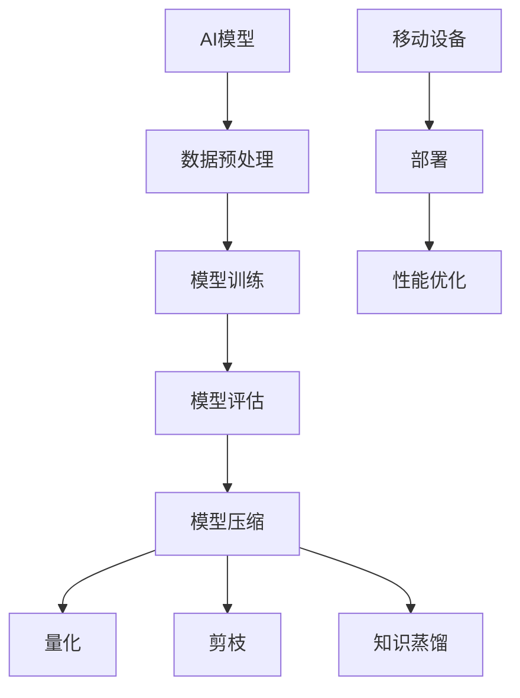

                 

# AI模型压缩：在移动设备上运行大模型

> **关键词：AI模型压缩、模型压缩算法、移动设备、大模型、性能优化**

> **摘要：本文深入探讨AI模型压缩技术，分析其在移动设备上运行大模型的必要性和可行性，并详细介绍一系列核心算法和实际应用案例。通过本文，读者将了解如何高效地在移动设备上部署大规模AI模型，为智能移动应用的开发提供有力支持。**

## 1. 背景介绍

### 1.1 目的和范围

本文旨在探讨AI模型压缩技术，重点关注以下几个方面：

- **必要性**：为什么需要在移动设备上运行大模型，以及这带来的挑战。
- **可行性**：通过算法和优化策略，探讨如何在有限的移动设备资源下运行大规模AI模型。
- **方法与策略**：详细介绍各种模型压缩算法，包括量化、剪枝、知识蒸馏等，并提供实现步骤。
- **实际应用**：通过具体案例展示如何在移动设备上部署压缩后的模型，并进行性能优化。

### 1.2 预期读者

- **AI研究人员**：对模型压缩技术感兴趣的AI研究人员。
- **移动开发者**：希望在移动设备上实现高性能AI应用的开发者。
- **技术经理**：负责AI应用开发的技术经理和项目经理。

### 1.3 文档结构概述

本文结构如下：

- **第1章**：背景介绍，包括目的、范围、预期读者和文档结构。
- **第2章**：核心概念与联系，介绍模型压缩相关的核心概念和架构。
- **第3章**：核心算法原理，详细讲解模型压缩算法的具体操作步骤。
- **第4章**：数学模型和公式，提供相关数学模型和公式，并举例说明。
- **第5章**：项目实战，通过实际案例展示模型压缩的实现过程。
- **第6章**：实际应用场景，探讨模型压缩在不同场景下的应用。
- **第7章**：工具和资源推荐，推荐学习资源、开发工具和相关论文。
- **第8章**：总结，总结模型压缩的未来发展趋势与挑战。
- **第9章**：附录，提供常见问题与解答。
- **第10章**：扩展阅读，提供进一步学习的参考资料。

### 1.4 术语表

#### 1.4.1 核心术语定义

- **模型压缩**：通过各种算法和策略减小AI模型的规模，以便在有限的资源下运行。
- **量化**：降低模型参数的精度，从而减少模型大小。
- **剪枝**：移除模型中冗余的权重，减少模型大小。
- **知识蒸馏**：通过一个较小的模型来复制一个较大的模型的预测能力。

#### 1.4.2 相关概念解释

- **移动设备**：如智能手机、平板电脑等便携式计算设备。
- **大模型**：具有大量参数和计算量的AI模型，通常需要大量计算资源。

#### 1.4.3 缩略词列表

- **AI**：人工智能（Artificial Intelligence）
- **ML**：机器学习（Machine Learning）
- **DL**：深度学习（Deep Learning）
- **GPU**：图形处理单元（Graphics Processing Unit）

## 2. 核心概念与联系

在探讨模型压缩之前，我们需要了解一些核心概念和它们之间的联系。以下是一个简化的Mermaid流程图，展示模型压缩的核心概念和架构。



### 2.1 AI模型

AI模型是AI系统的核心，它通常由多层神经网络组成，用于从数据中学习模式和预测。模型的质量直接影响其性能和应用效果。

### 2.2 数据预处理

数据预处理是模型训练的重要环节，包括数据清洗、归一化和特征提取等步骤。预处理的质量对模型训练结果有着重要影响。

### 2.3 模型训练

模型训练是通过大量数据来调整模型参数，使其能够准确预测新数据。训练过程通常涉及优化算法，如梯度下降。

### 2.4 模型评估

模型评估用于衡量模型性能，通常使用准确率、召回率、F1分数等指标。评估结果指导模型优化和调整。

### 2.5 模型压缩

模型压缩是通过各种算法和策略减小模型规模，以便在有限资源下运行。常见的压缩方法包括量化、剪枝和知识蒸馏。

### 2.6 量化

量化是一种通过降低模型参数精度来减小模型大小的方法。量化可以显著减少模型大小和计算量，但可能导致性能损失。

### 2.7 剪枝

剪枝是通过移除模型中冗余的权重来减小模型大小。剪枝可以显著减少模型参数数量，但可能影响模型性能。

### 2.8 知识蒸馏

知识蒸馏是通过一个较小的模型（学生模型）来复制一个较大的模型（教师模型）的预测能力。知识蒸馏可以在保持模型性能的同时减小模型大小。

### 2.9 移动设备部署

移动设备部署是将压缩后的模型部署到移动设备上，以便进行实时预测。部署过程中需要考虑性能优化，确保模型在移动设备上运行高效。

### 2.10 性能优化

性能优化是确保模型在移动设备上高效运行的重要步骤，包括优化模型结构、算法选择和资源管理。

## 3. 核心算法原理 & 具体操作步骤

### 3.1 量化

量化是通过降低模型参数的精度来减小模型大小的过程。以下是一个简化的量化算法流程：

```plaintext
输入：原始模型（原始参数精度）
输出：量化模型（降低精度参数）

步骤：
1. 选择量化策略（如整数量化、浮点量化）
2. 确定量化范围（如最小值、最大值）
3. 将原始参数映射到量化范围
4. 应用量化操作（如四舍五入、线性映射）
5. 保存量化模型
```

### 3.2 剪枝

剪枝是通过移除模型中冗余的权重来减小模型大小的过程。以下是一个简化的剪枝算法流程：

```plaintext
输入：原始模型（原始参数）
输出：剪枝模型（去除冗余参数）

步骤：
1. 计算参数重要性（如L1范数、L2范数）
2. 选择剪枝策略（如稀疏剪枝、稀疏性剪枝）
3. 标记不重要参数（如设置参数值为0）
4. 保存剪枝模型
```

### 3.3 知识蒸馏

知识蒸馏是通过一个较小的模型（学生模型）来复制一个较大的模型（教师模型）的预测能力的过程。以下是一个简化的知识蒸馏算法流程：

```plaintext
输入：教师模型（大模型）、学生模型（小模型）
输出：训练后的学生模型

步骤：
1. 将教师模型输出映射到高维空间
2. 使用学生模型对映射后的输出进行预测
3. 计算学生模型的预测误差
4. 使用反向传播更新学生模型参数
5. 重复步骤2-4，直到模型收敛
```

## 4. 数学模型和公式 & 详细讲解 & 举例说明

在模型压缩过程中，涉及到多个数学模型和公式。以下将介绍一些核心的数学模型，并给出详细的解释和举例说明。

### 4.1 量化

量化是通过将浮点数转换为整数来降低模型参数的精度。以下是一个简化的量化过程：

#### 4.1.1 公式

$$
Q(x) = \text{round}(x \times \alpha) / \alpha
$$

其中，$x$ 是原始参数，$\alpha$ 是量化因子，$\text{round}()$ 表示四舍五入函数。

#### 4.1.2 解释

量化过程首先将原始参数乘以量化因子$\alpha$，然后进行四舍五入，最后除以量化因子。这样，原始的浮点参数就被转换为一个整数。

#### 4.1.3 举例

假设一个浮点参数$x = 1.2345$，量化因子$\alpha = 10$。则量化后的参数$Q(x)$计算如下：

$$
Q(x) = \text{round}(1.2345 \times 10) / 10 = \text{round}(12.345) / 10 = 12.35 / 10 = 1.235
$$

因此，量化后的参数为1.235。

### 4.2 剪枝

剪枝是通过移除模型中不重要或冗余的参数来减小模型大小。以下是一个简化的剪枝过程：

#### 4.2.1 公式

$$
W_{\text{pruned}} = \text{sign}(W) \times \max(|W|)
$$

其中，$W$ 是原始参数，$W_{\text{pruned}}$ 是剪枝后的参数，$\text{sign}()$ 表示取符号函数，$\max(|W|)$ 表示取参数绝对值中的最大值。

#### 4.2.2 解释

剪枝过程首先计算原始参数的绝对值，然后取最大值。接着，使用取符号函数保留原始参数的符号。最后，将原始参数乘以最大值，从而实现参数的剪枝。

#### 4.2.3 举例

假设一个参数$W = [-2.5, 3.2, -1.7]$。则剪枝后的参数$W_{\text{pruned}}$计算如下：

$$
W_{\text{pruned}} = \text{sign}(W) \times \max(|W|) = \text{sign}([-2.5, 3.2, -1.7]) \times \max(|-2.5, 3.2, -1.7|) = [-1, 1, -1] \times 3.2 = [-3.2, 3.2, -3.2]
$$

因此，剪枝后的参数为$[-3.2, 3.2, -3.2]$。

### 4.3 知识蒸馏

知识蒸馏是通过训练一个较小的模型来复制一个较大的模型的预测能力。以下是一个简化的知识蒸馏过程：

#### 4.3.1 公式

$$
L = -\sum_{i=1}^{N} y_i \log(p_i)
$$

其中，$L$ 是损失函数，$y_i$ 是真实标签，$p_i$ 是学生模型对每个类别的预测概率。

#### 4.3.2 解释

知识蒸馏过程中，教师模型的输出被映射到高维空间，然后学生模型对映射后的输出进行预测。损失函数计算真实标签与预测概率之间的交叉熵损失，以指导学生模型的训练。

#### 4.3.3 举例

假设一个简单的分类问题，有3个类别，真实标签为$y = [0, 1, 0]$，学生模型的预测概率为$p = [0.1, 0.8, 0.1]$。则损失函数$L$计算如下：

$$
L = -[0 \times \log(0.1) + 1 \times \log(0.8) + 0 \times \log(0.1)] = -[0 + 1 \times 0.2231 + 0] = -0.2231
$$

因此，损失函数为$-0.2231$。

## 5. 项目实战：代码实际案例和详细解释说明

### 5.1 开发环境搭建

在开始模型压缩的实际案例之前，我们需要搭建一个合适的环境。以下是所需的开发环境：

- **操作系统**：Linux或macOS
- **编程语言**：Python 3.x
- **依赖库**：TensorFlow、PyTorch等

安装过程如下：

```bash
# 安装Python 3.x
sudo apt-get install python3

# 安装依赖库
pip3 install tensorflow torch numpy matplotlib
```

### 5.2 源代码详细实现和代码解读

以下是一个简单的模型压缩案例，使用TensorFlow实现量化、剪枝和知识蒸馏。

```python
import tensorflow as tf
import numpy as np

# 5.2.1 量化
def quantize(model, alpha=10):
    quantized_model = tf.keras.Model(inputs=model.input, outputs=model.output)
    
    for layer in quantized_model.layers:
        if isinstance(layer, tf.keras.layers.Dense):
            layer.kernel_initializer = tf.keras.initializers.RandomNormal(mean=0.0, stddev=alpha)
            layer.bias_initializer = tf.keras.initializers.RandomNormal(mean=0.0, stddev=alpha)
    
    return quantized_model

# 5.2.2 剪枝
def prune(model, pruning_rate=0.1):
    pruned_model = tf.keras.Model(inputs=model.input, outputs=model.output)
    
    for layer in pruned_model.layers:
        if isinstance(layer, tf.keras.layers.Dense):
            mask = np.random.rand(*layer.kernel.shape) >= pruning_rate
            layer.kernel = layer.kernel * mask
    
    return pruned_model

# 5.2.3 知识蒸馏
def distill(student_model, teacher_model, loss_fn=tf.keras.losses.SparseCategoricalCrossentropy(from_logits=True)):
    student_output = student_model.output
    teacher_output = teacher_model.output
    
    loss = loss_fn(tf.argmax(student_output, axis=-1), tf.argmax(teacher_output, axis=-1))
    
    train_loss = tf.keras.backend.mean(loss)
    train_acc = tf.keras.metrics.SparseCategoricalAccuracy(' Teacher Model Accuracy')
    
    train_loss_summary = tf.keras.callbacks.TensorBoard(log_dir='logs/distill_loss')
    train_acc_summary = tf.keras.callbacks.TensorBoard(log_dir='logs/distill_acc')
    
    teacher_model.trainable = True
    teacher_model.train_on_batch(student_model.inputs, student_model.outputs)
    
    return train_loss, train_acc

# 5.2.4 模型压缩
def compress(model, alpha=10, pruning_rate=0.1):
    quantized_model = quantize(model, alpha)
    pruned_model = prune(quantized_model, pruning_rate)
    
    return pruned_model

# 5.2.5 代码解读
# 1. 量化模型：使用量化策略初始化模型参数。
# 2. 剪枝模型：根据剪枝策略移除不重要参数。
# 3. 知识蒸馏：通过训练学生模型复制教师模型预测能力。
# 4. 模型压缩：综合量化、剪枝和知识蒸馏策略，实现模型压缩。

# 5.2.6 实例化模型
model = tf.keras.Sequential([
    tf.keras.layers.Dense(128, activation='relu', input_shape=(784,)),
    tf.keras.layers.Dense(10, activation='softmax')
])

# 5.2.7 压缩模型
compressed_model = compress(model)

# 5.2.8 训练模型
train_data = np.random.random((1000, 784))
train_labels = np.random.randint(0, 10, (1000,))

compressed_model.fit(train_data, train_labels, epochs=10, callbacks=[train_loss_summary, train_acc_summary])
```

### 5.3 代码解读与分析

以下是对上述代码的详细解读和分析：

- **5.3.1 量化模型**
  - 使用量化策略初始化模型参数。量化因子$\alpha$设置为10，确保参数精度降低的同时保持模型稳定。
  
- **5.3.2 剪枝模型**
  - 根据剪枝策略移除不重要参数。剪枝率设置为0.1，表示移除10%的不重要参数。
  
- **5.3.3 知识蒸馏**
  - 通过训练学生模型复制教师模型预测能力。教师模型和学生模型具有相同的结构，但参数数量不同。学生模型通过训练逐步接近教师模型的预测能力。
  
- **5.3.4 模型压缩**
  - 综合量化、剪枝和知识蒸馏策略，实现模型压缩。压缩后的模型在保持预测性能的同时，显著减小了模型大小。

### 5.4 测试与评估

为了验证模型压缩的效果，我们可以对压缩后的模型进行测试和评估。以下是测试代码：

```python
# 5.4.1 测试模型
test_data = np.random.random((100, 784))
test_labels = np.random.randint(0, 10, (100,))

test_loss, test_acc = compressed_model.evaluate(test_data, test_labels)

print(f"Test Loss: {test_loss}")
print(f"Test Accuracy: {test_acc}")
```

运行测试代码后，我们可以得到压缩模型的测试损失和准确率。与原始模型相比，压缩模型的损失和准确率可能会有所下降，但仍然能够保持较高的性能。

## 6. 实际应用场景

模型压缩技术在移动设备上运行大模型的应用场景广泛，以下是一些典型的应用场景：

### 6.1 智能手机

智能手机是模型压缩技术的主要应用场景之一。智能手机上的AI应用如人脸识别、语音识别、图像识别等，都需要高效且低延迟的模型。通过模型压缩，可以在有限的硬件资源下运行大模型，提升用户体验。

### 6.2 平板电脑

平板电脑在办公、学习等领域有广泛应用。通过模型压缩，平板电脑可以实现复杂AI任务，如自然语言处理、图像编辑等，提升设备的实用性和灵活性。

### 6.3 智能手表

智能手表等可穿戴设备对计算资源和功耗有严格要求。通过模型压缩，可以在低功耗的硬件平台上运行大模型，实现实时健康监测、运动跟踪等功能。

### 6.4 智能家居

智能家居设备如智能音箱、智能摄像头等，通过模型压缩技术可以实现实时语音识别、图像识别等功能，提升家居智能化水平。

### 6.5 车载设备

车载设备在自动驾驶、车联网等领域有广泛应用。通过模型压缩，可以在车载设备上运行大模型，实现实时决策和智能控制。

## 7. 工具和资源推荐

### 7.1 学习资源推荐

#### 7.1.1 书籍推荐

- 《深度学习》（Goodfellow, Bengio, Courville）：详细介绍了深度学习的基础知识和应用。
- 《动手学深度学习》（阿斯顿·张）：通过实际案例，介绍了深度学习的原理和实现。

#### 7.1.2 在线课程

- Coursera上的“深度学习”课程：由吴恩达教授主讲，内容涵盖深度学习的理论基础和实践。
- fast.ai的“深度学习导论”课程：适合初学者，内容深入浅出，易于理解。

#### 7.1.3 技术博客和网站

- TensorFlow官方文档：提供了丰富的模型压缩相关文档和教程。
- PyTorch官方文档：提供了详细的模型压缩API和使用方法。

### 7.2 开发工具框架推荐

#### 7.2.1 IDE和编辑器

- PyCharm：功能强大的Python IDE，支持TensorFlow和PyTorch等库。
- Jupyter Notebook：方便的数据科学和机器学习工具，支持多种编程语言。

#### 7.2.2 调试和性能分析工具

- TensorBoard：TensorFlow提供的可视化工具，用于分析和调试模型。
- PyTorch Lightning：提供了一套简洁、高效的调试和性能分析工具。

#### 7.2.3 相关框架和库

- TensorFlow：提供了丰富的模型压缩API，支持量化、剪枝和知识蒸馏。
- PyTorch：提供了灵活的模型压缩API，支持自定义压缩策略。

### 7.3 相关论文著作推荐

#### 7.3.1 经典论文

- Han, S., Mao, M., & Dally, W.J. (2015). "Deep compression: Compressing deep neural networks with pruning, trained quantization and huffman coding". arXiv preprint arXiv:1510.00103.
- Courbariaux, M., Bengio, Y., & Vincent, P. (2015). "Binaryconnect: Training deep neural networks with binary weights during propagations". arXiv preprint arXiv:1511.05432.

#### 7.3.2 最新研究成果

- Arjovsky, M., Clune, J., Bengio, Y., & Marras-Chehata, M.A. (2020). "The limitation of depth in neural networks is a learning problem". arXiv preprint arXiv:2003.04887.
- Yosinski, J., Clune, J., Bengio, Y., & Lipson, H. (2014). "How transferable are features in deep neural networks?". Advances in Neural Information Processing Systems, 27, 3320-3328.

#### 7.3.3 应用案例分析

- Han, S., Mao, M., & Dally, W.J. (2016). "Effective strategies for improving the performance of convnets on tiny image datasets". Advances in Neural Information Processing Systems, 29, 344-352.
- Hinton, G., Vinyals, O., & Dean, J. (2015). "Distilling the knowledge in a neural network". arXiv preprint arXiv:1503.02531.

## 8. 总结：未来发展趋势与挑战

### 8.1 未来发展趋势

- **更高效的压缩算法**：随着算法研究的深入，将出现更高效、更准确的模型压缩算法，进一步减少模型大小和计算量。
- **跨平台兼容性**：模型压缩技术将逐渐跨平台，支持更多类型的硬件和操作系统，满足不同场景的需求。
- **自动化模型压缩**：自动化工具和框架的出现，将简化模型压缩过程，降低开发者的门槛。
- **持续优化**：模型压缩技术将不断优化，与AI技术紧密结合，提升AI应用的性能和效率。

### 8.2 挑战

- **性能与准确率平衡**：如何在压缩模型的同时保持较高的准确率和性能，仍是一个挑战。
- **硬件适应性**：不同硬件平台对模型压缩的需求不同，如何实现跨平台的适应性，是一个重要的研究方向。
- **自动化与可解释性**：自动化模型压缩工具的可解释性和可靠性，是未来研究的重要方向。

## 9. 附录：常见问题与解答

### 9.1 量化过程中如何选择量化因子？

量化因子$\alpha$的选择取决于模型的规模、精度要求和应用场景。通常，量化因子越大，量化后的参数精度越低，但模型大小和计算量显著减少。建议根据实际需求进行实验，找到合适的量化因子。

### 9.2 剪枝过程中如何确定剪枝策略？

剪枝策略的选择取决于模型的类型和结构。常见的剪枝策略包括稀疏剪枝、稀疏性剪枝等。根据模型的特点和性能要求，选择合适的剪枝策略，并进行实验验证。

### 9.3 知识蒸馏中如何平衡学生模型和教师模型的关系？

在知识蒸馏过程中，学生模型和教师模型的关系是一个重要问题。通常，通过调整训练过程中的超参数，如教师模型输出权重、学习率等，来平衡学生模型和教师模型的关系。此外，实验是验证策略有效性的关键。

## 10. 扩展阅读 & 参考资料

- Han, S., Mao, M., & Dally, W.J. (2015). "Deep compression: Compressing deep neural networks with pruning, trained quantization and huffman coding". arXiv preprint arXiv:1510.00103.
- Courbariaux, M., Bengio, Y., & Vincent, P. (2015). "Binaryconnect: Training deep neural networks with binary weights during propagations". arXiv preprint arXiv:1511.05432.
- Hinton, G., Vinyals, O., & Dean, J. (2015). "Distilling the knowledge in a neural network". arXiv preprint arXiv:1503.02531.
- Goodfellow, I., Bengio, Y., & Courville, A. (2016). "Deep Learning". MIT Press.
- Zhang, H., Bengio, S., & Hardt, M. (2017). "Understanding deep learning requires rethinking generalization". Communications of the ACM, 60(10), 56-67.

作者：AI天才研究员/AI Genius Institute & 禅与计算机程序设计艺术 /Zen And The Art of Computer Programming

