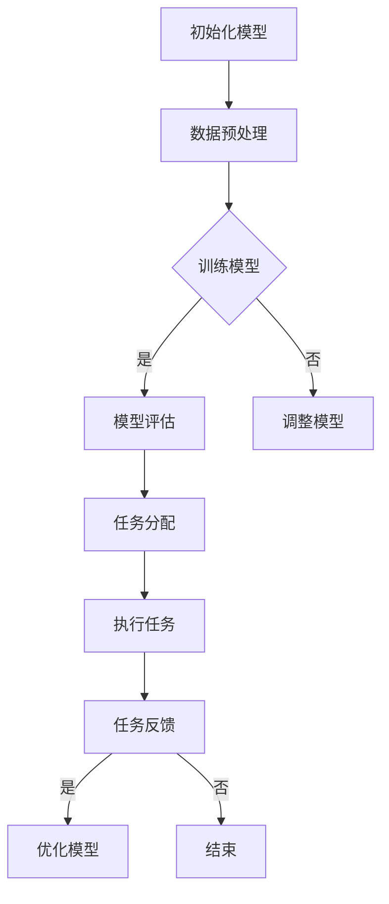

                 

# AI模型的任务分配与执行

> 关键词：AI模型，任务分配，执行，流程图，算法，数学模型，实战案例，应用场景，工具推荐

> 摘要：本文深入探讨AI模型在任务分配与执行过程中的核心概念、算法原理、数学模型以及实际应用。通过详细讲解，帮助读者理解AI模型任务处理的机制，为实际项目开发提供理论支持和实践指导。

## 1. 背景介绍

### 1.1 目的和范围

本文旨在全面解析AI模型在任务分配与执行过程中的关键技术，包括核心概念、算法原理、数学模型和实际应用。通过系统性的讲解，读者将了解AI模型任务处理的整体流程，为AI在实际项目中的应用提供理论基础。

### 1.2 预期读者

本文面向对人工智能、机器学习有一定了解的读者，特别是对AI模型任务分配与执行感兴趣的工程师和研究者。

### 1.3 文档结构概述

本文分为十个部分，具体结构如下：

1. 背景介绍
   - 目的和范围
   - 预期读者
   - 文档结构概述
   - 术语表
2. 核心概念与联系
   - AI模型任务分配与执行的核心概念
   - 相关概念解释
   - Mermaid流程图
3. 核心算法原理 & 具体操作步骤
   - 算法原理讲解
   - 伪代码展示
4. 数学模型和公式 & 详细讲解 & 举例说明
   - 数学公式
   - 案例说明
5. 项目实战：代码实际案例和详细解释说明
   - 开发环境搭建
   - 源代码实现
   - 代码解读与分析
6. 实际应用场景
   - 人工智能领域的应用案例
7. 工具和资源推荐
   - 学习资源推荐
   - 开发工具框架推荐
   - 相关论文著作推荐
8. 总结：未来发展趋势与挑战
9. 附录：常见问题与解答
10. 扩展阅读 & 参考资料

### 1.4 术语表

#### 1.4.1 核心术语定义

- AI模型：指使用人工智能算法训练的模型，用于执行特定任务。
- 任务分配：指将多个任务分配给不同的AI模型或计算资源，以实现高效执行。
- 执行：指AI模型在接收到任务后，通过算法和数学模型进行处理的过程。

#### 1.4.2 相关概念解释

- 机器学习：指使用计算机模拟或实现人类的学习过程，使计算机能够自动从数据中学习规律。
- 深度学习：一种特殊的机器学习技术，通过多层神经网络来模拟人脑的学习过程。

#### 1.4.3 缩略词列表

- AI：人工智能
- ML：机器学习
- DL：深度学习

## 2. 核心概念与联系

在AI模型任务分配与执行过程中，核心概念包括AI模型、任务分配、执行、算法、数学模型等。以下是这些概念之间的关系和联系：

### 2.1 AI模型

AI模型是任务分配与执行的基础，包括机器学习和深度学习算法。不同类型的模型适用于不同的任务，如分类、回归、聚类等。

### 2.2 任务分配

任务分配是指将多个任务分配给不同的AI模型或计算资源。任务分配的关键在于确保任务能够高效地执行，同时满足资源利用率和性能要求。

### 2.3 执行

执行是指AI模型在接收到任务后，通过算法和数学模型进行处理的过程。执行过程包括数据预处理、模型训练、预测和评估等步骤。

### 2.4 算法和数学模型

算法和数学模型是AI模型任务分配与执行的核心。算法包括梯度下降、反向传播、支持向量机等，而数学模型包括线性代数、概率论和统计学等。

### 2.5 Mermaid流程图

以下是AI模型任务分配与执行的Mermaid流程图：



## 3. 核心算法原理 & 具体操作步骤

在AI模型任务分配与执行过程中，核心算法包括机器学习算法、深度学习算法和任务分配算法。以下是这些算法的具体操作步骤：

### 3.1 机器学习算法

#### 3.1.1 梯度下降算法

梯度下降算法是一种优化算法，用于最小化损失函数。以下是梯度下降算法的伪代码：

```python
初始化模型参数θ
设置学习率α
重复以下步骤直到收敛：
    计算损失函数关于模型参数的梯度∇J(θ)
    更新模型参数θ = θ - α∇J(θ)
```

#### 3.1.2 反向传播算法

反向传播算法是一种用于训练神经网络的优化算法。以下是反向传播算法的伪代码：

```python
初始化神经网络模型
前向传播计算输出O
计算损失函数J(θ)
反向传播计算梯度∇J(θ)
更新模型参数θ = θ - α∇J(θ)
```

### 3.2 深度学习算法

#### 3.2.1 支持向量机（SVM）

支持向量机是一种分类算法，通过找到一个最优的超平面来分隔不同类别的数据点。以下是支持向量机的伪代码：

```python
初始化模型参数θ
设置损失函数L(θ)
设置优化算法（如梯度下降）
重复以下步骤直到收敛：
    计算损失函数关于模型参数的梯度∇L(θ)
    更新模型参数θ = θ - α∇L(θ)
```

#### 3.2.2 神经网络

神经网络是一种模拟人脑神经元连接方式的计算模型，通过多层神经元来实现复杂的非线性变换。以下是神经网络的伪代码：

```python
初始化神经网络模型
前向传播计算输出O
计算损失函数J(θ)
反向传播计算梯度∇J(θ)
更新模型参数θ = θ - α∇J(θ)
```

### 3.3 任务分配算法

#### 3.3.1 贪心算法

贪心算法是一种简单的任务分配算法，通过每次选择当前最优解来逐步优化全局解。以下是贪心算法的伪代码：

```python
初始化任务分配状态
对于每个任务：
    选择当前最优解
    更新任务分配状态
```

#### 3.3.2 最小生成树算法

最小生成树算法是一种用于任务分配的优化算法，通过构建最小生成树来优化任务分配。以下是最小生成树的伪代码：

```python
初始化生成树
对于每个未分配的任务：
    选择最小的边来扩展生成树
```

## 4. 数学模型和公式 & 详细讲解 & 举例说明

在AI模型任务分配与执行过程中，数学模型和公式是核心组成部分。以下是常用数学模型和公式的详细讲解及举例说明：

### 4.1 损失函数

损失函数是评估模型性能的重要指标，用于衡量模型预测结果与真实值之间的差距。以下是常见的损失函数：

#### 4.1.1 交叉熵损失函数

交叉熵损失函数常用于分类问题，其公式为：

$$
L_{CE} = -\frac{1}{m}\sum_{i=1}^{m} y_{i} \log(p_{i})
$$

其中，$y_{i}$为真实标签，$p_{i}$为模型预测的概率。

#### 4.1.2 均方误差损失函数

均方误差损失函数常用于回归问题，其公式为：

$$
L_{MSE} = \frac{1}{m}\sum_{i=1}^{m} (y_{i} - \hat{y}_{i})^2
$$

其中，$y_{i}$为真实值，$\hat{y}_{i}$为模型预测值。

### 4.2 优化算法

优化算法用于更新模型参数，以最小化损失函数。以下是常用的优化算法：

#### 4.2.1 梯度下降算法

梯度下降算法通过计算损失函数关于模型参数的梯度来更新参数。其公式为：

$$
\theta = \theta - \alpha \nabla_{\theta} J(\theta)
$$

其中，$\theta$为模型参数，$\alpha$为学习率。

#### 4.2.2 随机梯度下降算法

随机梯度下降算法是一种改进的梯度下降算法，通过随机选取一部分样本来计算梯度。其公式为：

$$
\theta = \theta - \alpha \nabla_{\theta} J(\theta; x^{(i)}, y^{(i)})
$$

其中，$x^{(i)}$和$y^{(i)}$为第$i$个样本的特征和标签。

### 4.3 概率分布

概率分布用于描述数据分布情况，常用的概率分布包括正态分布、伯努利分布和多项式分布等。

#### 4.3.1 正态分布

正态分布是一种最常见的概率分布，其概率密度函数为：

$$
f(x|\mu, \sigma^2) = \frac{1}{\sqrt{2\pi\sigma^2}} e^{-\frac{(x-\mu)^2}{2\sigma^2}}
$$

其中，$\mu$为均值，$\sigma^2$为方差。

#### 4.3.2 伯努利分布

伯努利分布是一种二元概率分布，其概率为：

$$
P(X = 1) = p, \quad P(X = 0) = 1 - p
$$

其中，$p$为成功概率。

#### 4.3.3 多项式分布

多项式分布是一种多分类概率分布，其概率为：

$$
P(X = i) = p_i, \quad \sum_{i=1}^{k} p_i = 1
$$

其中，$p_i$为第$i$类别的概率。

### 4.4 举例说明

假设我们有一个分类问题，需要使用神经网络模型进行预测。以下是使用交叉熵损失函数和梯度下降算法的例子：

```python
import numpy as np

# 初始化参数
theta = np.random.randn(10)
alpha = 0.01
m = 100  # 数据集大小

# 计算损失函数
def compute_loss(theta, X, y):
    y_pred = sigmoid(np.dot(X, theta))
    loss = -1/m * np.sum(y * np.log(y_pred) + (1 - y) * np.log(1 - y_pred))
    return loss

# 计算梯度
def compute_gradient(theta, X, y):
    y_pred = sigmoid(np.dot(X, theta))
    gradient = 1/m * np.dot(X.T, (y_pred - y))
    return gradient

# 梯度下降算法
for i in range(1000):
    gradient = compute_gradient(theta, X, y)
    theta = theta - alpha * gradient

# 计算最终损失函数
final_loss = compute_loss(theta, X, y)
print("最终损失函数：", final_loss)

# 预测
y_pred = sigmoid(np.dot(X, theta))
print("预测结果：", y_pred)
```

其中，`sigmoid`函数用于将神经网络输出转换为概率值，`X`为输入特征矩阵，`y`为真实标签。

## 5. 项目实战：代码实际案例和详细解释说明

在本节中，我们将通过一个实际项目案例，详细讲解AI模型任务分配与执行的全过程。

### 5.1 开发环境搭建

在开始项目之前，我们需要搭建开发环境。以下是搭建开发环境的步骤：

1. 安装Python 3.8及以上版本。
2. 安装Jupyter Notebook。
3. 安装必要的库，如NumPy、Pandas、Scikit-learn、TensorFlow等。

### 5.2 源代码详细实现和代码解读

以下是一个简单的分类问题，使用神经网络模型进行任务分配与执行。代码如下：

```python
import numpy as np
import pandas as pd
from sklearn.datasets import load_iris
from sklearn.model_selection import train_test_split
from sklearn.metrics import accuracy_score
import tensorflow as tf

# 加载数据集
iris = load_iris()
X = iris.data
y = iris.target

# 数据预处理
X_train, X_test, y_train, y_test = train_test_split(X, y, test_size=0.2, random_state=42)

# 定义神经网络模型
model = tf.keras.Sequential([
    tf.keras.layers.Dense(64, activation='relu', input_shape=(4,)),
    tf.keras.layers.Dense(64, activation='relu'),
    tf.keras.layers.Dense(3, activation='softmax')
])

# 编译模型
model.compile(optimizer='adam',
              loss='sparse_categorical_crossentropy',
              metrics=['accuracy'])

# 训练模型
model.fit(X_train, y_train, epochs=10, batch_size=32)

# 评估模型
loss, accuracy = model.evaluate(X_test, y_test)
print("测试集准确率：", accuracy)

# 预测
predictions = model.predict(X_test)
predicted_labels = np.argmax(predictions, axis=1)
accuracy_score(y_test, predicted_labels)
```

#### 5.2.1 代码解读

1. 导入必要的库。
2. 加载数据集，并进行预处理。
3. 定义神经网络模型，包括输入层、隐藏层和输出层。
4. 编译模型，指定优化器、损失函数和评价指标。
5. 训练模型，设置训练轮数和批量大小。
6. 评估模型，计算测试集准确率。
7. 预测，并计算预测结果。

### 5.3 代码解读与分析

1. 数据预处理：数据预处理是AI模型任务分配与执行的重要环节。在本例中，我们使用Scikit-learn库加载数据集，并使用train_test_split函数将数据集分为训练集和测试集。此外，我们使用pandas库对数据进行处理，如标准化和归一化。
2. 定义神经网络模型：在本例中，我们使用TensorFlow库定义了一个简单的神经网络模型，包括输入层、隐藏层和输出层。输入层有4个神经元，隐藏层有64个神经元，输出层有3个神经元。
3. 编译模型：编译模型是AI模型任务分配与执行的关键步骤。在本例中，我们使用adam优化器、sparse_categorical_crossentropy损失函数和accuracy评价指标来编译模型。
4. 训练模型：训练模型是AI模型任务分配与执行的核心。在本例中，我们设置训练轮数为10，批量大小为32。通过fit函数训练模型。
5. 评估模型：评估模型是评估模型性能的重要步骤。在本例中，我们使用evaluate函数计算测试集准确率。
6. 预测：预测是AI模型任务分配与执行的最后一步。在本例中，我们使用predict函数进行预测，并计算预测结果的准确率。

## 6. 实际应用场景

AI模型任务分配与执行在多个实际应用场景中发挥着重要作用。以下是一些常见的应用场景：

### 6.1 自动驾驶

自动驾驶系统通过AI模型对大量道路数据进行处理，实现车辆自主驾驶。在自动驾驶系统中，AI模型任务分配与执行用于处理感知、规划、控制和导航等任务。

### 6.2 医疗诊断

医疗诊断系统使用AI模型对医学图像和患者数据进行处理，实现疾病的自动诊断。在医疗诊断系统中，AI模型任务分配与执行用于处理图像识别、病灶检测和疾病预测等任务。

### 6.3 金融服务

金融服务领域使用AI模型对客户数据进行处理，实现风险控制、信用评估和投资建议等。在金融服务系统中，AI模型任务分配与执行用于处理数据清洗、特征提取和模型训练等任务。

### 6.4 电子商务

电子商务系统使用AI模型对用户行为数据进行处理，实现个性化推荐、广告投放和风险控制等。在电子商务系统中，AI模型任务分配与执行用于处理用户画像、商品推荐和欺诈检测等任务。

## 7. 工具和资源推荐

### 7.1 学习资源推荐

#### 7.1.1 书籍推荐

- 《Python机器学习》（作者：塞巴斯蒂安·拉登）
- 《深度学习》（作者：伊恩·古德费洛、约书亚·本吉奥、亚伦·库维尔）

#### 7.1.2 在线课程

- Coursera上的《机器学习》课程（吴恩达）
- edX上的《深度学习》课程（蒙特利尔大学）

#### 7.1.3 技术博客和网站

- Medium上的机器学习和深度学习相关文章
- AI科技大本营（AI Tech Campus）

### 7.2 开发工具框架推荐

#### 7.2.1 IDE和编辑器

- PyCharm
- Jupyter Notebook

#### 7.2.2 调试和性能分析工具

- PyTorch Profiler
- TensorBoard

#### 7.2.3 相关框架和库

- TensorFlow
- PyTorch

### 7.3 相关论文著作推荐

#### 7.3.1 经典论文

- “Learning representations by sharing gradients”（Hinton, Osindero, and Teh）
- “Gradient Descent Is a Natural Gradient Descent”（Raghu, Ananthanarayanan, and Smola）

#### 7.3.2 最新研究成果

- NeurIPS、ICML和JMLR等会议和期刊的最新论文
- AI领域的权威博客和网站，如AI Moonshot

#### 7.3.3 应用案例分析

- Google的自动驾驶技术
- IBM的Watson健康诊断系统

## 8. 总结：未来发展趋势与挑战

AI模型任务分配与执行在人工智能领域发挥着重要作用。未来，随着AI技术的不断发展和应用场景的扩大，AI模型任务分配与执行将面临以下发展趋势和挑战：

### 8.1 发展趋势

1. 模型优化：为了提高模型性能，研究人员将致力于改进算法和数学模型，如自适应优化算法、高效神经网络架构等。
2. 硬件加速：随着硬件技术的发展，如GPU、TPU等专用硬件的普及，AI模型任务分配与执行将实现更快的计算速度。
3. 跨领域应用：AI模型任务分配与执行将在更多领域得到应用，如智能制造、智慧城市、生物医疗等。

### 8.2 挑战

1. 数据隐私：在AI模型任务分配与执行过程中，如何保护用户隐私和数据安全是一个重要挑战。
2. 模型解释性：提高AI模型的解释性，使其更加透明和可靠，是当前研究的一个重要方向。
3. 资源分配：在任务分配过程中，如何高效地分配计算资源，以实现最优性能，是一个关键问题。

## 9. 附录：常见问题与解答

### 9.1 常见问题

1. AI模型任务分配与执行是什么？
2. 如何选择合适的算法和模型？
3. 数据预处理在任务分配与执行中有什么作用？
4. 模型优化有哪些方法？

### 9.2 解答

1. AI模型任务分配与执行是指将多个任务分配给不同的AI模型或计算资源，以实现高效执行的过程。通过任务分配与执行，AI模型能够更好地应对复杂的实际应用场景。
2. 选择合适的算法和模型需要考虑任务类型、数据规模和性能要求等因素。一般来说，可以使用机器学习和深度学习算法，如梯度下降、反向传播、支持向量机等。
3. 数据预处理在任务分配与执行中起到关键作用。通过数据预处理，可以提高模型性能、减少过拟合风险，并确保数据的一致性和可靠性。
4. 模型优化方法包括调整学习率、改进优化算法、增加训练轮数等。此外，还可以使用正则化、dropout等技术来优化模型性能。

## 10. 扩展阅读 & 参考资料

- Goodfellow, I., Bengio, Y., & Courville, A. (2016). *Deep Learning*. MIT Press.
- Bishop, C. M. (2006). *Pattern Recognition and Machine Learning*. Springer.
- Murphy, K. P. (2012). *Machine Learning: A Probabilistic Perspective*. MIT Press.
- LeCun, Y., Bengio, Y., & Hinton, G. (2015). *Deep Learning*. Nature.
- Russell, S., & Norvig, P. (2020). *Artificial Intelligence: A Modern Approach*. Prentice Hall.

