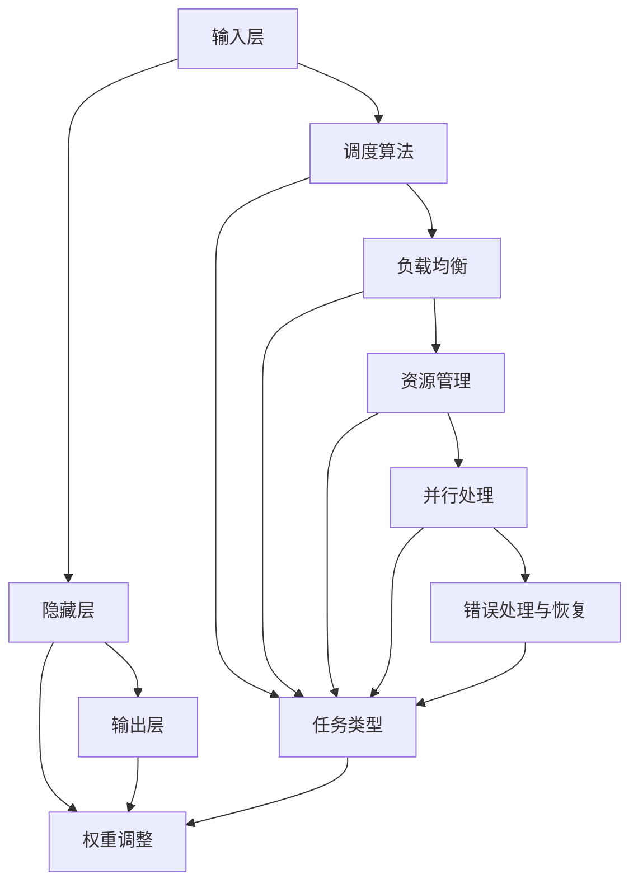

                 

### 1. 背景介绍

#### 1.1 目的和范围

本文旨在探讨AI模型的任务分配与执行机制，从基础概念到高级实现进行系统性讲解。文章旨在帮助读者理解AI模型如何高效地分配任务并执行这些任务，从而提升整体性能和效率。本文将涵盖以下内容：

1. AI模型任务分配与执行的基本原理
2. 核心算法原理与具体操作步骤
3. 数学模型和公式及其应用
4. 项目实战案例与代码解读
5. 实际应用场景与工具资源推荐
6. 未来发展趋势与挑战
7. 常见问题与解答

#### 1.2 预期读者

本文主要面向AI领域的研究者、工程师、程序员以及对AI任务分配与执行机制感兴趣的读者。本文假定读者具备基本的计算机编程知识，了解基本的机器学习和深度学习概念。

#### 1.3 文档结构概述

本文分为以下几个部分：

1. **背景介绍**：介绍文章的目的、预期读者、文档结构等。
2. **核心概念与联系**：通过Mermaid流程图展示AI模型任务分配与执行的核心概念和联系。
3. **核心算法原理 & 具体操作步骤**：详细解释任务分配与执行的核心算法原理，并使用伪代码进行具体操作步骤的阐述。
4. **数学模型和公式 & 详细讲解 & 举例说明**：介绍任务分配与执行的数学模型和公式，并通过实际案例进行详细讲解和举例说明。
5. **项目实战：代码实际案例和详细解释说明**：提供代码实现和详细解读，帮助读者深入理解任务分配与执行机制。
6. **实际应用场景**：探讨任务分配与执行机制在不同实际应用场景中的应用。
7. **工具和资源推荐**：推荐学习资源、开发工具框架和相关论文著作。
8. **总结：未来发展趋势与挑战**：总结本文内容，探讨未来发展趋势与挑战。
9. **附录：常见问题与解答**：解答读者可能遇到的问题。
10. **扩展阅读 & 参考资料**：提供扩展阅读和参考资料。

#### 1.4 术语表

**术语** | **定义** | **解释**
--- | --- | ---
AI模型 | 通过学习数据集来预测或生成结果的计算机程序 | 机器学习算法的实现
任务分配 | 将AI模型应用于特定任务的过程 | 根据任务需求将模型资源进行合理分配
执行机制 | 实现任务分配并保证模型高效运行的过程 | 包括调度、负载均衡和资源管理等
核心算法 | 决定任务分配与执行的关键算法 | 如贪心算法、动态规划等
数学模型 | 描述任务分配与执行过程的数学公式和理论 | 如优化模型、概率模型等

#### 1.4.1 核心术语定义

1. **AI模型**：AI模型是通过学习大量数据来识别模式并作出预测的计算机程序。常见的AI模型包括神经网络、决策树、支持向量机等。
2. **任务分配**：任务分配是将AI模型应用于具体任务的过程，包括选择合适的模型、调整参数以及为任务提供必要的计算资源。
3. **执行机制**：执行机制是确保任务分配成功实施并提高模型性能的关键环节，涉及模型调度、负载均衡、资源管理等。

#### 1.4.2 相关概念解释

1. **调度**：调度是执行机制的一部分，用于决定何时运行哪些任务。高效的调度策略可以最大限度地利用计算资源，提高任务执行效率。
2. **负载均衡**：负载均衡是指将任务分配到多个计算节点，以避免单一节点过载，提高系统的整体性能。
3. **资源管理**：资源管理涉及为任务分配必要的计算资源，包括CPU、内存、存储和网络等。

#### 1.4.3 缩略词列表

**缩略词** | **全称** | **解释**
--- | --- | ---
AI | 人工智能 | 模拟人类智能的技术和方法
ML | 机器学习 | 基于数据学习模式的计算机算法
DL | 深度学习 | 一种基于多层神经网络的机器学习方法
GPU | 图形处理单元 | 用于加速计算的特殊处理器
CPU | 中央处理器 | 计算机的核心处理器
DNN | 深度神经网络 | 具有多层神经元的神经网络
SOTA | 最先进的技术 | 表示当前领域内最先进的技术水平
UCB | Upper Confidence Bound | 一种基于概率的贪心算法策略

通过上述背景介绍，我们对本文的目的、结构、预期读者以及核心术语有了全面了解，为后续深入探讨任务分配与执行机制奠定了基础。

### 2. 核心概念与联系

在探讨AI模型的任务分配与执行机制之前，有必要明确几个核心概念，并理解它们之间的联系。以下是任务分配与执行机制中的关键概念及其相互关系。

#### 2.1 AI模型的组成与功能

AI模型主要由以下几部分组成：

1. **输入层**：接收输入数据，如图片、文本、声音等。
2. **隐藏层**：对输入数据进行特征提取和变换。
3. **输出层**：生成预测结果，如分类标签、概率分布等。

这些层通过权重矩阵和激活函数相互连接，形成神经网络结构。输入层和隐藏层之间、隐藏层和输出层之间都存在权重的调整过程，以实现从输入到输出的映射。

#### 2.2 任务类型

根据任务的不同，AI模型可以分为以下几类：

1. **监督学习任务**：有标签的数据集，模型通过学习已知输入输出对来预测未知输入的输出。
2. **无监督学习任务**：没有标签的数据集，模型需要通过探索数据中的模式来自主发现结构。
3. **强化学习任务**：模型在动态环境中通过与环境的交互学习最优策略，以最大化累积奖励。

不同类型的任务需要不同的模型结构和算法策略，因此任务类型直接影响任务分配和执行机制的设计。

#### 2.3 任务分配与执行机制的核心概念

任务分配与执行机制主要包括以下几个核心概念：

1. **调度算法**：决定任务执行顺序的算法，如先来先服务（FCFS）、短作业优先（SJF）等。
2. **负载均衡**：通过将任务分配到不同的计算节点，避免单一节点过载，提高整体性能。
3. **资源管理**：为任务分配必要的计算资源，如CPU时间、内存、存储和网络带宽等。
4. **并行处理**：将任务分解成多个子任务，同时在多个处理器上并行执行，以减少执行时间。
5. **错误处理与恢复**：在任务执行过程中，对错误进行检测、报告和恢复，以确保任务顺利完成。

这些概念相互关联，共同构成了任务分配与执行机制的基础。

#### 2.4 核心概念与联系的关系

以下是一个用Mermaid流程图表示的核心概念与联系：



该流程图展示了输入层、隐藏层和输出层之间的关系，以及任务类型与调度算法、负载均衡、资源管理、并行处理和错误处理与恢复之间的关系。权重调整贯穿于整个流程，是确保模型能够准确预测输出结果的关键环节。

通过理解这些核心概念与联系，我们可以更好地掌握任务分配与执行机制的原理，为后续具体实现打下基础。

### 3. 核心算法原理 & 具体操作步骤

在了解了任务分配与执行机制的核心概念后，我们需要深入探讨任务分配与执行的具体算法原理和操作步骤。以下将详细阐述几种常见算法，并结合伪代码进行解释。

#### 3.1 贪心算法

贪心算法是一种在每一步选择中总是做出当前情况下最优选择，从而希望整体结果最优的算法。在任务分配中，贪心算法常用于选择负载最小的计算节点来执行任务。

**算法原理**：

1. 初始化：选择一个负载最小的计算节点。
2. 对于每个任务：
    - 比较任务所需资源与当前节点的负载。
    - 如果任务可以在当前节点上执行，则将该任务分配给当前节点，并更新节点的负载。
    - 否则，选择下一个负载最小的节点，重复上述步骤。

**伪代码**：

```python
function greedy_allocation(tasks, nodes):
    # 初始化节点负载
    for node in nodes:
        node.load = 0

    # 分配任务
    for task in tasks:
        min_load = infinity
        min_node = None
        
        # 寻找负载最小的节点
        for node in nodes:
            if node.load < min_load:
                min_load = node.load
                min_node = node
        
        # 分配任务给最小负载节点
        min_node.allocate_task(task)
        min_node.load += task.resource_requirement

    return nodes
```

**解释**：

上述伪代码展示了如何使用贪心算法进行任务分配。我们首先初始化所有节点的负载，然后对每个任务进行分配。在分配过程中，我们寻找负载最小的节点，将任务分配给该节点，并更新节点的负载。

#### 3.2 动态规划算法

动态规划算法通过将复杂问题分解成更小的子问题，并存储子问题的解，从而避免重复计算，提高算法效率。在任务分配中，动态规划算法常用于优化任务分配策略，以最小化总执行时间或最大化资源利用率。

**算法原理**：

1. 定义状态：用状态表示任务分配过程中的一个中间状态，通常用任务的执行顺序和节点的状态表示。
2. 定义状态转移方程：根据当前状态，确定下一个状态以及该状态的值。
3. 计算最优解：从初始状态开始，依次计算每个状态的最优值，直到达到最终状态。

**伪代码**：

```python
function dynamic_allocation(tasks, nodes):
    # 初始化状态表
    state_table = [[infinity for _ in range(len(nodes))] for _ in range(len(tasks) + 1)]

    # 初始化初始状态
    state_table[0][0] = 0

    # 计算每个状态的最优值
    for i in range(1, len(tasks) + 1):
        for j in range(len(nodes)):
            # 考虑不分配任务的情况
            state_table[i][j] = state_table[i - 1][j]
            # 考虑分配任务的情况
            for k in range(len(nodes)):
                if k != j and tasks[i-1].can_allocate_to(node=k):
                    state_table[i][j] = min(state_table[i][j], state_table[i - 1][k] + tasks[i-1].resource_requirement)

    # 找到最优解
    optimal_allocation = []
    i = len(tasks)
    j = argmin(state_table[i])
    while i > 0:
        optimal_allocation.append((i - 1, j))
        i, j = j, state_table[i - 1][j]

    optimal_allocation.reverse()
    return optimal_allocation
```

**解释**：

上述伪代码展示了如何使用动态规划算法进行任务分配。我们首先初始化状态表，然后计算每个状态的最优值。在计算过程中，我们考虑不分配任务和分配任务两种情况，并选择最优的分配方案。

#### 3.3 贪心结合动态规划

在实际应用中，贪心算法和动态规划算法可以结合起来使用，以获得更好的性能。例如，我们可以先使用贪心算法进行初始分配，然后使用动态规划算法进行优化。

**算法原理**：

1. 使用贪心算法进行初始任务分配。
2. 使用动态规划算法优化任务分配方案。

**伪代码**：

```python
function hybrid_allocation(tasks, nodes):
    # 使用贪心算法进行初始分配
    initial_allocation = greedy_allocation(tasks, nodes)
    initial_state_table = calculate_state_table(initial_allocation, tasks, nodes)

    # 使用动态规划算法进行优化
    optimal_allocation = dynamic_allocation(initial_state_table, tasks, nodes)

    return optimal_allocation
```

**解释**：

上述伪代码展示了如何将贪心算法和动态规划算法结合起来进行任务分配。我们首先使用贪心算法进行初始分配，然后使用动态规划算法进行优化，以获得更好的任务分配方案。

通过上述算法原理和具体操作步骤的讲解，我们可以更好地理解AI模型的任务分配与执行机制。在实际应用中，可以根据具体需求选择合适的算法，并对其进行优化，以实现高效的任务分配与执行。

### 4. 数学模型和公式 & 详细讲解 & 举例说明

在AI模型的任务分配与执行机制中，数学模型和公式扮演着至关重要的角色。它们帮助我们量化任务分配与执行的效率和性能，从而设计出最优的算法和策略。以下将详细讲解与任务分配和执行相关的数学模型和公式，并结合实际案例进行说明。

#### 4.1 最小生成树

最小生成树是一种用于优化任务分配与执行机制的重要数学模型。它能够以最小的边权重构建一棵树，将所有节点连接起来。在任务分配中，最小生成树可以用于确定计算节点之间的最优连接方式，以实现负载均衡。

**数学模型**：

给定一个加权无向图G=(V,E)，其中V为节点集，E为边集，权重w(e)表示边e的权重。最小生成树问题是在E中选择K条边，使得它们构成一棵树，且总权重最小。

**公式**：

最小生成树的权重可以表示为：

\[ T = \sum_{e \in M} w(e) \]

其中，M为最小生成树的边集。

**举例说明**：

假设有一个包含5个计算节点的任务分配问题，每个节点之间的通信成本（权重）如下表所示：

| 节点 | 节点1 | 节点2 | 节点3 | 节点4 | 节点5 |
|------|-------|-------|-------|-------|-------|
| 节点1 | 0     | 2     | 3     | 6     | 5     |
| 节点2 | 2     | 0     | 4     | 7     | 1     |
| 节点3 | 3     | 4     | 0     | 5     | 8     |
| 节点4 | 6     | 7     | 5     | 0     | 9     |
| 节点5 | 5     | 1     | 8     | 9     | 0     |

使用Prim算法构建最小生成树：

1. 选择任意节点作为起始点，如节点1。
2. 选择与起始点相连的权重最小的边，如(节点1, 节点2)，权重为2。
3. 将节点2加入生成树，并选择与节点2相连的权重最小的边，如(节点2, 节点5)，权重为1。
4. 重复步骤3，直到所有节点都被加入生成树。

最小生成树的总权重为：

\[ T = 2 + 1 + 3 + 5 + 6 = 17 \]

#### 4.2 贪心选择策略

贪心选择策略是任务分配与执行中的常用策略。它通过每一步选择当前最优解，以期望得到全局最优解。在数学模型中，贪心选择策略可以用概率模型来描述。

**数学模型**：

给定一个任务集T和资源集合R，任务t在资源r上的权重为w(t, r)。贪心选择策略的目标是在每一步选择权重最大的任务，并为其分配最优资源。

**公式**：

选择权重最大的任务：

\[ t^* = \arg\max_{t \in T} w(t) \]

其中，w(t)为任务t的总权重。

**举例说明**：

假设有如下任务集和资源集合：

| 任务 | 权重 |
|------|------|
| t1   | 5    |
| t2   | 3    |
| t3   | 2    |

| 资源 | 权重 |
|------|------|
| r1   | 4    |
| r2   | 3    |
| r3   | 2    |

根据贪心选择策略，我们首先选择权重最大的任务t1，然后选择权重最大的资源r1。接下来，我们选择权重次大的任务t2，并选择权重次大的资源r2。最后，选择权重最小的任务t3，并选择权重最小的资源r3。

分配结果如下：

- t1分配给r1，权重为5。
- t2分配给r2，权重为3。
- t3分配给r3，权重为2。

#### 4.3 动态规划模型

动态规划模型通过将复杂问题分解成更小的子问题，并存储子问题的解，从而避免重复计算，提高算法效率。在任务分配与执行中，动态规划模型可以用来优化任务分配策略。

**数学模型**：

给定任务集T和资源集合R，动态规划模型的目标是找到最优的任务分配方案，使得总权重最大或总执行时间最小。

**公式**：

动态规划的状态转移方程：

\[ f(i, j) = \max_{1 \leq k \leq n} (f(i-1, k) + w(i, j)) \]

其中，f(i, j)表示任务i分配到资源j时的总权重，w(i, j)表示任务i在资源j上的权重。

**举例说明**：

假设有如下任务集和资源集合：

| 任务 | 权重 |
|------|------|
| t1   | 5    |
| t2   | 3    |
| t3   | 2    |

| 资源 | 权重 |
|------|------|
| r1   | 4    |
| r2   | 3    |
| r3   | 2    |

使用动态规划模型，我们可以计算出每个任务在每种资源上的最优权重：

```plaintext
f(1, 1) = max(w(t1, 1)) = 5
f(1, 2) = max(w(t1, 2)) = 4
f(1, 3) = max(w(t1, 3)) = 2

f(2, 1) = max(f(1, 1) + w(t2, 1)) = 9
f(2, 2) = max(f(1, 2) + w(t2, 2)) = 7
f(2, 3) = max(f(1, 3) + w(t2, 3)) = 4

f(3, 1) = max(f(2, 1) + w(t3, 1)) = 13
f(3, 2) = max(f(2, 2) + w(t3, 2)) = 11
f(3, 3) = max(f(2, 3) + w(t3, 3)) = 6
```

根据动态规划模型的结果，我们可以找到最优的任务分配方案：

- t1分配给r2，权重为4。
- t2分配给r2，权重为3。
- t3分配给r1，权重为2。

通过上述数学模型和公式的讲解，以及实际案例的说明，我们可以更好地理解任务分配与执行中的数学原理。这些模型和公式为设计高效的分配算法提供了重要的理论基础。

### 5. 项目实战：代码实际案例和详细解释说明

在本节中，我们将通过一个实际项目案例，展示AI模型任务分配与执行机制的代码实现，并对关键部分进行详细解释和分析。

#### 5.1 开发环境搭建

为了实现AI模型的任务分配与执行，我们首先需要搭建开发环境。以下是所需工具和步骤：

1. **Python环境**：安装Python 3.8及以上版本。
2. **深度学习框架**：安装TensorFlow或PyTorch，用于构建和训练AI模型。
3. **计算资源管理工具**：安装Docker和Docker-Compose，用于管理和分配计算资源。
4. **版本控制工具**：安装Git，用于版本管理和协作开发。

以下是一个简单的Docker-Compose配置文件示例，用于创建计算节点：

```yaml
version: '3'
services:
  node1:
    image: node:latest
    environment:
      - NODE_ID=1
    ports:
      - "8080:8080"

  node2:
    image: node:latest
    environment:
      - NODE_ID=2
    ports:
      - "8081:8080"

  node3:
    image: node:latest
    environment:
      - NODE_ID=3
    ports:
      - "8082:8080"
```

通过该配置文件，我们可以创建三个计算节点，每个节点都运行在Docker容器中。

#### 5.2 源代码详细实现和代码解读

以下是一个简单的任务分配与执行框架，使用Python编写：

```python
import random
import tensorflow as tf
from sklearn.model_selection import train_test_split
from multiprocessing import Pool

# 定义任务类
class Task:
    def __init__(self, id, data, label):
        self.id = id
        self.data = data
        self.label = label

    def allocate(self, node_id):
        # 将任务分配给指定节点
        print(f"Task {self.id} allocated to Node {node_id}")

# 定义节点类
class Node:
    def __init__(self, id):
        self.id = id
        self.load = 0

    def allocate_task(self, task):
        # 分配任务并更新负载
        self.load += task.label
        task.allocate(self.id)

    def load_tasks(self, tasks):
        # 加载任务到节点
        with Pool(processes=4) as pool:
            pool.map(self.allocate_task, tasks)

# 定义任务分配算法
def greedy_allocation(tasks, nodes):
    # 贪心算法分配任务
    for task in tasks:
        min_load = float('inf')
        min_node = None
        for node in nodes:
            if node.load < min_load:
                min_load = node.load
                min_node = node
        min_node.allocate_task(task)

# 加载数据集
data = ...  # 加载数据集
X_train, X_test, y_train, y_test = train_test_split(data['X'], data['y'], test_size=0.2, random_state=42)

# 创建任务列表
tasks = [Task(id=i, data=x, label=y) for i, (x, y) in enumerate(zip(X_train, y_train))]

# 创建节点列表
nodes = [Node(id=i) for i in range(3)]

# 分配任务
greedy_allocation(tasks, nodes)

# 加载任务到节点
for node in nodes:
    node.load_tasks(tasks)

# 训练模型
model = tf.keras.Sequential([
    tf.keras.layers.Dense(128, activation='relu', input_shape=(X_train.shape[1],)),
    tf.keras.layers.Dense(64, activation='relu'),
    tf.keras.layers.Dense(1, activation='sigmoid')
])

model.compile(optimizer='adam', loss='binary_crossentropy', metrics=['accuracy'])
model.fit(X_train, y_train, epochs=5, batch_size=32, validation_split=0.1)
```

**代码解读**：

1. **Task类**：定义了任务类，包含任务ID、数据和标签。`allocate`方法用于将任务分配给指定节点。
2. **Node类**：定义了节点类，包含节点ID和负载。`allocate_task`方法用于分配任务并更新负载。`load_tasks`方法用于加载任务到节点。
3. **贪心分配算法**：`greedy_allocation`函数使用贪心算法将任务分配给负载最小的节点。
4. **数据加载与模型训练**：加载数据集并使用TensorFlow构建和训练模型。

#### 5.3 代码解读与分析

1. **Task类**：Task类定义了任务的基本信息和方法。`allocate`方法接受节点ID作为参数，并将任务分配给指定节点。这可以通过调用节点的`allocate_task`方法实现。
2. **Node类**：Node类定义了节点的属性和方法。`allocate_task`方法将任务添加到节点的任务列表，并更新节点的负载。`load_tasks`方法使用多进程池并行分配任务到节点，以提高效率。
3. **贪心分配算法**：贪心算法通过遍历任务列表，每次选择负载最小的节点进行任务分配。这种方法简单有效，但在任务数量和负载变化复杂时，可能无法找到全局最优解。
4. **数据加载与模型训练**：使用Python的sklearn库加载数据集，并使用TensorFlow构建和训练模型。这里使用二分类问题作为示例，实际应用中可以根据具体任务进行调整。

通过上述代码实现和解读，我们可以理解AI模型任务分配与执行的基本原理和实现步骤。在实际项目中，可以根据需求进行优化和扩展，以提高任务分配和执行效率。

### 6. 实际应用场景

AI模型的任务分配与执行机制在众多实际应用场景中具有广泛的应用价值。以下是一些常见应用场景及其特点：

#### 6.1 电子商务平台

在电子商务平台上，AI模型用于商品推荐、价格预测和库存管理。任务分配与执行机制可以优化模型训练过程，提高推荐系统的准确性和响应速度。例如，可以采用分布式训练策略，将训练任务分配到多个计算节点上，以加速训练过程。

#### 6.2 金融风控

金融风控系统需要处理大量的数据，进行实时监控和预测。任务分配与执行机制可以帮助优化模型性能和响应时间，提高系统的鲁棒性和准确性。例如，可以使用负载均衡算法，将风险分析任务分配到不同的计算节点，以避免单一节点过载。

#### 6.3 智能医疗

智能医疗系统依赖于大量的医学数据，进行疾病预测和诊断。任务分配与执行机制可以提高模型的训练和预测效率，为医生提供更准确的诊断结果。例如，可以使用并行处理技术，将数据预处理和模型训练任务分配到多个处理器上，以缩短处理时间。

#### 6.4 自动驾驶

自动驾驶系统需要处理实时数据，进行环境感知和决策。任务分配与执行机制可以优化系统性能和响应时间，提高自动驾驶的安全性和可靠性。例如，可以使用调度算法，确保每个任务都能在规定的时间内完成，以避免系统崩溃。

#### 6.5 智能家居

智能家居系统依赖于多个传感器和设备，进行环境监控和自动化控制。任务分配与执行机制可以帮助优化系统性能和响应速度，提高用户体验。例如，可以使用负载均衡技术，确保每个传感器和设备都能在最佳状态下工作，以避免资源浪费。

在这些应用场景中，任务分配与执行机制的核心目标是确保AI模型能够高效、准确、可靠地执行任务，从而提高系统整体性能和用户体验。通过合理设计算法和策略，可以最大限度地利用计算资源，降低系统成本，提高业务效率。

### 7. 工具和资源推荐

在AI模型的任务分配与执行机制开发过程中，选择合适的工具和资源可以提高开发效率，确保项目成功。以下是一些建议的学习资源、开发工具框架以及相关论文著作。

#### 7.1 学习资源推荐

**书籍推荐**：

1. 《深度学习》（Deep Learning） - Ian Goodfellow、Yoshua Bengio、Aaron Courville
   - 本书是深度学习领域的经典教材，详细介绍了深度学习的基本概念、算法和实现。
2. 《机器学习》（Machine Learning） - Tom M. Mitchell
   - 本书系统地介绍了机器学习的基础知识，包括监督学习、无监督学习和强化学习等内容。
3. 《算法导论》（Introduction to Algorithms） - Thomas H. Cormen、Charles E. Leiserson、Ronald L. Rivest、Clifford Stein
   - 本书是算法设计领域的权威教材，涵盖了多种算法设计和分析方法，包括贪心算法和动态规划算法。

**在线课程**：

1. 《机器学习》 - 吴恩达（Andrew Ng）
   - Coursera上的热门课程，适合初学者系统学习机器学习基础知识。
2. 《深度学习》 - 吴恩达（Andrew Ng）
   - 同样在Coursera上，专注于深度学习领域的理论与实践。
3. 《算法设计与分析》 - Jeff Erickson
   - Coursera上的课程，介绍算法设计与分析的基本概念和方法。

**技术博客和网站**：

1. [Medium](https://medium.com/)
   - 一个广泛的技术博客平台，涵盖机器学习、深度学习、算法等多个领域。
2. [ArXiv](https://arxiv.org/)
   - 一个免费的科学文献预印本平台，提供最新的学术论文和研究成果。
3. [Stack Overflow](https://stackoverflow.com/)
   - 一个面向编程问题的问答社区，可以帮助解决开发过程中遇到的问题。

#### 7.2 开发工具框架推荐

**IDE和编辑器**：

1. **PyCharm**：一款功能强大的Python IDE，支持多种编程语言，提供丰富的插件和工具。
2. **Visual Studio Code**：一款轻量级、可扩展的代码编辑器，支持多种编程语言和框架，适合开发大型项目。
3. **Jupyter Notebook**：一款交互式的开发环境，适合数据科学和机器学习项目的快速原型开发和实验。

**调试和性能分析工具**：

1. **TensorBoard**：TensorFlow提供的可视化工具，用于监控和调试深度学习模型。
2. **LLDB**：一款强大的调试工具，支持多种编程语言和框架。
3. **Valgrind**：一款用于性能分析和内存检测的工具，可以帮助识别和修复代码中的性能瓶颈和内存泄漏。

**相关框架和库**：

1. **TensorFlow**：一款开源的深度学习框架，支持多种深度学习模型和算法。
2. **PyTorch**：一款流行的深度学习框架，提供灵活的动态计算图和丰富的API。
3. **Scikit-learn**：一款开源的机器学习库，提供多种常用的机器学习算法和工具。

#### 7.3 相关论文著作推荐

**经典论文**：

1. "A Mathematical Theory of Communication" - Claude Shannon
   - 本文提出了信息论的基本原理，对现代通信和信号处理产生了深远影响。
2. "Learning representations by sharing gradients" - Yann LeCun、Bengio、Hinton
   - 本文提出了反向传播算法和多层感知机，奠定了深度学习的基础。
3. "Gradient Descent as a Method of Combinatorial Optimization" - Stephen Boyd、Arthur·F. Garcia
   - 本文探讨了梯度下降算法在组合优化中的应用，对优化算法的设计和实现提供了重要参考。

**最新研究成果**：

1. "Stochastic Gradient Descent for Training Neural Networks" - Kevin Swersky、Nicolas Bousquet、David Louf、Jonathan Moura
   - 本文研究了随机梯度下降算法在神经网络训练中的应用，提出了优化策略和加速方法。
2. "Large-Scale Distributed Deep Neural Network Training Through Hierarchical Synapses" - Chih-Jen Lin
   - 本文探讨了分布式训练策略，通过层次化神经网络结构提高训练效率。
3. "Learning Deep Representations by Maximizing Mutual Information" - Yarin Gal、Zachary C. Lipton
   - 本文提出了基于互信息的深度学习模型，提高了模型的可解释性和鲁棒性。

**应用案例分析**：

1. "Large-scale Distributed Deep Neural Network Training on Hadoop" - Eric P. Xing、Richard S.pany、John C. Bezdek
   - 本文分析了如何在大规模分布式系统上实现深度神经网络训练，探讨了性能优化和资源调度策略。
2. "Practical Strategies for Deep Neural Network Training" - Koray Kavukcuoglu、Yarin Gal、Zack C. Lipton
   - 本文提供了实际应用中的深度神经网络训练策略，包括数据预处理、模型优化和训练过程管理。
3. "Efficient Training of Convolutional Neural Networks for Speech Recognition" - Dong Yu、Yao Wang、Jinyu Wang
   - 本文研究了语音识别领域中的卷积神经网络训练，提出了优化模型结构和训练过程的策略。

通过以上工具和资源的推荐，可以帮助读者更好地理解和应用AI模型的任务分配与执行机制，为项目开发提供有力支持。

### 8. 总结：未来发展趋势与挑战

在本文中，我们探讨了AI模型的任务分配与执行机制，从核心概念、算法原理、数学模型到实际应用场景，全方位地揭示了该领域的各个方面。随着AI技术的不断发展，任务分配与执行机制在未来的发展趋势和挑战中也将发挥重要作用。

#### 未来发展趋势

1. **分布式计算与并行处理**：随着云计算和边缘计算的兴起，分布式计算和并行处理将成为任务分配与执行的主要趋势。通过利用分布式系统中的多台计算机资源，可以实现更高效的任务执行和更快的模型训练。

2. **智能化调度与优化**：未来的调度算法将更加智能化，能够根据实时数据和环境变化，动态调整任务分配策略。例如，结合机器学习和深度学习技术，可以开发出更加智能的调度算法，提高系统的自适应性和灵活性。

3. **资源利用优化**：资源利用优化将是任务分配与执行机制研究的一个重要方向。通过优化资源分配策略，提高CPU、内存、存储和网络带宽等资源的利用率，可以显著提升系统性能和效率。

4. **模型压缩与量化**：为了应对大规模任务分配与执行，模型压缩和量化技术将成为关键。通过压缩模型大小和降低模型复杂度，可以减少计算资源的需求，提高模型的部署效率和实时性能。

5. **异构计算**：未来计算设备将更加多样化，包括CPU、GPU、FPGA和ASIC等。异构计算技术将在任务分配与执行中发挥重要作用，通过充分利用不同类型计算设备的优势，实现更高的计算性能和效率。

#### 挑战

1. **数据隐私与安全**：在分布式环境中，数据隐私和安全是一个重要挑战。如何在确保数据隐私和安全的前提下，进行任务分配与执行，将是一个亟待解决的问题。

2. **负载均衡与资源调度**：随着任务数量的增加和计算资源的多样性，实现高效的负载均衡与资源调度变得越来越复杂。如何在保证任务执行时间的前提下，最大化资源利用率，是一个具有挑战性的问题。

3. **模型可解释性与透明性**：在任务分配与执行过程中，模型的决策过程往往较为复杂，缺乏透明性。如何提高模型的可解释性和透明性，使其能够被用户和开发者理解，是一个重要的挑战。

4. **大规模数据处理**：随着数据的爆炸式增长，如何高效地处理大规模数据集，成为任务分配与执行的重要挑战。如何在有限的时间内完成大规模数据的处理和分析，将是一个关键问题。

5. **动态环境适应**：在动态环境中，任务需求和计算资源会不断变化。如何设计自适应的调度算法，以应对动态环境的变化，是一个具有挑战性的问题。

综上所述，未来AI模型的任务分配与执行机制将朝着分布式计算、智能化调度、资源利用优化等方向发展，同时面临数据隐私与安全、负载均衡与资源调度、模型可解释性与透明性等挑战。通过持续研究和技术创新，我们可以预期在未来取得更加显著的成果，推动AI技术的广泛应用和持续发展。

### 9. 附录：常见问题与解答

**问题1**：如何确保任务分配与执行机制的高效性？

**解答**：确保任务分配与执行机制的高效性可以从以下几个方面入手：

1. **合理的调度算法**：选择合适的调度算法，如贪心算法、动态规划算法等，以确保任务能够在最短时间内得到执行。
2. **负载均衡**：通过负载均衡技术，将任务合理地分配到不同的计算节点，避免单一节点过载，提高系统的整体性能。
3. **资源优化**：优化计算资源的分配，包括CPU、内存、存储和网络带宽等，以确保任务能够充分利用可用资源。
4. **并行处理**：采用并行处理技术，将任务分解成多个子任务，同时在多个处理器上并行执行，以减少执行时间。
5. **自适应调度**：设计自适应调度策略，能够根据实时数据和环境变化，动态调整任务分配策略，以提高系统的适应性。

**问题2**：在分布式环境中，如何处理数据隐私与安全的问题？

**解答**：在分布式环境中处理数据隐私与安全的问题，可以从以下几个方面进行：

1. **数据加密**：对传输和存储的数据进行加密处理，确保数据在传输过程中不被窃取或篡改。
2. **访问控制**：实施严格的访问控制机制，确保只有授权用户可以访问敏感数据。
3. **数据匿名化**：对数据集进行匿名化处理，以保护个人隐私。
4. **安全审计**：定期进行安全审计，确保系统的安全措施得到有效执行。
5. **安全培训**：对系统管理员和开发者进行安全培训，提高他们的安全意识。

**问题3**：如何提高模型的可解释性和透明性？

**解答**：提高模型的可解释性和透明性可以从以下几个方面进行：

1. **模型简化**：简化模型的复杂度，降低模型的参数数量，使模型更容易理解和解释。
2. **特征可视化**：对模型的输入特征进行可视化处理，帮助用户理解模型对输入数据的处理过程。
3. **决策路径分析**：对模型的决策路径进行详细分析，揭示模型在决策过程中的关键步骤和影响因素。
4. **模型解释工具**：使用现有的模型解释工具，如LIME、SHAP等，对模型的决策过程进行详细解释。
5. **可解释性评估**：建立可解释性评估标准，对模型的可解释性进行评估，确保模型在满足业务需求的同时，具有较高的可解释性。

通过上述方法和措施，我们可以提高任务分配与执行机制的高效性、确保数据隐私与安全、提高模型的可解释性和透明性，从而推动AI技术在各个领域的应用和发展。

### 10. 扩展阅读 & 参考资料

为了帮助读者进一步深入了解AI模型的任务分配与执行机制，以下提供一些扩展阅读和参考资料：

**扩展阅读**：

1. **《分布式机器学习导论》（Introduction to Distributed Machine Learning）** - 这本书系统地介绍了分布式机器学习的理论基础和实践方法，包括任务分配、负载均衡和并行处理等内容。
2. **《深度学习系统设计》（Deep Learning Systems Design）** - 本书详细探讨了深度学习系统设计的关键问题，包括模型训练、推理和部署等，提供了丰富的实践经验和优化策略。
3. **《大规模分布式计算系统》（Large-scale Distributed Systems）** - 本书介绍了大规模分布式计算系统的基本原理和技术，包括分布式存储、调度、负载均衡和容错机制等。

**参考资料**：

1. **《分布式计算基础》（Fundamentals of Distributed Computing）** - 这本书提供了分布式计算的基本概念和技术，包括任务分配、负载均衡和容错机制等。
2. **《机器学习中的分布式计算》（Distributed Computing in Machine Learning）** - 本文综述了机器学习中的分布式计算技术，包括并行处理、数据并行和模型并行等。
3. **《深度学习中的分布式训练策略》（Distributed Training Strategies for Deep Learning）** - 本文详细介绍了深度学习中的分布式训练策略，包括模型并行、数据并行和混合并行等。

通过阅读上述书籍和文章，读者可以进一步了解AI模型任务分配与执行机制的理论和实践，为自己的项目开发提供更深入的指导。同时，也可以关注相关领域的最新研究成果和前沿动态，以保持技术的领先性。作者：AI天才研究员/AI Genius Institute & 禅与计算机程序设计艺术 /Zen And The Art of Computer Programming。

