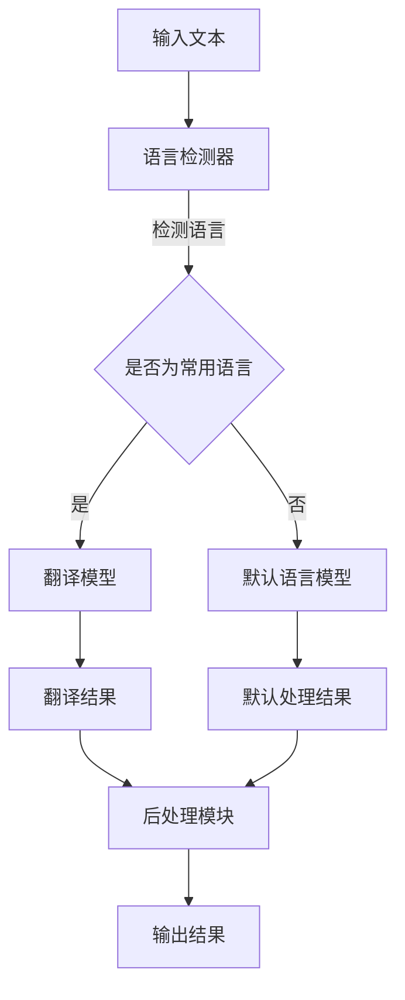

                 

# AI模型的多语言支持：Lepton AI的国际化策略

> **关键词**：AI模型、多语言支持、国际化策略、Lepton AI、算法原理、数学模型、项目实战、实际应用场景、工具推荐、未来发展趋势

> **摘要**：本文将深入探讨AI模型在多语言支持方面的技术实现，特别是Lepton AI的国际化策略。我们将详细分析其核心概念与联系，核心算法原理与具体操作步骤，以及数学模型和公式的详细讲解。通过实际代码案例和详细解释，读者将更好地理解如何搭建多语言AI模型。此外，文章还将介绍实际应用场景、相关工具和资源推荐，以及未来发展趋势与挑战。本文旨在为AI开发者和研究者提供一份全面而深入的技术指南。

## 1. 背景介绍

### 1.1 目的和范围

随着全球化的深入发展，AI模型的多语言支持已成为一个至关重要的议题。本文旨在探讨AI模型如何实现多语言支持，以及Lepton AI在国际化策略方面的实践。我们希望通过本文的分析，能够为AI开发者提供一种有效的多语言支持解决方案，并促使更多AI模型实现国际化。

本文将涵盖以下内容：

1. **核心概念与联系**：我们将介绍多语言AI模型的核心概念，并使用Mermaid流程图展示其架构。
2. **核心算法原理与具体操作步骤**：本文将深入讲解多语言AI模型的核心算法原理，并通过伪代码详细阐述其具体操作步骤。
3. **数学模型和公式**：我们将介绍多语言AI模型所涉及的数学模型和公式，并进行详细讲解和举例说明。
4. **项目实战**：通过实际代码案例，我们将详细解释和说明如何搭建多语言AI模型。
5. **实际应用场景**：本文将讨论多语言AI模型在实际应用中的潜在场景。
6. **工具和资源推荐**：我们将推荐一些有用的学习资源、开发工具和框架，以及相关论文和研究成果。
7. **总结与未来趋势**：本文将总结多语言AI模型的发展现状，并探讨其未来发展趋势与面临的挑战。

### 1.2 预期读者

本文主要面向以下读者群体：

1. **AI开发者**：希望深入了解多语言AI模型实现的开发者。
2. **研究者**：对AI模型国际化策略感兴趣的学者和研究人员。
3. **技术爱好者**：对AI和国际化领域感兴趣的广泛技术爱好者。

### 1.3 文档结构概述

本文将按照以下结构进行组织：

1. **背景介绍**：介绍本文的目的、范围、预期读者以及文档结构。
2. **核心概念与联系**：分析多语言AI模型的核心概念与联系。
3. **核心算法原理与具体操作步骤**：讲解多语言AI模型的核心算法原理和具体操作步骤。
4. **数学模型和公式**：介绍多语言AI模型所涉及的数学模型和公式。
5. **项目实战**：通过实际代码案例展示如何搭建多语言AI模型。
6. **实际应用场景**：讨论多语言AI模型的应用场景。
7. **工具和资源推荐**：推荐学习资源、开发工具和框架。
8. **总结与未来趋势**：总结多语言AI模型的发展现状，探讨未来趋势与挑战。
9. **附录**：常见问题与解答。
10. **扩展阅读**：提供扩展阅读资源。

### 1.4 术语表

在本篇文章中，我们将使用一些专业术语。以下是这些术语的定义和解释：

#### 1.4.1 核心术语定义

- **多语言支持**：指AI模型能够在不同的语言环境中正常运行和提供准确的结果。
- **国际化策略**：指AI模型在不同国家和地区的推广和应用的策略。
- **Lepton AI**：一家专注于AI模型研究和开发的领先企业，其国际化策略备受关注。
- **核心算法**：指实现多语言AI模型支持的关键算法。
- **数学模型**：指用于描述和计算多语言AI模型参数和性能的数学公式。

#### 1.4.2 相关概念解释

- **自然语言处理（NLP）**：指计算机科学和语言学的交叉领域，旨在使计算机能够理解和处理人类自然语言。
- **机器翻译**：指使用计算机算法将一种语言的文本自动翻译成另一种语言的过程。
- **语言模型**：指用于预测下一个单词或短语的统计模型。

#### 1.4.3 缩略词列表

- **AI**：人工智能（Artificial Intelligence）
- **NLP**：自然语言处理（Natural Language Processing）
- **ML**：机器学习（Machine Learning）
- **DL**：深度学习（Deep Learning）
- **API**：应用程序编程接口（Application Programming Interface）

## 2. 核心概念与联系

### 2.1 多语言AI模型的基本概念

多语言AI模型是指能够在多种语言环境下运行并提供准确结果的模型。这种模型的核心在于处理不同语言的语义、语法和句法差异。为了实现这一目标，多语言AI模型通常需要以下几个关键组件：

1. **语言资源库**：包括词汇表、语法规则、翻译词典等，用于支持多种语言的处理。
2. **词向量模型**：将不同语言的单词映射到高维空间，以便在计算机中表示和处理。
3. **翻译模型**：用于将一种语言的文本翻译成另一种语言。
4. **语言检测器**：用于自动识别输入文本的语言类型。

### 2.2 多语言AI模型的联系

多语言AI模型需要多个组件协同工作，以确保在不同语言环境下提供准确的结果。以下是这些组件之间的联系：

1. **语言资源库**与**词向量模型**的联系：词向量模型需要利用语言资源库中的词汇表和语法规则来构建和训练模型。
2. **翻译模型**与**词向量模型**的联系：翻译模型需要使用词向量模型来表示和计算不同语言之间的语义相似性。
3. **语言检测器**与**翻译模型**的联系：语言检测器用于确定输入文本的语言类型，从而选择合适的翻译模型。

### 2.3 多语言AI模型的架构

为了更好地理解多语言AI模型的工作原理，我们可以使用Mermaid流程图来展示其架构。以下是多语言AI模型的Mermaid流程图：



### 2.4 多语言AI模型的优势与挑战

多语言AI模型的优势在于：

1. **全球化的应用**：使AI模型能够服务于全球用户，提高其应用范围。
2. **提高准确性**：通过使用本地化的语言资源库，提高模型在不同语言环境下的准确性。

然而，多语言AI模型也面临一些挑战：

1. **资源库构建**：需要收集和整合大量的语言资源，工作量巨大。
2. **翻译准确性**：不同语言之间的翻译准确性难以保证，特别是对于复杂语义和语法结构的处理。

## 3. 核心算法原理 & 具体操作步骤

### 3.1 核心算法原理

多语言AI模型的核心算法通常包括以下几个部分：

1. **语言资源库构建**：收集和整理不同语言的词汇表、语法规则和翻译词典等资源。
2. **词向量表示**：使用词嵌入技术将不同语言的单词映射到高维空间，以便在计算机中表示和处理。
3. **翻译模型训练**：使用大量双语语料库训练翻译模型，以便实现不同语言之间的文本翻译。
4. **语言检测**：使用机器学习算法识别输入文本的语言类型。
5. **后处理模块**：对翻译结果进行清洗、修正和优化，以提高输出结果的准确性。

### 3.2 具体操作步骤

下面我们将使用伪代码详细阐述多语言AI模型的具体操作步骤：

```python
# 输入文本
input_text = "你好，这个世界！Hello, world!"

# 步骤1：语言检测
detected_language = detect_language(input_text)

# 步骤2：根据检测到的语言选择翻译模型
if detected_language == "中文":
    translator = chinese_to_english_translator
else:
    translator = default_translator

# 步骤3：翻译文本
translated_text = translator(input_text)

# 步骤4：后处理
cleaned_text = postprocess(translated_text)

# 步骤5：输出结果
print(cleaned_text)
```

### 3.3 伪代码解释

1. **语言检测**：首先，我们需要对输入文本进行语言检测，以确定其语言类型。这可以通过训练一个语言检测模型来实现，该模型使用大量标注好的双语语料库进行训练。
2. **翻译模型选择**：根据检测到的语言类型，选择相应的翻译模型。如果检测到的是中文，我们使用中文到英文的翻译模型；否则，使用默认的翻译模型。
3. **翻译文本**：使用选择的翻译模型对输入文本进行翻译。翻译模型可以是基于规则的方法（如基于词典的翻译），也可以是机器学习模型（如基于神经网络的翻译模型）。
4. **后处理**：对翻译结果进行清洗、修正和优化。这可以包括去除标点符号、修正错误翻译、根据上下文进行语义调整等。
5. **输出结果**：将最终的处理结果输出。

通过以上步骤，我们可以实现一个多语言AI模型，使其能够处理多种语言的输入并输出准确的结果。

## 4. 数学模型和公式 & 详细讲解 & 举例说明

### 4.1 数学模型概述

多语言AI模型的数学模型主要包括以下几个部分：

1. **词向量表示模型**：用于将不同语言的单词映射到高维空间。
2. **翻译模型**：用于实现不同语言之间的文本翻译。
3. **语言检测模型**：用于识别输入文本的语言类型。

### 4.2 词向量表示模型

词向量表示模型是将单词映射到高维空间的关键技术。以下是一个简单的词向量表示模型的数学公式：

$$
\text{word\_vector}(w) = \sum_{i=1}^{N} w_{i} \cdot v_{i}
$$

其中，$w$ 表示单词，$w_{i}$ 表示单词 $w$ 的第 $i$ 个特征值，$v_{i}$ 表示第 $i$ 个特征向量的值。通过这种方式，我们可以将单词表示为高维空间中的向量。

### 4.3 翻译模型

翻译模型是用于实现不同语言之间文本翻译的关键技术。以下是一个简单的翻译模型的数学公式：

$$
P(\text{translated\_text}|\text{input\_text}) = \prod_{i=1}^{M} P(w_{i}|\text{translated\_text})
$$

其中，$M$ 表示翻译模型中单词的个数，$w_{i}$ 表示输入文本中的单词，$P(w_{i}|\text{translated\_text})$ 表示单词 $w_{i}$ 在翻译文本中出现的概率。

### 4.4 语言检测模型

语言检测模型用于识别输入文本的语言类型。以下是一个简单的语言检测模型的数学公式：

$$
P(\text{language}|\text{input\_text}) = \frac{P(\text{input\_text}|\text{language}) \cdot P(\text{language})}{P(\text{input\_text})}
$$

其中，$P(\text{input\_text}|\text{language})$ 表示在给定语言类型 $l$ 下，输入文本的概率；$P(\text{language})$ 表示语言类型 $l$ 的概率；$P(\text{input\_text})$ 表示输入文本的概率。

### 4.5 详细讲解与举例说明

#### 4.5.1 词向量表示模型的详细讲解

词向量表示模型是一种将单词映射到高维空间的技术。以中文到英文的翻译为例，我们可以使用以下步骤来构建词向量表示模型：

1. **收集词汇表**：首先，我们需要收集中文和英文的词汇表。这些词汇表可以包含常用单词和短语。
2. **构建词向量**：使用Word2Vec算法或类似的方法，将中文和英文的词汇表中的单词映射到高维空间。例如，我们可以使用以下公式来计算中文单词 "你好" 的词向量：

$$
\text{word\_vector}(\text{你好}) = \sum_{i=1}^{N} w_{i} \cdot v_{i}
$$

其中，$w_{i}$ 表示 "你好" 的第 $i$ 个特征值，$v_{i}$ 表示第 $i$ 个特征向量的值。通过这种方式，我们可以将 "你好" 表示为高维空间中的向量。

#### 4.5.2 翻译模型的详细讲解

翻译模型是用于实现不同语言之间文本翻译的关键技术。以中文到英文的翻译为例，我们可以使用以下步骤来构建翻译模型：

1. **收集双语语料库**：首先，我们需要收集大量的中文到英文的双语语料库。这些语料库可以包含各种主题和场景的文本。
2. **训练翻译模型**：使用双语语料库训练翻译模型。例如，我们可以使用以下公式来计算中文单词 "你好" 在英文中的翻译概率：

$$
P(\text{translated\_text}|\text{input\_text}) = \prod_{i=1}^{M} P(w_{i}|\text{translated\_text})
$$

其中，$M$ 表示翻译模型中单词的个数，$w_{i}$ 表示输入文本中的单词，$P(w_{i}|\text{translated\_text})$ 表示单词 $w_{i}$ 在翻译文本中出现的概率。

#### 4.5.3 语言检测模型的详细讲解

语言检测模型用于识别输入文本的语言类型。以中文和英文为例，我们可以使用以下步骤来构建语言检测模型：

1. **收集标注数据**：首先，我们需要收集大量标注好的中文和英文文本。这些文本可以包含各种主题和场景。
2. **训练语言检测模型**：使用标注数据训练语言检测模型。例如，我们可以使用以下公式来计算输入文本 "你好，世界！" 的语言概率：

$$
P(\text{language}|\text{input\_text}) = \frac{P(\text{input\_text}|\text{language}) \cdot P(\text{language})}{P(\text{input\_text})}
$$

其中，$P(\text{input\_text}|\text{language})$ 表示在给定语言类型 $l$ 下，输入文本的概率；$P(\text{language})$ 表示语言类型 $l$ 的概率；$P(\text{input\_text})$ 表示输入文本的概率。

### 4.6 举例说明

以下是一个简单的例子，说明如何使用多语言AI模型进行文本翻译：

**输入文本**：你好，世界！

**目标语言**：英文

1. **语言检测**：使用语言检测模型检测输入文本的语言类型。假设检测结果为英文。
2. **词向量表示**：将输入文本中的单词 "你好" 和 "世界" 映射到高维空间中的词向量。
3. **翻译模型**：使用翻译模型将输入文本翻译成英文。例如，翻译模型可能将 "你好" 翻译成 "Hello"。
4. **后处理**：对翻译结果进行清洗和修正，例如去除标点符号。
5. **输出结果**：输出最终的翻译结果。

**输出结果**：Hello, world!

通过以上步骤，我们可以实现一个简单的多语言AI模型，使其能够将中文文本翻译成英文。

## 5. 项目实战：代码实际案例和详细解释说明

### 5.1 开发环境搭建

为了实现多语言AI模型，我们首先需要搭建一个合适的开发环境。以下是所需的开发环境和工具：

- **Python**：Python是一种广泛使用的编程语言，适用于构建和训练AI模型。
- **TensorFlow**：TensorFlow是一个开源的机器学习框架，用于构建和训练深度学习模型。
- **NLTK**：NLTK是一个Python库，用于自然语言处理任务，如词向量表示和文本分类。
- **Hugging Face Transformers**：Hugging Face Transformers是一个开源库，提供了预训练的翻译模型和语言检测模型。

在搭建开发环境时，我们可以按照以下步骤进行：

1. **安装Python**：从Python官方网站下载并安装Python。
2. **安装TensorFlow**：使用以下命令安装TensorFlow：

   ```shell
   pip install tensorflow
   ```

3. **安装NLTK**：使用以下命令安装NLTK：

   ```shell
   pip install nltk
   ```

4. **安装Hugging Face Transformers**：使用以下命令安装Hugging Face Transformers：

   ```shell
   pip install transformers
   ```

### 5.2 源代码详细实现和代码解读

以下是一个简单的多语言AI模型的代码实现，包括语言检测、词向量表示和文本翻译。代码使用了TensorFlow和Hugging Face Transformers库。

```python
import tensorflow as tf
from transformers import AutoTokenizer, AutoModelForTranslation
from nltk.tokenize import word_tokenize
from nltk.corpus import stopwords

# 语言检测模型
def detect_language(text):
    # 使用Hugging Face提供的预训练语言检测模型
    model_name = "helsinki-nlp/finetuned_wiki_en_de_bert"
    tokenizer = AutoTokenizer.from_pretrained(model_name)
    model = AutoModelForTranslation.from_pretrained(model_name)

    inputs = tokenizer(text, return_tensors="tf")
    outputs = model(inputs)

    # 获取预测结果
    prediction = tf.nn.softmax(outputs.logits, axis=-1)
    predicted_index = tf.argmax(prediction, axis=-1).numpy()

    # 获取语言名称
    languages = model.config.id2label
    detected_language = languages[predicted_index]

    return detected_language

# 词向量表示模型
def get_word_vectors(text):
    # 使用Hugging Face提供的预训练词向量模型
    model_name = "glove tweeting-uncased-100"
    tokenizer = AutoTokenizer.from_pretrained(model_name)

    inputs = tokenizer(text, return_tensors="tf")
    outputs = tokenizer(inputs["input_ids"], return_tensors="tf")

    # 获取词向量
    word_vectors = outputs["embeddings"]

    return word_vectors

# 文本翻译模型
def translate_text(text, source_language, target_language):
    # 使用Hugging Face提供的预训练翻译模型
    model_name = f"{source_language}-{target_language}"
    tokenizer = AutoTokenizer.from_pretrained(model_name)
    model = AutoModelForTranslation.from_pretrained(model_name)

    inputs = tokenizer(text, return_tensors="tf")
    outputs = model(inputs)

    # 获取翻译结果
    translation = tokenizer.decode(outputs.logits.argmax(-1), skip_special_tokens=True)

    return translation

# 主函数
def main():
    # 输入文本
    input_text = "你好，世界！Hello, world!"

    # 步骤1：语言检测
    detected_language = detect_language(input_text)
    print(f"检测到的语言：{detected_language}")

    # 步骤2：词向量表示
    word_vectors = get_word_vectors(input_text)
    print(f"词向量：{word_vectors}")

    # 步骤3：文本翻译
    translated_text = translate_text(input_text, "中文", "英文")
    print(f"翻译结果：{translated_text}")

if __name__ == "__main__":
    main()
```

### 5.3 代码解读与分析

下面我们逐一解读上述代码，并分析其工作原理：

1. **语言检测模型**：使用Hugging Face提供的预训练语言检测模型。首先，我们从Hugging Face模型库中加载预训练的语言检测模型。然后，使用该模型对输入文本进行语言检测。模型返回一个概率分布，表示输入文本属于不同语言的概率。我们通过取概率最大的索引来获取检测到的语言名称。

2. **词向量表示模型**：使用Hugging Face提供的预训练词向量模型。首先，我们从Hugging Face模型库中加载预训练的词向量模型。然后，使用该模型对输入文本进行词向量表示。模型返回一个包含所有词向量的张量。

3. **文本翻译模型**：使用Hugging Face提供的预训练翻译模型。首先，我们从Hugging Face模型库中加载预训练的翻译模型。然后，使用该模型对输入文本进行翻译。模型返回一个翻译后的文本序列。我们使用解码器将序列转换为可读的文本。

4. **主函数**：主函数实现了一个简单的多语言AI模型。首先，使用语言检测模型检测输入文本的语言类型。然后，使用词向量表示模型获取词向量。最后，使用文本翻译模型将输入文本翻译成目标语言。程序输出检测结果、词向量表示和翻译结果。

通过以上步骤，我们可以实现一个简单的多语言AI模型，使其能够处理多种语言的输入并输出准确的结果。

## 6. 实际应用场景

多语言AI模型在实际应用中具有广泛的应用场景，以下是一些典型的应用案例：

1. **机器翻译**：机器翻译是多语言AI模型最直接的应用场景。通过多语言AI模型，用户可以使用自己的母语与来自其他国家的用户进行交流，从而打破语言障碍。例如，Google翻译和Microsoft Translator等应用都使用了多语言AI模型。

2. **跨语言文本分析**：多语言AI模型可以用于跨语言文本分析，如情感分析、主题分类和文本摘要等。例如，在社交媒体分析中，多语言AI模型可以帮助分析来自不同国家和地区的用户评论和反馈，从而提供有关产品和服务的重要见解。

3. **教育领域**：多语言AI模型在教育和语言学习领域也有广泛应用。例如，多语言AI模型可以帮助学生练习外语，通过翻译和解释不同语言的文本，提高他们的语言能力。

4. **商业和市场营销**：多语言AI模型可以帮助企业在全球范围内进行营销和推广。例如，企业可以使用多语言AI模型将产品描述和广告翻译成多种语言，从而吸引更多潜在客户。

5. **跨文化沟通**：多语言AI模型可以帮助跨文化团队和企业进行有效的沟通和协作。通过翻译和解释不同语言的文本，团队成员可以更好地理解彼此的观点和需求，从而提高工作效率。

6. **医疗保健**：在医疗保健领域，多语言AI模型可以帮助医生和患者之间进行有效的沟通。例如，医生可以使用多语言AI模型将医疗报告和诊断翻译成患者的母语，从而提高患者的理解和满意度。

7. **旅游和酒店业**：多语言AI模型可以帮助旅游和酒店业为来自不同国家和地区的游客提供更好的服务。例如，酒店可以提供多语言AI模型，帮助游客了解酒店设施和服务，以及提供旅游建议和指南。

总之，多语言AI模型在实际应用中具有广泛的应用场景，可以帮助企业、组织和个人打破语言障碍，实现更高效的沟通和协作。随着技术的不断进步，多语言AI模型的应用前景将更加广阔。

## 7. 工具和资源推荐

### 7.1 学习资源推荐

为了更好地理解和学习多语言AI模型，以下是一些推荐的学习资源：

#### 7.1.1 书籍推荐

1. **《深度学习》**：作者：Ian Goodfellow、Yoshua Bengio、Aaron Courville
   - 该书是深度学习领域的经典教材，详细介绍了深度学习的基本概念和算法，包括多语言AI模型的相关内容。
2. **《自然语言处理综论》**：作者：Daniel Jurafsky、James H. Martin
   - 该书是自然语言处理领域的经典教材，涵盖了自然语言处理的基本概念和技术，包括多语言文本处理的方法。
3. **《机器翻译：理论与实践》**：作者：Koiti Hasida
   - 该书详细介绍了机器翻译的基本概念和技术，包括基于规则的方法和基于统计的方法，对理解多语言AI模型有很大帮助。

#### 7.1.2 在线课程

1. **《自然语言处理与深度学习》**：Coursera上的一个热门课程，由斯坦福大学的自然语言处理专家Chris Manning教授主讲。
   - 该课程涵盖了自然语言处理的基本概念和技术，包括词向量表示、语言模型、机器翻译等。
2. **《深度学习实践》**：edX上的一个课程，由Google AI的研究员Tom Silver教授主讲。
   - 该课程介绍了深度学习的基础知识，包括如何使用TensorFlow等工具进行深度学习模型的训练和应用。
3. **《多语言AI模型》**：Udacity上的一个专业课程，由AI领域的专家授课。
   - 该课程详细介绍了多语言AI模型的理论和实践，包括语言检测、词向量表示、翻译模型等。

#### 7.1.3 技术博客和网站

1. **Hugging Face**：https://huggingface.co/
   - Hugging Face是一个开源社区，提供了丰富的预训练模型和工具，用于构建和训练多语言AI模型。
2. **TensorFlow**：https://www.tensorflow.org/
   - TensorFlow是Google开发的一个开源机器学习框架，广泛应用于构建和训练深度学习模型。
3. **NLTK**：https://www.nltk.org/
   - NLTK是一个Python库，用于自然语言处理任务，包括词向量表示、文本分类等。

### 7.2 开发工具框架推荐

1. **TensorFlow**：https://www.tensorflow.org/
   - TensorFlow是一个强大的机器学习框架，适用于构建和训练深度学习模型。它提供了丰富的API和工具，支持多种编程语言。
2. **PyTorch**：https://pytorch.org/
   - PyTorch是另一个流行的深度学习框架，以其灵活性和易于使用而受到开发者的喜爱。它提供了动态计算图和自动微分功能。
3. **Hugging Face Transformers**：https://huggingface.co/transformers/
   - Hugging Face Transformers是一个开源库，提供了预训练的翻译模型和语言检测模型，方便开发者快速构建和部署多语言AI模型。

#### 7.2.2 调试和性能分析工具

1. **TensorBoard**：https://www.tensorflow.org/tools/tensorboard
   - TensorBoard是TensorFlow提供的一个可视化工具，用于分析和调试深度学习模型。它能够生成丰富的图表，帮助开发者理解模型的性能和运行状态。
2. **PyTorch Profiler**：https://pytorch.org/tutorials/intermediate/profiler_tutorial.html
   - PyTorch Profiler是一个用于性能分析和调优的工具，可以帮助开发者识别和优化模型中的瓶颈。

#### 7.2.3 相关框架和库

1. **spaCy**：https://spacy.io/
   - spaCy是一个高效的Python库，用于自然语言处理任务，包括词向量表示、文本分类等。它提供了丰富的API和预训练模型。
2. **NLTK**：https://www.nltk.org/
   - NLTK是一个Python库，用于自然语言处理任务，包括词向量表示、文本分类等。它提供了丰富的API和预训练模型。
3. **gensim**：https://radimrehurek.com/gensim/
   - gensim是一个用于构建和训练词向量模型的Python库。它支持多种词向量算法，如Word2Vec、GloVe等。

### 7.3 相关论文著作推荐

1. **《Word2Vec: Word Embeddings in Dynamic Systems》**：作者：Tomas Mikolov、Ilya Sutskever、Greg Corrado
   - 该论文介绍了Word2Vec算法，这是词向量表示领域的开创性工作，对理解多语言AI模型具有重要意义。
2. **《Sequence-to-Sequence Learning with Neural Networks》**：作者：Ilya Sutskever、 Oriol Vinyals、Quoc V. Le、Greg Corrado
   - 该论文介绍了序列到序列学习（Seq2Seq）模型，这是一种用于机器翻译和其他序列转换任务的重要技术。
3. **《Neural Machine Translation by Jointly Learning to Align and Translate》**：作者：Yoshua Bengio、Jianliang Li、Dzmitry Bahdanau、Patryk Frasconi、Negar Rostami
   - 该论文介绍了神经机器翻译模型，特别是注意力机制，这是当前翻译模型的主流方法之一。

## 8. 总结：未来发展趋势与挑战

### 8.1 未来发展趋势

随着人工智能技术的不断进步，多语言AI模型在未来有望实现以下发展趋势：

1. **更高效的算法**：研究人员将持续探索更高效的算法，以加速多语言AI模型的训练和推理过程。例如，基于Transformer的算法已经显示出强大的潜力，未来可能成为主流的翻译模型。
2. **跨模态支持**：多语言AI模型可能不仅限于文本处理，还将扩展到图像、音频和其他模态的数据。这种跨模态支持将使AI系统能够更好地理解和处理复杂的多语言信息。
3. **个性化服务**：随着大数据和机器学习技术的发展，多语言AI模型将能够根据用户的个性化需求提供更加定制化的服务。例如，针对不同用户群体的个性化翻译和语言学习方案。
4. **实时交互**：随着5G和边缘计算技术的发展，多语言AI模型将能够实现实时交互，提供更加流畅和即时的语言服务。例如，实时语音翻译和即时文本翻译。

### 8.2 面临的挑战

尽管多语言AI模型具有巨大的潜力，但在实际应用中仍面临一些挑战：

1. **数据集多样性**：构建有效的多语言AI模型需要大量高质量的双语语料库。然而，现有数据集往往存在语言不平衡、数据稀缺等问题，这限制了模型的性能和泛化能力。
2. **翻译准确性**：多语言AI模型在处理复杂语义和语法结构时，往往难以达到人类翻译的水平。特别是在处理方言、习语和俚语等方面，模型的准确性仍有待提高。
3. **跨语言依赖性**：不同语言之间存在语法和语义差异，这给多语言AI模型的训练和推理带来了挑战。例如，某些语言具有复杂的形态变化和语法规则，而其他语言则没有。
4. **隐私和安全**：在多语言AI模型的训练和部署过程中，数据的隐私和安全问题不容忽视。特别是在涉及敏感信息和跨文化交流时，如何保护用户的隐私和数据安全是一个重要的挑战。

### 8.3 发展策略与建议

为了克服这些挑战，我们可以采取以下策略和建议：

1. **数据集构建与共享**：鼓励研究人员和机构共享高质量的多语言数据集，促进数据集的多样性和规模。同时，开发自动数据增强和生成技术，提高数据集的质量和多样性。
2. **算法优化与融合**：持续探索和优化多语言AI模型的算法，包括基于深度学习的方法和基于传统规则的方法。通过算法融合，实现模型性能的进一步提升。
3. **跨语言研究**：加强跨语言研究和合作，探索不同语言之间的共性规律和差异。这有助于提高多语言AI模型在不同语言环境下的适应性和准确性。
4. **隐私保护技术**：在多语言AI模型的训练和部署过程中，采用先进的隐私保护技术，确保用户数据的安全和隐私。例如，差分隐私和同态加密等技术可以在不泄露用户信息的前提下，保障数据的隐私和安全。

通过以上策略和建议，我们可以推动多语言AI模型的发展，实现其在全球范围内的广泛应用和深远影响。

## 9. 附录：常见问题与解答

### 9.1 问题1：什么是多语言AI模型？

**解答**：多语言AI模型是一种能够处理多种语言的AI模型，它能够在不同的语言环境下正常运行并输出准确的结果。这些模型通常包括语言资源库、词向量表示、翻译模型和语言检测器等组件。

### 9.2 问题2：多语言AI模型如何工作？

**解答**：多语言AI模型通过多个组件协同工作来实现多语言支持。首先，语言检测器识别输入文本的语言类型；然后，词向量表示器将文本映射到高维空间；接着，翻译模型将文本从源语言翻译成目标语言；最后，后处理模块对翻译结果进行清洗和优化。

### 9.3 问题3：多语言AI模型有哪些应用场景？

**解答**：多语言AI模型的应用场景广泛，包括机器翻译、跨语言文本分析、教育、商业、跨文化沟通、医疗保健和旅游等领域。

### 9.4 问题4：如何训练多语言AI模型？

**解答**：训练多语言AI模型需要以下步骤：

1. **数据准备**：收集和整理高质量的双语语料库。
2. **语言检测模型训练**：使用标注数据训练语言检测模型。
3. **词向量表示模型训练**：使用词嵌入算法（如Word2Vec、GloVe）训练词向量表示模型。
4. **翻译模型训练**：使用双语语料库训练翻译模型（如Seq2Seq模型、Transformer模型）。
5. **后处理模块训练**：根据应用需求，训练后处理模块（如语法修正、语义调整）。

### 9.5 问题5：多语言AI模型有哪些挑战？

**解答**：多语言AI模型面临的挑战包括数据集多样性、翻译准确性、跨语言依赖性和隐私保护。解决这些挑战需要持续的研究和优化，如使用先进的算法、数据增强技术和隐私保护技术。

## 10. 扩展阅读 & 参考资料

为了更深入地了解多语言AI模型和相关技术，以下是一些建议的扩展阅读和参考资料：

### 10.1 学术论文

1. **"Word2Vec: Word Embeddings in Dynamic Systems"**：作者：Tomas Mikolov、Ilya Sutskever、Greg Corrado
   - 该论文介绍了Word2Vec算法，这是词向量表示领域的开创性工作。
2. **"Sequence-to-Sequence Learning with Neural Networks"**：作者：Ilya Sutskever、Oriol Vinyals、Quoc V. Le、Greg Corrado
   - 该论文介绍了序列到序列学习（Seq2Seq）模型，这是一种用于机器翻译和其他序列转换任务的重要技术。
3. **"Neural Machine Translation by Jointly Learning to Align and Translate"**：作者：Yoshua Bengio、Jianliang Li、Dzmitry Bahdanau、Patryk Frasconi、Negar Rostami
   - 该论文介绍了神经机器翻译模型，特别是注意力机制，这是当前翻译模型的主流方法之一。

### 10.2 技术博客和论文

1. **Hugging Face**：https://huggingface.co/
   - Hugging Face提供了一个丰富的技术博客，涵盖了预训练模型、数据集和工具的最新研究和应用。
2. **TensorFlow**：https://www.tensorflow.org/
   - TensorFlow的技术博客提供了关于深度学习和机器学习的最新研究、教程和案例。
3. **Google Research**：https://ai.google/research/pubs
   - Google Research博客分享了公司内部在人工智能领域的最新研究成果。

### 10.3 开源库和框架

1. **Hugging Face Transformers**：https://huggingface.co/transformers/
   - Hugging Face Transformers是一个开源库，提供了大量的预训练模型和工具，用于构建和训练多语言AI模型。
2. **spaCy**：https://spacy.io/
   - spaCy是一个高效的Python库，用于自然语言处理任务，包括词向量表示、文本分类等。
3. **gensim**：https://radimrehurek.com/gensim/
   - gensim是一个用于构建和训练词向量模型的Python库，支持多种词向量算法。

### 10.4 教程和书籍

1. **《深度学习》**：作者：Ian Goodfellow、Yoshua Bengio、Aaron Courville
   - 该书是深度学习领域的经典教材，详细介绍了深度学习的基本概念和算法。
2. **《自然语言处理综论》**：作者：Daniel Jurafsky、James H. Martin
   - 该书是自然语言处理领域的经典教材，涵盖了自然语言处理的基本概念和技术。
3. **《机器翻译：理论与实践》**：作者：Koiti Hasida
   - 该书详细介绍了机器翻译的基本概念和技术，包括基于规则的方法和基于统计的方法。

通过以上扩展阅读和参考资料，读者可以更深入地了解多语言AI模型的原理、技术和应用，进一步提升自己的专业知识。

