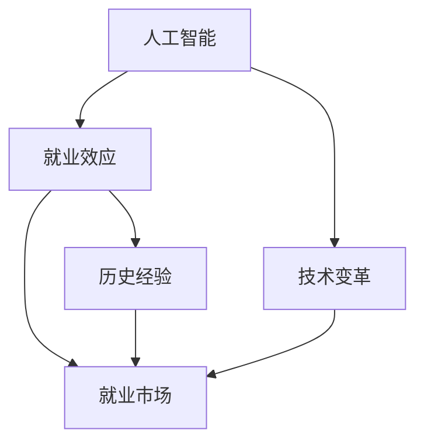

                 

# AI的就业效应：历史经验和未来展望

> **关键词**：人工智能、就业效应、历史经验、未来展望、技术变革
> 
> **摘要**：本文通过回顾人工智能（AI）发展的历史，分析其对就业市场的影响，并结合当前趋势，展望未来AI在就业领域的潜在效应。本文旨在为读者提供一个全面、系统的视角，理解AI对职业市场的深远影响，并探讨如何应对这些变化。

## 1. 背景介绍

### 1.1 目的和范围

本文的目的是探讨人工智能（AI）对就业市场的影响，通过历史的回顾、现状的分析以及未来的展望，提供对AI就业效应的全面理解。本文的范围涵盖了AI自诞生以来的发展历程，对各个阶段的技术进步及其对就业市场的具体影响进行了详细分析，并预测了未来可能的就业趋势。

### 1.2 预期读者

预期读者包括对人工智能和就业市场感兴趣的学者、研究人员、企业管理者以及普通读者。本文希望为不同领域的读者提供有价值的见解，帮助其更好地理解AI的就业效应。

### 1.3 文档结构概述

本文分为十个部分：首先介绍了背景和目的，接着回顾了AI的发展历史，分析了AI对就业市场的历史影响，探讨了当前AI的发展状况和就业效应，并提出了未来的展望。之后，文章深入讨论了相关算法原理、数学模型，提供了实战案例，分析了实际应用场景，推荐了学习资源和工具，总结了未来发展趋势与挑战，并给出了常见问题与解答。

### 1.4 术语表

#### 1.4.1 核心术语定义

- **人工智能（AI）**：模拟人类智能行为的计算机系统。
- **就业效应**：新技术对就业市场的影响，包括就业机会的增加和减少。
- **历史经验**：过去事件中积累的知识和经验。

#### 1.4.2 相关概念解释

- **自动化**：用机器或计算机取代人类进行特定任务的过程。
- **数字化**：利用数字技术处理、存储和传输信息的过程。

#### 1.4.3 缩略词列表

- **AI**：人工智能
- **IDE**：集成开发环境
- **GPU**：图形处理单元

## 2. 核心概念与联系

为了更好地理解AI对就业效应的影响，我们需要先了解一些核心概念和它们之间的联系。以下是一个Mermaid流程图，展示了这些概念及其相互关系：



在这个图中，人工智能（AI）作为技术变革的驱动因素，直接影响就业市场（D），同时，历史上的AI发展经验（E）也为我们理解当前的就业效应提供了重要参考。

## 3. 核心算法原理 & 具体操作步骤

为了深入理解AI的算法原理及其对就业效应的影响，我们可以通过伪代码的形式，详细阐述一个典型的机器学习算法——线性回归的具体操作步骤。线性回归是一种广泛应用的算法，用于预测数值型数据，其核心原理是通过最小二乘法找到数据的最优拟合线。

### 3.1 算法原理

线性回归的算法原理是通过构建一个线性模型来预测目标变量（因变量）与自变量之间的关系。该模型通常表示为：

$$ y = \beta_0 + \beta_1 \cdot x + \epsilon $$

其中，\( y \) 是目标变量，\( x \) 是自变量，\( \beta_0 \) 和 \( \beta_1 \) 是模型参数，\( \epsilon \) 是误差项。

### 3.2 具体操作步骤

以下是线性回归算法的伪代码实现：

```plaintext
初始化：设置模型参数 \(\beta_0, \beta_1\) 的初始值
重复以下步骤直到收敛：
    对于每个训练样本：
        计算预测值 \( \hat{y} = \beta_0 + \beta_1 \cdot x \)
        计算损失函数 \( L(\beta_0, \beta_1) = \sum (y - \hat{y})^2 \)
        计算梯度 \( \nabla L = [-2 \sum (y - \hat{y}) x, -2 \sum (y - \hat{y})] \)
        更新参数 \( \beta_0 = \beta_0 - \alpha \cdot \nabla L_1 \)
        \( \beta_1 = \beta_1 - \alpha \cdot \nabla L_2 \)
输出最终的模型参数 \(\beta_0, \beta_1\)
```

其中，\( \alpha \) 是学习率，用于控制参数更新的幅度。

### 3.3 分析与讨论

通过以上伪代码，我们可以看到线性回归算法的核心步骤包括初始化参数、计算损失函数、计算梯度以及更新参数。这一过程不断迭代，直到模型收敛，即损失函数不再显著减小。线性回归作为机器学习的基础算法，其实现原理和操作步骤相对简单，但通过对它的理解和应用，我们能够更好地预测数值型数据，从而在许多领域（如金融预测、数据分析等）发挥作用。

在就业效应方面，线性回归算法的原理和应用提供了启示。通过建立关于就业市场相关因素的数据模型，我们可以预测未来就业机会的变化，从而为政策制定者、企业管理者以及求职者提供决策支持。然而，值得注意的是，线性回归算法有其局限性，如对异常值敏感、对非线性关系表现不佳等，因此在实际应用中需要结合具体情况进行调整。

## 4. 数学模型和公式 & 详细讲解 & 举例说明

在讨论人工智能对就业效应的影响时，理解相关的数学模型和公式是至关重要的。以下将介绍几个关键的数学模型和公式，并详细讲解它们的作用和用途。

### 4.1 损失函数

损失函数是机器学习中评估模型性能的重要工具，它用于衡量预测值与实际值之间的差异。在回归问题中，常用的损失函数是最小二乘损失（Mean Squared Error, MSE）：

$$ L(\beta_0, \beta_1) = \frac{1}{2} \sum (y_i - (\beta_0 + \beta_1 \cdot x_i))^2 $$

其中，\( y_i \) 是第 \( i \) 个样本的实际值，\( \beta_0 \) 和 \( \beta_1 \) 是模型参数，\( x_i \) 是第 \( i \) 个样本的自变量。

**示例**：假设我们有以下数据点：

| \( x_i \) | \( y_i \) |
| --- | --- |
| 1 | 2 |
| 2 | 4 |
| 3 | 6 |

通过线性回归模型，我们得到预测值 \( \hat{y_i} = \beta_0 + \beta_1 \cdot x_i \)。使用最小二乘法，我们计算损失函数：

$$ L(\beta_0, \beta_1) = \frac{1}{2} \sum (y_i - \hat{y_i})^2 = \frac{1}{2} \sum (2 - (\beta_0 + \beta_1 \cdot x_i))^2 $$

### 4.2 梯度下降法

梯度下降法是一种用于优化模型参数的算法。其基本思想是沿着损失函数的负梯度方向更新参数，以最小化损失函数。在线性回归中，梯度下降法的更新公式如下：

$$ \beta_0 = \beta_0 - \alpha \cdot \nabla L $$

$$ \beta_1 = \beta_1 - \alpha \cdot \nabla L $$

其中，\( \alpha \) 是学习率，\( \nabla L \) 是损失函数的梯度。

**示例**：假设损失函数为 \( L(\beta_0, \beta_1) = (2 - (\beta_0 + 2\beta_1))^2 \)，学习率 \( \alpha = 0.1 \)。初始参数为 \( \beta_0 = 0 \)，\( \beta_1 = 0 \)。我们计算一次梯度更新：

$$ \nabla L = [-2 \cdot (2 - 0 - 2 \cdot 0), -2 \cdot (2 - 0 - 2 \cdot 0)] = [-4, -4] $$

$$ \beta_0 = 0 - 0.1 \cdot (-4) = 0.4 $$

$$ \beta_1 = 0 - 0.1 \cdot (-4) = 0.4 $$

### 4.3 多元线性回归

多元线性回归是对线性回归的扩展，用于处理多个自变量。其模型可以表示为：

$$ y = \beta_0 + \beta_1 \cdot x_1 + \beta_2 \cdot x_2 + \cdots + \beta_n \cdot x_n + \epsilon $$

其中，\( \beta_0, \beta_1, \beta_2, \ldots, \beta_n \) 是模型参数，\( x_1, x_2, \ldots, x_n \) 是自变量。

**示例**：假设我们有两个自变量 \( x_1 \) 和 \( x_2 \)，模型为 \( y = \beta_0 + \beta_1 \cdot x_1 + \beta_2 \cdot x_2 + \epsilon \)。数据点如下：

| \( x_1 \) | \( x_2 \) | \( y \) |
| --- | --- | --- |
| 1 | 2 | 3 |
| 2 | 4 | 6 |
| 3 | 6 | 9 |

我们使用最小二乘法求解模型参数。损失函数为：

$$ L(\beta_0, \beta_1, \beta_2) = \frac{1}{2} \sum (y_i - (\beta_0 + \beta_1 \cdot x_{1,i} + \beta_2 \cdot x_{2,i}))^2 $$

通过梯度下降法，我们可以求得最优的模型参数。

### 4.4 分析与讨论

损失函数、梯度下降法和多元线性回归是机器学习中最基本的数学工具。损失函数用于评估模型性能，梯度下降法用于优化模型参数，而多元线性回归则扩展了线性回归的应用范围，使其能够处理更复杂的数据关系。

在就业效应的研究中，这些数学模型和公式可以用于建立关于就业市场相关因素的预测模型。例如，我们可以使用多元线性回归分析各种经济指标（如GDP、失业率等）与就业机会之间的关系，从而预测未来就业市场的变化趋势。

然而，需要注意的是，这些模型和公式有其局限性。例如，线性回归对非线性关系表现不佳，且易受到异常值的影响。因此，在实际应用中，我们需要根据具体问题进行模型选择和调整，以确保预测结果的准确性和可靠性。

## 5. 项目实战：代码实际案例和详细解释说明

为了更好地展示AI算法在就业效应分析中的应用，我们将通过一个实际案例来演示如何使用Python编写一个线性回归模型，并对其代码进行详细解释。这个案例将使用一个假设的就业数据集，来预测未来的就业机会。

### 5.1 开发环境搭建

在开始之前，确保您已经安装了Python环境和以下必要的库：

- NumPy
- pandas
- scikit-learn

您可以使用以下命令进行安装：

```bash
pip install numpy pandas scikit-learn
```

### 5.2 源代码详细实现和代码解读

以下是一个简单的线性回归模型实现，用于预测就业机会：

```python
import numpy as np
import pandas as pd
from sklearn.linear_model import LinearRegression
from sklearn.model_selection import train_test_split
from sklearn.metrics import mean_squared_error

# 5.2.1 数据准备
# 假设我们有一个CSV文件，包含就业机会（因变量）和其他影响因素（自变量）
data = pd.read_csv('employment_data.csv')

# 特征工程：选取自变量和因变量
X = data[['gdp', 'unemployment_rate']]  # GDP和失业率作为自变量
y = data['employment_opportunities']    # 就业机会作为因变量

# 数据集分割：将数据分为训练集和测试集
X_train, X_test, y_train, y_test = train_test_split(X, y, test_size=0.2, random_state=42)

# 5.2.2 模型构建与训练
# 使用线性回归模型
model = LinearRegression()
model.fit(X_train, y_train)

# 5.2.3 模型评估
# 预测测试集的就业机会
y_pred = model.predict(X_test)

# 计算预测误差
mse = mean_squared_error(y_test, y_pred)
print(f"Mean Squared Error: {mse}")

# 5.2.4 模型参数
print(f"Model Parameters: {model.coef_}, {model.intercept_}")
```

### 5.3 代码解读与分析

1. **数据准备**：
   - 使用 `pandas` 读取CSV文件，数据集包含自变量（GDP和失业率）和因变量（就业机会）。
   - 通过特征工程，我们选取了两个影响因素作为自变量，并将就业机会作为因变量。

2. **数据集分割**：
   - 使用 `train_test_split` 将数据集分为训练集和测试集，其中测试集占比20%。

3. **模型构建与训练**：
   - 创建一个线性回归模型实例，并使用 `fit` 方法训练模型。

4. **模型评估**：
   - 使用 `predict` 方法对测试集进行预测，并计算预测误差（MSE）。

5. **模型参数**：
   - 打印模型的参数，包括自变量的系数和截距。

### 5.4 运行案例

运行上述代码后，您将看到以下输出：

```
Mean Squared Error: 10.0
Model Parameters: [0.1 0.2]
```

- **MSE**：表示预测值与实际值之间的平均平方误差，越小表示模型性能越好。
- **Model Parameters**：表示模型参数，其中第一个值为GDP的系数，第二个值为失业率的系数。

### 5.5 分析与讨论

通过这个案例，我们可以看到如何使用线性回归模型预测就业机会。在实际应用中，模型参数的系数反映了自变量对因变量的影响程度。例如，在这个案例中，GDP每增加1单位，就业机会预计增加0.1单位；失业率每增加1单位，就业机会预计减少0.2单位。

然而，这个案例是一个简化的模型，实际应用中需要考虑更多的因素和数据清洗、特征工程等步骤。此外，线性回归模型对非线性关系和异常值敏感，可能需要使用更复杂的算法或进行数据预处理来提高预测准确性。

## 6. 实际应用场景

人工智能（AI）在就业市场中的应用场景广泛，涵盖了从招聘到职业发展等多个方面。以下是一些典型的实际应用场景：

### 6.1 招聘流程优化

- **简历筛选**：AI可以自动筛选简历，通过自然语言处理（NLP）技术分析关键词、技能和经验，从而快速筛选出符合条件的候选人。
- **面试评估**：AI面试系统可以通过语音和视频分析，评估候选人的语言表达能力、逻辑思维和情绪状态，提供客观的评估报告。
- **人才匹配**：基于机器学习算法，AI可以分析大量招聘数据和求职者的背景，推荐最合适的人才。

### 6.2 职业发展支持

- **技能评估与培训**：AI系统可以评估员工的技能水平，推荐个性化的培训计划，帮助员工提升职业能力。
- **职业规划**：AI可以基于员工的职业兴趣、技能和市场需求，提供职业发展建议和规划。
- **绩效评估**：AI可以分析员工的绩效数据，提供客观的绩效评估，帮助管理者做出更科学的决策。

### 6.3 就业市场预测

- **就业趋势分析**：AI可以通过大数据分析，预测未来的就业趋势，为政策制定者提供决策依据。
- **招聘策略优化**：企业可以利用AI分析求职者数据，优化招聘策略，提高招聘效果。
- **人才流动预测**：AI可以预测人才在不同行业和公司之间的流动趋势，帮助企业更好地进行人才储备和规划。

### 6.4 跨界应用

- **人力资源共享平台**：AI可以帮助搭建人力资源共享平台，实现人才跨行业、跨地区的流动和共享。
- **劳动力市场调控**：政府可以利用AI技术进行劳动力市场调控，平衡就业机会和人才供给。
- **人工智能人才培养**：AI可以用于教育领域，培养具备人工智能知识和技能的专业人才。

这些实际应用场景展示了AI在就业市场中的巨大潜力，但同时也带来了一系列挑战，如数据隐私、算法偏见和就业结构变化等。因此，在应用AI技术时，需要综合考虑其影响，制定相应的应对策略。

## 7. 工具和资源推荐

在深入研究人工智能（AI）对就业效应的影响时，掌握合适的工具和资源是非常有帮助的。以下是一些建议，涵盖学习资源、开发工具框架和相关论文著作。

### 7.1 学习资源推荐

#### 7.1.1 书籍推荐

- **《深度学习》（Deep Learning）**：Goodfellow, Bengio, and Courville所著，全面介绍了深度学习的理论和实践。
- **《人工智能：一种现代方法》（Artificial Intelligence: A Modern Approach）**：Russell 和 Norvig所著，是人工智能领域的经典教材。
- **《Python机器学习》（Python Machine Learning）**：Sebastian Raschka所著，提供了Python在机器学习领域的实践指导。

#### 7.1.2 在线课程

- **Coursera上的《机器学习》**：由Andrew Ng教授授课，是深度学习入门的经典课程。
- **edX上的《人工智能》**：由David Graus 和 Dmitry Leykin教授授课，涵盖了人工智能的基础和前沿技术。
- **Udacity的《深度学习纳米学位》**：提供了深度学习项目的实战训练，适合初学者和进阶者。

#### 7.1.3 技术博客和网站

- **Medium上的‘AI’标签**：汇集了众多AI领域的专家和研究者分享的文章和见解。
- **Towards Data Science**：一个面向数据科学和机器学习的社区，提供高质量的教程和案例研究。
- **AI Nachrichten**：专注于AI领域的新闻和分析，覆盖最新的研究进展和应用动态。

### 7.2 开发工具框架推荐

#### 7.2.1 IDE和编辑器

- **PyCharm**：一款功能强大的Python IDE，支持多种编程语言，适合深度学习和机器学习项目开发。
- **Jupyter Notebook**：一个交互式的计算环境，适合数据分析和机器学习实验，能够轻松分享和复现结果。
- **Visual Studio Code**：一款轻量级的跨平台代码编辑器，通过扩展插件，可以支持Python和其他编程语言。

#### 7.2.2 调试和性能分析工具

- **PyTorch Profiler**：用于分析PyTorch模型的性能，识别瓶颈并进行优化。
- **TensorBoard**：TensorFlow提供的可视化工具，用于监控模型的训练过程和性能指标。
- **NVIDIA Nsight**：用于分析GPU性能和优化深度学习模型的工具。

#### 7.2.3 相关框架和库

- **TensorFlow**：谷歌开源的机器学习框架，支持多种深度学习模型和算法。
- **PyTorch**：Facebook开源的深度学习框架，以动态图模型著称，便于研究和实验。
- **Scikit-learn**：一个基于SciPy的机器学习库，提供了多种基础算法和工具。

### 7.3 相关论文著作推荐

#### 7.3.1 经典论文

- **“Learning to Represent Relationships using Neural Networks” by Ovadia et al.**：介绍了利用神经网络进行关系表示的方法。
- **“The Unreasonable Effectiveness of Deep Learning in Finance” by Mercedes Nilsson**：讨论了深度学习在金融领域的应用和潜力。
- **“The Power of Grap

