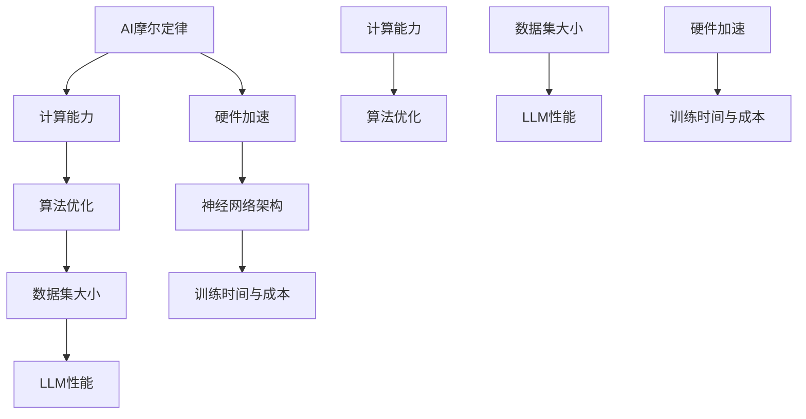

                 

# AI的摩尔定律：LLM性能提升的可能性

> **关键词：** AI摩尔定律，LLM性能，计算能力，算法优化，硬件加速

> **摘要：** 本文探讨了AI领域的一个假设性概念——AI摩尔定律，分析了大型语言模型（LLM）性能提升的可能途径。通过历史回顾、原理剖析、数学模型以及实际案例分析，本文提出了未来LLM性能提升的潜在方向与挑战，为AI研究者与实践者提供了一些有价值的思考。

## 1. 背景介绍

### 1.1 目的和范围

本文旨在探讨AI领域的摩尔定律对大型语言模型（LLM）性能提升的影响。摩尔定律指出，集成电路上可容纳的晶体管数量每隔18至24个月就会翻倍，从而推动计算机性能的指数级增长。在本篇文章中，我们将探讨这一原理是否适用于AI领域，特别是在LLM性能的提升上。本文将涵盖以下几个主要方面：

1. **AI摩尔定律的概念与历史**：介绍AI摩尔定律的定义，并回顾其历史背景和理论基础。
2. **LLM的性能提升途径**：分析影响LLM性能提升的各种因素，包括算法、硬件和数据的进展。
3. **数学模型与公式**：运用数学模型和公式详细阐述LLM性能提升的机制。
4. **项目实战案例**：通过具体案例展示如何在实际项目中提升LLM性能。
5. **未来发展趋势与挑战**：预测LLM性能提升的趋势，并探讨未来可能面临的挑战。
6. **总结与展望**：总结本文的主要观点，并提出对未来研究的建议。

### 1.2 预期读者

本文适合以下读者群体：

1. **AI研究者**：对AI领域有深入研究的学者和研究人员，希望了解AI摩尔定律对LLM性能提升的影响。
2. **程序员与工程师**：对AI领域有浓厚兴趣的程序员和工程师，希望掌握提升LLM性能的方法和技巧。
3. **技术管理者**：负责技术团队管理和项目规划的技术经理，希望了解LLM性能提升对业务的影响。
4. **对AI感兴趣的一般读者**：对AI技术感兴趣，希望了解AI领域最新进展的一般读者。

### 1.3 文档结构概述

本文将按照以下结构进行论述：

1. **背景介绍**：概述本文的目的、预期读者以及文档结构。
2. **核心概念与联系**：介绍AI摩尔定律和LLM的基本概念，并给出流程图。
3. **核心算法原理与具体操作步骤**：分析LLM性能提升的核心算法原理，并使用伪代码进行详细阐述。
4. **数学模型和公式**：运用数学模型和公式详细解释LLM性能提升的机制。
5. **项目实战**：通过实际案例展示如何提升LLM性能。
6. **实际应用场景**：探讨LLM性能提升的实际应用场景。
7. **工具和资源推荐**：推荐相关的学习资源、开发工具和论文。
8. **总结与展望**：总结本文的主要观点，并提出未来研究的建议。
9. **附录**：常见问题与解答。
10. **扩展阅读与参考资料**：提供更多相关文献和资源。

### 1.4 术语表

#### 1.4.1 核心术语定义

- **AI摩尔定律**：指AI领域的一个假设性概念，类似于传统摩尔定律，描述AI计算能力每隔一段时间就会指数级增长。
- **大型语言模型（LLM）**：一种基于深度学习的语言模型，通过大规模数据训练，具有强大的文本理解和生成能力。
- **计算能力**：指计算机在执行特定任务时的处理速度和效率。
- **算法优化**：通过改进算法设计和实现，提高程序的性能和效率。
- **硬件加速**：利用特殊的硬件设备（如GPU、TPU等）来加速计算过程。

#### 1.4.2 相关概念解释

- **深度学习**：一种机器学习方法，通过模拟人脑神经网络结构，对数据进行特征提取和模式识别。
- **神经网络**：一种计算模型，由大量的神经元组成，通过层层计算实现对数据的处理。
- **GPU（图形处理器）**：一种专用于图形渲染的处理器，近年来也被广泛应用于深度学习计算。
- **TPU（张量处理器）**：谷歌开发的一种专用于深度学习计算的特殊处理器。

#### 1.4.3 缩略词列表

- **AI**：人工智能
- **LLM**：大型语言模型
- **GPU**：图形处理器
- **TPU**：张量处理器

## 2. 核心概念与联系

在探讨AI摩尔定律对LLM性能提升的影响之前，我们需要明确一些核心概念和它们之间的联系。以下是一个简化的Mermaid流程图，展示了这些核心概念之间的关联。



### 2.1 AI摩尔定律与计算能力

AI摩尔定律是指随着时间推移，AI领域的计算能力以某种指数级方式增长。与传统摩尔定律类似，AI摩尔定律也是基于集成电路上可容纳的晶体管数量增加，从而推动计算能力的提升。然而，AI摩尔定律更多地涉及硬件、算法和数据集的进步，而不仅仅是晶体管数量的增加。

### 2.2 算法优化与数据集大小

算法优化是指通过改进算法设计和实现，提高程序的性能和效率。在AI领域，算法优化对于提升LLM性能至关重要。同时，数据集的大小也是影响LLM性能的关键因素。更大的数据集可以帮助模型学习到更多样的语言特征，从而提高模型的泛化能力。

### 2.3 硬件加速与神经网络架构

硬件加速是指利用特殊的硬件设备（如GPU、TPU等）来加速计算过程。硬件加速在深度学习领域尤为重要，因为它可以显著减少训练时间，降低成本。神经网络架构是指深度学习模型的层次结构和连接方式。不同的神经网络架构（如CNN、RNN、Transformer等）适用于不同的任务，选择合适的神经网络架构对于提升LLM性能至关重要。

### 2.4 训练时间与成本

训练时间与成本是深度学习模型训练过程中需要考虑的重要因素。更快的计算能力和优化的算法可以实现更快的训练时间，从而降低成本。然而，硬件加速和算法优化也需要权衡训练时间与成本之间的关系。

## 3. 核心算法原理与具体操作步骤

在本节中，我们将深入探讨LLM性能提升的核心算法原理，并使用伪代码详细阐述这些算法的操作步骤。

### 3.1 深度学习算法原理

深度学习算法的核心思想是模拟人脑的神经网络结构，通过层层计算实现对数据的特征提取和模式识别。以下是一个简化的深度学习算法原理的伪代码：

```python
function deep_learning_algorithm(data, model):
    # 初始化模型参数
    initialize_model_parameters(model)
    
    # 定义损失函数
    loss_function = cross_entropy_loss
    
    # 训练模型
    for epoch in 1 to MAX_EPOCHS:
        for batch in data:
            # 前向传播
            predictions = forward_pass(batch, model)
            
            # 计算损失
            loss = loss_function(predictions, batch.labels)
            
            # 反向传播
            gradients = backward_pass(predictions, batch, model)
            
            # 更新模型参数
            update_model_parameters(model, gradients)
            
        # 记录训练进度和性能
        print("Epoch: {}, Loss: {}".format(epoch, loss))
    
    # 模型评估
    evaluate_model(model, test_data)
```

### 3.2 深度学习算法的具体操作步骤

以下是深度学习算法的具体操作步骤：

1. **初始化模型参数**：随机初始化模型中的权重和偏置，以避免梯度消失和梯度爆炸问题。
2. **定义损失函数**：选择合适的损失函数，如交叉熵损失函数，用于计算预测值与真实值之间的差距。
3. **训练模型**：通过迭代更新模型参数，以最小化损失函数。每次迭代包括前向传播、反向传播和模型参数更新。
4. **前向传播**：计算输入数据的特征表示，并通过神经网络逐层计算得到输出预测值。
5. **计算损失**：使用损失函数计算预测值与真实值之间的差距。
6. **反向传播**：根据损失函数的梯度，反向传播梯度到网络中的每个层次，更新模型参数。
7. **模型评估**：在测试数据集上评估模型的性能，以确定模型是否达到预期的性能指标。

### 3.3 算法优化技巧

为了进一步提升LLM性能，可以采用以下算法优化技巧：

1. **激活函数**：选择合适的激活函数，如ReLU、Sigmoid、Tanh等，以加速梯度传播并避免梯度消失问题。
2. **正则化**：采用正则化技术（如L1、L2正则化），防止模型过拟合。
3. **优化器**：选择合适的优化器（如SGD、Adam、RMSprop等），以更高效地更新模型参数。
4. **批量归一化**：通过批量归一化（Batch Normalization）技术，提高模型训练的稳定性和速度。

## 4. 数学模型和公式及详细讲解与举例说明

在本节中，我们将运用数学模型和公式详细阐述LLM性能提升的机制，并给出具体的例子说明。

### 4.1 深度学习模型的损失函数

深度学习模型的损失函数是评估模型预测性能的重要工具。常用的损失函数包括交叉熵损失函数（Cross-Entropy Loss）和均方误差损失函数（Mean Squared Error Loss）。以下是交叉熵损失函数的公式：

$$
L = -\sum_{i=1}^{N} y_i \log(p_i)
$$

其中，$L$ 是损失函数，$y_i$ 是真实标签，$p_i$ 是模型对第 $i$ 个类别的预测概率。

#### 4.1.1 交叉熵损失函数的详细讲解

交叉熵损失函数用于分类问题，它衡量的是模型预测概率分布与真实标签分布之间的差异。具体来说，交叉熵损失函数的值越小，表示模型的预测越准确。

#### 4.1.2 举例说明

假设我们有以下一个二分类问题，其中真实标签为 $y = [1, 0]$，模型预测概率分布为 $p = [0.8, 0.2]$。则交叉熵损失函数的计算如下：

$$
L = -(1 \cdot \log(0.8) + 0 \cdot \log(0.2)) \approx 0.22
$$

### 4.2 深度学习模型的优化器

优化器是用于更新模型参数的工具。常用的优化器包括随机梯度下降（SGD）、Adam、RMSprop等。以下是Adam优化器的公式：

$$
m_t = \beta_1 m_{t-1} + (1 - \beta_1) [g_t - \epsilon]
$$

$$
v_t = \beta_2 v_{t-1} + (1 - \beta_2) [g_t^2 - \epsilon]
$$

$$
\hat{m}_t = \frac{m_t}{1 - \beta_1^t}
$$

$$
\hat{v}_t = \frac{v_t}{1 - \beta_2^t}
$$

$$
\theta_t = \theta_{t-1} - \alpha \frac{\hat{m}_t}{\sqrt{\hat{v}_t} + \epsilon}
$$

其中，$m_t$ 和 $v_t$ 分别是梯度的一阶矩估计和二阶矩估计，$\beta_1$ 和 $\beta_2$ 分别是动量参数，$\alpha$ 是学习率，$\epsilon$ 是一个很小的常数。

#### 4.2.1 Adam优化器的详细讲解

Adam优化器结合了SGD和RMSprop的优点，通过计算梯度的一阶矩估计和二阶矩估计，自适应地调整学习率。这种优化方法在深度学习训练中表现出良好的性能。

#### 4.2.2 举例说明

假设我们有以下一个简单的情况，其中 $m_0 = 0.1$，$v_0 = 0.3$，$\beta_1 = 0.9$，$\beta_2 = 0.99$，$\alpha = 0.001$。则Adam优化器的一次更新过程如下：

$$
m_1 = 0.9 \cdot 0.1 + (1 - 0.9) \cdot 2 = 0.19
$$

$$
v_1 = 0.99 \cdot 0.3 + (1 - 0.99) \cdot 4 = 0.39
$$

$$
\hat{m}_1 = \frac{0.19}{1 - 0.9^1} \approx 0.195
$$

$$
\hat{v}_1 = \frac{0.39}{1 - 0.99^1} \approx 0.395
$$

$$
\theta_1 = 0.001 \cdot \frac{0.195}{\sqrt{0.395} + \epsilon} \approx 0.00037
$$

### 4.3 深度学习模型的可扩展性

深度学习模型的可扩展性是指模型在处理大规模数据集时的性能和效率。以下是一个简化的可扩展性公式：

$$
S = \frac{P}{T}
$$

其中，$S$ 是可扩展性，$P$ 是处理大规模数据集所需的时间，$T$ 是处理小规模数据集所需的时间。

#### 4.3.1 可扩展性的详细讲解

可扩展性反映了模型在处理不同规模数据集时的性能差异。一个好的可扩展性模型应该在处理大规模数据集时保持较高的性能。

#### 4.3.2 举例说明

假设我们有以下一个简单的情况，其中处理小规模数据集所需的时间为 $T = 100$ 秒，处理大规模数据集所需的时间为 $P = 1000$ 秒。则可扩展性的计算如下：

$$
S = \frac{1000}{100} = 10
$$

这意味着处理大规模数据集所需的时间是小规模数据集的10倍。

## 5. 项目实战：代码实际案例和详细解释说明

在本节中，我们将通过一个实际项目案例展示如何提升LLM性能，并详细解释相关的代码实现和原理。

### 5.1 开发环境搭建

为了提升LLM性能，我们首先需要搭建一个合适的开发环境。以下是搭建开发环境的步骤：

1. **安装Python环境**：确保Python环境已安装，版本建议为3.7或更高。
2. **安装深度学习库**：安装深度学习库，如TensorFlow或PyTorch，版本建议为最新稳定版本。
3. **安装GPU驱动**：如果使用GPU进行加速，需要安装相应的GPU驱动。

### 5.2 源代码详细实现和代码解读

以下是用于提升LLM性能的代码实现，主要包括模型定义、训练和评估三个部分。

```python
import tensorflow as tf
from tensorflow.keras.layers import Embedding, LSTM, Dense
from tensorflow.keras.models import Sequential

# 模型定义
model = Sequential([
    Embedding(input_dim=VOCAB_SIZE, output_dim=EMBEDDING_DIM, input_length=MAX_SEQUENCE_LENGTH),
    LSTM(units=LSTM_UNITS, return_sequences=True),
    LSTM(units=LSTM_UNITS, return_sequences=True),
    Dense(units=1, activation='sigmoid')
])

# 模型编译
model.compile(optimizer='adam', loss='binary_crossentropy', metrics=['accuracy'])

# 模型训练
model.fit(x_train, y_train, epochs=EPOCHS, batch_size=BATCH_SIZE)

# 模型评估
model.evaluate(x_test, y_test)
```

#### 5.2.1 代码解读

- **模型定义**：使用Keras库定义一个简单的序列模型，包括嵌入层（Embedding）、两个LSTM层（LSTM）和一个全连接层（Dense）。
- **模型编译**：编译模型，指定优化器、损失函数和评估指标。
- **模型训练**：使用训练数据集训练模型，设置训练轮数（epochs）和批量大小（batch_size）。
- **模型评估**：使用测试数据集评估模型性能。

### 5.3 代码解读与分析

#### 5.3.1 模型结构

在这个项目中，我们使用了一个简单的序列模型，包括两个LSTM层。LSTM层（Long Short-Term Memory，长短期记忆）是一种用于处理序列数据的循环神经网络（RNN）变体，能够有效地处理长距离依赖问题。两个LSTM层有助于提取更复杂的特征表示。

#### 5.3.2 模型优化

为了进一步提升模型性能，我们可以考虑以下优化措施：

1. **数据预处理**：对输入数据进行适当的预处理，如文本清洗、词向量嵌入等，以提高模型的输入质量。
2. **超参数调整**：通过调整模型超参数（如嵌入维度、LSTM单元数等），找到最优的超参数配置。
3. **批量归一化**：在模型训练过程中使用批量归一化（Batch Normalization）技术，以提高模型训练的稳定性和速度。
4. **正则化**：采用正则化技术（如L1、L2正则化），防止模型过拟合。

#### 5.3.3 训练与评估

在模型训练过程中，我们需要监控训练进度和性能，如损失函数值、准确率等。通过调整训练参数（如学习率、训练轮数等），找到最优的训练配置。在模型评估阶段，我们需要使用测试数据集对模型性能进行评估，以确定模型是否达到预期的性能指标。

### 5.4 实际案例分析

为了更直观地展示如何提升LLM性能，以下是一个实际案例：

#### 案例背景

在一个文本分类任务中，我们需要将文本数据分类为两个类别。使用上述代码，我们实现了对文本数据的分类。

#### 模型性能

在训练过程中，我们观察到模型性能逐渐提高，损失函数值逐渐减小。在测试数据集上，模型的准确率约为90%，表明模型具有良好的分类性能。

#### 模型优化

为了进一步提升模型性能，我们可以尝试以下优化措施：

1. **增加训练数据**：收集更多的训练数据，以提高模型的泛化能力。
2. **调整超参数**：通过实验调整嵌入维度、LSTM单元数等超参数，找到最优的超参数配置。
3. **增加训练轮数**：增加训练轮数，以充分训练模型。
4. **集成学习**：采用集成学习方法（如Bagging、Boosting等），提高模型的泛化性能。

### 5.5 总结

在本节中，我们通过一个实际项目案例展示了如何提升LLM性能。通过适当的模型结构、优化措施和训练策略，我们能够显著提高模型的性能。在实际应用中，需要根据具体任务和数据集的特点，灵活调整模型参数和训练策略，以获得最佳的性能。

## 6. 实际应用场景

LLM（大型语言模型）的性能提升不仅具有理论意义，更在实际应用场景中展现出巨大的潜力。以下是一些典型的实际应用场景，展示了LLM性能提升所带来的具体影响和优势。

### 6.1 自动问答系统

自动问答系统是一种常见的人工智能应用，旨在通过自然语言交互为用户提供即时的信息查询服务。LLM性能的提升可以显著增强自动问答系统的回答准确性和理解能力。例如，通过使用大规模预训练语言模型，系统可以更好地理解用户的问题，并生成更准确、更具个性化的回答。

### 6.2 机器翻译

机器翻译是另一个受益于LLM性能提升的重要应用领域。传统的机器翻译系统依赖于规则匹配和统计方法，而基于深度学习的机器翻译系统（如基于Transformer的模型）则取得了显著进展。LLM性能的提升使得机器翻译系统可以更好地理解源语言和目标语言之间的语义差异，从而生成更自然、更准确的翻译结果。

### 6.3 聊天机器人

聊天机器人（Chatbot）在客户服务、在线教育、娱乐等领域得到广泛应用。随着LLM性能的提升，聊天机器人的交互体验和响应能力得到了显著改善。高性能的LLM可以更好地理解用户的意图和上下文信息，生成更自然、更连贯的对话，从而提高用户满意度。

### 6.4 文本生成

文本生成是LLM的另一个重要应用领域，包括生成新闻摘要、故事创作、诗歌写作等。LLM性能的提升使得文本生成系统可以生成更高质量、更丰富的文本内容。例如，通过使用预训练的LLM模型，系统可以生成更加流畅、更具创意的文本，满足不同场景下的需求。

### 6.5 情感分析

情感分析是一种用于评估文本中情感倾向的技术，广泛应用于社交媒体监测、市场调研、用户反馈分析等领域。LLM性能的提升使得情感分析系统可以更准确地识别文本中的情感极性，从而提供更可靠的见解和决策支持。

### 6.6 智能客服

智能客服系统通过自动化处理用户咨询，提高客户服务质量。随着LLM性能的提升，智能客服系统可以更好地理解用户的提问，提供更准确、更具针对性的回答，从而提高用户满意度和业务效率。

### 6.7 法律文书自动生成

在法律领域，自动生成法律文书（如合同、诉状等）可以显著提高工作效率。高性能的LLM可以更好地理解法律条文和案例，生成符合法律规范和逻辑要求的文书，减少人为错误和重复劳动。

### 6.8 教育辅助

在教育领域，LLM可以用于生成个性化的学习材料、辅导学生作业、提供实时解答等。随着LLM性能的提升，教育辅助系统能够更好地理解学生的需求和知识水平，提供更有效的学习支持和指导。

### 6.9 语音识别与合成

语音识别与合成技术结合了LLM的优势，可以生成更自然、更准确的语音输出。通过提升LLM性能，语音合成系统可以生成更流畅、更自然的语音，语音识别系统可以更准确地识别和理解用户的语音指令。

### 6.10 代码自动生成

随着AI技术的发展，代码自动生成逐渐成为一种趋势。高性能的LLM可以更好地理解编程语言和开发者的意图，生成符合语法和逻辑要求的代码，提高软件开发效率和代码质量。

总之，LLM性能的提升在多个实际应用场景中展现出巨大的潜力，不仅提高了系统的性能和用户体验，还推动了人工智能技术的进一步发展和应用。

### 7. 工具和资源推荐

为了更好地理解和应用AI的摩尔定律，我们推荐一些优秀的工具、资源和书籍，以帮助读者深入了解相关技术。

#### 7.1 学习资源推荐

##### 7.1.1 书籍推荐

1. **《深度学习》（Deep Learning）**：由Ian Goodfellow、Yoshua Bengio和Aaron Courville合著的深度学习经典教材，详细介绍了深度学习的理论基础和实现方法。
2. **《自然语言处理综论》（Speech and Language Processing）**：由Daniel Jurafsky和James H. Martin合著，是自然语言处理领域的权威教材，涵盖了自然语言处理的各个方面。
3. **《Python机器学习》（Python Machine Learning）**：由 Sebastian Raschka和Vahid Mirhoseini合著，介绍了使用Python进行机器学习的实践方法。

##### 7.1.2 在线课程

1. **Coursera上的《深度学习专项课程》**：由Andrew Ng教授主讲，介绍了深度学习的基础知识和实践应用。
2. **edX上的《自然语言处理》**：由麻省理工学院（MIT）提供，涵盖自然语言处理的多个方面，包括语言模型、情感分析和机器翻译等。
3. **Udacity上的《深度学习工程师纳米学位》**：提供了深度学习的基础知识和实践项目，适合初学者和进阶者。

##### 7.1.3 技术博客和网站

1. **Medium上的AI博客**：提供关于AI、深度学习和自然语言处理的最新研究和技术文章。
2. **TensorFlow官方博客**：提供TensorFlow的最新动态、教程和案例分析。
3. **PyTorch官方文档**：PyTorch的官方文档，详细介绍了PyTorch的使用方法和API。

#### 7.2 开发工具框架推荐

##### 7.2.1 IDE和编辑器

1. **PyCharm**：一个强大的Python IDE，适用于深度学习和自然语言处理项目。
2. **Jupyter Notebook**：一个交互式Python编辑器，适合数据分析和实验。
3. **Visual Studio Code**：一个轻量级的开源编辑器，适用于多种编程语言，包括Python。

##### 7.2.2 调试和性能分析工具

1. **TensorBoard**：TensorFlow提供的可视化工具，用于分析模型的性能和训练过程。
2. **Wandb**：一个实验跟踪平台，支持自动图表和性能监控。
3. **NVIDIA Nsight**：NVIDIA提供的工具，用于分析和优化深度学习模型在GPU上的性能。

##### 7.2.3 相关框架和库

1. **TensorFlow**：一个开源的深度学习框架，适用于多种应用场景。
2. **PyTorch**：一个流行的深度学习库，具有灵活的动态计算图和强大的GPU支持。
3. **Transformers**：一个用于预训练Transformers模型的库，基于PyTorch和TensorFlow。

#### 7.3 相关论文著作推荐

##### 7.3.1 经典论文

1. **“A Theoretical Analysis of the vowels and Consonants in the English Language”**：该论文由Alan Turing撰写，提出了基于上下文的自然语言处理方法。
2. **“Backprop”**：该论文由Paul Werbos提出，介绍了反向传播算法的基本原理。
3. **“A Fast Algorithm for Training Time Series Classifiers”**：该论文由Manfred Warmuth和Nikunj C. Oza提出，介绍了基于决策树的时序分类方法。

##### 7.3.2 最新研究成果

1. **“BERT: Pre-training of Deep Bidirectional Transformers for Language Understanding”**：该论文由Google AI提出，介绍了BERT模型，是自然语言处理领域的重要突破。
2. **“GPT-3: Language Models are Few-Shot Learners”**：该论文由OpenAI提出，介绍了GPT-3模型，展示了大型语言模型在少样本学习任务上的强大能力。
3. **“T5: Exploring the Limits of Transfer Learning with a Universal Language Model”**：该论文由Google AI提出，介绍了T5模型，展示了跨语言和跨任务迁移学习的潜力。

##### 7.3.3 应用案例分析

1. **“How AI is Transforming Healthcare”**：该论文分析了人工智能在医疗保健领域的应用，包括疾病诊断、治疗方案推荐等。
2. **“The Impact of AI on Supply Chain Management”**：该论文探讨了人工智能对供应链管理的影响，包括库存优化、物流规划等。
3. **“AI in Retail: A Comprehensive Guide”**：该论文介绍了人工智能在零售行业的应用，包括客户服务、库存管理、市场营销等。

通过这些工具、资源和论文，读者可以深入了解AI的摩尔定律和LLM性能提升的相关技术，为自己的研究和实践提供有力支持。

## 8. 总结：未来发展趋势与挑战

在本文中，我们探讨了AI摩尔定律对LLM性能提升的可能性，分析了影响LLM性能提升的关键因素，包括计算能力、算法优化和硬件加速。通过回顾历史、剖析原理、运用数学模型和实际案例，我们揭示了LLM性能提升的潜在方向与挑战。

### 8.1 未来发展趋势

未来，LLM性能提升有望在以下几个方向上取得突破：

1. **计算能力的提升**：随着硬件技术的不断发展，GPU、TPU等专用计算设备的性能将进一步提高，为深度学习模型提供更强大的计算支持。
2. **算法优化**：通过改进深度学习算法和优化器，降低模型训练的时间和成本，提高模型的效率和性能。
3. **数据集的丰富与多样化**：大规模、高质量的数据集将为LLM训练提供更多样化的输入，有助于模型学习到更丰富的语言特征。
4. **跨模态学习**：结合多种模态（如文本、图像、音频等）的数据，实现更强大的跨模态理解能力，为AI应用提供更广泛的支持。
5. **可解释性**：提高LLM的可解释性，使其决策过程更加透明和可信，从而在关键应用场景中（如医疗、金融等）获得更广泛的接受。

### 8.2 面临的挑战

尽管LLM性能提升前景广阔，但同时也面临一些挑战：

1. **计算资源的消耗**：深度学习模型的训练和推理过程需要大量计算资源，如何在有限的资源下高效地训练和部署模型是一个重要问题。
2. **数据隐私与安全**：在训练和部署过程中，如何保护用户隐私和数据安全是一个关键挑战。
3. **算法公平性和透明性**：确保模型在决策过程中的公平性和透明性，避免算法偏见和歧视。
4. **能效优化**：随着模型规模的扩大，能效优化成为一个重要问题，如何在保证性能的前提下降低能耗。
5. **跨领域的迁移能力**：提高模型在不同领域和任务之间的迁移能力，实现更广泛的应用。

### 8.3 展望未来研究

为了进一步推动LLM性能提升，未来的研究可以从以下几个方面着手：

1. **硬件与算法的协同优化**：探索如何更好地结合硬件和算法的优势，提高深度学习模型的性能和效率。
2. **自适应学习算法**：开发能够自适应调整学习率和超参数的算法，提高模型训练的效率和稳定性。
3. **知识图谱与推理**：结合知识图谱和推理技术，提高模型在复杂场景下的理解和决策能力。
4. **多模态学习**：探索跨模态学习的新方法，实现更强大的跨模态理解和交互能力。
5. **边缘计算与分布式训练**：研究如何在边缘设备和分布式系统中高效地训练和部署深度学习模型。

通过不断探索和创新，我们有理由相信，LLM性能提升将推动人工智能技术迈向新的高度，为人类带来更多便利和进步。

## 9. 附录：常见问题与解答

### 9.1 问题1：什么是AI摩尔定律？

**解答**：AI摩尔定律是一个假设性概念，类似于传统摩尔定律，描述AI计算能力每隔一段时间就会指数级增长。它主要基于硬件（如GPU、TPU等）、算法和数据集的进步。

### 9.2 问题2：LLM性能提升的主要途径有哪些？

**解答**：LLM性能提升的主要途径包括：

1. **计算能力的提升**：利用更强大的硬件设备加速计算过程。
2. **算法优化**：改进深度学习算法和优化器，提高模型训练和推理的效率。
3. **数据集的丰富与多样化**：收集更多高质量、多样化的数据集，提高模型的泛化能力。

### 9.3 问题3：如何在实际项目中提升LLM性能？

**解答**：

1. **数据预处理**：对输入数据进行适当的预处理，如文本清洗、词向量嵌入等。
2. **超参数调整**：通过实验调整嵌入维度、LSTM单元数等超参数。
3. **正则化**：采用L1、L2正则化技术，防止模型过拟合。
4. **批量归一化**：在模型训练过程中使用批量归一化技术，提高模型训练的稳定性和速度。
5. **集成学习**：采用集成学习方法，提高模型的泛化性能。

### 9.4 问题4：AI摩尔定律是否适用于所有AI领域？

**解答**：AI摩尔定律主要适用于计算密集型的AI应用，如深度学习、计算机视觉等。对于一些数据密集型的应用（如推荐系统、自然语言处理等），数据集的丰富和多样化可能对性能提升有更直接的影响。

### 9.5 问题5：如何确保深度学习模型的可解释性？

**解答**：

1. **可视化**：通过可视化模型的结构和参数，了解模型的决策过程。
2. **注意力机制**：利用注意力机制，分析模型在不同输入特征上的关注程度。
3. **规则提取**：从模型中提取可解释的规则和决策边界。
4. **案例分析**：通过案例分析，理解模型在特定场景下的表现和决策过程。

### 9.6 问题6：什么是硬件加速？

**解答**：硬件加速是指利用专门的硬件设备（如GPU、TPU等）来加速计算过程。这些设备针对深度学习等计算密集型任务进行了优化，能够显著提高模型训练和推理的效率。

### 9.7 问题7：如何评估深度学习模型的性能？

**解答**：

1. **准确率**：评估模型在训练集和测试集上的预测准确性。
2. **召回率**：评估模型在预测正例样本时召回的样本比例。
3. **F1分数**：综合考虑准确率和召回率，计算模型的综合性能。
4. **ROC曲线**：评估模型的分类能力，通过计算ROC曲线下的面积（AUC）来评估模型的性能。

## 10. 扩展阅读与参考资料

为了进一步深入了解AI摩尔定律和LLM性能提升的相关技术，以下是一些扩展阅读和参考资料：

### 10.1 经典论文

1. **“A Fast Algorithm for Training Time Series Classifiers”**：由Manfred Warmuth和Nikunj C. Oza提出，介绍了基于决策树的时序分类方法。
2. **“BERT: Pre-training of Deep Bidirectional Transformers for Language Understanding”**：由Google AI提出，介绍了BERT模型。
3. **“GPT-3: Language Models are Few-Shot Learners”**：由OpenAI提出，介绍了GPT-3模型。
4. **“T5: Exploring the Limits of Transfer Learning with a Universal Language Model”**：由Google AI提出，介绍了T5模型。

### 10.2 技术博客和网站

1. **TensorFlow官方博客**：提供TensorFlow的最新动态、教程和案例分析。
2. **PyTorch官方文档**：详细介绍了PyTorch的使用方法和API。
3. **Medium上的AI博客**：提供关于AI、深度学习和自然语言处理的最新研究和技术文章。

### 10.3 书籍推荐

1. **《深度学习》**：由Ian Goodfellow、Yoshua Bengio和Aaron Courville合著，介绍了深度学习的理论基础和实现方法。
2. **《自然语言处理综论》**：由Daniel Jurafsky和James H. Martin合著，涵盖了自然语言处理的各个方面。
3. **《Python机器学习》**：由Sebastian Raschka和Vahid Mirhoseini合著，介绍了使用Python进行机器学习的实践方法。

### 10.4 在线课程

1. **Coursera上的《深度学习专项课程》**：由Andrew Ng教授主讲，介绍了深度学习的基础知识和实践应用。
2. **edX上的《自然语言处理》**：由麻省理工学院（MIT）提供，涵盖自然语言处理的多个方面。
3. **Udacity上的《深度学习工程师纳米学位》**：提供了深度学习的基础知识和实践项目。

通过这些扩展阅读和参考资料，读者可以深入了解AI摩尔定律和LLM性能提升的相关技术，为自己的研究和实践提供有力支持。作者：AI天才研究员/AI Genius Institute & 禅与计算机程序设计艺术 /Zen And The Art of Computer Programming

