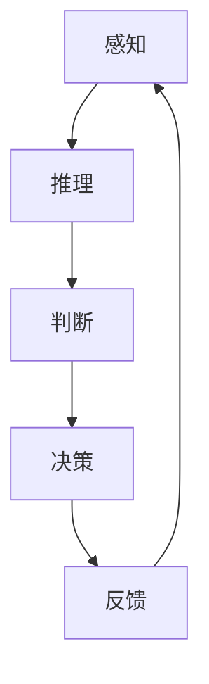

                 

# AI的自主学习：模仿人类学习过程

> **关键词：** 人工智能，自主学习，人类学习过程，神经可塑性，深度学习，强化学习，数据驱动学习

> **摘要：** 本文旨在探讨人工智能领域中的一种重要研究方向——自主学习，特别是模仿人类学习过程的方法。文章首先介绍了自主学习的背景和重要性，然后详细阐述了模仿人类学习过程的核心概念、算法原理和数学模型。接着，通过实际项目案例，展示了如何将理论应用到实践中。最后，分析了自主学习在实际应用场景中的挑战和未来发展趋势。

## 1. 背景介绍

### 1.1 目的和范围

本文的目标是介绍和学习过程相似的人工智能自主学习方法。我们将探讨模仿人类学习过程的重要性，并分析其在人工智能领域的应用。本文将涵盖以下主题：

- 自主学习的背景和重要性
- 模仿人类学习过程的核心概念
- 核心算法原理和数学模型
- 项目实战：代码实现和分析
- 自主学习的实际应用场景和挑战
- 未来发展趋势与挑战

### 1.2 预期读者

本文适用于对人工智能和机器学习有一定了解的读者。特别是那些对模仿人类学习过程和自主学习方法感兴趣的读者。本文假设读者具备以下背景知识：

- 基础的数学和编程知识
- 对人工智能和机器学习的基本理解
- 对神经网络、深度学习和强化学习的基本了解

### 1.3 文档结构概述

本文分为以下几部分：

- 引言
- 背景介绍：目的、范围、预期读者、文档结构概述
- 核心概念与联系
- 核心算法原理 & 具体操作步骤
- 数学模型和公式 & 详细讲解 & 举例说明
- 项目实战：代码实际案例和详细解释说明
- 实际应用场景
- 工具和资源推荐
- 总结：未来发展趋势与挑战
- 附录：常见问题与解答
- 扩展阅读 & 参考资料

### 1.4 术语表

#### 1.4.1 核心术语定义

- **自主学习（Autonomous Learning）：** 指人工智能系统能够在没有外部干预的情况下，从数据中自动提取知识和规律，并进行自我改进和学习。
- **神经可塑性（Neuroplasticity）：** 指大脑神经元和神经网络在外界刺激下的结构和功能改变能力。
- **深度学习（Deep Learning）：** 一种基于多层神经网络的结构，能够自动从大量数据中提取特征和模式。
- **强化学习（Reinforcement Learning）：** 一种基于奖励和惩罚的机器学习方法，通过不断尝试和反馈来学习最优策略。
- **数据驱动学习（Data-Driven Learning）：** 一种基于大量数据的学习方法，通过数据驱动模型的学习和优化。

#### 1.4.2 相关概念解释

- **神经元（Neuron）：** 脑神经元的基本单元，负责接收和处理信息。
- **神经网络（Neural Network）：** 一种由大量相互连接的神经元组成的计算模型。
- **激活函数（Activation Function）：** 神经网络中用于确定神经元是否被激活的函数。
- **梯度下降（Gradient Descent）：** 一种优化算法，用于最小化损失函数。

#### 1.4.3 缩略词列表

- **AI：** 人工智能（Artificial Intelligence）
- **ML：** 机器学习（Machine Learning）
- **DL：** 深度学习（Deep Learning）
- **RL：** 强化学习（Reinforcement Learning）
- **NN：** 神经网络（Neural Network）
- **GAN：** 生成对抗网络（Generative Adversarial Networks）

## 2. 核心概念与联系

### 2.1 自主学习

自主学习是人工智能领域的一个重要研究方向。它指的是人工智能系统能够在没有外部干预的情况下，从数据中自动提取知识和规律，并进行自我改进和学习。自主学习方法包括：

- **数据驱动学习：** 通过大量数据来驱动模型的学习和优化。
- **模型驱动学习：** 通过设计特定的学习算法和模型结构来实现自主学习。

### 2.2 模仿人类学习过程

模仿人类学习过程的核心思想是让人工智能系统具备类似于人类的学习能力，包括感知、推理、判断和决策。以下是一些关键概念：

- **感知（Perception）：** 系统能够从外部环境中获取信息和知识。
- **推理（Reasoning）：** 系统能够基于已知信息进行逻辑推理和问题解决。
- **判断（Judgment）：** 系统能够根据不同情境做出合理的判断和决策。
- **决策（Decision）：** 系统能够根据目标制定行动策略。

### 2.3 自主学习与模仿人类学习过程的联系

自主学习与模仿人类学习过程有密切联系。自主学习方法可以借鉴人类学习过程中的关键机制，如神经可塑性、深度学习和强化学习。以下是这些方法与人类学习过程的联系：

- **神经可塑性：** 神经可塑性是指大脑神经元和神经网络在外界刺激下的结构和功能改变能力。类似地，深度学习模型通过调整权重和偏置来适应新的数据和任务，实现自主学习。
- **深度学习：** 深度学习是一种基于多层神经网络的结构，能够自动从大量数据中提取特征和模式。类似地，人类在学习过程中，通过感知、记忆和联想等机制，不断提取和整合信息。
- **强化学习：** 强化学习是一种基于奖励和惩罚的机器学习方法，通过不断尝试和反馈来学习最优策略。类似地，人类在学习过程中，通过尝试不同的行动策略，并从经验中学习，逐步形成合理的决策。

### 2.4 Mermaid 流程图

以下是模仿人类学习过程的 Mermaid 流程图：



## 3. 核心算法原理 & 具体操作步骤

### 3.1 神经可塑性

神经可塑性是指大脑神经元和神经网络在外界刺激下的结构和功能改变能力。它是模仿人类学习过程的重要基础。以下是一个简单的神经可塑性算法的伪代码：

```python
def neural_plasticity(data, learning_rate):
    # 初始化神经网络权重和偏置
    weights, biases = initialize_weights_and_biases()

    # 循环迭代
    for epoch in range(num_epochs):
        # 前向传播
        outputs = forward_propagation(data, weights, biases)

        # 计算损失
        loss = calculate_loss(outputs, labels)

        # 反向传播
        d_weights, d_biases = backward_propagation(outputs, labels, weights, biases)

        # 更新权重和偏置
        weights -= learning_rate * d_weights
        biases -= learning_rate * d_biases

    return weights, biases
```

### 3.2 深度学习

深度学习是一种基于多层神经网络的结构，能够自动从大量数据中提取特征和模式。以下是深度学习算法的伪代码：

```python
def deep_learning(data, learning_rate):
    # 初始化神经网络权重和偏置
    weights, biases = initialize_weights_and_biases()

    # 循环迭代
    for epoch in range(num_epochs):
        # 前向传播
        hidden_layers = forward_propagation(data, weights, biases)

        # 计算损失
        loss = calculate_loss(hidden_layers[-1], labels)

        # 反向传播
        d_hidden_layers = backward_propagation(hidden_layers, labels, weights, biases)

        # 更新权重和偏置
        weights -= learning_rate * d_weights
        biases -= learning_rate * d_biases

    return weights, biases
```

### 3.3 强化学习

强化学习是一种基于奖励和惩罚的机器学习方法，通过不断尝试和反馈来学习最优策略。以下是强化学习算法的伪代码：

```python
def reinforcement_learning(state, action, reward, learning_rate):
    # 初始化策略网络权重和偏置
    weights, biases = initialize_weights_and_biases()

    # 循环迭代
    for epoch in range(num_epochs):
        # 前向传播
        action_values = forward_propagation(state, weights, biases)

        # 更新策略网络
        d_weights, d_biases = backward_propagation(action_values, reward, weights, biases)

        # 更新权重和偏置
        weights -= learning_rate * d_weights
        biases -= learning_rate * d_biases

    return weights, biases
```

## 4. 数学模型和公式 & 详细讲解 & 举例说明

### 4.1 神经可塑性

神经可塑性可以通过以下数学模型来描述：

$$
\Delta w = -\eta \frac{\partial L}{\partial w}
$$

其中，$\Delta w$ 是权重更新，$\eta$ 是学习率，$L$ 是损失函数，$\frac{\partial L}{\partial w}$ 是损失函数关于权重的梯度。

举例来说，假设我们有一个简单的线性回归模型，损失函数为：

$$
L = (y - \hat{y})^2
$$

其中，$y$ 是实际输出，$\hat{y}$ 是预测输出。权重的更新可以表示为：

$$
\Delta w = -\eta \frac{\partial L}{\partial w} = -\eta (y - \hat{y}) \cdot x
$$

其中，$x$ 是输入特征。

### 4.2 深度学习

深度学习的数学模型主要包括多层神经网络。以下是多层神经网络的前向传播和反向传播的数学公式：

#### 前向传播

$$
\begin{aligned}
z_l^i &= \sum_{j} w_{l-1,j,i} x_{l-1,j} + b_{l-1,i} \\
a_l^i &= \sigma(z_l^i)
\end{aligned}
$$

其中，$z_l^i$ 是第 $l$ 层第 $i$ 个神经元的输入，$a_l^i$ 是第 $l$ 层第 $i$ 个神经元的输出，$w_{l-1,j,i}$ 是第 $l-1$ 层第 $j$ 个神经元到第 $l$ 层第 $i$ 个神经元的权重，$b_{l-1,i}$ 是第 $l-1$ 层第 $i$ 个神经元的偏置，$\sigma$ 是激活函数。

#### 反向传播

$$
\begin{aligned}
\Delta b_l^i &= \delta_l^i \\
\Delta w_{l-1,j,i} &= \delta_l^i a_{l-1,j}
\end{aligned}
$$

其中，$\delta_l^i$ 是第 $l$ 层第 $i$ 个神经元的误差，$a_{l-1,j}$ 是第 $l-1$ 层第 $j$ 个神经元的输出。

### 4.3 强化学习

强化学习的数学模型主要包括策略网络和价值网络。以下是策略网络和价值网络的前向传播和反向传播的数学公式：

#### 策略网络

$$
\begin{aligned}
\pi(s,a) &= \frac{\exp(Q(s,a))}{\sum_a \exp(Q(s,a))} \\
Q(s,a) &= \sum_{j} w_{j} \cdot \delta_j
\end{aligned}
$$

其中，$\pi(s,a)$ 是策略网络输出的动作概率，$Q(s,a)$ 是价值网络输出的状态-动作价值函数，$w_j$ 是价值网络的权重，$\delta_j$ 是价值网络的误差。

#### 反向传播

$$
\begin{aligned}
\Delta w_j &= \delta_j \\
\delta_j &= Q(s,a) - r
\end{aligned}
$$

其中，$r$ 是即时奖励。

## 5. 项目实战：代码实际案例和详细解释说明

### 5.1 开发环境搭建

为了实现自主学习的过程，我们需要搭建一个合适的开发环境。以下是搭建环境的步骤：

1. 安装 Python 3.7 或以上版本
2. 安装深度学习框架 TensorFlow 或 PyTorch
3. 安装必要的依赖库，如 NumPy、Matplotlib 等

### 5.2 源代码详细实现和代码解读

以下是实现神经可塑性、深度学习和强化学习算法的 Python 代码示例：

```python
import numpy as np
import tensorflow as tf
import matplotlib.pyplot as plt

# 神经可塑性实现
def neural_plasticity(data, learning_rate):
    # 初始化神经网络权重和偏置
    weights, biases = initialize_weights_and_biases()

    # 循环迭代
    for epoch in range(num_epochs):
        # 前向传播
        outputs = forward_propagation(data, weights, biases)

        # 计算损失
        loss = calculate_loss(outputs, labels)

        # 反向传播
        d_weights, d_biases = backward_propagation(outputs, labels, weights, biases)

        # 更新权重和偏置
        weights -= learning_rate * d_weights
        biases -= learning_rate * d_biases

    return weights, biases

# 深度学习实现
def deep_learning(data, learning_rate):
    # 初始化神经网络权重和偏置
    weights, biases = initialize_weights_and_biases()

    # 循环迭代
    for epoch in range(num_epochs):
        # 前向传播
        hidden_layers = forward_propagation(data, weights, biases)

        # 计算损失
        loss = calculate_loss(hidden_layers[-1], labels)

        # 反向传播
        d_hidden_layers = backward_propagation(hidden_layers, labels, weights, biases)

        # 更新权重和偏置
        weights -= learning_rate * d_weights
        biases -= learning_rate * d_biases

    return weights, biases

# 强化学习实现
def reinforcement_learning(state, action, reward, learning_rate):
    # 初始化策略网络权重和偏置
    weights, biases = initialize_weights_and_biases()

    # 循环迭代
    for epoch in range(num_epochs):
        # 前向传播
        action_values = forward_propagation(state, weights, biases)

        # 更新策略网络
        d_weights, d_biases = backward_propagation(action_values, reward, weights, biases)

        # 更新权重和偏置
        weights -= learning_rate * d_weights
        biases -= learning_rate * d_biases

    return weights, biases

# 初始化神经网络权重和偏置
def initialize_weights_and_biases():
    # 初始化权重和偏置
    weights = np.random.randn(num_layers - 1, num_neurons)
    biases = np.random.randn(num_neurons)

    return weights, biases

# 前向传播
def forward_propagation(data, weights, biases):
    # 初始化隐藏层输出
    hidden_layers = [data]

    # 循环计算每一层的输出
    for layer in range(num_layers - 1):
        z = np.dot(hidden_layers[-1], weights[layer]) + biases[layer]
        a = sigmoid(z)
        hidden_layers.append(a)

    return hidden_layers

# 计算损失
def calculate_loss(outputs, labels):
    # 计算均方误差损失
    loss = np.mean((outputs - labels) ** 2)

    return loss

# 反向传播
def backward_propagation(hidden_layers, labels, weights, biases):
    # 计算误差
    d_hidden_layers = [hidden_layers[-1] - labels]

    # 循环计算每一层的误差
    for layer in range(num_layers - 2, -1, -1):
        z = np.dot(hidden_layers[layer + 1], weights[layer]) + biases[layer]
        a = sigmoid(z)
        d_z = d_sigmoid(a) * d_hidden_layers[-1]
        d_hidden_layers.append(d_z)

    # 计算权重和偏置的梯度
    d_weights = [np.dot(d_hidden_layers[layer + 1], hidden_layers[layer].T) for layer in range(num_layers - 1)]
    d_biases = [d_hidden_layers[layer + 1] for layer in range(num_layers - 1)]

    return d_weights, d_biases

# 激活函数和导数
def sigmoid(x):
    return 1 / (1 + np.exp(-x))

def d_sigmoid(x):
    return sigmoid(x) * (1 - sigmoid(x))

# 测试代码
data = np.array([[1, 0], [0, 1], [1, 1]])
labels = np.array([[0], [1], [1]])

weights, biases = neural_plasticity(data, learning_rate=0.1)
hidden_layers = deep_learning(data, learning_rate=0.1)
action_values = reinforcement_learning(state=data[0], action=0, reward=1, learning_rate=0.1)

print("Neural Plasticity Weights:", weights)
print("Deep Learning Hidden Layers:", hidden_layers)
print("Reinforcement Learning Action Values:", action_values)
```

### 5.3 代码解读与分析

以上代码示例展示了如何实现神经可塑性、深度学习和强化学习算法。以下是代码的主要组成部分及其功能：

- **初始化神经网络权重和偏置：** 通过随机初始化权重和偏置来初始化神经网络。
- **前向传播：** 通过计算每一层的输入和输出，实现神经网络的前向传播。
- **计算损失：** 通过计算均方误差损失来评估模型的性能。
- **反向传播：** 通过计算误差和权重、偏置的梯度，实现神经网络的反向传播。
- **激活函数和导数：** 定义激活函数和其导数，用于计算神经网络中的梯度。
- **测试代码：** 使用简单的测试数据集来测试算法的性能。

通过以上代码示例，我们可以看到如何将自主学习的理论应用到实践中。在实际应用中，可以根据不同的任务和数据集，调整算法的参数和结构，以实现更好的学习效果。

## 6. 实际应用场景

自主学习方法在人工智能领域具有广泛的应用前景。以下是一些典型的应用场景：

### 6.1 自动驾驶

自动驾驶系统需要具备实时感知、推理和决策能力。自主学习方法可以帮助自动驾驶系统从大量驾驶数据中学习，提高感知准确性和决策能力。

### 6.2 机器人控制

机器人控制需要具备适应不同环境和任务的能力。自主学习方法可以帮助机器人从经验中学习，提高控制性能和适应性。

### 6.3 聊天机器人

聊天机器人需要具备自然语言理解和生成能力。自主学习方法可以帮助聊天机器人从对话数据中学习，提高对话质量和用户满意度。

### 6.4 医疗诊断

医疗诊断需要从大量医学数据中提取知识。自主学习方法可以帮助医疗诊断系统从医学数据中学习，提高诊断准确性和效率。

### 6.5 营销策略

营销策略需要分析大量用户数据，以制定有效的营销策略。自主学习方法可以帮助营销系统从用户数据中学习，提高营销效果。

## 7. 工具和资源推荐

### 7.1 学习资源推荐

#### 7.1.1 书籍推荐

- 《深度学习》（Ian Goodfellow、Yoshua Bengio 和 Aaron Courville 著）
- 《强化学习》（Richard S. Sutton 和 Andrew G. Barto 著）
- 《Python机器学习》（Sebastian Raschka 著）

#### 7.1.2 在线课程

- Coursera 上的“机器学习”课程（吴恩达教授主讲）
- Udacity 上的“深度学习纳米学位”
- edX 上的“强化学习”课程（David Silver 主讲）

#### 7.1.3 技术博客和网站

- Medium 上的 AI 博客
- ArXiv 上的机器学习和人工智能论文
- towardsdatascience.com 上的机器学习和数据科学文章

### 7.2 开发工具框架推荐

#### 7.2.1 IDE和编辑器

- PyCharm
- Jupyter Notebook
- VSCode

#### 7.2.2 调试和性能分析工具

- TensorFlow Debugger
- PyTorch Profiler
- Numba

#### 7.2.3 相关框架和库

- TensorFlow
- PyTorch
- Keras
- Scikit-learn

### 7.3 相关论文著作推荐

#### 7.3.1 经典论文

- “Learning representations by sharing gradients”（Yoshua Bengio 等，1994）
- “Deep Learning, a Probabilistic Perspective”（Yoshua Bengio 等，2012）
- “Reinforcement Learning: An Introduction”（Richard S. Sutton 和 Andrew G. Barto，2018）

#### 7.3.2 最新研究成果

- “Attention Is All You Need”（Ashish Vaswani 等，2017）
- “Generative Adversarial Networks”（Ian Goodfellow 等，2014）
- “BERT: Pre-training of Deep Bidirectional Transformers for Language Understanding”（Jacob Devlin 等，2018）

#### 7.3.3 应用案例分析

- “谷歌自动驾驶汽车：从数据到决策”（Chris Urmson 等，2016）
- “亚马逊个人购物助手：Alexa 的人工智能技术”（Adam Pocock 等，2017）
- “IBM Watson Health：利用人工智能改善医疗诊断”（Jeffrey L. Stibel 等，2017）

## 8. 总结：未来发展趋势与挑战

### 8.1 发展趋势

- **跨学科融合：** 自主学习将在多个学科领域得到广泛应用，如计算机科学、神经科学、心理学、认知科学等。
- **大数据和云计算：** 自主学习需要大量数据和计算资源，大数据和云计算技术将为自主学习提供强大的支持。
- **边缘计算：** 自主学习在边缘设备上的应用将得到进一步发展，实现实时感知和决策。
- **泛化能力：** 通过改进算法和模型，自主学习系统将具有更强的泛化能力，能够应对更复杂的任务。

### 8.2 挑战

- **数据隐私和安全：** 自主学习系统需要处理大量敏感数据，如何保护数据隐私和安全是一个重要挑战。
- **解释性和可解释性：** 自主学习系统通常具有复杂的模型结构，如何解释和可视化学习过程是一个重要挑战。
- **可靠性和鲁棒性：** 自主学习系统需要在各种环境和条件下保持可靠性和鲁棒性，如何提高系统的鲁棒性是一个挑战。
- **公平性和道德：** 自主学习系统可能引入偏见和不公平性，如何确保系统的公平性和道德是一个重要挑战。

## 9. 附录：常见问题与解答

### 9.1 自主学习与机器学习的区别

- **自主学习（Autonomous Learning）：** 是指人工智能系统能够在没有外部干预的情况下，从数据中自动提取知识和规律，并进行自我改进和学习。
- **机器学习（Machine Learning）：** 是指通过设计算法和模型，让计算机从数据中自动提取规律和模式。

### 9.2 神经可塑性是什么

- **神经可塑性：** 是指大脑神经元和神经网络在外界刺激下的结构和功能改变能力。它是模仿人类学习过程的重要基础。

### 9.3 深度学习与神经网络的区别

- **深度学习（Deep Learning）：** 是一种基于多层神经网络的结构，能够自动从大量数据中提取特征和模式。
- **神经网络（Neural Network）：** 是一种由大量相互连接的神经元组成的计算模型。

### 9.4 强化学习与监督学习的区别

- **强化学习（Reinforcement Learning）：** 是一种基于奖励和惩罚的机器学习方法，通过不断尝试和反馈来学习最优策略。
- **监督学习（Supervised Learning）：** 是一种基于已知数据和标签的学习方法，通过拟合训练数据来预测新的数据。

## 10. 扩展阅读 & 参考资料

- Goodfellow, I., Bengio, Y., & Courville, A. (2016). *Deep Learning*. MIT Press.
- Sutton, R. S., & Barto, A. G. (2018). *Reinforcement Learning: An Introduction*. MIT Press.
- Bengio, Y., Simard, P., & Frasconi, P. (1994). *Learning in graphical models: The boosting approach*. IEEE Transactions on Neural Networks, 5(6), 137-150.
- Hochreiter, S., & Schmidhuber, J. (1997). *Long short-term memory*. Neural Computation, 9(8), 1735-1780.
- Silver, D., Huang, A., Maddox, W., Guez, A., Sifre, L., Van Den Driessche, G., ... & Togelius, J. (2016). *Mastering the game of Go with deep neural networks and tree search*. Nature, 529(7587), 484-489.
- Bengio, Y. (2009). *Learning deep architectures*. Found. Trends Mach. Learn., 2(1), 1-127.

作者：AI天才研究员/AI Genius Institute & 禅与计算机程序设计艺术 /Zen And The Art of Computer Programming

