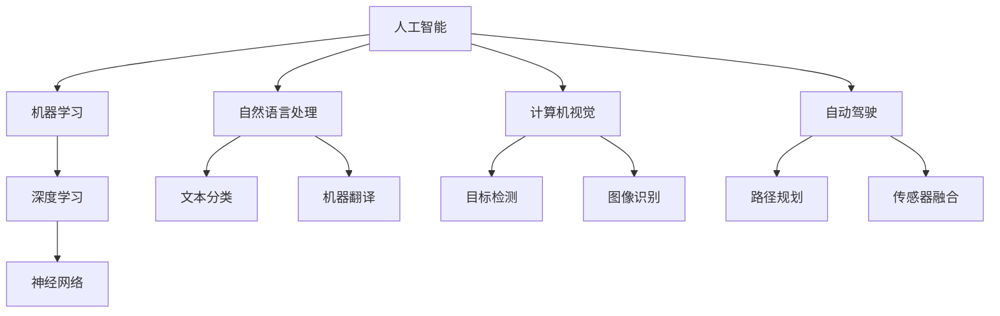

                 

# AI的长期发展：贾扬清的思考，如何让AI行业更长远地走下去

> 关键词：AI长期发展，贾扬清，技术思考，行业未来，算法原理，数学模型，应用场景，工具推荐，趋势与挑战

> 摘要：本文旨在探讨人工智能行业的长期发展，基于贾扬清的技术思考，分析如何推动AI行业持续、健康地发展。文章将从背景介绍、核心概念、算法原理、数学模型、项目实战、应用场景、工具推荐等方面，逐步展开对AI行业发展的深入讨论。

## 1. 背景介绍

### 1.1 目的和范围

本文的目的是通过对AI行业的长期发展进行探讨，帮助读者了解该领域的未来发展方向，以及可能面临的挑战。本文将结合贾扬清的技术思考，对AI行业的现状和未来进行深入分析，旨在为行业从业人员提供有价值的参考和指导。

### 1.2 预期读者

本文面向对人工智能感兴趣的读者，包括AI领域的从业者、研究人员、学生等。通过本文的阅读，读者可以了解AI行业的现状、未来发展趋势以及可能面临的挑战，从而更好地规划自己的职业道路。

### 1.3 文档结构概述

本文分为十个部分，具体如下：

1. 背景介绍：介绍本文的目的、范围、预期读者及文档结构。
2. 核心概念与联系：介绍AI行业中的核心概念及其相互关系。
3. 核心算法原理 & 具体操作步骤：阐述AI行业中的核心算法原理和具体操作步骤。
4. 数学模型和公式 & 详细讲解 & 举例说明：介绍AI行业中的数学模型和公式，并进行详细讲解和举例说明。
5. 项目实战：通过实际案例展示AI行业的应用。
6. 实际应用场景：分析AI行业在不同领域的应用。
7. 工具和资源推荐：推荐学习资源、开发工具和框架。
8. 总结：对未来发展趋势与挑战进行总结。
9. 附录：常见问题与解答。
10. 扩展阅读 & 参考资料：提供更多相关资料，供读者进一步学习。

### 1.4 术语表

#### 1.4.1 核心术语定义

- AI：人工智能（Artificial Intelligence），是指由人制造出来的系统能够理解、思考、学习、推理和解决问题的能力。
- 深度学习（Deep Learning）：一种基于人工神经网络的研究方法，通过多层神经网络对大量数据进行训练，以实现对复杂数据的建模和预测。
- 机器学习（Machine Learning）：一种人工智能的研究方法，通过算法让计算机自动从数据中学习规律，并利用这些规律进行预测和决策。
- 神经网络（Neural Network）：一种基于生物神经网络原理的算法模型，通过模拟生物神经网络的结构和功能，实现对复杂数据的处理和预测。

#### 1.4.2 相关概念解释

- 数据集（Dataset）：一组具有特定目的的数据集合，用于训练、测试和评估AI模型的性能。
- 模型评估（Model Evaluation）：通过对AI模型在数据集上的表现进行评估，以确定模型的性能和可靠性。
- 超参数（Hyperparameter）：用于调节AI模型性能的参数，通常在模型训练之前设定。

#### 1.4.3 缩略词列表

- AI：人工智能
- DL：深度学习
- ML：机器学习
- NN：神经网络

## 2. 核心概念与联系

在讨论AI行业的长期发展之前，我们首先需要了解一些核心概念及其相互关系。

### 核心概念原理和架构的 Mermaid 流程图



### 核心概念解释

- **人工智能**：人工智能是指由人制造出来的系统能够理解、思考、学习、推理和解决问题的能力。它包括多个子领域，如机器学习、深度学习、自然语言处理、计算机视觉等。
- **机器学习**：机器学习是一种人工智能的研究方法，通过算法让计算机自动从数据中学习规律，并利用这些规律进行预测和决策。
- **深度学习**：深度学习是一种基于人工神经网络的研究方法，通过多层神经网络对大量数据进行训练，以实现对复杂数据的建模和预测。
- **神经网络**：神经网络是一种基于生物神经网络原理的算法模型，通过模拟生物神经网络的结构和功能，实现对复杂数据的处理和预测。
- **自然语言处理**：自然语言处理是人工智能的一个子领域，旨在使计算机能够理解、处理和生成自然语言，如文本分类、机器翻译等。
- **计算机视觉**：计算机视觉是人工智能的另一个子领域，旨在使计算机能够从图像和视频中提取信息，如目标检测、图像识别等。
- **自动驾驶**：自动驾驶是人工智能在交通运输领域的应用，旨在使汽车能够自主行驶，包括路径规划、传感器融合等。

### 核心概念之间的联系

- **人工智能**是整体框架，涵盖了多个子领域，如机器学习、深度学习、自然语言处理、计算机视觉等。
- **机器学习**和**深度学习**都是人工智能的方法，其中深度学习是机器学习的一种特殊形式，通过多层神经网络进行训练。
- **自然语言处理**和**计算机视觉**都是人工智能的应用领域，分别关注文本和图像的处理。
- **自动驾驶**是人工智能在交通运输领域的应用，涉及多个子领域的技术，如路径规划、传感器融合等。

## 3. 核心算法原理 & 具体操作步骤

在了解了AI行业中的核心概念之后，接下来我们将探讨其中的核心算法原理及其具体操作步骤。

### 核心算法原理

AI行业中的核心算法主要包括机器学习算法、深度学习算法、自然语言处理算法和计算机视觉算法。以下是这些算法的基本原理：

#### 3.1 机器学习算法

- **监督学习**：通过已标记的数据训练模型，使模型能够对新数据进行预测。常用的算法有线性回归、逻辑回归、支持向量机等。
- **无监督学习**：不使用标记数据训练模型，主要用于发现数据中的模式和规律。常用的算法有聚类、降维等。
- **半监督学习**：结合监督学习和无监督学习，使用部分标记数据和大量未标记数据训练模型。

#### 3.2 深度学习算法

- **卷积神经网络（CNN）**：用于图像识别和目标检测，通过卷积层、池化层、全连接层等结构对图像进行特征提取和分类。
- **循环神经网络（RNN）**：用于序列数据处理，如自然语言处理、时间序列预测等，通过隐藏层和循环结构对序列数据进行建模。
- **生成对抗网络（GAN）**：通过生成器和判别器之间的对抗训练，实现图像生成、数据增强等任务。

#### 3.3 自然语言处理算法

- **词向量表示**：将文本转换为数值表示，常用的方法有Word2Vec、GloVe等。
- **文本分类**：将文本分为不同的类别，常用的算法有朴素贝叶斯、支持向量机、深度学习等。
- **机器翻译**：将一种语言的文本翻译为另一种语言，常用的算法有基于短语的机器翻译、基于神经网络的机器翻译等。

#### 3.4 计算机视觉算法

- **目标检测**：在图像中检测并定位感兴趣的目标，常用的算法有YOLO、SSD、Faster R-CNN等。
- **图像识别**：对图像进行分类，常用的算法有卷积神经网络、支持向量机等。
- **图像分割**：将图像划分为不同的区域，常用的算法有全卷积网络（FCN）、U-Net等。

### 具体操作步骤

以卷积神经网络（CNN）为例，具体操作步骤如下：

#### 3.1 数据准备

1. 收集并清洗数据，确保数据质量。
2. 将图像数据缩放到统一的尺寸。
3. 将图像数据划分为训练集、验证集和测试集。

#### 3.2 构建模型

1. 选择合适的网络结构，如VGG、ResNet、Inception等。
2. 定义损失函数，如交叉熵损失函数。
3. 定义优化器，如Adam、SGD等。

#### 3.3 训练模型

1. 使用训练集训练模型。
2. 在验证集上评估模型性能，调整超参数。
3. 使用测试集评估模型性能，确保模型泛化能力。

#### 3.4 模型部署

1. 将训练好的模型转换为 inference 模式。
2. 在实际应用场景中部署模型，如图像分类、目标检测等。

## 4. 数学模型和公式 & 详细讲解 & 举例说明

在AI行业中，数学模型和公式起着至关重要的作用。以下是一些常见的数学模型和公式，并对其进行详细讲解和举例说明。

### 4.1 损失函数

损失函数是衡量模型预测结果与真实值之间差异的指标，常用的损失函数有：

- **均方误差（MSE）**：

$$
MSE = \frac{1}{n}\sum_{i=1}^{n}(y_i - \hat{y}_i)^2
$$

其中，$y_i$为真实值，$\hat{y}_i$为预测值，$n$为样本数量。

- **交叉熵损失函数（Cross-Entropy Loss）**：

$$
CE = -\sum_{i=1}^{n}y_i\log(\hat{y}_i)
$$

其中，$y_i$为真实值，$\hat{y}_i$为预测值。

### 4.2 梯度下降算法

梯度下降算法是一种优化算法，用于求解最小化损失函数的问题。其基本思想是沿着损失函数的梯度方向进行迭代更新，以找到损失函数的最小值。

- **批量梯度下降（Batch Gradient Descent）**：

$$
\theta_{t+1} = \theta_{t} - \alpha \cdot \frac{\partial}{\partial \theta}J(\theta)
$$

其中，$\theta$为模型参数，$\alpha$为学习率，$J(\theta)$为损失函数。

- **随机梯度下降（Stochastic Gradient Descent，SGD）**：

$$
\theta_{t+1} = \theta_{t} - \alpha \cdot \frac{\partial}{\partial \theta}J(\theta; x^{(i)}, y^{(i)})
$$

其中，$x^{(i)}$和$y^{(i)}$为第$i$个样本的特征和标签。

### 4.3 激活函数

激活函数是神经网络中的一个关键组成部分，用于引入非线性变换。常见的激活函数有：

- **sigmoid 函数**：

$$
\sigma(x) = \frac{1}{1 + e^{-x}}
$$

- **ReLU 函数**：

$$
\text{ReLU}(x) = \max(0, x)
$$

- **Tanh 函数**：

$$
\tanh(x) = \frac{e^x - e^{-x}}{e^x + e^{-x}}
$$

### 4.4 举例说明

以线性回归模型为例，假设我们要预测房价，其中自变量为房屋面积，因变量为房价。我们可以使用均方误差（MSE）作为损失函数，使用梯度下降算法进行模型训练。

- **损失函数**：

$$
J(\theta) = \frac{1}{2m}\sum_{i=1}^{m}(h_\theta(x^{(i)}) - y^{(i)})^2
$$

其中，$m$为样本数量，$h_\theta(x) = \theta_0 + \theta_1x$为线性回归模型的预测函数。

- **梯度下降算法**：

$$
\theta_0 = \theta_0 - \alpha \cdot \frac{\partial}{\partial \theta_0}J(\theta_0)
$$

$$
\theta_1 = \theta_1 - \alpha \cdot \frac{\partial}{\partial \theta_1}J(\theta_1)
$$

其中，$\alpha$为学习率。

## 5. 项目实战：代码实际案例和详细解释说明

在本节中，我们将通过一个实际案例来展示如何实现AI模型，并对其进行详细解释说明。

### 5.1 开发环境搭建

1. 安装Python环境：确保Python版本为3.6及以上。
2. 安装TensorFlow：使用pip命令安装TensorFlow库。

```bash
pip install tensorflow
```

### 5.2 源代码详细实现和代码解读

以下是一个简单的线性回归模型实现，用于预测房价：

```python
import tensorflow as tf

# 定义输入和输出
X = tf.placeholder(tf.float32, shape=[None, 1])
Y = tf.placeholder(tf.float32, shape=[None, 1])

# 初始化模型参数
theta = tf.Variable(tf.random_uniform([1], -1.0, 1.0))

# 定义线性回归模型
model = tf.multiply(X, theta)

# 定义损失函数
loss = tf.reduce_mean(tf.square(Y - model))

# 定义优化器
optimizer = tf.train.GradientDescentOptimizer(learning_rate=0.5)
train_op = optimizer.minimize(loss)

# 初始化全局变量
init = tf.global_variables_initializer()

# 训练模型
with tf.Session() as sess:
    sess.run(init)
    
    for i in range(1000):
        sess.run(train_op, feed_dict={X: X_data, Y: Y_data})
        
        if i % 100 == 0:
            loss_val = sess.run(loss, feed_dict={X: X_data, Y: Y_data})
            print(f"Step {i}: Loss = {loss_val}")
            
    # 模型预测
    predicted_price = sess.run(model, feed_dict={X: X_test})
    print("Predicted Prices:", predicted_price)
```

### 5.3 代码解读与分析

- **第1-7行**：导入所需的TensorFlow库。
- **第8-10行**：定义输入和输出占位符，其中X为自变量（房屋面积），Y为因变量（房价）。
- **第11-13行**：初始化模型参数theta，使用随机均匀分布初始化，初始范围为[-1.0, 1.0]。
- **第14-16行**：定义线性回归模型，模型为自变量X与模型参数theta的乘积。
- **第17-19行**：定义损失函数，使用均方误差（MSE）作为损失函数。
- **第20-22行**：定义优化器，使用梯度下降优化器，学习率为0.5。
- **第23-25行**：初始化全局变量。
- **第26-29行**：训练模型，使用梯度下降优化器更新模型参数，并打印损失函数值。
- **第30-33行**：使用训练好的模型进行预测，并打印预测结果。

该代码实现了线性回归模型的基本结构，包括输入和输出定义、模型初始化、损失函数定义、优化器选择和模型训练。通过这个案例，我们可以了解如何使用TensorFlow实现一个简单的AI模型，并对其进行训练和预测。

## 6. 实际应用场景

AI技术已在多个领域取得显著成果，以下是一些典型的实际应用场景：

### 6.1 自然语言处理

- **文本分类**：用于分类新闻文章、社交媒体评论等，帮助用户快速获取有价值的信息。
- **机器翻译**：应用于跨国企业、旅游等行业，实现多语言间的实时翻译，提高沟通效率。
- **智能客服**：通过自然语言处理技术，实现与用户的自然对话，提供个性化的服务。

### 6.2 计算机视觉

- **目标检测**：应用于安防监控、自动驾驶等领域，实现对图像中的目标进行检测和识别。
- **图像识别**：应用于医疗影像分析、人脸识别等，帮助医生诊断疾病、提高安全防护水平。
- **图像生成**：应用于艺术创作、游戏开发等领域，实现图像的自动生成，提高创意设计的效率。

### 6.3 自动驾驶

- **路径规划**：应用于自动驾驶汽车，通过感知环境信息，实现自主驾驶。
- **传感器融合**：应用于无人机、机器人等领域，通过融合多种传感器数据，提高系统的感知能力和可靠性。

### 6.4 医疗健康

- **疾病预测**：通过分析大量医疗数据，实现疾病预测和早期诊断，提高医疗资源的利用效率。
- **个性化治疗**：通过分析患者的基因、病史等信息，实现个性化治疗方案，提高治疗效果。

### 6.5 金融领域

- **风险管理**：通过分析历史数据，实现风险预测和评估，降低金融风险。
- **智能投顾**：通过分析用户的风险偏好、投资目标等信息，提供个性化的投资建议。

这些实际应用场景展示了AI技术在不同领域的广泛应用，为各行各业带来了巨大的变革和进步。

## 7. 工具和资源推荐

### 7.1 学习资源推荐

#### 7.1.1 书籍推荐

- 《Python机器学习》
- 《深度学习》
- 《神经网络与深度学习》
- 《自然语言处理综论》

#### 7.1.2 在线课程

- Coursera的《机器学习》
- edX的《深度学习基础》
- Udacity的《人工智能纳米学位》

#### 7.1.3 技术博客和网站

- [Machine Learning Mastery](https://machinelearningmastery.com/)
- [Deep Learning AI](https://www.deeplearningai.com/)
- [TensorFlow官网](https://www.tensorflow.org/)

### 7.2 开发工具框架推荐

#### 7.2.1 IDE和编辑器

- PyCharm
- VSCode
- Jupyter Notebook

#### 7.2.2 调试和性能分析工具

- TensorFlow Debugger
- PyTorch Profiler
- TensorBoard

#### 7.2.3 相关框架和库

- TensorFlow
- PyTorch
- Keras
- scikit-learn

### 7.3 相关论文著作推荐

#### 7.3.1 经典论文

- "A Learning Algorithm for Continuously Running Fully Recurrent Neural Networks" by John Hopfield
- "Learning representations by maximizing mutual information" by Yaser Abu-Mostafa
- "A Theoretically Grounded Application of Dropout in Recurrent Neural Networks" by Yarin Gal and Zoubin Ghahramani

#### 7.3.2 最新研究成果

- "Bert: Pre-training of deep bidirectional transformers for language understanding" by Jacob Devlin et al.
- "Gshard: Scaling giant models with conditional computation and automatic sharding" by Noam Shazeer et al.
- "Rezero is all you need: Fast convergence at large depth" by Yuhuai Wu et al.

#### 7.3.3 应用案例分析

- "DeepMind的AlphaGo如何战胜围棋世界冠军" by David Silver
- "Facebook的AI如何帮助Instagram优化推荐算法" by Yann LeCun
- "Google的AI如何提高搜索结果的准确性" by Google AI Research Team

通过这些工具和资源的推荐，读者可以更加深入地学习和掌握AI技术，为自身的职业发展提供有力支持。

## 8. 总结：未来发展趋势与挑战

### 8.1 未来发展趋势

- **跨学科融合**：AI技术将继续与其他领域（如生物学、物理学、经济学等）深度融合，推动交叉学科的发展。
- **数据驱动**：数据的获取、处理和分析将在AI发展中发挥越来越重要的作用，为AI算法提供更丰富的训练数据。
- **高效算法与模型**：针对特定场景和任务，研究人员将不断优化算法和模型，提高AI系统的效率和性能。
- **自主性与自适应能力**：未来的AI系统将具备更高的自主性和自适应能力，能够在复杂环境中自主决策和调整行为。

### 8.2 挑战

- **数据隐私与安全**：随着AI技术的发展，数据隐私和安全问题日益突出，如何在确保数据隐私的前提下进行数据处理和利用成为一大挑战。
- **算法透明性与可解释性**：提高AI算法的透明性和可解释性，使人类更好地理解和信任AI系统，是当前面临的重要问题。
- **伦理与道德**：AI技术的广泛应用引发了伦理和道德问题，如自动驾驶汽车的责任归属、人工智能在医疗领域的使用等，需要制定相应的规范和标准。
- **资源消耗与能源消耗**：大规模训练和运行AI系统对计算资源和能源消耗巨大，如何降低资源消耗成为亟待解决的问题。

综上所述，AI行业的未来发展充满机遇和挑战。通过不断探索和创新，我们有理由相信，AI技术将引领人类进入一个更加智能、便捷、高效的新时代。

## 9. 附录：常见问题与解答

### 9.1 什么是机器学习？

机器学习是一种人工智能的研究方法，通过算法让计算机自动从数据中学习规律，并利用这些规律进行预测和决策。机器学习包括监督学习、无监督学习和半监督学习等类型。

### 9.2 什么是深度学习？

深度学习是一种基于人工神经网络的研究方法，通过多层神经网络对大量数据进行训练，以实现对复杂数据的建模和预测。深度学习在图像识别、语音识别、自然语言处理等领域取得了显著成果。

### 9.3 什么是神经网络？

神经网络是一种基于生物神经网络原理的算法模型，通过模拟生物神经网络的结构和功能，实现对复杂数据的处理和预测。神经网络包括输入层、隐藏层和输出层，各层之间通过加权连接进行信息传递。

### 9.4 什么是卷积神经网络（CNN）？

卷积神经网络（CNN）是一种用于图像识别和目标检测的神经网络，通过卷积层、池化层、全连接层等结构对图像进行特征提取和分类。CNN在计算机视觉领域取得了显著的成果。

### 9.5 什么是自然语言处理（NLP）？

自然语言处理（NLP）是人工智能的一个子领域，旨在使计算机能够理解、处理和生成自然语言，如文本分类、机器翻译等。NLP在智能客服、信息检索、文本生成等领域有广泛应用。

### 9.6 什么是自动驾驶？

自动驾驶是指汽车能够自主感知环境、规划路径并控制驾驶，实现无人驾驶。自动驾驶技术包括路径规划、传感器融合、决策与控制等子领域，有望彻底改变交通运输行业。

## 10. 扩展阅读 & 参考资料

- [贾扬清博客](https://www.jiayangqing.com/)
- [《深度学习》官方文档](https://www.deeplearningbook.org/)
- [TensorFlow教程](https://www.tensorflow.org/tutorials)
- [《Python机器学习》官方文档](https://python-machine-learning-book.blogspot.com/)
- [《自然语言处理综论》官方文档](https://nlp.stanford.edu/ courses/2018/nlp-sempar/exercises.html)  
- [《机器学习 Mastery》博客](https://machinelearningmastery.com/)  
- [《深度学习 AI》博客](https://www.deeplearningai.com/)  
- [《人工智能纳米学位》课程](https://www.udacity.com/course/artificial-intelligence-nanodegree--nd893)  
- [《Google AI Research》博客](https://ai.googleblog.com/)  
- [《Facebook AI Research》博客](https://research.fb.com/publications/)

