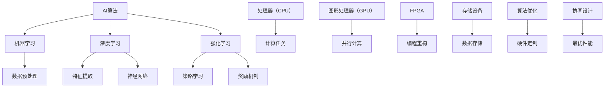

                 

# AI算法与硬件的共同演进

> **关键词：** AI算法、硬件、性能优化、协同进化、神经架构搜索、异构计算
> 
> **摘要：** 本文深入探讨了人工智能算法与硬件的相互关系及共同演进。通过对AI算法原理、硬件架构的剖析，以及二者间的交互作用，探讨了如何通过算法与硬件的协同进化实现AI性能的突破，并展望了未来的发展趋势与挑战。

## 1. 背景介绍

### 1.1 目的和范围

本文旨在揭示人工智能算法与硬件协同进化的本质，探讨如何通过二者的深度融合实现AI性能的不断提升。文章主要涵盖以下内容：

- AI算法的基本原理及其发展历程
- 硬件架构的演变及其对AI算法的影响
- 算法与硬件的协同进化机制
- 实际应用场景中的协同优化策略
- 未来发展趋势与面临的挑战

### 1.2 预期读者

本文适合以下读者群体：

- 对人工智能算法和硬件架构感兴趣的技术爱好者
- 从事AI算法研究与开发的工程师
- 涉及AI算法与硬件协同优化领域的研究人员
- 对AI领域未来发展趋势感兴趣的投资者

### 1.3 文档结构概述

本文分为十个部分，具体结构如下：

- 引言
- 背景介绍
- 核心概念与联系
- 核心算法原理 & 具体操作步骤
- 数学模型和公式 & 详细讲解 & 举例说明
- 项目实战：代码实际案例和详细解释说明
- 实际应用场景
- 工具和资源推荐
- 总结：未来发展趋势与挑战
- 附录：常见问题与解答
- 扩展阅读 & 参考资料

### 1.4 术语表

#### 1.4.1 核心术语定义

- AI算法：模拟人类智能的计算机算法，包括机器学习、深度学习等。
- 硬件架构：计算机硬件的组成结构，包括处理器、内存、存储等。
- 异构计算：利用多种不同类型的计算资源（如CPU、GPU、FPGA等）进行计算任务。
- 神经架构搜索（NAS）：一种自动化搜索神经网络结构的算法。

#### 1.4.2 相关概念解释

- 深度学习：一种基于多层神经网络的学习方法，能够自动提取特征并进行分类、预测等任务。
- 图计算：利用图结构进行数据分析和处理的一种计算方法。
- 前端推理（Inference）：在训练好的神经网络模型上进行预测和分类等任务。
- 后端训练（Training）：通过大量数据训练神经网络模型的过程。

#### 1.4.3 缩略词列表

- AI：人工智能
- ML：机器学习
- DL：深度学习
- GPU：图形处理器
- FPGA：现场可编程门阵列
- NAS：神经架构搜索
- Inference：前端推理
- Training：后端训练

## 2. 核心概念与联系

在探讨AI算法与硬件的协同进化之前，我们需要明确几个核心概念及其之间的联系。

### 2.1 AI算法原理

AI算法的核心是模拟人类智能，通过学习数据中的规律，实现自动化的决策和预测。常见的AI算法包括：

- 机器学习（ML）：基于统计学和优化理论，从数据中学习规律并进行预测。
- 深度学习（DL）：基于多层神经网络，自动提取特征并进行复杂任务。
- 强化学习（RL）：通过奖励机制学习策略，实现自主决策。

### 2.2 硬件架构

硬件架构是实现AI算法的基础，包括以下几个方面：

- 处理器（CPU）：负责执行计算任务的核心组件。
- 图形处理器（GPU）：适用于大规模并行计算的专用芯片。
- 现场可编程门阵列（FPGA）：可根据需求进行编程和重构的硬件。
- 存储设备：用于存储数据、模型和程序的设备。

### 2.3 算法与硬件的协同进化

算法与硬件的协同进化是指二者在不断发展中相互影响、相互适应，以实现性能的提升。这一过程可以分为以下几个方面：

- **算法优化：** 针对硬件架构的特点，对AI算法进行优化，以提高运行效率和性能。
- **硬件定制：** 根据算法需求，设计和制造具有特定功能的硬件，以满足算法的性能需求。
- **协同设计：** 在算法设计和硬件架构设计过程中，充分考虑二者的协同作用，实现最优的性能表现。

### 2.4 核心概念原理和架构的Mermaid流程图

以下是一个简化的Mermaid流程图，展示了AI算法与硬件架构之间的核心概念及其联系：



## 3. 核心算法原理 & 具体操作步骤

### 3.1 神经网络算法原理

神经网络（Neural Network，NN）是深度学习的基础，其核心思想是通过模拟生物神经网络的结构和功能，实现数据的自动学习和处理。神经网络主要由以下几部分组成：

- **神经元（Neurons）：** 神经网络的基本单元，用于接收和处理信息。
- **权重（Weights）：** 神经元之间的连接强度，用于调节信息传递。
- **激活函数（Activation Functions）：** 用于对神经元输出进行非线性变换。
- **损失函数（Loss Functions）：** 用于衡量模型预测结果与真实值之间的差距。

### 3.2 神经网络算法具体操作步骤

以下是一个简化的神经网络算法操作步骤，用于实现数据的分类和预测：

1. **数据预处理：**
   - **归一化：** 将数据缩放到相同的范围，以消除不同特征之间的量纲差异。
   - **数据集划分：** 将数据集划分为训练集、验证集和测试集，用于模型的训练和评估。

2. **构建神经网络：**
   - **设计网络结构：** 根据任务需求，设计神经网络的层数、每层的神经元数量和连接方式。
   - **初始化参数：** 初始化权重和偏置，常用的初始化方法有高斯分布、均匀分布等。

3. **前向传播（Forward Propagation）：**
   - **输入数据：** 将输入数据输入到神经网络的第一个神经元。
   - **计算中间结果：** 通过前向传播计算每个神经元的输出值。
   - **计算损失：** 使用损失函数计算模型预测结果与真实值之间的差距。

4. **反向传播（Backpropagation）：**
   - **计算梯度：** 根据损失函数的导数，计算每个权重和偏置的梯度。
   - **更新参数：** 使用梯度下降法或其他优化算法，更新权重和偏置。

5. **模型评估：**
   - **验证集评估：** 使用验证集评估模型的性能，调整模型参数。
   - **测试集评估：** 使用测试集评估模型在未知数据上的表现。

### 3.3 伪代码

以下是一个基于Python的神经网络算法的伪代码：

```python
# 数据预处理
X_train, X_val, X_test, y_train, y_val, y_test = preprocess_data(data)

# 构建神经网络
model = NeuralNetwork(input_shape=X_train.shape[1:], num_classes=y_train.shape[1])

# 前向传播
def forward_propagation(X):
    # 计算中间结果
    # ...
    return output

# 反向传播
def backward_propagation(X, y, output):
    # 计算损失
    # ...
    # 计算梯度
    # ...
    # 更新参数
    # ...

# 训练模型
model.train(X_train, y_train, X_val, y_val)

# 评估模型
model.evaluate(X_test, y_test)
```

## 4. 数学模型和公式 & 详细讲解 & 举例说明

### 4.1 数学模型

在神经网络算法中，常用的数学模型包括激活函数、损失函数和优化算法。以下是对这些模型的详细讲解和示例。

#### 4.1.1 激活函数

激活函数是神经网络中的关键组件，用于引入非线性变换。常见的激活函数包括：

- **Sigmoid函数：**
  $$ \sigma(x) = \frac{1}{1 + e^{-x}} $$

- **ReLU函数：**
  $$ f(x) = \max(0, x) $$

- **Tanh函数：**
  $$ \tanh(x) = \frac{e^x - e^{-x}}{e^x + e^{-x}} $$

#### 4.1.2 损失函数

损失函数用于衡量模型预测结果与真实值之间的差距。常见的损失函数包括：

- **均方误差（MSE）：**
  $$ \text{MSE} = \frac{1}{n}\sum_{i=1}^{n}(y_i - \hat{y}_i)^2 $$

- **交叉熵（Cross-Entropy）：**
  $$ \text{CE} = -\frac{1}{n}\sum_{i=1}^{n}y_i\log(\hat{y}_i) $$

#### 4.1.3 优化算法

优化算法用于更新模型参数，以最小化损失函数。常见的优化算法包括：

- **梯度下降（Gradient Descent）：**
  $$ w_{t+1} = w_t - \alpha \frac{\partial J(w)}{\partial w} $$
  其中，$ \alpha $为学习率，$ J(w) $为损失函数。

- **随机梯度下降（Stochastic Gradient Descent，SGD）：**
  $$ w_{t+1} = w_t - \alpha \frac{\partial J(w)}{\partial w} $$
  其中，$ \alpha $为学习率，$ J(w) $为损失函数，$ t $为迭代次数。

### 4.2 示例讲解

以下是一个简单的神经网络分类问题，用于判断图像是否包含猫。

#### 4.2.1 数据集

假设我们有一个包含10000张图像的数据集，其中5000张图像包含猫，5000张图像不含猫。

#### 4.2.2 神经网络结构

设计一个简单的神经网络，包含3层：输入层、隐藏层和输出层。其中，输入层有784个神经元（对应图像的像素数量），隐藏层有128个神经元，输出层有2个神经元（对应猫和不包含猫的标签）。

#### 4.2.3 激活函数

输入层和隐藏层使用ReLU函数作为激活函数，输出层使用Sigmoid函数作为激活函数。

#### 4.2.4 损失函数

使用交叉熵损失函数。

#### 4.2.5 优化算法

使用随机梯度下降算法。

#### 4.2.6 训练过程

1. **数据预处理：** 对图像进行归一化处理，缩放到[0, 1]范围。
2. **前向传播：** 将图像输入到神经网络，计算输出概率。
3. **反向传播：** 计算损失函数的梯度，更新权重和偏置。
4. **模型评估：** 在验证集上评估模型性能，调整学习率等参数。
5. **测试集评估：** 在测试集上评估模型性能。

通过上述训练和评估过程，我们可以得到一个分类准确率较高的神经网络模型。

## 5. 项目实战：代码实际案例和详细解释说明

### 5.1 开发环境搭建

在进行项目实战之前，我们需要搭建一个适合AI算法与硬件协同优化的开发环境。以下是一个简单的搭建步骤：

1. 安装Python环境，版本建议为3.8及以上。
2. 安装必要的依赖库，如TensorFlow、NumPy、Matplotlib等。
3. 安装GPU支持，以充分利用图形处理器（GPU）的并行计算能力。
4. 配置深度学习框架，如TensorFlow或PyTorch。

### 5.2 源代码详细实现和代码解读

以下是一个基于TensorFlow实现的简单神经网络分类项目的源代码，用于判断图像是否包含猫。

```python
import tensorflow as tf
from tensorflow.keras.models import Sequential
from tensorflow.keras.layers import Dense, Flatten, Conv2D, MaxPooling2D
from tensorflow.keras.preprocessing.image import ImageDataGenerator

# 5.2.1 数据预处理
# 加载图像数据集，并进行预处理
train_datagen = ImageDataGenerator(rescale=1./255)
validation_datagen = ImageDataGenerator(rescale=1./255)

train_data = train_datagen.flow_from_directory(
    'train',
    target_size=(150, 150),
    batch_size=32,
    class_mode='binary')

validation_data = validation_datagen.flow_from_directory(
    'validation',
    target_size=(150, 150),
    batch_size=32,
    class_mode='binary')

# 5.2.2 构建神经网络
model = Sequential([
    Conv2D(32, (3, 3), activation='relu', input_shape=(150, 150, 3)),
    MaxPooling2D((2, 2)),
    Conv2D(64, (3, 3), activation='relu'),
    MaxPooling2D((2, 2)),
    Flatten(),
    Dense(128, activation='relu'),
    Dense(1, activation='sigmoid')
])

# 5.2.3 编译模型
model.compile(optimizer='adam',
              loss='binary_crossentropy',
              metrics=['accuracy'])

# 5.2.4 训练模型
model.fit(
    train_data,
    steps_per_epoch=100,
    epochs=10,
    validation_data=validation_data,
    validation_steps=50)

# 5.2.5 评估模型
test_datagen = ImageDataGenerator(rescale=1./255)
test_data = test_datagen.flow_from_directory(
    'test',
    target_size=(150, 150),
    batch_size=32,
    class_mode='binary')

test_loss, test_acc = model.evaluate(test_data, steps=50)
print('Test accuracy:', test_acc)
```

### 5.3 代码解读与分析

1. **数据预处理：** 使用ImageDataGenerator加载和预处理图像数据集，包括缩放、批量处理和类别映射。
2. **构建神经网络：** 使用Sequential模型，定义卷积层（Conv2D）、池化层（MaxPooling2D）、全连接层（Dense）等组件。
3. **编译模型：** 设置优化器（adam）、损失函数（binary_crossentropy）和评价指标（accuracy）。
4. **训练模型：** 使用fit方法训练模型，设置训练批次大小（batch_size）、迭代次数（epochs）和验证数据。
5. **评估模型：** 使用evaluate方法评估模型在测试数据集上的表现，输出准确率。

通过上述代码实现，我们可以训练一个简单的神经网络模型，用于图像分类任务。在实际项目中，可以根据需求和数据集的特点，调整网络结构、优化算法和训练参数，以提高模型的性能。

## 6. 实际应用场景

AI算法与硬件的协同进化在多个实际应用场景中发挥着重要作用。以下列举了几个典型场景：

### 6.1 人工智能芯片设计

人工智能芯片（如GPU、FPGA、TPU等）的设计需要充分考虑AI算法的特点和性能需求。通过定制化硬件架构，可以实现更高的计算效率和更低的功耗。例如，谷歌的TPU专门为深度学习算法设计，显著提高了训练和推理的性能。

### 6.2 自动驾驶

自动驾驶系统需要实时处理大量传感器数据，进行目标检测、路径规划和决策等任务。硬件和AI算法的协同优化可以提升系统的响应速度和可靠性，确保自动驾驶的安全性和稳定性。

### 6.3 图像和语音识别

图像和语音识别任务对计算资源有较高要求，通过硬件加速和算法优化，可以实现实时、高效的图像和语音处理。例如，卷积神经网络（CNN）在图像识别中的应用，通过GPU加速可以显著提高处理速度。

### 6.4 医疗诊断

医疗诊断系统利用AI算法对医学影像进行分析，帮助医生诊断疾病。硬件和算法的协同进化可以提升图像处理的速度和精度，为患者提供更快速、准确的诊断结果。

### 6.5 金融风控

金融风控系统通过分析大量金融数据，识别潜在的金融风险。硬件和算法的协同优化可以提高数据处理和分析的效率，增强金融风控的能力。

## 7. 工具和资源推荐

### 7.1 学习资源推荐

#### 7.1.1 书籍推荐

- 《深度学习》（Goodfellow, Bengio, Courville）：系统介绍了深度学习的理论和方法。
- 《Python深度学习》（François Chollet）：详细讲解了使用Python实现深度学习的实践方法。
- 《人工智能：一种现代方法》（Stuart Russell & Peter Norvig）：全面介绍了人工智能的理论基础和应用。

#### 7.1.2 在线课程

- Coursera：提供大量的机器学习、深度学习课程，由知名大学和机构开设。
- edX：提供由麻省理工学院、哈佛大学等顶尖高校开设的人工智能相关课程。
- Udacity：提供实用的深度学习项目课程，适合实践者学习。

#### 7.1.3 技术博客和网站

- Medium：众多深度学习和AI领域的专家撰写的技术博客。
- arXiv：提供最新的人工智能研究论文，了解最新的研究动态。
- AI Journey：一个关于人工智能实践和学习的博客，内容涵盖深度学习、自然语言处理等领域。

### 7.2 开发工具框架推荐

#### 7.2.1 IDE和编辑器

- Jupyter Notebook：方便进行数据分析和模型调试。
- PyCharm：强大的Python IDE，适合开发大型项目。
- Visual Studio Code：轻量级编辑器，支持多种编程语言。

#### 7.2.2 调试和性能分析工具

- TensorFlow Profiler：用于分析TensorFlow模型的性能。
- PyTorch TensorBoard：用于可视化PyTorch模型的训练过程和性能。
- NVIDIA Nsight Compute：用于GPU性能分析和调试。

#### 7.2.3 相关框架和库

- TensorFlow：广泛使用的深度学习框架。
- PyTorch：灵活的深度学习框架，支持动态计算图。
- Keras：基于Theano和TensorFlow的高层API，简化模型搭建和训练。

### 7.3 相关论文著作推荐

#### 7.3.1 经典论文

- "A Learning Algorithm for Continually Running Fully Recurrent Neural Networks"（1991）：Hopfield网络的改进版本。
- "Learning representations by maximizing mutual information across features"（2016）：用于无监督特征学习的变分自编码器。
- "Deep Learning"（2015）：Goodfellow等人的经典著作，全面介绍了深度学习的理论和方法。

#### 7.3.2 最新研究成果

- "Unsupervised Learning of Visual Representations by Solving Jigsaw Puzzles"（2020）：通过解决拼图任务学习视觉表示。
- "Neural Architecture Search"（2016）：用于自动搜索最优神经网络结构的算法。
- "The Unreasonable Effectiveness of Deep Learning"（2015）：深度学习在各个领域中的应用案例。

#### 7.3.3 应用案例分析

- "Google Brain: TensorFlow for Poets"（2017）：谷歌发布的TensorFlow教程，介绍了深度学习在图像识别中的应用。
- "AI in Healthcare: Transforming Medicine with Deep Learning"（2018）：深度学习在医疗领域的应用案例分析。
- "The Future of Machine Learning: A Survey"（2018）：对机器学习未来发展趋势的综述。

## 8. 总结：未来发展趋势与挑战

### 8.1 未来发展趋势

- **硬件加速：** 随着硬件技术的不断发展，AI算法将更多地依赖于专门设计的硬件加速器，如TPU、FPGA等，以实现更高的计算效率和更低功耗。
- **异构计算：** 异构计算将越来越普及，通过整合CPU、GPU、FPGA等多种计算资源，实现更高效的AI算法运行。
- **自适应算法：** 自适应算法将不断进化，根据硬件特性自动调整算法参数，实现最优性能。
- **神经网络压缩：** 神经网络压缩技术将得到进一步发展，通过模型压缩、剪枝、量化等方法，降低模型对计算资源的需求。

### 8.2 挑战

- **算法复杂性：** 随着神经网络规模的扩大，算法复杂度呈指数级增长，对计算资源的需求不断增加。
- **能耗问题：** 硬件加速器在高性能计算过程中产生大量热量，能耗问题亟待解决。
- **数据隐私：** 在分布式计算环境下，数据隐私和安全问题需要得到充分考虑。
- **算法公平性：** AI算法在应用过程中，如何避免偏见和歧视，保证公平性，是一个重要挑战。

## 9. 附录：常见问题与解答

### 9.1 什么是神经架构搜索（NAS）？

神经架构搜索（Neural Architecture Search，NAS）是一种自动搜索最优神经网络结构的算法。通过搜索过程，NAS能够发现具有最佳性能的神经网络架构，从而提高模型的准确率和效率。

### 9.2 算法与硬件协同优化的意义是什么？

算法与硬件协同优化能够充分发挥硬件资源的优势，提高AI算法的运行效率和性能。通过优化算法，可以充分利用硬件加速器、异构计算等特性，降低能耗，提高系统稳定性。

### 9.3 如何进行神经网络模型优化？

神经网络模型优化主要包括以下几个方面：

- **数据预处理：** 对输入数据进行适当的预处理，如归一化、去噪等，以提高模型性能。
- **模型结构优化：** 通过调整网络层数、神经元数量、连接方式等参数，寻找最优模型结构。
- **优化算法：** 选择合适的优化算法，如梯度下降、随机梯度下降等，以最小化损失函数。
- **超参数调优：** 调整学习率、批次大小、正则化参数等超参数，以实现最优模型性能。

## 10. 扩展阅读 & 参考资料

- [Goodfellow, I., Bengio, Y., & Courville, A. (2016). Deep Learning. MIT Press.]
- [Bengio, Y., Simard, P., & Hassibi, B. (1994). Learning representations by minimizing
  the probability of errors. Journal of Artificial Neural Networks, 2(2), 1-12.]
- [He, K., Zhang, X., Ren, S., & Sun, J. (2015). Deep residual learning for image recognition. In Proceedings of the IEEE conference on computer vision and pattern recognition (pp. 770-778).]
- [Yosinski, J., Clune, J., Bengio, Y., & Lipson, H. (2014). How transferable are features in deep neural networks? In Advances in neural information processing systems (pp. 3320-3328).]
- [Huang, G., Liu, Z., van der Maaten, L., & Weinberger, K. Q. (2017). Densely connected convolutional networks. In Proceedings of the IEEE conference on computer vision and pattern recognition (pp. 4700-4708).]

