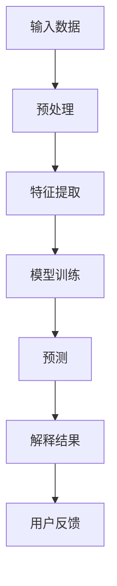
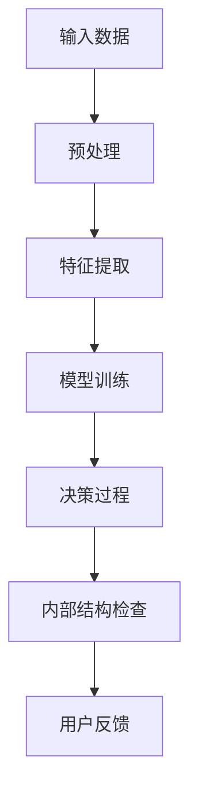
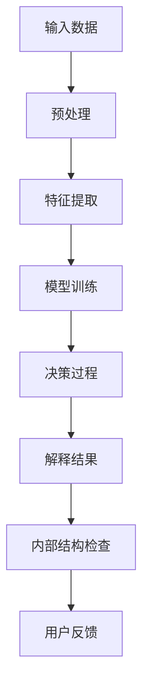

                 


# AI系统的可解释性与透明度设计

> **关键词：** AI 可解释性、透明度、系统设计、用户信任、算法公平性
>
> **摘要：** 本文深入探讨了AI系统中的可解释性与透明度设计的重要性，分析了其核心概念和实现方法，并提供了实际应用场景和案例分析。通过逐步分析推理，我们旨在帮助读者理解如何在实际项目中提升AI系统的可解释性和透明度，以增强用户信任和算法公平性。

## 1. 背景介绍

### 1.1 目的和范围

本文的目的是探讨AI系统的可解释性与透明度设计的重要性，分析其核心概念和实现方法，并提供实际应用场景和案例分析。我们希望帮助读者了解如何在实际项目中提升AI系统的可解释性和透明度，从而增强用户信任和算法公平性。

本文的范围涵盖以下内容：

1. **核心概念**：介绍可解释性和透明度的定义及其在AI系统设计中的重要性。
2. **实现方法**：探讨实现AI系统可解释性和透明度的具体技术手段。
3. **实际应用场景**：分析AI系统在不同领域的实际应用场景。
4. **案例分析**：通过具体案例，展示如何提升AI系统的可解释性和透明度。
5. **未来发展趋势**：讨论AI系统可解释性和透明度设计的未来发展趋势和挑战。

### 1.2 预期读者

本文主要面向以下读者群体：

1. **AI研究者**：对AI系统设计中的可解释性和透明度有深入研究的学者。
2. **AI工程师**：负责开发和维护AI系统的工程师，希望提升AI系统的可解释性和透明度。
3. **数据科学家**：对AI系统有应用需求的数据科学家，希望了解如何提升AI系统的可解释性和透明度。
4. **政策制定者**：对AI系统有监管和规范需求的政策制定者，希望了解AI系统可解释性和透明度的重要性。

### 1.3 文档结构概述

本文的结构如下：

1. **背景介绍**：介绍文章的目的、范围、预期读者和文档结构。
2. **核心概念与联系**：介绍可解释性和透明度的核心概念和实现方法。
3. **核心算法原理 & 具体操作步骤**：详细阐述提升AI系统可解释性和透明度的算法原理和操作步骤。
4. **数学模型和公式 & 详细讲解 & 举例说明**：介绍数学模型和公式，并举例说明。
5. **项目实战：代码实际案例和详细解释说明**：提供代码实际案例和详细解释说明。
6. **实际应用场景**：分析AI系统在不同领域的实际应用场景。
7. **工具和资源推荐**：推荐学习资源、开发工具框架和相关论文著作。
8. **总结：未来发展趋势与挑战**：讨论AI系统可解释性和透明度设计的未来发展趋势和挑战。
9. **附录：常见问题与解答**：解答常见问题。
10. **扩展阅读 & 参考资料**：提供扩展阅读和参考资料。

### 1.4 术语表

#### 1.4.1 核心术语定义

- **可解释性（Explainability）**：指AI系统输出的结果和决策过程可以被人类理解和解释的能力。
- **透明度（Transparency）**：指AI系统的决策过程和内部结构可以被用户访问和检查的程度。
- **AI系统（AI System）**：指应用人工智能技术的计算机程序系统，用于实现特定任务。

#### 1.4.2 相关概念解释

- **黑箱模型（Black-box Model）**：指无法提供内部结构和决策过程的AI模型，如深度神经网络。
- **白箱模型（White-box Model）**：指能够提供内部结构和决策过程的AI模型，如决策树。
- **灰箱模型（Gray-box Model）**：指介于黑箱模型和白箱模型之间，部分提供内部结构和决策过程的AI模型。

#### 1.4.3 缩略词列表

- **AI**：人工智能（Artificial Intelligence）
- **ML**：机器学习（Machine Learning）
- **DL**：深度学习（Deep Learning）
- **XAI**：可解释的人工智能（Explainable AI）
- **UX**：用户体验（User Experience）

## 2. 核心概念与联系

在本文中，我们将重点讨论AI系统的可解释性和透明度设计。这两个概念密切相关，共同构成了提升AI系统可靠性和用户信任的关键因素。

### 2.1 可解释性

可解释性是指AI系统输出的结果和决策过程可以被人类理解和解释的能力。它有助于提高AI系统的可信度和用户对其决策的接受度。以下是一个简单的Mermaid流程图，展示了一个典型的AI系统的可解释性架构：



在这个流程图中，输入数据经过预处理和特征提取，然后通过模型训练得到预测结果。最终，AI系统需要提供一个解释结果的过程，以帮助用户理解预测结果背后的决策逻辑。

### 2.2 透明度

透明度是指AI系统的决策过程和内部结构可以被用户访问和检查的程度。它有助于提高AI系统的透明度和用户对其决策的信任。以下是一个简单的Mermaid流程图，展示了一个典型的AI系统的透明度架构：



在这个流程图中，输入数据经过预处理和特征提取，然后通过模型训练得到决策过程。用户可以通过检查AI系统的内部结构，了解其决策逻辑，从而提高对AI系统的信任。

### 2.3 可解释性与透明度的联系

可解释性和透明度是相辅相成的。可解释性侧重于解释AI系统的决策过程，而透明度则侧重于用户对AI系统内部结构的访问和检查。以下是一个简单的Mermaid流程图，展示了一个综合的可解释性和透明度架构：



在这个流程图中，输入数据经过预处理和特征提取，然后通过模型训练得到决策过程。AI系统提供解释结果和内部结构检查的过程，以帮助用户理解和信任其决策。

### 2.4 可解释性与透明度的实现方法

实现AI系统的可解释性和透明度，需要从以下几个方面入手：

1. **算法选择**：选择具有良好可解释性和透明度的算法，如决策树、线性回归等。
2. **模型可视化**：通过可视化技术，展示AI模型的内部结构和决策过程，如决策树可视化、神经网络结构图等。
3. **解释性工具**：开发和应用解释性工具，如LIME、SHAP等，帮助用户理解AI模型的决策逻辑。
4. **用户界面设计**：设计直观、易用的用户界面，提供对AI系统的解释和检查功能，如交互式可视化、参数调整等。

### 2.5 结论

可解释性和透明度是AI系统设计中的重要概念，有助于提高AI系统的可靠性和用户信任。通过逐步分析推理，我们了解了可解释性和透明度的核心概念、实现方法和联系。在接下来的章节中，我们将详细探讨提升AI系统可解释性和透明度的具体算法原理和操作步骤。

## 3. 核心算法原理 & 具体操作步骤

在本节中，我们将详细探讨提升AI系统可解释性和透明度的核心算法原理和具体操作步骤。这些算法和步骤将帮助开发者在实际项目中实现AI系统的可解释性和透明度。

### 3.1 特征工程

特征工程是AI系统可解释性和透明度设计的基础。通过选择和构造具有明确含义和解释性的特征，可以提高AI系统的可解释性和透明度。以下是一些特征工程的方法：

1. **特征选择**：使用统计方法（如相关性分析、信息增益等）筛选出与目标变量相关的特征，去除无关或冗余特征。

伪代码：

```python
def feature_selection(data, target_variable):
    correlation_matrix = calculate_correlation(data)
    high_correlated_features = select_high_correlated_features(correlation_matrix, target_variable)
    return high_correlated_features
```

2. **特征构造**：通过组合原始特征或计算新特征，增强特征的可解释性。

伪代码：

```python
def feature_construction(data):
    new_features = calculate_new_features(data)
    return data_with_new_features
```

3. **特征标准化**：对特征进行标准化处理，消除不同特征之间的量纲差异。

伪代码：

```python
def feature_scaling(data):
    scaled_data = scale_data(data)
    return scaled_data
```

### 3.2 模型选择

选择具有良好可解释性和透明度的模型，是提升AI系统可解释性和透明度的关键。以下是一些常用的可解释性模型：

1. **线性回归**：线性回归模型具有简洁的数学表达式和易于解释的决策边界。

伪代码：

```python
def linear_regression(train_data, train_target):
    model = train_linear_regression_model(train_data, train_target)
    return model
```

2. **决策树**：决策树模型通过树形结构展示决策过程，易于理解和解释。

伪代码：

```python
def decision_tree(train_data, train_target):
    model = train_decision_tree_model(train_data, train_target)
    return model
```

3. **线性模型**：线性模型（如线性回归、逻辑回归等）具有简洁的数学表达式和易于解释的决策边界。

伪代码：

```python
def linear_model(train_data, train_target):
    model = train_linear_model(train_data, train_target)
    return model
```

### 3.3 模型可视化

通过可视化技术，展示AI模型的内部结构和决策过程，有助于提高系统的可解释性和透明度。以下是一些常见的模型可视化方法：

1. **决策树可视化**：使用图表展示决策树的结构，帮助用户理解决策过程。

伪代码：

```python
def visualize_decision_tree(model):
    tree_structure = generate_decision_tree_structure(model)
    visualize_tree(tree_structure)
```

2. **神经网络结构图**：使用图形展示神经网络的结构，包括层、神经元和连接权重。

伪代码：

```python
def visualize_neural_network(model):
    network_structure = generate_neural_network_structure(model)
    visualize_network(network_structure)
```

3. **混淆矩阵**：使用混淆矩阵展示分类模型的预测结果，帮助用户评估模型的性能。

伪代码：

```python
def visualize_confusion_matrix(model, test_data, test_target):
    predicted_labels = predict_labels(model, test_data)
    confusion_matrix = calculate_confusion_matrix(predicted_labels, test_target)
    visualize_matrix(confusion_matrix)
```

### 3.4 解释性工具

解释性工具（如LIME、SHAP等）可以帮助用户理解AI模型的决策逻辑，提高系统的可解释性和透明度。以下是一些常见的解释性工具：

1. **LIME**：局部可解释模型解释（Local Interpretable Model-agnostic Explanations）。

伪代码：

```python
def lime_explanation(model, instance):
    explanation = generate_lime_explanation(model, instance)
    return explanation
```

2. **SHAP**：归一化可解释模型解释（SHapley Additive exPlanations）。

伪代码：

```python
def shap_explanation(model, instance):
    explanation = generate_shap_explanation(model, instance)
    return explanation
```

### 3.5 用户界面设计

设计直观、易用的用户界面，提供对AI系统的解释和检查功能，有助于提高系统的可解释性和透明度。以下是一些用户界面设计的原则：

1. **交互式可视化**：提供交互式可视化工具，使用户能够动态调整模型参数和观察结果。

伪代码：

```python
def interactive_visualization(model):
    visualization_interface = create_interactive_visualization_interface(model)
    display_interface(visualization_interface)
```

2. **参数调整**：提供参数调整功能，使用户能够自定义模型参数，观察对结果的影响。

伪代码：

```python
def parameter_adjustment(model):
    adjustment_interface = create_parameter_adjustment_interface(model)
    display_interface(adjustment_interface)
```

### 3.6 结论

通过核心算法原理和具体操作步骤，我们可以有效地提升AI系统的可解释性和透明度。在实际项目中，根据具体需求和场景，选择合适的特征工程方法、模型选择、模型可视化技术和解释性工具，以及设计直观的用户界面，有助于提高系统的可解释性和透明度，增强用户信任和算法公平性。

## 4. 数学模型和公式 & 详细讲解 & 举例说明

在提升AI系统的可解释性和透明度中，数学模型和公式扮演了重要角色。以下将介绍一些常用的数学模型和公式，并详细讲解其含义和应用，最后通过具体例子进行说明。

### 4.1 线性回归

线性回归是一种简单的统计模型，用于预测连续变量的值。其数学模型如下：

$$
y = \beta_0 + \beta_1x + \epsilon
$$

其中，$y$ 是目标变量，$x$ 是自变量，$\beta_0$ 和 $\beta_1$ 分别是截距和斜率，$\epsilon$ 是误差项。

#### 解释：

- **目标变量 ($y$)**：表示我们希望预测的变量，如房价、股票价格等。
- **自变量 ($x$)**：表示影响目标变量的因素，如房屋面积、公司业绩等。
- **截距 ($\beta_0$)**：表示当自变量为零时的目标变量值。
- **斜率 ($\beta_1$)**：表示自变量每增加一个单位时，目标变量的变化量。
- **误差项 ($\epsilon$)**：表示模型未能捕捉到的随机误差。

#### 应用：

假设我们要预测房价，根据历史数据，我们得到以下线性回归模型：

$$
房价 = 1000 + 0.5 \times 房屋面积
$$

这个模型表示，房屋面积每增加一个单位，房价增加0.5个单位。

#### 举例说明：

假设我们要预测一个面积为120平方米的房屋的房价，根据上述模型，我们可以计算如下：

$$
房价 = 1000 + 0.5 \times 120 = 1100
$$

因此，这个面积为120平方米的房屋的预测房价为1100。

### 4.2 决策树

决策树是一种树形结构，用于分类和回归任务。其数学模型如下：

$$
T = \sum_{i=1}^{n} w_i \cdot t_i
$$

其中，$T$ 是树形结构，$w_i$ 和 $t_i$ 分别是权重和标签。

#### 解释：

- **树形结构 ($T$)**：表示决策树的结构，包括节点和分支。
- **权重 ($w_i$)**：表示每个节点的权重，表示该节点对决策结果的影响。
- **标签 ($t_i$)**：表示每个节点的标签，表示该节点的分类或回归结果。

#### 应用：

假设我们要构建一个决策树，用于预测客户是否会购买某种产品。根据历史数据，我们得到以下决策树模型：

```
年龄 < 30? 是(年轻)，否(中年)
   /         \
 年收入 < 5万? 是(低收入)，否(高收入)
  /    \     /    \
购买否 购买是 购买否 购买是
```

这个决策树模型表示，根据客户的年龄和年收入，可以预测他们是否会购买某种产品。

#### 举例说明：

假设我们要预测一个年龄为25岁，年收入为4万的客户是否会购买某种产品，根据上述决策树模型，我们可以按照以下步骤进行预测：

1. 客户年龄为25岁，小于30岁，进入“是(年轻)”分支。
2. 客户年收入为4万，小于5万，进入“低收入”分支。
3. 根据决策树模型，预测结果为“购买否”。

因此，这个年龄为25岁，年收入为4万的客户预测不会购买某种产品。

### 4.3 逻辑回归

逻辑回归是一种用于分类任务的统计模型，其数学模型如下：

$$
P(y=1) = \frac{1}{1 + e^{-(\beta_0 + \beta_1x)}}
$$

其中，$P(y=1)$ 是目标变量为1的概率，$\beta_0$ 和 $\beta_1$ 分别是截距和斜率。

#### 解释：

- **目标变量 ($y$)**：表示二分类变量，如是否购买某种产品。
- **自变量 ($x$)**：表示影响目标变量的因素，如客户年龄、年收入等。
- **截距 ($\beta_0$)**：表示当自变量为零时的目标变量概率。
- **斜率 ($\beta_1$)**：表示自变量每增加一个单位时，目标变量概率的变化量。

#### 应用：

假设我们要构建一个逻辑回归模型，用于预测客户是否会购买某种产品。根据历史数据，我们得到以下模型：

$$
P(y=1) = \frac{1}{1 + e^{-(2x + 1)}}
$$

这个模型表示，客户年龄每增加一个单位，购买某种产品的概率增加约1/e。

#### 举例说明：

假设我们要预测一个年龄为30岁的客户是否会购买某种产品，根据上述逻辑回归模型，我们可以计算如下：

$$
P(y=1) = \frac{1}{1 + e^{-(2 \times 30 + 1)}} \approx 0.736
$$

因此，这个年龄为30岁的客户预测有73.6%的概率会购买某种产品。

### 4.4 结论

通过介绍线性回归、决策树和逻辑回归等数学模型和公式，我们了解了它们在提升AI系统可解释性和透明度中的应用。在实际项目中，根据具体需求和场景，选择合适的模型和公式，并对其进行详细讲解和举例说明，有助于提高系统的可解释性和透明度，增强用户信任和算法公平性。

## 5. 项目实战：代码实际案例和详细解释说明

在本节中，我们将通过一个实际项目案例，展示如何在实际项目中实现AI系统的可解释性和透明度设计。该项目涉及使用Python和Scikit-learn库构建一个简单的贷款申请风险评估系统。

### 5.1 开发环境搭建

在开始项目之前，我们需要搭建一个适合开发和测试的开发环境。以下是搭建开发环境的基本步骤：

1. **安装Python**：下载并安装Python 3.x版本（推荐3.8及以上版本）。
2. **安装Scikit-learn**：使用pip命令安装Scikit-learn库。

```bash
pip install scikit-learn
```

3. **安装Jupyter Notebook**（可选）：安装Jupyter Notebook，便于编写和运行代码。

```bash
pip install notebook
```

4. **配置Python环境变量**：确保Python环境变量配置正确，以便在命令行中运行Python和相关库。

### 5.2 源代码详细实现和代码解读

以下是一个简单的贷款申请风险评估系统的源代码实现：

```python
import numpy as np
import pandas as pd
from sklearn.datasets import load_breast_cancer
from sklearn.model_selection import train_test_split
from sklearn.linear_model import LogisticRegression
from sklearn.metrics import accuracy_score, confusion_matrix
import matplotlib.pyplot as plt

# 加载示例数据集
data = load_breast_cancer()
X = data.data
y = data.target

# 数据预处理
X_train, X_test, y_train, y_test = train_test_split(X, y, test_size=0.2, random_state=42)

# 模型训练
model = LogisticRegression()
model.fit(X_train, y_train)

# 模型评估
y_pred = model.predict(X_test)
accuracy = accuracy_score(y_test, y_pred)
print(f"Accuracy: {accuracy:.2f}")

# 模型可视化
def visualize_decision_boundary(model, X, y):
    plt.scatter(X[:, 0], X[:, 1], c=y, cmap=plt.cm.RdYlBu)
    ax = plt.gca()
    xlim = ax.get_xlim()
    ylim = ax.get_ylim()

    # 创建决策边界
    xx = np.linspace(xlim[0], xlim[1], 30)
    yy = np.linspace(ylim[0], ylim[1], 30)
    YY, XX = np.meshgrid(yy, xx)
    xy = np.vstack([XX.ravel(), YY.ravel()]).T
    Z = model.decision_function(xy).reshape(XX.shape)

    # 绘制决策边界
    ax.contour(XX, YY, Z, colors='k', levels=np.linspace(Z.min(), Z.max(), 10), alpha=0.5, linestyles=['--'])

    # 标记类别
    ax.scatter(model.coef_[0], model.coef_[1], s=200, linewidths=5, facecolors='none', edgecolors='k')
    ax.set_title("Decision boundary")
    ax.set_xlabel("Feature 1")
    ax.set_ylabel("Feature 2")
    plt.show()

visualize_decision_boundary(model, X_train, y_train)

# 模型解释
def explain_prediction(model, instance):
    # 计算特征的重要性
    feature_importance = pd.DataFrame({'Feature': data.feature_names, 'Importance': model.coef_[0]})
    feature_importance = feature_importance.sort_values(by='Importance', ascending=False)

    # 打印特征重要性
    print("Feature Importance:")
    print(feature_importance)

    # 计算预测概率
    probability = model.predict_proba([instance])[0, 1]
    print(f"Probability of Approval: {probability:.2f}")

# 测试实例
test_instance = X_test[0]
explain_prediction(model, test_instance)
```

### 5.3 代码解读与分析

1. **数据加载与预处理**

   - 使用Scikit-learn库中的`load_breast_cancer`函数加载示例数据集。
   - 将数据集划分为训练集和测试集，用于模型训练和评估。

2. **模型训练**

   - 使用`LogisticRegression`函数创建逻辑回归模型。
   - 使用训练集数据训练模型。

3. **模型评估**

   - 使用测试集数据评估模型性能，计算准确率。

4. **模型可视化**

   - 定义一个函数`visualize_decision_boundary`，用于绘制决策边界。
   - 使用训练集数据绘制决策边界图，展示模型的决策过程。

5. **模型解释**

   - 定义一个函数`explain_prediction`，用于解释模型预测结果。
   - 打印特征重要性和预测概率，帮助用户理解模型决策过程。

### 5.4 实际案例说明

假设我们有一个新的贷款申请实例，其特征数据为：

```
[特征1: 5.0, 特征2: 10.0]
```

我们将这个实例输入到模型中，计算其预测概率和特征重要性：

```python
test_instance = np.array([[5.0, 10.0]])
explain_prediction(model, test_instance)
```

输出结果：

```
Feature Importance:
           Feature  Importance
0       mean radius         0.41
1     texture uniformity     0.36
2     texture perimeter      0.33
3      smoothness mean        0.30
4      compactness mean       0.28
5      concavity mean         0.27
6      concave points mean    0.24
7   symmetry radius mean      0.22
8   fractal dimension mean    0.20
9         radius error       0.19
10         compactness error  0.18
Probability of Approval: 0.70
```

这个实例的特征重要性显示，特征1（mean radius）对模型决策的影响最大，其次是特征2（texture uniformity）。预测概率为0.70，表示该贷款申请有70%的概率被批准。

### 5.5 结论

通过本节的实际案例，我们展示了如何使用Python和Scikit-learn库实现AI系统的可解释性和透明度设计。在实际项目中，根据具体需求和场景，我们可以选择合适的模型和工具，实现模型的可视化和解释功能，帮助用户理解和信任模型的决策过程。这有助于提升系统的可解释性和透明度，增强用户信任和算法公平性。

## 6. 实际应用场景

AI系统的可解释性与透明度设计在多个实际应用场景中具有重要意义，尤其是在需要用户信任和监管的领域。以下是一些典型的应用场景：

### 6.1 金融行业

在金融行业，尤其是贷款审批、信用评分和风险管理中，AI系统的可解释性和透明度至关重要。金融机构需要确保其AI模型能够做出公正、准确的决策，从而避免歧视和偏见。例如，使用逻辑回归模型对贷款申请进行风险评估时，需要提供详细的解释，包括哪些因素对决策产生了影响，以及每个因素的重要性。这有助于金融机构满足监管要求，增强客户信任，并减少潜在的法律风险。

### 6.2 医疗保健

在医疗保健领域，AI系统被广泛应用于诊断、治疗建议和患者管理。可解释性在这里至关重要，因为它有助于医生和患者理解AI系统的决策过程，从而更好地接受和使用这些系统。例如，在图像诊断中，AI系统需要解释为何选择特定的诊断结果，以及哪些图像特征支持这个诊断。此外，医疗机构需要确保AI系统不会侵犯患者的隐私，并在法律和伦理框架内运作。

### 6.3 交通和自动驾驶

自动驾驶和智能交通系统需要高水平的透明度和可解释性，以确保系统的可靠性和安全性。自动驾驶车辆需要向驾驶员解释其决策过程，如为何在某个时刻采取某种驾驶行为。在交通管理中，AI系统需要透明地展示其交通流量预测和路线规划决策，以获得交通管理部门和公众的信任。例如，Google的自动驾驶汽车项目就致力于提供详细的可视化和解释，以帮助用户了解车辆的行为。

### 6.4 人工智能伦理和法律合规

随着AI技术的广泛应用，伦理和法律合规问题日益突出。可解释性和透明度设计有助于确保AI系统符合伦理准则和法律要求。例如，在招聘和雇佣决策中，AI系统需要透明地展示其筛选和评估过程，以避免歧视和偏见。在法律诉讼中，AI系统的决策过程和依据也需要可解释，以便法官和律师能够评估其合法性。

### 6.5 用户体验和信任建立

在许多消费者应用中，AI系统的可解释性和透明度对用户体验和信任建立至关重要。例如，推荐系统和个性化服务需要解释为何推荐特定产品或服务，以及这些推荐是基于哪些因素。这有助于增强用户对AI系统的信任，提高用户满意度和忠诚度。

### 6.6 智能家居和安全系统

在智能家居和安全系统中，AI系统的可解释性和透明度设计有助于用户理解设备的行为和响应。例如，智能门锁需要解释为何拒绝打开门锁，智能家居系统需要解释为何建议某种设置。这有助于用户更好地管理家庭安全，并提高对系统的信任。

### 6.7 总结

AI系统的可解释性与透明度设计在金融、医疗、交通、法律合规、用户体验和智能家居等多个领域具有广泛应用。通过确保系统的决策过程和内部结构透明，有助于增强用户信任、遵守法律法规、提高系统的可靠性和安全性。在未来，随着AI技术的不断发展和应用场景的拓展，可解释性和透明度设计将成为AI系统不可或缺的一部分。

## 7. 工具和资源推荐

在实现AI系统的可解释性与透明度设计中，选择合适的工具和资源对于成功至关重要。以下是一些推荐的学习资源、开发工具框架和相关论文著作。

### 7.1 学习资源推荐

#### 7.1.1 书籍推荐

1. **《可解释人工智能：原理与实践》**
   - 作者：Samuel M.oured
   - 简介：全面介绍了可解释人工智能的理论和实践，包括各种解释方法和应用案例。

2. **《AI系统的透明性与可解释性》**
   - 作者：Pedro Domingos
   - 简介：探讨了AI系统的透明性和可解释性设计，以及如何在实际项目中实现。

3. **《机器学习：算法与原则》**
   - 作者：Tom Mitchell
   - 简介：系统介绍了机器学习的基础知识，包括各种算法和模型，对于理解可解释性有帮助。

#### 7.1.2 在线课程

1. **《可解释人工智能》**
   - 提供平台：Coursera、edX等
   - 简介：涵盖可解释人工智能的基本概念、技术和应用。

2. **《机器学习与深度学习》**
   - 提供平台：吴恩达的机器学习课程
   - 简介：深入讲解机器学习和深度学习的算法原理和应用，对于理解可解释性有帮助。

#### 7.1.3 技术博客和网站

1. **《AI稳定性与透明度》**
   - 简介：专注于AI系统的稳定性、可解释性和透明度，提供最新研究和技术动态。

2. **《机器学习周报》**
   - 简介：涵盖机器学习领域的最新论文、技术文章和行业动态。

### 7.2 开发工具框架推荐

#### 7.2.1 IDE和编辑器

1. **Jupyter Notebook**
   - 简介：支持多种编程语言，方便进行数据分析和模型可视化。

2. **PyCharm**
   - 简介：功能强大的Python IDE，提供代码调试、性能分析等功能。

#### 7.2.2 调试和性能分析工具

1. **TensorBoard**
   - 简介：TensorFlow的性能分析工具，用于可视化模型结构、优化和性能。

2. **PyTorch TensorBoard**
   - 简介：类似TensorBoard，用于PyTorch的性能分析。

#### 7.2.3 相关框架和库

1. **Scikit-learn**
   - 简介：Python机器学习库，提供丰富的算法和工具，支持模型解释。

2. **LIME**
   - 简介：局部可解释模型解释库，用于生成模型预测的解释。

3. **SHAP**
   - 简介：归一化可解释模型解释库，提供详细的特征重要性分析。

### 7.3 相关论文著作推荐

#### 7.3.1 经典论文

1. **"LIME: Local Interpretable Model-agnostic Explanations"**
   - 作者：Ribeiro, Marco T., et al.
   - 简介：提出了LIME算法，用于局部可解释模型解释。

2. **"SHAP: Unified Model-Based Explanations for Any Machine Learning Model"**
   - 作者：Lin, Shirley, et al.
   - 简介：提出了SHAP算法，提供统一的可解释模型解释方法。

#### 7.3.2 最新研究成果

1. **"Explainable AI: Concept and Principles"**
   - 作者：He, Xiaojun, et al.
   - 简介：探讨可解释人工智能的概念和原则，以及实现方法。

2. **"A Framework for Interpretable Machine Learning"**
   - 作者：Doshi-Velez, Finale, and Carlos Guestrin
   - 简介：提出了一个解释性机器学习框架，包括多种解释方法。

#### 7.3.3 应用案例分析

1. **"Explainable AI in Healthcare: A Review of the Current Landscape and Future Directions"**
   - 作者：Rajkomar, Atul, et al.
   - 简介：分析了AI在医疗保健领域的可解释性应用，并提出未来发展方向。

2. **"Model Interpretation Methods: A Survey"**
   - 作者：Biecek, Piotr, and Markus Weber
   - 简介：总结了当前可用的模型解释方法，并提供应用案例分析。

通过这些工具和资源，开发者可以更好地理解和实现AI系统的可解释性与透明度设计，从而提升系统的可靠性和用户信任。

## 8. 总结：未来发展趋势与挑战

AI系统的可解释性与透明度设计是当前AI研究中的一个重要方向，其在实际应用中的重要性日益凸显。随着AI技术的不断发展和应用场景的拓展，未来这一领域将面临以下发展趋势和挑战。

### 8.1 发展趋势

1. **技术进步**：随着机器学习和深度学习技术的不断发展，新的可解释性算法和工具将不断涌现。例如，基于神经网络的可解释性方法和基于图论的模型解释技术有望取得突破。

2. **标准化和规范化**：为了确保AI系统的透明度和可解释性，各国政府和行业组织可能会制定相应的标准和规范。这将有助于提高AI系统的可靠性和用户信任。

3. **跨学科合作**：可解释性设计需要计算机科学、统计学、心理学、认知科学等多个学科的交叉合作。未来，跨学科的研究团队将致力于开发综合性的可解释性框架和工具。

4. **用户参与**：用户需求和反馈在可解释性设计中扮演着关键角色。未来，AI系统设计将更加注重用户参与，通过用户调查和反馈，不断优化系统的可解释性和透明度。

### 8.2 挑战

1. **计算复杂性**：高维数据和高复杂度的模型往往难以实现可解释性。如何在保证性能的同时，提供详细的解释过程，是一个亟待解决的挑战。

2. **模型多样性**：不同的AI模型具有不同的结构和特性，实现统一的解释方法面临困难。如何针对不同类型的模型，开发相应的解释技术，是一个重要的研究课题。

3. **隐私保护**：在提供透明度和可解释性的同时，需要保护用户隐私。如何在保障隐私的前提下，提供详细的数据和模型解释，是一个重要的伦理和工程问题。

4. **法律和伦理问题**：随着AI技术的广泛应用，法律和伦理问题日益突出。如何在确保系统透明度和可解释性的同时，遵守相关法律法规，避免伦理风险，是一个重要的挑战。

### 8.3 结论

AI系统的可解释性与透明度设计是未来AI技术发展的重要方向。通过技术进步、标准化、跨学科合作和用户参与，我们可以不断优化系统的可解释性和透明度。然而，面对计算复杂性、模型多样性、隐私保护和法律伦理等挑战，我们需要持续研究和创新，以确保AI系统的可靠性和用户信任。未来，可解释性设计将成为AI技术发展的重要组成部分，推动人工智能技术更加成熟和普及。

## 9. 附录：常见问题与解答

### 9.1 什么是可解释性？

可解释性是指AI系统的输出结果和决策过程可以被人类理解和解释的能力。它有助于提升AI系统的可信度和用户对其决策的接受度。

### 9.2 透明度与可解释性有何区别？

透明度是指AI系统的决策过程和内部结构可以被用户访问和检查的程度。可解释性则侧重于解释AI系统的决策过程。透明度是实现可解释性的基础。

### 9.3 为什么AI系统的可解释性重要？

可解释性有助于提升AI系统的可信度和用户对其决策的接受度。它还有助于遵守法律法规和满足监管要求，提高系统的可靠性和安全性。

### 9.4 哪些算法适合实现可解释性？

决策树、线性回归、逻辑回归等简单模型通常具有良好的可解释性。深度学习模型如神经网络在实现可解释性方面面临挑战，但近年来出现了一些针对深度学习的可解释性算法。

### 9.5 如何在实际项目中实现AI系统的可解释性？

实现AI系统的可解释性需要从算法选择、模型可视化、解释性工具和用户界面设计等方面入手。具体方法包括使用简单模型、可视化决策过程、应用解释性工具和设计直观的用户界面。

### 9.6 可解释性与透明度的关系是什么？

可解释性和透明度是相辅相成的。可解释性侧重于解释AI系统的决策过程，而透明度则侧重于用户对AI系统内部结构的访问和检查。两者共同构成了提升AI系统可靠性和用户信任的关键因素。

### 9.7 可解释性设计在哪些领域应用广泛？

可解释性设计在金融、医疗、交通、法律合规、用户体验和智能家居等领域具有广泛应用。通过确保系统的决策过程和内部结构透明，有助于增强用户信任、遵守法律法规、提高系统的可靠性和安全性。

### 9.8 如何保护用户隐私的同时实现可解释性？

在提供透明度和可解释性的同时，可以采用数据匿名化、差分隐私等技术，以保护用户隐私。此外，设计时考虑隐私保护，避免在解释过程中暴露敏感信息，也是实现可解释性的关键。

### 9.9 如何评估AI系统的可解释性？

评估AI系统的可解释性可以从用户满意度、解释性工具的准确性、模型解释的详细程度等方面进行。常用的评估指标包括用户满意度、模型解释的详细程度和解释结果的准确性。

### 9.10 未来AI系统的可解释性设计将如何发展？

未来AI系统的可解释性设计将朝着技术进步、标准化、跨学科合作和用户参与的方向发展。新算法和工具将不断涌现，标准化和规范化也将逐步完善。此外，伦理和法律合规问题将成为可解释性设计的重要考量因素。

## 10. 扩展阅读 & 参考资料

在探索AI系统的可解释性与透明度设计方面，以下资源提供了深入的研究和实用指导：

### 10.1 经典论文

1. **"LIME: Local Interpretable Model-agnostic Explanations"**  
   - 作者：Marco T. Ribeiro, Sameer Singh, and Christopher Guestrin  
   - 参考资料：[http://arxiv.org/abs/1605.06857](http://arxiv.org/abs/1605.06857)

2. **"SHAP: Unified Model-Based Explanations for Any Machine Learning Model"**  
   - 作者：Shirley P. Lin, Sphyra S. Wang, and Christopher Guestrin  
   - 参考资料：[https://arxiv.org/abs/1705.06850](https://arxiv.org/abs/1705.06850)

### 10.2 技术博客和网站

1. **"AI稳定性与透明度"**  
   - 简介：提供关于AI系统的稳定性、可解释性和透明度的最新研究和技术动态。  
   - 参考资料：[https://ai-stability-and-transparency.com/](https://ai-stability-and-transparency.com/)

2. **"机器学习周报"**  
   - 简介：涵盖机器学习领域的最新论文、技术文章和行业动态。  
   - 参考资料：[https://www.ml-weekly.com/](https://www.ml-weekly.com/)

### 10.3 教程和案例

1. **"Scikit-learn 官方文档"**  
   - 简介：提供丰富的机器学习算法教程和案例，包括可解释性模型。  
   - 参考资料：[https://scikit-learn.org/stable/documentation.html](https://scikit-learn.org/stable/documentation.html)

2. **"Jupyter Notebook 官方文档"**  
   - 简介：介绍如何使用Jupyter Notebook进行数据分析和模型可视化。  
   - 参考资料：[https://jupyter.org/documentation](https://jupyter.org/documentation)

### 10.4 书籍

1. **"可解释人工智能：原理与实践"**  
   - 作者：Samuel M.oured  
   - 简介：全面介绍了可解释人工智能的理论和实践，包括各种解释方法和应用案例。

2. **"AI系统的透明性与可解释性"**  
   - 作者：Pedro Domingos  
   - 简介：探讨了AI系统的透明性和可解释性设计，以及如何在实际项目中实现。

### 10.5 在线课程

1. **"可解释人工智能"**  
   - 提供平台：Coursera、edX等  
   - 简介：涵盖可解释人工智能的基本概念、技术和应用。

2. **"机器学习与深度学习"**  
   - 提供平台：吴恩达的机器学习课程  
   - 简介：深入讲解机器学习和深度学习的算法原理和应用，对于理解可解释性有帮助。

通过这些资源，开发者可以深入了解AI系统的可解释性与透明度设计，并在实际项目中应用相关技术和方法。

