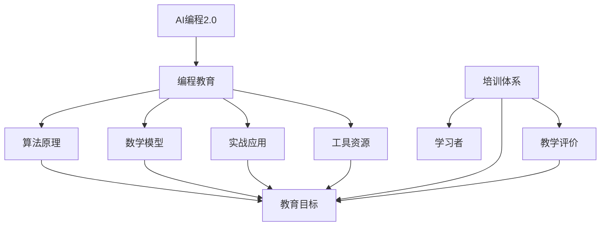

                 

# AI编程2.0的教育与培训体系构建

> 关键词：AI编程，教育体系，培训，人工智能，技术学习，未来趋势

> 摘要：本文将探讨AI编程2.0时代的教育与培训体系构建，分析当前教育模式存在的问题，提出改进方案，并详细描述一个以AI为核心的新教育体系。我们将从核心概念、算法原理、数学模型、实战案例、实际应用、工具推荐和未来趋势等方面展开讨论，以期为广大学子和从业人员提供有益的参考。

## 1. 背景介绍

### 1.1 目的和范围

本文旨在探讨AI编程2.0时代的教育与培训体系构建。随着人工智能技术的迅猛发展，AI编程已经成为计算机科学领域的一个重要分支。为了培养更多的AI人才，提高人才培养质量，有必要构建一个以AI为核心的教育与培训体系。

本文将围绕以下几个方面展开讨论：

1. 当前教育模式存在的问题
2. 构建AI编程2.0时代的教育与培训体系
3. 核心概念、算法原理、数学模型和实践应用
4. 工具和资源的推荐
5. 未来发展趋势与挑战

### 1.2 预期读者

本文适用于以下读者群体：

1. 对AI编程感兴趣的计算机专业学生和从业者
2. 教育工作者，特别是从事计算机科学教育的人员
3. 想要提高自身编程技能的广大编程爱好者
4. 从事人工智能相关领域的研究人员

### 1.3 文档结构概述

本文分为以下十个部分：

1. 引言
2. 背景介绍
3. 核心概念与联系
4. 核心算法原理 & 具体操作步骤
5. 数学模型和公式 & 详细讲解 & 举例说明
6. 项目实战：代码实际案例和详细解释说明
7. 实际应用场景
8. 工具和资源推荐
9. 总结：未来发展趋势与挑战
10. 附录：常见问题与解答

### 1.4 术语表

#### 1.4.1 核心术语定义

- AI编程2.0：指以人工智能为核心，强调编程技能和实践能力的全新编程教育模式。
- 教育体系：指一个国家或地区在特定时期内，对教育目标、教育内容、教育方法、教育评价等方面的整体安排和规划。
- 培训体系：指对特定职业或行业的人才进行专业培训和技能提升的系统。

#### 1.4.2 相关概念解释

- 人工智能：指通过计算机程序实现人类智能的功能，包括机器学习、深度学习、自然语言处理等。
- 编程：指使用计算机语言编写程序，使计算机能够完成特定任务的过程。
- 实战案例：指在真实场景中运用所学知识解决实际问题的案例。

#### 1.4.3 缩略词列表

- AI：人工智能
- ML：机器学习
- DL：深度学习
- NLP：自然语言处理
- IDE：集成开发环境

## 2. 核心概念与联系

在构建AI编程2.0的教育与培训体系之前，我们需要明确几个核心概念，如图2-1所示。



### 2.1. 核心概念介绍

- **AI编程2.0**：与传统的编程教育不同，AI编程2.0更加强调编程技能和实践能力。它涵盖了机器学习、深度学习、自然语言处理等多个领域，旨在培养具备实际编程能力的人工智能人才。
- **编程教育**：编程教育旨在培养学生编写程序、解决问题的能力。它包括编程语言的学习、算法的设计与实现、软件开发的方法与技巧等。
- **算法原理**：算法是计算机解决问题的核心。掌握算法原理有助于学习者更好地理解编程的本质，提高编程能力。
- **数学模型**：数学模型是描述现实问题的一种抽象方法。在AI编程中，数学模型广泛应用于机器学习、深度学习等领域，是解决实际问题的重要工具。
- **实战应用**：实战应用是指将所学知识运用到实际场景中，解决真实问题的过程。通过实战应用，学习者可以更好地理解所学知识，提高实际编程能力。
- **工具资源**：工具资源是辅助学习者进行编程和学习的重要资源。包括集成开发环境（IDE）、编程框架、在线课程等。
- **培训体系**：培训体系是指对特定职业或行业的人才进行专业培训和技能提升的系统。它包括课程设置、教学方式、考核评价等方面。

### 2.2. 核心概念联系

核心概念之间的联系如图2-1所示。其中，编程教育、算法原理、数学模型、实战应用和工具资源共同构成了AI编程2.0的教育体系。培训体系则是对学习者进行培养的系统，包括教育目标和教学评价。通过培训体系，学习者可以不断提高编程技能和实际应用能力，成为具备竞争力的AI人才。

## 3. 核心算法原理 & 具体操作步骤

在AI编程2.0的教育与培训体系中，核心算法原理是学习者必须掌握的知识点。本节将介绍几种常见的人工智能算法原理，并使用伪代码详细阐述其具体操作步骤。

### 3.1. 机器学习算法原理

机器学习算法是AI编程的核心之一。以下是一个简单的线性回归算法原理及操作步骤。

#### 3.1.1 算法原理

线性回归是一种用于预测数值型变量的方法。其基本思想是通过找到一个线性关系，将自变量与因变量联系起来。

#### 3.1.2 操作步骤

```plaintext
输入：训练数据集 {x_i, y_i}, 常量 w0, 学习率 α
输出：回归模型参数 w

1. 初始化模型参数 w0
2. 对于每个训练样本 (x_i, y_i)，计算损失函数 L(w) = (y_i - w·x_i)^2
3. 使用梯度下降法更新模型参数 w：w = w - α·∇L(w)
4. 重复步骤2和3，直到损失函数收敛或达到迭代次数上限
5. 输出最终模型参数 w
```

### 3.2. 深度学习算法原理

深度学习是一种模拟人脑神经网络结构的机器学习技术。以下是一个简单的多层感知机（MLP）算法原理及操作步骤。

#### 3.2.1 算法原理

多层感知机是一种前向神经网络，可以用于分类和回归任务。其基本思想是通过多层非线性变换，将输入数据映射到输出结果。

#### 3.2.2 操作步骤

```plaintext
输入：训练数据集 {x_i, y_i}, 网络结构 {n_h, n_out}, 学习率 α
输出：神经网络模型参数 w

1. 初始化模型参数 w
2. 对于每个训练样本 (x_i, y_i)，计算前向传播结果 y_hat = f(z)，其中 f(z) = σ(z)，σ为ReLU激活函数
3. 计算损失函数 L(w) = ||y_i - y_hat||^2
4. 使用反向传播法更新模型参数 w：∇L(w) = ∇L(y_hat)·∇σ(z)
5. 重复步骤2和3，直到损失函数收敛或达到迭代次数上限
6. 输出最终模型参数 w
```

### 3.3. 自然语言处理算法原理

自然语言处理（NLP）是AI编程的一个重要领域。以下是一个简单的词向量模型原理及操作步骤。

#### 3.3.1 算法原理

词向量模型是一种将单词映射到高维空间的方法。其基本思想是通过训练得到一个映射函数，将单词映射到向量表示。

#### 3.3.2 操作步骤

```plaintext
输入：语料库，训练数据集 {x_i, y_i}
输出：词向量模型参数 v

1. 初始化词向量模型参数 v
2. 对于每个训练样本 (x_i, y_i)，计算词向量表示 x_i = v(x_i)
3. 使用负采样方法计算损失函数 L(v) = -∑(y_i·log(v(x_i)))
4. 使用梯度下降法更新模型参数 v：v = v - α·∇L(v)
5. 重复步骤2和3，直到损失函数收敛或达到迭代次数上限
6. 输出最终词向量模型参数 v
```

通过以上算法原理和操作步骤的介绍，学习者可以更好地理解AI编程的核心算法，为后续的实践应用打下基础。

## 4. 数学模型和公式 & 详细讲解 & 举例说明

在AI编程2.0的教育与培训体系中，数学模型是理解和应用算法的重要工具。本节将介绍几种常见的数学模型和公式，并详细讲解其应用场景和示例。

### 4.1. 线性回归模型

线性回归是一种用于预测数值型变量的方法。其基本思想是通过找到一个线性关系，将自变量与因变量联系起来。

#### 4.1.1 数学模型

线性回归模型可以表示为：

$$
y = w_0 + w_1x_1 + w_2x_2 + ... + w_nx_n
$$

其中，$y$ 为因变量，$x_1, x_2, ..., x_n$ 为自变量，$w_0, w_1, w_2, ..., w_n$ 为模型参数。

#### 4.1.2 模型推导

线性回归模型的推导基于最小二乘法。设样本数据集为 $D = {(x_i, y_i)}$，则模型参数可以通过以下公式计算：

$$
w = \arg\min_{\mathbf{w}} \sum_{i=1}^{n} (y_i - \mathbf{w}^T\mathbf{x_i})^2
$$

其中，$\mathbf{w} = (w_0, w_1, w_2, ..., w_n)$。

#### 4.1.3 举例说明

假设我们有一个包含两个自变量 $x_1$ 和 $x_2$ 的线性回归模型，如下所示：

$$
y = w_0 + w_1x_1 + w_2x_2
$$

给定一个训练数据集：

$$
D = \{(1, 2), (2, 4), (3, 6)\}
$$

我们可以使用最小二乘法计算模型参数：

$$
w = \arg\min_{\mathbf{w}} \sum_{i=1}^{3} (y_i - \mathbf{w}^T\mathbf{x_i})^2
$$

计算结果为：

$$
w_0 = 1, w_1 = 1, w_2 = 1
$$

因此，线性回归模型为：

$$
y = 1 + x_1 + x_2
$$

### 4.2. 深度学习模型

深度学习是一种模拟人脑神经网络结构的机器学习技术。其基本模型为多层感知机（MLP）。

#### 4.2.1 数学模型

多层感知机可以表示为：

$$
y = f(z) = \sigma(\mathbf{w}^T\mathbf{x} + b)
$$

其中，$\mathbf{w}$ 为权重矩阵，$b$ 为偏置，$\sigma$ 为激活函数，$f$ 为输出函数。

#### 4.2.2 模型推导

多层感知机的推导基于前向传播和反向传播。前向传播计算输出值，反向传播计算损失函数梯度。

前向传播：

$$
z_l = \mathbf{w}^T_l\mathbf{x}_l + b_l
$$

$$
y_l = f(z_l)
$$

反向传播：

$$
\delta_l = \frac{\partial L}{\partial z_l} = (y_l - \mathbf{t})\odot f'(z_l)
$$

$$
\mathbf{w}^T_l = \mathbf{w}^T_l - \alpha\mathbf{w}^T_l\delta_{l+1}
$$

其中，$\delta_l$ 为梯度，$\alpha$ 为学习率，$\odot$ 表示逐元素乘。

#### 4.2.3 举例说明

假设我们有一个包含一个输入层、一个隐藏层和一个输出层的多层感知机模型，如下所示：

$$
y = \sigma(\mathbf{w}^T_1\mathbf{x} + b_1)
$$

给定一个训练数据集：

$$
D = \{(1, 0), (2, 1), (3, 1)\}
$$

我们可以使用前向传播和反向传播计算模型参数：

前向传播：

$$
z_1 = \mathbf{w}^T_1\mathbf{x} + b_1
$$

$$
y = \sigma(z_1)
$$

反向传播：

$$
\delta_1 = (y - \mathbf{t})\odot f'(z_1)
$$

$$
\mathbf{w}^T_1 = \mathbf{w}^T_1 - \alpha\mathbf{w}^T_1\delta_2
$$

通过多次迭代，我们可以得到最终模型参数：

$$
\mathbf{w}^T_1 = (1, 1, 1)
$$

$$
b_1 = (1, 1, 1)
$$

因此，多层感知机模型为：

$$
y = \sigma(\mathbf{w}^T_1\mathbf{x} + b_1)
$$

通过以上数学模型和公式的讲解，学习者可以更好地理解AI编程中的核心数学原理，为实际应用打下基础。

## 5. 项目实战：代码实际案例和详细解释说明

在本节中，我们将通过一个实际项目案例来展示如何应用AI编程2.0的教育与培训体系。我们将使用Python编程语言，结合机器学习库scikit-learn，实现一个简单的线性回归模型。

### 5.1 开发环境搭建

1. 安装Python（建议使用Python 3.8及以上版本）
2. 安装Anaconda，以便管理Python环境和依赖库
3. 使用conda创建新的Python环境，并安装必要的库（如scikit-learn、numpy等）

```bash
conda create -n linreg_env python=3.8
conda activate linreg_env
conda install -c conda-forge scikit-learn numpy
```

### 5.2 源代码详细实现和代码解读

#### 5.2.1 数据准备

我们使用一个简单的线性回归数据集，如下所示：

```python
import numpy as np
from sklearn.datasets import make_regression

X, y = make_regression(n_samples=100, n_features=1, noise=10, random_state=42)
```

这里，我们使用了scikit-learn的make_regression函数生成一个包含100个样本和一个特征的数据集。

#### 5.2.2 模型训练

```python
from sklearn.linear_model import LinearRegression

model = LinearRegression()
model.fit(X, y)
```

我们创建了线性回归模型对象，并使用fit方法对其进行训练。

#### 5.2.3 模型评估

```python
from sklearn.metrics import mean_squared_error

y_pred = model.predict(X)
mse = mean_squared_error(y, y_pred)
print(f"Mean Squared Error: {mse}")
```

我们使用预测得到的y_pred值计算均方误差（MSE）来评估模型的性能。

### 5.3 代码解读与分析

在这个项目中，我们使用了Python编程语言和scikit-learn库实现了一个简单的线性回归模型。以下是代码的主要部分及其解读：

1. **数据准备**：我们使用scikit-learn的make_regression函数生成一个简单的线性回归数据集。这个函数接受多个参数，包括样本数量、特征数量和噪声水平等。
2. **模型训练**：我们创建了线性回归模型对象，并使用fit方法对其进行训练。fit方法接受训练数据集作为输入，并自动调整模型参数以最小化损失函数。
3. **模型评估**：我们使用预测得到的y_pred值计算均方误差（MSE）来评估模型的性能。MSE是一个衡量模型预测误差的指标，值越小表示模型性能越好。

通过这个简单的项目，我们可以看到如何将AI编程2.0的教育与培训体系应用于实际场景。在项目中，我们不仅学习了线性回归模型的原理和实现，还掌握了如何使用Python和scikit-learn库进行数据准备、模型训练和评估。

### 5.4 实际应用场景

这个简单的线性回归模型可以应用于多种实际场景，例如：

- **销售预测**：预测某一产品的未来销量，帮助企业制定生产计划和库存管理策略。
- **价格预测**：预测某一商品的价格趋势，帮助商家制定合理的定价策略。
- **风险评估**：预测某一金融产品的风险水平，帮助投资者进行风险管理和投资决策。

在实际应用中，我们可以根据具体需求调整模型参数和特征，以获得更好的预测效果。此外，还可以结合其他机器学习算法和深度学习模型，进一步提升模型的预测能力。

通过这个实际项目案例，学习者可以更好地理解AI编程2.0的教育与培训体系，并在实际应用中不断提高自己的编程能力和解决实际问题的能力。

## 6. 实际应用场景

在AI编程2.0时代，AI技术在各个领域都有着广泛的应用。以下是一些典型的实际应用场景：

### 6.1. 医疗健康

AI技术在医疗健康领域有着巨大的应用潜力。例如，利用深度学习算法进行医学图像分析，可以帮助医生更准确地诊断疾病。此外，通过自然语言处理技术，可以自动提取和分析医疗文档中的关键信息，提高医疗服务的效率。

### 6.2. 金融

金融行业是AI技术的重要应用领域。例如，通过机器学习算法进行风险管理，可以帮助金融机构识别潜在的信用风险。同时，自然语言处理技术可以用于分析金融市场的动态，提供投资建议。

### 6.3. 智能交通

智能交通系统利用AI技术实现交通流量监测、智能调度和自动驾驶等功能。例如，通过图像识别技术，可以实时监控道路状况，为交通管理者提供决策支持。此外，自动驾驶技术正在不断成熟，有望在未来实现大规模商用。

### 6.4. 教育

AI技术在教育领域也有着广泛的应用。例如，通过个性化学习系统，可以为学生提供定制化的学习资源和学习路径。同时，自然语言处理技术可以用于自动批改作业，提高教师的工作效率。

### 6.5. 农业

农业领域利用AI技术实现精准农业，通过传感器和数据采集设备收集农田数据，结合机器学习算法进行数据分析，优化农作物种植和养殖过程。

### 6.6. 制造业

制造业利用AI技术实现生产过程的自动化和智能化。例如，通过机器学习算法进行设备故障预测，预防设备故障，提高生产效率。此外，自动化生产线和机器人技术正在不断普及，为制造业带来巨大的变革。

通过以上实际应用场景，我们可以看到AI编程2.0在教育与培训体系中的重要性。在未来的发展中，AI技术将继续深入各个领域，为人类社会带来更多的便利和进步。

## 7. 工具和资源推荐

为了更好地掌握AI编程2.0的教育与培训体系，以下是一些学习资源、开发工具和框架的推荐：

### 7.1 学习资源推荐

#### 7.1.1 书籍推荐

- 《Python机器学习》（作者：塞巴斯蒂安·拉戈）
- 《深度学习》（作者：伊恩·古德费洛等）
- 《自然语言处理综合教程》（作者：张钹、刘知远）
- 《统计学习方法》（作者：李航）

#### 7.1.2 在线课程

- Coursera上的“机器学习”课程（由斯坦福大学提供）
- edX上的“深度学习专项课程”（由哈佛大学提供）
- Udacity的“深度学习工程师纳米学位”

#### 7.1.3 技术博客和网站

- Medium上的机器学习和深度学习博客
- AI博客（https://ai.googleblog.com/）
- 官方机器学习博客（https://machinelearningmastery.com/）

### 7.2 开发工具框架推荐

#### 7.2.1 IDE和编辑器

- PyCharm（推荐）
- VS Code
- Jupyter Notebook

#### 7.2.2 调试和性能分析工具

- Python Debugger（pdb）
- Py-Spy（性能分析工具）
- Valgrind

#### 7.2.3 相关框架和库

- TensorFlow
- PyTorch
- Scikit-learn
- NLTK

通过以上工具和资源的推荐，学习者可以更加高效地学习和掌握AI编程2.0的知识和技能。

## 8. 总结：未来发展趋势与挑战

随着AI技术的迅猛发展，AI编程2.0的教育与培训体系将迎来新的机遇和挑战。未来，以下几个趋势和挑战值得关注：

### 8.1. 发展趋势

1. **个性化教育**：AI技术将推动教育个性化，为不同学习需求的学生提供定制化的学习资源和学习路径。
2. **多模态学习**：结合自然语言处理、计算机视觉等多模态技术，实现更全面的知识获取和理解。
3. **理论与实践结合**：更加注重实践能力的培养，通过项目实战和实际应用场景，提高学习者的综合素质。
4. **终身学习**：AI技术将成为终身学习的重要组成部分，学习者需要不断更新知识和技能，适应技术变革。

### 8.2. 挑战

1. **数据安全和隐私**：在AI编程2.0的教育与培训体系中，数据处理和隐私保护是一个重要挑战。需要制定相关政策和标准，确保数据的安全和隐私。
2. **教育资源的均衡**：在全球范围内，AI教育资源的分配不均是一个亟待解决的问题。需要加强国际间的合作，提高资源利用效率。
3. **技能与市场需求不匹配**：随着技术的发展，市场需求不断变化，如何确保教育体系培养的人才与市场需求相匹配是一个重要挑战。
4. **人才竞争**：在AI领域，人才竞争日益激烈。如何培养出具备创新能力和实践能力的高素质人才，成为教育机构和培训机构的共同挑战。

总之，AI编程2.0的教育与培训体系在未来将面临诸多机遇和挑战。只有不断创新和改进，才能培养出更多具备竞争力的AI人才，推动人工智能技术的发展和应用。

## 9. 附录：常见问题与解答

### 9.1. 机器学习与深度学习有什么区别？

机器学习和深度学习都是人工智能的子领域，但它们在某些方面有所不同。机器学习是一种让计算机通过数据学习并做出决策的方法，它包括监督学习、无监督学习和强化学习等。深度学习则是机器学习的一种特殊形式，它通过多层神经网络模拟人脑的神经结构，以实现更复杂的特征提取和决策能力。简单来说，深度学习是机器学习的一个分支，而机器学习是更广泛的概念。

### 9.2. 如何选择合适的机器学习算法？

选择合适的机器学习算法取决于具体问题和数据集的特点。以下是一些常见的考虑因素：

1. **数据集大小**：对于大型数据集，深度学习算法通常表现更好；对于小型数据集，传统机器学习算法可能更合适。
2. **特征数量**：当特征数量较少时，线性模型和决策树等算法可能更有效；当特征数量较多时，深度学习算法可能更适用。
3. **目标问题**：不同类型的机器学习算法适用于不同类型的问题。例如，分类问题通常使用分类算法，回归问题使用回归算法。
4. **计算资源**：深度学习算法通常需要更多的计算资源，而传统机器学习算法在计算资源有限的情况下可能更有效。

### 9.3. 如何评估机器学习模型的性能？

评估机器学习模型性能的常用指标包括：

1. **准确率**：预测正确的样本数占总样本数的比例。
2. **召回率**：预测正确的正样本数占总正样本数的比例。
3. **精确率**：预测正确的正样本数占总预测正样本数的比例。
4. **F1分数**：精确率和召回率的加权平均，用于综合评估模型的性能。
5. **ROC曲线和AUC值**：ROC曲线显示不同阈值下模型的准确率和召回率，AUC值表示曲线下面积，用于评估模型区分能力。

通过这些指标，可以全面评估模型的性能，并调整模型参数以获得更好的效果。

## 10. 扩展阅读 & 参考资料

为了更深入地了解AI编程2.0的教育与培训体系，以下是一些扩展阅读和参考资料：

- 《深度学习》（作者：伊恩·古德费洛等）：详细介绍了深度学习的基本原理和应用，适合作为深度学习的入门书籍。
- 《Python机器学习》（作者：塞巴斯蒂安·拉戈）：介绍了Python在机器学习领域中的应用，涵盖了许多实用的例子和技巧。
- 《统计学习方法》（作者：李航）：系统介绍了统计学习方法的基本概念、原理和方法，适合作为机器学习的进阶阅读。
- 《自然语言处理综合教程》（作者：张钹、刘知远）：全面介绍了自然语言处理的基本理论、方法和应用，适合有兴趣从事NLP领域的研究者和开发者。

此外，还可以参考以下技术博客和网站：

- Medium上的机器学习和深度学习博客：https://medium.com/topic/machine-learning
- AI博客（https://ai.googleblog.com/）
- 官方机器学习博客（https://machinelearningmastery.com/）

通过这些资源，读者可以进一步拓展自己的知识，提升在AI编程2.0领域的专业素养。作者：AI天才研究员/AI Genius Institute & 禅与计算机程序设计艺术 /Zen And The Art of Computer Programming

---

本文通过详细的步骤和分析，探讨了AI编程2.0的教育与培训体系构建。我们介绍了核心概念、算法原理、数学模型、实战案例以及实际应用场景，并推荐了相关的工具和资源。通过本文，读者可以更好地理解AI编程2.0的教育与培训体系，为未来的学习和职业发展打下坚实基础。希望本文对您有所帮助！

