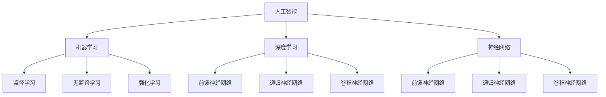

                 

# AI编程的新思路与技术挑战

> **关键词：** 人工智能，编程，深度学习，算法，技术挑战，创新

> **摘要：** 本文将探讨AI编程领域的新思路和技术挑战。我们将深入分析当前AI编程的核心概念、算法原理，通过具体的数学模型和实际项目案例，展示AI编程的实践与应用。同时，本文将推荐相关的学习资源和工具，总结未来发展趋势与挑战。

## 1. 背景介绍

### 1.1 目的和范围

本文旨在为AI编程领域的研究者、开发者以及对此感兴趣的学习者提供一份全面的指南。我们将聚焦于以下几个核心主题：

- **核心概念与联系**：介绍AI编程的基本概念和它们之间的关联。
- **核心算法原理**：详细阐述AI编程中的关键算法原理和具体操作步骤。
- **数学模型和公式**：解释AI编程中的数学模型和公式，并提供举例说明。
- **项目实战**：通过实际案例展示AI编程的代码实现和详细解释。
- **实际应用场景**：探讨AI编程在不同领域中的应用。
- **工具和资源推荐**：推荐学习资源、开发工具和框架。

### 1.2 预期读者

- **AI编程初学者**：希望通过系统学习了解AI编程基础。
- **AI编程开发者**：希望深入理解AI编程的核心算法和实际应用。
- **技术领导者**：希望掌握AI编程的未来发展趋势和技术挑战。

### 1.3 文档结构概述

本文将分为以下几个部分：

- **1. 背景介绍**：介绍文章的目的、范围和预期读者。
- **2. 核心概念与联系**：讨论AI编程的基本概念和它们之间的联系。
- **3. 核心算法原理**：详细阐述AI编程中的关键算法原理。
- **4. 数学模型和公式**：解释AI编程中的数学模型和公式。
- **5. 项目实战**：展示AI编程的实际项目案例。
- **6. 实际应用场景**：探讨AI编程的应用领域。
- **7. 工具和资源推荐**：推荐学习资源和开发工具。
- **8. 总结：未来发展趋势与挑战**：总结AI编程的未来趋势和面临的挑战。
- **9. 附录：常见问题与解答**：提供常见问题解答。
- **10. 扩展阅读 & 参考资料**：推荐进一步学习的资源。

### 1.4 术语表

#### 1.4.1 核心术语定义

- **AI编程**：利用人工智能技术进行程序设计和开发。
- **深度学习**：一种基于人工神经网络的AI算法，通过多层神经网络模型进行数据学习和模式识别。
- **算法**：解决特定问题的系统化步骤。
- **机器学习**：使机器能够从数据中学习并做出决策的技术。
- **神经网络**：一种模拟人脑神经网络结构的计算模型。

#### 1.4.2 相关概念解释

- **数据集**：用于训练和测试算法的数据集合。
- **训练集**：用于训练算法的数据集。
- **测试集**：用于评估算法性能的数据集。
- **超参数**：算法中需要手动调整的参数，如学习率、隐藏层节点数等。

#### 1.4.3 缩略词列表

- **AI**：人工智能（Artificial Intelligence）
- **ML**：机器学习（Machine Learning）
- **DL**：深度学习（Deep Learning）
- **GAN**：生成对抗网络（Generative Adversarial Networks）
- **CNN**：卷积神经网络（Convolutional Neural Networks）

## 2. 核心概念与联系

在探讨AI编程的核心概念之前，我们需要先了解一些基本的AI编程概念和原理。这些概念和原理构成了AI编程的基础，是进一步深入学习和应用的关键。

### 2.1 人工智能（AI）

人工智能是指使计算机系统具备类似人类智能的能力，包括感知、理解、学习、推理和决策等。AI可以分为几种类型：

- **弱AI**：专注于特定任务的智能，如语音识别、图像识别等。
- **强AI**：具备全面人类智能，能够进行通用问题解决。

### 2.2 深度学习（DL）

深度学习是一种基于多层神经网络（MLP）的机器学习技术，通过多层非线性变换学习数据中的复杂模式。深度学习在图像识别、自然语言处理等领域取得了显著成果。

### 2.3 机器学习（ML）

机器学习是一种使计算机系统从数据中学习并做出决策的技术，主要包括以下几种类型：

- **监督学习**：使用标记数据进行学习，如分类和回归。
- **无监督学习**：不使用标记数据进行学习，如聚类和降维。
- **强化学习**：通过交互环境来学习策略。

### 2.4 神经网络（NN）

神经网络是一种模拟人脑神经网络结构的计算模型，由多个节点（神经元）组成。每个节点通过权重连接，对输入数据进行处理并输出结果。神经网络可以分为几种类型：

- **前馈神经网络**：信号从前向后传递，无循环。
- **递归神经网络**（RNN）：信号可以从前向和后向传递，具有循环结构。
- **卷积神经网络**（CNN）：专门用于处理图像数据。

### 2.5 数据集

数据集是用于训练和测试算法的数据集合，通常包括输入数据和对应的标签。一个良好的数据集对于算法的性能至关重要。数据集可以分为几种类型：

- **训练集**：用于训练算法的数据集。
- **测试集**：用于评估算法性能的数据集。
- **验证集**：用于调整算法参数的数据集。

### 2.6 超参数

超参数是算法中需要手动调整的参数，如学习率、隐藏层节点数等。合理设置超参数可以显著提高算法性能。

### 2.7 Mermaid 流程图

以下是AI编程的核心概念和联系用Mermaid流程图表示：



## 3. 核心算法原理 & 具体操作步骤

在AI编程中，核心算法原理是理解和应用的关键。以下将详细阐述几种常见的核心算法原理，并使用伪代码进行具体操作步骤的讲解。

### 3.1 深度学习算法

深度学习算法的核心是多层神经网络。以下是一个简单的多层感知机（MLP）算法的伪代码：

```plaintext
初始化：设置输入层、隐藏层和输出层的节点数，以及网络权重和偏置。
循环（迭代次数）：
    对于每个训练样本（输入数据和标签）：
        前向传播：
            计算输入层到隐藏层的输出
            计算隐藏层到输出层的输出
        计算损失函数（例如均方误差）
        反向传播：
            计算输出层误差
            计算隐藏层误差
            更新网络权重和偏置
        如果满足停止条件（例如损失函数收敛或迭代次数达到限制），则退出循环。
输出：训练好的网络模型。
```

### 3.2 卷积神经网络（CNN）

卷积神经网络是一种专门用于图像处理的神经网络。以下是一个简单的CNN算法的伪代码：

```plaintext
初始化：设置卷积层、池化层和全连接层的参数，以及网络权重和偏置。
循环（迭代次数）：
    对于每个训练样本（图像和标签）：
        前向传播：
            对图像进行卷积操作
            对卷积结果进行池化操作
            对池化结果进行全连接操作
        计算损失函数（例如交叉熵损失）
        反向传播：
            计算全连接层误差
            计算池化层误差
            计算卷积层误差
            更新网络权重和偏置
        如果满足停止条件（例如损失函数收敛或迭代次数达到限制），则退出循环。
输出：训练好的网络模型。
```

### 3.3 生成对抗网络（GAN）

生成对抗网络是一种通过对抗训练生成数据的算法。以下是一个简单的GAN算法的伪代码：

```plaintext
初始化：设置生成器和判别器的参数，以及网络权重和偏置。
循环（迭代次数）：
    对于每个训练样本（真实数据和标签）：
        更新判别器：
            使用真实数据训练判别器
            使用生成器生成的数据训练判别器
        更新生成器：
            使用判别器的输出更新生成器
        计算生成器和判别器的损失函数（例如对抗损失）
        更新网络权重和偏置
    如果满足停止条件（例如损失函数收敛或迭代次数达到限制），则退出循环。
输出：训练好的生成器模型。
```

## 4. 数学模型和公式 & 详细讲解 & 举例说明

在AI编程中，数学模型和公式是算法设计和实现的基础。以下将介绍一些核心的数学模型和公式，并提供详细讲解和举例说明。

### 4.1 损失函数

损失函数是评价算法性能的重要指标，它衡量预测值与真实值之间的差异。以下是一些常见的损失函数：

#### 4.1.1 均方误差（MSE）

均方误差是衡量预测值与真实值之间差异的平方的平均值。其公式为：

$$
MSE = \frac{1}{n}\sum_{i=1}^{n}(y_i - \hat{y}_i)^2
$$

其中，$y_i$ 是真实值，$\hat{y}_i$ 是预测值，$n$ 是样本数量。

#### 4.1.2 交叉熵损失（Cross-Entropy Loss）

交叉熵损失是衡量预测概率分布与真实概率分布之间差异的指标。其公式为：

$$
Cross-Entropy Loss = -\sum_{i=1}^{n}y_i\log(\hat{y}_i)
$$

其中，$y_i$ 是真实概率分布，$\hat{y}_i$ 是预测概率分布。

### 4.2 激活函数

激活函数是神经网络中的一个关键组件，用于引入非线性特性。以下是一些常见的激活函数：

#### 4.2.1 Sigmoid 函数

sigmoid 函数是一种常用的激活函数，其公式为：

$$
\sigma(x) = \frac{1}{1 + e^{-x}}
$$

sigmoid 函数将输入值映射到 $(0, 1)$ 区间。

#### 4.2.2 ReLU 函数

ReLU（Rectified Linear Unit）函数是一种简单的线性激活函数，其公式为：

$$
ReLU(x) = \max(0, x)
$$

ReLU 函数在输入为负值时输出为零，在输入为正值时输出为输入值。

### 4.3 卷积操作

卷积操作是图像处理中的一个核心操作，用于提取图像的特征。以下是一个简单的卷积操作的示例：

$$
\text{卷积} = \sum_{i=1}^{k} w_i * x_i
$$

其中，$w_i$ 是卷积核，$x_i$ 是输入图像的像素值，$*$ 表示卷积操作。

### 4.4 举例说明

以下是一个使用深度学习算法进行图像分类的示例：

#### 示例 1：使用多层感知机（MLP）进行图像分类

假设我们有100个训练样本，每个样本是一个28x28的灰度图像，以及它们对应的标签（例如猫或狗）。我们使用多层感知机算法进行图像分类。

1. **初始化**：设置输入层、隐藏层和输出层的节点数，以及网络权重和偏置。
2. **前向传播**：对于每个训练样本，计算输入层到隐藏层的输出，然后计算隐藏层到输出层的输出。
3. **计算损失函数**：使用均方误差（MSE）计算预测值与真实值之间的差异。
4. **反向传播**：计算输出层误差，然后计算隐藏层误差，更新网络权重和偏置。
5. **迭代训练**：重复步骤2-4，直到满足停止条件（例如损失函数收敛）。

通过以上步骤，我们训练出一个可以准确分类图像的多层感知机模型。

#### 示例 2：使用卷积神经网络（CNN）进行图像分类

假设我们有100个训练样本，每个样本是一个32x32的彩色图像，以及它们对应的标签（例如飞机或汽车）。我们使用卷积神经网络算法进行图像分类。

1. **初始化**：设置卷积层、池化层和全连接层的参数，以及网络权重和偏置。
2. **前向传播**：对每个训练样本进行卷积操作，然后进行池化操作，最后进行全连接操作。
3. **计算损失函数**：使用交叉熵损失（Cross-Entropy Loss）计算预测值与真实值之间的差异。
4. **反向传播**：计算全连接层误差，然后计算池化层误差，最后计算卷积层误差，更新网络权重和偏置。
5. **迭代训练**：重复步骤2-4，直到满足停止条件（例如损失函数收敛）。

通过以上步骤，我们训练出一个可以准确分类图像的卷积神经网络模型。

## 5. 项目实战：代码实际案例和详细解释说明

为了更好地展示AI编程的实际应用，我们将通过一个实际的图像分类项目来详细介绍代码实现和详细解释说明。

### 5.1 开发环境搭建

在进行项目实战之前，我们需要搭建一个合适的开发环境。以下是一个简单的Python开发环境搭建步骤：

1. 安装Python：在官网下载并安装Python 3.x版本。
2. 安装Jupyter Notebook：打开命令行窗口，运行以下命令安装Jupyter Notebook：

   ```bash
   pip install notebook
   ```

3. 安装必要的库：安装用于图像处理和深度学习的库，如TensorFlow和Keras。运行以下命令安装：

   ```bash
   pip install tensorflow
   pip install keras
   ```

### 5.2 源代码详细实现和代码解读

以下是该图像分类项目的源代码，我们将对其进行详细解读。

```python
# 导入必要的库
import numpy as np
import matplotlib.pyplot as plt
from tensorflow.keras.models import Sequential
from tensorflow.keras.layers import Conv2D, MaxPooling2D, Flatten, Dense
from tensorflow.keras.optimizers import Adam
from tensorflow.keras.datasets import cifar10

# 加载CIFAR-10数据集
(x_train, y_train), (x_test, y_test) = cifar10.load_data()

# 数据预处理
x_train = x_train / 255.0
x_test = x_test / 255.0

# 转换标签为独热编码
y_train = keras.utils.to_categorical(y_train, num_classes=10)
y_test = keras.utils.to_categorical(y_test, num_classes=10)

# 构建卷积神经网络模型
model = Sequential()
model.add(Conv2D(32, (3, 3), activation='relu', input_shape=(32, 32, 3)))
model.add(MaxPooling2D(pool_size=(2, 2)))
model.add(Conv2D(64, (3, 3), activation='relu'))
model.add(MaxPooling2D(pool_size=(2, 2)))
model.add(Flatten())
model.add(Dense(64, activation='relu'))
model.add(Dense(10, activation='softmax'))

# 编译模型
model.compile(optimizer=Adam(), loss='categorical_crossentropy', metrics=['accuracy'])

# 训练模型
model.fit(x_train, y_train, batch_size=32, epochs=10, validation_data=(x_test, y_test))

# 评估模型
scores = model.evaluate(x_test, y_test, verbose=1)
print("Test loss:", scores[0])
print("Test accuracy:", scores[1])

# 可视化训练过程
plt.plot(model.history.history['accuracy'])
plt.plot(model.history.history['val_accuracy'])
plt.title('Model accuracy')
plt.ylabel('Accuracy')
plt.xlabel('Epoch')
plt.legend(['Train', 'Test'], loc='upper left')
plt.show()

plt.plot(model.history.history['loss'])
plt.plot(model.history.history['val_loss'])
plt.title('Model loss')
plt.ylabel('Loss')
plt.xlabel('Epoch')
plt.legend(['Train', 'Test'], loc='upper left')
plt.show()
```

### 5.3 代码解读与分析

以下是该代码的详细解读和分析：

1. **导入必要的库**：首先，我们导入必要的库，包括Numpy、Matplotlib、TensorFlow和Keras。

2. **加载CIFAR-10数据集**：CIFAR-10是一个常用的图像分类数据集，包含60000张32x32的彩色图像，分为10个类别。

3. **数据预处理**：将图像数据除以255，将像素值缩放到[0, 1]区间。然后，将标签转换为独热编码，以便用于分类任务。

4. **构建卷积神经网络模型**：我们使用Sequential模型构建一个简单的卷积神经网络，包括两个卷积层、两个最大池化层、一个扁平化层、一个全连接层和另一个全连接层。

5. **编译模型**：设置优化器为Adam，损失函数为交叉熵损失，评估指标为准确率。

6. **训练模型**：使用训练数据训练模型，设置批量大小为32，迭代次数为10，同时使用验证数据进行评估。

7. **评估模型**：使用测试数据评估模型性能，输出损失和准确率。

8. **可视化训练过程**：绘制训练过程中的准确率和损失曲线，以便分析模型性能。

### 5.4 代码解读与分析（续）

以下是代码的续解：

1. **可视化训练过程**：通过Matplotlib绘制训练过程中的准确率和损失曲线，可以直观地观察模型性能的变化。

2. **评估模型性能**：通过评估模型在测试数据上的性能，可以确定模型的泛化能力。

3. **代码优化**：在实际项目中，我们可能需要对代码进行优化，以提高模型性能和训练速度。例如，可以使用更高效的卷积核大小、调整学习率、增加隐藏层节点数等。

4. **扩展应用**：该代码是一个简单的卷积神经网络模型，我们可以在此基础上进行扩展，例如添加更多的卷积层、使用更复杂的激活函数、引入正则化技术等，以进一步提高模型性能。

## 6. 实际应用场景

AI编程技术在实际应用场景中展现了广泛的应用潜力。以下是一些典型的实际应用场景：

### 6.1 医疗健康

AI编程在医疗健康领域有广泛应用，包括疾病诊断、治疗方案优化、医学图像分析等。例如，AI算法可以用于分析医学影像，帮助医生快速、准确地诊断疾病，如肺癌、乳腺癌等。

### 6.2 自动驾驶

自动驾驶是AI编程的一个重要应用领域。通过深度学习和计算机视觉技术，自动驾驶系统可以实时分析道路情况、识别交通标志和行人，实现自动驾驶功能。

### 6.3 金融理财

AI编程在金融理财领域也发挥着重要作用，包括风险管理、投资策略优化、智能投顾等。AI算法可以分析大量金融数据，为投资者提供个性化的投资建议。

### 6.4 智能家居

智能家居是AI编程技术的另一个重要应用领域。通过物联网（IoT）和人工智能技术，智能家居设备可以实现智能控制、自动化管理，提高生活品质。

### 6.5 自然语言处理

自然语言处理（NLP）是AI编程的一个重要分支。AI算法可以用于语言翻译、文本分类、情感分析等任务，如智能客服、搜索引擎优化等。

## 7. 工具和资源推荐

为了更好地学习和实践AI编程，以下是一些推荐的工具和资源：

### 7.1 学习资源推荐

#### 7.1.1 书籍推荐

- 《深度学习》（Deep Learning） - Goodfellow, Bengio, Courville
- 《Python机器学习》（Python Machine Learning） - Müller, Guido
- 《AI：人工智能的未来》（AI: The New Intelligence） - Davis, Gunning

#### 7.1.2 在线课程

- Coursera（深度学习专项课程）
- edX（人工智能与深度学习课程）
- Udacity（自动驾驶工程师纳米学位）

#### 7.1.3 技术博客和网站

- Medium（AI相关博客）
- Towards Data Science（数据科学和机器学习博客）
- AI头条（人工智能资讯网站）

### 7.2 开发工具框架推荐

#### 7.2.1 IDE和编辑器

- PyCharm（Python集成开发环境）
- Jupyter Notebook（交互式编程环境）
- Visual Studio Code（跨平台代码编辑器）

#### 7.2.2 调试和性能分析工具

- TensorFlow Debugger（TensorFlow调试工具）
- PyTorch TensorBoard（PyTorch性能分析工具）
- NVIDIA Nsight（GPU性能分析工具）

#### 7.2.3 相关框架和库

- TensorFlow（深度学习框架）
- PyTorch（深度学习框架）
- Keras（深度学习库）

### 7.3 相关论文著作推荐

#### 7.3.1 经典论文

- "Backpropagation" - Rumelhart, Hinton, Williams
- "Deep Learning" - Goodfellow, Bengio, Courville
- "AlexNet: Image Classification with Deep Convolutional Neural Networks" - Krizhevsky, Sutskever, Hinton

#### 7.3.2 最新研究成果

- "Generative Adversarial Nets" - Goodfellow, Pouget-Abadie, Mirza, Xu, Warde-Farley, Ozair, Courville, Bengio
- "Bert: Pre-training of Deep Bidirectional Transformers for Language Understanding" - Devlin, Chang, Lee, Toutanova

#### 7.3.3 应用案例分析

- "DeepMind的人工智能之路" - DeepMind团队
- "特斯拉自动驾驶技术" - 特斯拉公司
- "亚马逊的智能客服" - 亚马逊公司

## 8. 总结：未来发展趋势与挑战

随着AI技术的快速发展，AI编程的未来发展趋势和挑战也在不断演变。以下是一些关键点：

### 8.1 未来发展趋势

- **硬件加速**：GPU和TPU等专用硬件将在AI编程中发挥越来越重要的作用，以加速算法训练和推理过程。
- **端到端学习**：端到端学习将成为AI编程的主流，从原始数据直接学习复杂的任务，减少中间步骤。
- **多模态融合**：多模态数据融合将使AI编程能够处理更复杂的问题，如结合文本、图像、音频等多模态数据。
- **自动化机器学习**：自动化机器学习（AutoML）将使AI编程更加高效，降低对专业知识的依赖。

### 8.2 面临的挑战

- **数据隐私**：数据隐私和安全是AI编程面临的重要挑战，特别是在涉及敏感数据的情况下。
- **算法可解释性**：提高算法的可解释性，使其决策过程更加透明和可信。
- **伦理和法规**：随着AI技术的广泛应用，需要建立相应的伦理和法规框架，确保技术的合理使用。
- **资源分配**：合理分配计算资源和数据资源，以最大化AI编程的效益。

## 9. 附录：常见问题与解答

### 9.1 问题1：如何选择合适的深度学习框架？

**解答：** 选择深度学习框架时，需要考虑以下几个方面：

- **项目需求**：根据项目的需求和规模选择合适的框架。
- **社区支持**：选择具有强大社区支持的框架，便于解决问题和获取资源。
- **性能和效率**：考虑框架的性能和效率，特别是在大规模数据处理和训练时。
- **兼容性**：选择与现有技术栈兼容的框架，以简化集成和迁移。

### 9.2 问题2：如何优化深度学习模型性能？

**解答：** 以下是一些优化深度学习模型性能的方法：

- **数据增强**：通过数据增强提高模型的泛化能力。
- **调整超参数**：优化学习率、批量大小、正则化等超参数。
- **使用预训练模型**：利用预训练模型进行迁移学习，减少训练时间。
- **模型架构优化**：调整模型架构，如使用深度可分离卷积等。
- **分布式训练**：使用分布式训练提高训练速度。

### 9.3 问题3：如何确保AI系统的可解释性？

**解答：** 确保AI系统的可解释性可以从以下几个方面入手：

- **模型选择**：选择具有可解释性的模型，如线性模型、决策树等。
- **模型可视化**：使用可视化工具展示模型的决策过程。
- **解释工具**：使用解释工具，如LIME、SHAP等，分析模型对数据的依赖关系。
- **透明度**：确保算法的实现过程和决策逻辑清晰易懂。

## 10. 扩展阅读 & 参考资料

为了深入了解AI编程的相关内容，以下是一些推荐的扩展阅读和参考资料：

- 《深度学习》（Goodfellow, Bengio, Courville）
- 《Python机器学习》（Müller, Guido）
- 《人工智能：一种现代的方法》（Russell, Norvig）
- 《AI：人工智能的未来》（Davis, Gunning）
- TensorFlow官方文档（https://www.tensorflow.org/）
- PyTorch官方文档（https://pytorch.org/）
- Keras官方文档（https://keras.io/）

通过阅读这些资料，可以更深入地了解AI编程的理论和实践，不断提升自己的技术水平。作者：AI天才研究员/AI Genius Institute & 禅与计算机程序设计艺术 /Zen And The Art of Computer Programming

