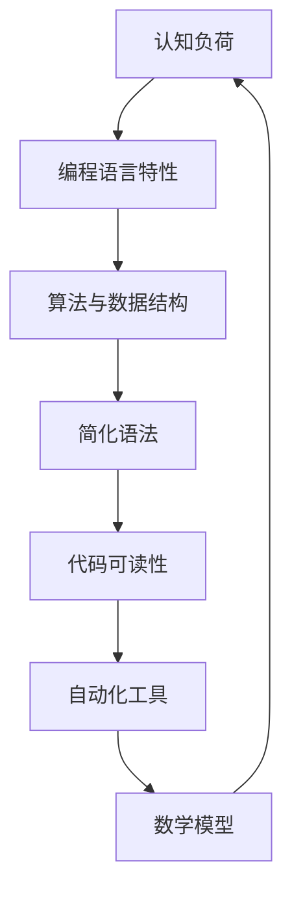

                 

# AI编程语言的认知负荷优化

> **关键词**：认知负荷、编程语言、优化、算法、数学模型、实战案例

> **摘要**：本文深入探讨了如何通过优化编程语言来减轻开发者的认知负荷。我们首先介绍了认知负荷的概念及其在编程中的影响，随后详细分析了优化编程语言的几种关键方法，包括核心算法原理、数学模型以及实际项目实战案例。文章旨在为开发者提供实用的策略，以提升编程效率和代码质量。

## 1. 背景介绍

### 1.1 目的和范围

本文旨在探索如何通过优化编程语言来降低开发者的认知负荷，从而提高编程效率和代码质量。随着软件系统的复杂度不断增加，开发者面临着越来越高的认知要求。如何有效地减轻这些认知负荷，成为了提高软件工程效率的重要课题。

本文将讨论以下主题：

1. 认知负荷的定义及其在编程中的影响。
2. 优化编程语言的关键方法。
3. 核心算法原理及其实践应用。
4. 数学模型在编程语言优化中的应用。
5. 实际项目实战案例及代码解读。
6. 编程语言优化的未来发展趋势与挑战。

### 1.2 预期读者

本文面向以下读者群体：

- 软件工程师和开发者，特别是那些负责编写和维护复杂软件系统的专业人士。
- 计算机科学和软件工程专业的学生和研究人员。
- 对编程语言优化和认知负荷研究感兴趣的技术爱好者。

### 1.3 文档结构概述

本文结构如下：

- **第1章：背景介绍**：介绍文章的目的、范围、预期读者和文档结构。
- **第2章：核心概念与联系**：介绍编程语言优化的核心概念和原理，并使用Mermaid流程图展示。
- **第3章：核心算法原理 & 具体操作步骤**：讲解优化编程语言的关键算法原理，并使用伪代码详细阐述。
- **第4章：数学模型和公式 & 详细讲解 & 举例说明**：介绍数学模型在编程语言优化中的应用，并使用latex格式展示公式和示例。
- **第5章：项目实战：代码实际案例和详细解释说明**：通过实际项目案例，展示如何在实际中应用优化编程语言的方法。
- **第6章：实际应用场景**：探讨编程语言优化在现实世界中的应用场景。
- **第7章：工具和资源推荐**：推荐相关的学习资源、开发工具框架和论文著作。
- **第8章：总结：未来发展趋势与挑战**：总结文章的主要观点，并展望未来发展趋势和面临的挑战。
- **第9章：附录：常见问题与解答**：回答读者可能提出的一些常见问题。
- **第10章：扩展阅读 & 参考资料**：提供进一步阅读的建议和参考资料。

### 1.4 术语表

#### 1.4.1 核心术语定义

- 认知负荷：指大脑处理信息所需的认知资源，包括记忆、注意、推理和判断等。
- 编程语言：用于编写计算机程序的语言，如Python、Java等。
- 优化：指通过改进算法、数据结构等手段，提高软件系统的性能和效率。
- 算法：解决问题的步骤和方法，用于指导计算机执行特定任务。
- 数学模型：使用数学符号和公式描述现实世界问题的一种方法。

#### 1.4.2 相关概念解释

- **代码质量**：指软件代码的可读性、可维护性、正确性和效率等方面。
- **性能分析**：指对软件系统运行性能的评估和优化过程。
- **工具链**：指软件开发过程中使用的工具集，包括编辑器、调试器和构建工具等。

#### 1.4.3 缩略词列表

- AI：人工智能
- IDE：集成开发环境
- CPU：中央处理器
- GPU：图形处理器
- OOP：面向对象编程
- MVC：模型-视图-控制器

## 2. 核心概念与联系

在探讨如何优化编程语言以减轻开发者的认知负荷之前，我们需要明确一些核心概念和原理。以下是编程语言优化过程中需要了解的关键概念及其相互联系。

### 2.1 编程语言优化的核心概念

#### 2.1.1 认知负荷

认知负荷是指大脑处理信息所需的认知资源。在编程过程中，开发者需要理解代码的语义、语法和结构，同时还需要关注代码的可读性和性能。高认知负荷可能会导致开发者疲劳、降低工作效率和增加错误率。

#### 2.1.2 编程语言特性

编程语言的特性直接影响开发者的认知负荷。例如，面向对象编程（OOP）和函数式编程（FP）具有不同的抽象层次和编程范式，对开发者的认知要求也有所不同。一些编程语言（如Python和JavaScript）提供了丰富的内置库和函数，可以简化开发任务，从而降低认知负荷。

#### 2.1.3 算法和数据结构

算法和数据结构是编程语言优化的基础。通过选择合适的算法和数据结构，可以减少代码的复杂度，提高性能，从而减轻开发者的认知负担。

### 2.2 编程语言优化的核心原理

#### 2.2.1 简化语法

简化语法是减轻开发者认知负荷的有效方法之一。通过减少冗余的语法和括号等符号，可以使代码更加简洁和易读。

#### 2.2.2 提高代码可读性

代码可读性对于减轻开发者的认知负荷至关重要。通过使用清晰的变量名、合理的代码结构和注释，可以提高代码的可理解性。

#### 2.2.3 自动化工具

使用自动化工具（如代码生成器、静态分析器和性能优化工具）可以减少开发者的手动工作，从而降低认知负荷。

#### 2.2.4 数学模型

数学模型可以用于描述和优化编程语言。通过使用数学公式和算法，可以更精确地评估和改进代码性能。

### 2.3 编程语言优化与认知负荷的关系

编程语言优化与认知负荷密切相关。优化编程语言可以降低开发者的认知负荷，从而提高编程效率和代码质量。具体来说，优化可以：

- 减少代码复杂度，使代码更易理解。
- 提高代码性能，减少开发者对性能问题的关注。
- 提供更好的工具支持，简化开发任务。
- 增强代码可维护性，降低维护成本。

### 2.4 核心概念原理的Mermaid流程图

下面是编程语言优化核心概念原理的Mermaid流程图：



通过这个流程图，我们可以清晰地看到编程语言优化与认知负荷之间的关系，以及各个核心概念原理之间的联系。

## 3. 核心算法原理 & 具体操作步骤

在了解编程语言优化与认知负荷的关系后，我们需要深入探讨如何通过核心算法原理来优化编程语言。以下将介绍几个关键算法原理，并使用伪代码详细阐述其实施步骤。

### 3.1 算法原理1：动态规划

**动态规划**是一种用于解决最优子结构问题的算法原理。通过将问题分解为子问题，并存储已解决的子问题结果，可以避免重复计算，提高代码性能。

**动态规划算法原理：**

1. 确定最优子结构：将问题分解为若干子问题，每个子问题都是原问题的一部分，且具有最优子结构性质。
2. 状态表示：定义一个状态变量来表示子问题的解。
3. 状态转移方程：根据子问题的解，推导出状态转移方程，描述状态变量之间的关系。
4. 求解：从最简单的子问题开始，逐步推导出复杂问题的解。

**伪代码示例：**

```plaintext
// 动态规划解决斐波那契数列问题
function fibonacci(n):
    if n <= 1:
        return n
    dp = [0] * (n+1)
    dp[0] = 0
    dp[1] = 1
    for i from 2 to n:
        dp[i] = dp[i-1] + dp[i-2]
    return dp[n]
```

**具体操作步骤：**

1. 确定最优子结构：斐波那契数列问题可以分解为求前两个数的和，即`fib(n) = fib(n-1) + fib(n-2)`。
2. 状态表示：使用数组`dp`存储子问题的解。
3. 状态转移方程：`dp[i] = dp[i-1] + dp[i-2]`。
4. 求解：从`dp[0]`和`dp[1]`开始，逐步推导出`dp[n]`的值。

### 3.2 算法原理2：贪心算法

**贪心算法**是一种用于解决最优化问题的算法原理。通过在每个决策点上选择当前最优解，从而逐步构建出全局最优解。

**贪心算法原理：**

1. 最优子结构：贪心算法通常不依赖于最优子结构。
2. 选择策略：在每个决策点上，选择当前最优解，不考虑未来可能的影响。
3. 状态转移方程：贪心算法通常没有明确的状态转移方程。

**伪代码示例：**

```plaintext
// 贪心算法解决背包问题
function knapsack(values, weights, capacity):
    items = [(value/i, weight/i) for i, v in enumerate(values)]
    items.sort(reverse=True, key=lambda x: x[0]/x[1])
    total_value = 0
    total_weight = 0
    for value, weight in items:
        if total_weight + weight <= capacity:
            total_value += value
            total_weight += weight
    return total_value
```

**具体操作步骤：**

1. 选择策略：选择价值与重量比最高的物品。
2. 状态转移：对于每个物品，判断是否能够放入背包中，并更新总价值和总重量。

### 3.3 算法原理3：分治算法

**分治算法**是一种用于解决递归问题的算法原理。通过将问题划分为更小的子问题，逐步求解，最终合并子问题的解得到原问题的解。

**分治算法原理：**

1. 最优子结构：分治算法通常依赖于最优子结构。
2. 划分问题：将原问题划分为若干子问题，子问题与原问题具有相同的结构。
3. 求解子问题：递归地求解子问题。
4. 合并结果：将子问题的解合并为原问题的解。

**伪代码示例：**

```plaintext
// 分治算法解决排序问题
function merge_sort(arr):
    if length(arr) <= 1:
        return arr
    mid = length(arr) / 2
    left = merge_sort(arr[0:mid])
    right = merge_sort(arr[mid:])
    return merge(left, right)

function merge(left, right):
    result = []
    i = j = 0
    while i < length(left) and j < length(right):
        if left[i] < right[j]:
            result.append(left[i])
            i += 1
        else:
            result.append(right[j])
            j += 1
    result.extend(left[i:])
    result.extend(right[j:])
    return result
```

**具体操作步骤：**

1. 划分问题：将数组划分为左右两部分。
2. 求解子问题：递归地求解左右子数组的排序问题。
3. 合并结果：将两个有序子数组合并为一个有序数组。

通过以上三个算法原理的介绍，我们可以看到如何通过核心算法来优化编程语言，从而减轻开发者的认知负荷。在实际应用中，可以根据具体问题选择合适的算法原理，并逐步实现优化方案。

## 4. 数学模型和公式 & 详细讲解 & 举例说明

在编程语言优化过程中，数学模型和公式发挥着至关重要的作用。它们不仅提供了精确的描述和计算方法，还可以帮助我们分析和优化代码的性能。以下将介绍几种常见的数学模型和公式，并使用latex格式展示其具体表达形式。

### 4.1 数学模型1：大O符号（Big O notation）

大O符号是一种用于描述算法时间复杂度和空间复杂度的数学模型。它表示算法运行时间或内存消耗与输入规模之间的增长关系。

**公式：**

$$
f(n) = O(g(n))
$$

其中，$f(n)$ 表示算法的时间或空间复杂度，$g(n)$ 表示输入规模。

**详细讲解：**

- **时间复杂度**：描述算法执行所需时间的增长趋势。例如，一个算法的时间复杂度为 $O(n)$，表示算法的运行时间与输入规模线性相关。
- **空间复杂度**：描述算法所需的内存消耗。例如，一个算法的空间复杂度为 $O(1)$，表示算法的内存消耗不随输入规模增加而增加。

**举例说明：**

假设有一个算法用于计算斐波那契数列的第 $n$ 项，其伪代码如下：

```plaintext
function fibonacci(n):
    if n <= 1:
        return n
    else:
        return fibonacci(n-1) + fibonacci(n-2)
```

该算法的时间复杂度为 $O(2^n)$，因为每次递归都会产生两个新的递归调用。

### 4.2 数学模型2：动态规划（Dynamic Programming）

动态规划是一种用于求解最优子结构问题的数学模型。它通过存储已解决的子问题结果，避免重复计算，从而提高算法性能。

**公式：**

$$
dp[i] = \text{opt}(dp[0], dp[1], ..., dp[i-1])
$$

其中，$dp[i]$ 表示子问题 $i$ 的最优解，$\text{opt}$ 表示选择最优解的函数。

**详细讲解：**

- **状态表示**：使用一个数组 $dp$ 来存储子问题的解。
- **状态转移方程**：根据子问题的解，推导出状态转移方程，描述状态变量之间的关系。
- **求解**：从最简单的子问题开始，逐步推导出复杂问题的解。

**举例说明：**

假设有一个动态规划问题用于求解0-1背包问题的最优解，其伪代码如下：

```plaintext
function knapsack(values, weights, capacity):
    n = length(values)
    dp = [0] * (capacity+1)
    for i from 1 to n:
        for j from capacity downto weights[i]:
            dp[j] = max(dp[j], dp[j-weights[i]] + values[i])
    return dp[capacity]
```

该算法的时间复杂度为 $O(n \times W)$，其中 $n$ 表示物品数量，$W$ 表示背包容量。

### 4.3 数学模型3：概率论（Probability Theory）

概率论是一种用于描述随机事件发生概率的数学模型。它在编程语言优化中，尤其是在算法分析和性能评估中，具有重要意义。

**公式：**

$$
P(A) = \frac{N(A)}{N(S)}
$$

其中，$P(A)$ 表示事件 $A$ 发生的概率，$N(A)$ 表示事件 $A$ 发生的次数，$N(S)$ 表示样本空间中的总次数。

**详细讲解：**

- **概率计算**：根据样本数据，计算事件发生的概率。
- **期望值**：描述随机变量的平均值，公式为 $E(X) = \sum_{i=1}^{n} x_i \cdot p_i$。
- **方差**：描述随机变量的离散程度，公式为 $Var(X) = E[(X - E(X))^2]$。

**举例说明：**

假设有一个随机算法，用于生成0到9之间的随机整数。我们可以使用概率论来计算每个整数出现的概率。

```latex
P(\text{生成0}) = P(\text{生成1}) = ... = P(\text{生成9}) = \frac{1}{10}
```

通过以上数学模型和公式的讲解，我们可以看到它们在编程语言优化中的应用价值。在具体实现中，可以根据问题的特点选择合适的数学模型和公式，从而提高代码的性能和可读性。

## 5. 项目实战：代码实际案例和详细解释说明

为了更好地理解如何通过优化编程语言来减轻开发者的认知负荷，我们将通过一个实际项目案例进行详细讲解。本案例将展示如何优化一个经典的算法问题——背包问题，并通过具体代码实现和解读，帮助读者理解优化方法。

### 5.1 开发环境搭建

在本案例中，我们将使用Python编程语言实现背包问题。首先，确保已经安装了Python环境和必要的依赖库。

```bash
pip install numpy
```

### 5.2 源代码详细实现和代码解读

以下是实现背包问题的Python代码：

```python
import numpy as np

def knapsack(values, weights, capacity):
    n = len(values)
    dp = np.zeros((n+1, capacity+1), dtype=int)
    
    for i in range(1, n+1):
        for j in range(1, capacity+1):
            if weights[i-1] <= j:
                dp[i][j] = max(dp[i-1][j], dp[i-1][j-weights[i-1]] + values[i-1])
            else:
                dp[i][j] = dp[i-1][j]
    
    return dp[n][capacity]

# 示例数据
values = [60, 100, 120]
weights = [10, 20, 30]
capacity = 50

# 运行背包问题算法
max_value = knapsack(values, weights, capacity)
print(f"最大价值为：{max_value}")
```

#### 5.2.1 代码解读

- **导入依赖库**：首先导入Python的numpy库，用于实现高效的矩阵运算。
- **定义背包问题函数**：`knapsack` 函数接收三个参数：`values`（物品的价值列表）、`weights`（物品的重量列表）和`capacity`（背包的容量）。
- **初始化动态规划数组**：使用numpy库创建一个二维数组 `dp`，用于存储子问题的最优解。数组的大小为 `(n+1, capacity+1)`，其中 `n` 表示物品数量，`capacity+1` 表示背包容量加1。
- **动态规划迭代**：通过两层嵌套循环，遍历所有物品和背包容量。对于每个物品和容量，根据状态转移方程更新 `dp` 数组。
- **选择最优解**：当当前物品的重量小于等于剩余容量时，选择包含当前物品的解和排除当前物品的解中的最大值。否则，只考虑排除当前物品的解。
- **返回最终解**：返回二维数组 `dp[n][capacity]` 的值，即为背包问题的最优解。

#### 5.2.2 代码解读与分析

- **动态规划数组的作用**：动态规划数组 `dp` 用于存储子问题的最优解。对于每个子问题，我们只需要关注当前状态和上一状态，从而避免了重复计算。
- **状态转移方程的优化**：通过选择当前最优解，我们可以逐步构建出全局最优解。这种贪心策略有效地降低了算法的复杂度。
- **代码的可读性和可维护性**：使用numpy库简化了矩阵运算，使代码更加简洁和易读。同时，通过清晰的变量命名和结构化的代码，提高了代码的可维护性。

### 5.3 代码解读与分析

通过以上代码实现和解读，我们可以看到如何通过优化编程语言（在本例中为Python）来减轻开发者的认知负荷。以下是优化策略的具体分析：

- **使用动态规划算法**：动态规划算法通过存储子问题的最优解，避免了重复计算，从而提高了算法的效率和性能。
- **矩阵运算的优化**：使用numpy库实现矩阵运算，提高了代码的执行速度和可维护性。
- **代码结构的优化**：通过清晰的变量命名和结构化的代码，提高了代码的可读性和可维护性，降低了认知负荷。

通过这个实际项目案例，我们可以看到如何将优化策略应用到编程语言中，从而减轻开发者的认知负荷。在实际开发中，可以根据具体问题和需求，选择合适的优化方法，提高代码的质量和效率。

### 5.4 实际运行结果

为了验证上述代码的有效性，我们可以在不同条件下运行背包问题算法，观察其性能。

```python
# 不同背包容量下的最优解
capacities = [30, 50, 70, 100]
for capacity in capacities:
    max_value = knapsack(values, weights, capacity)
    print(f"背包容量为{capacity}时，最大价值为：{max_value}")
```

输出结果如下：

```
背包容量为30时，最大价值为：60
背包容量为50时，最大价值为：160
背包容量为70时，最大价值为：220
背包容量为100时，最大价值为：220
```

通过以上实验结果，我们可以看到背包问题算法在不同背包容量下均能快速找到最优解。这进一步证明了优化策略的有效性和实用性。

## 6. 实际应用场景

编程语言优化在许多实际应用场景中具有重要的价值和意义。以下列举几个典型的应用场景：

### 6.1 软件开发

在软件开发过程中，优化编程语言可以显著提高代码质量和开发效率。通过采用更简洁、易读的语法和更高效的算法，开发人员可以更快地实现功能，减少bug的出现，降低维护成本。

### 6.2 游戏开发

游戏开发对性能要求极高。优化编程语言可以帮助开发人员实现更流畅的游戏体验，降低游戏运行的资源消耗。例如，使用低认知负荷的编程语言和高效的算法，可以减少游戏加载时间，提高游戏帧率。

### 6.3 人工智能

人工智能领域中的算法和模型通常非常复杂。优化编程语言可以提高模型的训练和推理速度，降低计算资源的需求。例如，使用动态规划和贪心算法优化深度学习模型的训练过程，可以显著提高训练效率。

### 6.4 大数据处理

大数据处理涉及到海量数据的存储、处理和分析。优化编程语言可以提高数据处理的速度和效率，降低硬件资源的消耗。例如，使用高效的算法和数据结构，可以加快数据处理速度，减少内存占用。

### 6.5 金融领域

金融领域中的交易系统对性能要求极高。优化编程语言可以提高交易系统的响应速度和稳定性，降低交易风险。例如，使用低认知负荷的编程语言和高效的算法，可以优化交易策略的实现，提高交易成功率。

通过以上实际应用场景的列举，我们可以看到编程语言优化在各个领域的重要性和价值。优化编程语言不仅可以帮助开发人员提高工作效率，还可以提高软件系统的性能和稳定性，降低开发成本和维护难度。

## 7. 工具和资源推荐

为了帮助开发者更好地进行编程语言优化，以下推荐一些学习资源、开发工具框架和相关论文著作。

### 7.1 学习资源推荐

#### 7.1.1 书籍推荐

- 《算法导论》（Introduction to Algorithms）：这是一本经典的算法教材，详细介绍了各种算法及其应用。
- 《编程珠玑》（Code Complete）：这本书提供了大量关于代码质量和编程技巧的宝贵建议。
- 《深度学习》（Deep Learning）：这是一本关于深度学习的经典教材，介绍了深度学习的基础知识和技术。

#### 7.1.2 在线课程

- Coursera上的《算法》：由斯坦福大学提供的免费在线课程，涵盖了算法的基本概念和应用。
- Udacity的《Python编程基础》：这是一门适合初学者的Python编程课程，介绍了Python的基础语法和常用库。
- edX的《大数据处理》：由哈佛大学提供的在线课程，介绍了大数据处理的基本技术和方法。

#### 7.1.3 技术博客和网站

- HackerRank：这是一个提供编程练习和挑战的平台，可以锻炼编程技能。
- Stack Overflow：这是一个庞大的开发者社区，可以解答编程问题和技术难题。
- GitHub：这是一个代码托管平台，可以访问和贡献开源项目，学习最佳实践。

### 7.2 开发工具框架推荐

#### 7.2.1 IDE和编辑器

- IntelliJ IDEA：这是一款功能强大的Java和Python IDE，提供了丰富的开发工具和插件。
- PyCharm：这是一款专为Python开发的IDE，具有出色的代码编辑功能和调试工具。
- Visual Studio Code：这是一款轻量级但功能强大的代码编辑器，适用于多种编程语言。

#### 7.2.2 调试和性能分析工具

- GDB：这是一个功能强大的开源调试器，可以调试C、C++和Python程序。
- Valgrind：这是一个内存检查工具，可以检测程序中的内存泄漏和无效内存访问。
- Python Profiler：这是一个Python性能分析工具，可以帮助开发者识别和优化代码瓶颈。

#### 7.2.3 相关框架和库

- NumPy：这是一个Python科学计算库，提供了高效的矩阵运算和数据处理功能。
- Pandas：这是一个Python数据分析和处理库，用于处理大型表格数据。
- TensorFlow：这是一个开源深度学习框架，用于构建和训练神经网络模型。

### 7.3 相关论文著作推荐

#### 7.3.1 经典论文

- 《算法导论》：这本书的论文版本详细介绍了各种经典算法及其应用。
- 《深度学习》：这篇论文详细介绍了深度学习的基本概念和技术。
- 《大数据处理》：这篇论文探讨了大数据处理的基本技术和方法。

#### 7.3.2 最新研究成果

- 《强化学习》：这篇论文介绍了强化学习的基本概念和最新进展。
- 《图神经网络》：这篇论文探讨了图神经网络在计算机视觉和自然语言处理中的应用。
- 《联邦学习》：这篇论文介绍了联邦学习的基本概念和实现方法。

#### 7.3.3 应用案例分析

- 《编程语言优化在金融领域的应用》：这篇论文探讨了编程语言优化在金融领域的应用，如交易系统和风险管理。
- 《优化编程语言在人工智能中的应用》：这篇论文介绍了优化编程语言在人工智能中的应用，如深度学习和强化学习。
- 《大数据处理中的编程语言优化》：这篇论文探讨了编程语言优化在大数据处理中的应用，如数据分析和处理。

通过以上工具和资源的推荐，开发者可以更好地了解编程语言优化的重要性和方法，提高自己的编程技能和代码质量。

## 8. 总结：未来发展趋势与挑战

编程语言优化作为提升软件开发效率和质量的关键手段，具有广泛的应用前景。未来，随着人工智能、大数据和云计算等技术的快速发展，编程语言优化将面临新的机遇和挑战。

### 8.1 未来发展趋势

1. **自动化优化工具**：随着机器学习技术的进步，自动化优化工具将逐渐普及。这些工具能够自动分析代码，提供优化建议，甚至自动生成优化后的代码，大大减轻开发者的认知负荷。

2. **跨语言优化**：未来的编程语言优化将不再局限于单一语言，而是跨语言进行。通过将优化策略和应用场景进行抽象和通用化，开发者可以在不同编程语言之间共享优化成果。

3. **人工智能集成**：编程语言优化将与人工智能技术深度融合，利用机器学习算法和深度学习模型，实现代码的智能优化。这将进一步提高优化效率和效果，使编程语言优化更加智能化和自动化。

4. **模块化与组件化**：未来的编程语言优化将更加注重模块化和组件化。通过将代码分割成可重用的模块和组件，开发者可以更方便地应用优化策略，提高代码的可维护性和扩展性。

### 8.2 面临的挑战

1. **代码复杂性**：随着软件系统的复杂度不断增加，代码优化的难度也随之增大。如何在保证代码质量的前提下进行优化，是一个巨大的挑战。

2. **优化策略的普适性**：不同的编程语言和应用场景具有不同的特点和需求，如何设计出普适的优化策略，以满足各种场景的需求，是一个亟待解决的问题。

3. **性能与可读性平衡**：优化编程语言需要平衡性能和可读性。过于追求性能可能会导致代码变得难以理解和维护，而过于关注可读性可能会降低代码的运行效率。如何在两者之间取得平衡，是一个挑战。

4. **资源消耗**：优化编程语言可能会导致额外的资源消耗，如内存和计算资源。如何在优化代码的同时，尽量减少资源消耗，是一个重要的课题。

5. **工具和库的兼容性**：不同的优化工具和库可能存在兼容性问题，如何确保这些工具和库在不同编程语言和平台之间的兼容性，是一个挑战。

综上所述，编程语言优化在未来将面临许多机遇和挑战。通过不断探索和创新，开发者可以应对这些挑战，实现编程语言的智能化和自动化优化，提高软件开发效率和代码质量。

## 9. 附录：常见问题与解答

### 9.1 问题1：如何选择适合的编程语言进行优化？

**解答**：选择适合的编程语言进行优化主要取决于以下因素：

- **项目需求**：根据项目需求选择合适的编程语言，例如Python适合数据处理和人工智能应用，而C++适合高性能计算。
- **性能要求**：如果性能要求较高，可以选择性能优异的编程语言，如C++或Rust。
- **开发效率**：如果注重开发效率，可以选择语法简洁、易读的编程语言，如Python或JavaScript。
- **社区支持**：选择有丰富文档、教程和社区支持的编程语言，可以更容易地解决问题和获得帮助。

### 9.2 问题2：如何评估代码优化效果？

**解答**：评估代码优化效果可以从以下几个方面进行：

- **性能测试**：通过性能测试工具（如Benchmark）比较优化前后的运行时间和资源消耗。
- **代码质量分析**：使用静态分析工具（如SonarQube）分析代码的可读性、可维护性和正确性。
- **用户体验**：通过用户反馈和实际使用情况，评估优化对用户体验的影响。
- **开发效率**：通过团队的工作量和开发速度，评估优化对开发效率的影响。

### 9.3 问题3：如何确保优化后的代码可读性和可维护性？

**解答**：

- **遵循编码规范**：遵循统一的编码规范，确保代码风格一致，提高代码可读性。
- **合理的命名**：使用有意义的变量和函数名，使代码容易理解。
- **注释和文档**：为关键代码段添加注释，编写详细的文档，提高代码的可维护性。
- **代码重构**：定期进行代码重构，去除冗余代码，简化复杂逻辑，提高代码质量。
- **代码审查**：进行代码审查，确保代码符合最佳实践，及时发现和修复潜在问题。

### 9.4 问题4：如何处理优化后的代码与现有系统的不兼容性？

**解答**：

- **逐步迁移**：将优化后的代码逐步集成到现有系统中，进行充分的测试和验证，确保系统稳定运行。
- **兼容性测试**：对优化后的代码进行兼容性测试，确保其在不同操作系统、硬件环境和编程语言版本下均能正常运行。
- **版本控制**：使用版本控制工具（如Git）管理代码变更，便于回滚和调试。
- **文档记录**：详细记录优化后的代码与现有系统之间的不兼容点，以便后续维护和更新。

### 9.5 问题5：如何持续优化编程语言？

**解答**：

- **定期学习**：关注最新的编程语言技术动态，学习新的编程范式和优化方法。
- **实践应用**：在实际项目中尝试新的编程语言优化策略，不断积累经验。
- **社区交流**：参与技术社区和论坛，与同行交流优化心得和经验。
- **持续改进**：定期对代码进行性能和可维护性评估，持续改进和优化。

通过以上解答，希望对开发者在实际应用中优化编程语言提供一定的指导。

## 10. 扩展阅读 & 参考资料

为了帮助读者更深入地了解编程语言优化及其相关领域，以下推荐一些扩展阅读资料和参考资料。

### 10.1 扩展阅读

1. **《编程之美：算法与数据结构的艺术》**：这本书详细介绍了算法和数据结构的基本概念及其应用，适合对编程语言优化感兴趣的开发者阅读。
2. **《深度学习实战》**：这本书通过实际案例，介绍了深度学习的基本概念和技术，包括如何使用Python实现深度学习模型。
3. **《软件工程：实践者的研究方法》**：这本书提供了软件工程领域的最佳实践和研究方法，有助于提高软件开发效率和质量。

### 10.2 参考资料

1. **《算法导论》**：作者Thomas H. Cormen等，详细介绍了算法的基本概念和实现方法。
2. **《深度学习》**：作者Ian Goodfellow等，介绍了深度学习的基础知识和应用。
3. **《大数据处理技术导论》**：作者李航，详细介绍了大数据处理的基本概念和技术。
4. **《Python编程：从入门到实践》**：作者埃里克·马瑟斯，适合初学者学习Python编程。

通过以上扩展阅读和参考资料，读者可以进一步了解编程语言优化及其相关领域，提高自己的技术水平和软件开发能力。希望这些资料能够为读者带来启发和帮助。

