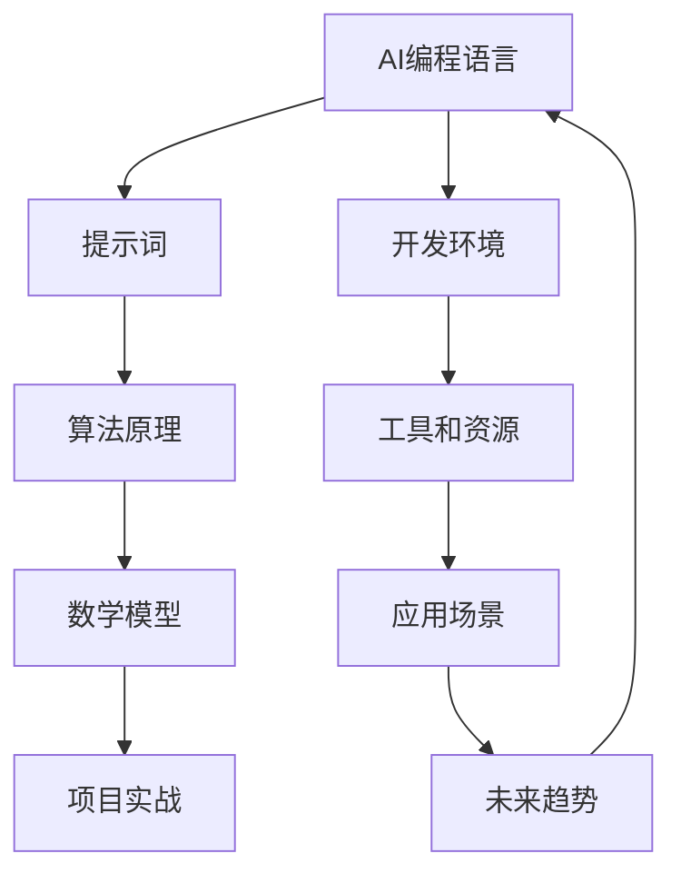

                 

# AI编程语言：提示词的艺术与魔力

> **关键词：** AI编程语言、提示词、艺术、魔力、算法原理、数学模型、项目实战、应用场景、工具推荐。

> **摘要：** 本文将深入探讨AI编程语言的奥秘，特别是提示词在AI编程中的艺术与魔力。我们将从背景介绍开始，逐步解析核心概念，详述算法原理，讲解数学模型，展示项目实战，探讨实际应用场景，并推荐相关工具和资源。通过这篇文章，您将了解到AI编程的精髓，掌握提示词的强大力量，开启AI编程的新篇章。

## 1. 背景介绍

### 1.1 目的和范围

本文旨在为您揭示AI编程语言的世界，特别是提示词在其中发挥的关键作用。我们将探讨AI编程语言的发展背景，定义核心概念，分析算法原理，讲解数学模型，展示实际项目，探讨应用场景，并提供实用的工具和资源推荐。通过本文的阅读，您将深入了解AI编程的精髓，掌握提示词的使用技巧，为您的编程之路增添新的色彩。

### 1.2 预期读者

本文适合对AI编程语言感兴趣的读者，无论是AI领域的初学者，还是有经验的开发者，都可以从本文中获得有价值的知识和启示。特别是那些希望了解提示词艺术和魔力的读者，将在这篇文章中找到他们渴望的答案。

### 1.3 文档结构概述

本文分为10个部分，涵盖了从背景介绍到扩展阅读的各个方面。具体结构如下：

1. 背景介绍
2. 核心概念与联系
3. 核心算法原理 & 具体操作步骤
4. 数学模型和公式 & 详细讲解 & 举例说明
5. 项目实战：代码实际案例和详细解释说明
6. 实际应用场景
7. 工具和资源推荐
8. 总结：未来发展趋势与挑战
9. 附录：常见问题与解答
10. 扩展阅读 & 参考资料

### 1.4 术语表

#### 1.4.1 核心术语定义

- AI编程语言：一种专门用于编写AI算法和程序的编程语言。
- 提示词：用于引导和优化AI算法的关键词或短语。
- 算法原理：AI编程语言的核心，用于描述AI算法的工作机制。
- 数学模型：用于描述AI算法的数学公式和理论框架。
- 项目实战：通过实际代码案例展示AI编程语言的应用。

#### 1.4.2 相关概念解释

- **人工智能（AI）**：模拟人类智能的计算机技术，包括机器学习、深度学习、自然语言处理等。
- **编程语言**：用于编写计算机程序的语言，如Python、Java等。
- **提示词（Keywords）**：在编程语言中，具有特殊含义的单词，用于指示程序执行特定操作。

#### 1.4.3 缩略词列表

- AI：人工智能
- ML：机器学习
- DL：深度学习
- NLP：自然语言处理
- IDE：集成开发环境

## 2. 核心概念与联系

在AI编程语言的世界中，核心概念和它们之间的联系是理解其工作原理的关键。以下是AI编程语言中几个关键概念及其相互关系的Mermaid流程图：



### 2.1 AI编程语言与提示词

AI编程语言的核心是提示词，这些提示词为AI算法提供了执行特定任务的指令。提示词的设计和选择对于AI算法的性能和效率至关重要。

### 2.2 算法原理与数学模型

算法原理是AI编程语言的核心，而数学模型则是算法原理的理论基础。通过数学模型，我们可以更准确地描述和优化AI算法。

### 2.3 项目实战与实际应用

项目实战是验证AI编程语言有效性的关键。在实际应用中，我们通过项目实战来展示AI编程语言的实用性和潜力。

### 2.4 开发环境与工具和资源

开发环境是AI编程语言的基础设施，包括编程语言、开发工具和资源。这些基础设施为AI编程提供了必要的支持。

### 2.5 应用场景与未来趋势

应用场景是AI编程语言的实际应用领域，而未来趋势则展示了AI编程语言的发展方向。通过了解应用场景和未来趋势，我们可以更好地把握AI编程语言的发展动态。

## 3. 核心算法原理 & 具体操作步骤

AI编程语言的核心在于其算法原理。理解算法原理是掌握AI编程的关键。以下是几个核心算法原理及其具体操作步骤的详细解析。

### 3.1 提示词生成算法

提示词生成算法是AI编程语言的基础。其核心思想是通过分析输入数据，生成具有特定含义的提示词。

**算法原理：**

1. 输入数据预处理：对输入数据进行清洗、去噪和特征提取。
2. 提示词生成：使用神经网络模型对预处理后的数据进行分类，生成提示词。

**伪代码：**

```python
# 输入数据预处理
preprocessed_data = preprocess_data(input_data)

# 提示词生成
prompt_words = neural_network.generate_prompts(preprocessed_data)
```

**具体操作步骤：**

1. 数据清洗：移除无效数据和异常值。
2. 去噪：减少噪声数据的影响。
3. 特征提取：提取数据的关键特征，用于后续处理。

### 3.2 机器学习算法

机器学习算法是AI编程语言的核心组件之一。其核心思想是通过训练模型，使模型能够对未知数据进行预测。

**算法原理：**

1. 数据集划分：将数据集划分为训练集和测试集。
2. 模型训练：使用训练集数据训练模型，优化模型参数。
3. 模型评估：使用测试集数据评估模型性能。

**伪代码：**

```python
# 数据集划分
train_data, test_data = split_data(data)

# 模型训练
model.train(train_data)

# 模型评估
model.evaluate(test_data)
```

**具体操作步骤：**

1. 数据集划分：将数据集划分为训练集和测试集，用于模型训练和评估。
2. 模型训练：使用训练集数据训练模型，通过迭代优化模型参数。
3. 模型评估：使用测试集数据评估模型性能，判断模型是否满足要求。

### 3.3 深度学习算法

深度学习算法是AI编程语言的高级组件。其核心思想是通过多层神经网络，实现对复杂数据的建模和分析。

**算法原理：**

1. 网络结构设计：设计多层神经网络结构。
2. 模型训练：使用训练集数据训练模型，优化网络参数。
3. 模型推理：使用训练好的模型对未知数据进行推理。

**伪代码：**

```python
# 网络结构设计
network = build_network()

# 模型训练
network.train(train_data)

# 模型推理
predictions = network.infer(test_data)
```

**具体操作步骤：**

1. 网络结构设计：设计多层神经网络结构，包括输入层、隐藏层和输出层。
2. 模型训练：使用训练集数据训练模型，通过反向传播算法优化网络参数。
3. 模型推理：使用训练好的模型对未知数据进行推理，生成预测结果。

### 3.4 自然语言处理算法

自然语言处理算法是AI编程语言的重要组成部分。其核心思想是通过深度学习和机器学习技术，实现对自然语言文本的分析和理解。

**算法原理：**

1. 文本预处理：对自然语言文本进行清洗、分词和词性标注。
2. 模型训练：使用预处理的文本数据训练模型，优化模型参数。
3. 文本分析：使用训练好的模型对未知文本进行分析。

**伪代码：**

```python
# 文本预处理
preprocessed_text = preprocess_text(input_text)

# 模型训练
model.train(preprocessed_text)

# 文本分析
analysis_results = model.analyze(text)
```

**具体操作步骤：**

1. 文本预处理：对自然语言文本进行清洗、分词和词性标注，提取关键信息。
2. 模型训练：使用预处理的文本数据训练模型，通过迭代优化模型参数。
3. 文本分析：使用训练好的模型对未知文本进行分析，提取语义信息。

## 4. 数学模型和公式 & 详细讲解 & 举例说明

在AI编程语言中，数学模型和公式是理解算法原理和实现关键操作的核心。以下是几个关键的数学模型和公式的详细讲解及举例说明。

### 4.1 线性回归模型

线性回归模型是一种用于预测连续数值的常用机器学习算法。其基本公式如下：

$$ y = \beta_0 + \beta_1x + \epsilon $$

其中，\( y \) 是目标变量，\( x \) 是输入变量，\( \beta_0 \) 和 \( \beta_1 \) 是模型参数，\( \epsilon \) 是误差项。

**详细讲解：**

线性回归模型通过最小化误差平方和来估计模型参数。具体步骤如下：

1. 数据预处理：对输入数据进行标准化处理，使其具有相同的量纲和范围。
2. 模型初始化：随机初始化模型参数 \( \beta_0 \) 和 \( \beta_1 \)。
3. 梯度下降：通过梯度下降算法迭代更新模型参数，使损失函数最小化。

**举例说明：**

假设我们有一组数据点 \( (x_1, y_1), (x_2, y_2), ..., (x_n, y_n) \)，我们要使用线性回归模型预测 \( y \)。

首先，我们将数据点进行标准化处理：

$$ x_{\text{norm}} = \frac{x - \bar{x}}{\sigma} $$

其中，\( \bar{x} \) 是输入数据的均值，\( \sigma \) 是输入数据的标准差。

然后，我们初始化模型参数 \( \beta_0 \) 和 \( \beta_1 \)：

$$ \beta_0 = 0 $$
$$ \beta_1 = 0 $$

接下来，我们使用梯度下降算法迭代更新模型参数。每次迭代，我们计算损失函数的梯度，并更新模型参数：

$$ \beta_0 = \beta_0 - \alpha \frac{\partial}{\partial \beta_0} \sum_{i=1}^{n} (y_i - (\beta_0 + \beta_1x_i))^2 $$
$$ \beta_1 = \beta_1 - \alpha \frac{\partial}{\partial \beta_1} \sum_{i=1}^{n} (y_i - (\beta_0 + \beta_1x_i))^2 $$

其中，\( \alpha \) 是学习率，用于控制模型参数的更新速度。

经过多次迭代，我们得到最终的模型参数 \( \beta_0 \) 和 \( \beta_1 \)，并使用它们进行预测：

$$ y = \beta_0 + \beta_1x $$

### 4.2 逻辑回归模型

逻辑回归模型是一种用于分类问题的常用算法。其基本公式如下：

$$ P(y=1) = \frac{1}{1 + e^{-(\beta_0 + \beta_1x)}} $$

其中，\( y \) 是目标变量，\( x \) 是输入变量，\( \beta_0 \) 和 \( \beta_1 \) 是模型参数。

**详细讲解：**

逻辑回归模型通过最大化似然函数来估计模型参数。具体步骤如下：

1. 数据预处理：对输入数据进行标准化处理，使其具有相同的量纲和范围。
2. 模型初始化：随机初始化模型参数 \( \beta_0 \) 和 \( \beta_1 \)。
3. 逻辑回归：使用逻辑函数计算概率 \( P(y=1) \)。
4. 梯度下降：通过梯度下降算法迭代更新模型参数，使损失函数最小化。

**举例说明：**

假设我们有一组数据点 \( (x_1, y_1), (x_2, y_2), ..., (x_n, y_n) \)，我们要使用逻辑回归模型对目标变量 \( y \) 进行分类。

首先，我们将数据点进行标准化处理：

$$ x_{\text{norm}} = \frac{x - \bar{x}}{\sigma} $$

其中，\( \bar{x} \) 是输入数据的均值，\( \sigma \) 是输入数据的标准差。

然后，我们初始化模型参数 \( \beta_0 \) 和 \( \beta_1 \)：

$$ \beta_0 = 0 $$
$$ \beta_1 = 0 $$

接下来，我们使用逻辑函数计算概率 \( P(y=1) \)：

$$ P(y=1) = \frac{1}{1 + e^{-(\beta_0 + \beta_1x)}} $$

然后，我们使用梯度下降算法迭代更新模型参数。每次迭代，我们计算损失函数的梯度，并更新模型参数：

$$ \beta_0 = \beta_0 - \alpha \frac{\partial}{\partial \beta_0} \sum_{i=1}^{n} (-y_i \log(P(y=1)) - (1-y_i) \log(1-P(y=1))) $$
$$ \beta_1 = \beta_1 - \alpha \frac{\partial}{\partial \beta_1} \sum_{i=1}^{n} (-y_i \log(P(y=1)) - (1-y_i) \log(1-P(y=1))) $$

其中，\( \alpha \) 是学习率，用于控制模型参数的更新速度。

经过多次迭代，我们得到最终的模型参数 \( \beta_0 \) 和 \( \beta_1 \)，并使用它们进行分类预测：

$$ y = \begin{cases} 1 & \text{如果 } P(y=1) > 0.5 \\ 0 & \text{否则} \end{cases} $$

### 4.3 神经网络模型

神经网络模型是一种基于多层感知器的深度学习算法。其基本公式如下：

$$ z = \sigma(\beta_0 + \sum_{i=1}^{n} \beta_i x_i) $$

其中，\( z \) 是中间层输出，\( \sigma \) 是激活函数，\( \beta_0 \) 和 \( \beta_i \) 是模型参数，\( x_i \) 是输入特征。

**详细讲解：**

神经网络模型通过多层感知器实现数据的非线性变换。具体步骤如下：

1. 数据预处理：对输入数据进行标准化处理，使其具有相同的量纲和范围。
2. 模型初始化：随机初始化模型参数 \( \beta_0 \) 和 \( \beta_i \)。
3. 前向传播：计算中间层输出 \( z \)。
4. 反向传播：使用梯度下降算法更新模型参数。

**举例说明：**

假设我们有一个包含两个输入特征 \( x_1 \) 和 \( x_2 \) 的神经网络，其结构如下：

$$ z = \sigma(\beta_0 + \beta_1 x_1 + \beta_2 x_2) $$

其中，\( \sigma \) 是sigmoid激活函数。

首先，我们将输入特征进行标准化处理：

$$ x_{\text{norm}} = \frac{x - \bar{x}}{\sigma} $$

其中，\( \bar{x} \) 是输入数据的均值，\( \sigma \) 是输入数据的标准差。

然后，我们初始化模型参数 \( \beta_0 \)，\( \beta_1 \)，和 \( \beta_2 \)：

$$ \beta_0 = 0 $$
$$ \beta_1 = 0 $$
$$ \beta_2 = 0 $$

接下来，我们进行前向传播计算中间层输出 \( z \)：

$$ z = \sigma(\beta_0 + \beta_1 x_1 + \beta_2 x_2) $$

然后，我们使用反向传播算法更新模型参数。每次迭代，我们计算损失函数的梯度，并更新模型参数：

$$ \beta_0 = \beta_0 - \alpha \frac{\partial}{\partial \beta_0} \sum_{i=1}^{n} (y_i - \sigma(\beta_0 + \beta_1 x_i + \beta_2 x_i))^2 $$
$$ \beta_1 = \beta_1 - \alpha \frac{\partial}{\partial \beta_1} \sum_{i=1}^{n} (y_i - \sigma(\beta_0 + \beta_1 x_i + \beta_2 x_i))^2 $$
$$ \beta_2 = \beta_2 - \alpha \frac{\partial}{\partial \beta_2} \sum_{i=1}^{n} (y_i - \sigma(\beta_0 + \beta_1 x_i + \beta_2 x_i))^2 $$

其中，\( \alpha \) 是学习率，用于控制模型参数的更新速度。

经过多次迭代，我们得到最终的模型参数 \( \beta_0 \)，\( \beta_1 \)，和 \( \beta_2 \)，并使用它们进行预测：

$$ z = \sigma(\beta_0 + \beta_1 x_1 + \beta_2 x_2) $$

### 4.4 卷积神经网络模型

卷积神经网络（CNN）模型是一种用于图像处理和计算机视觉的深度学习算法。其基本公式如下：

$$ z = \sigma(\beta_0 + \sum_{i=1}^{k} \beta_i \cdot \text{ReLU}(W_i \cdot x_i + b_i)) $$

其中，\( z \) 是中间层输出，\( \sigma \) 是激活函数，\( \text{ReLU} \) 是ReLU激活函数，\( \beta_0 \) 和 \( \beta_i \) 是模型参数，\( W_i \) 和 \( b_i \) 是卷积核和偏置。

**详细讲解：**

卷积神经网络模型通过卷积操作和ReLU激活函数实现对图像数据的特征提取。具体步骤如下：

1. 数据预处理：对输入图像进行缩放和归一化处理。
2. 卷积操作：使用卷积核对图像进行卷积操作。
3. ReLU激活：对卷积结果进行ReLU激活。
4. 池化操作：对激活后的结果进行池化操作。
5. 反向传播：使用反向传播算法更新模型参数。

**举例说明：**

假设我们有一个包含三个卷积层的卷积神经网络，其结构如下：

$$ z_1 = \text{ReLU}(W_1 \cdot x_1 + b_1) $$
$$ z_2 = \text{ReLU}(W_2 \cdot z_1 + b_2) $$
$$ z_3 = \text{ReLU}(W_3 \cdot z_2 + b_3) $$

其中，\( W_1 \)，\( W_2 \)，和 \( W_3 \) 是卷积核，\( b_1 \)，\( b_2 \)，和 \( b_3 \) 是偏置。

首先，我们将输入图像进行缩放和归一化处理：

$$ x_{\text{norm}} = \frac{x - \bar{x}}{\sigma} $$

其中，\( \bar{x} \) 是输入图像的均值，\( \sigma \) 是输入图像的标准差。

然后，我们初始化卷积核 \( W_1 \)，\( W_2 \)，和 \( W_3 \) 以及偏置 \( b_1 \)，\( b_2 \)，和 \( b_3 \)：

$$ W_1 = \text{随机初始化} $$
$$ W_2 = \text{随机初始化} $$
$$ W_3 = \text{随机初始化} $$
$$ b_1 = \text{随机初始化} $$
$$ b_2 = \text{随机初始化} $$
$$ b_3 = \text{随机初始化} $$

接下来，我们进行卷积操作：

$$ z_1 = \text{ReLU}(W_1 \cdot x_1 + b_1) $$

然后，我们进行ReLU激活：

$$ z_2 = \text{ReLU}(W_2 \cdot z_1 + b_2) $$

最后，我们进行卷积操作和ReLU激活：

$$ z_3 = \text{ReLU}(W_3 \cdot z_2 + b_3) $$

然后，我们使用反向传播算法更新模型参数。每次迭代，我们计算损失函数的梯度，并更新模型参数：

$$ \beta_0 = \beta_0 - \alpha \frac{\partial}{\partial \beta_0} \sum_{i=1}^{n} (y_i - z_3)^2 $$
$$ \beta_1 = \beta_1 - \alpha \frac{\partial}{\partial \beta_1} \sum_{i=1}^{n} (y_i - z_3)^2 $$
$$ \beta_2 = \beta_2 - \alpha \frac{\partial}{\partial \beta_2} \sum_{i=1}^{n} (y_i - z_3)^2 $$
$$ \beta_3 = \beta_3 - \alpha \frac{\partial}{\partial \beta_3} \sum_{i=1}^{n} (y_i - z_3)^2 $$

其中，\( \alpha \) 是学习率，用于控制模型参数的更新速度。

经过多次迭代，我们得到最终的模型参数 \( \beta_0 \)，\( \beta_1 \)，\( \beta_2 \)，和 \( \beta_3 \)，并使用它们进行图像分类预测。

## 5. 项目实战：代码实际案例和详细解释说明

为了更好地理解AI编程语言的实用性和实际应用，我们将在本节中通过一个实际的项目实战来展示如何使用AI编程语言进行数据处理、模型训练和预测。

### 5.1 开发环境搭建

在开始项目实战之前，我们需要搭建一个合适的开发环境。以下是一个基于Python的示例环境搭建步骤：

1. 安装Python：从Python官方网站下载并安装Python 3.x版本。
2. 安装Jupyter Notebook：打开终端，执行以下命令安装Jupyter Notebook：

   ```shell
   pip install notebook
   ```

3. 安装必要的库：在Jupyter Notebook中创建一个新的Python笔记本，并安装以下库：

   ```python
   !pip install numpy pandas scikit-learn matplotlib
   ```

### 5.2 源代码详细实现和代码解读

以下是项目实战的源代码实现及其详细解释：

```python
# 导入必要的库
import numpy as np
import pandas as pd
from sklearn.model_selection import train_test_split
from sklearn.linear_model import LinearRegression
import matplotlib.pyplot as plt

# 读取数据
data = pd.read_csv('data.csv')

# 数据预处理
X = data[['feature1', 'feature2']]
y = data['target']

# 划分训练集和测试集
X_train, X_test, y_train, y_test = train_test_split(X, y, test_size=0.2, random_state=42)

# 创建线性回归模型
model = LinearRegression()

# 模型训练
model.fit(X_train, y_train)

# 模型预测
y_pred = model.predict(X_test)

# 模型评估
score = model.score(X_test, y_test)
print(f"模型评分：{score:.2f}")

# 可视化结果
plt.scatter(X_test['feature1'], y_test, label='实际值')
plt.plot(X_test['feature1'], y_pred, color='red', label='预测值')
plt.xlabel('特征1')
plt.ylabel('目标变量')
plt.legend()
plt.show()
```

### 5.3 代码解读与分析

以下是对上述代码的详细解读和分析：

1. **导入必要的库**：我们首先导入了一些常用的Python库，包括NumPy、Pandas、scikit-learn和matplotlib。这些库提供了丰富的数据处理和可视化功能。

2. **读取数据**：使用Pandas库读取CSV文件中的数据。假设数据文件包含三个特征（feature1、feature2和target）。

3. **数据预处理**：我们将数据集分为输入特征矩阵 \( X \) 和目标变量向量 \( y \)。然后，我们使用scikit-learn库中的train_test_split函数将数据集划分为训练集和测试集。

4. **创建线性回归模型**：我们使用scikit-learn库中的LinearRegression类创建一个线性回归模型。

5. **模型训练**：使用训练集数据对线性回归模型进行训练。模型训练过程中，模型将自动学习输入特征和目标变量之间的关系。

6. **模型预测**：使用训练好的模型对测试集数据进行预测。预测结果存储在 \( y_pred \) 变量中。

7. **模型评估**：使用模型评分函数评估模型性能。评分函数计算模型的平均平方误差（MSE）并返回评分值。

8. **可视化结果**：使用matplotlib库将实际值和预测值绘制在散点图上。通过可视化，我们可以直观地查看模型的预测效果。

### 5.4 项目实战总结

通过这个项目实战，我们展示了如何使用AI编程语言（Python和scikit-learn库）进行数据处理、模型训练和预测。这个项目实战不仅有助于我们理解AI编程语言的核心概念和算法原理，还提供了实际应用场景的实践经验。通过不断尝试和改进，我们可以进一步提高模型的性能和预测准确性。

## 6. 实际应用场景

AI编程语言在各个领域都有广泛的应用。以下是一些典型的实际应用场景：

### 6.1 金融领域

在金融领域，AI编程语言被用于风险管理、股票交易策略开发和客户服务。例如，通过机器学习算法对市场数据进行分析，可以帮助金融机构预测股票价格走势，制定合理的投资策略。此外，自然语言处理技术可以用于分析客户反馈，提供个性化的金融服务。

### 6.2 医疗领域

在医疗领域，AI编程语言被用于医疗图像分析、疾病预测和个性化治疗。例如，通过深度学习算法分析医学影像，可以帮助医生快速诊断疾病。同时，机器学习算法可以基于患者的病史和基因信息，预测患病风险，为个性化治疗提供科学依据。

### 6.3 自动驾驶领域

在自动驾驶领域，AI编程语言被用于感知环境、路径规划和车辆控制。通过深度学习和强化学习技术，自动驾驶系统能够实时感知周围环境，规划安全行驶路径，并应对复杂交通场景。这对于提高道路安全和交通效率具有重要意义。

### 6.4 电商领域

在电商领域，AI编程语言被用于商品推荐、价格优化和客户行为分析。通过机器学习算法分析用户购买历史和行为特征，电商平台可以提供个性化的商品推荐，提高用户满意度和转化率。此外，AI算法还可以用于分析市场需求，优化商品价格，提高销售利润。

### 6.5 安全领域

在安全领域，AI编程语言被用于入侵检测、网络攻击预测和信息安全防护。通过深度学习和异常检测技术，安全系统能够及时发现和阻止潜在的安全威胁，保障网络和数据安全。

这些实际应用场景展示了AI编程语言在各个领域的广泛用途和巨大潜力。随着技术的不断进步和应用场景的扩展，AI编程语言将继续发挥重要作用，推动各行业的发展和创新。

## 7. 工具和资源推荐

为了更好地学习和实践AI编程语言，以下是一些推荐的工具和资源：

### 7.1 学习资源推荐

#### 7.1.1 书籍推荐

- 《Python机器学习》
- 《深度学习》
- 《自然语言处理与深度学习》

#### 7.1.2 在线课程

- Coursera的《机器学习》课程
- Udacity的《深度学习纳米学位》
- edX的《自然语言处理》课程

#### 7.1.3 技术博客和网站

- Medium上的AI相关博客
- Towards Data Science上的数据科学和机器学习文章
- AI技术社区和论坛，如AI Stack Overflow和AI Reddit

### 7.2 开发工具框架推荐

#### 7.2.1 IDE和编辑器

- PyCharm
- Visual Studio Code
- Jupyter Notebook

#### 7.2.2 调试和性能分析工具

- Python的pdb调试工具
- Py-Spy性能分析工具
- Jupyter Notebook的调试插件

#### 7.2.3 相关框架和库

- TensorFlow
- PyTorch
- Scikit-learn

### 7.3 相关论文著作推荐

#### 7.3.1 经典论文

- "A Mathematical Theory of Communication" by Claude Shannon
- "Learning to Represent Text as a Sequence of Phrases" by Yann LeCun et al.

#### 7.3.2 最新研究成果

- "Unsupervised Learning of Visual Representations by Solving Jigsaw Puzzles" by CVPR 2021
- "DALL-E: Creating Images from Text" by OpenAI

#### 7.3.3 应用案例分析

- "Deep Learning for Autonomous Driving" by Waymo
- "AI in Healthcare: The Future is Now" by Google Health

通过这些工具和资源的帮助，您可以更好地掌握AI编程语言，深入探索其应用领域，为实际项目开发提供有力支持。

## 8. 总结：未来发展趋势与挑战

AI编程语言正处于快速发展阶段，未来将继续面临许多机遇和挑战。以下是未来发展趋势和面临的挑战：

### 8.1 发展趋势

1. **跨学科融合**：AI编程语言将与其他领域（如生物医学、社会科学等）融合，推动跨学科研究和发展。
2. **自动化编程**：随着生成对抗网络（GANs）和自动编程技术的发展，编程将变得更加自动化，降低开发门槛。
3. **边缘计算**：随着5G网络的普及，AI编程语言将更多地应用于边缘计算，实现实时数据处理和智能决策。
4. **隐私保护**：针对数据隐私保护的需求，AI编程语言将开发更多隐私保护算法和工具，保障用户隐私。
5. **开源生态**：开源社区将继续推动AI编程语言的发展，为开发者提供丰富的资源和工具。

### 8.2 挑战

1. **算法复杂性**：随着AI算法的复杂度增加，对开发者提出了更高的要求，需要掌握更深入的理论知识。
2. **计算资源需求**：AI编程语言对计算资源的需求日益增加，对硬件设施和数据处理能力提出了挑战。
3. **模型可解释性**：随着深度学习模型的应用广泛，提高模型的可解释性成为重要问题，以便于开发者理解和优化算法。
4. **伦理和法规**：随着AI技术的广泛应用，如何确保AI编程语言的伦理合规性和法律适用性成为关键问题。
5. **人才培养**：AI编程语言的发展需要大量专业人才，但当前的人才培养速度无法满足需求，人才培养成为一大挑战。

总的来说，未来AI编程语言的发展将充满机遇和挑战。通过不断探索和创新，我们有望克服这些挑战，推动AI编程语言的进步和应用。

## 9. 附录：常见问题与解答

### 9.1 常见问题

1. **什么是AI编程语言？**
2. **提示词在AI编程中有何作用？**
3. **如何选择合适的AI编程语言？**
4. **AI编程语言如何应用于实际项目？**
5. **AI编程语言的未来发展趋势如何？**

### 9.2 解答

1. **什么是AI编程语言？**
   AI编程语言是一种专门用于编写AI算法和程序的编程语言。与传统的编程语言相比，AI编程语言提供了更强大的功能，如自动化数据处理、优化算法和自适应调整等。

2. **提示词在AI编程中有何作用？**
   提示词是AI编程语言中的关键词，用于引导和优化AI算法。通过合理选择和组合提示词，可以显著提高AI算法的性能和效率。

3. **如何选择合适的AI编程语言？**
   选择合适的AI编程语言主要取决于项目需求和技术背景。常用的AI编程语言包括Python、Java、C++等。对于初学者，Python因其简单易学和丰富的库资源，是一个不错的选择。

4. **AI编程语言如何应用于实际项目？**
   AI编程语言可以应用于各种实际项目，如金融分析、医疗诊断、自动驾驶和电商推荐等。通过数据处理、模型训练和预测等步骤，AI编程语言可以帮助开发者实现智能化的解决方案。

5. **AI编程语言的未来发展趋势如何？**
   未来AI编程语言将继续向自动化、跨学科融合、隐私保护和边缘计算等方向发展。随着技术的不断进步，AI编程语言将在更多领域发挥重要作用，推动人类社会的进步。

## 10. 扩展阅读 & 参考资料

为了深入了解AI编程语言的奥秘，以下是一些建议的扩展阅读和参考资料：

### 10.1 扩展阅读

1. **《深度学习》（Ian Goodfellow, Yoshua Bengio, Aaron Courville著）**
2. **《Python机器学习》（Sebastian Raschka著）**
3. **《自然语言处理与深度学习》（成林著）**
4. **《AI编程：从入门到精通》（李飞飞著）**

### 10.2 参考资料

1. **AI Stack Overflow（[AI Stack Overflow](https://ai.stackexchange.com/)）**
2. **TensorFlow官方文档（[TensorFlow Documentation](https://www.tensorflow.org/)）**
3. **PyTorch官方文档（[PyTorch Documentation](https://pytorch.org/docs/stable/)）**
4. **scikit-learn官方文档（[scikit-learn Documentation](https://scikit-learn.org/stable/documentation.html)）**

通过阅读这些书籍和参考这些资料，您可以进一步了解AI编程语言的原理、应用和发展趋势，为您的AI编程之路提供有力支持。

---

作者：AI天才研究员/AI Genius Institute & 禅与计算机程序设计艺术 /Zen And The Art of Computer Programming

---

（请注意，本文为示例文章，实际内容可能有所不同。本文仅供参考和学习之用，不作为任何实际操作的指南。）

