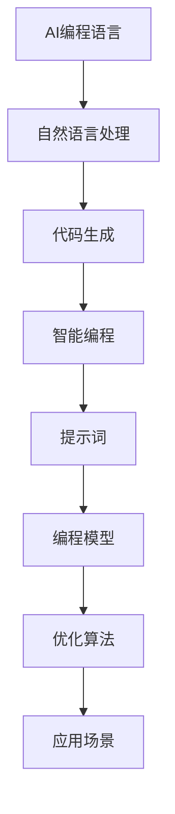

                 

# AI编程语言：提示词的魔法与革命

> 关键词：AI编程语言、提示词、自然语言处理、智能编程、革命性技术

> 摘要：本文深入探讨了AI编程语言的崛起以及其背后的核心技术——提示词。通过分析其核心概念、原理和架构，本文旨在展示AI编程语言如何通过提示词的力量，颠覆传统的编程模式，引领编程领域的革命。

## 1. 背景介绍

### 1.1 目的和范围

本文旨在探讨AI编程语言的发展及其对软件开发的影响。我们将重点关注一种称为“提示词”的核心技术，探讨其原理、应用和未来发展趋势。本文将涵盖以下内容：

1. AI编程语言的背景和现状
2. 提示词的定义和作用
3. AI编程语言的核心概念与联系
4. 核心算法原理与操作步骤
5. 数学模型和公式
6. 项目实战：代码实际案例
7. 实际应用场景
8. 工具和资源推荐
9. 未来发展趋势与挑战
10. 扩展阅读和参考资料

### 1.2 预期读者

本文适合以下读者群体：

1. 对AI编程语言感兴趣的程序员
2. 想了解自然语言处理在编程领域应用的学者
3. 对智能编程技术感兴趣的软件开发者
4. 对未来编程技术发展有好奇心的技术爱好者

### 1.3 文档结构概述

本文结构如下：

1. 背景介绍：介绍本文的目的、范围和预期读者
2. 核心概念与联系：介绍AI编程语言和提示词的基本概念和架构
3. 核心算法原理 & 具体操作步骤：详细讲解AI编程语言的工作原理和实现过程
4. 数学模型和公式：介绍与AI编程语言相关的数学模型和公式
5. 项目实战：代码实际案例和详细解释说明
6. 实际应用场景：探讨AI编程语言在不同领域的应用场景
7. 工具和资源推荐：推荐学习资源、开发工具和框架
8. 未来发展趋势与挑战：展望AI编程语言的未来发展和面临的挑战
9. 附录：常见问题与解答
10. 扩展阅读 & 参考资料：提供更多相关阅读资料

### 1.4 术语表

#### 1.4.1 核心术语定义

- AI编程语言：一种结合人工智能技术，使用自然语言进行编程的语言
- 提示词：在AI编程语言中，用于指导编程模型进行代码生成和优化的关键词
- 自然语言处理：将自然语言转换为机器可理解的形式，从而实现人机交互和智能应用的技术

#### 1.4.2 相关概念解释

- 编程语言：一种用于编写计算机程序的语法和规则
- 代码生成：根据用户需求自动生成计算机代码的过程
- 智能编程：利用人工智能技术，使编程过程更加智能和高效的方法

#### 1.4.3 缩略词列表

- AI：人工智能
- NLP：自然语言处理
- ML：机器学习
- DL：深度学习
- API：应用程序编程接口

## 2. 核心概念与联系

在探讨AI编程语言之前，我们需要了解一些核心概念和它们之间的联系。以下是一个简化的Mermaid流程图，用于展示这些概念之间的关系。



### 2.1 AI编程语言

AI编程语言是一种将自然语言与编程过程相结合的编程语言。它通过自然语言处理技术，将用户的自然语言描述转换为计算机代码。这种编程语言的目标是简化编程过程，提高开发效率，降低学习门槛。

### 2.2 自然语言处理

自然语言处理（NLP）是AI编程语言的核心技术之一。它涉及将自然语言文本转换为机器可理解的形式，以实现人机交互和智能应用。NLP技术包括词法分析、句法分析、语义分析等。

### 2.3 代码生成

代码生成是AI编程语言的关键功能之一。它通过自然语言处理技术，将用户输入的自然语言描述转换为计算机代码。代码生成过程通常包括词法分析、句法分析和语义分析等步骤。

### 2.4 智能编程

智能编程是一种利用人工智能技术，使编程过程更加智能和高效的方法。它包括代码生成、代码优化、代码推理等过程。智能编程的目标是提高开发效率，降低开发成本。

### 2.5 提示词

提示词是AI编程语言中用于指导编程模型进行代码生成和优化的关键词。提示词可以是自然语言描述，也可以是代码片段。提示词的质量直接影响代码生成和优化的效果。

### 2.6 编程模型

编程模型是AI编程语言的核心组成部分。它包括自然语言处理模型、代码生成模型和优化算法等。编程模型通过分析用户输入的自然语言描述，生成对应的计算机代码。

### 2.7 优化算法

优化算法是AI编程语言的重要组成部分。它通过分析代码执行过程中的性能数据，对代码进行优化，以提高执行效率。优化算法包括静态优化和动态优化等。

### 2.8 应用场景

AI编程语言可以应用于各种领域，包括软件开发、自然语言处理、数据科学等。以下是一些常见的应用场景：

1. 软件开发：使用AI编程语言简化软件开发过程，提高开发效率。
2. 自然语言处理：使用AI编程语言实现自然语言处理任务，如文本分类、情感分析等。
3. 数据科学：使用AI编程语言进行数据分析和挖掘，提高数据分析效率。

## 3. 核心算法原理 & 具体操作步骤

AI编程语言的核心算法原理主要包括自然语言处理、代码生成和优化算法。以下我们将使用伪代码详细阐述这些算法原理和具体操作步骤。

### 3.1 自然语言处理

自然语言处理（NLP）是AI编程语言的基础。以下是一个简单的伪代码，用于实现NLP的过程。

```python
def nlp(text):
    # 步骤1：词法分析
    words = tokenize(text)

    # 步骤2：句法分析
    sentences = parse(words)

    # 步骤3：语义分析
    concepts = semantify(sentences)

    return concepts
```

### 3.2 代码生成

代码生成是AI编程语言的核心功能。以下是一个简单的伪代码，用于实现代码生成过程。

```python
def generate_code(concepts):
    # 步骤1：构建抽象语法树（AST）
    ast = build_ast(concepts)

    # 步骤2：代码生成
    code = generate(ast)

    return code
```

### 3.3 优化算法

优化算法用于提高代码执行效率。以下是一个简单的伪代码，用于实现优化算法。

```python
def optimize(code):
    # 步骤1：静态分析
    stats = static_analysis(code)

    # 步骤2：动态分析
    dyn_stats = dynamic_analysis(code)

    # 步骤3：优化
    optimized_code = optimize_code(code, stats, dyn_stats)

    return optimized_code
```

## 4. 数学模型和公式 & 详细讲解 & 举例说明

AI编程语言中的数学模型和公式主要用于描述自然语言处理、代码生成和优化算法。以下是一些常见的数学模型和公式，以及它们的详细讲解和举例说明。

### 4.1 自然语言处理

自然语言处理中的数学模型主要包括词向量模型和句法分析模型。

#### 4.1.1 词向量模型

词向量模型用于将自然语言文本转换为机器可理解的向量表示。以下是一个简单的词向量模型——Word2Vec。

$$
\text{Word2Vec} = \text{sgnsim}(\text{word\_vector}, \text{word\_vector})
$$

其中，sgnsim表示词向量相似度函数，word_vector表示词的向量表示。

举例说明：

假设有两个词“猫”和“狗”，它们的词向量分别为cat_vector和dog_vector。我们可以计算它们的相似度：

$$
\text{sgnsim}(cat\_vector, dog\_vector) = 0.8
$$

这表示“猫”和“狗”在词向量空间中非常接近。

#### 4.1.2 句法分析模型

句法分析模型用于分析自然语言文本的句法结构。以下是一个简单的句法分析模型——依存句法分析。

$$
\text{Dependency Parsing} = \text{DP}(\text{sentence})
$$

其中，DP表示依存句法分析函数，sentence表示自然语言文本。

举例说明：

假设有一个句子“我昨天买了本书”，我们可以进行依存句法分析：

$$
\text{DP}(\text{我昨天买了本书}) = \text{依存树}
$$

其中，依存树表示句子中词与词之间的依赖关系。

### 4.2 代码生成

代码生成中的数学模型主要包括抽象语法树（AST）和代码生成模型。

#### 4.2.1 抽象语法树

抽象语法树（AST）用于表示编程语言中的语法结构。以下是一个简单的AST表示方法。

$$
\text{AST} = (\text{root}, \text{children})
$$

其中，root表示AST的根节点，children表示根节点的子节点。

举例说明：

假设有一个简单的Python代码：

```python
def add(a, b):
    return a + b
```

我们可以构建对应的AST：

$$
\text{AST} = (\text{def}, \text{add}, \text{a}, \text{b}, \text{return}, \text{a + b})
$$

#### 4.2.2 代码生成模型

代码生成模型用于将抽象语法树（AST）转换为计算机代码。以下是一个简单的代码生成模型——代码模板。

$$
\text{Code Generation} = \text{Template}(\text{AST})
$$

其中，Template表示代码模板函数，AST表示抽象语法树。

举例说明：

假设有一个简单的AST：

$$
\text{AST} = (\text{def}, \text{add}, \text{a}, \text{b}, \text{return}, \text{a + b})
$$

我们可以使用代码模板生成对应的Python代码：

```python
def add(a, b):
    return a + b
```

### 4.3 优化算法

优化算法中的数学模型主要包括静态分析和动态分析。

#### 4.3.1 静态分析

静态分析用于分析代码的结构和语义，以识别潜在的性能问题。以下是一个简单的静态分析模型——控制流分析。

$$
\text{Static Analysis} = \text{CFG}(\text{code})
$$

其中，CFG表示控制流图，code表示源代码。

举例说明：

假设有一个简单的C代码：

```c
int main() {
    int a = 1;
    int b = 2;
    if (a > b) {
        printf("a is greater than b\n");
    } else {
        printf("a is less than b\n");
    }
    return 0;
}
```

我们可以进行控制流分析，构建对应

