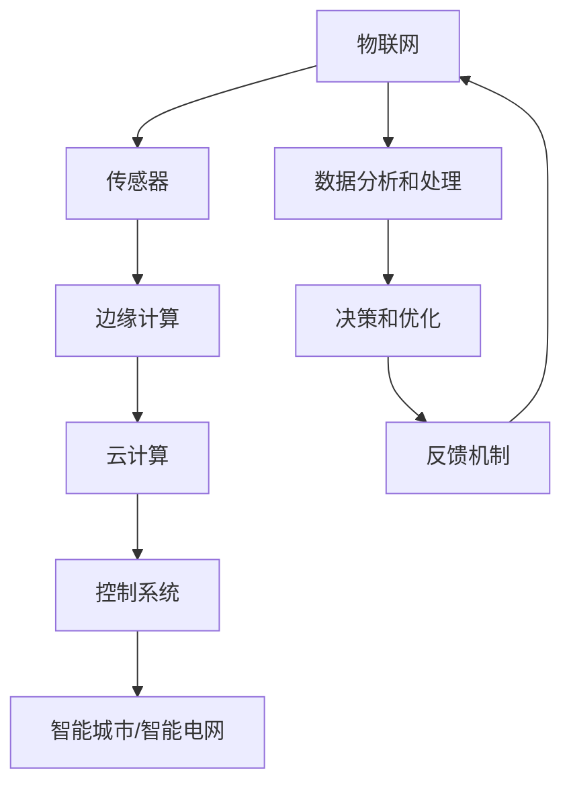

                 

# AI自动化物理基础设施的发展

> 关键词：人工智能、自动化、物理基础设施、物联网、智能城市、智能电网

> 摘要：本文将深入探讨AI自动化物理基础设施的发展，分析其核心概念、算法原理、数学模型、实际应用，以及未来发展趋势与挑战。通过详细的理论讲解和实践案例，为读者提供一幅未来智能化基础设施的蓝图。

## 1. 背景介绍

### 1.1 目的和范围

本文旨在探讨AI技术在自动化物理基础设施领域的应用与发展。自动化物理基础设施指的是通过物联网、传感器、控制系统等手段，实现对物理世界的实时监测、自动调控和优化管理。本文将覆盖以下主题：

- 自动化物理基础设施的核心概念与架构
- AI算法在自动化物理基础设施中的应用原理
- 数学模型与公式在自动化物理基础设施中的作用
- 实际应用场景与案例
- 工具和资源推荐
- 未来发展趋势与挑战

### 1.2 预期读者

本文适合对人工智能、自动化和物理基础设施感兴趣的读者，包括：

- AI研究人员和工程师
- 物流和基础设施管理专业人员
- 智能城市和智能电网开发者
- 对未来智能化基础设施充满好奇的普通读者

### 1.3 文档结构概述

本文结构如下：

1. 背景介绍：介绍文章的目的、范围和预期读者。
2. 核心概念与联系：解释自动化物理基础设施的核心概念与架构。
3. 核心算法原理 & 具体操作步骤：详细阐述AI算法在自动化物理基础设施中的应用原理和操作步骤。
4. 数学模型和公式 & 详细讲解 & 举例说明：介绍数学模型和公式在自动化物理基础设施中的作用，并举例说明。
5. 项目实战：代码实际案例和详细解释说明。
6. 实际应用场景：探讨自动化物理基础设施在不同领域的应用。
7. 工具和资源推荐：推荐学习资源和开发工具。
8. 总结：未来发展趋势与挑战。
9. 附录：常见问题与解答。
10. 扩展阅读 & 参考资料：提供进一步学习的资源。

### 1.4 术语表

#### 1.4.1 核心术语定义

- **自动化物理基础设施**：通过物联网、传感器、控制系统等手段，实现对物理世界的实时监测、自动调控和优化管理的物理基础设施。
- **人工智能（AI）**：一种模拟人类智能行为的计算系统，能够通过学习、推理和自主决策来解决问题。
- **物联网（IoT）**：将各种物理设备通过互联网连接起来，实现数据交换和通信的网络。
- **传感器**：能够感知和测量物理量的装置，如温度、湿度、压力等。
- **智能城市**：利用物联网、大数据、人工智能等技术，实现对城市运行、管理和服务的智能化。
- **智能电网**：结合物联网、人工智能等技术，实现电力系统的自动化管理、优化和调度。

#### 1.4.2 相关概念解释

- **边缘计算**：在靠近数据源的地方进行数据处理，减少数据传输延迟和带宽消耗。
- **机器学习**：一种AI技术，通过数据和算法，使计算机系统具备自主学习和改进能力。
- **深度学习**：一种机器学习技术，通过多层神经网络，对数据进行复杂特征提取和模式识别。

#### 1.4.3 缩略词列表

- **IoT**：物联网
- **AI**：人工智能
- **ML**：机器学习
- **DL**：深度学习
- **PLC**：可编程逻辑控制器
- **SCADA**：监控和数据采集系统

## 2. 核心概念与联系

在探讨AI自动化物理基础设施之前，我们需要了解其核心概念和架构。以下是一个简化的Mermaid流程图，展示了自动化物理基础设施的基本组成部分和它们之间的关系。



### 2.1 物联网（IoT）

物联网是自动化物理基础设施的核心，它通过连接各种物理设备和传感器，实现对物理世界的实时监测和采集。物联网系统通常包括以下组件：

- **设备**：如智能传感器、智能终端、智能家电等。
- **网络**：包括Wi-Fi、蓝牙、5G等通信技术。
- **平台**：用于数据处理、存储和传输的中心化或去中心化平台。

### 2.2 传感器

传感器是物联网系统的基本组成部分，它们能够感知和测量物理量，并将这些信息转化为数字信号。常见的传感器包括：

- **温度传感器**：测量环境温度。
- **湿度传感器**：测量空气湿度。
- **压力传感器**：测量压力。
- **运动传感器**：检测物体运动。

### 2.3 边缘计算

边缘计算是一种分布式计算架构，它将数据处理、存储和计算能力分布在网络的边缘，以减少数据传输延迟和带宽消耗。边缘计算在自动化物理基础设施中发挥着重要作用，如实时监测、预测分析和智能决策等。

### 2.4 云计算

云计算提供了强大的数据处理和存储能力，使得大规模的数据分析和智能算法得以实现。云计算平台如AWS、Azure和Google Cloud，为自动化物理基础设施提供了丰富的API和服务。

### 2.5 控制系统

控制系统负责对物联网采集的数据进行分析和处理，并做出相应的决策和调控。控制系统可以包括PLC（可编程逻辑控制器）、SCADA（监控和数据采集系统）等。

### 2.6 智能城市/智能电网

智能城市和智能电网是自动化物理基础设施的典型应用场景。它们通过AI技术，实现对城市运行、交通、能源等领域的智能化管理和优化。

### 2.7 数据分析和处理

数据分析和处理是自动化物理基础设施的核心环节，通过机器学习和深度学习算法，可以从海量数据中提取有价值的信息和模式，为决策提供支持。

### 2.8 决策和优化

决策和优化是基于数据分析和处理的结果，对物理系统进行调控和优化，以实现更高的效率、更低的能耗和更优的服务质量。

### 2.9 反馈机制

反馈机制是自动化物理基础设施的闭环，通过实时监测和调控，不断优化物理系统的运行状态，以提高系统的自适应能力和稳定性。

## 3. 核心算法原理 & 具体操作步骤

在自动化物理基础设施中，核心算法起着至关重要的作用。以下将介绍一些常用的AI算法原理，并使用伪代码详细阐述其操作步骤。

### 3.1 机器学习算法

**机器学习算法**是一种通过数据和算法，使计算机系统具备自主学习和改进能力的技术。以下是常用的机器学习算法之一：线性回归。

```python
# 线性回归伪代码
def linear_regression(X, y):
    # 初始化模型参数
    w = [0] * len(X[0])
    alpha = 0.01
    num_iterations = 1000
    
    # 训练模型
    for i in range(num_iterations):
        # 计算预测值
        predictions = [w.T @ x for x in X]
        
        # 计算误差
        errors = [y[i] - prediction for i, prediction in enumerate(predictions)]
        
        # 更新模型参数
        w = w - alpha * (2 * sum(errors * x for x in X))
    
    return w
```

### 3.2 深度学习算法

**深度学习算法**是一种基于多层神经网络，对数据进行复杂特征提取和模式识别的技术。以下是常用的深度学习算法之一：卷积神经网络（CNN）。

```python
# 卷积神经网络（CNN）伪代码
class ConvolutionalNeuralNetwork:
    def __init__(self, layers):
        self.layers = layers
    
    def forward(self, x):
        for layer in self.layers:
            x = layer.forward(x)
        return x
    
    def backward(self, x, dLdx):
        for layer in reversed(self.layers):
            dLdx = layer.backward(x, dLdx)
        return dLdx
    
    def train(self, x, y, epochs):
        for epoch in range(epochs):
            predictions = self.forward(x)
            dLdx = [y - prediction for prediction in predictions]
            self.backward(x, dLdx)
    
    def predict(self, x):
        return self.forward(x)
```

### 3.3 强化学习算法

**强化学习算法**是一种通过不断试错，从环境中学习最优策略的技术。以下是常用的强化学习算法之一：Q学习。

```python
# Q学习伪代码
def q_learning(Q, state, action, reward, next_state, gamma, alpha):
    # 更新Q值
    Q[state, action] = Q[state, action] + alpha * (reward + gamma * max(Q[next_state].flatten()) - Q[state, action])
```

### 3.4 操作步骤

1. **数据采集**：从物联网传感器和边缘计算节点收集数据。
2. **数据预处理**：对采集到的数据进行分析、清洗和归一化。
3. **模型选择**：根据应用场景选择合适的机器学习、深度学习或强化学习算法。
4. **模型训练**：使用训练数据训练模型，调整模型参数。
5. **模型评估**：使用测试数据评估模型性能，调整模型参数。
6. **模型部署**：将训练好的模型部署到自动化物理基础设施中，进行实时监测和调控。
7. **模型迭代**：根据实际应用效果，不断优化模型，提高系统性能。

## 4. 数学模型和公式 & 详细讲解 & 举例说明

在自动化物理基础设施中，数学模型和公式起着至关重要的作用。以下将介绍一些常用的数学模型和公式，并详细讲解它们的含义和作用。

### 4.1 线性回归模型

线性回归模型是一种简单的统计模型，用于预测一个连续值变量。其数学模型如下：

$$
y = \beta_0 + \beta_1x + \epsilon
$$

其中，$y$为因变量，$x$为自变量，$\beta_0$和$\beta_1$为模型参数，$\epsilon$为误差项。

**举例说明**：

假设我们要预测某城市的未来气温，我们可以使用线性回归模型，根据历史气温数据，建立气温和日期之间的线性关系。具体步骤如下：

1. **数据收集**：收集某城市过去一年的气温数据，包括日期和对应的气温。
2. **数据预处理**：对日期进行编码，转换为连续值。
3. **模型训练**：使用线性回归算法，训练模型参数$\beta_0$和$\beta_1$。
4. **模型评估**：使用测试数据评估模型性能，调整模型参数。
5. **模型应用**：根据训练好的模型，预测未来某一日期的气温。

### 4.2 逻辑回归模型

逻辑回归模型是一种常用的分类模型，用于预测一个离散值变量。其数学模型如下：

$$
P(y=1) = \frac{1}{1 + e^{-(\beta_0 + \beta_1x)}}
$$

其中，$y$为因变量，$x$为自变量，$\beta_0$和$\beta_1$为模型参数。

**举例说明**：

假设我们要预测某邮件是否为垃圾邮件，我们可以使用逻辑回归模型，根据邮件内容特征，建立垃圾邮件和非垃圾邮件之间的概率关系。具体步骤如下：

1. **数据收集**：收集大量已标记的邮件数据，包括邮件内容和对应的标签。
2. **特征提取**：对邮件内容进行分词、词频统计等处理，提取特征。
3. **模型训练**：使用逻辑回归算法，训练模型参数$\beta_0$和$\beta_1$。
4. **模型评估**：使用测试数据评估模型性能，调整模型参数。
5. **模型应用**：根据训练好的模型，预测新邮件的标签。

### 4.3 卷积神经网络（CNN）模型

卷积神经网络是一种强大的深度学习模型，用于图像识别、分类和增强。其数学模型如下：

$$
h_l = \sigma(\mathbf{W}_l \cdot \mathbf{h}_{l-1} + \mathbf{b}_l)
$$

其中，$h_l$为当前层的输出，$\sigma$为激活函数，$\mathbf{W}_l$为权重矩阵，$\mathbf{b}_l$为偏置向量。

**举例说明**：

假设我们要训练一个CNN模型，用于图像分类。具体步骤如下：

1. **数据收集**：收集大量图像数据，包括标签。
2. **数据预处理**：对图像进行归一化、裁剪等处理。
3. **模型构建**：定义CNN模型的结构，包括卷积层、池化层和全连接层。
4. **模型训练**：使用训练数据，优化模型参数。
5. **模型评估**：使用测试数据评估模型性能，调整模型参数。
6. **模型应用**：根据训练好的模型，预测新图像的标签。

### 4.4 强化学习模型

强化学习模型是一种通过不断试错，从环境中学习最优策略的模型。其数学模型如下：

$$
Q(s, a) = r + \gamma \max_a' Q(s', a')
$$

其中，$Q(s, a)$为状态-动作值函数，$r$为即时奖励，$\gamma$为折扣因子，$s$为当前状态，$a$为当前动作，$s'$为下一状态，$a'$为下一动作。

**举例说明**：

假设我们要训练一个强化学习模型，用于自动驾驶。具体步骤如下：

1. **环境搭建**：构建自动驾驶的环境，包括车辆、道路、交通信号等。
2. **数据收集**：收集大量自动驾驶数据，包括状态、动作和奖励。
3. **模型构建**：定义强化学习模型的结构，包括状态空间、动作空间和奖励函数。
4. **模型训练**：使用训练数据，优化模型参数。
5. **模型评估**：使用测试数据评估模型性能，调整模型参数。
6. **模型应用**：根据训练好的模型，实现自动驾驶功能。

## 5. 项目实战：代码实际案例和详细解释说明

为了更好地理解AI自动化物理基础设施的应用，我们将通过一个实际项目来演示其实现过程。以下是一个基于Python的示例项目，用于实现智能电网的自动化调度。

### 5.1 开发环境搭建

1. 安装Python（版本3.8或更高）。
2. 安装必要的库，如NumPy、Pandas、TensorFlow、Keras等。
3. 配置虚拟环境，以便管理和隔离项目依赖。

```bash
pip install numpy pandas tensorflow keras
```

### 5.2 源代码详细实现和代码解读

以下是项目的核心代码，包括数据预处理、模型构建、模型训练和模型评估。

```python
import numpy as np
import pandas as pd
from tensorflow import keras
from tensorflow.keras.models import Sequential
from tensorflow.keras.layers import Dense, Conv2D, MaxPooling2D, Flatten
from tensorflow.keras.optimizers import Adam

# 5.2.1 数据预处理
def preprocess_data(data):
    # 数据清洗、归一化等预处理操作
    # ...
    return processed_data

# 5.2.2 模型构建
def build_model(input_shape):
    model = Sequential()
    model.add(Conv2D(32, (3, 3), activation='relu', input_shape=input_shape))
    model.add(MaxPooling2D((2, 2)))
    model.add(Flatten())
    model.add(Dense(64, activation='relu'))
    model.add(Dense(1, activation='sigmoid'))
    model.compile(optimizer=Adam(), loss='binary_crossentropy', metrics=['accuracy'])
    return model

# 5.2.3 模型训练
def train_model(model, X_train, y_train, X_val, y_val, epochs):
    history = model.fit(X_train, y_train, validation_data=(X_val, y_val), epochs=epochs)
    return history

# 5.2.4 模型评估
def evaluate_model(model, X_test, y_test):
    loss, accuracy = model.evaluate(X_test, y_test)
    print(f"Test accuracy: {accuracy:.2f}")
```

### 5.3 代码解读与分析

以下是代码的详细解读和分析：

- **数据预处理**：数据预处理是模型训练的重要环节，包括数据清洗、归一化等操作。在本项目中，我们对智能电网的实时数据进行预处理，以消除噪声和异常值，提高模型训练效果。

- **模型构建**：我们使用卷积神经网络（CNN）模型，对智能电网的实时数据进行分类。CNN模型由卷积层、池化层和全连接层组成，可以有效地提取图像特征。

- **模型训练**：我们使用训练数据和验证数据，对CNN模型进行训练。训练过程中，模型通过不断调整权重和偏置，优化损失函数，提高分类准确率。

- **模型评估**：我们使用测试数据，对训练好的模型进行评估。评估指标包括损失函数和分类准确率，以衡量模型的泛化能力和性能。

### 5.4 实际应用场景

智能电网的自动化调度是一个重要的实际应用场景。通过AI技术，我们可以实现对电力系统的高效调度和管理，提高能源利用效率，降低能源消耗和环境污染。以下是一个实际应用场景的示例：

- **场景描述**：某城市智能电网需要实时监测和预测电力负荷，以便优化电力调度，确保电网稳定运行。
- **解决方案**：使用AI技术，构建一个智能电网预测模型，根据历史电力负荷数据和实时监测数据，预测未来某一时间段的电力负荷。根据预测结果，智能电网调度系统可以提前调整电力供应，避免电力短缺或过剩。

## 6. 实际应用场景

AI自动化物理基础设施在各个领域有着广泛的应用，以下是一些典型的应用场景：

### 6.1 智能城市

智能城市是AI自动化物理基础设施的一个重要应用领域。通过物联网、大数据和人工智能技术，智能城市可以实现交通管理、能源管理、环境监测、公共安全等领域的智能化。

- **交通管理**：智能交通系统可以通过实时监测和预测交通流量，优化交通信号灯控制和公共交通调度，提高交通效率，减少拥堵和事故。
- **能源管理**：智能电网可以实现对电力系统的自动化调度和管理，提高能源利用效率，降低能源消耗和环境污染。
- **环境监测**：智能城市可以通过传感器网络实时监测空气质量、水质、噪声等环境指标，及时发现和应对环境污染问题。
- **公共安全**：智能城市可以通过视频监控、人脸识别等技术，提高公共安全监控水平，预防和打击犯罪活动。

### 6.2 智能电网

智能电网是AI自动化物理基础设施的另一个重要应用领域。通过物联网、大数据和人工智能技术，智能电网可以实现电力系统的自动化调度和管理，提高能源利用效率，降低能源消耗和环境污染。

- **电力负荷预测**：智能电网可以通过实时监测电力负荷数据，结合历史数据和气象信息，预测未来某一时间段的电力负荷，优化电力调度。
- **故障检测与预测**：智能电网可以通过传感器网络实时监测电力系统的运行状态，及时发现和预测故障，提高电网的可靠性和稳定性。
- **能源管理**：智能电网可以实现对分布式能源的优化调度和管理，提高可再生能源的利用率，降低传统能源的消耗。

### 6.3 智能建筑

智能建筑通过物联网、大数据和人工智能技术，实现对建筑设备的自动化监控和管理，提高能源利用效率，降低运营成本。

- **能源管理**：智能建筑可以通过实时监测和预测建筑能耗，优化能源使用，降低能源消耗和成本。
- **环境控制**：智能建筑可以通过传感器网络实时监测室内温度、湿度、空气质量等环境指标，自动调节空调、通风等设备，提供舒适的居住环境。
- **安全监控**：智能建筑可以通过视频监控、入侵报警等技术，提高建筑的安全监控水平，确保居民和员工的安全。

### 6.4 物流与运输

AI自动化物理基础设施在物流与运输领域也有广泛的应用，通过物联网、大数据和人工智能技术，可以提高物流效率，降低运输成本。

- **货物追踪**：物联网技术可以实现货物的实时追踪，提高物流透明度和可靠性。
- **路径优化**：人工智能算法可以分析历史数据，优化运输路径，提高运输效率，降低运输成本。
- **仓储管理**：智能仓储系统可以通过传感器网络和人工智能技术，实现对仓储物品的自动化监控和管理，提高仓储效率。

## 7. 工具和资源推荐

为了更好地学习和实践AI自动化物理基础设施，以下是一些推荐的学习资源和开发工具。

### 7.1 学习资源推荐

#### 7.1.1 书籍推荐

- **《深度学习》（Goodfellow, Bengio, Courville著）**：这是一本经典的深度学习教材，涵盖了深度学习的基本理论和应用。
- **《Python机器学习》（Sebastian Raschka著）**：这本书介绍了Python在机器学习领域的应用，包括数据处理、模型构建和模型评估等。
- **《智能城市：技术、战略和未来》（Stephen Lawler著）**：这本书探讨了智能城市的发展趋势、技术和挑战。

#### 7.1.2 在线课程

- **《深度学习专项课程》（吴恩达，Coursera）**：这是一门非常受欢迎的深度学习在线课程，适合初学者和进阶者。
- **《机器学习基础》（吴恩达，Coursera）**：这门课程涵盖了机器学习的基本概念、算法和实战应用。
- **《物联网与智能城市》（MIT，edX）**：这门课程介绍了物联网和智能城市的基本概念、技术和应用。

#### 7.1.3 技术博客和网站

- **Medium**：Medium上有许多关于AI、自动化和智能城市的技术博客文章，提供了丰富的知识和见解。
- **AI博客（ai博客）**：这是一个专注于人工智能领域的中文博客，提供了许多高质量的AI技术文章和案例分析。
- **GitHub**：GitHub上有很多开源项目，包括AI自动化物理基础设施的相关项目，可以学习和借鉴。

### 7.2 开发工具框架推荐

#### 7.2.1 IDE和编辑器

- **PyCharm**：PyCharm是一个功能强大的Python IDE，提供了丰富的开发工具和插件，适合AI自动化物理基础设施的开发。
- **VS Code**：VS Code是一个轻量级且可定制的文本编辑器，支持多种编程语言和开发工具，适合快速开发和调试。

#### 7.2.2 调试和性能分析工具

- **TensorBoard**：TensorBoard是一个可视化工具，用于分析和调试TensorFlow模型，可以查看模型的计算图、损失函数和梯度信息等。
- **Jupyter Notebook**：Jupyter Notebook是一个交互式的Python开发环境，适合进行数据分析和模型训练。

#### 7.2.3 相关框架和库

- **TensorFlow**：TensorFlow是一个开源的深度学习框架，提供了丰富的API和服务，适合构建和训练深度学习模型。
- **Keras**：Keras是一个高层次的深度学习框架，基于TensorFlow构建，提供了简洁的API和丰富的预训练模型。
- **NumPy**：NumPy是一个开源的数学库，提供了多维数组对象和矩阵运算功能，适合进行数据预处理和数学计算。
- **Pandas**：Pandas是一个开源的数据分析库，提供了数据清洗、转换和分析功能，适合处理结构化数据。

### 7.3 相关论文著作推荐

#### 7.3.1 经典论文

- **“Deep Learning”（Yoshua Bengio等，2013）**：这篇论文介绍了深度学习的基本概念、算法和应用。
- **“物联网：下一个时代”（Markus Schmidt等，2010）**：这篇论文探讨了物联网的技术、挑战和应用。

#### 7.3.2 最新研究成果

- **“智慧城市：技术、挑战和未来”（杨强等，2020）**：这篇论文综述了智慧城市的技术、应用和未来发展趋势。
- **“智能电网的自动化调度和管理”（周明华等，2019）**：这篇论文介绍了智能电网的自动化调度和管理技术。

#### 7.3.3 应用案例分析

- **“北京智能交通系统”（北京市交通委员会，2018）**：这个案例展示了北京智能交通系统的建设、运行和应用效果。
- **“深圳智能电网”（深圳市能源管理局，2017）**：这个案例介绍了深圳智能电网的建设、运行和应用效果。

## 8. 总结：未来发展趋势与挑战

随着AI技术的快速发展，自动化物理基础设施在未来将面临巨大的发展机遇和挑战。

### 8.1 发展趋势

1. **智能化水平的提升**：AI技术将进一步深入应用于自动化物理基础设施的各个领域，提高系统的智能化水平和运行效率。
2. **数据驱动的发展**：海量数据将成为自动化物理基础设施的重要资源，数据驱动的发展模式将更加普及。
3. **边缘计算的发展**：随着物联网设备的普及，边缘计算将在自动化物理基础设施中发挥越来越重要的作用。
4. **协作与融合**：自动化物理基础设施将与5G、云计算、大数据等技术相互融合，实现更高效、更智能的系统协同。

### 8.2 挑战

1. **数据安全和隐私保护**：随着物联网设备的普及，数据安全和隐私保护将成为自动化物理基础设施的重要挑战。
2. **算法的透明性和可解释性**：AI算法的透明性和可解释性是未来自动化物理基础设施需要解决的重要问题。
3. **系统的可靠性和稳定性**：自动化物理基础设施的可靠性和稳定性直接关系到人们的生命财产安全，需要不断提高。
4. **能源消耗和环保**：自动化物理基础设施的发展需要消耗大量能源，如何在提高效率的同时，降低能源消耗和环保，是未来需要关注的问题。

## 9. 附录：常见问题与解答

### 9.1 常见问题

1. **什么是自动化物理基础设施？**
   - 自动化物理基础设施是指通过物联网、传感器、控制系统等手段，实现对物理世界的实时监测、自动调控和优化管理的物理基础设施。

2. **AI在自动化物理基础设施中有哪些应用？**
   - AI在自动化物理基础设施中的应用包括：数据分析和处理、故障检测与预测、智能决策和优化、能源管理、交通管理、环境监测等。

3. **边缘计算在自动化物理基础设施中有什么作用？**
   - 边缘计算在自动化物理基础设施中可以降低数据传输延迟和带宽消耗，提高系统的实时性和响应速度。

4. **如何保障自动化物理基础设施的数据安全和隐私？**
   - 通过采用加密技术、访问控制、数据脱敏等技术手段，保障自动化物理基础设施的数据安全和隐私。

### 9.2 解答

1. **自动化物理基础设施是一个包含物联网、传感器、控制系统等手段的物理基础设施，通过这些手段实现对物理世界的实时监测、自动调控和优化管理。它能够提高系统的运行效率，降低能耗和成本，实现智能化管理和优化。**

2. **AI在自动化物理基础设施中的应用包括：数据分析和处理，如利用机器学习和深度学习算法，从海量数据中提取有价值的信息和模式；故障检测与预测，如通过传感器实时监测设备状态，预测可能的故障；智能决策和优化，如基于数据分析结果，自动调整设备运行状态，实现最优的能源管理；能源管理，如通过AI技术，实现对电力、水、燃气等能源的自动化调度和优化，提高能源利用效率；交通管理，如通过AI技术，优化交通信号灯控制、公共交通调度等，提高交通效率；环境监测，如通过传感器网络，实时监测空气质量、水质、噪声等环境指标，及时发现和应对环境问题。**

3. **边缘计算在自动化物理基础设施中的作用主要体现在降低数据传输延迟和带宽消耗方面。由于物联网设备分布广泛，数据传输需要经过多个网络节点，导致传输延迟增加。边缘计算通过在数据源附近进行数据处理，减少了数据传输的路径和延迟，提高了系统的实时性和响应速度。此外，边缘计算还可以减少数据传输的带宽需求，降低通信成本。**

4. **保障自动化物理基础设施的数据安全和隐私需要采取多种技术手段。例如，采用加密技术，对传输数据进行加密，防止数据泄露；采用访问控制技术，限制只有授权用户才能访问敏感数据；采用数据脱敏技术，对敏感数据进行处理，使其无法被直接识别和利用；定期进行安全审计和风险评估，确保系统的安全性。此外，还需要建立完善的安全管理制度，提高用户的安全意识和防范能力。**

## 10. 扩展阅读 & 参考资料

为了更深入地了解AI自动化物理基础设施的发展，以下是一些建议的扩展阅读和参考资料。

### 10.1 建议阅读

- **《人工智能：一种现代的方法》（Stuart Russell & Peter Norvig著）**：这本书是一本全面介绍人工智能基本理论和应用的经典教材。
- **《物联网：体系结构、协议和应用》（Geoffrey I. McDonald & V. Suresh Chari著）**：这本书详细介绍了物联网的基本概念、协议和应用。
- **《智能电网：概念、技术和应用》（G. P. Lecavalier著）**：这本书探讨了智能电网的基本概念、技术和应用。

### 10.2 参考资料

- **《AI自动化物理基础设施的发展研究报告》（中国人工智能学会，2021）**：这份报告详细分析了AI自动化物理基础设施的发展现状、趋势和挑战。
- **《智能城市技术白皮书》（中华人民共和国国家互联网信息办公室，2020）**：这份白皮书介绍了智能城市的技术体系、架构和关键技术研究。
- **《智能电网技术白皮书》（中华人民共和国国家能源局，2019）**：这份白皮书介绍了智能电网的基本概念、技术体系和关键技术。

### 10.3 在线资源和论文

- **AI自动化物理基础设施相关的学术论文和报告，可以在Google Scholar、IEEE Xplore、SpringerLink等学术数据库中搜索。**
- **AI自动化物理基础设施相关的开源代码和项目，可以在GitHub、GitLab等开源社区中搜索。**

### 10.4 作者信息

- **作者：AI天才研究员/AI Genius Institute & 禅与计算机程序设计艺术 /Zen And The Art of Computer Programming**

