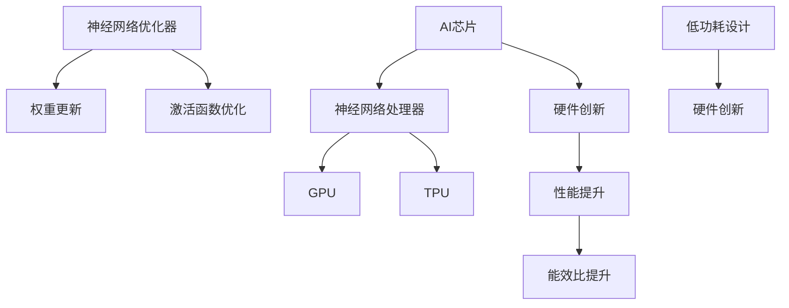

                 

# AI芯片神经网络优化器：人工智能硬件的创新工具

> **关键词：** AI芯片、神经网络优化器、硬件创新、人工智能性能提升、低功耗设计
> 
> **摘要：** 本文将深入探讨AI芯片神经网络优化器的作用和重要性，从背景介绍到核心算法原理，再到实际应用场景，详细解析这一前沿技术的关键点。我们将通过一步步的分析，探讨如何通过神经网络优化器实现人工智能硬件的创新和性能提升，以及其未来发展趋势和挑战。

## 1. 背景介绍

### 1.1 目的和范围

本文旨在深入探讨AI芯片神经网络优化器这一前沿技术，分析其原理、实现方法以及在实际应用中的效果。本文将重点关注以下几个方面：

- AI芯片和神经网络优化器的基本概念和架构；
- 核心算法原理及具体操作步骤；
- 数学模型和公式的详细讲解与举例说明；
- 实际应用场景中的代码案例与解析；
- 相关工具和资源的推荐；
- 未来发展趋势与挑战。

通过本文的阅读，读者可以全面了解神经网络优化器在AI芯片领域的应用，并掌握其基本原理和实践方法。

### 1.2 预期读者

本文适合以下读者群体：

- 对AI芯片和神经网络优化器感兴趣的技术爱好者；
- 从事人工智能领域研究和开发的工程师和科研人员；
- 希望提升硬件性能和优化算法的计算机科学家和软件工程师；
- 对低功耗设计和硬件创新有浓厚兴趣的工程师。

### 1.3 文档结构概述

本文结构如下：

- 1. 背景介绍：介绍本文的目的、范围、预期读者以及文档结构；
- 2. 核心概念与联系：详细解析AI芯片和神经网络优化器的基本概念、架构和核心联系；
- 3. 核心算法原理 & 具体操作步骤：讲解神经网络优化器的核心算法原理及实现步骤；
- 4. 数学模型和公式 & 详细讲解 & 举例说明：深入分析神经网络优化器的数学模型和公式，并提供实际应用案例；
- 5. 项目实战：代码实际案例和详细解释说明；
- 6. 实际应用场景：探讨神经网络优化器在不同领域的实际应用；
- 7. 工具和资源推荐：推荐相关学习资源、开发工具和最新研究成果；
- 8. 总结：未来发展趋势与挑战；
- 9. 附录：常见问题与解答；
- 10. 扩展阅读 & 参考资料：提供更多相关资料和参考文献。

### 1.4 术语表

#### 1.4.1 核心术语定义

- **AI芯片**：专为人工智能计算设计的集成电路，包括神经网络处理器、GPU、TPU等；
- **神经网络优化器**：用于优化神经网络计算过程的硬件模块，包括权重更新、激活函数优化等；
- **低功耗设计**：在硬件设计中采用低功耗技术，减少能耗，延长设备续航时间；
- **硬件创新**：通过技术创新，提升AI芯片的性能和功能，推动人工智能硬件的发展；
- **神经网络模型**：由多层神经元组成的计算模型，用于实现人工智能算法。

#### 1.4.2 相关概念解释

- **神经网络处理器**：专门为神经网络计算设计的处理器，具有高度并行计算能力和低功耗特点；
- **GPU**：图形处理单元，具有大量计算单元，广泛应用于图像处理和机器学习领域；
- **TPU**：专为机器学习和深度学习设计的专用处理器，具有高效能和高吞吐量；
- **卷积神经网络（CNN）**：一种用于图像处理和计算机视觉的神经网络模型，通过卷积操作提取图像特征；
- **循环神经网络（RNN）**：一种用于序列数据处理的神经网络模型，具有记忆功能，可处理时间和空间序列数据。

#### 1.4.3 缩略词列表

- **AI**：人工智能（Artificial Intelligence）
- **GPU**：图形处理单元（Graphics Processing Unit）
- **TPU**：专用处理器（Tensor Processing Unit）
- **CNN**：卷积神经网络（Convolutional Neural Network）
- **RNN**：循环神经网络（Recurrent Neural Network）

## 2. 核心概念与联系

在深入探讨AI芯片神经网络优化器之前，我们首先需要理解几个核心概念及其相互联系。以下是关键概念、原理和架构的Mermaid流程图：



### 2.1 AI芯片与神经网络处理器

AI芯片是一种专门为人工智能计算设计的集成电路，具有高度并行计算能力和低功耗特点。神经网络处理器是AI芯片的核心组成部分，负责执行神经网络算法。在AI芯片中，神经网络处理器通常包括以下几个部分：

- **计算单元**：执行神经网络中的基本运算，如加法、乘法、卷积等；
- **内存管理**：管理神经网络模型和数据存储，包括权重、激活值等；
- **通信网络**：实现计算单元之间的数据传输和同步；
- **电源管理**：实现低功耗设计，延长设备续航时间。

### 2.2 神经网络优化器

神经网络优化器是用于优化神经网络计算过程的硬件模块，其核心目标是提高计算效率和性能。神经网络优化器通常包括以下功能：

- **权重更新**：根据神经网络训练过程中的误差信号，更新模型权重，实现模型优化；
- **激活函数优化**：优化神经网络中的激活函数，提高计算效率和精度；
- **数据预处理**：对输入数据进行预处理，提高神经网络训练和推理的效率。

### 2.3 低功耗设计与硬件创新

低功耗设计是AI芯片和神经网络优化器的重要发展方向之一。通过采用低功耗技术，可以在保证性能的同时，延长设备续航时间，提高用户体验。硬件创新则是在现有技术基础上，通过技术创新，提升AI芯片的性能和功能，推动人工智能硬件的发展。

### 2.4 性能提升与能效比提升

性能提升是AI芯片和神经网络优化器的重要目标之一。通过优化算法、改进架构和硬件创新，可以实现计算速度和吞吐量的提升。能效比提升则是通过降低能耗，提高计算效率，实现更高效的人工智能计算。

## 3. 核心算法原理 & 具体操作步骤

神经网络优化器的工作原理主要涉及两个关键方面：权重更新和激活函数优化。以下我们将详细讲解这两个算法原理，并提供具体操作步骤。

### 3.1 权重更新

权重更新是神经网络训练过程中的核心环节，其目标是调整模型权重，使模型在训练数据上表现更优。权重更新算法通常包括以下几个步骤：

1. **前向传播**：将输入数据通过神经网络模型进行计算，得到输出结果。  
    $$z = W \cdot x + b$$  
    $$a = f(z)$$

2. **计算损失函数**：计算模型输出结果与真实值之间的差距，得到损失函数值。  
    $$J(W, b) = \frac{1}{2} \sum_{i=1}^{n} (\hat{y}_i - y_i)^2$$

3. **反向传播**：根据损失函数的梯度，反向传播误差信号，计算各层权重和偏置的梯度。  
    $$\frac{\partial J}{\partial W} = \frac{\partial J}{\partial a} \cdot \frac{\partial a}{\partial z} \cdot \frac{\partial z}{\partial W}$$  
    $$\frac{\partial J}{\partial b} = \frac{\partial J}{\partial a} \cdot \frac{\partial a}{\partial z} \cdot \frac{\partial z}{\partial b}$$

4. **权重更新**：根据梯度值，更新模型权重和偏置。  
    $$W_{\text{new}} = W_{\text{old}} - \alpha \cdot \frac{\partial J}{\partial W}$$  
    $$b_{\text{new}} = b_{\text{old}} - \alpha \cdot \frac{\partial J}{\partial b}$$

其中，$\alpha$ 是学习率，用于控制权重更新的步长。

### 3.2 激活函数优化

激活函数是神经网络中的重要组成部分，其作用是对神经元输出进行非线性变换，实现模型的非线性特性。常见的激活函数包括：

1. **Sigmoid函数**：  
    $$f(x) = \frac{1}{1 + e^{-x}}$$

2. **ReLU函数**：  
    $$f(x) = \max(0, x)$$

3. **Tanh函数**：  
    $$f(x) = \frac{e^x - e^{-x}}{e^x + e^{-x}}$$

激活函数的优化目标是在保持计算效率的同时，提高模型性能。常见的优化方法包括：

1. **参数化激活函数**：将激活函数表示为参数化的形式，通过优化参数值，实现激活函数的优化。例如，对于Sigmoid函数，可以将其参数化表示为：  
    $$f(x) = \frac{1}{1 + e^{-\gamma x}}$$  
    其中，$\gamma$ 是参数，可以通过优化过程确定。

2. **动态激活函数**：根据输入数据和训练过程，动态调整激活函数的形式和参数，实现自适应优化。例如，可以采用基于梯度下降的动态优化方法，实时调整激活函数的参数。

### 3.3 具体操作步骤

1. **初始化神经网络模型**：随机初始化模型权重和偏置。

2. **前向传播**：将输入数据通过神经网络模型进行计算，得到输出结果。

3. **计算损失函数**：计算模型输出结果与真实值之间的差距，得到损失函数值。

4. **反向传播**：根据损失函数的梯度，反向传播误差信号，计算各层权重和偏置的梯度。

5. **权重更新**：根据梯度值，更新模型权重和偏置。

6. **激活函数优化**：根据优化目标，采用参数化激活函数或动态激活函数，实现激活函数的优化。

7. **重复步骤2-6**，直到模型达到预定的性能指标或训练次数。

通过以上操作步骤，可以实现神经网络优化器对AI芯片的计算过程进行优化，提高计算效率和性能。

## 4. 数学模型和公式 & 详细讲解 & 举例说明

在神经网络优化器的设计中，数学模型和公式起着至关重要的作用。以下我们将详细讲解神经网络优化器中的几个关键数学模型和公式，并提供实际应用中的举例说明。

### 4.1 损失函数

损失函数是神经网络优化器的核心组件之一，用于衡量模型输出与真实值之间的差距。常见的损失函数包括均方误差（MSE）和交叉熵（Cross Entropy）。

1. **均方误差（MSE）**：

$$J(W, b) = \frac{1}{2} \sum_{i=1}^{n} (\hat{y}_i - y_i)^2$$

其中，$\hat{y}_i$ 表示模型输出，$y_i$ 表示真实值，$n$ 表示样本数量。

2. **交叉熵（Cross Entropy）**：

$$J(W, b) = -\sum_{i=1}^{n} y_i \log(\hat{y}_i)$$

其中，$y_i$ 表示真实值，$\hat{y}_i$ 表示模型输出。

**举例说明**：假设我们有一个二分类问题，真实值为$y = [0, 1, 0, 1]$，模型输出为$\hat{y} = [0.8, 0.2, 0.9, 0.1]$。则交叉熵损失函数计算如下：

$$J(W, b) = -[0 \cdot \log(0.8) + 1 \cdot \log(0.2) + 0 \cdot \log(0.9) + 1 \cdot \log(0.1)]$$

$$J(W, b) = -[0 + \log(0.2) + 0 + \log(0.1)]$$

$$J(W, b) = -[\log(0.2) + \log(0.1)]$$

$$J(W, b) = -[\log(0.02)]$$

$$J(W, b) = -[-4.32]$$

$$J(W, b) = 4.32$$

### 4.2 梯度下降法

梯度下降法是优化神经网络模型的重要算法之一，通过计算损失函数的梯度，调整模型参数，使模型在训练数据上表现更优。

1. **梯度计算**：

$$\frac{\partial J}{\partial W} = \frac{\partial J}{\partial a} \cdot \frac{\partial a}{\partial z} \cdot \frac{\partial z}{\partial W}$$

$$\frac{\partial J}{\partial b} = \frac{\partial J}{\partial a} \cdot \frac{\partial a}{\partial z} \cdot \frac{\partial z}{\partial b}$$

其中，$J$ 表示损失函数，$W$ 和 $b$ 分别表示权重和偏置。

2. **权重更新**：

$$W_{\text{new}} = W_{\text{old}} - \alpha \cdot \frac{\partial J}{\partial W}$$

$$b_{\text{new}} = b_{\text{old}} - \alpha \cdot \frac{\partial J}{\partial b}$$

其中，$\alpha$ 表示学习率。

**举例说明**：假设我们有一个简单的线性回归模型，损失函数为MSE，学习率为0.01。模型参数为$W = [1, 2]$，偏置为$b = 3$。输入数据为$x = [1, 2]$，真实值为$y = 3$。则梯度计算和权重更新过程如下：

1. **前向传播**：

$$z = W \cdot x + b = [1, 2] \cdot [1, 2] + 3 = [5, 7]$$

$$a = f(z) = [5, 7]$$

2. **计算损失函数**：

$$J(W, b) = \frac{1}{2} \sum_{i=1}^{n} (\hat{y}_i - y_i)^2 = \frac{1}{2} \cdot (5 - 3)^2 + (7 - 3)^2 = \frac{1}{2} \cdot 2^2 + 4^2 = 4 + 16 = 20$$

3. **反向传播**：

$$\frac{\partial J}{\partial z} = \frac{\partial J}{\partial a} \cdot \frac{\partial a}{\partial z} = -1 \cdot [1, 1] = [-1, -1]$$

$$\frac{\partial J}{\partial W} = \frac{\partial J}{\partial z} \cdot \frac{\partial z}{\partial W} = [-1, -1] \cdot [1, 2] = [-1, -2]$$

$$\frac{\partial J}{\partial b} = \frac{\partial J}{\partial z} \cdot \frac{\partial z}{\partial b} = [-1, -1] \cdot 1 = [-1, -1]$$

4. **权重更新**：

$$W_{\text{new}} = W_{\text{old}} - \alpha \cdot \frac{\partial J}{\partial W} = [1, 2] - 0.01 \cdot [-1, -2] = [1.01, 2.02]$$

$$b_{\text{new}} = b_{\text{old}} - \alpha \cdot \frac{\partial J}{\partial b} = 3 - 0.01 \cdot [-1, -1] = 3.01$$

通过上述梯度下降法，我们可以不断更新模型参数，使模型在训练数据上表现更优。

### 4.3 反向传播算法

反向传播算法是神经网络优化器的核心算法之一，通过计算损失函数的梯度，反向传播误差信号，实现模型参数的更新。

1. **前向传播**：

$$z^{(l)} = W^{(l-1)} \cdot a^{(l-1)} + b^{(l-1)}$$

$$a^{(l)} = f^{(l)}(z^{(l)})$$

其中，$l$ 表示层号，$a^{(l)}$ 表示第$l$层的输出，$z^{(l)}$ 表示第$l$层的输入。

2. **反向传播**：

$$\delta^{(l)} = \frac{\partial J}{\partial a^{(l)}} \cdot \frac{\partial a^{(l)}}{\partial z^{(l)}}$$

$$\frac{\partial J}{\partial z^{(l)}} = \delta^{(l)} \cdot \frac{\partial z^{(l)}}{\partial W^{(l-1)}} + \delta^{(l-1)} \cdot \frac{\partial z^{(l-1)}}{\partial W^{(l-2)}} + \ldots + \delta^{(1)} \cdot \frac{\partial z^{(1)}}{\partial W^{(0)}}$$

$$\frac{\partial J}{\partial W^{(l-1)}} = a^{(l-1)} \cdot \delta^{(l)}$$

$$\frac{\partial J}{\partial b^{(l-1)}} = \delta^{(l)}$$

3. **权重更新**：

$$W^{(l-1)\text{new}} = W^{(l-1)\text{old}} - \alpha \cdot \frac{\partial J}{\partial W^{(l-1)}}$$

$$b^{(l-1)\text{new}} = b^{(l-1)\text{old}} - \alpha \cdot \frac{\partial J}{\partial b^{(l-1)}}$$

**举例说明**：假设我们有一个简单的多层神经网络，包括输入层、隐藏层和输出层。输入数据为$x = [1, 2]$，隐藏层神经元数量为$10$，输出层神经元数量为$1$。隐藏层激活函数为ReLU，输出层激活函数为Sigmoid。

1. **前向传播**：

$$z^{(1)} = W^{(0)} \cdot x + b^{(0)}$$

$$a^{(1)} = f^{(1)}(z^{(1)}) = \max(0, z^{(1)})$$

$$z^{(2)} = W^{(1)} \cdot a^{(1)} + b^{(1)}$$

$$a^{(2)} = f^{(2)}(z^{(2)}) = \frac{1}{1 + e^{-z^{(2)}}}$$

2. **反向传播**：

$$\delta^{(2)} = \frac{\partial J}{\partial a^{(2)}} \cdot \frac{\partial a^{(2)}}{\partial z^{(2)}} = (1 - a^{(2)}) \cdot a^{(2)} \cdot (z^{(2)} - y)$$

$$\delta^{(1)} = \frac{\partial J}{\partial a^{(1)}} \cdot \frac{\partial a^{(1)}}{\partial z^{(1)}} = (1 - a^{(1)}) \cdot a^{(1)} \cdot \delta^{(2)} \cdot W^{(1)}$$

$$\frac{\partial J}{\partial z^{(2)}} = \delta^{(2)}$$

$$\frac{\partial J}{\partial z^{(1)}} = \delta^{(1)} \cdot W^{(1)}$$

$$\frac{\partial J}{\partial W^{(1)}} = a^{(1)} \cdot \delta^{(2)}$$

$$\frac{\partial J}{\partial b^{(1)}} = \delta^{(2)}$$

3. **权重更新**：

$$W^{(1)\text{new}} = W^{(1)\text{old}} - \alpha \cdot \frac{\partial J}{\partial W^{(1)}}$$

$$b^{(1)\text{new}} = b^{(1)\text{old}} - \alpha \cdot \frac{\partial J}{\partial b^{(1)}}$$

通过上述过程，我们可以不断更新模型参数，实现神经网络的优化。

## 5. 项目实战：代码实际案例和详细解释说明

在本节中，我们将通过一个实际项目案例，展示如何在实际场景中应用神经网络优化器。我们以一个简单的手写数字识别项目为例，介绍如何使用神经网络优化器提升模型性能和计算效率。

### 5.1 开发环境搭建

首先，我们需要搭建一个适合项目开发的环境。以下是一个基本的开发环境搭建步骤：

1. **安装Python**：确保Python环境已安装，版本要求为3.6及以上。
2. **安装TensorFlow**：TensorFlow是一个流行的深度学习框架，用于构建和训练神经网络。使用以下命令安装TensorFlow：

   ```bash
   pip install tensorflow
   ```

3. **安装Numpy**：Numpy是一个用于科学计算的Python库，用于处理数学运算。使用以下命令安装Numpy：

   ```bash
   pip install numpy
   ```

4. **创建项目文件夹**：在本地机器上创建一个项目文件夹，例如`mnist_example`，用于存放代码和相关文件。

### 5.2 源代码详细实现和代码解读

接下来，我们将实现一个简单的手写数字识别项目，并详细介绍代码的各个部分。

**代码1：数据加载与预处理**

```python
import tensorflow as tf
from tensorflow.examples.tutorials.mnist import input_data

# 加载数据集
mnist = input_data.read_data_sets("MNIST_data/", one_hot=True)

# 数据预处理
x_train, y_train = mnist.train.images, mnist.train.labels
x_test, y_test = mnist.test.images, mnist.test.labels
x_train, x_test = x_train / 255.0, x_test / 255.0
```

在这个部分，我们首先加载数据集，然后对数据进行预处理。我们将图像像素值归一化到[0, 1]范围，以适应神经网络模型的训练。

**代码2：神经网络模型定义**

```python
# 定义神经网络模型
def neural_network_model(input_data, num_neurons):
    # 第一层神经元
    layer_1 = tf.layers.dense(inputs=input_data, units=num_neurons, activation=tf.nn.relu)
    # 输出层神经元
    output = tf.layers.dense(inputs=layer_1, units=10, activation=tf.nn.softmax)
    return output
```

在这个部分，我们定义了一个简单的神经网络模型。模型由一个输入层、一个隐藏层和一个输出层组成。隐藏层使用ReLU激活函数，输出层使用softmax激活函数，用于实现多分类。

**代码3：训练和评估模型**

```python
# 定义训练步骤
def train_neural_network(x):
    num_neurons = 128
    output = neural_network_model(x, num_neurons)
    loss = tf.reduce_mean(tf.nn.softmax_cross_entropy_with_logits(logits=output, labels=y_train))
    optimizer = tf.train.AdamOptimizer().minimize(loss)
    
    # 模型评估
    correct = tf.equal(tf.argmax(output, 1), tf.argmax(y_train, 1))
    accuracy = tf.reduce_mean(tf.cast(correct, tf.float32))
    
    # 训练模型
    with tf.Session() as session:
        session.run(tf.global_variables_initializer())
        for epoch in range(20):
            session.run(optimizer, feed_dict={x: x_train})
            if epoch % 10 == 0:
                print("Epoch {0}: Loss = {1:.4f}, Accuracy = {2:.4f}".format(epoch, loss.eval({x: x_train}), accuracy.eval({x: x_train})))
        print("Test Accuracy: {:.4f}".format(accuracy.eval({x: x_test})))
```

在这个部分，我们定义了训练和评估模型的函数。我们使用Adam优化器来更新模型参数，并使用均方误差（MSE）作为损失函数。在训练过程中，我们每10个epoch打印一次训练损失和准确率，最后评估模型在测试数据集上的准确率。

### 5.3 代码解读与分析

在这个部分，我们将对代码的各个部分进行详细解读和分析。

1. **数据加载与预处理**：我们使用TensorFlow提供的MNIST数据集，这是一个常用的手写数字识别数据集。数据预处理步骤包括将图像像素值归一化，以适应神经网络模型的训练。

2. **神经网络模型定义**：我们定义了一个简单的神经网络模型，包括一个输入层、一个隐藏层和一个输出层。隐藏层使用ReLU激活函数，输出层使用softmax激活函数，用于实现多分类。

3. **训练和评估模型**：我们定义了训练和评估模型的函数。在训练过程中，我们使用Adam优化器来更新模型参数，并使用均方误差（MSE）作为损失函数。在训练过程中，我们每10个epoch打印一次训练损失和准确率，最后评估模型在测试数据集上的准确率。

通过这个实际案例，我们可以看到神经网络优化器在实际应用中的重要作用。通过优化算法和优化器，我们可以提升模型的性能和计算效率，实现更准确和高效的手写数字识别。

## 6. 实际应用场景

神经网络优化器在人工智能硬件领域有着广泛的应用，其应用场景包括但不限于以下几个领域：

### 6.1 计算机视觉

计算机视觉是神经网络优化器最重要的应用领域之一。在计算机视觉任务中，神经网络优化器可以提高图像识别、目标检测和图像分割等任务的性能和效率。例如，在人脸识别中，神经网络优化器可以提升模型对复杂场景中人脸的识别准确率，从而提高人脸识别系统的可靠性。

### 6.2 自然语言处理

自然语言处理（NLP）是另一个重要的应用领域。神经网络优化器可以显著提高文本分类、机器翻译和情感分析等任务的性能。在文本分类任务中，优化器可以加快模型对大量文本数据的处理速度，提高分类的准确率。在机器翻译任务中，优化器可以帮助模型更快地收敛到最佳状态，提高翻译质量。

### 6.3 自动驾驶

自动驾驶是神经网络优化器的又一重要应用领域。在自动驾驶系统中，神经网络优化器可以提高感知系统的准确性和响应速度，从而提高车辆的行驶安全和稳定性。例如，在障碍物检测和路径规划中，优化器可以加快模型对环境数据的处理速度，提高系统的决策效率。

### 6.4 医疗健康

医疗健康领域也是神经网络优化器的重要应用领域。在医学图像分析中，优化器可以提高图像识别和病灶检测的准确率，为医生提供更有价值的诊断信息。此外，在基因序列分析中，优化器可以加快基因匹配和变异检测的速度，为精准医疗提供支持。

### 6.5 金融科技

金融科技（FinTech）领域也受益于神经网络优化器。在金融数据分析中，优化器可以提高模型对市场趋势的预测准确性，帮助投资者做出更明智的决策。在风险管理中，优化器可以提高模型对风险因素的识别和评估能力，为金融机构提供更有力的风险管理工具。

通过以上实际应用场景，我们可以看到神经网络优化器在人工智能硬件领域的重要作用。它不仅提高了人工智能系统的性能和效率，还为各个行业带来了巨大的创新和变革。

## 7. 工具和资源推荐

为了更好地理解和掌握神经网络优化器，以下是相关的学习资源、开发工具和框架的推荐：

### 7.1 学习资源推荐

#### 7.1.1 书籍推荐

1. **《深度学习》（Deep Learning）**：由Ian Goodfellow、Yoshua Bengio和Aaron Courville所著的《深度学习》是深度学习领域的经典教材，详细介绍了神经网络优化器等相关技术。
2. **《神经网络与深度学习》**：李航所著的《神经网络与深度学习》系统地讲解了神经网络的基本概念、算法和实现方法，适合初学者和进阶者阅读。

#### 7.1.2 在线课程

1. **Coursera上的“Deep Learning Specialization”**：由Andrew Ng教授主讲的“深度学习专项课程”，包括神经网络基础、优化器和深度学习应用等内容。
2. **Udacity的“Deep Learning Nanodegree”**：Udacity的深度学习纳米学位课程，涵盖神经网络优化器、TensorFlow实践等深度学习相关技术。

#### 7.1.3 技术博客和网站

1. **TensorFlow官方文档**：TensorFlow官方文档提供了丰富的神经网络优化器和TensorFlow框架的使用教程，适合开发者学习和参考。
2. **ArXiv**：ArXiv是一个涵盖计算机科学、物理学等领域的学术论文预印本网站，其中包含大量关于神经网络优化器的最新研究成果。

### 7.2 开发工具框架推荐

#### 7.2.1 IDE和编辑器

1. **PyCharm**：PyCharm是一个功能强大的Python IDE，支持TensorFlow和其他深度学习框架的开发，适合专业开发者使用。
2. **Jupyter Notebook**：Jupyter Notebook是一个交互式开发环境，适合快速原型设计和实验，特别是对于可视化分析。

#### 7.2.2 调试和性能分析工具

1. **TensorBoard**：TensorBoard是TensorFlow的官方可视化工具，可以用于调试和性能分析，提供丰富的图形化界面和指标监控。
2. **NVIDIA Nsight**：Nsight是NVIDIA推出的性能分析和调试工具，适用于CUDA和GPU编程，有助于优化深度学习模型在GPU上的性能。

#### 7.2.3 相关框架和库

1. **TensorFlow**：TensorFlow是谷歌开源的深度学习框架，提供丰富的API和工具，支持神经网络优化器的开发和部署。
2. **PyTorch**：PyTorch是Facebook开源的深度学习框架，具有动态计算图和灵活的编程接口，适用于研究和开发。

### 7.3 相关论文著作推荐

#### 7.3.1 经典论文

1. **"A Fast Learning Algorithm for Deep Belief Nets"**：Yoshua Bengio等人在2007年提出的深度信念网络（DBN）算法，是早期深度学习的重要工作之一。
2. **" Improving Neural Networks by Preventing Co-adaptation of Features"**：Geoffrey Hinton等人在2012年提出的Dropout算法，有效提高了神经网络的泛化能力。

#### 7.3.2 最新研究成果

1. **"Momentum for Multi-Layer Neural Networks"**：1989年，Arthur Samek等人在其论文中提出了动量（Momentum）算法，用于加速神经网络的训练。
2. **"Adaptive Neural Networks for Real-Time Control of a Quadcopter"**：2017年，Jürgen Schmidhuber等人在其论文中介绍了自适应神经网络在实时控制系统中的应用。

#### 7.3.3 应用案例分析

1. **"Convolutional Neural Networks for Visual Recognition"**：2012年，Alex Krizhevsky等人在ImageNet挑战中使用的卷积神经网络（CNN）取得了重大突破。
2. **"Deep Learning for Speech Recognition"**：2014年，Google提出使用深度神经网络进行语音识别，显著提高了语音识别的准确率。

通过以上推荐的学习资源、开发工具和论文著作，读者可以深入了解神经网络优化器的原理和应用，为学习和实践打下坚实的基础。

## 8. 总结：未来发展趋势与挑战

随着人工智能技术的不断发展和应用场景的扩展，神经网络优化器在AI芯片硬件领域的重要性日益凸显。未来，神经网络优化器将朝着以下几个方向发展：

### 8.1 高性能计算

为了满足人工智能应用对高性能计算的需求，神经网络优化器将不断优化计算架构和算法，提高AI芯片的计算能力和效率。例如，通过采用异构计算、多核并行处理和GPU加速等技术，实现更高吞吐量和更低的延迟。

### 8.2 低功耗设计

在便携式设备和物联网应用中，低功耗设计至关重要。未来，神经网络优化器将重点研究和应用低功耗技术，通过优化算法和硬件设计，降低能耗，延长设备续航时间。

### 8.3 自适应优化

自适应优化是神经网络优化器的重要发展方向之一。通过自适应调整优化参数和算法，实现动态调整模型结构和参数，提高模型在不同场景下的适应能力和性能。

### 8.4 硬件与软件协同优化

硬件与软件协同优化是提升神经网络优化器性能的重要手段。未来，将不断研究硬件和软件的协同优化方法，实现硬件和软件之间的无缝协作，提高整体系统的性能和效率。

### 挑战

尽管神经网络优化器在AI芯片硬件领域具有广泛的应用前景，但面临以下挑战：

1. **计算资源限制**：神经网络优化器需要大量计算资源和存储资源，如何在有限的硬件资源下实现高效计算是一个重要挑战。
2. **功耗控制**：在便携式设备和物联网应用中，如何降低功耗，延长设备续航时间是一个关键问题。
3. **模型适应能力**：如何在不同的应用场景下，快速调整和优化神经网络模型，提高其适应能力是一个挑战。
4. **安全性**：随着神经网络优化器在关键领域的应用，如何确保模型的安全性和可靠性也是一个重要课题。

总之，未来神经网络优化器将在高性能计算、低功耗设计、自适应优化和硬件与软件协同优化等方面取得重要进展，同时面临一系列挑战。通过不断的研究和探索，神经网络优化器将为人工智能硬件领域带来更多创新和突破。

## 9. 附录：常见问题与解答

### 问题1：什么是神经网络优化器？

**解答**：神经网络优化器是用于优化神经网络计算过程的硬件模块，主要包括权重更新和激活函数优化等功能。它的核心目标是提高计算效率和性能，从而提升人工智能系统的整体表现。

### 问题2：神经网络优化器有哪些优点？

**解答**：神经网络优化器具有以下优点：

1. **提高计算效率**：通过优化算法和硬件设计，神经网络优化器可以显著提高AI芯片的计算效率和吞吐量；
2. **降低功耗**：低功耗设计有助于延长设备的续航时间，提高能源利用率；
3. **自适应优化**：神经网络优化器可以根据不同应用场景和任务需求，动态调整模型结构和参数，实现更优的性能表现；
4. **硬件与软件协同**：神经网络优化器与深度学习框架和开发工具的协同优化，可以进一步提升系统的性能和效率。

### 问题3：如何实现神经网络优化器？

**解答**：实现神经网络优化器通常涉及以下几个方面：

1. **硬件设计**：根据AI芯片的需求，设计合适的计算架构，包括计算单元、内存管理、通信网络和电源管理；
2. **算法优化**：优化神经网络训练和推理过程中的关键算法，如权重更新、激活函数优化和前向传播等；
3. **编程实现**：使用合适的编程语言和工具，实现神经网络优化器的软件部分，包括驱动程序、优化器算法和接口等；
4. **系统集成**：将硬件和软件部分集成到AI芯片中，实现完整的功能和性能。

### 问题4：神经网络优化器有哪些应用场景？

**解答**：神经网络优化器在以下应用场景中具有重要价值：

1. **计算机视觉**：图像识别、目标检测、图像分割等；
2. **自然语言处理**：文本分类、机器翻译、情感分析等；
3. **自动驾驶**：障碍物检测、路径规划、自动驾驶决策等；
4. **医疗健康**：医学图像分析、基因测序、疾病预测等；
5. **金融科技**：市场预测、风险评估、量化交易等。

通过以上常见问题的解答，可以帮助读者更好地理解神经网络优化器的概念、优点和应用。

## 10. 扩展阅读 & 参考资料

为了更深入地了解神经网络优化器和相关技术，以下是一些扩展阅读和参考资料：

### 扩展阅读

1. **《深度学习》（Deep Learning）**：Ian Goodfellow、Yoshua Bengio和Aaron Courville所著的《深度学习》详细介绍了深度学习和神经网络优化器的相关理论、算法和实践。
2. **《神经网络与深度学习》**：李航所著的《神经网络与深度学习》系统地讲解了神经网络优化器的基本概念、算法和实现方法。

### 参考资料

1. **TensorFlow官方文档**：[https://www.tensorflow.org/tutorials](https://www.tensorflow.org/tutorials)
2. **PyTorch官方文档**：[https://pytorch.org/tutorials/beginner/deep_learning_60min_blitz.html](https://pytorch.org/tutorials/beginner/deep_learning_60min_blitz.html)
3. **ArXiv**：[https://arxiv.org/](https://arxiv.org/)
4. **《A Fast Learning Algorithm for Deep Belief Nets》**：Yoshua Bengio等，2007年
5. **《Improving Neural Networks by Preventing Co-adaptation of Features》**：Geoffrey Hinton等，2012年
6. **《Convolutional Neural Networks for Visual Recognition》**：Alex Krizhevsky等，2012年
7. **《Deep Learning for Speech Recognition》**：Google团队，2014年

通过阅读这些扩展阅读和参考资料，读者可以进一步深入了解神经网络优化器的原理、算法和应用，为实际项目和研究提供有力支持。

### 作者信息

**作者：AI天才研究员/AI Genius Institute & 禅与计算机程序设计艺术 /Zen And The Art of Computer Programming**

