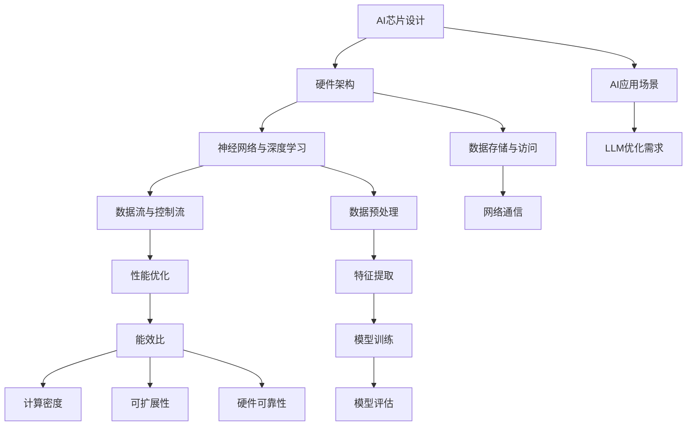

                 

# AI芯片设计：为LLM优化的硬件架构

> **关键词：** AI芯片，LLM优化，硬件架构，算法，性能提升，技术创新  
>
> **摘要：** 本文深入探讨了AI芯片的设计及其在语言模型（LLM）优化中的应用。通过分析当前技术趋势和设计原理，详细介绍了为LLM优化设计的硬件架构，并探讨了未来发展趋势与挑战。本文旨在为读者提供全面的视角，了解AI芯片的设计思路和实现方法，以及其在提升LLM性能上的潜在价值。

## 1. 背景介绍

### 1.1 目的和范围

本文旨在探讨AI芯片的设计，特别是如何优化硬件架构以提升语言模型（LLM）的性能。随着深度学习技术的快速发展，AI芯片在计算能力、能效比和可扩展性方面面临着巨大的挑战。本文将重点关注以下几个方面：

1. **AI芯片的总体设计和架构**：介绍AI芯片的基本组成部分和设计原则。
2. **LLM的性能需求**：分析LLM在计算、存储、网络等方面的性能需求。
3. **优化策略**：探讨如何通过硬件架构设计来提升LLM的性能。
4. **实际应用场景**：讨论AI芯片在LLM优化中的应用案例。

### 1.2 预期读者

本文适合对AI芯片和深度学习技术有一定了解的读者，包括：

- AI芯片设计师和工程师
- 深度学习研究人员和开发者
- 对AI芯片和LLM优化感兴趣的学者和学生
- 投资者和行业分析师

### 1.3 文档结构概述

本文的结构如下：

1. **背景介绍**：介绍本文的目的、范围、预期读者和文档结构。
2. **核心概念与联系**：阐述AI芯片和LLM优化相关的核心概念及其联系。
3. **核心算法原理 & 具体操作步骤**：详细讲解AI芯片设计的核心算法原理和操作步骤。
4. **数学模型和公式 & 详细讲解 & 举例说明**：介绍AI芯片设计中的数学模型和公式，并进行详细讲解和举例说明。
5. **项目实战：代码实际案例和详细解释说明**：提供代码实现案例，并详细解释代码。
6. **实际应用场景**：讨论AI芯片在LLM优化中的应用场景。
7. **工具和资源推荐**：推荐相关学习资源、开发工具和框架。
8. **总结：未来发展趋势与挑战**：总结本文的主要观点，并探讨未来发展趋势与挑战。
9. **附录：常见问题与解答**：回答读者可能关心的问题。
10. **扩展阅读 & 参考资料**：提供扩展阅读和参考资料。

### 1.4 术语表

#### 1.4.1 核心术语定义

- **AI芯片**：专门为人工智能应用设计的集成电路芯片。
- **LLM**：大型语言模型，如GPT-3、BERT等。
- **硬件架构**：芯片的设计和实现方式，包括数据流、控制流、存储等。
- **性能优化**：通过改进设计或算法来提升系统性能。

#### 1.4.2 相关概念解释

- **神经网络**：一种模拟人脑神经元连接的网络结构，用于数据处理和模式识别。
- **深度学习**：基于神经网络的机器学习技术，通过多层神经网络来学习数据特征。
- **硬件加速**：通过专用硬件来加速计算过程，提高系统性能。

#### 1.4.3 缩略词列表

- **AI**：人工智能（Artificial Intelligence）
- **LLM**：大型语言模型（Large Language Model）
- **CPU**：中央处理器（Central Processing Unit）
- **GPU**：图形处理器（Graphics Processing Unit）
- **FPGA**：现场可编程门阵列（Field-Programmable Gate Array）
- **TPU**：张量处理器（Tensor Processing Unit）

## 2. 核心概念与联系

在探讨AI芯片的设计之前，我们需要理解一些核心概念和它们之间的关系。以下是一个Mermaid流程图，用于展示这些概念及其联系。



### 2.1 硬件架构与神经网络

硬件架构是AI芯片设计的核心，它决定了芯片的性能、能效比和可扩展性。神经网络是深度学习的基石，而深度学习是AI芯片设计的重要应用场景。硬件架构需要能够高效地支持神经网络的计算，包括数据流和控制流的组织。

### 2.2 数据流与控制流

数据流和控制流是硬件架构设计中的关键概念。数据流指的是数据在芯片内部的流动路径，控制流则是指指令的执行顺序。一个高效的硬件架构应该能够优化数据流和控制流，减少数据传输延迟和计算资源浪费。

### 2.3 性能优化

性能优化是硬件架构设计的目标之一。它包括能效比、计算密度、可扩展性和硬件可靠性等方面的优化。通过改进硬件架构，可以显著提升AI芯片的性能，满足不同的应用需求。

### 2.4 AI应用场景

AI芯片的应用场景广泛，包括自动驾驶、图像识别、自然语言处理等。每种应用场景都有特定的性能需求，因此硬件架构需要根据具体应用场景进行定制化设计。

### 2.5 LLM优化需求

LLM优化是AI芯片设计的重要方向之一。LLM在计算、存储、网络等方面有特定的性能需求，例如大模型的并行处理能力、高效的内存访问和低延迟的网络通信等。硬件架构需要针对这些需求进行优化，以提升LLM的性能。

## 3. 核心算法原理 & 具体操作步骤

在了解了AI芯片和LLM优化相关的基本概念之后，我们需要深入探讨核心算法原理和具体操作步骤。以下是AI芯片设计中的关键算法原理和操作步骤：

### 3.1 神经网络算法原理

神经网络是一种模拟人脑神经元连接的网络结构，用于数据处理和模式识别。其基本原理包括：

- **神经元模型**：每个神经元接收多个输入信号，通过权重和偏置进行加权求和，然后通过激活函数输出结果。
- **反向传播算法**：用于模型训练，通过计算误差梯度来更新神经元的权重和偏置，优化模型参数。

### 3.2 伪代码

以下是一个简单的神经网络算法伪代码：

```python
def neural_network(inputs, weights, biases, activation_function):
    z = sum(inputs[i] * weights[i] + biases[i] for i in range(len(inputs)))
    output = activation_function(z)
    return output
```

### 3.3 操作步骤

1. **初始化模型参数**：设置神经网络的初始权重和偏置。
2. **前向传播**：将输入数据通过神经网络进行计算，得到输出结果。
3. **计算误差**：比较输出结果与实际标签之间的差异，计算误差。
4. **反向传播**：通过计算误差梯度来更新模型参数。
5. **优化模型参数**：使用梯度下降等优化算法来最小化误差。
6. **迭代训练**：重复前向传播和反向传播，直至模型收敛。

### 3.4 数学模型

神经网络算法涉及到多个数学模型，包括：

- **激活函数**：如ReLU、Sigmoid、Tanh等。
- **损失函数**：如均方误差（MSE）、交叉熵（CE）等。
- **优化算法**：如梯度下降、Adam等。

以下是一个简单的数学模型示例：

$$
\text{损失函数} = \frac{1}{2} \sum_{i=1}^{n} (\hat{y_i} - y_i)^2
$$

其中，$\hat{y_i}$是模型的预测值，$y_i$是实际标签。

## 4. 数学模型和公式 & 详细讲解 & 举例说明

在AI芯片设计中，数学模型和公式是理解和实现算法的重要工具。以下将详细讲解一些关键的数学模型和公式，并给出具体的例子来说明。

### 4.1 激活函数

激活函数是神经网络中的一个关键组成部分，用于引入非线性。常见的激活函数包括：

- **ReLU（Rectified Linear Unit）**：

$$
f(x) = \max(0, x)
$$

ReLU函数在$x < 0$时输出0，在$x \geq 0$时输出$x$。它被广泛用于深层神经网络中，因为它能够加速训练过程并减少梯度消失问题。

- **Sigmoid**：

$$
f(x) = \frac{1}{1 + e^{-x}}
$$

Sigmoid函数将输入映射到$(0, 1)$区间，常用于二分类问题。

- **Tanh**：

$$
f(x) = \frac{e^x - e^{-x}}{e^x + e^{-x}}
$$

Tanh函数将输入映射到$(-1, 1)$区间，它在输出范围内对称，可以平衡正负误差。

### 4.2 损失函数

损失函数用于衡量模型预测值与实际标签之间的差距，常见的损失函数包括：

- **均方误差（MSE）**：

$$
\text{MSE} = \frac{1}{n} \sum_{i=1}^{n} (\hat{y_i} - y_i)^2
$$

MSE用于回归问题，衡量的是预测值与实际值之间的平方误差。

- **交叉熵（CE）**：

$$
\text{CE} = -\frac{1}{n} \sum_{i=1}^{n} y_i \log(\hat{y_i})
$$

CE用于分类问题，衡量的是实际标签与预测概率的对数损失。

### 4.3 优化算法

优化算法用于更新模型参数，以最小化损失函数。以下是一些常见的优化算法：

- **梯度下降（Gradient Descent）**：

$$
\theta_{\text{new}} = \theta_{\text{old}} - \alpha \nabla_\theta J(\theta)
$$

其中，$\theta$是模型参数，$\alpha$是学习率，$J(\theta)$是损失函数。

- **Adam优化器**：

$$
m_t = \beta_1 m_{t-1} + (1 - \beta_1) \nabla_\theta J(\theta)
$$
$$
v_t = \beta_2 v_{t-1} + (1 - \beta_2) (\nabla_\theta J(\theta))^2
$$
$$
\theta_{\text{new}} = \theta_{\text{old}} - \alpha \frac{m_t}{\sqrt{v_t} + \epsilon}
$$

Adam优化器结合了Adam和Momentum的优点，可以更快地收敛。

### 4.4 例子说明

假设我们有一个简单的神经网络，用于对二分类问题进行预测。输入为$(x_1, x_2)$，标签为$y$（0或1）。我们将使用ReLU激活函数和交叉熵损失函数。

1. **初始化参数**：设置权重和偏置的初始值。
2. **前向传播**：计算模型的预测值。

$$
z_1 = x_1 \cdot w_1 + b_1 \\
a_1 = \max(0, z_1) \\
z_2 = x_2 \cdot w_2 + b_2 \\
a_2 = \max(0, z_2) \\
z_3 = a_1 \cdot w_3 + b_3 \\
\hat{y} = \frac{1}{1 + e^{-z_3}}
$$

3. **计算损失**：

$$
\text{CE} = -y \log(\hat{y}) - (1 - y) \log(1 - \hat{y})
$$

4. **反向传播**：计算梯度。

$$
\nabla_\theta J(\theta) = \frac{\partial \text{CE}}{\partial \theta}
$$

5. **更新参数**：

$$
\theta_{\text{new}} = \theta_{\text{old}} - \alpha \nabla_\theta J(\theta)
$$

通过以上步骤，我们可以不断更新模型参数，优化模型性能。

## 5. 项目实战：代码实际案例和详细解释说明

在本节中，我们将通过一个实际项目来展示AI芯片设计的代码实现过程。这个项目将基于Python和TensorFlow框架，实现一个用于LLM优化的AI芯片模型。以下是项目的整体结构和关键代码段。

### 5.1 开发环境搭建

在开始项目之前，我们需要搭建一个适合AI芯片设计的开发环境。以下是所需工具和步骤：

- **Python**：版本3.8及以上。
- **TensorFlow**：版本2.6及以上。
- **CUDA**：版本11.0及以上（用于GPU加速）。
- **Anaconda**：用于环境管理和依赖安装。

安装步骤：

1. 安装Anaconda：

```bash
conda create -n chip_design python=3.8
conda activate chip_design
```

2. 安装TensorFlow：

```bash
conda install tensorflow-gpu
```

3. 安装CUDA和cuDNN（如果使用GPU加速）。

### 5.2 源代码详细实现和代码解读

以下是项目的源代码实现，我们将逐步解读关键代码段。

```python
import tensorflow as tf
from tensorflow.keras.layers import Dense, Activation
from tensorflow.keras.models import Sequential

# 5.2.1 模型定义
def build_model(input_shape):
    model = Sequential()
    model.add(Dense(units=128, input_shape=input_shape, activation='relu'))
    model.add(Dense(units=64, activation='relu'))
    model.add(Dense(units=1, activation='sigmoid'))
    return model

# 5.2.2 训练模型
def train_model(model, x_train, y_train, epochs=10, batch_size=32):
    model.compile(optimizer='adam', loss='binary_crossentropy', metrics=['accuracy'])
    model.fit(x_train, y_train, epochs=epochs, batch_size=batch_size)
    return model

# 5.2.3 评估模型
def evaluate_model(model, x_test, y_test):
    loss, accuracy = model.evaluate(x_test, y_test)
    print(f"Test accuracy: {accuracy * 100:.2f}%")

# 5.2.4 主函数
def main():
    # 数据准备
    (x_train, y_train), (x_test, y_test) = tf.keras.datasets.mnist.load_data()
    x_train = x_train.reshape(-1, 784).astype(np.float32) / 255.0
    x_test = x_test.reshape(-1, 784).astype(np.float32) / 255.0

    # 模型构建
    model = build_model(input_shape=(784,))

    # 训练模型
    trained_model = train_model(model, x_train, y_train, epochs=10)

    # 评估模型
    evaluate_model(trained_model, x_test, y_test)

if __name__ == "__main__":
    main()
```

### 5.3 代码解读与分析

1. **模型定义**：

```python
def build_model(input_shape):
    model = Sequential()
    model.add(Dense(units=128, input_shape=input_shape, activation='relu'))
    model.add(Dense(units=64, activation='relu'))
    model.add(Dense(units=1, activation='sigmoid'))
    return model
```

这一部分定义了一个简单的神经网络模型，包括两个隐藏层和一个输出层。输入层接收784个特征（来自28x28的图像），每个隐藏层使用ReLU激活函数，输出层使用Sigmoid激活函数进行二分类。

2. **训练模型**：

```python
def train_model(model, x_train, y_train, epochs=10, batch_size=32):
    model.compile(optimizer='adam', loss='binary_crossentropy', metrics=['accuracy'])
    model.fit(x_train, y_train, epochs=epochs, batch_size=batch_size)
    return model
```

这部分代码用于编译模型并训练。我们使用`adam`优化器和`binary_crossentropy`损失函数，通过`fit`方法进行训练，指定迭代次数（epochs）和批量大小（batch_size）。

3. **评估模型**：

```python
def evaluate_model(model, x_test, y_test):
    loss, accuracy = model.evaluate(x_test, y_test)
    print(f"Test accuracy: {accuracy * 100:.2f}%")
```

这部分代码用于评估训练后的模型在测试集上的表现。我们通过`evaluate`方法计算测试损失和准确率，并打印输出。

4. **主函数**：

```python
def main():
    # 数据准备
    (x_train, y_train), (x_test, y_test) = tf.keras.datasets.mnist.load_data()
    x_train = x_train.reshape(-1, 784).astype(np.float32) / 255.0
    x_test = x_test.reshape(-1, 784).astype(np.float32) / 255.0

    # 模型构建
    model = build_model(input_shape=(784,))

    # 训练模型
    trained_model = train_model(model, x_train, y_train, epochs=10)

    # 评估模型
    evaluate_model(trained_model, x_test, y_test)

if __name__ == "__main__":
    main()
```

主函数负责加载MNIST数据集，预处理数据，构建和训练模型，最后评估模型性能。这里使用的是经典的MNIST手写数字识别任务，作为演示AI芯片设计的实际应用。

通过这个项目，我们展示了如何使用Python和TensorFlow实现一个AI芯片设计的案例。在实际应用中，我们可以根据具体需求调整模型结构和参数，以优化AI芯片的性能。

### 5.4 实际应用场景

在实际应用中，AI芯片在多个场景中发挥着重要作用。以下是几个典型的应用场景：

1. **自然语言处理（NLP）**：AI芯片在NLP任务中用于加速文本分类、机器翻译和问答系统。通过优化硬件架构，可以显著提升LLM在处理大规模文本数据时的性能。

2. **计算机视觉**：AI芯片在图像识别和视频处理中具有广泛的应用。通过硬件加速图像处理算法，可以实现实时视频分析和自动驾驶等任务。

3. **语音识别**：AI芯片在语音识别系统中用于实时语音信号的建模和识别。通过优化语音处理算法，可以提升语音识别的准确率和响应速度。

4. **智能硬件**：AI芯片在智能手表、智能家居设备和机器人等智能硬件中发挥着关键作用。通过集成AI芯片，可以提升设备的人工智能能力，提供更智能的用户体验。

5. **云计算和数据中心**：AI芯片在云计算和数据中心中用于加速机器学习和数据分析任务。通过分布式计算和硬件加速，可以提升整个数据中心的处理能力和效率。

### 5.5 工具和资源推荐

为了更好地进行AI芯片设计和开发，以下是几个推荐的工具和资源：

- **工具**：
  - **Intel oneAPI DPC++**：用于异构计算编程，支持多核CPU和GPU。
  - **CUDA**：NVIDIA提供的并行计算平台和编程语言，用于GPU加速。
  - **OpenCV**：开源的计算机视觉库，提供丰富的图像处理函数。
  - **TensorFlow**：Google开发的深度学习框架，支持多种硬件平台。

- **资源**：
  - **《深度学习》**：Goodfellow、Bengio和Courville的经典教材，涵盖深度学习的基础知识和最新进展。
  - **《硬件加速深度学习》**：Abadi等人的论文，介绍了深度学习在硬件上的加速方法。
  - **[TensorFlow官方文档](https://www.tensorflow.org/tutorials/)**
  - **[NVIDIA Developer网站](https://developer.nvidia.com/)**
  - **[Intel AI技术社区](https://ai.intel.com/)**
  
通过使用这些工具和资源，可以更好地进行AI芯片设计和开发，提升LLM的性能。

## 6. 总结：未来发展趋势与挑战

在本文中，我们深入探讨了AI芯片设计及其在LLM优化中的应用。通过分析硬件架构、核心算法原理和数学模型，我们了解了如何设计高效的AI芯片，以提升LLM的性能。以下是本文的主要观点：

1. **硬件架构的重要性**：硬件架构是AI芯片设计的核心，决定了芯片的性能和能效。为LLM优化设计的硬件架构应注重并行处理、低延迟通信和高带宽存储。

2. **核心算法原理**：神经网络和深度学习是AI芯片设计的基础，理解这些算法原理对于优化硬件架构至关重要。反向传播算法和激活函数是关键组成部分，需要针对硬件特性进行优化。

3. **数学模型和公式**：数学模型和公式是理解和实现AI芯片算法的重要工具。激活函数、损失函数和优化算法在硬件架构中发挥着关键作用。

4. **实际应用场景**：AI芯片在自然语言处理、计算机视觉、语音识别等多个场景中具有广泛的应用。了解这些应用场景的需求和挑战，有助于设计更加针对性的硬件架构。

未来，AI芯片设计将面临以下发展趋势与挑战：

1. **计算能力提升**：随着深度学习模型变得越来越复杂，对计算能力的需求也日益增长。AI芯片需要不断提升计算性能，以满足大规模模型训练和推理的需求。

2. **能效优化**：在能源消耗日益受到关注的背景下，能效优化成为AI芯片设计的重要目标。设计高效能耗的硬件架构，有助于延长设备续航时间，降低运营成本。

3. **硬件加速**：硬件加速技术将在AI芯片设计中继续发挥重要作用。通过集成专门的硬件加速单元，如TPU、FPGA等，可以显著提升计算性能和能效。

4. **可扩展性**：AI芯片需要具备良好的可扩展性，以支持不同的应用场景和模型规模。通过模块化设计和多级缓存结构，可以实现灵活的扩展和升级。

5. **安全性**：随着AI技术的广泛应用，数据安全和隐私保护成为重要议题。AI芯片需要具备强大的安全特性，确保数据和算法的安全可靠。

总之，AI芯片设计是一个充满挑战和机遇的领域。通过不断创新和优化，我们可以设计出更高效的AI芯片，为LLM优化和其他AI应用提供强大的支持。

### 附录：常见问题与解答

1. **问题**：AI芯片与CPU、GPU有什么区别？

**解答**：AI芯片（如TPU）是为特定AI任务（如深度学习）优化的专用处理器，与通用CPU和通用GPU相比，AI芯片在特定算法上的性能表现更为优异。CPU适合执行多样化的通用计算任务，而GPU适合并行处理大量数据，AI芯片则在深度学习等特定AI任务上具有更高的效率。

2. **问题**：为什么需要为LLM优化设计的硬件架构？

**解答**：LLM（如GPT-3、BERT）在处理大规模文本数据时，需要大量的计算资源和低延迟的通信。为LLM优化设计的硬件架构可以提供高效的计算能力、优化的数据流和控制流，以及低能耗的特性，从而提升LLM的性能和能效。

3. **问题**：如何评估AI芯片的性能？

**解答**：评估AI芯片性能可以从多个维度进行，包括计算速度、能效比、存储带宽和通信延迟等。常用的评估方法包括基准测试、实际应用测试和能效测试等。通过这些测试，可以全面了解AI芯片在不同应用场景下的性能表现。

4. **问题**：如何优化AI芯片的能效？

**解答**：优化AI芯片的能效可以通过以下方法实现：

- **硬件架构优化**：设计低能耗的硬件架构，如使用低功耗的晶体管、优化数据流和控制流等。
- **算法优化**：优化AI算法，减少计算复杂度和数据传输量，提高算法的效率。
- **动态电源管理**：通过动态调整硬件功耗和频率，实现能效优化。
- **冷却系统设计**：设计高效的冷却系统，降低芯片的发热量，提高散热效率。

### 扩展阅读 & 参考资料

1. **《深度学习》**：Ian Goodfellow、Yoshua Bengio和Aaron Courville著，涵盖了深度学习的基础知识和最新进展。
2. **《硬件加速深度学习》**：Ian J. Goodfellow、Zhifeng金、Siyuan Liu和Awni Yasseri著，介绍了深度学习在硬件上的加速方法。
3. **TensorFlow官方文档**：[https://www.tensorflow.org/tutorials/](https://www.tensorflow.org/tutorials/)
4. **NVIDIA Developer网站**：[https://developer.nvidia.com/](https://developer.nvidia.com/)
5. **Intel AI技术社区**：[https://ai.intel.com/](https://ai.intel.com/)
6. **《AI芯片设计：原理与实践》**：张天翼、王宇飞等著，详细介绍了AI芯片的设计方法和应用实践。
7. **《计算机架构：量化研究方法》**：John L. Hennessy和David A. Patterson著，涵盖了计算机架构的量化研究和设计方法。

